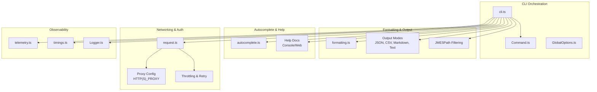
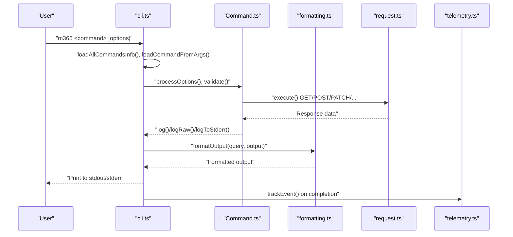
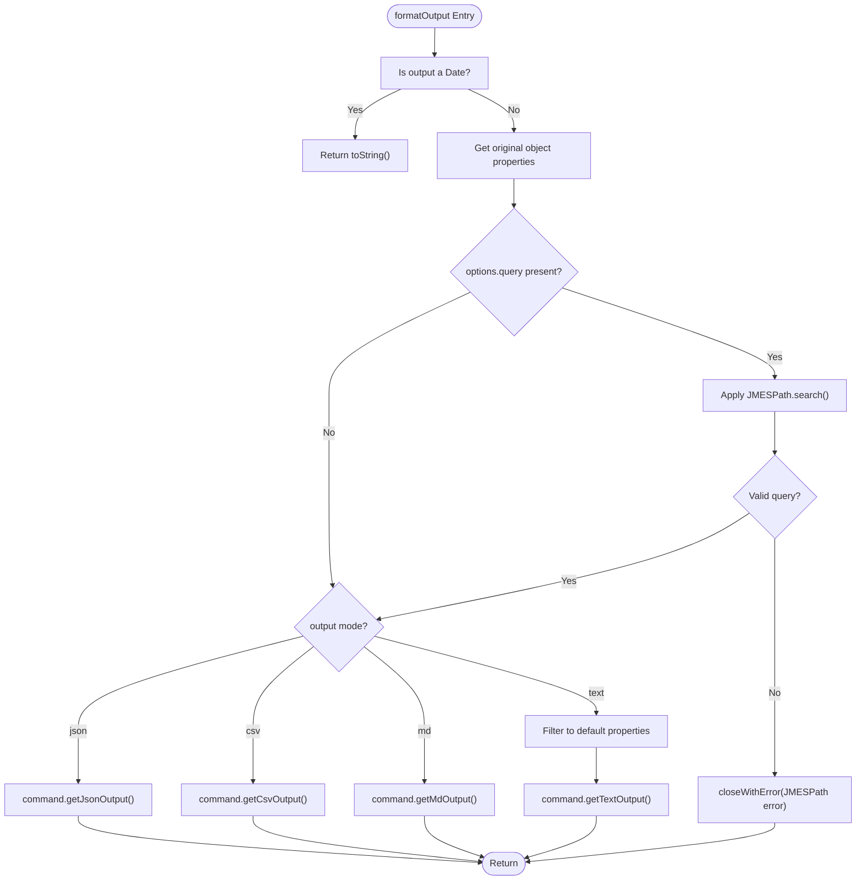
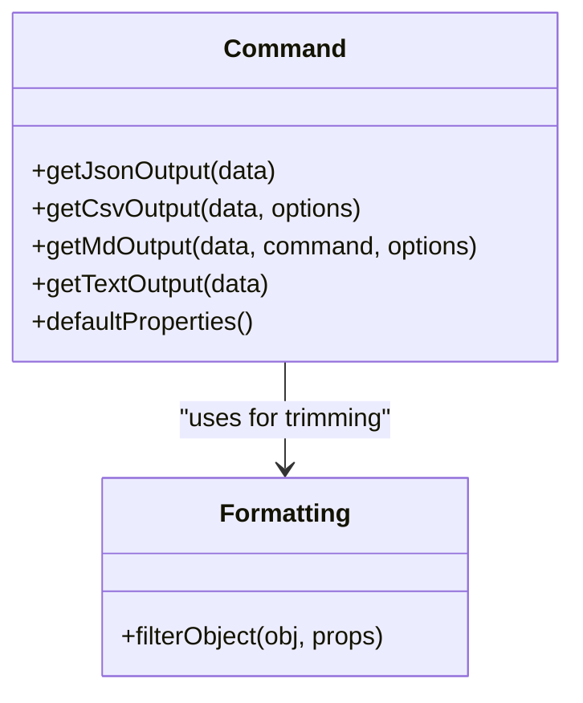
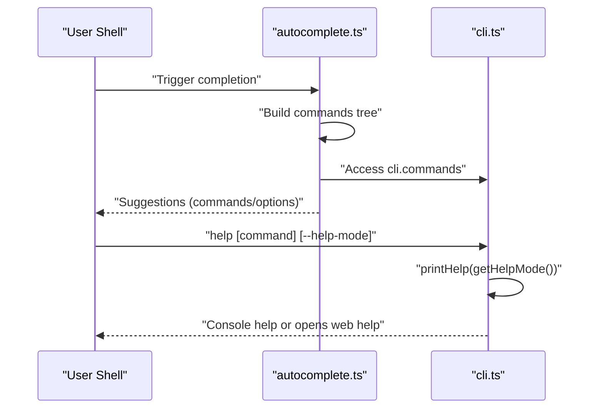
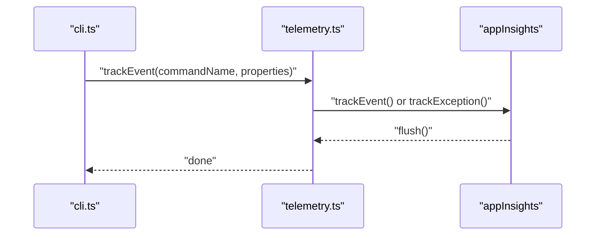
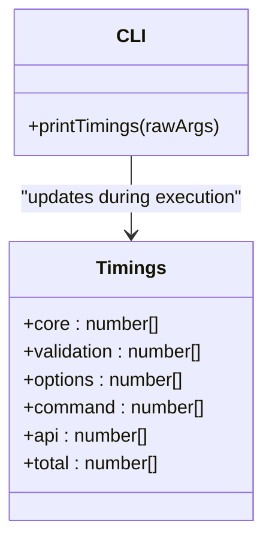
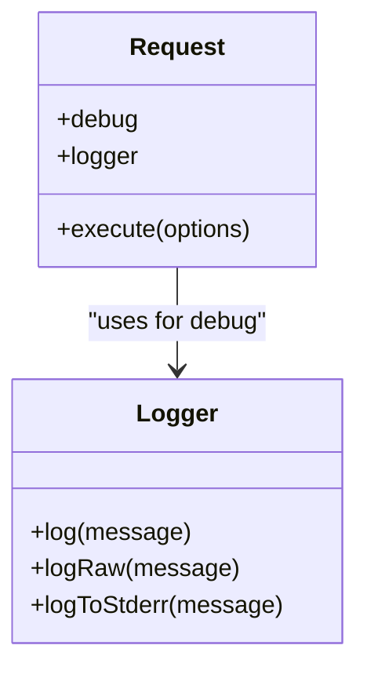
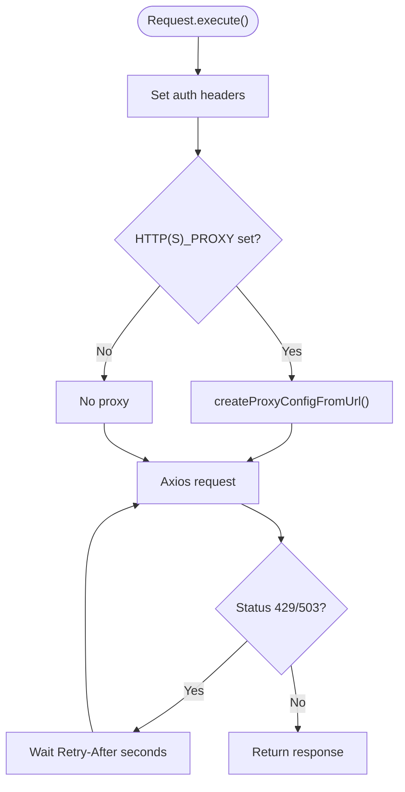
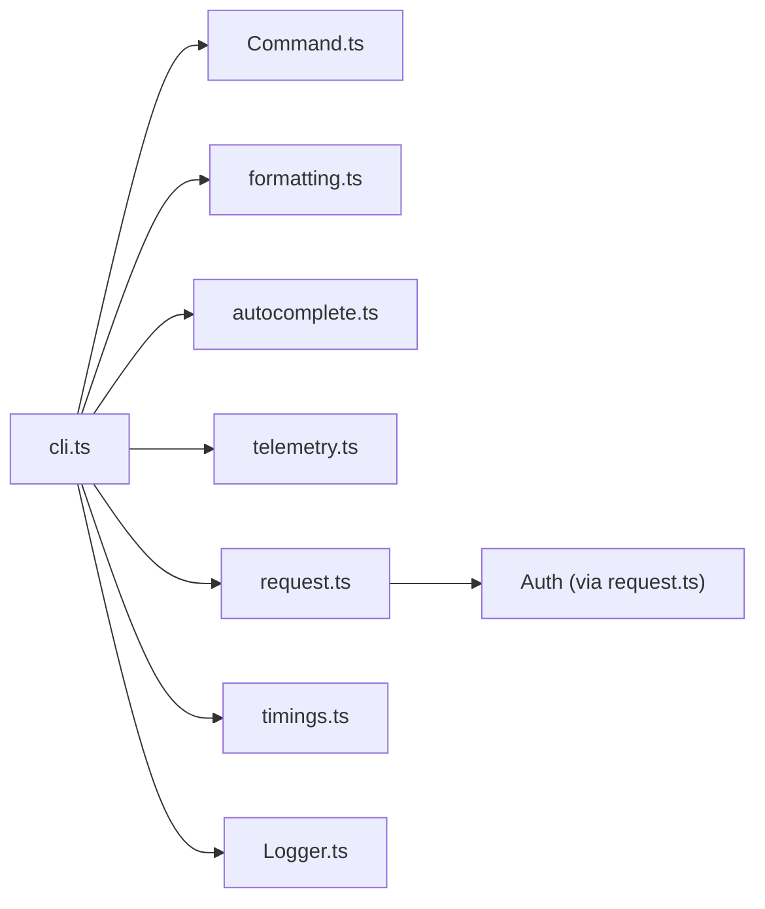

# Advanced Features

<cite>
**Referenced Files in This Document**
- [cli.ts](file://src/cli/cli.ts)
- [Logger.ts](file://src/cli/Logger.ts)
- [timings.ts](file://src/cli/timings.ts)
- [telemetry.ts](file://src/telemetry.ts)
- [autocomplete.ts](file://src/autocomplete.ts)
- [formatting.ts](file://src/utils/formatting.ts)
- [request.ts](file://src/request.ts)
- [Command.ts](file://src/Command.ts)
- [GlobalOptions.ts](file://src/GlobalOptions.ts)
- [docs.mdx](file://docs/docs/user-guide/filter-cli-data.mdx)
- [cli-output-mode.mdx](file://docs/docs/user-guide/cli-output-mode.mdx)
- [completion.mdx](file://docs/docs/user-guide/completion.mdx)
- [using-proxy-url.mdx](file://docs/docs/user-guide/using-proxy-url.mdx)
- [connecting-microsoft-365.mdx](file://docs/docs/user-guide/connecting-microsoft-365.mdx)
- [cli-doctor.mdx](file://docs/docs/cmd/cli/cli-doctor.mdx)
</cite>

## Table of Contents
1. [Introduction](#introduction)
2. [Project Structure](#project-structure)
3. [Core Components](#core-components)
4. [Architecture Overview](#architecture-overview)
5. [Detailed Component Analysis](#detailed-component-analysis)
6. [Dependency Analysis](#dependency-analysis)
7. [Performance Considerations](#performance-considerations)
8. [Troubleshooting Guide](#troubleshooting-guide)
9. [Conclusion](#conclusion)
10. [Appendices](#appendices)

## Introduction
This document provides advanced features documentation for CLI for Microsoft 365. It focuses on JMESPath query filtering, output formatting and response transformation, autocomplete and help enhancements, telemetry and analytics, performance monitoring, debugging and verbose logging, batch and parallel execution patterns, proxy and network configuration, advanced authentication, scripting and automation, and extensibility for custom commands and contributions.

## Project Structure
The CLI is organized around a command-driven architecture with centralized argument parsing, command discovery, output formatting, telemetry, and request handling. Key modules include:
- Command orchestration and execution pipeline
- Output formatting and JMESPath filtering
- Autocomplete generation and shell integration
- Telemetry and usage analytics
- Request abstraction with proxy and throttling support
- Timings and performance metrics
- Help system and documentation integration

**Diagram sources**
- [cli.ts:89-252](file://src/cli/cli.ts#L89-L252)
- [formatting.ts:68-76](file://src/utils/formatting.ts#L68-L76)
- [autocomplete.ts:13-36](file://src/autocomplete.ts#L13-L36)
- [request.ts:14-254](file://src/request.ts#L14-L254)
- [telemetry.ts:7-30](file://src/telemetry.ts#L7-L30)
- [timings.ts:1-8](file://src/cli/timings.ts#L1-L8)
- [Logger.ts:1-14](file://src/cli/Logger.ts#L1-L14)

**Section sources**
- [cli.ts:89-252](file://src/cli/cli.ts#L89-L252)
- [request.ts:14-254](file://src/request.ts#L14-L254)

## Core Components
- Command execution pipeline: parses arguments, resolves command, validates, executes, and formats output.
- Output formatting engine: applies JMESPath queries, trims default properties, and renders JSON, CSV, Markdown, or plain text.
- Autocomplete system: generates shell completions and integrates with omlette/clink.
- Telemetry: tracks events and exceptions with session and shell context.
- Request layer: handles authentication, proxy configuration, throttling, and structured logging.
- Timings: measures core, validation, options processing, command execution, and API latency.

**Section sources**
- [cli.ts:602-705](file://src/cli/cli.ts#L602-L705)
- [formatting.ts:68-76](file://src/utils/formatting.ts#L68-L76)
- [autocomplete.ts:13-36](file://src/autocomplete.ts#L13-L36)
- [telemetry.ts:32-44](file://src/telemetry.ts#L32-L44)
- [request.ts:155-225](file://src/request.ts#L155-L225)
- [timings.ts:1-8](file://src/cli/timings.ts#L1-L8)

## Architecture Overview
The CLI orchestrates command execution, applies output transformations, and integrates with telemetry and help systems. Networking is abstracted via a request layer supporting proxies and throttling.

**Diagram sources**
- [cli.ts:264-309](file://src/cli/cli.ts#L264-L309)
- [cli.ts:602-705](file://src/cli/cli.ts#L602-L705)
- [request.ts:155-225](file://src/request.ts#L155-L225)
- [telemetry.ts:32-44](file://src/telemetry.ts#L32-L44)

## Detailed Component Analysis

### JMESPath Query Filtering and Output Transformation
- JMESPath filtering: applied to structured output when a query is provided, with error handling and guidance links.
- Output modes: JSON (default), CSV, Markdown, and plain text. Trimming to default properties is supported for text output.
- Response transformation: date normalization, object property filtering, and safe coercion of boolean values.

**Diagram sources**
- [cli.ts:602-705](file://src/cli/cli.ts#L602-L705)
- [formatting.ts:68-76](file://src/utils/formatting.ts#L68-L76)

**Section sources**
- [cli.ts:602-705](file://src/cli/cli.ts#L602-L705)
- [formatting.ts:68-76](file://src/utils/formatting.ts#L68-L76)
- [docs.mdx](file://docs/docs/user-guide/filter-cli-data.mdx)

### Output Formatting Options and Response Transformation
- Output modes: JSON, CSV, Markdown, and text. Text mode trims to default properties exposed by the command.
- Error rendering: CommandError instances are colorized for stderr.
- Property filtering: Ensures only declared default properties are included in trimmed output.

**Diagram sources**
- [cli.ts:697-704](file://src/cli/cli.ts#L697-L704)
- [formatting.ts:68-76](file://src/utils/formatting.ts#L68-L76)

**Section sources**
- [cli.ts:674-704](file://src/cli/cli.ts#L674-L704)
- [docs.mdx](file://docs/docs/user-guide/cli-output-mode.mdx)

### Autocomplete Functionality and Command Search
- Autocomplete generation: Builds a commands tree with options and per-option autocompletion hints.
- Shell integrations: Supports bash (omelette), PowerShell, and Windows Clarity (clink) completion scripts.
- Command search: Lists available commands and groups; supports help target selection (console or web).

**Diagram sources**
- [autocomplete.ts:38-92](file://src/autocomplete.ts#L38-L92)
- [autocomplete.ts:181-192](file://src/autocomplete.ts#L181-L192)
- [cli.ts:718-750](file://src/cli/cli.ts#L718-L750)
- [cli.ts:771-798](file://src/cli/cli.ts#L771-L798)

**Section sources**
- [autocomplete.ts:13-36](file://src/autocomplete.ts#L13-L36)
- [autocomplete.ts:94-122](file://src/autocomplete.ts#L94-L122)
- [cli.ts:718-750](file://src/cli/cli.ts#L718-L750)
- [docs.mdx](file://docs/docs/user-guide/completion.mdx)

### Help System Enhancements
- Help modes: options, examples, remarks, permissions, response, full.
- Help targets: console or web. Web opens the online documentation for the selected command.
- Unknown help mode validation and defaults.

**Section sources**
- [cli.ts:50-53](file://src/cli/cli.ts#L50-L53)
- [cli.ts:718-750](file://src/cli/cli.ts#L718-L750)
- [cli.ts:771-798](file://src/cli/cli.ts#L771-L798)
- [cli.ts:752-756](file://src/cli/cli.ts#L752-L756)

### Telemetry and Analytics Collection
- Event tracking: Sends command name and properties with shell and session identifiers.
- Exception tracking: Captures exceptions separately.
- Opt-out: Controlled by a setting to disable telemetry.

**Diagram sources**
- [telemetry.ts:7-30](file://src/telemetry.ts#L7-L30)
- [telemetry.ts:32-44](file://src/telemetry.ts#L32-L44)

**Section sources**
- [telemetry.ts:32-44](file://src/telemetry.ts#L32-L44)

### Performance Monitoring and Usage Tracking
- Timings: Measures core, validation, options processing, command execution, API latency, and total runtime.
- Debug mode: Prints accumulated timings when --debug is used.
- Usage tracking: Telemetry captures command usage and context.

**Diagram sources**
- [timings.ts:1-8](file://src/cli/timings.ts#L1-L8)
- [cli.ts:254-262](file://src/cli/cli.ts#L254-L262)

**Section sources**
- [timings.ts:1-8](file://src/cli/timings.ts#L1-L8)
- [cli.ts:254-262](file://src/cli/cli.ts#L254-L262)

### Debugging Capabilities and Verbose Logging
- Logger interface: Provides log, logRaw, and logToStderr for flexible output routing.
- Request-level debug: Intercepts and logs request/response payloads and errors.
- Verbose output: --debug prints timings; --verbose prints DONE markers on completion.

**Diagram sources**
- [Logger.ts:1-14](file://src/cli/Logger.ts#L1-L14)
- [request.ts:19-71](file://src/request.ts#L19-L71)
- [cli.ts:284-300](file://src/cli/cli.ts#L284-L300)

**Section sources**
- [Logger.ts:1-14](file://src/cli/Logger.ts#L1-L14)
- [request.ts:19-71](file://src/request.ts#L19-L71)
- [cli.ts:284-300](file://src/cli/cli.ts#L284-L300)

### Batch Operations, Parallel Execution, and Optimization
- Parallelization: Not built-in at the CLI level; however, commands can be invoked concurrently from external scripts. Use shell job control or task runners to parallelize invocations.
- Optimization techniques:
  - Use JMESPath to reduce payload size on the client.
  - Prefer CSV or text output for downstream processing.
  - Leverage context configuration to avoid repeated option specification.
  - Enable --debug judiciously for profiling; disable otherwise.

[No sources needed since this section provides general guidance]

### Proxy Configuration and Network Settings
- Proxy support: Reads HTTP_PROXY/HTTPS_PROXY environment variables and configures Axios proxy accordingly, including optional credentials.
- Throttling: Detects 429/503 responses and retries after a delay indicated by Retry-After header.
- Cloud-aware URLs: Adjusts endpoints based on cloud type.

**Diagram sources**
- [request.ts:189-193](file://src/request.ts#L189-L193)
- [request.ts:239-250](file://src/request.ts#L239-L250)
- [request.ts:208-221](file://src/request.ts#L208-L221)

**Section sources**
- [request.ts:189-193](file://src/request.ts#L189-L193)
- [request.ts:239-250](file://src/request.ts#L239-L250)
- [request.ts:208-221](file://src/request.ts#L208-L221)
- [docs.mdx](file://docs/docs/user-guide/using-proxy-url.mdx)

### Advanced Authentication Scenarios
- Access token injection: Authorization header is set automatically for authenticated requests.
- Anonymous requests: Supported via x-anonymous header.
- Resource-aware authentication: Determines resource from URL and ensures access token.
- Connection and cloud type awareness: Endpoint resolution varies by cloud type.

**Section sources**
- [request.ts:166-187](file://src/request.ts#L166-L187)
- [request.ts:227-232](file://src/request.ts#L227-L232)
- [docs.mdx](file://docs/docs/user-guide/connecting-microsoft-365.mdx)

### Scripting Patterns, Automation Workflows, and External Tool Integration
- Scripting patterns: Use output modes (CSV/JSON) for downstream processing with tools like jq, PowerShell, or Python.
- Automation: Combine CLI commands in scripts; leverage context configuration to minimize repeated options.
- Integration: Pipe JSON output to external tools; apply JMESPath for pre-filtering.

[No sources needed since this section provides general guidance]

### Extending CLI Functionality, Custom Commands, and Contributions
- Command creation: Implement a class extending the base command with schema or options/types, and register it under the appropriate module.
- Documentation: Add MDX docs for the new command and include examples and permissions.
- Testing: Follow existing test patterns and ensure coverage.
- Contribution workflow: Use the documented contribution guide and PR checklist.

[No sources needed since this section provides general guidance]

### Advanced Security Considerations, Token Management, and Enterprise Deployment
- Token management: Access tokens are managed centrally; avoid embedding secrets in scripts.
- Secure configuration: Use environment variables and context configuration files judiciously.
- Enterprise deployment: Configure proxies and cloud endpoints appropriately; consider telemetry opt-out policies.

[No sources needed since this section provides general guidance]

## Dependency Analysis
The CLI orchestrator depends on command implementations, formatting utilities, autocomplete registry, telemetry, and request layer. The request layer depends on authentication and environment configuration.

**Diagram sources**
- [cli.ts:89-252](file://src/cli/cli.ts#L89-L252)
- [request.ts:14-254](file://src/request.ts#L14-L254)
- [telemetry.ts:1-44](file://src/telemetry.ts#L1-L44)
- [autocomplete.ts:13-36](file://src/autocomplete.ts#L13-L36)
- [formatting.ts:1-215](file://src/utils/formatting.ts#L1-L215)
- [timings.ts:1-8](file://src/cli/timings.ts#L1-L8)
- [Logger.ts:1-14](file://src/cli/Logger.ts#L1-L14)

**Section sources**
- [cli.ts:89-252](file://src/cli/cli.ts#L89-L252)
- [request.ts:14-254](file://src/request.ts#L14-L254)

## Performance Considerations
- Minimize payload size: Use JMESPath queries to narrow results.
- Choose output mode wisely: CSV/text for large datasets; JSON for structured consumption.
- Reduce overhead: Disable --debug in production runs; rely on telemetry for insights.
- Network efficiency: Configure proxies and ensure proper retry behavior for throttled responses.

[No sources needed since this section provides general guidance]

## Troubleshooting Guide
- Help and diagnostics: Use help modes and targets; open web help for richer context.
- Timings: Run with --debug to inspect timing breakdowns.
- Request debugging: Enable request-level debug to capture request/response payloads and errors.
- Doctor command: Use the dedicated doctor command for environment checks.

**Section sources**
- [cli.ts:718-750](file://src/cli/cli.ts#L718-L750)
- [cli.ts:254-262](file://src/cli/cli.ts#L254-L262)
- [request.ts:29-71](file://src/request.ts#L29-L71)
- [cli-doctor.mdx](file://docs/docs/cmd/cli/cli-doctor.mdx)

## Conclusion
CLI for Microsoft 365 offers robust advanced capabilities for data transformation, output formatting, autocomplete, help, telemetry, and observability. By leveraging JMESPath, structured output modes, proxy-aware networking, and detailed logging, users can build efficient automation and integration workflows. For advanced scenarios, combine CLI commands with external tools and scripts, and follow contribution guidelines to extend functionality safely and effectively.

## Appendices
- Additional user guides and concepts are available in the documentation set for filtering, output modes, completion, proxy usage, and connecting to Microsoft 365.

[No sources needed since this section provides general guidance]