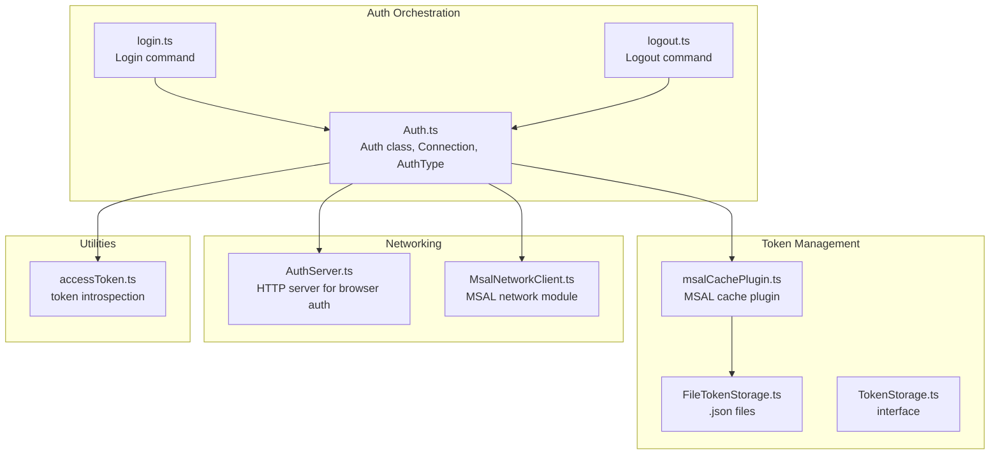
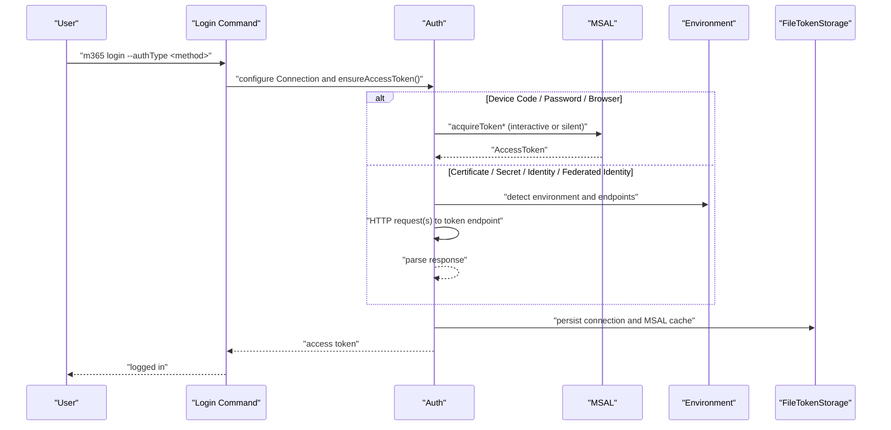
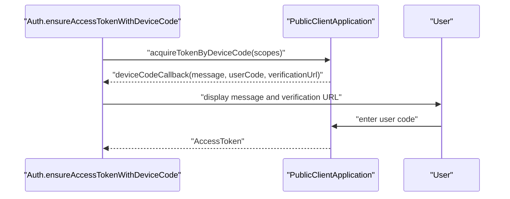
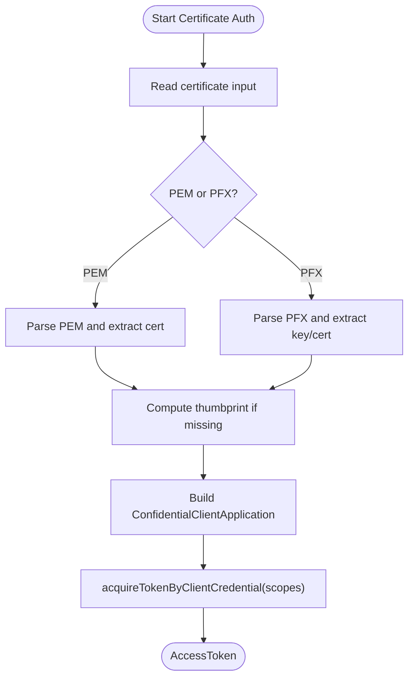
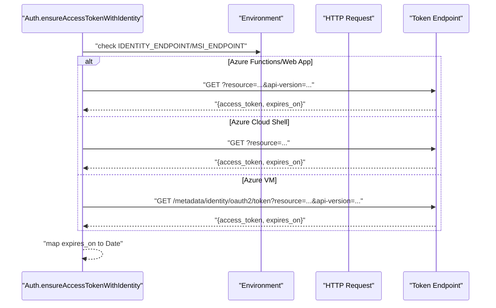
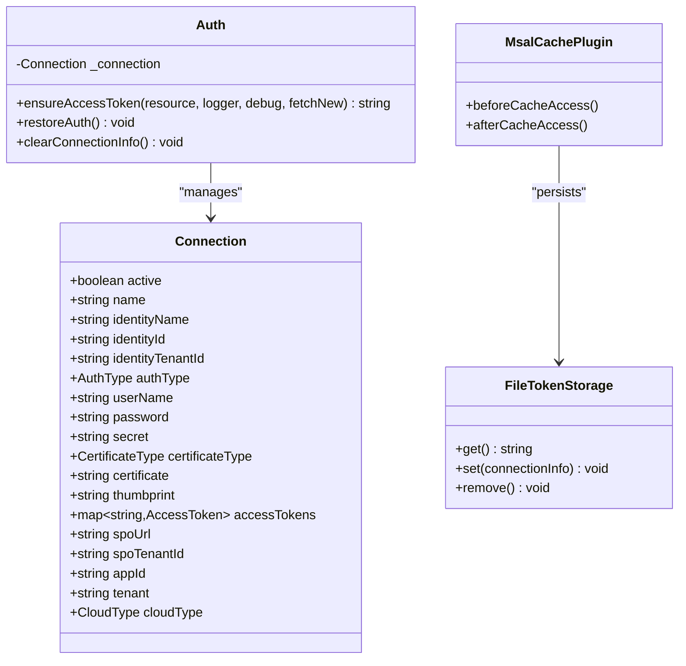
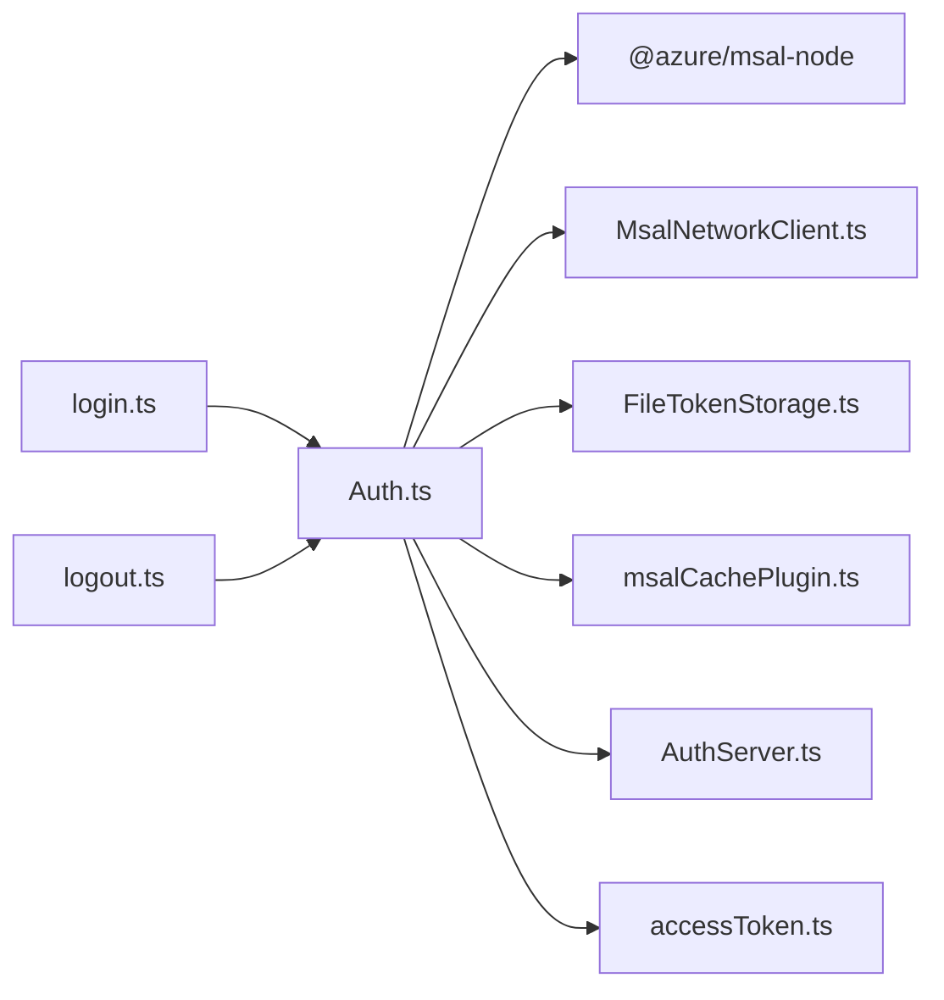

# Authentication & Security

<cite>
**Referenced Files in This Document**
- [Auth.ts](file://src/Auth.ts)
- [login.ts](file://src/m365/commands/login.ts)
- [logout.ts](file://src/m365/commands/logout.ts)
- [AuthServer.ts](file://src/AuthServer.ts)
- [FileTokenStorage.ts](file://src/auth/FileTokenStorage.ts)
- [TokenStorage.ts](file://src/auth/TokenStorage.ts)
- [msalCachePlugin.ts](file://src/auth/msalCachePlugin.ts)
- [MsalNetworkClient.ts](file://src/auth/MsalNetworkClient.ts)
- [accessToken.ts](file://src/utils/accessToken.ts)
</cite>

## Table of Contents
1. [Introduction](#introduction)
2. [Project Structure](#project-structure)
3. [Core Components](#core-components)
4. [Architecture Overview](#architecture-overview)
5. [Detailed Component Analysis](#detailed-component-analysis)
6. [Dependency Analysis](#dependency-analysis)
7. [Performance Considerations](#performance-considerations)
8. [Troubleshooting Guide](#troubleshooting-guide)
9. [Conclusion](#conclusion)
10. [Appendices](#appendices)

## Introduction
This document explains how CLI for Microsoft 365 authenticates to Microsoft Entra ID (formerly Azure AD) and manages tokens securely. It covers all supported authentication methods, the authentication flows, token lifecycle, storage, and security considerations. It also provides guidance for setting up Microsoft Entra ID applications, required permissions, and best practices for developer machines, CI/CD pipelines, and automated scripts.

## Project Structure
Authentication and token management are implemented across several modules:
- Authentication orchestration and flows
- Token storage and caching
- Interactive browser authorization server
- Utility helpers for access token inspection

**Diagram sources**
- [Auth.ts:119-305](file://src/Auth.ts#L119-L305)
- [login.ts:88-248](file://src/m365/commands/login.ts#L88-L248)
- [logout.ts:28-45](file://src/m365/commands/logout.ts#L28-L45)
- [FileTokenStorage.ts:6-17](file://src/auth/FileTokenStorage.ts#L6-L17)
- [TokenStorage.ts:1-5](file://src/auth/TokenStorage.ts#L1-L5)
- [msalCachePlugin.ts:5-33](file://src/auth/msalCachePlugin.ts#L5-L33)
- [AuthServer.ts:28-50](file://src/AuthServer.ts#L28-L50)
- [MsalNetworkClient.ts:5-58](file://src/auth/MsalNetworkClient.ts#L5-L58)
- [accessToken.ts:4-27](file://src/utils/accessToken.ts#L4-L27)

**Section sources**
- [Auth.ts:119-305](file://src/Auth.ts#L119-L305)
- [login.ts:88-248](file://src/m365/commands/login.ts#L88-L248)
- [logout.ts:28-45](file://src/m365/commands/logout.ts#L28-L45)
- [FileTokenStorage.ts:6-17](file://src/auth/FileTokenStorage.ts#L6-L17)
- [TokenStorage.ts:1-5](file://src/auth/TokenStorage.ts#L1-L5)
- [msalCachePlugin.ts:5-33](file://src/auth/msalCachePlugin.ts#L5-L33)
- [AuthServer.ts:28-50](file://src/AuthServer.ts#L28-L50)
- [MsalNetworkClient.ts:5-58](file://src/auth/MsalNetworkClient.ts#L5-L58)
- [accessToken.ts:4-27](file://src/utils/accessToken.ts#L4-L27)

## Core Components
- Auth: Central authentication orchestrator. Manages Connection state, selects and executes authentication flows, stores tokens, and persists connection metadata.
- Connection: Holds current identity, tenant, cloud type, auth method, and cached access tokens per resource.
- AuthServer: Local HTTP server used during browser-based authorization to receive the authorization code.
- FileTokenStorage: Persists MSAL cache and connection details to user home directory files.
- msalCachePlugin: Integrates FileTokenStorage with MSAL’s cache.
- MsalNetworkClient: Bridges MSAL network calls to the CLI’s HTTP client.
- accessToken utilities: Decode and validate access tokens, assert token type (delegated vs application-only).

**Section sources**
- [Auth.ts:47-101](file://src/Auth.ts#L47-L101)
- [Auth.ts:119-305](file://src/Auth.ts#L119-L305)
- [AuthServer.ts:8-37](file://src/AuthServer.ts#L8-L37)
- [FileTokenStorage.ts:6-17](file://src/auth/FileTokenStorage.ts#L6-L17)
- [msalCachePlugin.ts:5-33](file://src/auth/msalCachePlugin.ts#L5-L33)
- [MsalNetworkClient.ts:5-58](file://src/auth/MsalNetworkClient.ts#L5-L58)
- [accessToken.ts:4-27](file://src/utils/accessToken.ts#L4-L27)

## Architecture Overview
The CLI supports multiple authentication methods. At runtime, the Auth class decides which flow to use based on Connection settings and environment. Tokens are cached and reused until expiration. For browser-based flows, a local server receives the authorization code.

**Diagram sources**
- [login.ts:200-248](file://src/m365/commands/login.ts#L200-L248)
- [Auth.ts:197-305](file://src/Auth.ts#L197-L305)
- [msalCachePlugin.ts:8-29](file://src/auth/msalCachePlugin.ts#L8-L29)
- [FileTokenStorage.ts:22-45](file://src/auth/FileTokenStorage.ts#L22-L45)

## Detailed Component Analysis

### Supported Authentication Methods
- Device Code: Interactive device code flow via MSAL. The CLI prints a code and optionally opens a browser automatically.
- Username/Password: Resource Owner Password Credentials (ROPC) flow. Requires a tenant set to organizations and is discouraged for most scenarios.
- Certificate: Client certificate authentication using a PEM or PFX. Thumbprint is derived and cached.
- Client Secret: Confidential client with client secret.
- Azure Managed Identity: Uses environment-provided endpoints to exchange workload identity for an access token.
- Federated Identity: GitHub Actions and Azure DevOps OIDC exchanges to obtain a federated token and exchange it for an Entra ID access token.
- Browser: Interactive browser authorization using a local HTTP server to capture the authorization code.

**Section sources**
- [Auth.ts:103-111](file://src/Auth.ts#L103-L111)
- [Auth.ts:244-266](file://src/Auth.ts#L244-L266)
- [login.ts:13-35](file://src/m365/commands/login.ts#L13-L35)
- [login.ts:210-236](file://src/m365/commands/login.ts#L210-L236)

### Authentication Flows

#### Device Code Flow
- Initializes a DeviceCodeRequest with scopes for the target resource.
- Prints the device code and verification URL; optionally copies code to clipboard and auto-opens the browser based on settings.
- On success, MSAL returns an AccessToken which is stored and used for subsequent requests.

**Diagram sources**
- [Auth.ts:440-452](file://src/Auth.ts#L440-L452)
- [Auth.ts:454-480](file://src/Auth.ts#L454-L480)

**Section sources**
- [Auth.ts:440-480](file://src/Auth.ts#L440-L480)

#### Username/Password Flow
- Uses acquireTokenByUsernamePassword with configured username and password.
- Tenant must be organizations for this flow.

**Section sources**
- [Auth.ts:482-492](file://src/Auth.ts#L482-L492)
- [login.ts:60-67](file://src/m365/commands/login.ts#L60-L67)

#### Certificate Flow
- Supports PEM and PFX inputs. If unknown, attempts PEM parse and falls back to PFX.
- Derives thumbprint if not provided and constructs a confidential client with the certificate.
- Uses acquireTokenByClientCredential for app-only tokens.

**Diagram sources**
- [Auth.ts:494-568](file://src/Auth.ts#L494-L568)

**Section sources**
- [Auth.ts:494-568](file://src/Auth.ts#L494-L568)

#### Client Secret Flow
- Builds a confidential client with clientSecret and requests an app-only token.

**Section sources**
- [Auth.ts:253-265](file://src/Auth.ts#L253-L265)
- [Auth.ts:563-567](file://src/Auth.ts#L563-L567)

#### Azure Managed Identity Flow
- Detects environment variables for Azure Functions/Web Apps or Azure Cloud Shell or falls back to IMDS.
- Supports user-assigned identities via client_id or principal_id (object_id).
- Returns AccessToken parsed from the response.

**Diagram sources**
- [Auth.ts:570-703](file://src/Auth.ts#L570-L703)

**Section sources**
- [Auth.ts:570-703](file://src/Auth.ts#L570-L703)

#### Federated Identity Flow
- GitHub Actions: Uses ACTIONS_ID_TOKEN_REQUEST_URL and ACTIONS_ID_TOKEN_REQUEST_TOKEN to obtain a federated token, then exchanges it for an Entra ID access token.
- Azure DevOps: Uses SYSTEM_OIDCREQUESTURI and SYSTEM_ACCESSTOKEN; supports optional service connection overrides for appId and tenant.

**Section sources**
- [Auth.ts:705-761](file://src/Auth.ts#L705-L761)
- [Auth.ts:763-781](file://src/Auth.ts#L763-L781)
- [Auth.ts:783-800](file://src/Auth.ts#L783-L800)

#### Browser Flow
- Starts a local HTTP server and opens the authorization URL.
- Receives the authorization code and exchanges it for an access token using MSAL.

**Section sources**
- [AuthServer.ts:28-50](file://src/AuthServer.ts#L28-L50)
- [AuthServer.ts:68-125](file://src/AuthServer.ts#L68-L125)
- [Auth.ts:402-417](file://src/Auth.ts#L402-L417)

### Token Management and Storage
- Access tokens are cached per resource in the Connection object and marked active upon successful acquisition.
- MSAL cache is persisted to disk via a cache plugin backed by FileTokenStorage.
- Connection details (including identity and app identifiers) are persisted separately.

**Diagram sources**
- [Auth.ts:47-101](file://src/Auth.ts#L47-L101)
- [Auth.ts:182-195](file://src/Auth.ts#L182-L195)
- [FileTokenStorage.ts:6-17](file://src/auth/FileTokenStorage.ts#L6-L17)
- [msalCachePlugin.ts:5-33](file://src/auth/msalCachePlugin.ts#L5-L33)

**Section sources**
- [Auth.ts:197-305](file://src/Auth.ts#L197-L305)
- [Auth.ts:182-195](file://src/Auth.ts#L182-L195)
- [FileTokenStorage.ts:22-45](file://src/auth/FileTokenStorage.ts#L22-L45)
- [msalCachePlugin.ts:8-29](file://src/auth/msalCachePlugin.ts#L8-L29)

### Token Refresh and Silent Acquisition
- If a cached account matches the active identity and the connection is active, the library attempts silent acquisition first.
- Silent acquisition uses acquireTokenSilent with forceRefresh when requested.

**Section sources**
- [Auth.ts:237-241](file://src/Auth.ts#L237-L241)
- [Auth.ts:419-438](file://src/Auth.ts#L419-L438)

### Access Token Utilities
- Decode JWT claims (tenant, user/object ID, scopes).
- Assert token type: delegated vs application-only.

**Section sources**
- [accessToken.ts:4-27](file://src/utils/accessToken.ts#L4-L27)
- [accessToken.ts:144-157](file://src/utils/accessToken.ts#L144-L157)

## Dependency Analysis
- Auth depends on MSAL for interactive and silent flows, on environment variables for managed identity and federated identity, and on the CLI’s HTTP client for network operations.
- Token persistence relies on FileTokenStorage and the MSAL cache plugin.
- Browser flow depends on a local HTTP server and the system browser.

**Diagram sources**
- [Auth.ts:1-18](file://src/Auth.ts#L1-L18)
- [MsalNetworkClient.ts:1-3](file://src/auth/MsalNetworkClient.ts#L1-L3)
- [FileTokenStorage.ts:1-4](file://src/auth/FileTokenStorage.ts#L1-L4)
- [msalCachePlugin.ts:1-3](file://src/auth/msalCachePlugin.ts#L1-L3)
- [AuthServer.ts:1-6](file://src/AuthServer.ts#L1-L6)
- [accessToken.ts:1-2](file://src/utils/accessToken.ts#L1-L2)
- [login.ts:1-11](file://src/m365/commands/login.ts#L1-L11)
- [logout.ts:1-5](file://src/m365/commands/logout.ts#L1-L5)

**Section sources**
- [Auth.ts:1-18](file://src/Auth.ts#L1-L18)
- [login.ts:1-11](file://src/m365/commands/login.ts#L1-L11)
- [logout.ts:1-5](file://src/m365/commands/logout.ts#L1-L5)

## Performance Considerations
- Silent token acquisition avoids network roundtrips when a valid account is cached and active.
- Certificate and secret flows avoid browser interactions, reducing latency.
- Managed identity and federated identity flows rely on environment endpoints; ensure minimal retries and handle timeouts gracefully.
- Persisting MSAL cache reduces repeated authentication overhead.

[No sources needed since this section provides general guidance]

## Troubleshooting Guide
Common issues and resolutions:
- No access token found or wrong token type: Use access token utilities to assert token type and scopes.
- Managed Identity errors: When using user-assigned identities, try principal_id if client_id fails; ensure the identity is assigned to the resource.
- Browser auth failures: If the system browser cannot be opened, retry with a different auth method or use device code.
- Expired or missing tokens: Use the ensure flag to force re-authentication; silent acquisition is attempted first when conditions match.

**Section sources**
- [accessToken.ts:144-157](file://src/utils/accessToken.ts#L144-L157)
- [Auth.ts:652-702](file://src/Auth.ts#L652-L702)
- [AuthServer.ts:52-66](file://src/AuthServer.ts#L52-L66)
- [login.ts:114-170](file://src/m365/commands/login.ts#L114-L170)

## Conclusion
CLI for Microsoft 365 provides robust, secure authentication across diverse environments. By leveraging MSAL for interactive flows, environment-aware endpoints for managed identity and federated identity, and persistent token storage, it balances usability and security. Follow the best practices below to configure applications and permissions appropriately for your deployment scenario.

[No sources needed since this section summarizes without analyzing specific files]

## Appendices

### Microsoft Entra ID Application Registration and Permissions
- Choose the appropriate authentication method for your scenario:
  - Device Code: Public client with delegated permissions.
  - Username/Password: Requires admin consent and is generally discouraged.
  - Certificate: Confidential client with app-only permissions.
  - Client Secret: Confidential client with app-only permissions.
  - Managed Identity: Grant the identity appropriate Entra ID app roles or API permissions.
  - Federated Identity: Configure OIDC identity providers (GitHub Actions/Azure DevOps) and map to Entra ID app roles.
- Assign API permissions in the Entra ID app registration and grant admin consent where required.
- For app-only scenarios, ensure the app has the necessary application permissions; for user-driven actions, use delegated permissions.

[No sources needed since this section provides general guidance]

### Best Practices by Deployment Scenario
- Developer machines:
  - Prefer Device Code for interactive sessions.
  - Use Certificate or Client Secret for automation scripts.
- CI/CD pipelines:
  - Use Managed Identity for Azure-hosted agents.
  - Use Federated Identity for GitHub Actions or Azure DevOps with OIDC.
- Automated scripts:
  - Use Certificate or Client Secret for on-premises or non-Azure environments.
  - Ensure secrets are stored securely (environment variables or secret managers).

[No sources needed since this section provides general guidance]