# Configuration & Management

<cite>
**Referenced Files in This Document**
- [config.ts](file://src/config.ts)
- [settingsNames.ts](file://src/settingsNames.ts)
- [_clisettings.mdx](file://docs/docs/_clisettings.mdx)
- [configuring-cli.mdx](file://docs/docs/user-guide/configuring-cli.mdx)
- [connecting-microsoft-365.mdx](file://docs/docs/user-guide/connecting-microsoft-365.mdx)
- [using-cli-context.mdx](file://docs/docs/user-guide/using-cli-context.mdx)
- [using-proxy-url.mdx](file://docs/docs/user-guide/using-proxy-url.mdx)
- [completion.mdx](file://docs/docs/user-guide/completion.mdx)
- [commands.ts (CLI)](file://src/m365/cli/commands.ts)
- [commands.ts (Connection)](file://src/m365/connection/commands.ts)
- [commands.ts (Context)](file://src/m365/context/commands.ts)
- [fsUtil.ts](file://src/utils/fsUtil.ts)
- [app.ts](file://src/utils/app.ts)
</cite>

## Table of Contents
1. [Introduction](#introduction)
2. [Project Structure](#project-structure)
3. [Core Components](#core-components)
4. [Architecture Overview](#architecture-overview)
5. [Detailed Component Analysis](#detailed-component-analysis)
6. [Dependency Analysis](#dependency-analysis)
7. [Performance Considerations](#performance-considerations)
8. [Troubleshooting Guide](#troubleshooting-guide)
9. [Conclusion](#conclusion)
10. [Appendices](#appendices)

## Introduction
This document provides comprehensive configuration and management guidance for CLI for Microsoft 365. It covers connection management, context switching, persistent settings, connection profiles, multi-tenant management, and connection switching workflows. It also details context management, option setting, context initialization, and environment-specific configurations. Configuration commands such as app management, completion setup, and consent operations are explained alongside configuration persistence, settings storage, and environment variable usage. Guidance is included for proxy configuration, output formatting preferences, and global CLI behavior customization, with best practices for team and enterprise environments.

## Project Structure
The CLI organizes configuration and management capabilities across:
- User-facing documentation for configuration, connecting, context, proxy, and completion
- Command registries for CLI, connection, and context management
- Settings metadata and constants
- Utilities for filesystem operations and application metadata

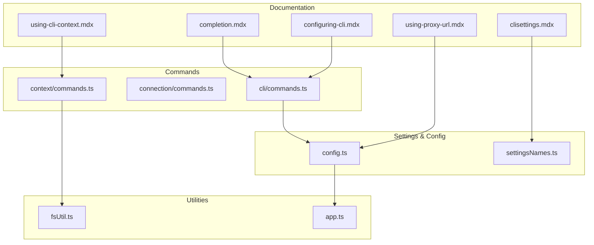

**Diagram sources**
- [configuring-cli.mdx](file://docs/docs/user-guide/configuring-cli.mdx)
- [using-cli-context.mdx](file://docs/docs/user-guide/using-cli-context.mdx)
- [using-proxy-url.mdx](file://docs/docs/user-guide/using-proxy-url.mdx)
- [completion.mdx](file://docs/docs/user-guide/completion.mdx)
- [_clisettings.mdx](file://docs/docs/_clisettings.mdx)
- [commands.ts (CLI)](file://src/m365/cli/commands.ts)
- [commands.ts (Connection)](file://src/m365/connection/commands.ts)
- [commands.ts (Context)](file://src/m365/context/commands.ts)
- [config.ts](file://src/config.ts)
- [settingsNames.ts](file://src/settingsNames.ts)
- [fsUtil.ts](file://src/utils/fsUtil.ts)
- [app.ts](file://src/utils/app.ts)

**Section sources**
- [configuring-cli.mdx](file://docs/docs/user-guide/configuring-cli.mdx)
- [using-cli-context.mdx](file://docs/docs/user-guide/using-cli-context.mdx)
- [using-proxy-url.mdx](file://docs/docs/user-guide/using-proxy-url.mdx)
- [completion.mdx](file://docs/docs/user-guide/completion.mdx)
- [_clisettings.mdx](file://docs/docs/_clisettings.mdx)
- [commands.ts (CLI)](file://src/m365/cli/commands.ts)
- [commands.ts (Connection)](file://src/m365/connection/commands.ts)
- [commands.ts (Context)](file://src/m365/context/commands.ts)
- [config.ts](file://src/config.ts)
- [settingsNames.ts](file://src/settingsNames.ts)
- [fsUtil.ts](file://src/utils/fsUtil.ts)
- [app.ts](file://src/utils/app.ts)

## Core Components
- CLI configuration commands registry: Provides standardized command names for configuration, completion, consent, and diagnostics.
- Connection commands registry: Provides standardized command names for listing, removing, setting, and using connections.
- Context commands registry: Provides standardized command names for initializing context, listing options, setting options, and removing options.
- Settings metadata: Defines the canonical names of configuration keys used across the CLI.
- Application configuration: Centralizes application-scoped settings such as scopes, application name, and configstore identifier.

Key responsibilities:
- Normalize command names for consistent discovery and routing.
- Define configuration keys for reliable persistence and environment-specific behavior.
- Provide application-level configuration for scopes and storage identifiers.

**Section sources**
- [commands.ts (CLI)](file://src/m365/cli/commands.ts)
- [commands.ts (Connection)](file://src/m365/connection/commands.ts)
- [commands.ts (Context)](file://src/m365/context/commands.ts)
- [settingsNames.ts](file://src/settingsNames.ts)
- [config.ts](file://src/config.ts)

## Architecture Overview
The configuration and management architecture integrates user-facing documentation, command registries, settings metadata, and utilities to deliver a cohesive CLI experience.

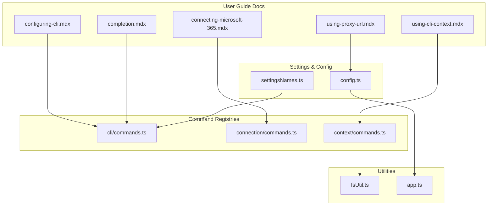

**Diagram sources**
- [configuring-cli.mdx](file://docs/docs/user-guide/configuring-cli.mdx)
- [connecting-microsoft-365.mdx](file://docs/docs/user-guide/connecting-microsoft-365.mdx)
- [using-cli-context.mdx](file://docs/docs/user-guide/using-cli-context.mdx)
- [using-proxy-url.mdx](file://docs/docs/user-guide/using-proxy-url.mdx)
- [completion.mdx](file://docs/docs/user-guide/completion.mdx)
- [commands.ts (CLI)](file://src/m365/cli/commands.ts)
- [commands.ts (Connection)](file://src/m365/connection/commands.ts)
- [commands.ts (Context)](file://src/m365/context/commands.ts)
- [settingsNames.ts](file://src/settingsNames.ts)
- [config.ts](file://src/config.ts)
- [fsUtil.ts](file://src/utils/fsUtil.ts)
- [app.ts](file://src/utils/app.ts)

## Detailed Component Analysis

### CLI Configuration Commands
The CLI configuration command registry defines the canonical command names for configuration management, completion setup, consent operations, and diagnostics. These names are used across the CLI to discover and route commands consistently.

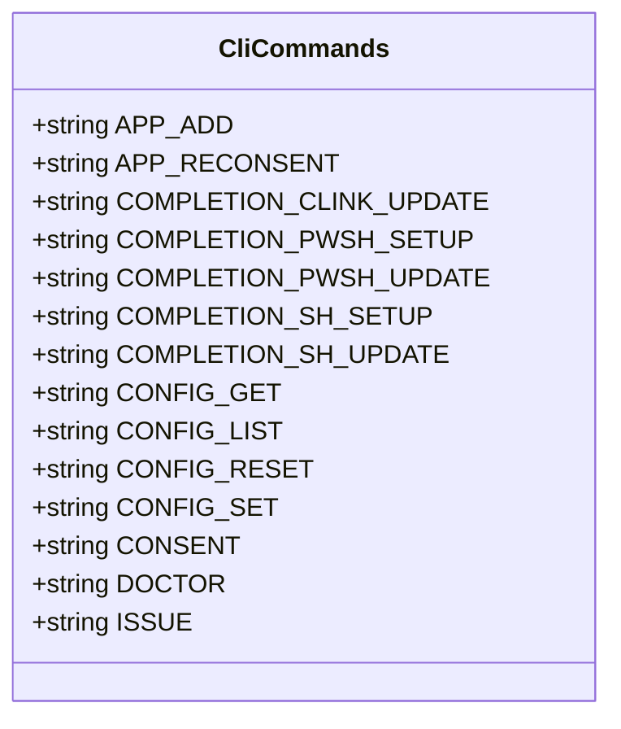

**Diagram sources**
- [commands.ts (CLI)](file://src/m365/cli/commands.ts)

**Section sources**
- [commands.ts (CLI)](file://src/m365/cli/commands.ts)

### Connection Management Commands
The connection command registry provides standardized command names for managing connections, including listing, removing, setting, and switching connections.

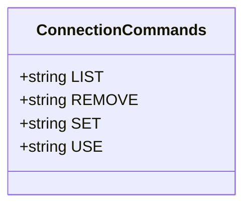

**Diagram sources**
- [commands.ts (Connection)](file://src/m365/connection/commands.ts)

**Section sources**
- [commands.ts (Connection)](file://src/m365/connection/commands.ts)

### Context Management Commands
The context command registry provides standardized command names for initializing context, listing options, setting options, and removing options.

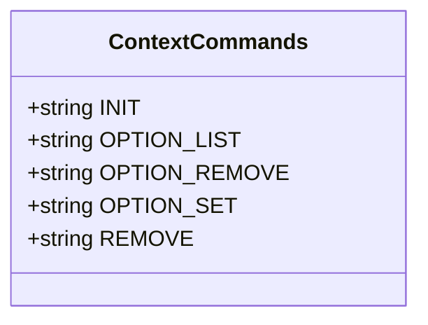

**Diagram sources**
- [commands.ts (Context)](file://src/m365/context/commands.ts)

**Section sources**
- [commands.ts (Context)](file://src/m365/context/commands.ts)

### Settings Metadata and Persistence
Settings metadata defines the canonical names of configuration keys used across the CLI. The configuration guide documents where settings are persisted and how to reset them.

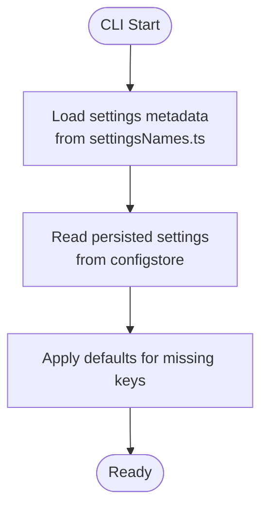

**Diagram sources**
- [settingsNames.ts](file://src/settingsNames.ts)
- [configuring-cli.mdx](file://docs/docs/user-guide/configuring-cli.mdx)

**Section sources**
- [settingsNames.ts](file://src/settingsNames.ts)
- [configuring-cli.mdx](file://docs/docs/user-guide/configuring-cli.mdx)
- [_clisettings.mdx](file://docs/docs/_clisettings.mdx)

### Application Configuration and Scopes
Application configuration centralizes application-scoped settings such as supported scopes, application name, and configstore identifier. The application name is derived from the package manifest.

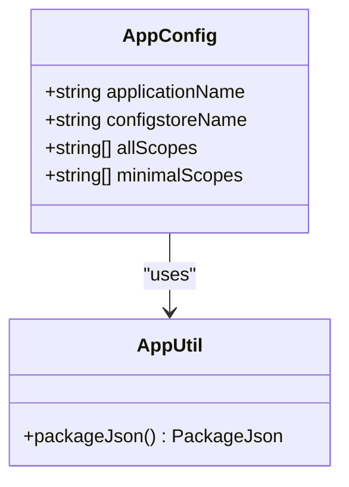

**Diagram sources**
- [config.ts](file://src/config.ts)
- [app.ts](file://src/utils/app.ts)

**Section sources**
- [config.ts](file://src/config.ts)
- [app.ts](file://src/utils/app.ts)

### Context Initialization and Option Setting
Context management allows saving options in a local configuration file and using them across commands. The documentation explains initialization, option setting, removal, and precedence rules.

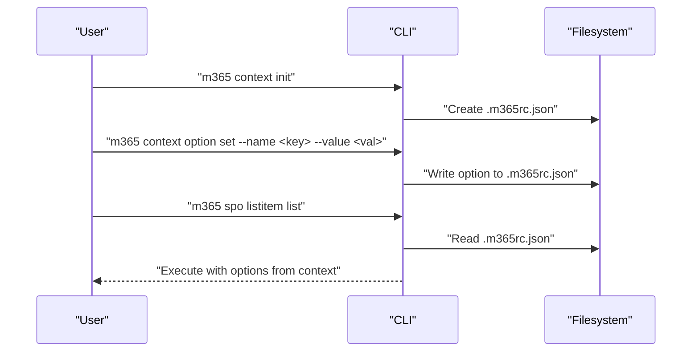

**Diagram sources**
- [using-cli-context.mdx](file://docs/docs/user-guide/using-cli-context.mdx)
- [commands.ts (Context)](file://src/m365/context/commands.ts)
- [fsUtil.ts](file://src/utils/fsUtil.ts)

**Section sources**
- [using-cli-context.mdx](file://docs/docs/user-guide/using-cli-context.mdx)
- [commands.ts (Context)](file://src/m365/context/commands.ts)
- [fsUtil.ts](file://src/utils/fsUtil.ts)

### Connection Profiles, Multi-Tenant Management, and Switching Workflows
The connecting guide explains login methods, environment variables, and persisted connections. It also covers proxy configuration and multi-tenant considerations.

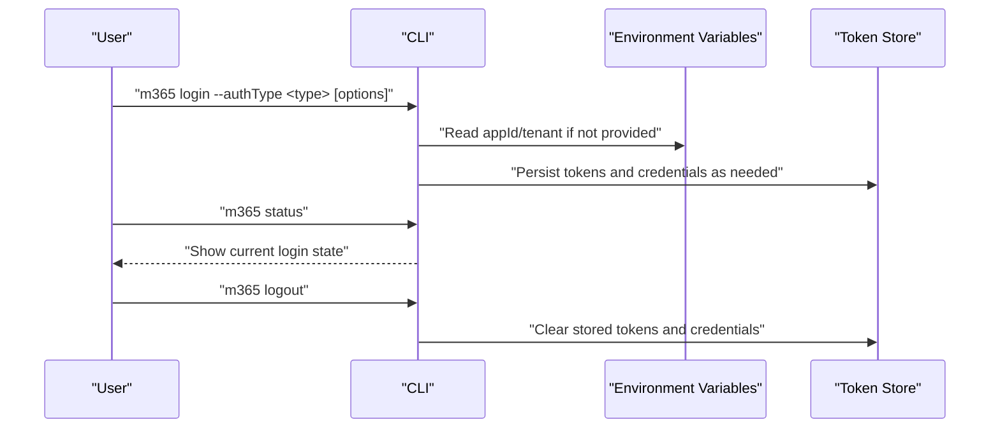

**Diagram sources**
- [connecting-microsoft-365.mdx](file://docs/docs/user-guide/connecting-microsoft-365.mdx)

**Section sources**
- [connecting-microsoft-365.mdx](file://docs/docs/user-guide/connecting-microsoft-365.mdx)

### Completion Setup and Updates
Completion setup varies by shell. The completion guide documents enabling, updating, and disabling completion for Clink, Zsh/Bash/Fish, and PowerShell.

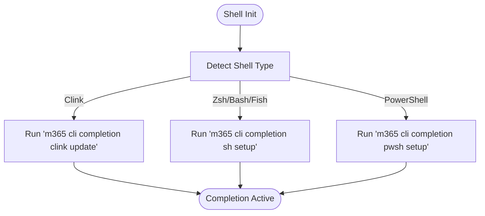

**Diagram sources**
- [completion.mdx](file://docs/docs/user-guide/completion.mdx)
- [commands.ts (CLI)](file://src/m365/cli/commands.ts)

**Section sources**
- [completion.mdx](file://docs/docs/user-guide/completion.mdx)
- [commands.ts (CLI)](file://src/m365/cli/commands.ts)

### Consent Operations
Consent operations are exposed via CLI commands for managing application consent and re-consent scenarios.

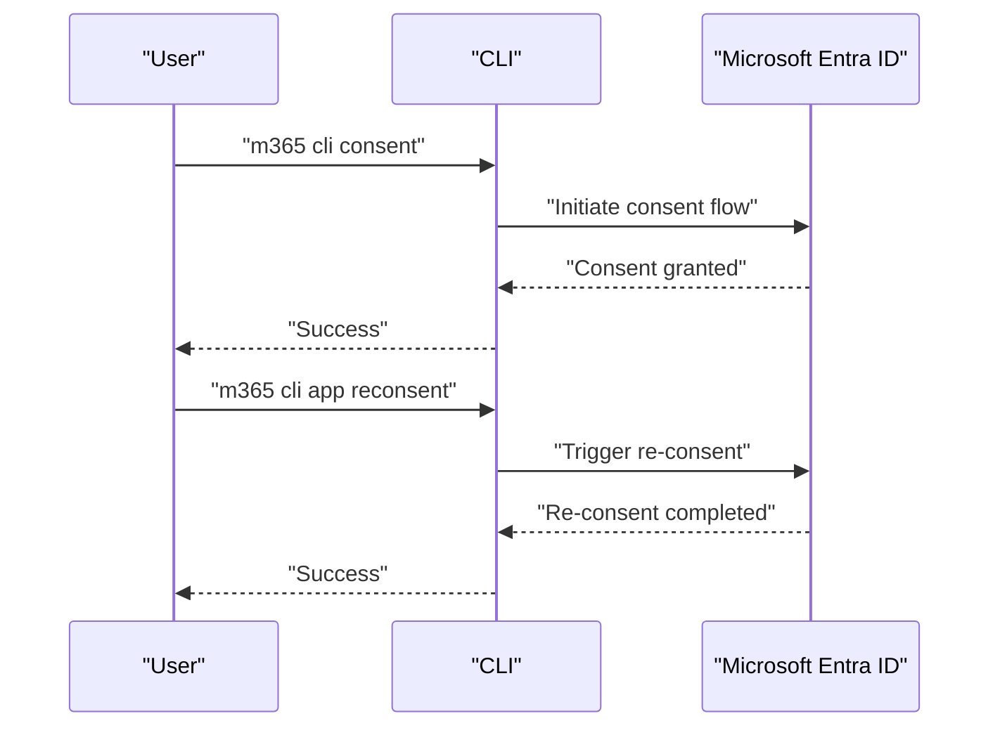

**Diagram sources**
- [commands.ts (CLI)](file://src/m365/cli/commands.ts)

**Section sources**
- [commands.ts (CLI)](file://src/m365/cli/commands.ts)

## Dependency Analysis
The configuration and management subsystems depend on:
- Settings metadata for consistent key names
- Command registries for command discovery and routing
- Application configuration for scopes and storage identifiers
- Filesystem utilities for context file operations
- Environment variables for authentication and proxy configuration

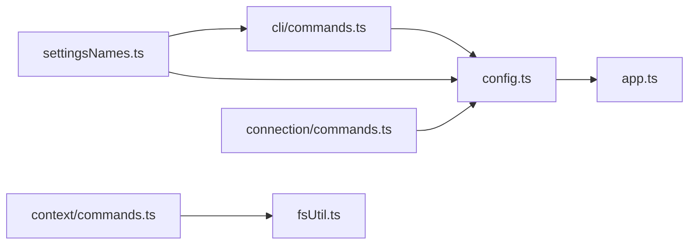

**Diagram sources**
- [settingsNames.ts](file://src/settingsNames.ts)
- [commands.ts (CLI)](file://src/m365/cli/commands.ts)
- [commands.ts (Connection)](file://src/m365/connection/commands.ts)
- [commands.ts (Context)](file://src/m365/context/commands.ts)
- [config.ts](file://src/config.ts)
- [app.ts](file://src/utils/app.ts)
- [fsUtil.ts](file://src/utils/fsUtil.ts)

**Section sources**
- [settingsNames.ts](file://src/settingsNames.ts)
- [commands.ts (CLI)](file://src/m365/cli/commands.ts)
- [commands.ts (Connection)](file://src/m365/connection/commands.ts)
- [commands.ts (Context)](file://src/m365/context/commands.ts)
- [config.ts](file://src/config.ts)
- [app.ts](file://src/utils/app.ts)
- [fsUtil.ts](file://src/utils/fsUtil.ts)

## Performance Considerations
- Prefer environment variables for authentication to avoid repeated prompting and reduce interactive overhead.
- Use context to minimize option repetition and reduce command parsing overhead.
- Keep completion files updated to avoid stale suggestions and improve shell responsiveness.
- Leverage persisted connections to avoid frequent token acquisition and re-authentication.

## Troubleshooting Guide
Common configuration issues and resolutions:
- Settings not applying: Verify settings persistence location and reset by removing the configuration file or specific keys.
- Proxy connectivity issues: Set HTTP_PROXY or HTTPS_PROXY environment variables as documented.
- Completion not working: Re-run setup/update commands for the specific shell and restart the shell.
- Context conflicts: When the same option is provided in context and command, the command-level value takes precedence.
- Resetting configuration: Remove the configuration file or specific keys to restore defaults.

**Section sources**
- [configuring-cli.mdx](file://docs/docs/user-guide/configuring-cli.mdx)
- [using-proxy-url.mdx](file://docs/docs/user-guide/using-proxy-url.mdx)
- [completion.mdx](file://docs/docs/user-guide/completion.mdx)
- [using-cli-context.mdx](file://docs/docs/user-guide/using-cli-context.mdx)

## Conclusion
CLI for Microsoft 365 provides robust configuration and management capabilities through standardized command registries, settings metadata, and comprehensive documentation. By leveraging context, environment variables, and completion, users can streamline workflows and maintain consistent behavior across environments. The guidance in this document helps teams and enterprises adopt best practices for configuration management, ensuring reliability, security, and scalability.

## Appendices

### Configuration Keys Reference
- authType: Default login method when running login without the --authType option.
- autoOpenLinksInBrowser: Automatically open the browser for commands returning a URL.
- clientId: ID of the default Entra ID app used by the CLI to authenticate.
- clientSecret: Secret of the default Entra ID app used by the CLI to authenticate.
- clientCertificateFile: Path to the file containing the client certificate to use for authentication.
- clientCertificateBase64Encoded: Base64-encoded client certificate contents.
- clientCertificatePassword: Password to the client certificate file.
- copyDeviceCodeToClipboard: Automatically copy the device code to the clipboard when running login in device code mode.
- csvEscape: Single character used for escaping in CSV output.
- csvHeader: Display the column names on the first line in CSV output.
- csvQuote: The quote character surrounding a field in CSV output.
- csvQuoted: Quote all non-empty fields even if not required in CSV output.
- csvQuotedEmpty: Quote empty strings and override quoted_string on empty strings when defined in CSV output.
- disableTelemetry: Disables sending of telemetry data.
- errorOutput: Defines if errors should be written to stdout or stderr.
- helpMode: Defines what part of command's help to display.
- helpTarget: Defines the way the command help will be shown.
- output: Defines the default output when issuing a command.
- printErrorsAsPlainText: When output mode is set to json, print error messages as plain-text rather than JSON.
- prompt: Prompts for missing values in required options and enables interactive selection.
- promptListPageSize: Controls how many choices appear on the screen at once for paginated prompts.
- showHelpOnFailure: Automatically display help when executing a command fails.
- tenantId: ID of the default tenant to use when authenticating.

**Section sources**
- [_clisettings.mdx](file://docs/docs/_clisettings.mdx)