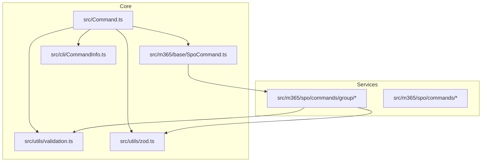
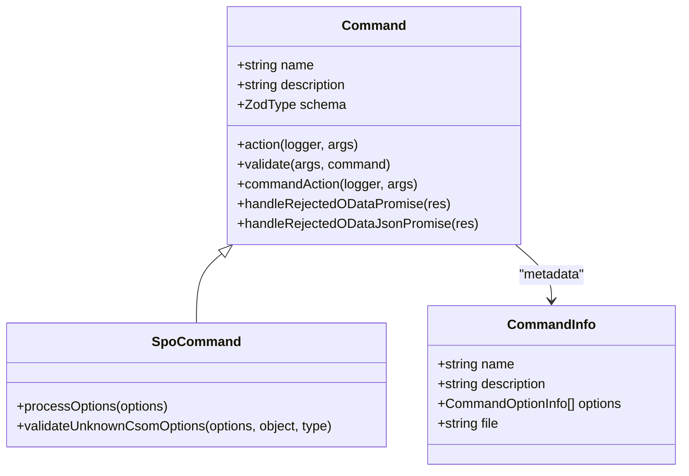
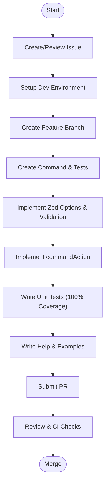
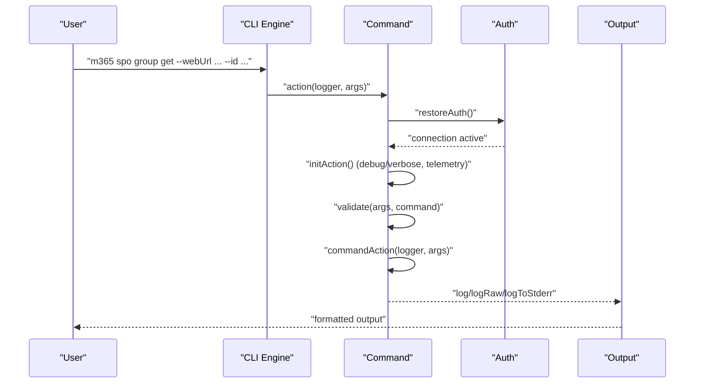
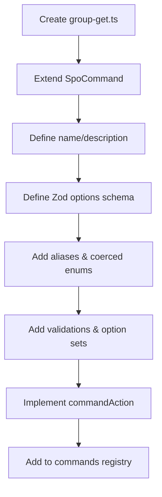
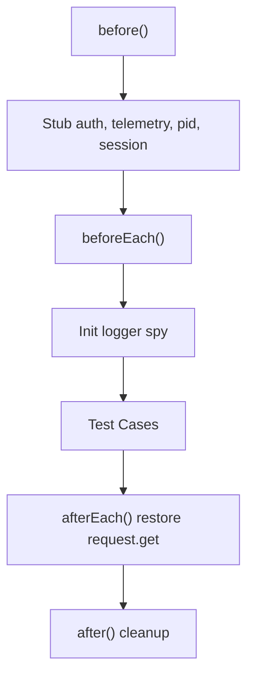
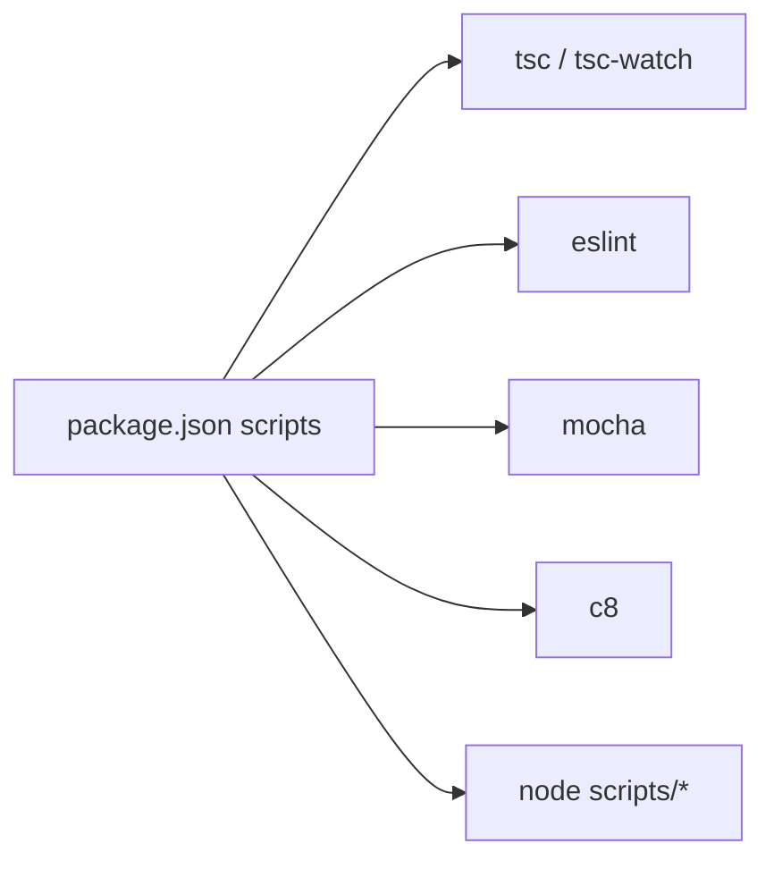

# Contributing & Development

<cite>
**Referenced Files in This Document**
- [CONTRIBUTING.md](file://CONTRIBUTING.md)
- [README.md](file://README.md)
- [package.json](file://package.json)
- [tsconfig.json](file://tsconfig.json)
- [eslint.config.mjs](file://eslint.config.mjs)
- [docs/docs/contribute/contributing-guide.mdx](file://docs/docs/contribute/contributing-guide.mdx)
- [docs/docs/contribute/environment-setup.mdx](file://docs/docs/contribute/environment-setup.mdx)
- [docs/docs/contribute/new-command/step-by-step-guide.mdx](file://docs/docs/contribute/new-command/step-by-step-guide.mdx)
- [docs/docs/contribute/new-command/build-command-logic.mdx](file://docs/docs/contribute/new-command/build-command-logic.mdx)
- [docs/docs/contribute/new-command/unit-tests.mdx](file://docs/docs/contribute/new-command/unit-tests.mdx)
- [src/Command.ts](file://src/Command.ts)
- [src/m365/base/SpoCommand.ts](file://src/m365/base/SpoCommand.ts)
- [src/cli/CommandInfo.ts](file://src/cli/CommandInfo.ts)
- [src/utils/validation.ts](file://src/utils/validation.ts)
- [src/utils/zod.ts](file://src/utils/zod.ts)
</cite>

## Table of Contents
1. [Introduction](#introduction)
2. [Project Structure](#project-structure)
3. [Core Components](#core-components)
4. [Architecture Overview](#architecture-overview)
5. [Detailed Component Analysis](#detailed-component-analysis)
6. [Dependency Analysis](#dependency-analysis)
7. [Performance Considerations](#performance-considerations)
8. [Troubleshooting Guide](#troubleshooting-guide)
9. [Conclusion](#conclusion)
10. [Appendices](#appendices)

## Introduction
This document provides comprehensive guidance for contributing to CLI for Microsoft 365. It covers the contribution process, development environment setup, build and test workflows, code quality standards, command architecture, and best practices for adding new commands and extending functionality. It also documents the command lifecycle from concept to implementation and documentation, and outlines strategies for maintaining backward compatibility and ensuring high-quality contributions.

## Project Structure
The repository is organized around a modular CLI architecture with a clear separation of concerns:
- Core CLI engine and base command abstractions reside under src/.
- Service-specific command families are grouped under src/m365/<service>/commands/.
- Utilities for validation, Zod integration, and shared helpers live under src/utils/.
- Documentation for contributors is under docs/docs/contribute/.

Key characteristics:
- TypeScript-based codebase with strict compiler options.
- Centralized command base class with validation, telemetry, and output formatting.
- Service-specific base classes (e.g., SpoCommand) to encapsulate common behaviors.
- Extensive use of Zod for option schemas, validation, and option metadata generation.
- Comprehensive test suite using Mocha and Sinon with coverage reporting.

**Diagram sources**
- [src/Command.ts:66-116](file://src/Command.ts#L66-L116)
- [src/m365/base/SpoCommand.ts:10-121](file://src/m365/base/SpoCommand.ts#L10-L121)
- [src/cli/CommandInfo.ts:4-13](file://src/cli/CommandInfo.ts#L4-L13)
- [src/utils/validation.ts:4-426](file://src/utils/validation.ts#L4-L426)
- [src/utils/zod.ts:122-161](file://src/utils/zod.ts#L122-L161)

**Section sources**
- [README.md:199-221](file://README.md#L199-L221)
- [package.json:23-35](file://package.json#L23-L35)

## Core Components
This section explains the foundational components that drive command creation and execution.

- Base Command class
  - Provides standardized validation, telemetry, output formatting, and error handling.
  - Implements option initialization, unknown option detection, required option prompting, and option set enforcement.
  - Offers hooks for loading values from access tokens and deprecation warnings.

- Service-specific base classes
  - SpoCommand extends the base Command to handle SharePoint Online URL normalization and authentication constraints.

- Validation utilities
  - Centralized validation helpers for GUIDs, UPNs, dates, durations, SharePoint URLs, and more.

- Zod integration
  - Extends Zod to support option aliases and coerce enums for case-insensitive matching.
  - Converts Zod schemas to CLI option metadata for help and autocompletion.

- Command metadata
  - CommandInfo captures command options, aliases, and help text for consistent CLI behavior.

**Section sources**
- [src/Command.ts:66-116](file://src/Command.ts#L66-L116)
- [src/Command.ts:141-244](file://src/Command.ts#L141-L244)
- [src/Command.ts:303-327](file://src/Command.ts#L303-L327)
- [src/Command.ts:360-457](file://src/Command.ts#L360-L457)
- [src/m365/base/SpoCommand.ts:10-121](file://src/m365/base/SpoCommand.ts#L10-L121)
- [src/utils/validation.ts:4-426](file://src/utils/validation.ts#L4-L426)
- [src/utils/zod.ts:122-161](file://src/utils/zod.ts#L122-L161)
- [src/cli/CommandInfo.ts:4-13](file://src/cli/CommandInfo.ts#L4-L13)

## Architecture Overview
The CLI architecture centers on a base Command abstraction that orchestrates authentication, validation, telemetry, and output formatting. Service-specific base classes encapsulate domain-specific behaviors. Commands are grouped by service and feature area, with each command implementing a minimal contract: name, description, and commandAction.

**Diagram sources**
- [src/Command.ts:66-327](file://src/Command.ts#L66-L327)
- [src/m365/base/SpoCommand.ts:10-121](file://src/m365/base/SpoCommand.ts#L10-L121)
- [src/cli/CommandInfo.ts:4-13](file://src/cli/CommandInfo.ts#L4-L13)

## Detailed Component Analysis

### Command Lifecycle: From Concept to Implementation
The contributor journey follows a structured process:
1. Idea and alignment
   - Verify no similar idea exists and create an issue to scope the feature.
2. Environment setup
   - Use GitHub Codespaces or the dev container; follow environment-setup steps to build and link the project locally.
3. Command creation
   - Create command files and unit tests; implement the commandAction and define Zod options.
4. Validation and tests
   - Add comprehensive tests with Mocha and Sinon; ensure 100% coverage.
5. Documentation
   - Write help pages and examples aligned with the documentation standards.
6. Pull request
   - Submit PR following checklist and expectations.

**Section sources**
- [docs/docs/contribute/contributing-guide.mdx:9-53](file://docs/docs/contribute/contributing-guide.mdx#L9-L53)
- [docs/docs/contribute/environment-setup.mdx:17-92](file://docs/docs/contribute/environment-setup.mdx#L17-L92)
- [docs/docs/contribute/new-command/step-by-step-guide.mdx:13-67](file://docs/docs/contribute/new-command/step-by-step-guide.mdx#L13-L67)
- [docs/docs/contribute/new-command/build-command-logic.mdx:19-355](file://docs/docs/contribute/new-command/build-command-logic.mdx#L19-L355)
- [docs/docs/contribute/new-command/unit-tests.mdx:1-282](file://docs/docs/contribute/new-command/unit-tests.mdx#L1-L282)

### Command Architecture and Patterns
- Base Command responsibilities
  - Authentication restoration and connection checks.
  - Telemetry initialization and option metadata collection.
  - Validation pipeline: unknown options, required options, option sets.
  - Output formatting across CSV, JSON, Markdown, and text.
  - Error handling via standardized CommandError wrappers.

- Service-specific base class (SpoCommand)
  - URL normalization for server-relative URLs.
  - Authentication constraints for SharePoint Online.
  - CSOM option validation helpers.

- Option modeling with Zod
  - Strict schemas for command options.
  - Aliases and coerced enums for user-friendly UX.
  - Schema-driven option metadata for help and autocompletion.

**Diagram sources**
- [src/Command.ts:303-327](file://src/Command.ts#L303-L327)
- [src/Command.ts:317-326](file://src/Command.ts#L317-L326)
- [src/Command.ts:472-483](file://src/Command.ts#L472-L483)

**Section sources**
- [src/Command.ts:66-116](file://src/Command.ts#L66-L116)
- [src/Command.ts:141-244](file://src/Command.ts#L141-L244)
- [src/Command.ts:472-483](file://src/Command.ts#L472-L483)
- [src/m365/base/SpoCommand.ts:60-82](file://src/m365/base/SpoCommand.ts#L60-L82)

### Creating a New Command
Steps to add a new command:
- Choose the service and feature area; create command and spec files.
- Define the command class extending the appropriate base class.
- Implement name, description, and commandAction.
- Define Zod options, aliases, and validations; add option sets when needed.
- Add verbose logging and robust error handling.
- Integrate with the service commands registry.

**Section sources**
- [docs/docs/contribute/new-command/build-command-logic.mdx:19-355](file://docs/docs/contribute/new-command/build-command-logic.mdx#L19-L355)

### Testing Strategy and Unit Tests
- Test framework
  - Mocha for test runner and Sinon for spies/stubs/mocks.
- Coverage requirement
  - Aim for 100% code and branch coverage per command.
- Typical test categories
  - Command metadata assertions (name, description).
  - Zod schema validation tests (pass/fail).
  - API interaction tests (stub requests, assert outputs).
  - Error handling tests (rejected promises, API errors).
- Test lifecycle
  - Setup auth, telemetry, PID, and session in before.
  - Initialize logger spy in beforeEach.
  - Restore request stubs in afterEach.
  - Cleanup in after.

**Section sources**
- [docs/docs/contribute/new-command/unit-tests.mdx:1-282](file://docs/docs/contribute/new-command/unit-tests.mdx#L1-L282)

### Documentation Standards
- Help pages and examples
  - Follow the documented patterns for command help and examples.
- Command naming and grouping
  - Use approved command words and maintain alphabetical ordering in the commands registry.
- Backward compatibility
  - Avoid breaking changes; introduce deprecation warnings when necessary.

**Section sources**
- [docs/docs/contribute/new-command/step-by-step-guide.mdx:23-67](file://docs/docs/contribute/new-command/step-by-step-guide.mdx#L23-L67)
- [eslint.config.mjs:199-201](file://eslint.config.mjs#L199-L201)

## Dependency Analysis
The project relies on a set of core libraries and tooling:
- Runtime dependencies include MSAL, Axios, Zod, Yargs, and others for authentication, HTTP, validation, and CLI features.
- Development dependencies include TypeScript, ESLint, Mocha, Sinon, C8 for coverage, and tsc-watch for incremental builds.
- Scripts orchestrate building, watching, linting, testing, and coverage.

**Diagram sources**
- [package.json:23-35](file://package.json#L23-L35)

**Section sources**
- [package.json:23-35](file://package.json#L23-L35)
- [package.json:273-335](file://package.json#L273-L335)

## Performance Considerations
- Prefer incremental builds during development using tsc-watch to speed up iteration.
- Minimize heavy synchronous operations in commandAction; leverage async/await and streaming where applicable.
- Use efficient output formatters and avoid unnecessary object cloning or deep serialization.
- Keep validation logic lightweight and deterministic to reduce overhead.

## Troubleshooting Guide
Common issues and resolutions:
- Authentication failures
  - Ensure you are logged in and connection is active before running commands.
  - For SharePoint commands, verify authentication type compatibility.
- Validation errors
  - Review Zod schema definitions and option sets; confirm required vs optional fields and constraints.
- Test failures
  - Confirm Sinon stubs are restored between tests; ensure request stubs match expected endpoints.
- Linting errors
  - Follow ESLint rules and style configurations; resolve naming conventions and formatting issues.

**Section sources**
- [src/Command.ts:303-327](file://src/Command.ts#L303-L327)
- [src/m365/base/SpoCommand.ts:107-120](file://src/m365/base/SpoCommand.ts#L107-L120)
- [docs/docs/contribute/new-command/unit-tests.mdx:114-132](file://docs/docs/contribute/new-command/unit-tests.mdx#L114-L132)
- [eslint.config.mjs:198-252](file://eslint.config.mjs#L198-L252)

## Conclusion
Contributing to CLI for Microsoft 365 involves following a well-defined process: align on scope, set up the environment, implement commands with strong validation and tests, document thoroughly, and submit PRs for review. The architecture emphasizes modularity, type safety, and consistency, enabling scalable growth and maintainability.

## Appendices

### Development Environment Setup
- Prerequisites
  - Node.js LTS and npm.
- Steps
  - Fork and clone the repository.
  - Install dependencies, build, and link locally.
  - Use npm run watch for live reload during development.

**Section sources**
- [docs/docs/contribute/environment-setup.mdx:17-92](file://docs/docs/contribute/environment-setup.mdx#L17-L92)

### Build and Test Workflows
- Build
  - tsc compiles TypeScript; write-all-commands and copy-files scripts finalize distribution assets.
- Watch
  - tsc-watch triggers incremental rebuilds on save.
- Test
  - c8 wraps Mocha to produce coverage reports.
- Lint
  - ESLint enforces style and correctness rules.

**Section sources**
- [package.json:23-35](file://package.json#L23-L35)

### Code Quality Standards and Linting
- TypeScript configuration
  - Strict compiler options, ESNext modules, and source maps enabled.
- ESLint configuration
  - TypeScript plugin, Mocha plugin, stylistic rules, and custom rules for command naming and usage.
  - Dictionary of approved command words and capitalization rules enforced.

**Section sources**
- [tsconfig.json:2-15](file://tsconfig.json#L2-L15)
- [eslint.config.mjs:156-275](file://eslint.config.mjs#L156-L275)

### Adding New Services and Extending Functionality
- New service
  - Create a new commands.ts file under the service and register commands.
  - Implement base classes if domain-specific behaviors are needed.
- Extending existing functionality
  - Follow existing patterns for options, validation, and output formatting.
  - Maintain backward compatibility; introduce deprecation notices when removing features.

**Section sources**
- [docs/docs/contribute/new-command/build-command-logic.mdx:63-98](file://docs/docs/contribute/new-command/build-command-logic.mdx#L63-L98)
- [src/Command.ts:532-538](file://src/Command.ts#L532-L538)

### Debugging Techniques and Development Workflows
- Live reload
  - Use npm run watch to rebuild on file changes.
- Logging
  - Utilize logger.log, logger.logRaw, and logger.logToStderr for verbose output.
- Interactive debugging
  - Use VS Code extensions for Mocha and ESLint to streamline development.

**Section sources**
- [docs/docs/contribute/new-command/build-command-logic.mdx:346-351](file://docs/docs/contribute/new-command/build-command-logic.mdx#L346-L351)
- [docs/docs/contribute/environment-setup.mdx:48-70](file://docs/docs/contribute/environment-setup.mdx#L48-L70)