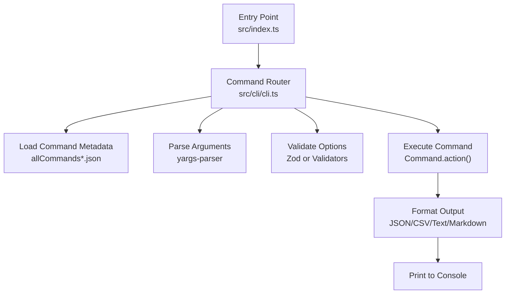
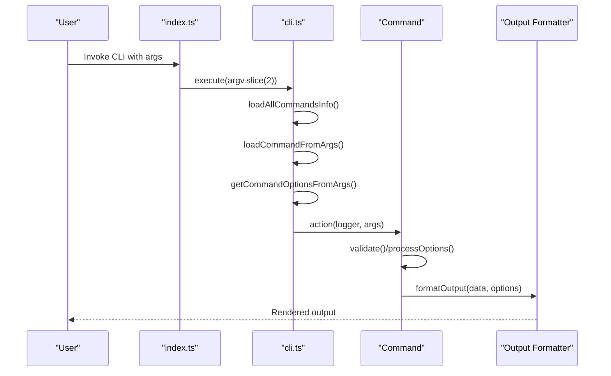
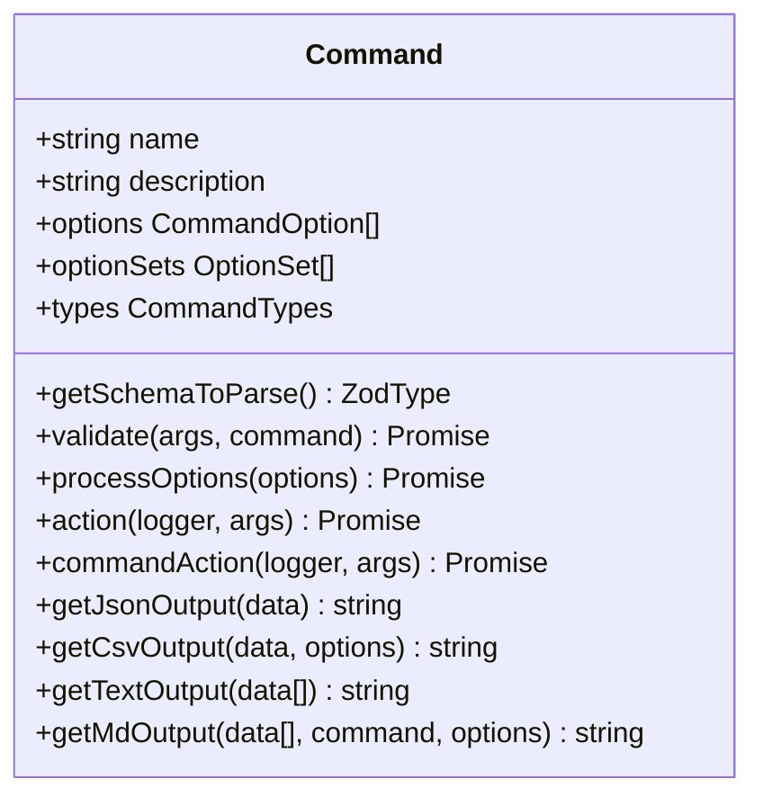
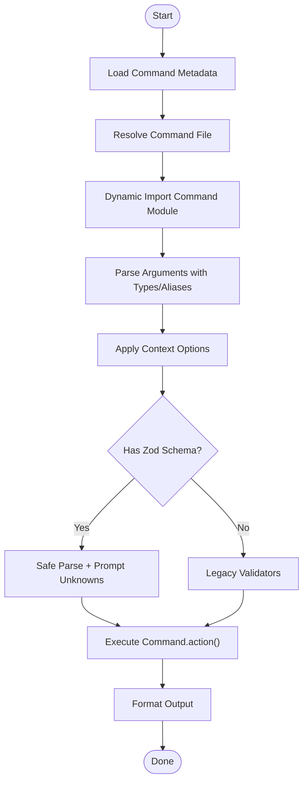
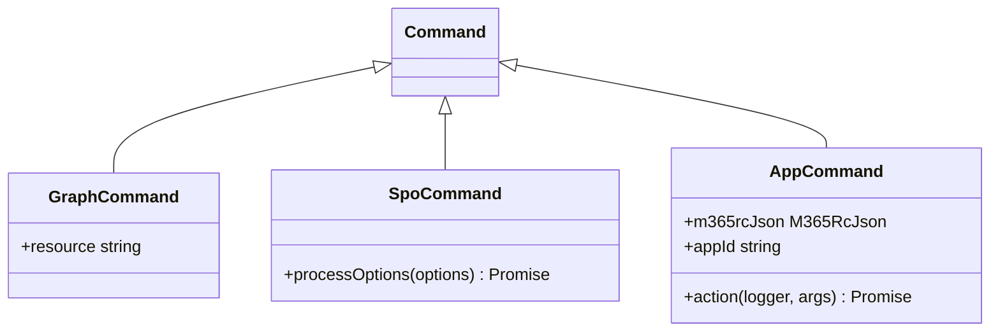
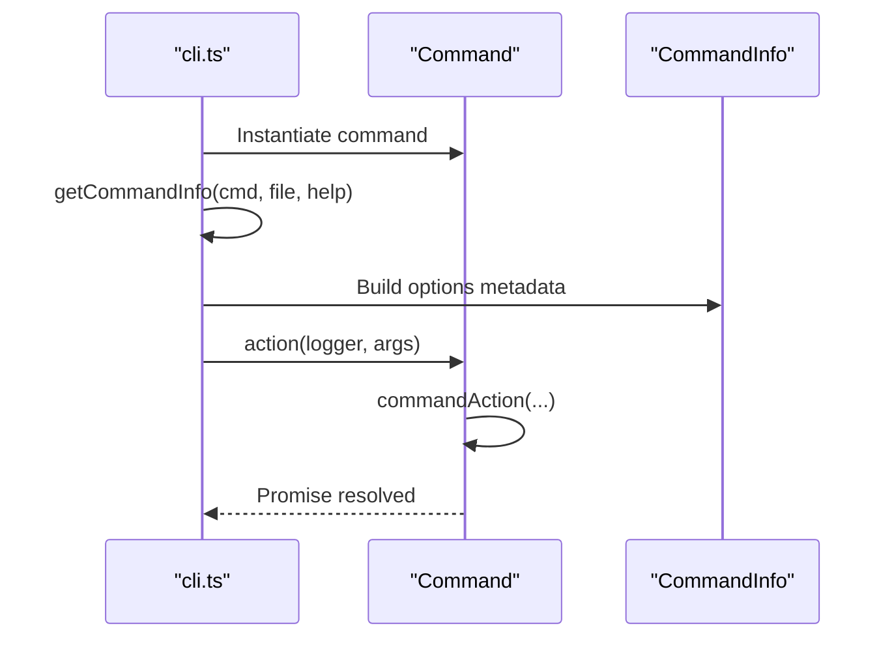
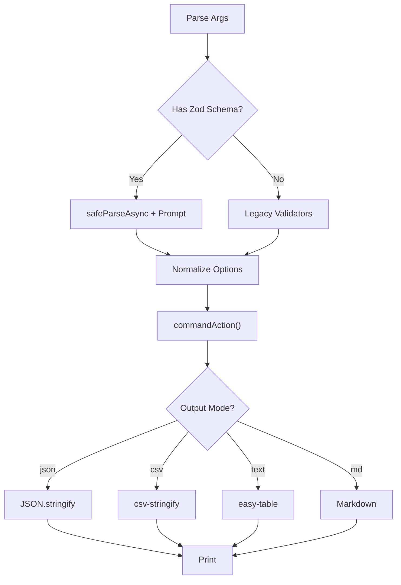
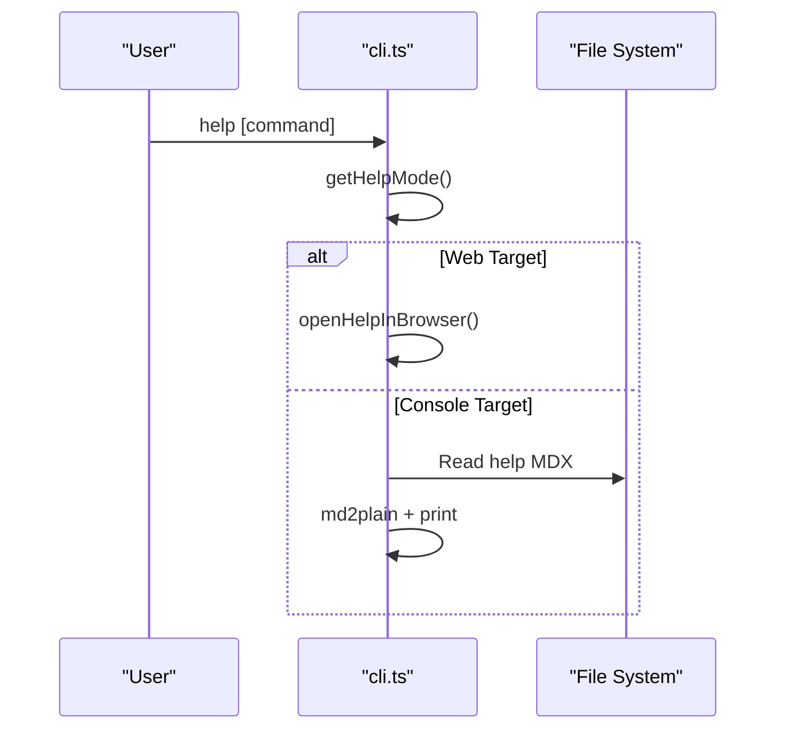
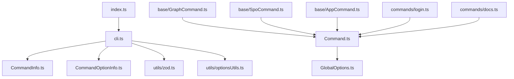

# Core Commands Reference

<cite>
**Referenced Files in This Document**
- [src/index.ts](file://src/index.ts)
- [src/cli/cli.ts](file://src/cli/cli.ts)
- [src/Command.ts](file://src/Command.ts)
- [src/cli/CommandInfo.ts](file://src/cli/CommandInfo.ts)
- [src/cli/CommandOptionInfo.ts](file://src/cli/CommandOptionInfo.ts)
- [src/GlobalOptions.ts](file://src/GlobalOptions.ts)
- [src/utils/zod.ts](file://src/utils/zod.ts)
- [src/utils/optionsUtils.ts](file://src/utils/optionsUtils.ts)
- [src/m365/base/AppCommand.ts](file://src/m365/base/AppCommand.ts)
- [src/m365/base/GraphCommand.ts](file://src/m365/base/GraphCommand.ts)
- [src/m365/base/SpoCommand.ts](file://src/m365/base/SpoCommand.ts)
- [src/m365/commands/login.ts](file://src/m365/commands/login.ts)
- [src/m365/commands/docs.ts](file://src/m365/commands/docs.ts)
- [src/m365/commands/commands.ts](file://src/m365/commands/commands.ts)
</cite>

## Table of Contents
1. [Introduction](#introduction)
2. [Project Structure](#project-structure)
3. [Core Components](#core-components)
4. [Architecture Overview](#architecture-overview)
5. [Detailed Component Analysis](#detailed-component-analysis)
6. [Dependency Analysis](#dependency-analysis)
7. [Performance Considerations](#performance-considerations)
8. [Troubleshooting Guide](#troubleshooting-guide)
9. [Conclusion](#conclusion)
10. [Appendices](#appendices)

## Introduction
This document provides a comprehensive reference for the core command architecture of the CLI for Microsoft 365. It explains how commands are defined, discovered, validated, executed, and rendered, and how global options and output formatting work across all commands. It also covers command categorization, help system, and the mechanisms that enable extensibility for adding new commands.

## Project Structure
The CLI entry point delegates to the command router, which discovers commands, parses arguments, validates options, executes actions, and formats output. Base command classes encapsulate shared behavior for different Microsoft 365 services, while individual commands define their own schemas and logic.

**Diagram sources**
- [src/index.ts:1-22](file://src/index.ts#L1-L22)
- [src/cli/cli.ts:89-252](file://src/cli/cli.ts#L89-L252)

**Section sources**
- [src/index.ts:1-22](file://src/index.ts#L1-L22)
- [src/cli/cli.ts:384-408](file://src/cli/cli.ts#L384-L408)

## Core Components
- Command base class: Defines the contract for all commands, including option registration, validation, lifecycle hooks, error handling, and output formatters.
- Command router: Parses arguments, discovers commands, applies context and file-based option values, validates inputs, executes commands, and prints results.
- Base command classes: Specialized command classes for service domains (e.g., Graph, SharePoint Online, App-scoped contexts).
- Zod integration: Schema-driven option parsing, validation, and help generation.
- Global options: Shared flags like --output, --query, --verbose, --debug.

Key responsibilities:
- Command discovery via prebuilt metadata.
- Dynamic loading of command modules.
- Validation using Zod schemas or legacy validators.
- Output formatting and JMESPath filtering.

**Section sources**
- [src/Command.ts:66-116](file://src/Command.ts#L66-L116)
- [src/cli/cli.ts:89-252](file://src/cli/cli.ts#L89-L252)
- [src/m365/base/GraphCommand.ts:1-7](file://src/m365/base/GraphCommand.ts#L1-L7)
- [src/m365/base/SpoCommand.ts:10-122](file://src/m365/base/SpoCommand.ts#L10-L122)
- [src/utils/zod.ts:122-161](file://src/utils/zod.ts#L122-L161)
- [src/GlobalOptions.ts:1-8](file://src/GlobalOptions.ts#L1-L8)

## Architecture Overview
The CLI follows a layered architecture:
- Entry point initializes the environment and invokes the router.
- Router loads command metadata and resolves the target command.
- Arguments are parsed with type awareness and aliases.
- Options are processed (including context and file expansion), validated, and normalized.
- The command’s action is executed with a structured logger.
- Output is formatted according to the selected mode and optional JMESPath query.

**Diagram sources**
- [src/index.ts:6-21](file://src/index.ts#L6-L21)
- [src/cli/cli.ts:89-252](file://src/cli/cli.ts#L89-L252)
- [src/Command.ts:301-327](file://src/Command.ts#L301-L327)
- [src/cli/cli.ts:602-705](file://src/cli/cli.ts#L602-L705)

## Detailed Component Analysis

### Command Base Class
The base Command class defines:
- Global options injection (--query, -o/--output, --verbose, --debug).
- Validation pipeline: output type validation, unknown options, required options, option sets.
- Lifecycle hooks: initAction, processOptions, commandAction.
- Error handling helpers for Graph/ODATA responses.
- Output formatters for JSON, CSV, Text, Markdown.
- Telemetry and logging integration.

**Diagram sources**
- [src/Command.ts:66-116](file://src/Command.ts#L66-L116)
- [src/Command.ts:149-273](file://src/Command.ts#L149-L273)
- [src/Command.ts:603-743](file://src/Command.ts#L603-L743)

**Section sources**
- [src/Command.ts:49-55](file://src/Command.ts#L49-L55)
- [src/Command.ts:129-148](file://src/Command.ts#L129-L148)
- [src/Command.ts:329-338](file://src/Command.ts#L329-L338)
- [src/Command.ts:603-743](file://src/Command.ts#L603-L743)

### Command Router and Discovery
The router:
- Loads command metadata from prebuilt JSON files.
- Resolves the target command file by name or alias.
- Dynamically imports the command module and wraps it with metadata.
- Parses arguments with type-awareness and alias mapping.
- Applies context-based options and file-based option values.
- Validates using Zod when present, otherwise legacy validators.
- Executes the command and prints timings and results.

**Diagram sources**
- [src/cli/cli.ts:384-408](file://src/cli/cli.ts#L384-L408)
- [src/cli/cli.ts:462-482](file://src/cli/cli.ts#L462-L482)
- [src/cli/cli.ts:532-569](file://src/cli/cli.ts#L532-L569)
- [src/cli/cli.ts:179-233](file://src/cli/cli.ts#L179-L233)
- [src/cli/cli.ts:264-309](file://src/cli/cli.ts#L264-L309)
- [src/cli/cli.ts:602-705](file://src/cli/cli.ts#L602-L705)

**Section sources**
- [src/cli/cli.ts:384-408](file://src/cli/cli.ts#L384-L408)
- [src/cli/cli.ts:462-482](file://src/cli/cli.ts#L462-L482)
- [src/cli/cli.ts:532-569](file://src/cli/cli.ts#L532-L569)
- [src/cli/cli.ts:179-233](file://src/cli/cli.ts#L179-L233)
- [src/cli/cli.ts:264-309](file://src/cli/cli.ts#L264-L309)
- [src/cli/cli.ts:602-705](file://src/cli/cli.ts#L602-L705)

### Base Command Classes and Service-Specific Implementations
- GraphCommand: Establishes the Microsoft Graph resource for commands targeting Graph APIs.
- SpoCommand: Adds URL normalization for SharePoint server-relative URLs and enforces authentication constraints.
- AppCommand: Adds app-scoped context resolution and validation against .m365rc.json.

**Diagram sources**
- [src/m365/base/GraphCommand.ts:1-7](file://src/m365/base/GraphCommand.ts#L1-L7)
- [src/m365/base/SpoCommand.ts:10-122](file://src/m365/base/SpoCommand.ts#L10-L122)
- [src/m365/base/AppCommand.ts:19-82](file://src/m365/base/AppCommand.ts#L19-L82)

**Section sources**
- [src/m365/base/GraphCommand.ts:1-7](file://src/m365/base/GraphCommand.ts#L1-L7)
- [src/m365/base/SpoCommand.ts:10-122](file://src/m365/base/SpoCommand.ts#L10-L122)
- [src/m365/base/AppCommand.ts:19-82](file://src/m365/base/AppCommand.ts#L19-L82)

### Command Pattern Implementation
- Each command exposes:
  - name and description for help and discovery.
  - schema (Zod) or options/types for validation and help generation.
  - commandAction(logger, args) implementing the business logic.
- The router constructs CommandInfo with metadata and passes it to the command’s action.

**Diagram sources**
- [src/cli/cli.ts:484-498](file://src/cli/cli.ts#L484-L498)
- [src/cli/CommandInfo.ts:4-13](file://src/cli/CommandInfo.ts#L4-L13)
- [src/Command.ts:301-327](file://src/Command.ts#L301-L327)

**Section sources**
- [src/cli/cli.ts:484-498](file://src/cli/cli.ts#L484-L498)
- [src/cli/CommandInfo.ts:4-13](file://src/cli/CommandInfo.ts#L4-L13)
- [src/Command.ts:301-327](file://src/Command.ts#L301-L327)

### Parameter Handling, Validation, and Output Formatting
- Global options: --query, -o/--output, --verbose, --debug are injected automatically.
- Validation:
  - Zod schema safe parsing with interactive prompting for missing/invalid values.
  - Legacy validators for unknown options, required options, and option sets.
- Output formatting:
  - JSON, CSV, Text, Markdown, with optional JMESPath filtering.

**Diagram sources**
- [src/cli/cli.ts:179-233](file://src/cli/cli.ts#L179-L233)
- [src/Command.ts:149-273](file://src/Command.ts#L149-L273)
- [src/Command.ts:603-743](file://src/Command.ts#L603-L743)

**Section sources**
- [src/Command.ts:49-55](file://src/Command.ts#L49-L55)
- [src/cli/cli.ts:179-233](file://src/cli/cli.ts#L179-L233)
- [src/Command.ts:149-273](file://src/Command.ts#L149-L273)
- [src/Command.ts:603-743](file://src/Command.ts#L603-L743)

### Help System and Documentation Generation
- Help modes: options, examples, remarks, permissions, response, full.
- Help targets: console or web (opens documentation page).
- Command list help displays available commands and groups.

**Diagram sources**
- [src/cli/cli.ts:718-750](file://src/cli/cli.ts#L718-L750)
- [src/cli/cli.ts:752-756](file://src/cli/cli.ts#L752-L756)
- [src/cli/cli.ts:758-769](file://src/cli/cli.ts#L758-L769)

**Section sources**
- [src/cli/cli.ts:718-750](file://src/cli/cli.ts#L718-L750)
- [src/cli/cli.ts:752-756](file://src/cli/cli.ts#L752-L756)
- [src/cli/cli.ts:758-769](file://src/cli/cli.ts#L758-L769)

### Examples of Command Execution Patterns
- Login command demonstrates:
  - Zod schema with refinements for cross-field validation.
  - Conditional login decisions based on existing auth state.
  - Authentication type selection and credential handling.
- Docs command demonstrates:
  - Anonymous command pattern.
  - Global options schema usage.
  - Optional auto-open in browser based on settings.

**Section sources**
- [src/m365/commands/login.ts:13-86](file://src/m365/commands/login.ts#L13-L86)
- [src/m365/commands/login.ts:88-170](file://src/m365/commands/login.ts#L88-L170)
- [src/m365/commands/docs.ts:11-34](file://src/m365/commands/docs.ts#L11-L34)

## Dependency Analysis
The CLI composes several subsystems:
- Entry point depends on the router.
- Router depends on command metadata, argument parser, validators, and output formatters.
- Commands depend on base classes and shared utilities.
- Zod utilities bridge schemas to option metadata and help.

**Diagram sources**
- [src/index.ts:1-22](file://src/index.ts#L1-L22)
- [src/cli/cli.ts:1-27](file://src/cli/cli.ts#L1-L27)
- [src/cli/CommandInfo.ts:1-13](file://src/cli/CommandInfo.ts#L1-L13)
- [src/cli/CommandOptionInfo.ts:1-10](file://src/cli/CommandOptionInfo.ts#L1-L10)
- [src/utils/zod.ts:1-161](file://src/utils/zod.ts#L1-L161)
- [src/utils/optionsUtils.ts:1-34](file://src/utils/optionsUtils.ts#L1-L34)
- [src/Command.ts:1-18](file://src/Command.ts#L1-L18)
- [src/GlobalOptions.ts:1-8](file://src/GlobalOptions.ts#L1-L8)
- [src/m365/base/GraphCommand.ts:1-7](file://src/m365/base/GraphCommand.ts#L1-L7)
- [src/m365/base/SpoCommand.ts:1-122](file://src/m365/base/SpoCommand.ts#L1-L122)
- [src/m365/base/AppCommand.ts:1-82](file://src/m365/base/AppCommand.ts#L1-L82)
- [src/m365/commands/login.ts:1-251](file://src/m365/commands/login.ts#L1-L251)
- [src/m365/commands/docs.ts:1-37](file://src/m365/commands/docs.ts#L1-L37)

**Section sources**
- [src/cli/cli.ts:1-27](file://src/cli/cli.ts#L1-L27)
- [src/Command.ts:1-18](file://src/Command.ts#L1-L18)
- [src/utils/zod.ts:122-161](file://src/utils/zod.ts#L122-L161)
- [src/utils/optionsUtils.ts:1-34](file://src/utils/optionsUtils.ts#L1-L34)

## Performance Considerations
- Timings tracking: The router measures total, core, validation, and command execution durations and prints them when --debug is enabled.
- Lazy loading: Commands are dynamically imported only after discovery.
- Output trimming: When output is text and default properties are defined, objects are filtered to reduce verbosity.
- Boolean parsing: Rewrites boolean values to ensure correct coercion.

Recommendations:
- Prefer Zod schemas for robust validation and better UX.
- Use --debug to inspect timings and optimize slow commands.
- Leverage --query to limit output payload early.

**Section sources**
- [src/cli/cli.ts:254-262](file://src/cli/cli.ts#L254-L262)
- [src/cli/cli.ts:394-408](file://src/cli/cli.ts#L394-L408)
- [src/cli/cli.ts:674-695](file://src/cli/cli.ts#L674-L695)
- [src/cli/cli.ts:576-600](file://src/cli/cli.ts#L576-L600)

## Troubleshooting Guide
Common scenarios:
- Authentication errors: Ensure logged in; commands enforce active connection before execution.
- Invalid output type: Only supported types are accepted; defaults to JSON if unspecified.
- Unknown options: Unknown parameters are rejected unless explicitly allowed.
- Option set conflicts: If multiple exclusive options are provided, the user is prompted to select one.
- Graph/ODATA errors: Errors are normalized into CommandError with readable messages.
- SharePoint URL issues: Server-relative URLs are expanded to absolute using the stored SPO URL; otherwise an error is thrown.

**Section sources**
- [src/Command.ts:313-315](file://src/Command.ts#L313-L315)
- [src/Command.ts:265-273](file://src/Command.ts#L265-L273)
- [src/Command.ts:150-175](file://src/Command.ts#L150-L175)
- [src/Command.ts:211-244](file://src/Command.ts#L211-L244)
- [src/Command.ts:360-403](file://src/Command.ts#L360-L403)
- [src/m365/base/SpoCommand.ts:74-81](file://src/m365/base/SpoCommand.ts#L74-L81)

## Conclusion
The CLI’s command architecture centers on a robust base Command class, a flexible router with dynamic discovery and validation, and service-specific base classes that encapsulate domain concerns. Global options and output formatting are standardized, while Zod schemas provide a modern, declarative way to define command interfaces and generate help. Extensibility is achieved by adding new commands that inherit from appropriate base classes and register in the metadata.

## Appendices

### Global Options Reference
- --query: JMESPath filter applied to output.
- -o, --output: Output format selector (json, csv, md, text, none).
- --verbose: Increases logging verbosity.
- --debug: Enables debug mode and prints stack traces and timings.

Supported by:
- Global options schema and injection in the base Command class.
- Router applying default output and printing timings in debug mode.

**Section sources**
- [src/Command.ts:49-55](file://src/Command.ts#L49-L55)
- [src/Command.ts:129-139](file://src/Command.ts#L129-L139)
- [src/cli/cli.ts:175-177](file://src/cli/cli.ts#L175-L177)
- [src/cli/cli.ts:254-262](file://src/cli/cli.ts#L254-L262)

### Command Categories and Discovery
- Commands are grouped under service namespaces (e.g., spo, graph, teams).
- Discovery relies on prebuilt metadata files consumed by the router.
- Commands.ts enumerates top-level command names for core commands.

**Section sources**
- [src/m365/commands/commands.ts:1-10](file://src/m365/commands/commands.ts#L1-L10)
- [src/cli/cli.ts:384-387](file://src/cli/cli.ts#L384-L387)

### Extensibility: Adding a New Command
Steps:
- Define a new class extending the appropriate base class (e.g., GraphCommand, SpoCommand, AppCommand).
- Implement name, description, and schema (or options/types).
- Implement commandAction(logger, args) with business logic.
- Export a singleton instance and ensure it is discoverable via metadata.

Reference implementations:
- GraphCommand base class.
- SpoCommand URL normalization.
- AppCommand context resolution.

**Section sources**
- [src/m365/base/GraphCommand.ts:1-7](file://src/m365/base/GraphCommand.ts#L1-L7)
- [src/m365/base/SpoCommand.ts:10-122](file://src/m365/base/SpoCommand.ts#L10-L122)
- [src/m365/base/AppCommand.ts:19-82](file://src/m365/base/AppCommand.ts#L19-L82)