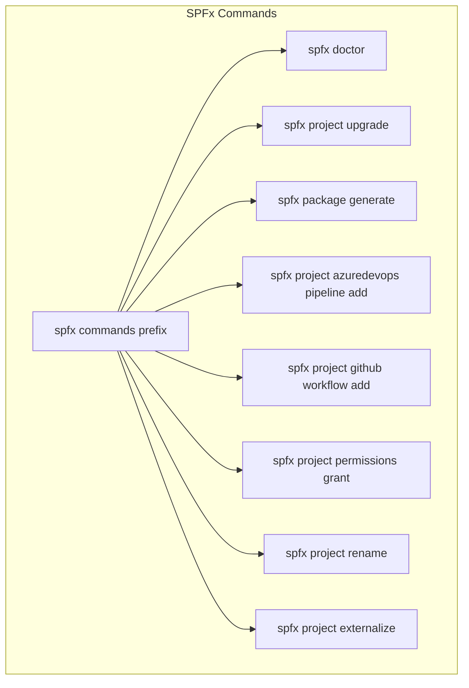
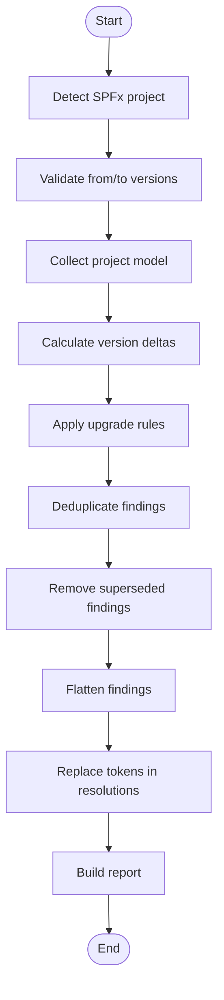
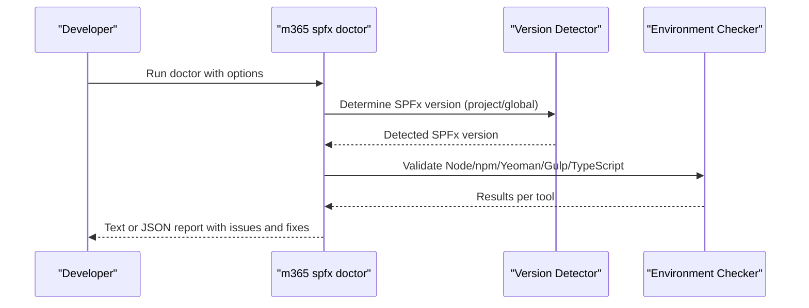
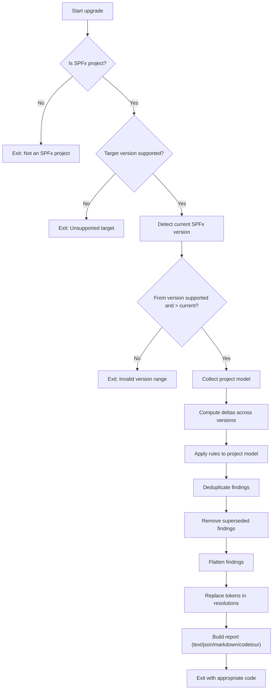
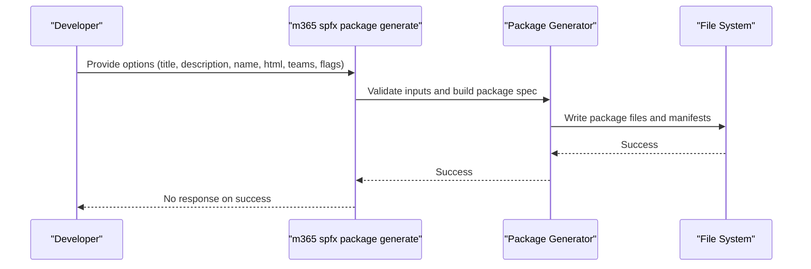
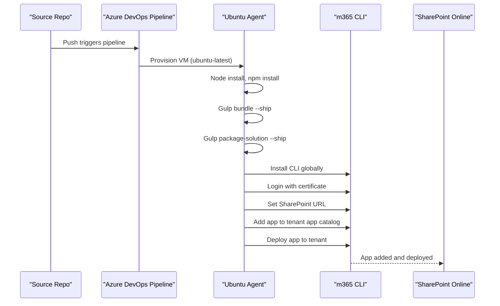
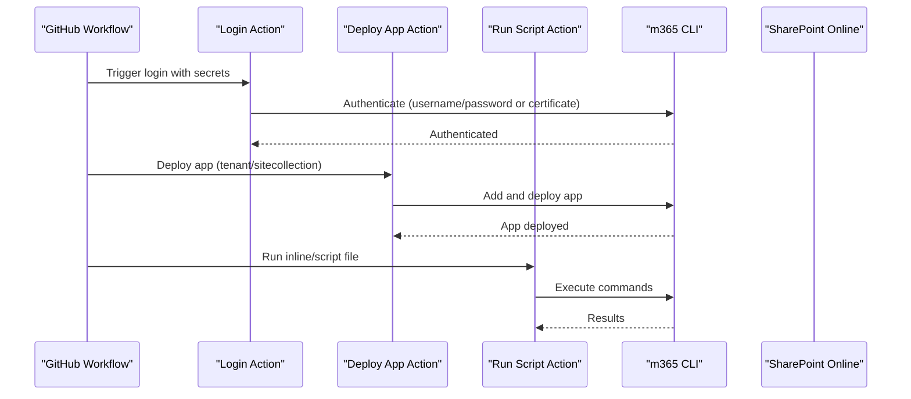
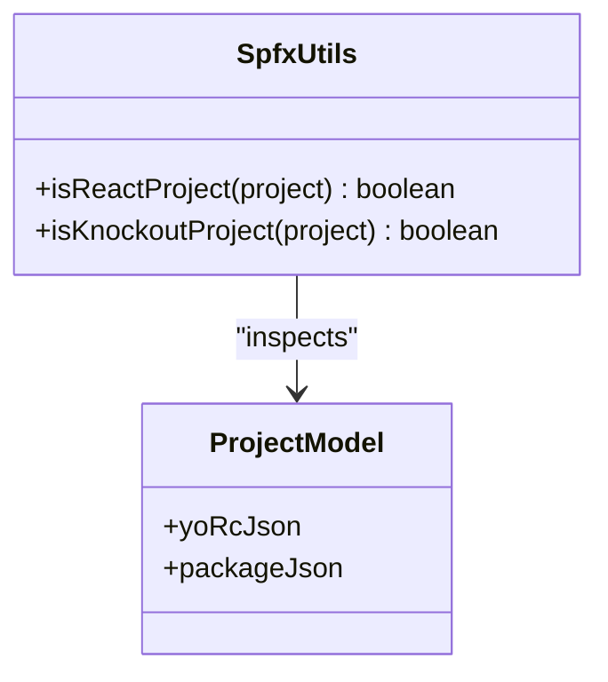
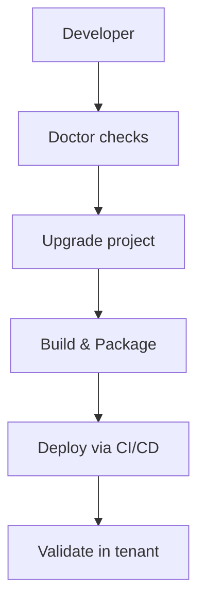
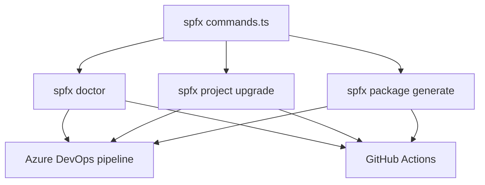

# Development Tools

<cite>
**Referenced Files in This Document**
- [commands.ts](file://src/m365/spfx/commands.ts)
- [spfx-doctor.mdx](file://docs/docs/cmd/spfx/spfx-doctor.mdx)
- [spfx-project-upgrade.mdx](file://docs/docs/concepts/how-it-works/spfx-project-upgrade.mdx)
- [package-generate.mdx](file://docs/docs/cmd/spfx/package/package-generate.mdx)
- [azuredevops-pipeline.mdx](file://docs/docs/user-guide/azuredevops-pipeline.mdx)
- [github-actions.mdx](file://docs/docs/user-guide/github-actions.mdx)
- [spfx.ts](file://src/utils/spfx.ts)
</cite>

## Table of Contents
1. [Introduction](#introduction)
2. [Project Structure](#project-structure)
3. [Core Components](#core-components)
4. [Architecture Overview](#architecture-overview)
5. [Detailed Component Analysis](#detailed-component-analysis)
6. [Dependency Analysis](#dependency-analysis)
7. [Performance Considerations](#performance-considerations)
8. [Troubleshooting Guide](#troubleshooting-guide)
9. [Conclusion](#conclusion)
10. [Appendices](#appendices)

## Introduction
This document provides comprehensive development tools documentation for SharePoint Framework (SPFx) project management using the CLI for Microsoft 365. It covers SPFx project operations such as project creation, upgrade, doctor checks, environment compatibility verification, build and deployment workflows, upgrade utilities, dependency management, version compatibility checking, Azure DevOps and GitHub Actions integration, continuous integration patterns, package generation, externalization processes, and project permissions management. It also includes project renaming, permission granting, and troubleshooting workflows, along with SPFx-specific command patterns and best practices for managing the SPFx development lifecycle.

## Project Structure
The SPFx-related functionality in the CLI is organized around a set of commands under the spfx namespace. The primary command identifiers are defined centrally and consumed by the command implementations. The documentation includes dedicated pages for:
- Doctor checks to validate environment compatibility
- Project upgrade mechanics and rules
- Package generation for SPFx solutions
- CI/CD integrations with Azure DevOps and GitHub Actions

**Diagram sources**
- [commands.ts:1-13](file://src/m365/spfx/commands.ts#L1-L13)

**Section sources**
- [commands.ts:1-13](file://src/m365/spfx/commands.ts#L1-L13)

## Core Components
This section outlines the core SPFx command categories and their responsibilities:
- Environment compatibility and doctor checks
- Project upgrade and version delta rules
- Package generation for SPFx solutions
- CI/CD integration helpers for Azure DevOps and GitHub Actions
- Permissions management and project renaming
- Externalization utilities

Key command identifiers:
- spfx doctor
- spfx project upgrade
- spfx package generate
- spfx project azuredevops pipeline add
- spfx project github workflow add
- spfx project permissions grant
- spfx project rename
- spfx project externalize

**Section sources**
- [commands.ts:3-12](file://src/m365/spfx/commands.ts#L3-L12)
- [spfx-doctor.mdx:8-87](file://docs/docs/cmd/spfx/spfx-doctor.mdx#L8-L87)
- [spfx-project-upgrade.mdx:124-226](file://docs/docs/concepts/how-it-works/spfx-project-upgrade.mdx#L124-L226)
- [package-generate.mdx:3-68](file://docs/docs/cmd/spfx/package/package-generate.mdx#L3-L68)
- [azuredevops-pipeline.mdx:10-80](file://docs/docs/user-guide/azuredevops-pipeline.mdx#L10-L80)
- [github-actions.mdx:32-157](file://docs/docs/user-guide/github-actions.mdx#L32-L157)

## Architecture Overview
The SPFx development lifecycle integrates CLI commands with project models, upgrade rules, and CI/CD pipelines. The upgrade engine constructs a project model, computes deltas across versions, applies rules, deduplicates findings, removes superseded findings, flattens occurrences, replaces tokens in resolutions, and builds a report. CI/CD integrations orchestrate build, package, and deployment steps using the CLI for Microsoft 365.

**Diagram sources**
- [spfx-project-upgrade.mdx:128-152](file://docs/docs/concepts/how-it-works/spfx-project-upgrade.mdx#L128-L152)

## Detailed Component Analysis

### SPFx Doctor Checks
The doctor command verifies environment configuration for a given SPFx version and validates compatibility with SharePoint environments (SharePoint 2016, SharePoint 2019, SharePoint Online). It checks Node.js, npm, Yeoman, Gulp CLI, and TypeScript versions and provides recommendations when mismatches are detected.

**Diagram sources**
- [spfx-doctor.mdx:41-47](file://docs/docs/cmd/spfx/spfx-doctor.mdx#L41-L47)

**Section sources**
- [spfx-doctor.mdx:8-87](file://docs/docs/cmd/spfx/spfx-doctor.mdx#L8-L87)

### SPFx Project Upgrade Engine
The upgrade command produces actionable upgrade steps by analyzing project differences across SPFx versions. It uses version deltas and atomic rules, supports multiple report formats, and communicates outcomes via exit codes.

**Diagram sources**
- [spfx-project-upgrade.mdx:128-152](file://docs/docs/concepts/how-it-works/spfx-project-upgrade.mdx#L128-L152)

**Section sources**
- [spfx-project-upgrade.mdx:17-111](file://docs/docs/concepts/how-it-works/spfx-project-upgrade.mdx#L17-L111)
- [spfx-project-upgrade.mdx:154-256](file://docs/docs/concepts/how-it-works/spfx-project-upgrade.mdx#L154-L256)

### Package Generation for SPFx Solutions
The package generate command creates a SharePoint Framework solution package with a no-framework web part that renders an HTML snippet. It supports options for web part metadata, Teams availability, global context exposure, and tenant-wide deployment.

**Diagram sources**
- [package-generate.mdx:3-68](file://docs/docs/cmd/spfx/package/package-generate.mdx#L3-L68)

**Section sources**
- [package-generate.mdx:3-68](file://docs/docs/cmd/spfx/package/package-generate.mdx#L3-L68)

### CI/CD Integrations: Azure DevOps Pipelines
The Azure DevOps guide demonstrates a YAML pipeline that builds, bundles, packages, and deploys an SPFx solution to a tenant app catalog using the CLI for Microsoft 365. It includes authentication via certificate, setting the SharePoint base URL, adding the app, and deploying it.

**Diagram sources**
- [azuredevops-pipeline.mdx:18-80](file://docs/docs/user-guide/azuredevops-pipeline.mdx#L18-L80)

**Section sources**
- [azuredevops-pipeline.mdx:10-80](file://docs/docs/user-guide/azuredevops-pipeline.mdx#L10-L80)

### CI/CD Integrations: GitHub Actions
The GitHub Actions guide explains how to use CLI for Microsoft 365 actions to authenticate, deploy apps, and run scripts. It covers login with delegated credentials or application certificate, specifying CLI version, tenant targeting, and deploying to tenant or site collection app catalogs.

**Diagram sources**
- [github-actions.mdx:14-31](file://docs/docs/user-guide/github-actions.mdx#L14-L31)

**Section sources**
- [github-actions.mdx:32-157](file://docs/docs/user-guide/github-actions.mdx#L32-L157)

### Project Type Detection Utilities
Utility functions determine whether an SPFx project is React- or Knockout-based by inspecting project metadata and dependencies.

**Diagram sources**
- [spfx.ts:3-17](file://src/utils/spfx.ts#L3-L17)

**Section sources**
- [spfx.ts:3-17](file://src/utils/spfx.ts#L3-L17)

### Conceptual Overview
This conceptual diagram illustrates the end-to-end SPFx development lifecycle: environment validation, project upgrade, build and packaging, and deployment via CI/CD.

[No sources needed since this diagram shows conceptual workflow, not actual code structure]

## Dependency Analysis
The SPFx command identifiers are defined centrally and consumed by command implementations. The upgrade engine depends on project models, delta rules, and reporting utilities. CI/CD integrations depend on the CLI for Microsoft 365 commands and authentication mechanisms.

**Diagram sources**
- [commands.ts:3-12](file://src/m365/spfx/commands.ts#L3-L12)

**Section sources**
- [commands.ts:3-12](file://src/m365/spfx/commands.ts#L3-L12)

## Performance Considerations
- Upgrade performance benefits from parsing project files once to build an in-memory project model, reducing repeated I/O during rule application.
- Deduplication and removal of superseded findings reduce redundant steps, minimizing developer effort and potential errors.
- CI/CD pipelines should cache dependencies and reuse build agents to optimize build times.

[No sources needed since this section provides general guidance]

## Troubleshooting Guide
Common scenarios and remedies:
- Environment mismatch: Use the doctor command to identify incompatible versions of Node.js, npm, Yeoman, Gulp CLI, or TypeScript and apply the recommended fixes.
- Upgrade failures: Review the upgrade report for required changes and ensure the working directory is the project root. Apply findings manually and validate with the doctor command.
- CI/CD authentication: Verify certificate encoding, password, and tenant configuration. Use variable groups/secrets to protect sensitive values.
- Deployment issues: Confirm the SharePoint base URL, app catalog scope, and overwrite settings. Validate that the package file path is correct and accessible in the pipeline.

**Section sources**
- [spfx-doctor.mdx:41-61](file://docs/docs/cmd/spfx/spfx-doctor.mdx#L41-L61)
- [spfx-project-upgrade.mdx:227-256](file://docs/docs/concepts/how-it-works/spfx-project-upgrade.mdx#L227-L256)
- [azuredevops-pipeline.mdx:167-217](file://docs/docs/user-guide/azuredevops-pipeline.mdx#L167-L217)
- [github-actions.mdx:216-365](file://docs/docs/user-guide/github-actions.mdx#L216-L365)

## Conclusion
The CLI for Microsoft 365 provides a comprehensive toolkit for SPFx project lifecycle management. From environment validation and project upgrades to package generation and CI/CD integrations, the documented commands and workflows streamline development, improve reliability, and support scalable deployment practices. Adopting the recommended patterns and troubleshooting approaches ensures a smooth SPFx development experience.

[No sources needed since this section summarizes without analyzing specific files]

## Appendices
- SPFx-specific command patterns:
  - Environment checks: m365 spfx doctor [--env] [--spfxVersion] [--output]
  - Project upgrades: m365 spfx project upgrade [--toVersion] [--output]
  - Package generation: m365 spfx package generate [options]
  - CI/CD scaffolding: m365 spfx project azuredevops pipeline add | m365 spfx project github workflow add
  - Permissions and renaming: m365 spfx project permissions grant | m365 spfx project rename
  - Externalization: m365 spfx project externalize

[No sources needed since this section provides general guidance]