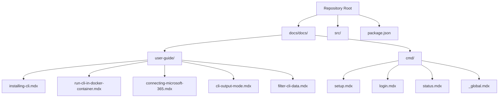
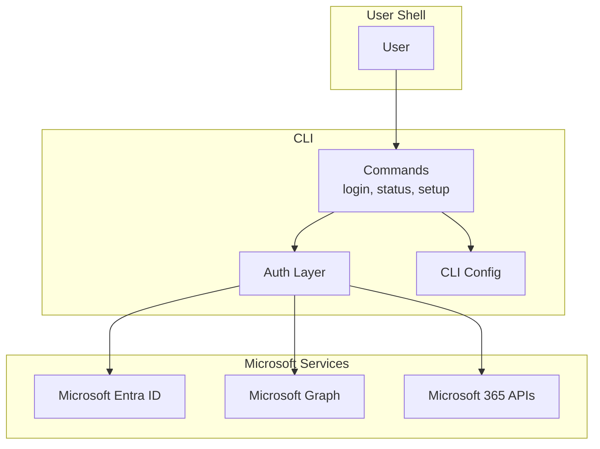
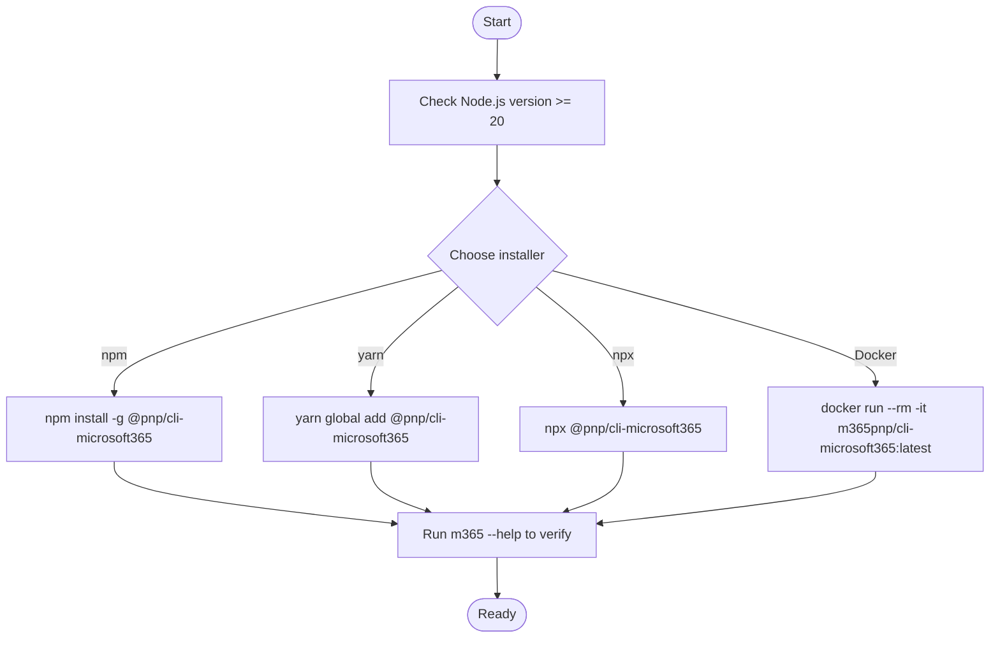
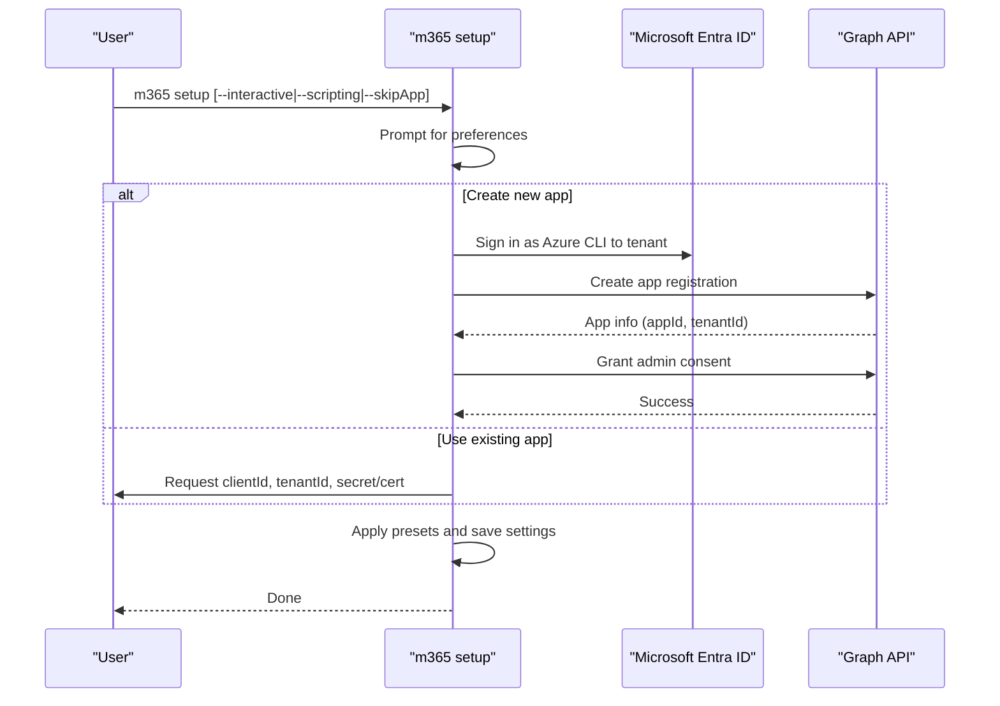
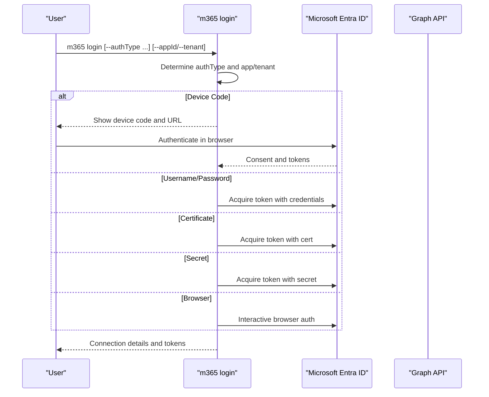
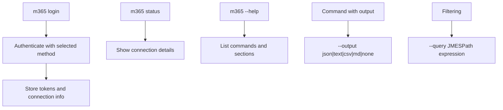
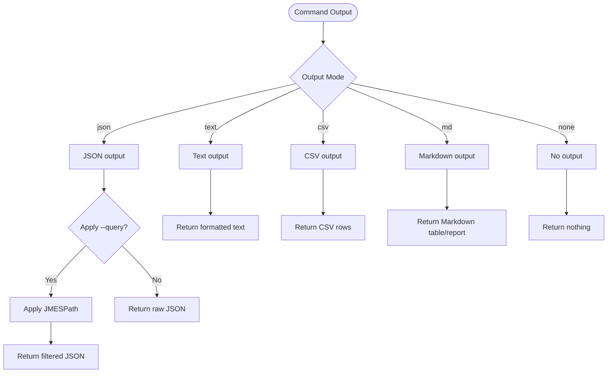
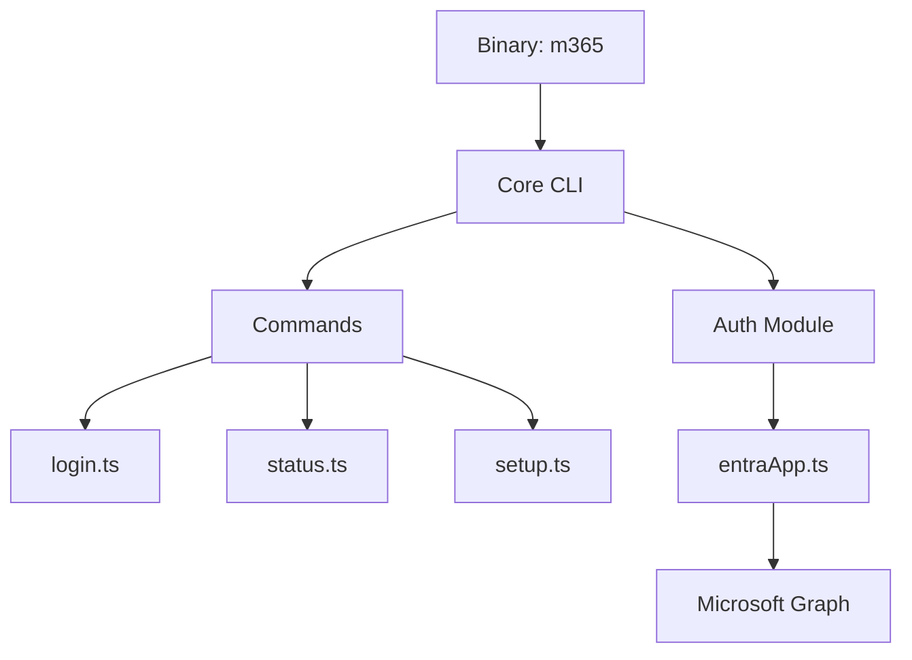

# Getting Started

<cite>
**Referenced Files in This Document**
- [README.md](file://README.md)
- [package.json](file://package.json)
- [installing-cli.mdx](file://docs/docs/user-guide/installing-cli.mdx)
- [run-cli-in-docker-container.mdx](file://docs/docs/user-guide/run-cli-in-docker-container.mdx)
- [connecting-microsoft-365.mdx](file://docs/docs/user-guide/connecting-microsoft-365.mdx)
- [setup.mdx](file://docs/docs/cmd/setup.mdx)
- [login.mdx](file://docs/docs/cmd/login.mdx)
- [status.mdx](file://docs/docs/cmd/status.mdx)
- [_global.mdx](file://docs/docs/cmd/_global.mdx)
- [cli-output-mode.mdx](file://docs/docs/user-guide/cli-output-mode.mdx)
- [filter-cli-data.mdx](file://docs/docs/user-guide/filter-cli-data.mdx)
- [setup.ts](file://src/m365/commands/setup.ts)
- [login.ts](file://src/m365/commands/login.ts)
- [status.ts](file://src/m365/commands/status.ts)
- [entraApp.ts](file://src/utils/entraApp.ts)
</cite>

## Table of Contents
1. [Introduction](#introduction)
2. [Project Structure](#project-structure)
3. [Core Components](#core-components)
4. [Architecture Overview](#architecture-overview)
5. [Detailed Component Analysis](#detailed-component-analysis)
6. [Dependency Analysis](#dependency-analysis)
7. [Performance Considerations](#performance-considerations)
8. [Troubleshooting Guide](#troubleshooting-guide)
9. [Conclusion](#conclusion)
10. [Appendices](#appendices)

## Introduction
This guide helps you quickly install and start using CLI for Microsoft 365. You will learn how to prepare your environment, install the CLI using multiple methods, register a Microsoft Entra ID application, authenticate with the device code flow or other methods, and run common commands. You will also learn how to filter responses with JMESPath and change output formats.

## Project Structure
The repository contains:
- Source code for the CLI under src/
- Documentation under docs/docs/ covering installation, usage, authentication, and output modes
- Package metadata and scripts under package.json

**Diagram sources**
- [README.md:113-197](file://README.md#L113-L197)
- [package.json:1-337](file://package.json#L1-L337)

**Section sources**
- [README.md:113-197](file://README.md#L113-L197)
- [package.json:1-337](file://package.json#L1-L337)

## Core Components
- Installation and setup
  - Install globally via npm, yarn, or use npx
  - Run in Docker containers
  - Use the setup wizard to configure preferences and Microsoft Entra app
- Authentication
  - Device code flow by default
  - Alternative methods: username/password, certificate, secret, browser, managed identity, federated identity
- Usage
  - Basic commands: login, status, help
  - Output modes: JSON, text, CSV, Markdown
  - JMESPath filtering and sorting

**Section sources**
- [README.md:113-197](file://README.md#L113-L197)
- [installing-cli.mdx:1-122](file://docs/docs/user-guide/installing-cli.mdx#L1-L122)
- [run-cli-in-docker-container.mdx:1-140](file://docs/docs/user-guide/run-cli-in-docker-container.mdx#L1-L140)
- [setup.mdx:1-106](file://docs/docs/cmd/setup.mdx#L1-L106)
- [connecting-microsoft-365.mdx:1-216](file://docs/docs/user-guide/connecting-microsoft-365.mdx#L1-L216)
- [login.mdx:1-307](file://docs/docs/cmd/login.mdx#L1-L307)
- [status.mdx:1-88](file://docs/docs/cmd/status.mdx#L1-L88)
- [_global.mdx:1-17](file://docs/docs/cmd/_global.mdx#L1-L17)
- [cli-output-mode.mdx:1-671](file://docs/docs/user-guide/cli-output-mode.mdx#L1-L671)
- [filter-cli-data.mdx:1-242](file://docs/docs/user-guide/filter-cli-data.mdx#L1-L242)

## Architecture Overview
The CLI orchestrates authentication against Microsoft Entra ID and calls Microsoft Graph and Microsoft 365 APIs. The setup command can create or configure an app registration and store credentials in the CLI configuration. Authentication commands manage tokens and connection details.

**Diagram sources**
- [setup.ts:74-235](file://src/m365/commands/setup.ts#L74-L235)
- [login.ts:41-251](file://src/m365/commands/login.ts#L41-L251)
- [status.ts:9-74](file://src/m365/commands/status.ts#L9-L74)
- [entraApp.ts:220-492](file://src/utils/entraApp.ts#L220-L492)

## Detailed Component Analysis

### Installation Methods
Supported installation approaches:
- npm global install
- yarn global add
- npx (no install)
- Docker container

Prerequisites:
- Node.js version 20+ recommended (Node.js LTS)
- Supported operating systems: Windows, macOS, Linux
- Any shell: bash, PowerShell, zsh, etc.

**Diagram sources**
- [README.md:113-153](file://README.md#L113-L153)
- [installing-cli.mdx:13-17](file://docs/docs/user-guide/installing-cli.mdx#L13-L17)
- [run-cli-in-docker-container.mdx:14-31](file://docs/docs/user-guide/run-cli-in-docker-container.mdx#L14-L31)

**Section sources**
- [README.md:113-153](file://README.md#L113-L153)
- [installing-cli.mdx:13-17](file://docs/docs/user-guide/installing-cli.mdx#L13-L17)
- [run-cli-in-docker-container.mdx:14-31](file://docs/docs/user-guide/run-cli-in-docker-container.mdx#L14-L31)

### Setup Wizard and Microsoft Entra App Registration
Use the setup wizard to configure the CLI for your needs and optionally create or use a Microsoft Entra app registration. The wizard can:
- Create a new app registration with minimal or full scopes
- Use an existing app registration
- Configure settings for interactive or scripting usage
- Detect PowerShell usage and adjust output behavior

**Diagram sources**
- [setup.mdx:7-106](file://docs/docs/cmd/setup.mdx#L7-L106)
- [setup.ts:123-235](file://src/m365/commands/setup.ts#L123-L235)
- [entraApp.ts:220-352](file://src/utils/entraApp.ts#L220-L352)

**Section sources**
- [setup.mdx:7-106](file://docs/docs/cmd/setup.mdx#L7-L106)
- [setup.ts:123-235](file://src/m365/commands/setup.ts#L123-L235)
- [entraApp.ts:220-352](file://src/utils/entraApp.ts#L220-L352)

### Authentication with Device Code Flow and Alternatives
Default authentication uses the device code flow. You can also authenticate with:
- Username and password
- Certificate
- Client secret
- Browser authentication
- Managed identity
- Federated identity

**Diagram sources**
- [connecting-microsoft-365.mdx:23-180](file://docs/docs/user-guide/connecting-microsoft-365.mdx#L23-L180)
- [login.mdx:9-307](file://docs/docs/cmd/login.mdx#L9-L307)
- [login.ts:88-251](file://src/m365/commands/login.ts#L88-L251)

**Section sources**
- [connecting-microsoft-365.mdx:23-180](file://docs/docs/user-guide/connecting-microsoft-365.mdx#L23-L180)
- [login.mdx:9-307](file://docs/docs/cmd/login.mdx#L9-L307)
- [login.ts:88-251](file://src/m365/commands/login.ts#L88-L251)

### Basic Usage Patterns
Common commands and options:
- m365 login: Start authentication
- m365 status: Show login status
- m365 --help: List all commands and help sections
- Global options: --query (JMESPath), -o/--output (json|text|csv|md|none), --verbose, --debug

**Diagram sources**
- [login.mdx:9-307](file://docs/docs/cmd/login.mdx#L9-L307)
- [status.mdx:9-88](file://docs/docs/cmd/status.mdx#L9-L88)
- [_global.mdx:1-17](file://docs/docs/cmd/_global.mdx#L1-L17)
- [cli-output-mode.mdx:10-17](file://docs/docs/user-guide/cli-output-mode.mdx#L10-L17)

**Section sources**
- [login.mdx:9-307](file://docs/docs/cmd/login.mdx#L9-L307)
- [status.mdx:9-88](file://docs/docs/cmd/status.mdx#L9-L88)
- [_global.mdx:1-17](file://docs/docs/cmd/_global.mdx#L1-L17)
- [cli-output-mode.mdx:10-17](file://docs/docs/user-guide/cli-output-mode.mdx#L10-L17)

### Filtering Responses with JMESPath and Changing Output Formats
- Use --query to filter and shape results
- Use --output to switch between JSON, text, CSV, Markdown, or none
- Combine --query with --output json for powerful post-processing

**Diagram sources**
- [_global.mdx:5-9](file://docs/docs/cmd/_global.mdx#L5-L9)
- [cli-output-mode.mdx:14-97](file://docs/docs/user-guide/cli-output-mode.mdx#L14-L97)
- [filter-cli-data.mdx:16-67](file://docs/docs/user-guide/filter-cli-data.mdx#L16-L67)

**Section sources**
- [_global.mdx:5-9](file://docs/docs/cmd/_global.mdx#L5-L9)
- [cli-output-mode.mdx:14-97](file://docs/docs/user-guide/cli-output-mode.mdx#L14-L97)
- [filter-cli-data.mdx:16-67](file://docs/docs/user-guide/filter-cli-data.mdx#L16-L67)

## Dependency Analysis
- Runtime dependencies include Node.js and npm/yarn
- The CLI exposes a binary named m365 and integrates with Microsoft Graph and Microsoft 365 APIs
- Authentication depends on Microsoft Entra ID and supports multiple flows

**Diagram sources**
- [package.json:8-12](file://package.json#L8-L12)
- [login.ts:41-251](file://src/m365/commands/login.ts#L41-L251)
- [status.ts:9-74](file://src/m365/commands/status.ts#L9-L74)
- [setup.ts:74-467](file://src/m365/commands/setup.ts#L74-L467)
- [entraApp.ts:220-492](file://src/utils/entraApp.ts#L220-L492)

**Section sources**
- [package.json:8-12](file://package.json#L8-L12)
- [login.ts:41-251](file://src/m365/commands/login.ts#L41-L251)
- [status.ts:9-74](file://src/m365/commands/status.ts#L9-L74)
- [setup.ts:74-467](file://src/m365/commands/setup.ts#L74-L467)
- [entraApp.ts:220-492](file://src/utils/entraApp.ts#L220-L492)

## Performance Considerations
- Prefer JSON output for scripting to minimize parsing overhead
- Use --query to reduce payload sizes by filtering early
- Use text or CSV for human-readable summaries when not scripting
- Avoid excessive --verbose/--debug in production scripts

[No sources needed since this section provides general guidance]

## Troubleshooting Guide
Common issues and checks:
- Verify installation and version
  - Use m365 --help and m365 version
  - Confirm Node.js version meets requirements
- Authentication failures
  - Ensure appId and tenant are configured or provided
  - Try --ensure to force re-authentication
  - Check status to verify tokens and expiration
- Output and filtering
  - Switch --output to text or CSV for readability
  - Use --query with JMESPath to narrow results
- Docker usage
  - Remember authentication is not persisted in the container
  - Re-authenticate each session or pass credentials via environment variables

**Section sources**
- [README.md:155-197](file://README.md#L155-L197)
- [connecting-microsoft-365.mdx:181-216](file://docs/docs/user-guide/connecting-microsoft-365.mdx#L181-L216)
- [login.mdx:51-53](file://docs/docs/cmd/login.mdx#L51-L53)
- [status.mdx:21-21](file://docs/docs/cmd/status.mdx#L21-L21)
- [run-cli-in-docker-container.mdx:33-37](file://docs/docs/user-guide/run-cli-in-docker-container.mdx#L33-L37)

## Conclusion
You now have the essentials to install CLI for Microsoft 365, configure it with the setup wizard, authenticate using the device code flow or alternatives, and run common commands. Use output modes and JMESPath to tailor results to your needs, and leverage the troubleshooting tips to resolve typical issues.

[No sources needed since this section summarizes without analyzing specific files]

## Appendices

### Quick Reference: Installation and Setup
- Install globally
  - npm: npm install -g @pnp/cli-microsoft365
  - yarn: yarn global add @pnp/cli-microsoft365
  - npx: npx @pnp/cli-microsoft365
- Docker
  - docker run --rm -it m365pnp/cli-microsoft365:latest
- Setup
  - m365 setup [--interactive|--scripting|--skipApp]
- Authenticate
  - m365 login [--authType deviceCode|password|certificate|secret|browser|identity|federatedIdentity]
- Verify
  - m365 status
  - m365 --help

**Section sources**
- [README.md:113-197](file://README.md#L113-L197)
- [setup.mdx:7-106](file://docs/docs/cmd/setup.mdx#L7-L106)
- [login.mdx:9-307](file://docs/docs/cmd/login.mdx#L9-L307)
- [status.mdx:9-88](file://docs/docs/cmd/status.mdx#L9-L88)