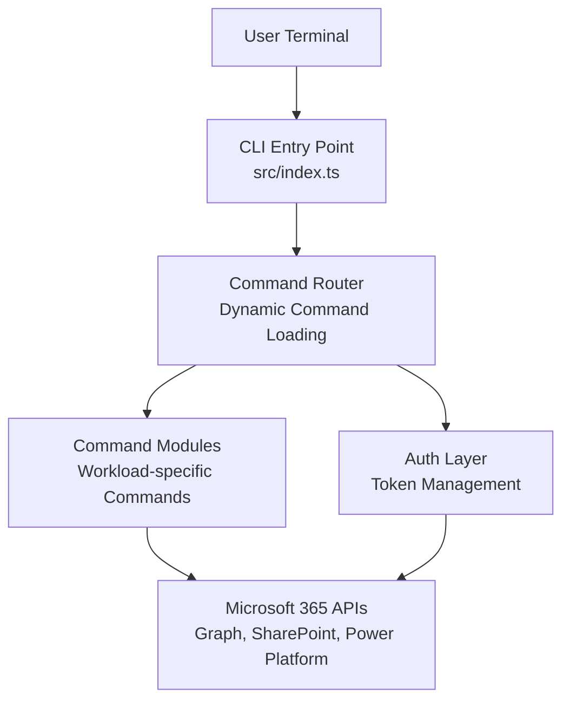
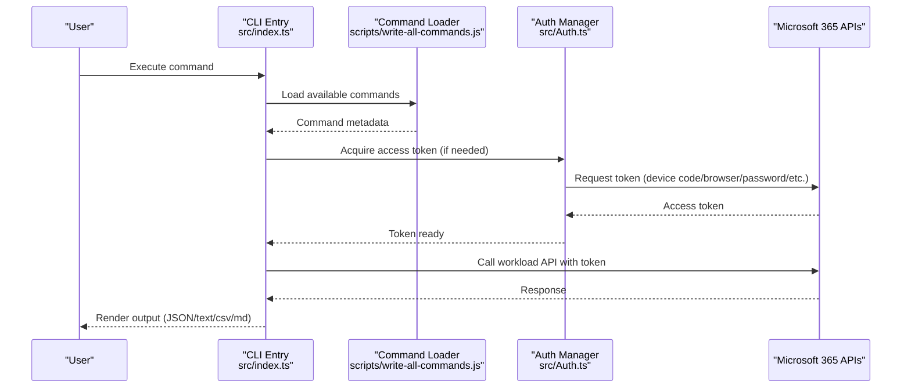
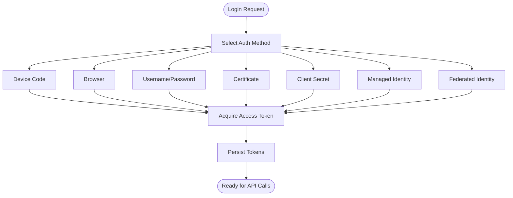
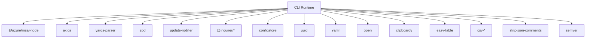

# Introduction

<cite>
**Referenced Files in This Document**
- [README.md](file://README.md)
- [package.json](file://package.json)
- [src/index.ts](file://src/index.ts)
- [docs/docs/about/why-cli.mdx](file://docs/docs/about/why-cli.mdx)
- [docs/docs/user-guide/installing-cli.mdx](file://docs/docs/user-guide/installing-cli.mdx)
- [docs/docs/user-guide/connecting-microsoft-365.mdx](file://docs/docs/user-guide/connecting-microsoft-365.mdx)
- [src/config.ts](file://src/config.ts)
- [src/Auth.ts](file://src/Auth.ts)
- [scripts/write-all-commands.js](file://scripts/write-all-commands.js)
</cite>

## Table of Contents
1. [Introduction](#introduction)
2. [Project Structure](#project-structure)
3. [Core Components](#core-components)
4. [Architecture Overview](#architecture-overview)
5. [Detailed Component Analysis](#detailed-component-analysis)
6. [Dependency Analysis](#dependency-analysis)
7. [Performance Considerations](#performance-considerations)
8. [Troubleshooting Guide](#troubleshooting-guide)
9. [Conclusion](#conclusion)

## Introduction
CLI for Microsoft 365 is a unified, cross-platform command-line interface designed to streamline management of Microsoft 365 environments and SharePoint Framework (SPFx) projects. It enables administrators, developers, and DevOps practitioners to automate tenant administration, configure workloads, and maintain SPFx solutions from any operating system and shell.

Key benefits include:
- Cross-platform and cross-shell compatibility (Linux, macOS, Windows; shells including bash, PowerShell, zsh, cmder, and Azure Cloud Shell)
- Unified login that grants access to all supported Microsoft 365 workloads through a single authentication flow
- Extensive command coverage spanning multiple Microsoft 365 services and Power Platform offerings
- Multiple authentication methods to suit interactive and non-interactive scenarios
- Seamless integration into CI/CD pipelines and scripting workflows

The project is part of the Microsoft 365 & Power Platform Community (PnP) initiative, emphasizing community-driven development and broad ecosystem alignment.

## Project Structure
At a high level, the project consists of:
- A Node.js-based CLI entry point that initializes the runtime, handles updates, and executes commands
- A modular command architecture supporting hundreds of commands across Microsoft 365 domains
- Authentication and token management built on industry-standard protocols and libraries
- Comprehensive documentation and user guides covering installation, login, usage, and DevOps integration

**Diagram sources**
- [src/index.ts:1-22](file://src/index.ts#L1-L22)
- [scripts/write-all-commands.js:12-42](file://scripts/write-all-commands.js#L12-L42)
- [src/Auth.ts:197-305](file://src/Auth.ts#L197-L305)

**Section sources**
- [README.md:46-111](file://README.md#L46-L111)
- [docs/docs/user-guide/installing-cli.mdx:13-17](file://docs/docs/user-guide/installing-cli.mdx#L13-L17)
- [docs/docs/about/why-cli.mdx:7-18](file://docs/docs/about/why-cli.mdx#L7-L18)

## Core Components
- Cross-platform and cross-shell support: The CLI runs on Linux, macOS, and Windows and is compatible with bash, PowerShell, zsh, cmder, and Azure Cloud Shell. This ensures consistent behavior across diverse environments and developer preferences.
- Unified login and authentication: Users authenticate once and gain access to all supported Microsoft 365 workloads. The CLI supports multiple authentication methods, including device code, browser, username/password, certificate, client secret, managed identity, and federated identity.
- Extensive command coverage: The CLI encompasses commands for numerous Microsoft 365 services and Power Platform components, enabling comprehensive tenant and solution management.
- SharePoint Framework support: The CLI provides dedicated commands for SPFx project lifecycle tasks, including environment setup and compatibility checks.
- Community-driven development: Built as a PnP project, the CLI thrives on community contributions and feedback.

**Section sources**
- [README.md:68-111](file://README.md#L68-L111)
- [docs/docs/user-guide/connecting-microsoft-365.mdx:19-98](file://docs/docs/user-guide/connecting-microsoft-365.mdx#L19-L98)
- [docs/docs/about/why-cli.mdx:14-18](file://docs/docs/about/why-cli.mdx#L14-L18)

## Architecture Overview
The CLI architecture centers on a dynamic command discovery mechanism and a robust authentication layer that retrieves and caches access tokens for Microsoft 365 APIs.

**Diagram sources**
- [src/index.ts:6-21](file://src/index.ts#L6-L21)
- [scripts/write-all-commands.js:12-42](file://scripts/write-all-commands.js#L12-L42)
- [src/Auth.ts:197-305](file://src/Auth.ts#L197-L305)

## Detailed Component Analysis

### Cross-Platform Compatibility and Shell Support
- Operating systems: Linux, macOS, Windows
- Shells: bash, PowerShell, zsh, cmder, Azure Cloud Shell
- Node.js runtime requirement ensures portability and consistent execution across platforms

**Section sources**
- [README.md:70-79](file://README.md#L70-L79)
- [docs/docs/user-guide/installing-cli.mdx:13-17](file://docs/docs/user-guide/installing-cli.mdx#L13-L17)

### Unified Login and Authentication Methods
- Supported methods: device code, browser, username/password, certificate, client secret, managed identity, federated identity
- Authentication flow: OAuth 2.0 with token caching and persistence
- Multi-connection support: switch between tenants and identities without re-authentication

**Diagram sources**
- [src/Auth.ts:103-111](file://src/Auth.ts#L103-L111)
- [docs/docs/user-guide/connecting-microsoft-365.mdx:19-98](file://docs/docs/user-guide/connecting-microsoft-365.mdx#L19-L98)

**Section sources**
- [docs/docs/user-guide/connecting-microsoft-365.mdx:19-98](file://docs/docs/user-guide/connecting-microsoft-365.mdx#L19-L98)
- [src/Auth.ts:197-305](file://src/Auth.ts#L197-L305)

### Command Coverage and Workload Areas
- Supported workloads include Microsoft Entra ID, Teams, Planner, Power Platform, SharePoint Online, Viva, and more
- Commands are grouped by domain (for example, spo for SharePoint Online, entra for Microsoft Entra ID)
- Extensive command catalog enables comprehensive tenant management and automation

**Section sources**
- [README.md:82-99](file://README.md#L82-L99)
- [docs/docs/about/why-cli.mdx:21-34](file://docs/docs/about/why-cli.mdx#L21-L34)

### SharePoint Framework (SPFx) Support
- Dedicated commands for SPFx project lifecycle tasks
- Environment setup and compatibility checks
- Integration with development workflows and CI/CD

**Section sources**
- [README.md:107-109](file://README.md#L107-L109)
- [docs/docs/about/why-cli.mdx:14-15](file://docs/docs/about/why-cli.mdx#L14-L15)

### Relationship to the Microsoft 365 Ecosystem and DevOps Practices
- Integrates with CI/CD pipelines and scripting workflows
- Supports automation scenarios across Azure DevOps and GitHub Actions
- Provides output modes (JSON, text, CSV, Markdown) for flexible consumption

**Section sources**
- [docs/docs/about/why-cli.mdx:13-14](file://docs/docs/about/why-cli.mdx#L13-L14)
- [docs/docs/about/why-cli.mdx:36-40](file://docs/docs/about/why-cli.mdx#L36-L40)

### Community-Driven Development (PnP)
- Open-source project under the Microsoft 365 & Power Platform Community (PnP)
- Encourages contributions and collaboration from the community
- Aligns with broader Microsoft 365 ecosystem goals

**Section sources**
- [README.md:241-243](file://README.md#L241-L243)

## Dependency Analysis
The CLI relies on a set of core dependencies for authentication, HTTP requests, token handling, and user interaction. These dependencies enable cross-platform compatibility and robust API communication.

**Diagram sources**
- [package.json:273-304](file://package.json#L273-L304)

**Section sources**
- [package.json:273-304](file://package.json#L273-L304)

## Performance Considerations
- Token caching and silent acquisition reduce repeated authentication overhead
- Command output modes enable efficient scripting and data processing
- Dynamic command loading minimizes startup time and memory footprint

[No sources needed since this section provides general guidance]

## Troubleshooting Guide
- Authentication failures: Verify selected auth method, environment variables, and permissions
- Proxy connectivity: Configure environment variables for proxy behavior
- Token persistence: Understand how tokens are stored and cleared on logout
- Command availability: Use the global help to discover commands and their options

**Section sources**
- [docs/docs/user-guide/connecting-microsoft-365.mdx:209-216](file://docs/docs/user-guide/connecting-microsoft-365.mdx#L209-L216)
- [docs/docs/cmd/_global.mdx:1-17](file://docs/docs/cmd/_global.mdx#L1-L17)

## Conclusion
CLI for Microsoft 365 delivers a unified, cross-platform, and community-driven solution for managing Microsoft 365 environments and SharePoint Framework projects. Its extensive command coverage, flexible authentication options, and strong DevOps integration make it an essential tool for modern Microsoft 365 administration and automation.