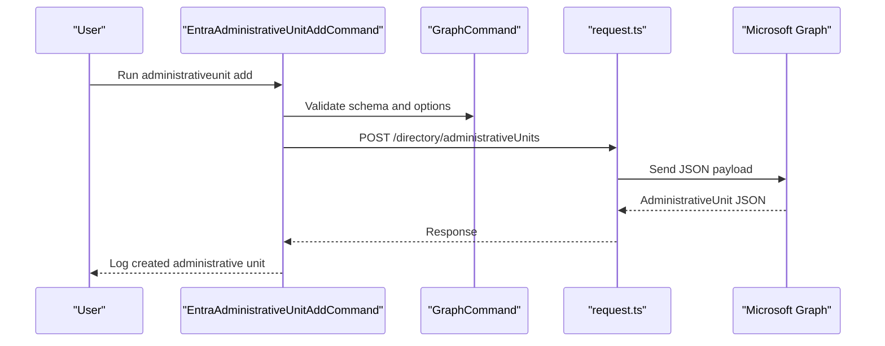
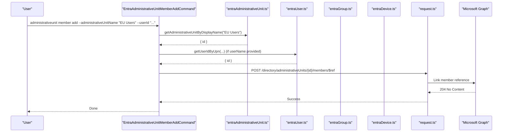
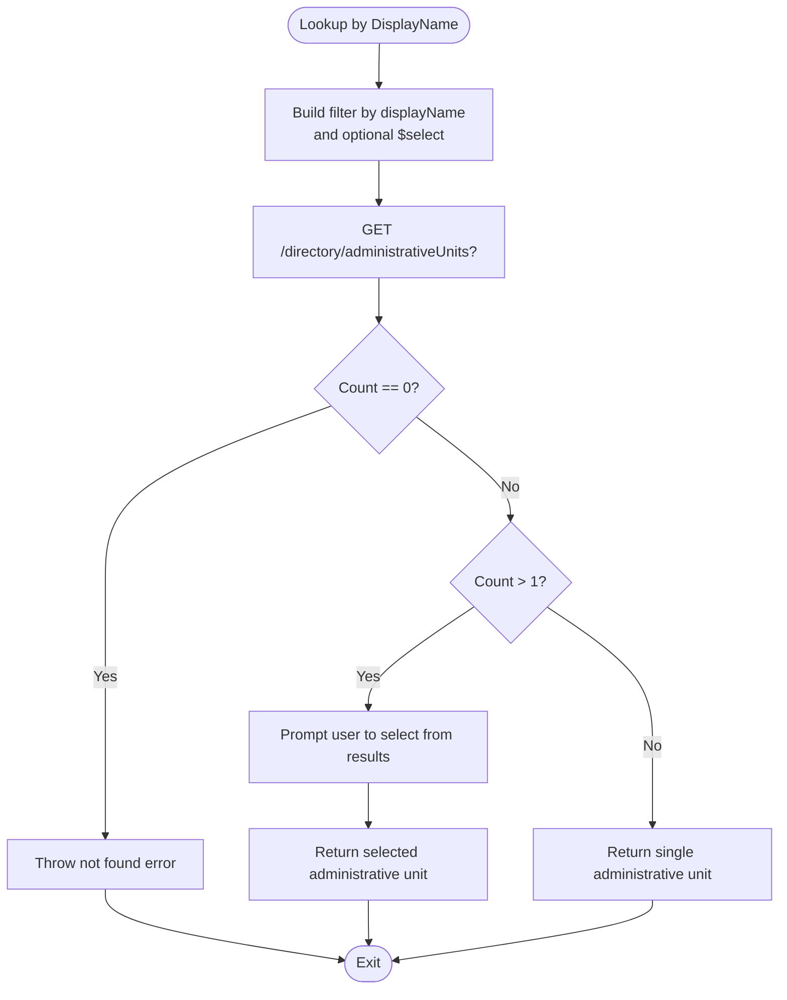
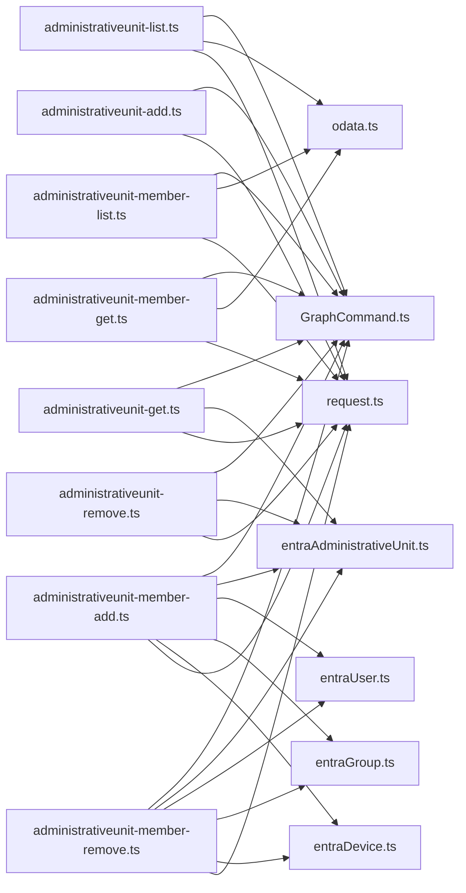

# Administrative Units

<cite>
**Referenced Files in This Document**
- [administrativeunit-add.ts](file://src/m365/entra/commands/administrativeunit/administrativeunit-add.ts)
- [administrativeunit-get.ts](file://src/m365/entra/commands/administrativeunit/administrativeunit-get.ts)
- [administrativeunit-list.ts](file://src/m365/entra/commands/administrativeunit/administrativeunit-list.ts)
- [administrativeunit-remove.ts](file://src/m365/entra/commands/administrativeunit/administrativeunit-remove.ts)
- [administrativeunit-member-add.ts](file://src/m365/entra/commands/administrativeunit/administrativeunit-member-add.ts)
- [administrativeunit-member-remove.ts](file://src/m365/entra/commands/administrativeunit/administrativeunit-member-remove.ts)
- [administrativeunit-member-list.ts](file://src/m365/entra/commands/administrativeunit/administrativeunit-member-list.ts)
- [administrativeunit-member-get.ts](file://src/m365/entra/commands/administrativeunit/administrativeunit-member-get.ts)
- [entraAdministrativeUnit.ts](file://src/utils/entraAdministrativeUnit.ts)
- [entraUser.ts](file://src/utils/entraUser.ts)
- [entraGroup.ts](file://src/utils/entraGroup.ts)
- [entraDevice.ts](file://src/utils/entraDevice.ts)
- [odata.ts](file://src/utils/odata.ts)
- [request.ts](file://src/request.ts)
- [GraphCommand.ts](file://src/m365/base/GraphCommand.ts)
- [administrativeunit-add.mdx](file://docs/docs/cmd/entra/administrativeunit/administrativeunit-add.mdx)
- [administrativeunit-get.mdx](file://docs/docs/cmd/entra/administrativeunit/administrativeunit-get.mdx)
- [administrativeunit-list.mdx](file://docs/docs/cmd/entra/administrativeunit/administrativeunit-list.mdx)
- [administrativeunit-remove.mdx](file://docs/docs/cmd/entra/administrativeunit/administrativeunit-remove.mdx)
- [administrativeunit-member-add.mdx](file://docs/docs/cmd/entra/administrativeunit/administrativeunit-member-add.mdx)
- [administrativeunit-member-remove.mdx](file://docs/docs/cmd/entra/administrativeunit/administrativeunit-member-remove.mdx)
- [administrativeunit-member-list.mdx](file://docs/docs/cmd/entra/administrativeunit/administrativeunit-member-list.mdx)
- [administrativeunit-member-get.mdx](file://docs/docs/cmd/entra/administrativeunit/administrativeunit-member-get.mdx)
</cite>

## Table of Contents
1. [Introduction](#introduction)
2. [Project Structure](#project-structure)
3. [Core Components](#core-components)
4. [Architecture Overview](#architecture-overview)
5. [Detailed Component Analysis](#detailed-component-analysis)
6. [Dependency Analysis](#dependency-analysis)
7. [Performance Considerations](#performance-considerations)
8. [Troubleshooting Guide](#troubleshooting-guide)
9. [Conclusion](#conclusion)
10. [Appendices](#appendices)

## Introduction
This document explains administrative unit management in the CLI for Microsoft 365 with a focus on Microsoft Entra ID. It covers administrative unit lifecycle operations (create, get, list, delete), member management (add, remove, list, get), and advanced scenarios such as scoped membership queries and integration with other Entra ID features. Practical examples demonstrate provisioning, member management, and alignment with conditional access and localized administration use cases.

## Project Structure
Administrative unit commands are implemented as Entra-specific Graph commands under the CLI’s entra module. Supporting utilities encapsulate common operations against Microsoft Graph and normalize responses. Documentation pages describe command usage and options.

```mermaid
graph TB
subgraph "CLI Entrypoints"
AU_ADD["administrativeunit-add.ts"]
AU_GET["administrativeunit-get.ts"]
AU_LIST["administrativeunit-list.ts"]
AU_REMOVE["administrativeunit-remove.ts"]
AU_MEM_ADD["administrativeunit-member-add.ts"]
AU_MEM_REMOVE["administrativeunit-member-remove.ts"]
AU_MEM_LIST["administrativeunit-member-list.ts"]
AU_MEM_GET["administrativeunit-member-get.ts"]
end
subgraph "Utilities"
UTIL_AU["entraAdministrativeUnit.ts"]
UTIL_USER["entraUser.ts"]
UTIL_GROUP["entraGroup.ts"]
UTIL_DEVICE["entraDevice.ts"]
UTIL_ODATA["odata.ts"]
end
subgraph "Base & Infra"
BASE_CMD["GraphCommand.ts"]
REQ["request.ts"]
end
AU_ADD --> BASE_CMD
AU_GET --> BASE_CMD
AU_LIST --> BASE_CMD
AU_REMOVE --> BASE_CMD
AU_MEM_ADD --> BASE_CMD
AU_MEM_REMOVE --> BASE_CMD
AU_MEM_LIST --> BASE_CMD
AU_MEM_GET --> BASE_CMD
AU_ADD --> REQ
AU_GET --> REQ
AU_LIST --> REQ
AU_REMOVE --> REQ
AU_MEM_ADD --> REQ
AU_MEM_REMOVE --> REQ
AU_MEM_LIST --> REQ
AU_MEM_GET --> REQ
AU_GET --> UTIL_AU
AU_REMOVE --> UTIL_AU
AU_MEM_ADD --> UTIL_AU
AU_MEM_ADD --> UTIL_USER
AU_MEM_ADD --> UTIL_GROUP
AU_MEM_ADD --> UTIL_DEVICE
AU_MEM_REMOVE --> UTIL_AU
AU_MEM_REMOVE --> UTIL_USER
AU_MEM_REMOVE --> UTIL_GROUP
AU_MEM_REMOVE --> UTIL_DEVICE
AU_MEM_LIST --> UTIL_AU
AU_MEM_GET --> UTIL_AU
```

**Diagram sources**
- [administrativeunit-add.ts:1-68](file://src/m365/entra/commands/administrativeunit/administrativeunit-add.ts#L1-L68)
- [administrativeunit-get.ts:1-89](file://src/m365/entra/commands/administrativeunit/administrativeunit-get.ts#L1-L89)
- [administrativeunit-list.ts:1-62](file://src/m365/entra/commands/administrativeunit/administrativeunit-list.ts#L1-L62)
- [administrativeunit-remove.ts:1-82](file://src/m365/entra/commands/administrativeunit/administrativeunit-remove.ts#L1-L82)
- [administrativeunit-member-add.ts:1-185](file://src/m365/entra/commands/administrativeunit/administrativeunit-member-add.ts#L1-L185)
- [administrativeunit-member-remove.ts:1-208](file://src/m365/entra/commands/administrativeunit/administrativeunit-member-remove.ts#L1-L208)
- [administrativeunit-member-list.ts:1-190](file://src/m365/entra/commands/administrativeunit/administrativeunit-member-list.ts#L1-L190)
- [administrativeunit-member-get.ts:1-160](file://src/m365/entra/commands/administrativeunit/administrativeunit-member-get.ts#L1-L160)
- [entraAdministrativeUnit.ts:1-45](file://src/utils/entraAdministrativeUnit.ts#L1-L45)
- [entraUser.ts](file://src/utils/entraUser.ts)
- [entraGroup.ts](file://src/utils/entraGroup.ts)
- [entraDevice.ts](file://src/utils/entraDevice.ts)
- [GraphCommand.ts](file://src/m365/base/GraphCommand.ts)
- [request.ts](file://src/request.ts)

**Section sources**
- [administrativeunit-add.ts:1-68](file://src/m365/entra/commands/administrativeunit/administrativeunit-add.ts#L1-L68)
- [administrativeunit-get.ts:1-89](file://src/m365/entra/commands/administrativeunit/administrativeunit-get.ts#L1-L89)
- [administrativeunit-list.ts:1-62](file://src/m365/entra/commands/administrativeunit/administrativeunit-list.ts#L1-L62)
- [administrativeunit-remove.ts:1-82](file://src/m365/entra/commands/administrativeunit/administrativeunit-remove.ts#L1-L82)
- [administrativeunit-member-add.ts:1-185](file://src/m365/entra/commands/administrativeunit/administrativeunit-member-add.ts#L1-L185)
- [administrativeunit-member-remove.ts:1-208](file://src/m365/entra/commands/administrativeunit/administrativeunit-member-remove.ts#L1-L208)
- [administrativeunit-member-list.ts:1-190](file://src/m365/entra/commands/administrativeunit/administrativeunit-member-list.ts#L1-L190)
- [administrativeunit-member-get.ts:1-160](file://src/m365/entra/commands/administrativeunit/administrativeunit-member-get.ts#L1-L160)
- [entraAdministrativeUnit.ts:1-45](file://src/utils/entraAdministrativeUnit.ts#L1-L45)

## Core Components
- Administrative unit lifecycle commands:
  - Add: creates an administrative unit with optional description and hidden membership visibility.
  - Get: retrieves a specific administrative unit by id or display name.
  - List: enumerates administrative units with optional property selection.
  - Remove: deletes an administrative unit by id or display name with confirmation support.
- Member management commands:
  - Add member: adds a user, group, or device to an administrative unit by id or name.
  - Remove member: removes a specific member by id or by identity (UPN/group name/device name).
  - List members: lists members with optional filtering and property expansion.
  - Get member: retrieves a specific member with optional property selection.
- Utilities:
  - Administrative unit lookup by display name with duplicate resolution.
  - Identity resolution helpers for users, groups, and devices.
  - OData query builder and paging helper.
  - HTTP request wrapper for Graph endpoints.

**Section sources**
- [administrativeunit-add.ts:22-66](file://src/m365/entra/commands/administrativeunit/administrativeunit-add.ts#L22-L66)
- [administrativeunit-get.ts:23-87](file://src/m365/entra/commands/administrativeunit/administrativeunit-get.ts#L23-L87)
- [administrativeunit-list.ts:19-60](file://src/m365/entra/commands/administrativeunit/administrativeunit-list.ts#L19-L60)
- [administrativeunit-remove.ts:23-80](file://src/m365/entra/commands/administrativeunit/administrativeunit-remove.ts#L23-L80)
- [administrativeunit-member-add.ts:27-183](file://src/m365/entra/commands/administrativeunit/administrativeunit-member-add.ts#L27-L183)
- [administrativeunit-member-remove.ts:30-206](file://src/m365/entra/commands/administrativeunit/administrativeunit-member-remove.ts#L30-L206)
- [administrativeunit-member-list.ts:28-188](file://src/m365/entra/commands/administrativeunit/administrativeunit-member-list.ts#L28-L188)
- [administrativeunit-member-get.ts:27-158](file://src/m365/entra/commands/administrativeunit/administrativeunit-member-get.ts#L27-L158)
- [entraAdministrativeUnit.ts:6-44](file://src/utils/entraAdministrativeUnit.ts#L6-L44)

## Architecture Overview
The CLI delegates administrative unit operations to Microsoft Graph via typed commands extending a shared Graph base. Commands construct requests, optionally resolve identities, and handle Graph responses and errors.

**Diagram sources**
- [administrativeunit-add.ts:39-65](file://src/m365/entra/commands/administrativeunit/administrativeunit-add.ts#L39-L65)
- [GraphCommand.ts](file://src/m365/base/GraphCommand.ts)
- [request.ts](file://src/request.ts)

**Section sources**
- [administrativeunit-add.ts:39-65](file://src/m365/entra/commands/administrativeunit/administrativeunit-add.ts#L39-L65)
- [GraphCommand.ts](file://src/m365/base/GraphCommand.ts)
- [request.ts](file://src/request.ts)

## Detailed Component Analysis

### Administrative Unit Lifecycle Operations
- Administrative Unit Add
  - Purpose: Create an administrative unit with display name, optional description, and visibility.
  - Key behaviors:
    - Builds request body from validated options.
    - Sends POST to the administrative units endpoint.
    - Logs the created administrative unit.
  - Example usage paths:
    - [administrativeunit-add.mdx](file://docs/docs/cmd/entra/administrativeunit/administrativeunit-add.mdx)

- Administrative Unit Get
  - Purpose: Retrieve a single administrative unit by id or display name.
  - Key behaviors:
    - Validates that exactly one of id or displayName is provided.
    - Uses utility to resolve by display name if needed.
    - Supports selecting specific properties.
  - Example usage paths:
    - [administrativeunit-get.mdx](file://docs/docs/cmd/entra/administrativeunit/administrativeunit-get.mdx)

- Administrative Unit List
  - Purpose: Enumerate administrative units with optional property selection.
  - Key behaviors:
    - Applies $select filtering for top-level properties.
    - Uses OData helper to fetch all items.
    - Sets default properties for concise output.
  - Example usage paths:
    - [administrativeunit-list.mdx](file://docs/docs/cmd/entra/administrativeunit/administrativeunit-list.mdx)

- Administrative Unit Remove
  - Purpose: Delete an administrative unit by id or display name.
  - Key behaviors:
    - Validates exclusive use of id or displayName.
    - Resolves id from display name when needed.
    - Supports force flag to bypass confirmation.
  - Example usage paths:
    - [administrativeunit-remove.mdx](file://docs/docs/cmd/entra/administrativeunit/administrativeunit-remove.mdx)

**Section sources**
- [administrativeunit-add.ts:22-66](file://src/m365/entra/commands/administrativeunit/administrativeunit-add.ts#L22-L66)
- [administrativeunit-get.ts:23-59](file://src/m365/entra/commands/administrativeunit/administrativeunit-get.ts#L23-L59)
- [administrativeunit-list.ts:19-59](file://src/m365/entra/commands/administrativeunit/administrativeunit-list.ts#L19-L59)
- [administrativeunit-remove.ts:23-79](file://src/m365/entra/commands/administrativeunit/administrativeunit-remove.ts#L23-L79)
- [administrativeunit-add.mdx](file://docs/docs/cmd/entra/administrativeunit/administrativeunit-add.mdx)
- [administrativeunit-get.mdx](file://docs/docs/cmd/entra/administrativeunit/administrativeunit-get.mdx)
- [administrativeunit-list.mdx](file://docs/docs/cmd/entra/administrativeunit/administrativeunit-list.mdx)
- [administrativeunit-remove.mdx](file://docs/docs/cmd/entra/administrativeunit/administrativeunit-remove.mdx)

### Administrative Unit Member Management
- Add Member
  - Purpose: Add a user, group, or device to an administrative unit.
  - Key behaviors:
    - Accepts administrative unit by id or name; resolves id when needed.
    - Accepts member by id or name; resolves ids for user UPN, group name, device name.
    - Posts to the members/$ref endpoint with OData reference.
  - Example usage paths:
    - [administrativeunit-member-add.mdx](file://docs/docs/cmd/entra/administrativeunit/administrativeunit-member-add.mdx)

- Remove Member
  - Purpose: Remove a specific member by id or by identity.
  - Key behaviors:
    - Accepts administrative unit by id or name; resolves id when needed.
    - Accepts member by id or identity; resolves ids when names are provided.
    - Deletes from the members/{id}/$ref endpoint.
    - Supports force flag to bypass confirmation.
  - Example usage paths:
    - [administrativeunit-member-remove.mdx](file://docs/docs/cmd/entra/administrativeunit/administrativeunit-member-remove.mdx)

- List Members
  - Purpose: List members with optional type filtering and property expansion.
  - Key behaviors:
    - Accepts administrative unit by id or name; resolves id when needed.
    - Supports type=user|group|device and filter with ConsistencyLevel header when needed.
    - Expands nested properties via $expand when requested.
  - Example usage paths:
    - [administrativeunit-member-list.mdx](file://docs/docs/cmd/entra/administrativeunit/administrativeunit-member-list.mdx)

- Get Member
  - Purpose: Retrieve a specific member with optional property selection.
  - Key behaviors:
    - Accepts administrative unit by id or name; resolves id when needed.
    - Supports $select and $expand for properties.
    - Normalizes odata type to a readable type field.
  - Example usage paths:
    - [administrativeunit-member-get.mdx](file://docs/docs/cmd/entra/administrativeunit/administrativeunit-member-get.mdx)

**Diagram sources**
- [administrativeunit-member-add.ts:116-178](file://src/m365/entra/commands/administrativeunit/administrativeunit-member-add.ts#L116-L178)
- [entraAdministrativeUnit.ts:14-44](file://src/utils/entraAdministrativeUnit.ts#L14-L44)
- [entraUser.ts](file://src/utils/entraUser.ts)
- [request.ts](file://src/request.ts)

**Section sources**
- [administrativeunit-member-add.ts:27-183](file://src/m365/entra/commands/administrativeunit/administrativeunit-member-add.ts#L27-L183)
- [administrativeunit-member-remove.ts:30-206](file://src/m365/entra/commands/administrativeunit/administrativeunit-member-remove.ts#L30-L206)
- [administrativeunit-member-list.ts:28-188](file://src/m365/entra/commands/administrativeunit/administrativeunit-member-list.ts#L28-L188)
- [administrativeunit-member-get.ts:27-158](file://src/m365/entra/commands/administrativeunit/administrativeunit-member-get.ts#L27-L158)
- [entraAdministrativeUnit.ts:14-44](file://src/utils/entraAdministrativeUnit.ts#L14-L44)
- [entraUser.ts](file://src/utils/entraUser.ts)
- [entraGroup.ts](file://src/utils/entraGroup.ts)
- [entraDevice.ts](file://src/utils/entraDevice.ts)
- [administrativeunit-member-add.mdx](file://docs/docs/cmd/entra/administrativeunit/administrativeunit-member-add.mdx)
- [administrativeunit-member-remove.mdx](file://docs/docs/cmd/entra/administrativeunit/administrativeunit-member-remove.mdx)
- [administrativeunit-member-list.mdx](file://docs/docs/cmd/entra/administrativeunit/administrativeunit-member-list.mdx)
- [administrativeunit-member-get.mdx](file://docs/docs/cmd/entra/administrativeunit/administrativeunit-member-get.mdx)

### Administrative Unit Lookup Utility
- Purpose: Resolve administrative unit by display name with duplicate handling and optional property selection.
- Key behaviors:
  - Filters by displayName and supports $select for properties.
  - Handles multiple matches by prompting the user to select.
  - Throws when no match is found.

**Diagram sources**
- [entraAdministrativeUnit.ts:14-44](file://src/utils/entraAdministrativeUnit.ts#L14-L44)

**Section sources**
- [entraAdministrativeUnit.ts:6-44](file://src/utils/entraAdministrativeUnit.ts#L6-L44)

### Scoped Role Management Scenarios
- Administrative units enable scoping of role assignments to reduce blast radius and align with organizational boundaries.
- Typical scenarios:
  - Scope role assignments to an administrative unit representing a department or region.
  - Combine administrative unit membership with conditional access policies to restrict sign-in locations or devices.
  - Use administrative unit visibility (hidden membership) to limit who can see membership while retaining assignment scope.
- Practical tips:
  - Create separate administrative units per scope (e.g., "Finance", "EMEA").
  - Assign roles scoped to the administrative unit rather than global scopes.
  - Combine with group-based conditional access policies to enforce location or device compliance.

[No sources needed since this section provides conceptual guidance]

## Dependency Analysis
- Command-layer dependencies:
  - All administrative unit commands extend the Graph base command and rely on the request wrapper.
  - Member commands depend on identity resolution utilities for users, groups, and devices.
  - Administrative unit retrieval helpers are reused across commands.
- Utility dependencies:
  - OData helper centralizes pagination and query construction.
  - Identity utilities encapsulate Graph calls for user/group/device discovery.

**Diagram sources**
- [administrativeunit-add.ts:1-68](file://src/m365/entra/commands/administrativeunit/administrativeunit-add.ts#L1-L68)
- [administrativeunit-get.ts:1-89](file://src/m365/entra/commands/administrativeunit/administrativeunit-get.ts#L1-L89)
- [administrativeunit-list.ts:1-62](file://src/m365/entra/commands/administrativeunit/administrativeunit-list.ts#L1-L62)
- [administrativeunit-remove.ts:1-82](file://src/m365/entra/commands/administrativeunit/administrativeunit-remove.ts#L1-L82)
- [administrativeunit-member-add.ts:1-185](file://src/m365/entra/commands/administrativeunit/administrativeunit-member-add.ts#L1-L185)
- [administrativeunit-member-remove.ts:1-208](file://src/m365/entra/commands/administrativeunit/administrativeunit-member-remove.ts#L1-L208)
- [administrativeunit-member-list.ts:1-190](file://src/m365/entra/commands/administrativeunit/administrativeunit-member-list.ts#L1-L190)
- [administrativeunit-member-get.ts:1-160](file://src/m365/entra/commands/administrativeunit/administrativeunit-member-get.ts#L1-L160)
- [entraAdministrativeUnit.ts:1-45](file://src/utils/entraAdministrativeUnit.ts#L1-L45)
- [entraUser.ts](file://src/utils/entraUser.ts)
- [entraGroup.ts](file://src/utils/entraGroup.ts)
- [entraDevice.ts](file://src/utils/entraDevice.ts)
- [odata.ts](file://src/utils/odata.ts)
- [request.ts](file://src/request.ts)
- [GraphCommand.ts](file://src/m365/base/GraphCommand.ts)

**Section sources**
- [administrativeunit-member-add.ts:1-185](file://src/m365/entra/commands/administrativeunit/administrativeunit-member-add.ts#L1-L185)
- [administrativeunit-member-remove.ts:1-208](file://src/m365/entra/commands/administrativeunit/administrativeunit-member-remove.ts#L1-L208)
- [administrativeunit-member-list.ts:1-190](file://src/m365/entra/commands/administrativeunit/administrativeunit-member-list.ts#L1-L190)
- [administrativeunit-member-get.ts:1-160](file://src/m365/entra/commands/administrativeunit/administrativeunit-member-get.ts#L1-L160)
- [entraAdministrativeUnit.ts:1-45](file://src/utils/entraAdministrativeUnit.ts#L1-L45)
- [odata.ts](file://src/utils/odata.ts)
- [request.ts](file://src/request.ts)
- [GraphCommand.ts](file://src/m365/base/GraphCommand.ts)

## Performance Considerations
- Prefer specifying $select to limit response size when listing administrative units or members.
- Use type and filter options in member list to narrow results server-side.
- Avoid unnecessary property expansions; only expand fields you need.
- Batch operations: where possible, leverage list operations to minimize round-trips when adding/removing multiple members.

[No sources needed since this section provides general guidance]

## Troubleshooting Guide
- Administrative unit not found
  - Symptom: Error indicating the administrative unit does not exist.
  - Cause: Provided id or display name is incorrect or misspelled.
  - Resolution: Verify id format (GUID) and display name spelling; use administrativeunit get to confirm existence.
  - Related code paths:
    - [administrativeunit-get.ts:43-58](file://src/m365/entra/commands/administrativeunit/administrativeunit-get.ts#L43-L58)
    - [administrativeunit-remove.ts:45-67](file://src/m365/entra/commands/administrativeunit/administrativeunit-remove.ts#L45-L67)
    - [entraAdministrativeUnit.ts:33-35](file://src/utils/entraAdministrativeUnit.ts#L33-L35)

- Duplicate display names
  - Symptom: Multiple administrative units with the same display name.
  - Cause: Multiple administrative units share the same displayName.
  - Resolution: Use the id option or follow interactive selection prompt to choose the intended unit.
  - Related code paths:
    - [entraAdministrativeUnit.ts:37-41](file://src/utils/entraAdministrativeUnit.ts#L37-L41)

- Invalid identifiers
  - Symptom: Validation errors for id, userId, groupId, or deviceId.
  - Cause: Non-GUID values passed to options requiring GUIDs.
  - Resolution: Ensure all GUID-based options contain valid identifiers.
  - Related code paths:
    - [administrativeunit-member-add.ts:88-108](file://src/m365/entra/commands/administrativeunit/administrativeunit-member-add.ts#L88-L108)
    - [administrativeunit-member-remove.ts:100-125](file://src/m365/entra/commands/administrativeunit/administrativeunit-member-remove.ts#L100-L125)
    - [administrativeunit-member-get.ts:72-85](file://src/m365/entra/commands/administrativeunit/administrativeunit-member-get.ts#L72-L85)

- Member not found or already removed
  - Symptom: Errors when removing a member.
  - Cause: Member id/name not found or already removed.
  - Resolution: Confirm membership exists; use administrativeunit member list to verify; retry after ensuring correct identifiers.
  - Related code paths:
    - [administrativeunit-member-remove.ts:133-193](file://src/m365/entra/commands/administrativeunit/administrativeunit-member-remove.ts#L133-L193)

**Section sources**
- [administrativeunit-get.ts:43-58](file://src/m365/entra/commands/administrativeunit/administrativeunit-get.ts#L43-L58)
- [administrativeunit-remove.ts:45-67](file://src/m365/entra/commands/administrativeunit/administrativeunit-remove.ts#L45-L67)
- [entraAdministrativeUnit.ts:33-41](file://src/utils/entraAdministrativeUnit.ts#L33-L41)
- [administrativeunit-member-add.ts:88-108](file://src/m365/entra/commands/administrativeunit/administrativeunit-member-add.ts#L88-L108)
- [administrativeunit-member-remove.ts:100-125](file://src/m365/entra/commands/administrativeunit/administrativeunit-member-remove.ts#L100-L125)
- [administrativeunit-member-get.ts:72-85](file://src/m365/entra/commands/administrativeunit/administrativeunit-member-get.ts#L72-L85)

## Conclusion
Administrative units in the CLI for Microsoft 365 provide a powerful mechanism to organize and scope administrative tasks within Microsoft Entra ID. The implemented commands cover the full lifecycle and member management, with robust identity resolution and query capabilities. By leveraging administrative units, administrators can achieve granular control aligned with organizational structures, integrate with conditional access policies, and streamline day-to-day administrative tasks.

[No sources needed since this section summarizes without analyzing specific files]

## Appendices

### Practical Examples Index
- Provisioning an administrative unit:
  - Command: administrativeunit add
  - Reference: [administrativeunit-add.mdx](file://docs/docs/cmd/entra/administrativeunit/administrativeunit-add.mdx)
- Retrieving an administrative unit:
  - Command: administrativeunit get
  - Reference: [administrativeunit-get.mdx](file://docs/docs/cmd/entra/administrativeunit/administrativeunit-get.mdx)
- Listing administrative units:
  - Command: administrativeunit list
  - Reference: [administrativeunit-list.mdx](file://docs/docs/cmd/entra/administrativeunit/administrativeunit-list.mdx)
- Deleting an administrative unit:
  - Command: administrativeunit remove
  - Reference: [administrativeunit-remove.mdx](file://docs/docs/cmd/entra/administrativeunit/administrativeunit-remove.mdx)
- Adding a member (user, group, device):
  - Command: administrativeunit member add
  - Reference: [administrativeunit-member-add.mdx](file://docs/docs/cmd/entra/administrativeunit/administrativeunit-member-add.mdx)
- Removing a member:
  - Command: administrativeunit member remove
  - Reference: [administrativeunit-member-remove.mdx](file://docs/docs/cmd/entra/administrativeunit/administrativeunit-member-remove.mdx)
- Listing members with filters:
  - Command: administrativeunit member list
  - Reference: [administrativeunit-member-list.mdx](file://docs/docs/cmd/entra/administrativeunit/administrativeunit-member-list.mdx)
- Getting a specific member:
  - Command: administrativeunit member get
  - Reference: [administrativeunit-member-get.mdx](file://docs/docs/cmd/entra/administrativeunit/administrativeunit-member-get.mdx)

[No sources needed since this section aggregates references without analyzing specific files]