# Application Management

<cite>
**Referenced Files in This Document**
- [app-add.mdx](file://docs/docs/cmd/entra/app/app-add.mdx)
- [app-get.mdx](file://docs/docs/cmd/entra/app/app-get.mdx)
- [app-list.mdx](file://docs/docs/cmd/entra/app/app-list.mdx)
- [app-remove.mdx](file://docs/docs/cmd/entra/app/app-remove.mdx)
- [app-set.mdx](file://docs/docs/cmd/entra/app/app-set.mdx)
- [app-permission-add.mdx](file://docs/docs/cmd/entra/app/app-permission-add.mdx)
- [app-permission-list.mdx](file://docs/docs/cmd/entra/app/app-permission-list.mdx)
- [app-permission-remove.mdx](file://docs/docs/cmd/entra/app/app-permission-remove.mdx)
- [app-role-add.mdx](file://docs/docs/cmd/entra/app/app-role-add.mdx)
- [app-role-list.mdx](file://docs/docs/cmd/entra/app/app-role-list.mdx)
- [app-role-remove.mdx](file://docs/docs/cmd/entra/app/app-role-remove.mdx)
- [app-open.mdx](file://docs/docs/cmd/app/app-open.mdx)
- [permission.mdx](file://docs/docs/cmd/app/permission/permission.mdx)
- [approleassignment-add.mdx](file://docs/docs/cmd/exo/approleassignment/approleassignment-add.mdx)
- [oauth2grant-add.mdx](file://docs/docs/cmd/entra/oauth2grant/oauth2grant-add.mdx)
- [oauth2grant-list.mdx](file://docs/docs/cmd/entra/oauth2grant/oauth2grant-list.mdx)
- [oauth2grant-remove.mdx](file://docs/docs/cmd/entra/oauth2grant/oauth2grant-remove.mdx)
- [serviceprincipal-add.mdx](file://docs/docs/cmd/entra/serviceprincipal/serviceprincipal-add.mdx)
- [serviceprincipal-get.mdx](file://docs/docs/cmd/entra/serviceprincipal/serviceprincipal-get.mdx)
- [serviceprincipal-list.mdx](file://docs/docs/cmd/entra/serviceprincipal/serviceprincipal-list.mdx)
- [serviceprincipal-remove.mdx](file://docs/docs/cmd/entra/serviceprincipal/serviceprincipal-remove.mdx)
- [serviceprincipal-set.mdx](file://docs/docs/cmd/entra/serviceprincipal/serviceprincipal-set.mdx)
- [enterpriseapp-get.mdx](file://docs/docs/cmd/entra/enterpriseapp/enterpriseapp-get.mdx)
- [enterpriseapp-list.mdx](file://docs/docs/cmd/entra/enterpriseapp/enterpriseapp-list.mdx)
- [enterpriseapp-set.mdx](file://docs/docs/cmd/entra/enterpriseapp/enterpriseapp-set.mdx)
- [enterpriseapp-remove.mdx](file://docs/docs/cmd/entra/enterpriseapp/enterpriseapp-remove.mdx)
</cite>

## Table of Contents
1. [Introduction](#introduction)
2. [Project Structure](#project-structure)
3. [Core Components](#core-components)
4. [Architecture Overview](#architecture-overview)
5. [Detailed Component Analysis](#detailed-component-analysis)
6. [Dependency Analysis](#dependency-analysis)
7. [Performance Considerations](#performance-considerations)
8. [Troubleshooting Guide](#troubleshooting-guide)
9. [Conclusion](#conclusion)
10. [Appendices](#appendices)

## Introduction
This document explains Microsoft Entra ID application management operations available in the CLI for Microsoft 365. It covers application registration creation, retrieval, listing, updates, and deletion; API permission management (add, list, remove); application role management (add, list, remove); service principal operations; enterprise application management; application role assignments; and OAuth2 permission grants. It also clarifies the differences between application registrations and enterprise applications, provides practical examples, and outlines common scenarios and troubleshooting tips.

## Project Structure
The application management capabilities are exposed via a set of commands under the entra namespace, grouped by resource type:
- Application registrations: creation, retrieval, listing, updates, deletion, and permission management
- Enterprise applications: retrieval, listing, updates, and deletion
- Service principals: creation, retrieval, listing, updates, and deletion
- OAuth2 permission grants: adding, listing, and removing grants
- Application role assignments: adding roles to applications

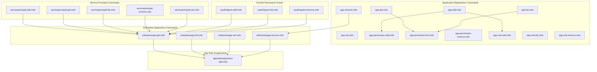

**Diagram sources**
- [app-add.mdx](file://docs/docs/cmd/entra/app/app-add.mdx)
- [app-get.mdx](file://docs/docs/cmd/entra/app/app-get.mdx)
- [app-list.mdx](file://docs/docs/cmd/entra/app/app-list.mdx)
- [app-remove.mdx](file://docs/docs/cmd/entra/app/app-remove.mdx)
- [app-set.mdx](file://docs/docs/cmd/entra/app/app-set.mdx)
- [app-permission-add.mdx](file://docs/docs/cmd/entra/app/app-permission-add.mdx)
- [app-permission-list.mdx](file://docs/docs/cmd/entra/app/app-permission-list.mdx)
- [app-permission-remove.mdx](file://docs/docs/cmd/entra/app/app-permission-remove.mdx)
- [app-role-add.mdx](file://docs/docs/cmd/entra/app/app-role-add.mdx)
- [app-role-list.mdx](file://docs/docs/cmd/entra/app/app-role-list.mdx)
- [app-role-remove.mdx](file://docs/docs/cmd/entra/app/app-role-remove.mdx)
- [enterpriseapp-get.mdx](file://docs/docs/cmd/entra/enterpriseapp/enterpriseapp-get.mdx)
- [enterpriseapp-list.mdx](file://docs/docs/cmd/entra/enterpriseapp/enterpriseapp-list.mdx)
- [enterpriseapp-set.mdx](file://docs/docs/cmd/entra/enterpriseapp/enterpriseapp-set.mdx)
- [enterpriseapp-remove.mdx](file://docs/docs/cmd/entra/enterpriseapp/enterpriseapp-remove.mdx)
- [serviceprincipal-add.mdx](file://docs/docs/cmd/entra/serviceprincipal/serviceprincipal-add.mdx)
- [serviceprincipal-get.mdx](file://docs/docs/cmd/entra/serviceprincipal/serviceprincipal-get.mdx)
- [serviceprincipal-list.mdx](file://docs/docs/cmd/entra/serviceprincipal/serviceprincipal-list.mdx)
- [serviceprincipal-remove.mdx](file://docs/docs/cmd/entra/serviceprincipal/serviceprincipal-remove.mdx)
- [serviceprincipal-set.mdx](file://docs/docs/cmd/entra/serviceprincipal/serviceprincipal-set.mdx)
- [oauth2grant-add.mdx](file://docs/docs/cmd/entra/oauth2grant/oauth2grant-add.mdx)
- [oauth2grant-list.mdx](file://docs/docs/cmd/entra/oauth2grant/oauth2grant-list.mdx)
- [oauth2grant-remove.mdx](file://docs/docs/cmd/entra/oauth2grant/oauth2grant-remove.mdx)
- [approleassignment-add.mdx](file://docs/docs/cmd/exo/approleassignment/approleassignment-add.mdx)

**Section sources**
- [app-add.mdx](file://docs/docs/cmd/entra/app/app-add.mdx)
- [app-get.mdx](file://docs/docs/cmd/entra/app/app-get.mdx)
- [app-list.mdx](file://docs/docs/cmd/entra/app/app-list.mdx)
- [app-remove.mdx](file://docs/docs/cmd/entra/app/app-remove.mdx)
- [app-set.mdx](file://docs/docs/cmd/entra/app/app-set.mdx)
- [app-permission-add.mdx](file://docs/docs/cmd/entra/app/app-permission-add.mdx)
- [app-permission-list.mdx](file://docs/docs/cmd/entra/app/app-permission-list.mdx)
- [app-permission-remove.mdx](file://docs/docs/cmd/entra/app/app-permission-remove.mdx)
- [app-role-add.mdx](file://docs/docs/cmd/entra/app/app-role-add.mdx)
- [app-role-list.mdx](file://docs/docs/cmd/entra/app/app-role-list.mdx)
- [app-role-remove.mdx](file://docs/docs/cmd/entra/app/app-role-remove.mdx)
- [enterpriseapp-get.mdx](file://docs/docs/cmd/entra/enterpriseapp/enterpriseapp-get.mdx)
- [enterpriseapp-list.mdx](file://docs/docs/cmd/entra/enterpriseapp/enterpriseapp-list.mdx)
- [enterpriseapp-set.mdx](file://docs/docs/cmd/entra/enterpriseapp/enterpriseapp-set.mdx)
- [enterpriseapp-remove.mdx](file://docs/docs/cmd/entra/enterpriseapp/enterpriseapp-remove.mdx)
- [serviceprincipal-add.mdx](file://docs/docs/cmd/entra/serviceprincipal/serviceprincipal-add.mdx)
- [serviceprincipal-get.mdx](file://docs/docs/cmd/entra/serviceprincipal/serviceprincipal-get.mdx)
- [serviceprincipal-list.mdx](file://docs/docs/cmd/entra/serviceprincipal/serviceprincipal-list.mdx)
- [serviceprincipal-remove.mdx](file://docs/docs/cmd/entra/serviceprincipal/serviceprincipal-remove.mdx)
- [serviceprincipal-set.mdx](file://docs/docs/cmd/entra/serviceprincipal/serviceprincipal-set.mdx)
- [oauth2grant-add.mdx](file://docs/docs/cmd/entra/oauth2grant/oauth2grant-add.mdx)
- [oauth2grant-list.mdx](file://docs/docs/cmd/entra/oauth2grant/oauth2grant-list.mdx)
- [oauth2grant-remove.mdx](file://docs/docs/cmd/entra/oauth2grant/oauth2grant-remove.mdx)
- [approleassignment-add.mdx](file://docs/docs/cmd/exo/approleassignment/approleassignment-add.mdx)

## Core Components
- Application registration management: creation, retrieval, listing, updates, and deletion
- API permission management: add, list, and remove delegated and application permissions
- Application role management: add, list, and remove roles
- Service principal operations: creation, retrieval, listing, updates, and deletion
- Enterprise application management: retrieval, listing, updates, and deletion
- OAuth2 permission grants: adding, listing, and removing grants
- Application role assignments: assigning roles to applications

**Section sources**
- [app-add.mdx](file://docs/docs/cmd/entra/app/app-add.mdx)
- [app-get.mdx](file://docs/docs/cmd/entra/app/app-get.mdx)
- [app-list.mdx](file://docs/docs/cmd/entra/app/app-list.mdx)
- [app-remove.mdx](file://docs/docs/cmd/entra/app/app-remove.mdx)
- [app-set.mdx](file://docs/docs/cmd/entra/app/app-set.mdx)
- [app-permission-add.mdx](file://docs/docs/cmd/entra/app/app-permission-add.mdx)
- [app-permission-list.mdx](file://docs/docs/cmd/entra/app/app-permission-list.mdx)
- [app-permission-remove.mdx](file://docs/docs/cmd/entra/app/app-permission-remove.mdx)
- [app-role-add.mdx](file://docs/docs/cmd/entra/app/app-role-add.mdx)
- [app-role-list.mdx](file://docs/docs/cmd/entra/app/app-role-list.mdx)
- [app-role-remove.mdx](file://docs/docs/cmd/entra/app/app-role-remove.mdx)
- [serviceprincipal-add.mdx](file://docs/docs/cmd/entra/serviceprincipal/serviceprincipal-add.mdx)
- [serviceprincipal-get.mdx](file://docs/docs/cmd/entra/serviceprincipal/serviceprincipal-get.mdx)
- [serviceprincipal-list.mdx](file://docs/docs/cmd/entra/serviceprincipal/serviceprincipal-list.mdx)
- [serviceprincipal-remove.mdx](file://docs/docs/cmd/entra/serviceprincipal/serviceprincipal-remove.mdx)
- [serviceprincipal-set.mdx](file://docs/docs/cmd/entra/serviceprincipal/serviceprincipal-set.mdx)
- [enterpriseapp-get.mdx](file://docs/docs/cmd/entra/enterpriseapp/enterpriseapp-get.mdx)
- [enterpriseapp-list.mdx](file://docs/docs/cmd/entra/enterpriseapp/enterpriseapp-list.mdx)
- [enterpriseapp-set.mdx](file://docs/docs/cmd/entra/enterpriseapp/enterpriseapp-set.mdx)
- [enterpriseapp-remove.mdx](file://docs/docs/cmd/entra/enterpriseapp/enterpriseapp-remove.mdx)
- [oauth2grant-add.mdx](file://docs/docs/cmd/entra/oauth2grant/oauth2grant-add.mdx)
- [oauth2grant-list.mdx](file://docs/docs/cmd/entra/oauth2grant/oauth2grant-list.mdx)
- [oauth2grant-remove.mdx](file://docs/docs/cmd/entra/oauth2grant/oauth2grant-remove.mdx)
- [approleassignment-add.mdx](file://docs/docs/cmd/exo/approleassignment/approleassignment-add.mdx)

## Architecture Overview
The CLI exposes commands that map to Microsoft Graph APIs for managing Entra ID applications. The high-level flow is:
- Users invoke commands (e.g., entra app add, entra app permission add)
- The CLI validates options and constructs Graph API requests
- Responses are parsed and formatted for console output

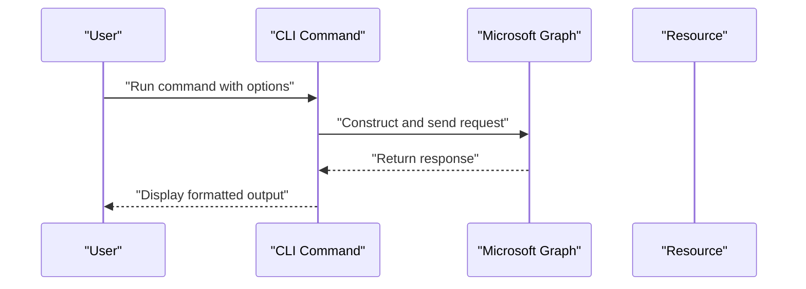

[No sources needed since this diagram shows conceptual workflow, not actual code structure]

## Detailed Component Analysis

### Application Registration Creation
- Purpose: Create new application registrations with various configurations (name, redirect URIs, platform, implicit flow, secrets, certificates, API permissions, scopes, admin consent, manifest, public client flows).
- Key options: name, manifest, multitenant, redirectUris, platform, implicitFlow, withSecret, apisDelegated, apisApplication, uri, scopeName, scopeConsentBy, scopeAdminConsentDisplayName, scopeAdminConsentDescription, certificateFile, certificateBase64Encoded, certificateDisplayName, grantAdminConsent, bundleId, signatureHash, save, allowPublicClientFlows.
- Behavior: Supports creating from manifest; supports generating a secret; supports setting Application ID URI with token substitution; supports admin consent; supports saving created app info to a local file; supports enabling public client flows.
- Permissions: Delegated and Application require Application.ReadWrite.All; Application-owned variant requires Application.ReadWrite.OwnedBy.

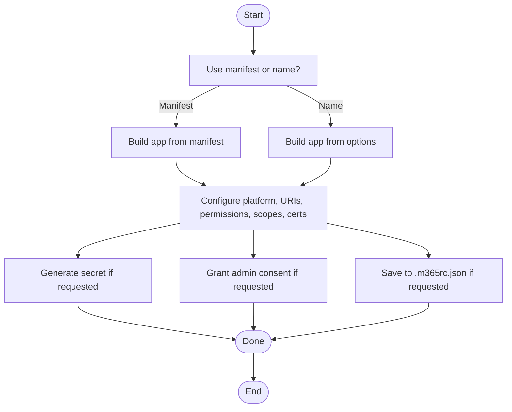

**Diagram sources**
- [app-add.mdx](file://docs/docs/cmd/entra/app/app-add.mdx)

**Section sources**
- [app-add.mdx](file://docs/docs/cmd/entra/app/app-add.mdx)

### Application Retrieval and Listing
- Get app: Retrieve a specific application registration by appId, objectId, or name; optionally save to local file; select properties to fetch.
- List apps: Retrieve a list of application registrations with optional property selection.

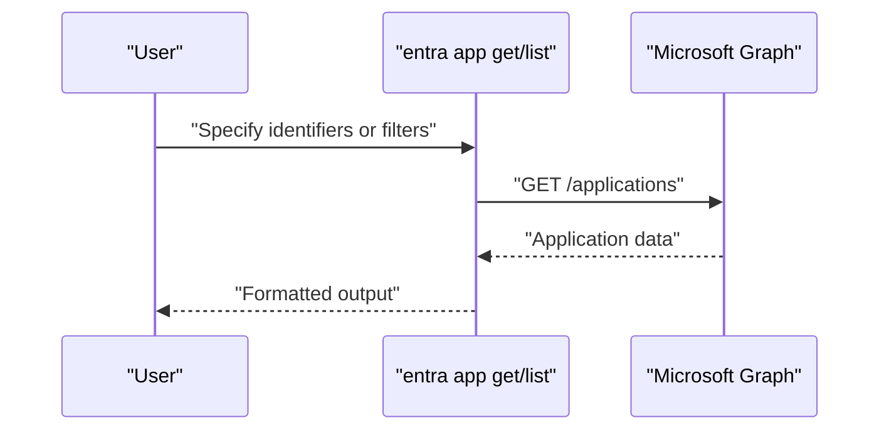

**Diagram sources**
- [app-get.mdx](file://docs/docs/cmd/entra/app/app-get.mdx)
- [app-list.mdx](file://docs/docs/cmd/entra/app/app-list.mdx)

**Section sources**
- [app-get.mdx](file://docs/docs/cmd/entra/app/app-get.mdx)
- [app-list.mdx](file://docs/docs/cmd/entra/app/app-list.mdx)

### Application Updates
- Purpose: Update Application ID URIs, redirect URIs, add certificates, and toggle allowPublicClientFlows.
- Key options: appId, objectId, name, uris, redirectUris, platform, redirectUrisToRemove, certificateFile, certificateBase64Encoded, certificateDisplayName, allowPublicClientFlows.
- Notes: Best performance when using objectId; supports adding certificates without replacing existing ones.

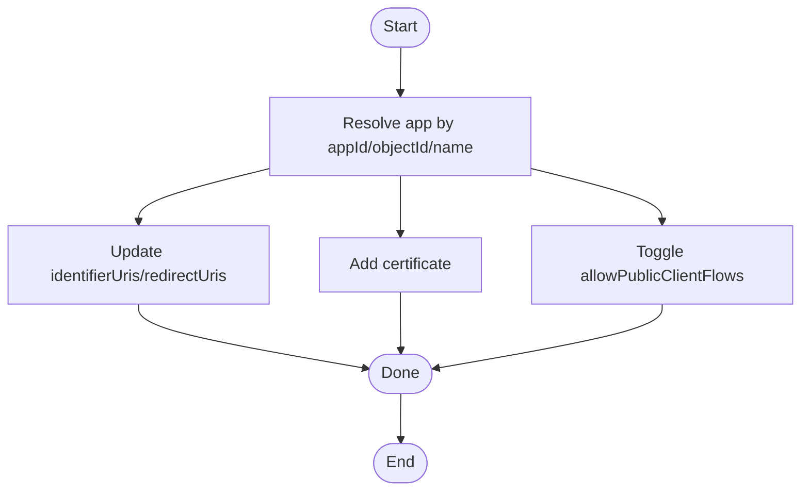

**Diagram sources**
- [app-set.mdx](file://docs/docs/cmd/entra/app/app-set.mdx)

**Section sources**
- [app-set.mdx](file://docs/docs/cmd/entra/app/app-set.mdx)

### Application Deletion
- Purpose: Remove an application registration by appId, objectId, or name.
- Options: appId, objectId, name, force.
- Notes: Prefer objectId for best performance; supports confirmation bypass with force.

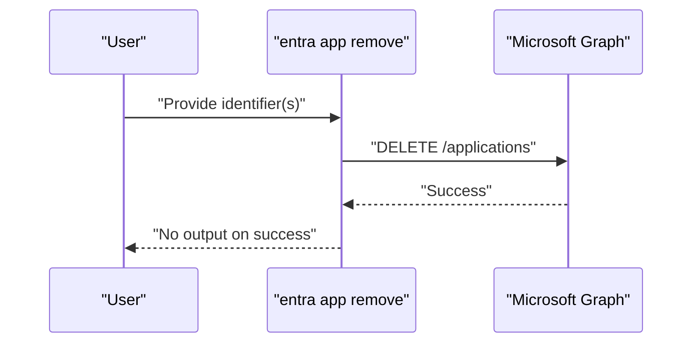

**Diagram sources**
- [app-remove.mdx](file://docs/docs/cmd/entra/app/app-remove.mdx)

**Section sources**
- [app-remove.mdx](file://docs/docs/cmd/entra/app/app-remove.mdx)

### API Permission Management
- Add permissions: Grant delegated and/or application permissions to an app by appId, appName, or appObjectId; optionally grant admin consent.
- List permissions: Retrieve current API permissions for an app.
- Remove permissions: Remove specified delegated/application permissions from an app.

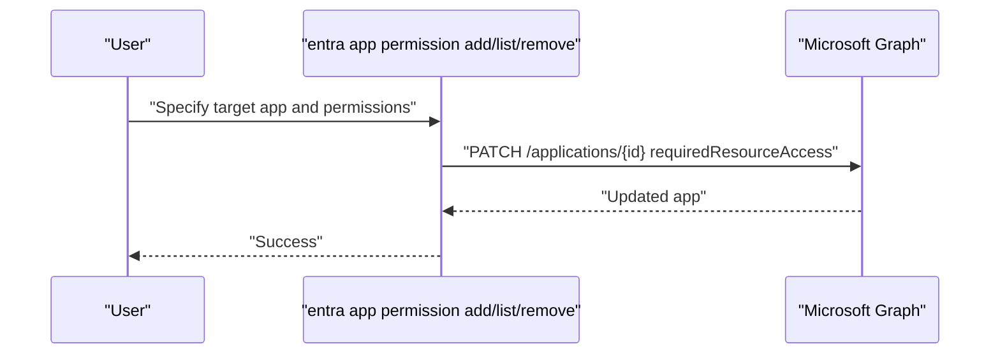

**Diagram sources**
- [app-permission-add.mdx](file://docs/docs/cmd/entra/app/app-permission-add.mdx)
- [app-permission-list.mdx](file://docs/docs/cmd/entra/app/app-permission-list.mdx)
- [app-permission-remove.mdx](file://docs/docs/cmd/entra/app/app-permission-remove.mdx)

**Section sources**
- [app-permission-add.mdx](file://docs/docs/cmd/entra/app/app-permission-add.mdx)
- [app-permission-list.mdx](file://docs/docs/cmd/entra/app/app-permission-list.mdx)
- [app-permission-remove.mdx](file://docs/docs/cmd/entra/app/app-permission-remove.mdx)

### Application Role Management
- Add roles: Add application roles to an app registration.
- List roles: Retrieve application roles from an app.
- Remove roles: Remove application roles from an app.

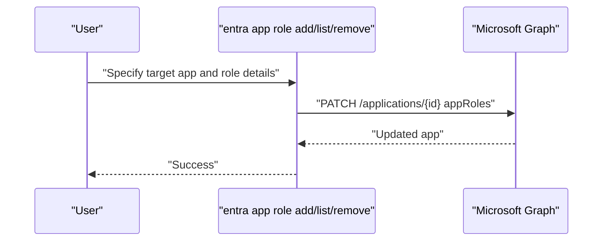

**Diagram sources**
- [app-role-add.mdx](file://docs/docs/cmd/entra/app/app-role-add.mdx)
- [app-role-list.mdx](file://docs/docs/cmd/entra/app/app-role-list.mdx)
- [app-role-remove.mdx](file://docs/docs/cmd/entra/app/app-role-remove.mdx)

**Section sources**
- [app-role-add.mdx](file://docs/docs/cmd/entra/app/app-role-add.mdx)
- [app-role-list.mdx](file://docs/docs/cmd/entra/app/app-role-list.mdx)
- [app-role-remove.mdx](file://docs/docs/cmd/entra/app/app-role-remove.mdx)

### Service Principal Operations
- Add service principal: Create a service principal for an app registration.
- Get service principal: Retrieve a service principal by appId, objectId, or displayName.
- List service principals: List service principals with optional property selection.
- Remove service principal: Delete a service principal by appId, objectId, or displayName.
- Set service principal: Update service principal properties.

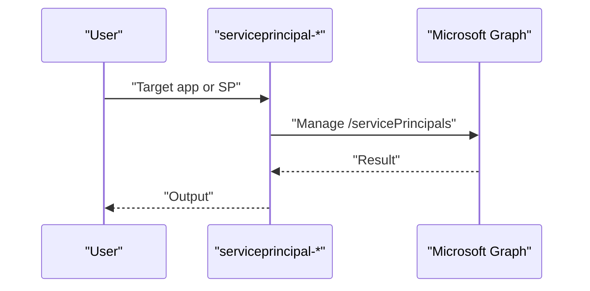

**Diagram sources**
- [serviceprincipal-add.mdx](file://docs/docs/cmd/entra/serviceprincipal/serviceprincipal-add.mdx)
- [serviceprincipal-get.mdx](file://docs/docs/cmd/entra/serviceprincipal/serviceprincipal-get.mdx)
- [serviceprincipal-list.mdx](file://docs/docs/cmd/entra/serviceprincipal/serviceprincipal-list.mdx)
- [serviceprincipal-remove.mdx](file://docs/docs/cmd/entra/serviceprincipal/serviceprincipal-remove.mdx)
- [serviceprincipal-set.mdx](file://docs/docs/cmd/entra/serviceprincipal/serviceprincipal-set.mdx)

**Section sources**
- [serviceprincipal-add.mdx](file://docs/docs/cmd/entra/serviceprincipal/serviceprincipal-add.mdx)
- [serviceprincipal-get.mdx](file://docs/docs/cmd/entra/serviceprincipal/serviceprincipal-get.mdx)
- [serviceprincipal-list.mdx](file://docs/docs/cmd/entra/serviceprincipal/serviceprincipal-list.mdx)
- [serviceprincipal-remove.mdx](file://docs/docs/cmd/entra/serviceprincipal/serviceprincipal-remove.mdx)
- [serviceprincipal-set.mdx](file://docs/docs/cmd/entra/serviceprincipal/serviceprincipal-set.mdx)

### Enterprise Application Management
- Get enterprise app: Retrieve an enterprise application by appId, objectId, or displayName.
- List enterprise apps: List enterprise applications with optional property selection.
- Set enterprise app: Update enterprise application properties.
- Remove enterprise app: Delete an enterprise application by appId, objectId, or displayName.

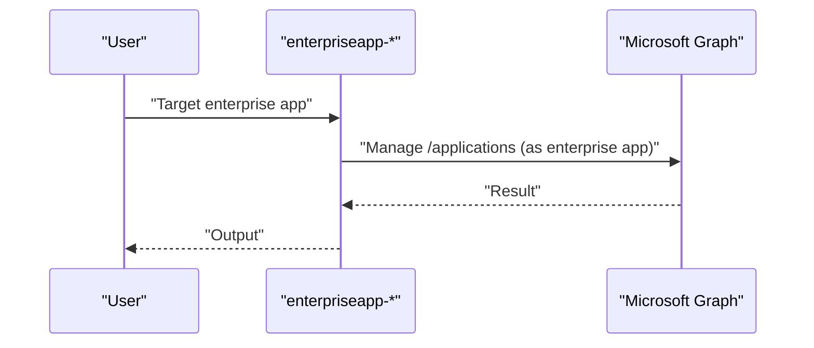

**Diagram sources**
- [enterpriseapp-get.mdx](file://docs/docs/cmd/entra/enterpriseapp/enterpriseapp-get.mdx)
- [enterpriseapp-list.mdx](file://docs/docs/cmd/entra/enterpriseapp/enterpriseapp-list.mdx)
- [enterpriseapp-set.mdx](file://docs/docs/cmd/entra/enterpriseapp/enterpriseapp-set.mdx)
- [enterpriseapp-remove.mdx](file://docs/docs/cmd/entra/enterpriseapp/enterpriseapp-remove.mdx)

**Section sources**
- [enterpriseapp-get.mdx](file://docs/docs/cmd/entra/enterpriseapp/enterpriseapp-get.mdx)
- [enterpriseapp-list.mdx](file://docs/docs/cmd/entra/enterpriseapp/enterpriseapp-list.mdx)
- [enterpriseapp-set.mdx](file://docs/docs/cmd/entra/enterpriseapp/enterpriseapp-set.mdx)
- [enterpriseapp-remove.mdx](file://docs/docs/cmd/entra/enterpriseapp/enterpriseapp-remove.mdx)

### OAuth2 Permission Grants
- Add grants: Add OAuth2 permission grants for an app.
- List grants: List existing grants for an app.
- Remove grants: Remove grants for an app.

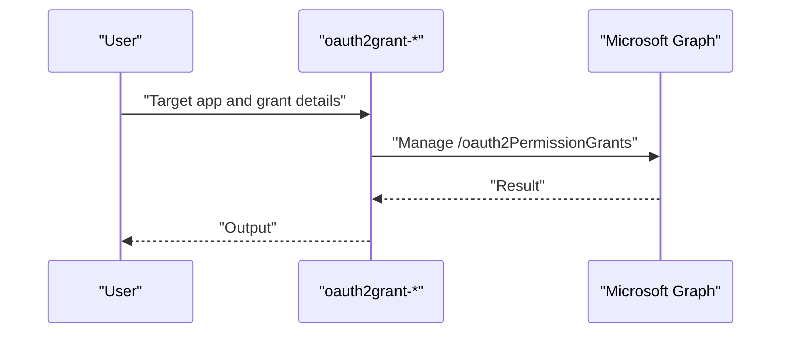

**Diagram sources**
- [oauth2grant-add.mdx](file://docs/docs/cmd/entra/oauth2grant/oauth2grant-add.mdx)
- [oauth2grant-list.mdx](file://docs/docs/cmd/entra/oauth2grant/oauth2grant-list.mdx)
- [oauth2grant-remove.mdx](file://docs/docs/cmd/entra/oauth2grant/oauth2grant-remove.mdx)

**Section sources**
- [oauth2grant-add.mdx](file://docs/docs/cmd/entra/oauth2grant/oauth2grant-add.mdx)
- [oauth2grant-list.mdx](file://docs/docs/cmd/entra/oauth2grant/oauth2grant-list.mdx)
- [oauth2grant-remove.mdx](file://docs/docs/cmd/entra/oauth2grant/oauth2grant-remove.mdx)

### Application Role Assignments
- Add role assignment: Assign application roles to users or groups for an app.

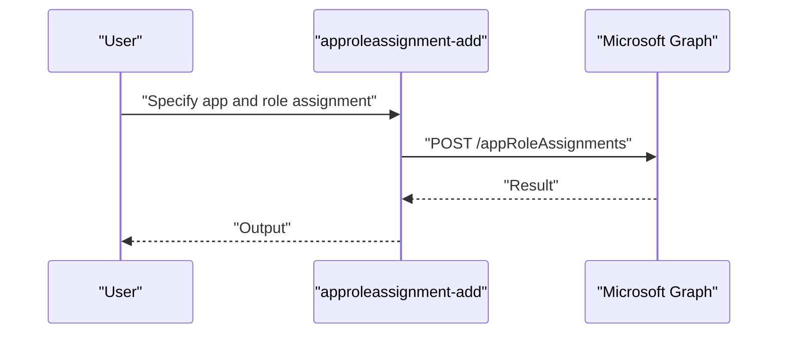

**Diagram sources**
- [approleassignment-add.mdx](file://docs/docs/cmd/exo/approleassignment/approleassignment-add.mdx)

**Section sources**
- [approleassignment-add.mdx](file://docs/docs/cmd/exo/approleassignment/approleassignment-add.mdx)

### Differences Between Application Registrations and Enterprise Applications
- Application registrations are the primary resource for app configuration and permissions.
- Enterprise applications represent the multi-tenant view of an application registration and are created when admin consent is granted during app creation.
- Enterprise applications enable tenant-wide visibility and management of the app.

**Section sources**
- [app-add.mdx](file://docs/docs/cmd/entra/app/app-add.mdx)
- [enterpriseapp-get.mdx](file://docs/docs/cmd/entra/enterpriseapp/enterpriseapp-get.mdx)

### Practical Examples
- Create app registration with delegated permissions and admin consent
- Create app registration from manifest
- Add application permissions to an app
- Add application roles to an app
- Create a service principal for an app
- Add OAuth2 permission grants
- Assign application roles to users/groups

**Section sources**
- [app-add.mdx](file://docs/docs/cmd/entra/app/app-add.mdx)
- [app-permission-add.mdx](file://docs/docs/cmd/entra/app/app-permission-add.mdx)
- [app-role-add.mdx](file://docs/docs/cmd/entra/app/app-role-add.mdx)
- [serviceprincipal-add.mdx](file://docs/docs/cmd/entra/serviceprincipal/serviceprincipal-add.mdx)
- [oauth2grant-add.mdx](file://docs/docs/cmd/entra/oauth2grant/oauth2grant-add.mdx)
- [approleassignment-add.mdx](file://docs/docs/cmd/exo/approleassignment/approleassignment-add.mdx)

## Dependency Analysis
- Application registration commands depend on Microsoft Graph Application endpoints.
- API permission management depends on updating requiredResourceAccess on applications.
- Application role management depends on updating appRoles on applications.
- Service principal commands depend on Microsoft Graph ServicePrincipal endpoints.
- Enterprise application commands operate on the same application resources but surface tenant-scoped views.
- OAuth2 permission grants depend on Microsoft Graph OAuth2PermissionGrants endpoints.
- Application role assignments depend on Microsoft Graph AppRoleAssignments endpoints.

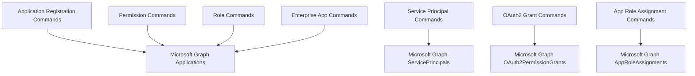

**Diagram sources**
- [app-add.mdx](file://docs/docs/cmd/entra/app/app-add.mdx)
- [app-permission-add.mdx](file://docs/docs/cmd/entra/app/app-permission-add.mdx)
- [app-role-add.mdx](file://docs/docs/cmd/entra/app/app-role-add.mdx)
- [serviceprincipal-add.mdx](file://docs/docs/cmd/entra/serviceprincipal/serviceprincipal-add.mdx)
- [enterpriseapp-get.mdx](file://docs/docs/cmd/entra/enterpriseapp/enterpriseapp-get.mdx)
- [oauth2grant-add.mdx](file://docs/docs/cmd/entra/oauth2grant/oauth2grant-add.mdx)
- [approleassignment-add.mdx](file://docs/docs/cmd/exo/approleassignment/approleassignment-add.mdx)

**Section sources**
- [app-add.mdx](file://docs/docs/cmd/entra/app/app-add.mdx)
- [app-permission-add.mdx](file://docs/docs/cmd/entra/app/app-permission-add.mdx)
- [app-role-add.mdx](file://docs/docs/cmd/entra/app/app-role-add.mdx)
- [serviceprincipal-add.mdx](file://docs/docs/cmd/entra/serviceprincipal/serviceprincipal-add.mdx)
- [enterpriseapp-get.mdx](file://docs/docs/cmd/entra/enterpriseapp/enterpriseapp-get.mdx)
- [oauth2grant-add.mdx](file://docs/docs/cmd/entra/oauth2grant/oauth2grant-add.mdx)
- [approleassignment-add.mdx](file://docs/docs/cmd/exo/approleassignment/approleassignment-add.mdx)

## Performance Considerations
- Prefer objectId over appId or name when referencing applications to avoid extra lookup steps.
- Use the properties option to limit returned fields when retrieving or listing applications.
- Batch operations where possible to reduce round-trips.

[No sources needed since this section provides general guidance]

## Troubleshooting Guide
- Disambiguation: If multiple apps match a name, the CLI will prompt to select the correct object ID.
- Confirmation: Removal commands support a force flag to bypass interactive confirmation.
- Manifest limitations: Certain manifest properties are not supported by the creation command.
- Permissions: Ensure the authenticated account has sufficient permissions for the targeted operation.

**Section sources**
- [app-get.mdx](file://docs/docs/cmd/entra/app/app-get.mdx)
- [app-remove.mdx](file://docs/docs/cmd/entra/app/app-remove.mdx)
- [app-add.mdx](file://docs/docs/cmd/entra/app/app-add.mdx)

## Conclusion
The CLI provides comprehensive coverage for managing Microsoft Entra ID applications, including application registrations, enterprise applications, service principals, API permissions, application roles, OAuth2 grants, and role assignments. By leveraging the documented commands and options, administrators can automate common application management tasks and integrate them into broader operational workflows.

## Appendices
- Additional related commands and topics:
  - Opening application-related documentation
  - Managing app permissions in the app namespace

**Section sources**
- [app-open.mdx](file://docs/docs/cmd/app/app-open.mdx)
- [permission.mdx](file://docs/docs/cmd/app/permission/permission.mdx)