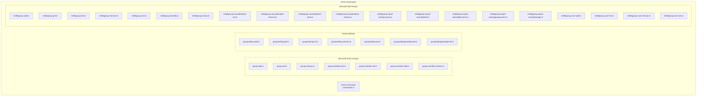
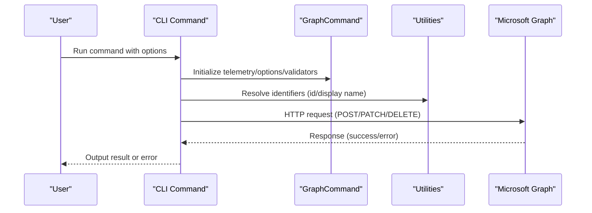
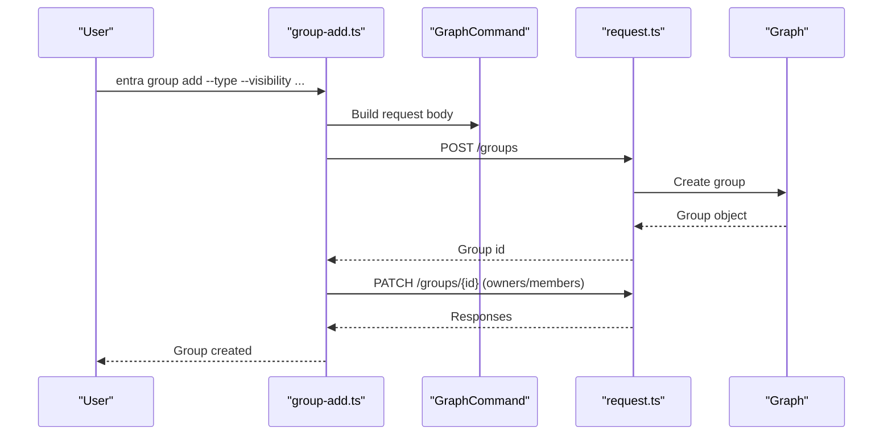
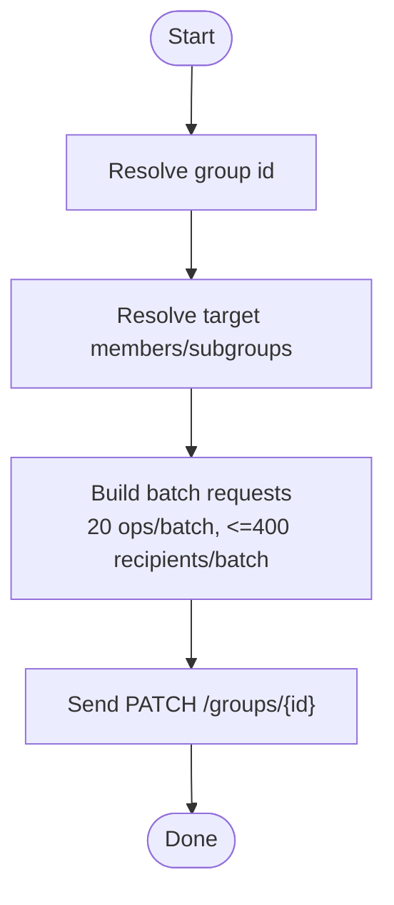
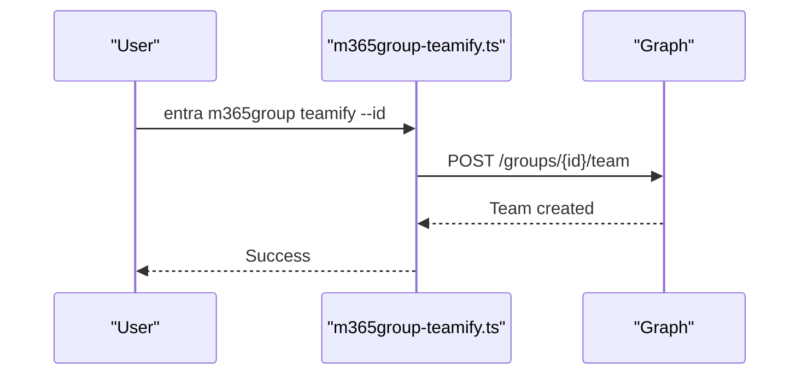
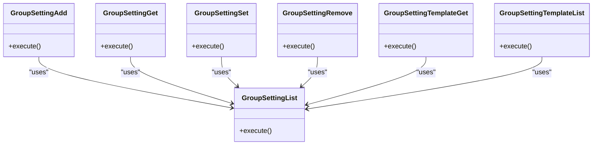
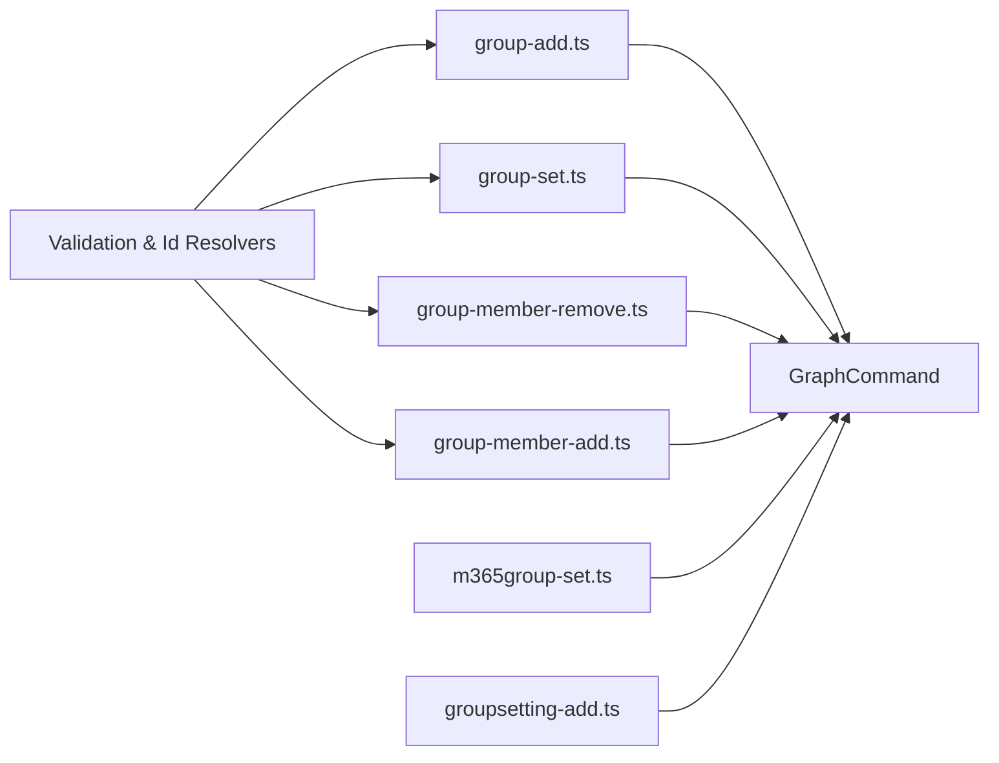

# Group Management

<cite>
**Referenced Files in This Document**
- [commands.ts](file://src/m365/entra/commands.ts)
- [group-add.ts](file://src/m365/entra/commands/group/group-add.ts)
- [group-set.ts](file://src/m365/entra/commands/group/group-set.ts)
- [group-remove.ts](file://src/m365/entra/commands/group/group-remove.ts)
- [group-member-add.ts](file://src/m365/entra/commands/group/group-member-add.ts)
- [group-member-remove.ts](file://src/m365/entra/commands/group/group-member-remove.ts)
- [group-member-list.ts](file://src/m365/entra/commands/group/group-member-list.ts)
- [group-member-set.ts](file://src/m365/entra/commands/group/group-member-set.ts)
- [groupsetting-add.ts](file://src/m365/entra/commands/groupsetting/groupsetting-add.ts)
- [groupsetting-get.ts](file://src/m365/entra/commands/groupsetting/groupsetting-get.ts)
- [groupsetting-list.ts](file://src/m365/entra/commands/groupsetting/groupsetting-list.ts)
- [groupsetting-remove.ts](file://src/m365/entra/commands/groupsetting/groupsetting-remove.ts)
- [groupsetting-set.ts](file://src/m365/entra/commands/groupsetting/groupsetting-set.ts)
- [groupsettingtemplate-get.ts](file://src/m365/entra/commands/groupsettingtemplate/groupsettingtemplate-get.ts)
- [groupsettingtemplate-list.ts](file://src/m365/entra/commands/groupsettingtemplate/groupsettingtemplate-list.ts)
- [m365group-add.ts](file://src/m365/entra/commands/m365group/m365group-add.ts)
- [m365group-get.ts](file://src/m365/entra/commands/m365group/m365group-get.ts)
- [m365group-list.ts](file://src/m365/entra/commands/m365group/m365group-list.ts)
- [m365group-remove.ts](file://src/m365/entra/commands/m365group/m365group-remove.ts)
- [m365group-set.ts](file://src/m365/entra/commands/m365group/m365group-set.ts)
- [m365group-teamify.ts](file://src/m365/entra/commands/m365group/m365group-teamify.ts)
- [m365group-renew.ts](file://src/m365/entra/commands/m365group/m365group-renew.ts)
- [m365group-recyclebinitem-clear.ts](file://src/m365/entra/commands/m365group/m365group-recyclebinitem-clear.ts)
- [m365group-recyclebinitem-list.ts](file://src/m365/entra/commands/m365group/m365group-recyclebinitem-list.ts)
- [m365group-recyclebinitem-remove.ts](file://src/m365/entra/commands/m365group/m365group-recyclebinitem-remove.ts)
- [m365group-recyclebinitem-restore.ts](file://src/m365/entra/commands/m365group/m365group-recyclebinitem-restore.ts)
- [m365group-report-activitycounts.ts](file://src/m365/entra/commands/m365group/m365group-report-activitycounts.ts)
- [m365group-report-activitydetail.ts](file://src/m365/entra/commands/m365group/m365group-report-activitydetail.ts)
- [m365group-report-activityfilecounts.ts](file://src/m365/entra/commands/m365group/m365group-report-activityfilecounts.ts)
- [m365group-report-activitygroupcounts.ts](file://src/m365/entra/commands/m365group/m365group-report-activitygroupcounts.ts)
- [m365group-report-activitystorage.ts](file://src/m365/entra/commands/m365group/m365group-report-activitystorage.ts)
- [m365group-user-add.ts](file://src/m365/entra/commands/m365group/m365group-user-add.ts)
- [m365group-user-list.ts](file://src/m365/entra/commands/m365group/m365group-user-list.ts)
- [m365group-user-remove.ts](file://src/m365/entra/commands/m365group/m365group-user-remove.ts)
- [m365group-user-set.ts](file://src/m365/entra/commands/m365group/m365group-user-set.ts)
</cite>

## Table of Contents
1. [Introduction](#introduction)
2. [Project Structure](#project-structure)
3. [Core Components](#core-components)
4. [Architecture Overview](#architecture-overview)
5. [Detailed Component Analysis](#detailed-component-analysis)
6. [Dependency Analysis](#dependency-analysis)
7. [Performance Considerations](#performance-considerations)
8. [Troubleshooting Guide](#troubleshooting-guide)
9. [Conclusion](#conclusion)
10. [Appendices](#appendices)

## Introduction
This document explains Microsoft Entra ID group management operations in the CLI for Microsoft 365. It covers:
- Creating, updating, and deleting Microsoft Entra groups
- Managing group members (addition, removal, setting roles)
- Microsoft 365 group operations (teamification, renewal, recycle bin management)
- Group settings and templates
- Reporting capabilities for Microsoft 365 groups
- Integration between security groups and Microsoft 365 groups
- Practical automation and governance examples

## Project Structure
The CLI organizes Entra ID commands under a unified namespace. Group-related commands are grouped under the entra prefix, with dedicated subcommands for Microsoft 365 groups and group settings.

**Diagram sources**
- [commands.ts:1-131](file://src/m365/entra/commands.ts#L1-L131)
- [group-add.ts:1-280](file://src/m365/entra/commands/group/group-add.ts#L1-L280)
- [group-set.ts:1-339](file://src/m365/entra/commands/group/group-set.ts#L1-L339)
- [group-remove.ts:1-127](file://src/m365/entra/commands/group/group-remove.ts#L1-L127)
- [group-member-add.ts:1-232](file://src/m365/entra/commands/group/group-member-add.ts#L1-L232)
- [group-member-remove.ts:1-260](file://src/m365/entra/commands/group/group-member-remove.ts#L1-L260)
- [group-member-list.ts](file://src/m365/entra/commands/group/group-member-list.ts)
- [group-member-set.ts](file://src/m365/entra/commands/group/group-member-set.ts)
- [groupsetting-add.ts](file://src/m365/entra/commands/groupsetting/groupsetting-add.ts)
- [groupsetting-get.ts](file://src/m365/entra/commands/groupsetting/groupsetting-get.ts)
- [groupsetting-list.ts](file://src/m365/entra/commands/groupsetting/groupsetting-list.ts)
- [groupsetting-remove.ts](file://src/m365/entra/commands/groupsetting/groupsetting-remove.ts)
- [groupsetting-set.ts](file://src/m365/entra/commands/groupsetting/groupsetting-set.ts)
- [groupsettingtemplate-get.ts](file://src/m365/entra/commands/groupsettingtemplate/groupsettingtemplate-get.ts)
- [groupsettingtemplate-list.ts](file://src/m365/entra/commands/groupsettingtemplate/groupsettingtemplate-list.ts)
- [m365group-add.ts](file://src/m365/entra/commands/m365group/m365group-add.ts)
- [m365group-get.ts](file://src/m365/entra/commands/m365group/m365group-get.ts)
- [m365group-list.ts](file://src/m365/entra/commands/m365group/m365group-list.ts)
- [m365group-remove.ts](file://src/m365/entra/commands/m365group/m365group-remove.ts)
- [m365group-set.ts](file://src/m365/entra/commands/m365group/m365group-set.ts)
- [m365group-teamify.ts](file://src/m365/entra/commands/m365group/m365group-teamify.ts)
- [m365group-renew.ts](file://src/m365/entra/commands/m365group/m365group-renew.ts)
- [m365group-recyclebinitem-list.ts](file://src/m365/entra/commands/m365group/m365group-recyclebinitem-list.ts)
- [m365group-recyclebinitem-remove.ts](file://src/m365/entra/commands/m365group/m365group-recyclebinitem-remove.ts)
- [m365group-recyclebinitem-clear.ts](file://src/m365/entra/commands/m365group/m365group-recyclebinitem-clear.ts)
- [m365group-recyclebinitem-restore.ts](file://src/m365/entra/commands/m365group/m365group-recyclebinitem-restore.ts)
- [m365group-report-activitycounts.ts](file://src/m365/entra/commands/m365group/m365group-report-activitycounts.ts)
- [m365group-report-activitydetail.ts](file://src/m365/entra/commands/m365group/m365group-report-activitydetail.ts)
- [m365group-report-activityfilecounts.ts](file://src/m365/entra/commands/m365group/m365group-report-activityfilecounts.ts)
- [m365group-report-activitygroupcounts.ts](file://src/m365/entra/commands/m365group/m365group-report-activitygroupcounts.ts)
- [m365group-report-activitystorage.ts](file://src/m365/entra/commands/m365group/m365group-report-activitystorage.ts)
- [m365group-user-add.ts](file://src/m365/entra/commands/m365group/m365group-user-add.ts)
- [m365group-user-list.ts](file://src/m365/entra/commands/m365group/m365group-user-list.ts)
- [m365group-user-remove.ts](file://src/m365/entra/commands/m365group/m365group-user-remove.ts)
- [m365group-user-set.ts](file://src/m365/entra/commands/m365group/m365group-user-set.ts)

**Section sources**
- [commands.ts:1-131](file://src/m365/entra/commands.ts#L1-L131)

## Core Components
This section summarizes the primary group management commands and their responsibilities.

- Microsoft Entra group lifecycle
  - Add: Creates a group with optional owners/members and visibility/type configuration
  - Set: Updates group properties and synchronizes owners/members
  - Remove: Deletes a group by id or display name

- Member management
  - Add members (users or subgroups) with Owner or Member role
  - Remove members (users or subgroups) with optional role filtering
  - List members
  - Set members (sync to a target set)

- Microsoft 365 group operations
  - Teamify: Convert a Microsoft 365 group to a Team
  - Renew: Renew a group expiration
  - Recycle bin: List, restore, remove, and clear deleted items
  - Reports: Activity counts, details, file counts, group counts, storage
  - User management: Add/remove/list/set users in a Microsoft 365 group

- Group settings and templates
  - Manage group settings (add/get/list/set/remove)
  - Manage group setting templates (get/list)

**Section sources**
- [group-add.ts:1-280](file://src/m365/entra/commands/group/group-add.ts#L1-L280)
- [group-set.ts:1-339](file://src/m365/entra/commands/group/group-set.ts#L1-L339)
- [group-remove.ts:1-127](file://src/m365/entra/commands/group/group-remove.ts#L1-L127)
- [group-member-add.ts:1-232](file://src/m365/entra/commands/group/group-member-add.ts#L1-L232)
- [group-member-remove.ts:1-260](file://src/m365/entra/commands/group/group-member-remove.ts#L1-L260)
- [group-member-list.ts](file://src/m365/entra/commands/group/group-member-list.ts)
- [group-member-set.ts](file://src/m365/entra/commands/group/group-member-set.ts)
- [m365group-teamify.ts](file://src/m365/entra/commands/m365group/m365group-teamify.ts)
- [m365group-renew.ts](file://src/m365/entra/commands/m365group/m365group-renew.ts)
- [m365group-recyclebinitem-list.ts](file://src/m365/entra/commands/m365group/m365group-recyclebinitem-list.ts)
- [m365group-recyclebinitem-remove.ts](file://src/m365/entra/commands/m365group/m365group-recyclebinitem-remove.ts)
- [m365group-recyclebinitem-clear.ts](file://src/m365/entra/commands/m365group/m365group-recyclebinitem-clear.ts)
- [m365group-recyclebinitem-restore.ts](file://src/m365/entra/commands/m365group/m365group-recyclebinitem-restore.ts)
- [m365group-report-activitycounts.ts](file://src/m365/entra/commands/m365group/m365group-report-activitycounts.ts)
- [m365group-report-activitydetail.ts](file://src/m365/entra/commands/m365group/m365group-report-activitydetail.ts)
- [m365group-report-activityfilecounts.ts](file://src/m365/entra/commands/m365group/m365group-report-activityfilecounts.ts)
- [m365group-report-activitygroupcounts.ts](file://src/m365/entra/commands/m365group/m365group-report-activitygroupcounts.ts)
- [m365group-report-activitystorage.ts](file://src/m365/entra/commands/m365group/m365group-report-activitystorage.ts)
- [m365group-user-add.ts](file://src/m365/entra/commands/m365group/m365group-user-add.ts)
- [m365group-user-list.ts](file://src/m365/entra/commands/m365group/m365group-user-list.ts)
- [m365group-user-remove.ts](file://src/m365/entra/commands/m365group/m365group-user-remove.ts)
- [m365group-user-set.ts](file://src/m365/entra/commands/m365group/m365group-user-set.ts)
- [groupsetting-add.ts](file://src/m365/entra/commands/groupsetting/groupsetting-add.ts)
- [groupsetting-get.ts](file://src/m365/entra/commands/groupsetting/groupsetting-get.ts)
- [groupsetting-list.ts](file://src/m365/entra/commands/groupsetting/groupsetting-list.ts)
- [groupsetting-remove.ts](file://src/m365/entra/commands/groupsetting/groupsetting-remove.ts)
- [groupsetting-set.ts](file://src/m365/entra/commands/groupsetting/groupsetting-set.ts)
- [groupsettingtemplate-get.ts](file://src/m365/entra/commands/groupsettingtemplate/groupsettingtemplate-get.ts)
- [groupsettingtemplate-list.ts](file://src/m365/entra/commands/groupsettingtemplate/groupsettingtemplate-list.ts)

## Architecture Overview
The CLI composes commands from a shared base and integrates with Microsoft Graph via HTTP requests. Commands validate inputs, resolve identifiers (by id or display name), and perform batched updates when required.

**Diagram sources**
- [group-add.ts:160-192](file://src/m365/entra/commands/group/group-add.ts#L160-L192)
- [group-set.ts:191-241](file://src/m365/entra/commands/group/group-set.ts#L191-L241)
- [group-member-add.ts:137-185](file://src/m365/entra/commands/group/group-member-add.ts#L137-L185)
- [group-member-remove.ts:151-215](file://src/m365/entra/commands/group/group-member-remove.ts#L151-L215)

## Detailed Component Analysis

### Microsoft Entra Group Lifecycle
- Add group
  - Supports type selection (Microsoft 365 or Security), visibility, mail nickname, and initial owners/members
  - Batched addition of owners/members using $batch
- Update group
  - Synchronizes owners/members to match the specified sets
  - Removes extra members/owners not present in the target set
- Delete group
  - Accepts id or display name; supports force flag and interactive confirmation

**Diagram sources**
- [group-add.ts:160-192](file://src/m365/entra/commands/group/group-add.ts#L160-L192)

**Section sources**
- [group-add.ts:1-280](file://src/m365/entra/commands/group/group-add.ts#L1-L280)
- [group-set.ts:1-339](file://src/m365/entra/commands/group/group-set.ts#L1-L339)
- [group-remove.ts:1-127](file://src/m365/entra/commands/group/group-remove.ts#L1-L127)

### Member Management
- Add members
  - Supports user ids/names and subgroup ids/names
  - Role selection: Owner or Member; subgroups cannot be set as owners
  - Batched updates using $batch with 20 operations per batch and up to 400 recipients per batch
- Remove members
  - Supports user ids/names and subgroup ids/names
  - Optional role filtering (Owner or Member)
  - Batched deletions; can suppress 404 not found errors
- List members
  - Lists current members of a group
- Set members
  - Synchronizes members to match the specified set (adds missing, removes extras)

**Diagram sources**
- [group-member-add.ts:137-185](file://src/m365/entra/commands/group/group-member-add.ts#L137-L185)

**Section sources**
- [group-member-add.ts:1-232](file://src/m365/entra/commands/group/group-member-add.ts#L1-L232)
- [group-member-remove.ts:1-260](file://src/m365/entra/commands/group/group-member-remove.ts#L1-L260)
- [group-member-list.ts](file://src/m365/entra/commands/group/group-member-list.ts)
- [group-member-set.ts](file://src/m365/entra/commands/group/group-member-set.ts)

### Microsoft 365 Group Operations
- Teamify
  - Converts a Microsoft 365 group into a Team
- Renew
  - Extends the group expiration period
- Recycle bin management
  - List deleted groups
  - Restore specific items
  - Remove specific items
  - Clear all recycle bin items
- Reports
  - Activity counts, details, file counts, group counts, storage
- User management
  - Add users to a Microsoft 365 group
  - List users
  - Remove users
  - Set users (sync to a target set)

**Diagram sources**
- [m365group-teamify.ts](file://src/m365/entra/commands/m365group/m365group-teamify.ts)

**Section sources**
- [m365group-teamify.ts](file://src/m365/entra/commands/m365group/m365group-teamify.ts)
- [m365group-renew.ts](file://src/m365/entra/commands/m365group/m365group-renew.ts)
- [m365group-recyclebinitem-list.ts](file://src/m365/entra/commands/m365group/m365group-recyclebinitem-list.ts)
- [m365group-recyclebinitem-remove.ts](file://src/m365/entra/commands/m365group/m365group-recyclebinitem-remove.ts)
- [m365group-recyclebinitem-clear.ts](file://src/m365/entra/commands/m365group/m365group-recyclebinitem-clear.ts)
- [m365group-recyclebinitem-restore.ts](file://src/m365/entra/commands/m365group/m365group-recyclebinitem-restore.ts)
- [m365group-report-activitycounts.ts](file://src/m365/entra/commands/m365group/m365group-report-activitycounts.ts)
- [m365group-report-activitydetail.ts](file://src/m365/entra/commands/m365group/m365group-report-activitydetail.ts)
- [m365group-report-activityfilecounts.ts](file://src/m365/entra/commands/m365group/m365group-report-activityfilecounts.ts)
- [m365group-report-activitygroupcounts.ts](file://src/m365/entra/commands/m365group/m365group-report-activitygroupcounts.ts)
- [m365group-report-activitystorage.ts](file://src/m365/entra/commands/m365group/m365group-report-activitystorage.ts)
- [m365group-user-add.ts](file://src/m365/entra/commands/m365group/m365group-user-add.ts)
- [m365group-user-list.ts](file://src/m365/entra/commands/m365group/m365group-user-list.ts)
- [m365group-user-remove.ts](file://src/m365/entra/commands/m365group/m365group-user-remove.ts)
- [m365group-user-set.ts](file://src/m365/entra/commands/m365group/m365group-user-set.ts)

### Group Settings and Templates
- Group settings
  - Add/get/list/set/remove group settings
- Group setting templates
  - Get/list templates to apply consistent settings across groups

**Diagram sources**
- [groupsetting-add.ts](file://src/m365/entra/commands/groupsetting/groupsetting-add.ts)
- [groupsetting-get.ts](file://src/m365/entra/commands/groupsetting/groupsetting-get.ts)
- [groupsetting-list.ts](file://src/m365/entra/commands/groupsetting/groupsetting-list.ts)
- [groupsetting-set.ts](file://src/m365/entra/commands/groupsetting/groupsetting-set.ts)
- [groupsetting-remove.ts](file://src/m365/entra/commands/groupsetting/groupsetting-remove.ts)
- [groupsettingtemplate-get.ts](file://src/m365/entra/commands/groupsettingtemplate/groupsettingtemplate-get.ts)
- [groupsettingtemplate-list.ts](file://src/m365/entra/commands/groupsettingtemplate/groupsettingtemplate-list.ts)

**Section sources**
- [groupsetting-add.ts](file://src/m365/entra/commands/groupsetting/groupsetting-add.ts)
- [groupsetting-get.ts](file://src/m365/entra/commands/groupsetting/groupsetting-get.ts)
- [groupsetting-list.ts](file://src/m365/entra/commands/groupsetting/groupsetting-list.ts)
- [groupsetting-set.ts](file://src/m365/entra/commands/groupsetting/groupsetting-set.ts)
- [groupsetting-remove.ts](file://src/m365/entra/commands/groupsetting/groupsetting-remove.ts)
- [groupsettingtemplate-get.ts](file://src/m365/entra/commands/groupsettingtemplate/groupsettingtemplate-get.ts)
- [groupsettingtemplate-list.ts](file://src/m365/entra/commands/groupsettingtemplate/groupsettingtemplate-list.ts)

## Dependency Analysis
- Shared base
  - Commands inherit from a GraphCommand base that standardizes telemetry, options, validators, and HTTP requests
- Utilities
  - Identifier resolution helpers for users and groups
  - Validation utilities for GUIDs, UPNs, and mail nicknames
- Batch processing
  - $batch requests limit 20 operations per batch and cap recipients per operation
- Option sets and types
  - Mutual exclusivity enforced for group identity (id vs display name)
  - Type safety for boolean/string options

**Diagram sources**
- [group-add.ts:1-280](file://src/m365/entra/commands/group/group-add.ts#L1-L280)
- [group-set.ts:1-339](file://src/m365/entra/commands/group/group-set.ts#L1-L339)
- [group-member-add.ts:1-232](file://src/m365/entra/commands/group/group-member-add.ts#L1-L232)
- [group-member-remove.ts:1-260](file://src/m365/entra/commands/group/group-member-remove.ts#L1-L260)
- [m365group-set.ts](file://src/m365/entra/commands/m365group/m365group-set.ts)
- [groupsetting-add.ts](file://src/m365/entra/commands/groupsetting/groupsetting-add.ts)

**Section sources**
- [group-add.ts:1-280](file://src/m365/entra/commands/group/group-add.ts#L1-L280)
- [group-set.ts:1-339](file://src/m365/entra/commands/group/group-set.ts#L1-L339)
- [group-member-add.ts:1-232](file://src/m365/entra/commands/group/group-member-add.ts#L1-L232)
- [group-member-remove.ts:1-260](file://src/m365/entra/commands/group/group-member-remove.ts#L1-L260)
- [m365group-set.ts](file://src/m365/entra/commands/m365group/m365group-set.ts)
- [groupsetting-add.ts](file://src/m365/entra/commands/groupsetting/groupsetting-add.ts)

## Performance Considerations
- Batched operations
  - Owners/members are added/updated in batches of up to 400 recipients per batch and 20 requests per batch to minimize round trips
- Minimal network calls
  - Commands resolve identifiers once and reuse resolved ids
- Selective updates
  - Set operations compute differences and only add/remove the minimal set of principals

[No sources needed since this section provides general guidance]

## Troubleshooting Guide
- Validation failures
  - Incorrect GUIDs or UPNs cause immediate validation errors
  - Visibility and type constraints are enforced for group creation/update
- Batch errors
  - Non-204 responses in batch requests surface the underlying error; review individual batch entries
- Not found handling
  - Removal supports suppressing 404 errors when principals are already removed
- Interactive confirmations
  - Force flag bypasses prompts for destructive actions

**Section sources**
- [group-add.ts:81-141](file://src/m365/entra/commands/group/group-add.ts#L81-L141)
- [group-set.ts:109-171](file://src/m365/entra/commands/group/group-set.ts#L109-L171)
- [group-member-remove.ts:98-137](file://src/m365/entra/commands/group/group-member-remove.ts#L98-L137)
- [group-member-remove.ts:199-215](file://src/m365/entra/commands/group/group-member-remove.ts#L199-L215)

## Conclusion
The CLI provides comprehensive Microsoft Entra and Microsoft 365 group management capabilities with robust validation, batched operations, and consistent reporting. Administrators can automate group lifecycle tasks, synchronize membership, and govern group settings at scale.

[No sources needed since this section summarizes without analyzing specific files]

## Appendices

### Practical Automation and Governance Scenarios
- Bulk provisioning
  - Create Microsoft 365 groups with standardized settings and initial owners/members
- Membership synchronization
  - Keep group membership aligned with organizational data by setting members to a target set
- Governance enforcement
  - Apply group settings templates consistently across departments
- Microsoft 365 group operations
  - Teamify newly created groups and renew expiring ones
  - Monitor and clean up deleted groups in the recycle bin
- Reporting
  - Generate activity reports to assess group engagement and storage usage

[No sources needed since this section provides general guidance]