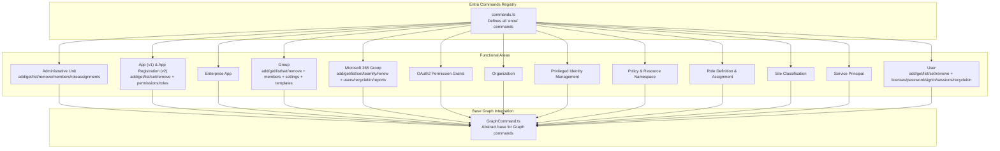
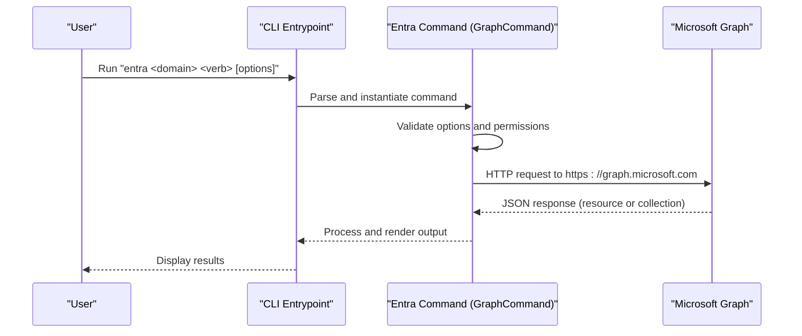
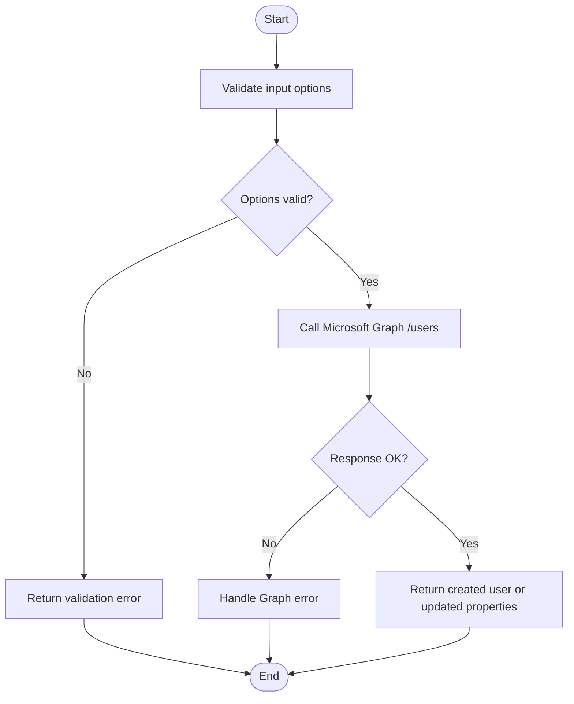
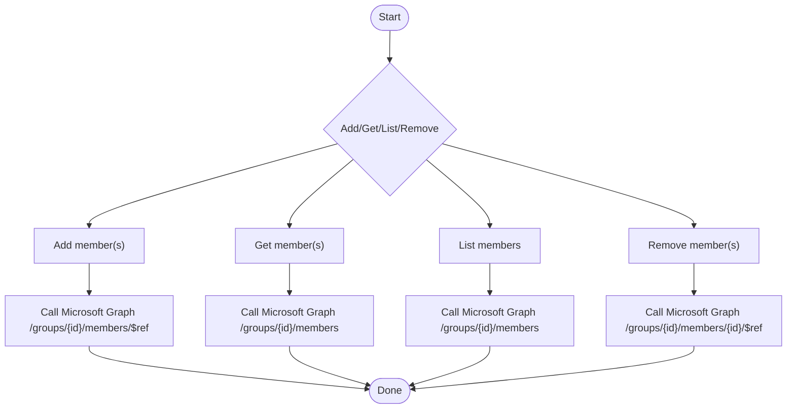
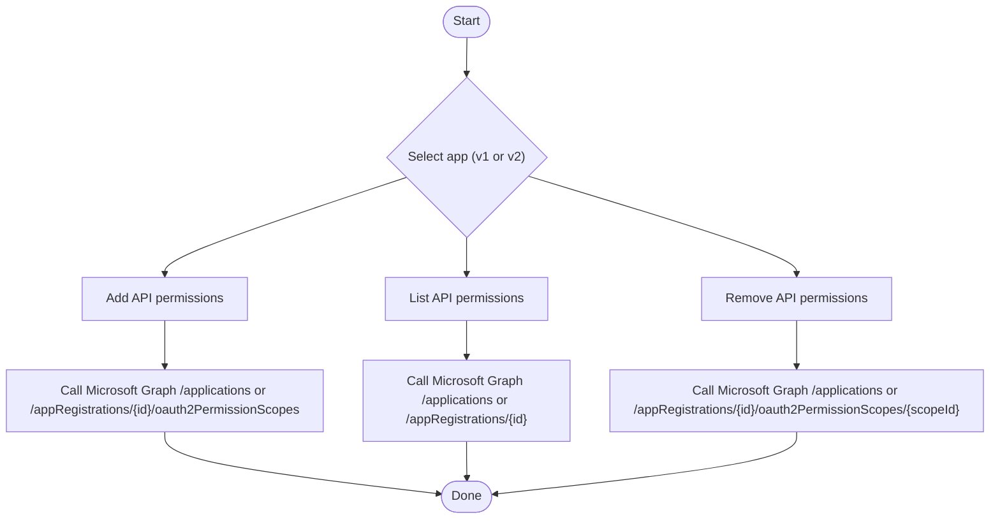
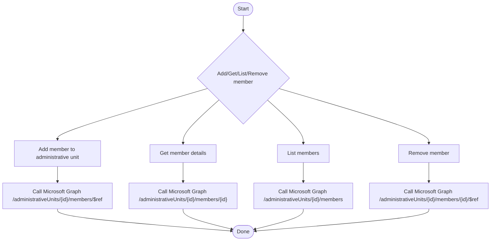
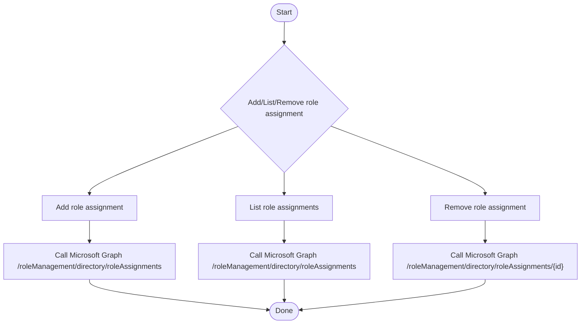
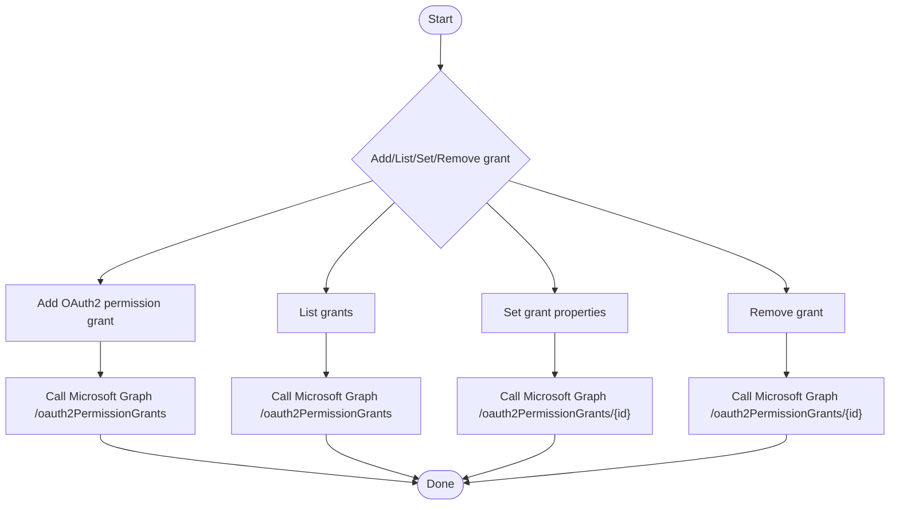
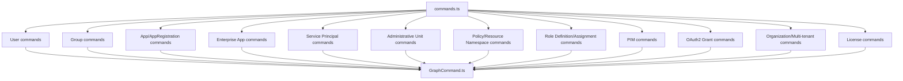

# Microsoft Entra ID Management

<cite>
**Referenced Files in This Document**
- [commands.ts](file://src/m365/entra/commands.ts)
- [GraphCommand.ts](file://src/m365/base/GraphCommand.ts)
- [entra-administrativeunit-add.mdx](file://docs/docs/cmd/entra/administrativeunit/administrativeunit-add.mdx)
- [entra-administrativeunit-get.mdx](file://docs/docs/cmd/entra/administrativeunit/administrativeunit-get.mdx)
- [entra-administrativeunit-list.mdx](file://docs/docs/cmd/entra/administrativeunit/administrativeunit-list.mdx)
- [entra-administrativeunit-member-add.mdx](file://docs/docs/cmd/entra/administrativeunit/administrativeunit-member-add.mdx)
- [entra-administrativeunit-member-get.mdx](file://docs/docs/cmd/entra/administrativeunit/administrativeunit-member-get.mdx)
- [entra-administrativeunit-member-list.mdx](file://docs/docs/cmd/entra/administrativeunit/administrativeunit-member-list.mdx)
- [entra-administrativeunit-member-remove.mdx](file://docs/docs/cmd/entra/administrativeunit/administrativeunit-member-remove.mdx)
- [entra-administrativeunit-remove.mdx](file://docs/docs/cmd/entra/administrativeunit/administrativeunit-remove.mdx)
- [entra-administrativeunit-roleassignment-add.mdx](file://docs/docs/cmd/entra/administrativeunit/administrativeunit-roleassignment-add.mdx)
- [entra-app-add.mdx](file://docs/docs/cmd/entra/app/app-add.mdx)
- [entra-app-get.mdx](file://docs/docs/cmd/entra/app/app-get.mdx)
- [entra-app-list.mdx](file://docs/docs/cmd/entra/app/app-list.mdx)
- [entra-app-permission-add.mdx](file://docs/docs/cmd/entra/app/app-permission-add.mdx)
- [entra-app-permission-list.mdx](file://docs/docs/cmd/entra/app/app-permission-list.mdx)
- [entra-app-permission-remove.mdx](file://docs/docs/cmd/entra/app/app-permission-remove.mdx)
- [entra-app-remove.mdx](file://docs/docs/cmd/entra/app/app-remove.mdx)
- [entra-app-role-add.mdx](file://docs/docs/cmd/entra/app/app-role-add.mdx)
- [entra-app-role-list.mdx](file://docs/docs/cmd/entra/app/app-role-list.mdx)
- [entra-app-role-remove.mdx](file://docs/docs/cmd/entra/app/app-role-remove.mdx)
- [entra-app-set.mdx](file://docs/docs/cmd/entra/app/app-set.mdx)
- [entra-appregistration-add.mdx](file://docs/docs/cmd/entra/app/appregistration-add.mdx)
- [entra-appregistration-get.mdx](file://docs/docs/cmd/entra/app/appregistration-get.mdx)
- [entra-appregistration-list.mdx](file://docs/docs/cmd/entra/app/appregistration-list.mdx)
- [entra-appregistration-remove.mdx](file://docs/docs/cmd/entra/app/appregistration-remove.mdx)
- [entra-appregistration-set.mdx](file://docs/docs/cmd/entra/app/appregistration-set.mdx)
- [entra-appregistration-permission-add.mdx](file://docs/docs/cmd/entra/app/appregistration-permission-add.mdx)
- [entra-appregistration-role-add.mdx](file://docs/docs/cmd/entra/app/appregistration-role-add.mdx)
- [entra-appregistration-role-list.mdx](file://docs/docs/cmd/entra/app/appregistration-role-list.mdx)
- [entra-appregistration-role-remove.mdx](file://docs/docs/cmd/entra/app/appregistration-role-remove.mdx)
- [entra-enterpriseapp-add.mdx](file://docs/docs/cmd/entra/enterpriseapp/enterpriseapp-add.mdx)
- [entra-enterpriseapp-get.mdx](file://docs/docs/cmd/entra/enterpriseapp/enterpriseapp-get.mdx)
- [entra-enterpriseapp-list.mdx](file://docs/docs/cmd/entra/enterpriseapp/enterpriseapp-list.mdx)
- [entra-enterpriseapp-remove.mdx](file://docs/docs/cmd/entra/enterpriseapp/enterpriseapp-remove.mdx)
- [entra-group-add.mdx](file://docs/docs/cmd/entra/group/group-add.mdx)
- [entra-group-get.mdx](file://docs/docs/cmd/entra/group/group-get.mdx)
- [entra-group-list.mdx](file://docs/docs/cmd/entra/group/group-list.mdx)
- [entra-group-member-add.mdx](file://docs/docs/cmd/entra/group/group-member-add.mdx)
- [entra-group-member-get.mdx](file://docs/docs/cmd/entra/group/group-member-get.mdx)
- [entra-group-member-list.mdx](file://docs/docs/cmd/entra/group/group-member-list.mdx)
- [entra-group-member-remove.mdx](file://docs/docs/cmd/entra/group/group-member-remove.mdx)
- [entra-group-remove.mdx](file://docs/docs/cmd/entra/group/group-remove.mdx)
- [entra-group-set.mdx](file://docs/docs/cmd/entra/group/group-set.mdx)
- [entra-groupsetting-add.mdx](file://docs/docs/cmd/entra/groupsetting/groupsetting-add.mdx)
- [entra-groupsetting-get.mdx](file://docs/docs/cmd/entra/groupsetting/groupsetting-get.mdx)
- [entra-groupsetting-list.mdx](file://docs/docs/cmd/entra/groupsetting/groupsetting-list.mdx)
- [entra-groupsetting-remove.mdx](file://docs/docs/cmd/entra/groupsetting/groupsetting-remove.mdx)
- [entra-groupsetting-set.mdx](file://docs/docs/cmd/entra/groupsetting/groupsetting-set.mdx)
- [entra-groupsettingtemplate-get.mdx](file://docs/docs/cmd/entra/groupsettingtemplate/groupsettingtemplate-get.mdx)
- [entra-groupsettingtemplate-list.mdx](file://docs/docs/cmd/entra/groupsettingtemplate/groupsettingtemplate-list.mdx)
- [entra-license-list.mdx](file://docs/docs/cmd/entra/license/license-list.mdx)
- [entra-m365group-add.mdx](file://docs/docs/cmd/entra/m365group/m365group-add.mdx)
- [entra-m365group-get.mdx](file://docs/docs/cmd/entra/m365group/m365group-get.mdx)
- [entra-m365group-list.mdx](file://docs/docs/cmd/entra/m365group/m365group-list.mdx)
- [entra-m365group-conversation-list.mdx](file://docs/docs/cmd/entra/m365group/m365group-conversation-list.mdx)
- [entra-m365group-conversation-post-list.mdx](file://docs/docs/cmd/entra/m365group/m365group-conversation-post-list.mdx)
- [entra-m365group-recyclebinitem-clear.mdx](file://docs/docs/cmd/entra/m365group/m365group-recyclebinitem-clear.mdx)
- [entra-m365group-recyclebinitem-list.mdx](file://docs/docs/cmd/entra/m365group/m365group-recyclebinitem-list.mdx)
- [entra-m365group-recyclebinitem-remove.mdx](file://docs/docs/cmd/entra/m365group/m365group-recyclebinitem-remove.mdx)
- [entra-m365group-recyclebinitem-restore.mdx](file://docs/docs/cmd/entra/m365group/m365group-recyclebinitem-restore.mdx)
- [entra-m365group-set.mdx](file://docs/docs/cmd/entra/m365group/m365group-set.mdx)
- [entra-m365group-teamify.mdx](file://docs/docs/cmd/entra/m365group/m365group-teamify.mdx)
- [entra-m365group-remove.mdx](file://docs/docs/cmd/entra/m365group/m365group-remove.mdx)
- [entra-m365group-renew.mdx](file://docs/docs/cmd/entra/m365group/m365group-renew.mdx)
- [entra-m365group-report-activitycounts.mdx](file://docs/docs/cmd/entra/m365group/m365group-report-activitycounts.mdx)
- [entra-m365group-report-activitydetail.mdx](file://docs/docs/cmd/entra/m365group/m365group-report-activitydetail.mdx)
- [entra-m365group-report-activityfilecounts.mdx](file://docs/docs/cmd/entra/m365group/m365group-report-activityfilecounts.mdx)
- [entra-m365group-report-activitygroupcounts.mdx](file://docs/docs/cmd/entra/m365group/m365group-report-activitygroupcounts.mdx)
- [entra-m365group-report-activitystorage.mdx](file://docs/docs/cmd/entra/m365group/m365group-report-activitystorage.mdx)
- [entra-m365group-user-add.mdx](file://docs/docs/cmd/entra/m365group/m365group-user-add.mdx)
- [entra-m365group-user-list.mdx](file://docs/docs/cmd/entra/m365group/m365group-user-list.mdx)
- [entra-m365group-user-remove.mdx](file://docs/docs/cmd/entra/m365group/m365group-user-remove.mdx)
- [entra-m365group-user-set.mdx](file://docs/docs/cmd/entra/m365group/m365group-user-set.mdx)
- [entra-multitenant-add.mdx](file://docs/docs/cmd/entra/multitenant/multitenant-add.mdx)
- [entra-multitenant-get.mdx](file://docs/docs/cmd/entra/multitenant/multitenant-get.mdx)
- [entra-multitenant-remove.mdx](file://docs/docs/cmd/entra/multitenant/multitenant-remove.mdx)
- [entra-multitenant-set.mdx](file://docs/docs/cmd/entra/multitenant/multitenant-set.mdx)
- [entra-oauth2grant-add.mdx](file://docs/docs/cmd/entra/oauth2grant/oauth2grant-add.mdx)
- [entra-oauth2grant-list.mdx](file://docs/docs/cmd/entra/oauth2grant/oauth2grant-list.mdx)
- [entra-oauth2grant-remove.mdx](file://docs/docs/cmd/entra/oauth2grant/oauth2grant-remove.mdx)
- [entra-oauth2grant-set.mdx](file://docs/docs/cmd/entra/oauth2grant/oauth2grant-set.mdx)
- [entra-organization-list.mdx](file://docs/docs/cmd/entra/organization/organization-list.mdx)
- [entra-organization-set.mdx](file://docs/docs/cmd/entra/organization/organization-set.mdx)
- [entra-pim-role-assignment-add.mdx](file://docs/docs/cmd/entra/pim/pim-role-assignment-add.mdx)
- [entra-pim-role-assignment-list.mdx](file://docs/docs/cmd/entra/pim/pim-role-assignment-list.mdx)
- [entra-pim-role-assignment-remove.mdx](file://docs/docs/cmd/entra/pim/pim-role-assignment-remove.mdx)
- [entra-pim-role-assignment-eligibility-list.mdx](file://docs/docs/cmd/entra/pim/pim-role-assignment-eligibility-list.mdx)
- [entra-pim-role-request-list.mdx](file://docs/docs/cmd/entra/pim/pim-role-request-list.mdx)
- [entra-policy-list.mdx](file://docs/docs/cmd/entra/policy/policy-list.mdx)
- [entra-resourcenamespace-list.mdx](file://docs/docs/cmd/entra/resourcenamespace/resourcenamespace-list.mdx)
- [entra-roleassignment-add.mdx](file://docs/docs/cmd/entra/roleassignment/roleassignment-add.mdx)
- [entra-roledefinition-add.mdx](file://docs/docs/cmd/entra/roledefinition/roledefinition-add.mdx)
- [entra-roledefinition-list.mdx](file://docs/docs/cmd/entra/roledefinition/roledefinition-list.mdx)
- [entra-roledefinition-get.mdx](file://docs/docs/cmd/entra/roledefinition/roledefinition-get.mdx)
- [entra-roledefinition-remove.mdx](file://docs/docs/cmd/entra/roledefinition/roledefinition-remove.mdx)
- [entra-roledefinition-set.mdx](file://docs/docs/cmd/entra/roledefinition/roledefinition-set.mdx)
- [entra-rolepermission-list.mdx](file://docs/docs/cmd/entra/rolepermission/rolepermission-list.mdx)
- [entra-siteclassification-disable.mdx](file://docs/docs/cmd/entra/siteclassification/siteclassification-disable.mdx)
- [entra-siteclassification-enable.mdx](file://docs/docs/cmd/entra/siteclassification/siteclassification-enable.mdx)
- [entra-siteclassification-get.mdx](file://docs/docs/cmd/entra/siteclassification/siteclassification-get.mdx)
- [entra-siteclassification-set.mdx](file://docs/docs/cmd/entra/siteclassification/siteclassification-set.mdx)
- [entra-sp-add.mdx](file://docs/docs/cmd/entra/serviceprincipal/sp-add.mdx)
- [entra-sp-get.mdx](file://docs/docs/cmd/entra/serviceprincipal/sp-get.mdx)
- [entra-sp-list.mdx](file://docs/docs/cmd/entra/serviceprincipal/sp-list.mdx)
- [entra-sp-remove.mdx](file://docs/docs/cmd/entra/serviceprincipal/sp-remove.mdx)
- [entra-user-add.mdx](file://docs/docs/cmd/entra/user/user-add.mdx)
- [entra-user-get.mdx](file://docs/docs/cmd/entra/user/user-get.mdx)
- [entra-user-guest-add.mdx](file://docs/docs/cmd/entra/user/user-guest-add.mdx)
- [entra-user-groupmembership-list.mdx](file://docs/docs/cmd/entra/user/user-groupmembership-list.mdx)
- [entra-user-hibp.mdx](file://docs/docs/cmd/entra/user/user-hibp.mdx)
- [entra-user-license-add.mdx](file://docs/docs/cmd/entra/user/user-license-add.mdx)
- [entra-user-license-list.mdx](file://docs/docs/cmd/entra/user/user-license-list.mdx)
- [entra-user-license-remove.mdx](file://docs/docs/cmd/entra/user/user-license-remove.mdx)
- [entra-user-list.mdx](file://docs/docs/cmd/entra/user/user-list.mdx)
- [entra-user-password-validate.mdx](file://docs/docs/cmd/entra/user/user-password-validate.mdx)
- [entra-user-recyclebinitem-clear.mdx](file://docs/docs/cmd/entra/user/user-recyclebinitem-clear.mdx)
- [entra-user-recyclebinitem-list.mdx](file://docs/docs/cmd/entra/user/user-recyclebinitem-list.mdx)
- [entra-user-recyclebinitem-remove.mdx](file://docs/docs/cmd/entra/user/user-recyclebinitem-remove.mdx)
- [entra-user-recyclebinitem-restore.mdx](file://docs/docs/cmd/entra/user/user-recyclebinitem-restore.mdx)
- [entra-user-registrationdetails-list.mdx](file://docs/docs/cmd/entra/user/user-registrationdetails-list.mdx)
- [entra-user-remove.mdx](file://docs/docs/cmd/entra/user/user-remove.mdx)
- [entra-user-session-revoke.mdx](file://docs/docs/cmd/entra/user/user-session-revoke.mdx)
- [entra-user-set.mdx](file://docs/docs/cmd/entra/user/user-set.mdx)
- [entra-user-signin-list.mdx](file://docs/docs/cmd/entra/user/user-signin-list.mdx)
- [release-notes.mdx](file://docs/docs/about/release-notes.mdx)
</cite>

## Table of Contents
1. [Introduction](#introduction)
2. [Project Structure](#project-structure)
3. [Core Components](#core-components)
4. [Architecture Overview](#architecture-overview)
5. [Detailed Component Analysis](#detailed-component-analysis)
6. [Dependency Analysis](#dependency-analysis)
7. [Performance Considerations](#performance-considerations)
8. [Troubleshooting Guide](#troubleshooting-guide)
9. [Conclusion](#conclusion)
10. [Appendices](#appendices)

## Introduction
This document provides comprehensive guidance for managing Microsoft Entra ID (formerly Azure AD) through the CLI for Microsoft 365. It covers the extensive Entra ID command suite spanning user management, group administration, application and service principal management, role assignments, policies, administrative units, licenses, OAuth2 permission grants, organization configuration, and tenant reporting. It explains how the CLI integrates with Microsoft Graph, outlines administrative roles and permissions, and offers practical automation examples for compliance and operational tasks.

## Project Structure
The Entra ID commands are organized under a dedicated namespace and grouped by functional area. The command registry enumerates all supported commands, while individual command implementations inherit from a shared Graph-based base class to standardize Microsoft Graph integration.

**Diagram sources**
- [commands.ts:1-131](file://src/m365/entra/commands.ts#L1-L131)
- [GraphCommand.ts:1-7](file://src/m365/base/GraphCommand.ts#L1-L7)

**Section sources**
- [commands.ts:1-131](file://src/m365/entra/commands.ts#L1-L131)
- [GraphCommand.ts:1-7](file://src/m365/base/GraphCommand.ts#L1-L7)

## Core Components
- Command registry: Centralized enumeration of all Entra commands, enabling consistent discovery and help generation.
- GraphCommand base: Abstract base class that sets the Microsoft Graph resource endpoint for all Entra commands, ensuring uniform authentication and API access patterns.
- Functional command modules: Per-domain modules implementing CRUD and administrative operations for users, groups, apps, service principals, roles, policies, and more.

Key characteristics:
- Extensibility: New commands follow a consistent pattern by extending the GraphCommand base.
- Consistency: All commands target the Microsoft Graph endpoint, simplifying authentication and permissions planning.
- Coverage: The command set spans identity lifecycle, governance, compliance, and operational reporting.

**Section sources**
- [commands.ts:1-131](file://src/m365/entra/commands.ts#L1-L131)
- [GraphCommand.ts:1-7](file://src/m365/base/GraphCommand.ts#L1-L7)

## Architecture Overview
The CLI integrates with Microsoft Graph to manage Entra ID resources. Commands inherit from a shared base that defines the Graph resource, ensuring consistent behavior across all Entra operations.

**Diagram sources**
- [GraphCommand.ts:1-7](file://src/m365/base/GraphCommand.ts#L1-L7)

## Detailed Component Analysis

### Users
User management includes creation, retrieval, listing, updates, deletion, password operations, session revocation, recycle bin operations, group memberships, sign-in logs, and license management.

Representative commands:
- Add user: [entra-user-add.mdx](file://docs/docs/cmd/entra/user/user-add.mdx)
- Get user: [entra-user-get.mdx](file://docs/docs/cmd/entra/user/user-get.mdx)
- List users: [entra-user-list.mdx](file://docs/docs/cmd/entra/user/user-list.mdx)
- Set user: [entra-user-set.mdx](file://docs/docs/cmd/entra/user/user-set.mdx)
- Remove user: [entra-user-remove.mdx](file://docs/docs/cmd/entra/user/user-remove.mdx)
- Password validate: [entra-user-password-validate.mdx](file://docs/docs/cmd/entra/user/user-password-validate.mdx)
- Session revoke: [entra-user-session-revoke.mdx](file://docs/docs/cmd/entra/user/user-session-revoke.mdx)
- Recycle bin operations: [entra-user-recyclebinitem-list.mdx](file://docs/docs/cmd/entra/user/user-recyclebinitem-list.mdx), [entra-user-recyclebinitem-remove.mdx](file://docs/docs/cmd/entra/user/user-recyclebinitem-remove.mdx), [entra-user-recyclebinitem-restore.mdx](file://docs/docs/cmd/entra/user/user-recyclebinitem-restore.mdx), [entra-user-recyclebinitem-clear.mdx](file://docs/docs/cmd/entra/user/user-recyclebinitem-clear.mdx)
- Group memberships: [entra-user-groupmembership-list.mdx](file://docs/docs/cmd/entra/user/user-groupmembership-list.mdx)
- Sign-in logs: [entra-user-signin-list.mdx](file://docs/docs/cmd/entra/user/user-signin-list.mdx)
- Registration details: [entra-user-registrationdetails-list.mdx](file://docs/docs/cmd/entra/user/user-registrationdetails-list.mdx)
- License management: [entra-user-license-add.mdx](file://docs/docs/cmd/entra/user/user-license-add.mdx), [entra-user-license-list.mdx](file://docs/docs/cmd/entra/user/user-license-list.mdx), [entra-user-license-remove.mdx](file://docs/docs/cmd/entra/user/user-license-remove.mdx)
- Guest user addition: [entra-user-guest-add.mdx](file://docs/docs/cmd/entra/user/user-guest-add.mdx)
- Have I Been Pwned integration: [entra-user-hibp.mdx](file://docs/docs/cmd/entra/user/user-hibp.mdx)

Operational flow for user creation and password management:

**Diagram sources**
- [GraphCommand.ts:1-7](file://src/m365/base/GraphCommand.ts#L1-L7)

**Section sources**
- [entra-user-add.mdx](file://docs/docs/cmd/entra/user/user-add.mdx)
- [entra-user-get.mdx](file://docs/docs/cmd/entra/user/user-get.mdx)
- [entra-user-list.mdx](file://docs/docs/cmd/entra/user/user-list.mdx)
- [entra-user-set.mdx](file://docs/docs/cmd/entra/user/user-set.mdx)
- [entra-user-remove.mdx](file://docs/docs/cmd/entra/user/user-remove.mdx)
- [entra-user-password-validate.mdx](file://docs/docs/cmd/entra/user/user-password-validate.mdx)
- [entra-user-session-revoke.mdx](file://docs/docs/cmd/entra/user/user-session-revoke.mdx)
- [entra-user-recyclebinitem-list.mdx](file://docs/docs/cmd/entra/user/user-recyclebinitem-list.mdx)
- [entra-user-recyclebinitem-remove.mdx](file://docs/docs/cmd/entra/user/user-recyclebinitem-remove.mdx)
- [entra-user-recyclebinitem-restore.mdx](file://docs/docs/cmd/entra/user/user-recyclebinitem-restore.mdx)
- [entra-user-recyclebinitem-clear.mdx](file://docs/docs/cmd/entra/user/user-recyclebinitem-clear.mdx)
- [entra-user-groupmembership-list.mdx](file://docs/docs/cmd/entra/user/user-groupmembership-list.mdx)
- [entra-user-signin-list.mdx](file://docs/docs/cmd/entra/user/user-signin-list.mdx)
- [entra-user-registrationdetails-list.mdx](file://docs/docs/cmd/entra/user/user-registrationdetails-list.mdx)
- [entra-user-license-add.mdx](file://docs/docs/cmd/entra/user/user-license-add.mdx)
- [entra-user-license-list.mdx](file://docs/docs/cmd/entra/user/user-license-list.mdx)
- [entra-user-license-remove.mdx](file://docs/docs/cmd/entra/user/user-license-remove.mdx)
- [entra-user-guest-add.mdx](file://docs/docs/cmd/entra/user/user-guest-add.mdx)
- [entra-user-hibp.mdx](file://docs/docs/cmd/entra/user/user-hibp.mdx)

### Groups and Microsoft 365 Groups
Group administration supports creation, retrieval, listing, updates, deletion, membership management, and settings. Microsoft 365 groups include teamification, renewal, recycle bin operations, conversations, posts, and reporting.

Representative commands:
- Group management: [entra-group-add.mdx](file://docs/docs/cmd/entra/group/group-add.mdx), [entra-group-get.mdx](file://docs/docs/cmd/entra/group/group-get.mdx), [entra-group-list.mdx](file://docs/docs/cmd/entra/group/group-list.mdx), [entra-group-set.mdx](file://docs/docs/cmd/entra/group/group-set.mdx), [entra-group-remove.mdx](file://docs/docs/cmd/entra/group/group-remove.mdx)
- Membership: [entra-group-member-add.mdx](file://docs/docs/cmd/entra/group/group-member-add.mdx), [entra-group-member-get.mdx](file://docs/docs/cmd/entra/group/group-member-get.mdx), [entra-group-member-list.mdx](file://docs/docs/cmd/entra/group/group-member-list.mdx), [entra-group-member-remove.mdx](file://docs/docs/cmd/entra/group/group-member-remove.mdx)
- Settings: [entra-groupsetting-add.mdx](file://docs/docs/cmd/entra/groupsetting/groupsetting-add.mdx), [entra-groupsetting-get.mdx](file://docs/docs/cmd/entra/groupsetting/groupsetting-get.mdx), [entra-groupsetting-list.mdx](file://docs/docs/cmd/entra/groupsetting/groupsetting-list.mdx), [entra-groupsetting-set.mdx](file://docs/docs/cmd/entra/groupsetting/groupsetting-set.mdx), [entra-groupsetting-remove.mdx](file://docs/docs/cmd/entra/groupsetting/groupsetting-remove.mdx)
- Templates: [entra-groupsettingtemplate-get.mdx](file://docs/docs/cmd/entra/groupsettingtemplate/groupsettingtemplate-get.mdx), [entra-groupsettingtemplate-list.mdx](file://docs/docs/cmd/entra/groupsettingtemplate/groupsettingtemplate-list.mdx)
- Microsoft 365 groups: [entra-m365group-add.mdx](file://docs/docs/cmd/entra/m365group/m365group-add.mdx), [entra-m365group-get.mdx](file://docs/docs/cmd/entra/m365group/m365group-get.mdx), [entra-m365group-list.mdx](file://docs/docs/cmd/entra/m365group/m365group-list.mdx), [entra-m365group-set.mdx](file://docs/docs/cmd/entra/m365group/m365group-set.mdx), [entra-m365group-remove.mdx](file://docs/docs/cmd/entra/m365group/m365group-remove.mdx), [entra-m365group-teamify.mdx](file://docs/docs/cmd/entra/m365group/m365group-teamify.mdx), [entra-m365group-renew.mdx](file://docs/docs/cmd/entra/m365group/m365group-renew.mdx)
- Users in M365 groups: [entra-m365group-user-add.mdx](file://docs/docs/cmd/entra/m365group/m365group-user-add.mdx), [entra-m365group-user-list.mdx](file://docs/docs/cmd/entra/m365group/m365group-user-list.mdx), [entra-m365group-user-remove.mdx](file://docs/docs/cmd/entra/m365group/m365group-user-remove.mdx), [entra-m365group-user-set.mdx](file://docs/docs/cmd/entra/m365group/m365group-user-set.mdx)
- Recycle bin: [entra-m365group-recyclebinitem-list.mdx](file://docs/docs/cmd/entra/m365group/m365group-recyclebinitem-list.mdx), [entra-m365group-recyclebinitem-remove.mdx](file://docs/docs/cmd/entra/m365group/m365group-recyclebinitem-remove.mdx), [entra-m365group-recyclebinitem-restore.mdx](file://docs/docs/cmd/entra/m365group/m365group-recyclebinitem-restore.mdx), [entra-m365group-recyclebinitem-clear.mdx](file://docs/docs/cmd/entra/m365group/m365group-recyclebinitem-clear.mdx)
- Conversations and posts: [entra-m365group-conversation-list.mdx](file://docs/docs/cmd/entra/m365group/m365group-conversation-list.mdx), [entra-m365group-conversation-post-list.mdx](file://docs/docs/cmd/entra/m365group/m365group-conversation-post-list.mdx)
- Reports: [entra-m365group-report-activitycounts.mdx](file://docs/docs/cmd/entra/m365group/m365group-report-activitycounts.mdx), [entra-m365group-report-activitydetail.mdx](file://docs/docs/cmd/entra/m365group/m365group-report-activitydetail.mdx), [entra-m365group-report-activityfilecounts.mdx](file://docs/docs/cmd/entra/m365group/m365group-report-activityfilecounts.mdx), [entra-m365group-report-activitygroupcounts.mdx](file://docs/docs/cmd/entra/m365group/m365group-report-activitygroupcounts.mdx), [entra-m365group-report-activitystorage.mdx](file://docs/docs/cmd/entra/m365group/m365group-report-activitystorage.mdx)

Group membership flow:

**Diagram sources**
- [GraphCommand.ts:1-7](file://src/m365/base/GraphCommand.ts#L1-L7)

**Section sources**
- [entra-group-add.mdx](file://docs/docs/cmd/entra/group/group-add.mdx)
- [entra-group-get.mdx](file://docs/docs/cmd/entra/group/group-get.mdx)
- [entra-group-list.mdx](file://docs/docs/cmd/entra/group/group-list.mdx)
- [entra-group-set.mdx](file://docs/docs/cmd/entra/group/group-set.mdx)
- [entra-group-remove.mdx](file://docs/docs/cmd/entra/group/group-remove.mdx)
- [entra-group-member-add.mdx](file://docs/docs/cmd/entra/group/group-member-add.mdx)
- [entra-group-member-get.mdx](file://docs/docs/cmd/entra/group/group-member-get.mdx)
- [entra-group-member-list.mdx](file://docs/docs/cmd/entra/group/group-member-list.mdx)
- [entra-group-member-remove.mdx](file://docs/docs/cmd/entra/group/group-member-remove.mdx)
- [entra-groupsetting-add.mdx](file://docs/docs/cmd/entra/groupsetting/groupsetting-add.mdx)
- [entra-groupsetting-get.mdx](file://docs/docs/cmd/entra/groupsetting/groupsetting-get.mdx)
- [entra-groupsetting-list.mdx](file://docs/docs/cmd/entra/groupsetting/groupsetting-list.mdx)
- [entra-groupsetting-set.mdx](file://docs/docs/cmd/entra/groupsetting/groupsetting-set.mdx)
- [entra-groupsetting-remove.mdx](file://docs/docs/cmd/entra/groupsetting/groupsetting-remove.mdx)
- [entra-groupsettingtemplate-get.mdx](file://docs/docs/cmd/entra/groupsettingtemplate/groupsettingtemplate-get.mdx)
- [entra-groupsettingtemplate-list.mdx](file://docs/docs/cmd/entra/groupsettingtemplate/groupsettingtemplate-list.mdx)
- [entra-m365group-add.mdx](file://docs/docs/cmd/entra/m365group/m365group-add.mdx)
- [entra-m365group-get.mdx](file://docs/docs/cmd/entra/m365group/m365group-get.mdx)
- [entra-m365group-list.mdx](file://docs/docs/cmd/entra/m365group/m365group-list.mdx)
- [entra-m365group-set.mdx](file://docs/docs/cmd/entra/m365group/m365group-set.mdx)
- [entra-m365group-remove.mdx](file://docs/docs/cmd/entra/m365group/m365group-remove.mdx)
- [entra-m365group-teamify.mdx](file://docs/docs/cmd/entra/m365group/m365group-teamify.mdx)
- [entra-m365group-renew.mdx](file://docs/docs/cmd/entra/m365group/m365group-renew.mdx)
- [entra-m365group-user-add.mdx](file://docs/docs/cmd/entra/m365group/m365group-user-add.mdx)
- [entra-m365group-user-list.mdx](file://docs/docs/cmd/entra/m365group/m365group-user-list.mdx)
- [entra-m365group-user-remove.mdx](file://docs/docs/cmd/entra/m365group/m365group-user-remove.mdx)
- [entra-m365group-user-set.mdx](file://docs/docs/cmd/entra/m365group/m365group-user-set.mdx)
- [entra-m365group-recyclebinitem-list.mdx](file://docs/docs/cmd/entra/m365group/m365group-recyclebinitem-list.mdx)
- [entra-m365group-recyclebinitem-remove.mdx](file://docs/docs/cmd/entra/m365group/m365group-recyclebinitem-remove.mdx)
- [entra-m365group-recyclebinitem-restore.mdx](file://docs/docs/cmd/entra/m365group/m365group-recyclebinitem-restore.mdx)
- [entra-m365group-recyclebinitem-clear.mdx](file://docs/docs/cmd/entra/m365group/m365group-recyclebinitem-clear.mdx)
- [entra-m365group-conversation-list.mdx](file://docs/docs/cmd/entra/m365group/m365group-conversation-list.mdx)
- [entra-m365group-conversation-post-list.mdx](file://docs/docs/cmd/entra/m365group/m365group-conversation-post-list.mdx)
- [entra-m365group-report-activitycounts.mdx](file://docs/docs/cmd/entra/m365group/m365group-report-activitycounts.mdx)
- [entra-m365group-report-activitydetail.mdx](file://docs/docs/cmd/entra/m365group/m365group-report-activitydetail.mdx)
- [entra-m365group-report-activityfilecounts.mdx](file://docs/docs/cmd/entra/m365group/m365group-report-activityfilecounts.mdx)
- [entra-m365group-report-activitygroupcounts.mdx](file://docs/docs/cmd/entra/m365group/m365group-report-activitygroupcounts.mdx)
- [entra-m365group-report-activitystorage.mdx](file://docs/docs/cmd/entra/m365group/m365group-report-activitystorage.mdx)

### Applications and Service Principals
Application management includes registration creation, retrieval, listing, updates, deletion, API permission management, and role definitions. Service principal operations mirror app lifecycle management.

Representative commands:
- App (v1): [entra-app-add.mdx](file://docs/docs/cmd/entra/app/app-add.mdx), [entra-app-get.mdx](file://docs/docs/cmd/entra/app/app-get.mdx), [entra-app-list.mdx](file://docs/docs/cmd/entra/app/app-list.mdx), [entra-app-set.mdx](file://docs/docs/cmd/entra/app/app-set.mdx), [entra-app-remove.mdx](file://docs/docs/cmd/entra/app/app-remove.mdx)
- App permissions: [entra-app-permission-add.mdx](file://docs/docs/cmd/entra/app/app-permission-add.mdx), [entra-app-permission-list.mdx](file://docs/docs/cmd/entra/app/app-permission-list.mdx), [entra-app-permission-remove.mdx](file://docs/docs/cmd/entra/app/app-permission-remove.mdx)
- App roles: [entra-app-role-add.mdx](file://docs/docs/cmd/entra/app/app-role-add.mdx), [entra-app-role-list.mdx](file://docs/docs/cmd/entra/app/app-role-list.mdx), [entra-app-role-remove.mdx](file://docs/docs/cmd/entra/app/app-role-remove.mdx)
- App Registration (v2): [entra-appregistration-add.mdx](file://docs/docs/cmd/entra/app/appregistration-add.mdx), [entra-appregistration-get.mdx](file://docs/docs/cmd/entra/app/appregistration-get.mdx), [entra-appregistration-list.mdx](file://docs/docs/cmd/entra/app/appregistration-list.mdx), [entra-appregistration-set.mdx](file://docs/docs/cmd/entra/app/appregistration-set.mdx), [entra-appregistration-remove.mdx](file://docs/docs/cmd/entra/app/appregistration-remove.mdx)
- App Registration permissions: [entra-appregistration-permission-add.mdx](file://docs/docs/cmd/entra/app/appregistration-permission-add.mdx)
- App Registration roles: [entra-appregistration-role-add.mdx](file://docs/docs/cmd/entra/app/appregistration-role-add.mdx), [entra-appregistration-role-list.mdx](file://docs/docs/cmd/entra/app/appregistration-role-list.mdx), [entra-appregistration-role-remove.mdx](file://docs/docs/cmd/entra/app/appregistration-role-remove.mdx)
- Enterprise App: [entra-enterpriseapp-add.mdx](file://docs/docs/cmd/entra/enterpriseapp/enterpriseapp-add.mdx), [entra-enterpriseapp-get.mdx](file://docs/docs/cmd/entra/enterpriseapp/enterpriseapp-get.mdx), [entra-enterpriseapp-list.mdx](file://docs/docs/cmd/entra/enterpriseapp/enterpriseapp-list.mdx), [entra-enterpriseapp-remove.mdx](file://docs/docs/cmd/entra/enterpriseapp/enterpriseapp-remove.mdx)
- App Role Assignments: [entra-appregistration-add.mdx](file://docs/docs/cmd/entra/app/appregistration-add.mdx), [entra-appregistration-get.mdx](file://docs/docs/cmd/entra/app/appregistration-get.mdx), [entra-appregistration-list.mdx](file://docs/docs/cmd/entra/app/appregistration-list.mdx), [entra-appregistration-remove.mdx](file://docs/docs/cmd/entra/app/appregistration-remove.mdx)
- Service Principal: [entra-sp-add.mdx](file://docs/docs/cmd/entra/serviceprincipal/sp-add.mdx), [entra-sp-get.mdx](file://docs/docs/cmd/entra/serviceprincipal/sp-get.mdx), [entra-sp-list.mdx](file://docs/docs/cmd/entra/serviceprincipal/sp-list.mdx), [entra-sp-remove.mdx](file://docs/docs/cmd/entra/serviceprincipal/sp-remove.mdx)

Application permission management flow:

**Diagram sources**
- [GraphCommand.ts:1-7](file://src/m365/base/GraphCommand.ts#L1-L7)

**Section sources**
- [entra-app-add.mdx](file://docs/docs/cmd/entra/app/app-add.mdx)
- [entra-app-get.mdx](file://docs/docs/cmd/entra/app/app-get.mdx)
- [entra-app-list.mdx](file://docs/docs/cmd/entra/app/app-list.mdx)
- [entra-app-set.mdx](file://docs/docs/cmd/entra/app/app-set.mdx)
- [entra-app-remove.mdx](file://docs/docs/cmd/entra/app/app-remove.mdx)
- [entra-app-permission-add.mdx](file://docs/docs/cmd/entra/app/app-permission-add.mdx)
- [entra-app-permission-list.mdx](file://docs/docs/cmd/entra/app/app-permission-list.mdx)
- [entra-app-permission-remove.mdx](file://docs/docs/cmd/entra/app/app-permission-remove.mdx)
- [entra-app-role-add.mdx](file://docs/docs/cmd/entra/app/app-role-add.mdx)
- [entra-app-role-list.mdx](file://docs/docs/cmd/entra/app/app-role-list.mdx)
- [entra-app-role-remove.mdx](file://docs/docs/cmd/entra/app/app-role-remove.mdx)
- [entra-appregistration-add.mdx](file://docs/docs/cmd/entra/app/appregistration-add.mdx)
- [entra-appregistration-get.mdx](file://docs/docs/cmd/entra/app/appregistration-get.mdx)
- [entra-appregistration-list.mdx](file://docs/docs/cmd/entra/app/appregistration-list.mdx)
- [entra-appregistration-set.mdx](file://docs/docs/cmd/entra/app/appregistration-set.mdx)
- [entra-appregistration-remove.mdx](file://docs/docs/cmd/entra/app/appregistration-remove.mdx)
- [entra-appregistration-permission-add.mdx](file://docs/docs/cmd/entra/app/appregistration-permission-add.mdx)
- [entra-appregistration-role-add.mdx](file://docs/docs/cmd/entra/app/appregistration-role-add.mdx)
- [entra-appregistration-role-list.mdx](file://docs/docs/cmd/entra/app/appregistration-role-list.mdx)
- [entra-appregistration-role-remove.mdx](file://docs/docs/cmd/entra/app/appregistration-role-remove.mdx)
- [entra-enterpriseapp-add.mdx](file://docs/docs/cmd/entra/enterpriseapp/enterpriseapp-add.mdx)
- [entra-enterpriseapp-get.mdx](file://docs/docs/cmd/entra/enterpriseapp/enterpriseapp-get.mdx)
- [entra-enterpriseapp-list.mdx](file://docs/docs/cmd/entra/enterpriseapp/enterpriseapp-list.mdx)
- [entra-enterpriseapp-remove.mdx](file://docs/docs/cmd/entra/enterpriseapp/enterpriseapp-remove.mdx)
- [entra-sp-add.mdx](file://docs/docs/cmd/entra/serviceprincipal/sp-add.mdx)
- [entra-sp-get.mdx](file://docs/docs/cmd/entra/serviceprincipal/sp-get.mdx)
- [entra-sp-list.mdx](file://docs/docs/cmd/entra/serviceprincipal/sp-list.mdx)
- [entra-sp-remove.mdx](file://docs/docs/cmd/entra/serviceprincipal/sp-remove.mdx)

### Administrative Units
Administrative units enable scoped management and role assignments within subsets of users and groups.

Representative commands:
- Add: [entra-administrativeunit-add.mdx](file://docs/docs/cmd/entra/administrativeunit/administrativeunit-add.mdx)
- Get: [entra-administrativeunit-get.mdx](file://docs/docs/cmd/entra/administrativeunit/administrativeunit-get.mdx)
- List: [entra-administrativeunit-list.mdx](file://docs/docs/cmd/entra/administrativeunit/administrativeunit-list.mdx)
- Remove: [entra-administrativeunit-remove.mdx](file://docs/docs/cmd/entra/administrativeunit/administrativeunit-remove.mdx)
- Members: [entra-administrativeunit-member-add.mdx](file://docs/docs/cmd/entra/administrativeunit/administrativeunit-member-add.mdx), [entra-administrativeunit-member-get.mdx](file://docs/docs/cmd/entra/administrativeunit/administrativeunit-member-get.mdx), [entra-administrativeunit-member-list.mdx](file://docs/docs/cmd/entra/administrativeunit/administrativeunit-member-list.mdx), [entra-administrativeunit-member-remove.mdx](file://docs/docs/cmd/entra/administrativeunit/administrativeunit-member-remove.mdx)
- Role assignments: [entra-administrativeunit-roleassignment-add.mdx](file://docs/docs/cmd/entra/administrativeunit/administrativeunit-roleassignment-add.mdx)

Administrative unit membership flow:

**Diagram sources**
- [GraphCommand.ts:1-7](file://src/m365/base/GraphCommand.ts#L1-L7)

**Section sources**
- [entra-administrativeunit-add.mdx](file://docs/docs/cmd/entra/administrativeunit/administrativeunit-add.mdx)
- [entra-administrativeunit-get.mdx](file://docs/docs/cmd/entra/administrativeunit/administrativeunit-get.mdx)
- [entra-administrativeunit-list.mdx](file://docs/docs/cmd/entra/administrativeunit/administrativeunit-list.mdx)
- [entra-administrativeunit-remove.mdx](file://docs/docs/cmd/entra/administrativeunit/administrativeunit-remove.mdx)
- [entra-administrativeunit-member-add.mdx](file://docs/docs/cmd/entra/administrativeunit/administrativeunit-member-add.mdx)
- [entra-administrativeunit-member-get.mdx](file://docs/docs/cmd/entra/administrativeunit/administrativeunit-member-get.mdx)
- [entra-administrativeunit-member-list.mdx](file://docs/docs/cmd/entra/administrativeunit/administrativeunit-member-list.mdx)
- [entra-administrativeunit-member-remove.mdx](file://docs/docs/cmd/entra/administrativeunit/administrativeunit-member-remove.mdx)
- [entra-administrativeunit-roleassignment-add.mdx](file://docs/docs/cmd/entra/administrativeunit/administrativeunit-roleassignment-add.mdx)

### Roles, Policies, and Governance
Role definitions and assignments, privileged identity management, policies, resource namespaces, and site classification are covered.

Representative commands:
- Role definitions: [entra-roledefinition-add.mdx](file://docs/docs/cmd/entra/roledefinition/roledefinition-add.mdx), [entra-roledefinition-list.mdx](file://docs/docs/cmd/entra/roledefinition/roledefinition-list.mdx), [entra-roledefinition-get.mdx](file://docs/docs/cmd/entra/roledefinition/roledefinition-get.mdx), [entra-roledefinition-set.mdx](file://docs/docs/cmd/entra/roledefinition/roledefinition-set.mdx), [entra-roledefinition-remove.mdx](file://docs/docs/cmd/entra/roledefinition/roledefinition-remove.mdx)
- Role assignments: [entra-roleassignment-add.mdx](file://docs/docs/cmd/entra/roleassignment/roleassignment-add.mdx)
- Role permissions: [entra-rolepermission-list.mdx](file://docs/docs/cmd/entra/rolepermission/rolepermission-list.mdx)
- PIM: [entra-pim-role-assignment-add.mdx](file://docs/docs/cmd/entra/pim/pim-role-assignment-add.mdx), [entra-pim-role-assignment-list.mdx](file://docs/docs/cmd/entra/pim/pim-role-assignment-list.mdx), [entra-pim-role-assignment-remove.mdx](file://docs/docs/cmd/entra/pim/pim-role-assignment-remove.mdx), [entra-pim-role-assignment-eligibility-list.mdx](file://docs/docs/cmd/entra/pim/pim-role-assignment-eligibility-list.mdx), [entra-pim-role-request-list.mdx](file://docs/docs/cmd/entra/pim/pim-role-request-list.mdx)
- Policies: [entra-policy-list.mdx](file://docs/docs/cmd/entra/policy/policy-list.mdx)
- Resource namespaces: [entra-resourcenamespace-list.mdx](file://docs/docs/cmd/entra/resourcenamespace/resourcenamespace-list.mdx)
- Site classification: [entra-siteclassification-get.mdx](file://docs/docs/cmd/entra/siteclassification/siteclassification-get.mdx), [entra-siteclassification-set.mdx](file://docs/docs/cmd/entra/siteclassification/siteclassification-set.mdx), [entra-siteclassification-enable.mdx](file://docs/docs/cmd/entra/siteclassification/siteclassification-enable.mdx), [entra-siteclassification-disable.mdx](file://docs/docs/cmd/entra/siteclassification/siteclassification-disable.mdx)

Role assignment flow:

**Diagram sources**
- [GraphCommand.ts:1-7](file://src/m365/base/GraphCommand.ts#L1-L7)

**Section sources**
- [entra-roledefinition-add.mdx](file://docs/docs/cmd/entra/roledefinition/roledefinition-add.mdx)
- [entra-roledefinition-list.mdx](file://docs/docs/cmd/entra/roledefinition/roledefinition-list.mdx)
- [entra-roledefinition-get.mdx](file://docs/docs/cmd/entra/roledefinition/roledefinition-get.mdx)
- [entra-roledefinition-set.mdx](file://docs/docs/cmd/entra/roledefinition/roledefinition-set.mdx)
- [entra-roledefinition-remove.mdx](file://docs/docs/cmd/entra/roledefinition/roledefinition-remove.mdx)
- [entra-roleassignment-add.mdx](file://docs/docs/cmd/entra/roleassignment/roleassignment-add.mdx)
- [entra-rolepermission-list.mdx](file://docs/docs/cmd/entra/rolepermission/rolepermission-list.mdx)
- [entra-pim-role-assignment-add.mdx](file://docs/docs/cmd/entra/pim/pim-role-assignment-add.mdx)
- [entra-pim-role-assignment-list.mdx](file://docs/docs/cmd/entra/pim/pim-role-assignment-list.mdx)
- [entra-pim-role-assignment-remove.mdx](file://docs/docs/cmd/entra/pim/pim-role-assignment-remove.mdx)
- [entra-pim-role-assignment-eligibility-list.mdx](file://docs/docs/cmd/entra/pim/pim-role-assignment-eligibility-list.mdx)
- [entra-pim-role-request-list.mdx](file://docs/docs/cmd/entra/pim/pim-role-request-list.mdx)
- [entra-policy-list.mdx](file://docs/docs/cmd/entra/policy/policy-list.mdx)
- [entra-resourcenamespace-list.mdx](file://docs/docs/cmd/entra/resourcenamespace/resourcenamespace-list.mdx)
- [entra-siteclassification-get.mdx](file://docs/docs/cmd/entra/siteclassification/siteclassification-get.mdx)
- [entra-siteclassification-set.mdx](file://docs/docs/cmd/entra/siteclassification/siteclassification-set.mdx)
- [entra-siteclassification-enable.mdx](file://docs/docs/cmd/entra/siteclassification/siteclassification-enable.mdx)
- [entra-siteclassification-disable.mdx](file://docs/docs/cmd/entra/siteclassification/siteclassification-disable.mdx)

### OAuth2 Permission Grants
Managing consent grants for third-party applications against APIs.

Representative commands:
- Add: [entra-oauth2grant-add.mdx](file://docs/docs/cmd/entra/oauth2grant/oauth2grant-add.mdx)
- List: [entra-oauth2grant-list.mdx](file://docs/docs/cmd/entra/oauth2grant/oauth2grant-list.mdx)
- Set: [entra-oauth2grant-set.mdx](file://docs/docs/cmd/entra/oauth2grant/oauth2grant-set.mdx)
- Remove: [entra-oauth2grant-remove.mdx](file://docs/docs/cmd/entra/oauth2grant/oauth2grant-remove.mdx)

OAuth2 grant flow:

**Diagram sources**
- [GraphCommand.ts:1-7](file://src/m365/base/GraphCommand.ts#L1-L7)

**Section sources**
- [entra-oauth2grant-add.mdx](file://docs/docs/cmd/entra/oauth2grant/oauth2grant-add.mdx)
- [entra-oauth2grant-list.mdx](file://docs/docs/cmd/entra/oauth2grant/oauth2grant-list.mdx)
- [entra-oauth2grant-set.mdx](file://docs/docs/cmd/entra/oauth2grant/oauth2grant-set.mdx)
- [entra-oauth2grant-remove.mdx](file://docs/docs/cmd/entra/oauth2grant/oauth2grant-remove.mdx)

### Organization and Multi-Tenant
Organization configuration and multi-tenant management.

Representative commands:
- Organization: [entra-organization-list.mdx](file://docs/docs/cmd/entra/organization/organization-list.mdx), [entra-organization-set.mdx](file://docs/docs/cmd/entra/organization/organization-set.mdx)
- Multi-tenant: [entra-multitenant-add.mdx](file://docs/docs/cmd/entra/multitenant/multitenant-add.mdx), [entra-multitenant-get.mdx](file://docs/docs/cmd/entra/multitenant/multitenant-get.mdx), [entra-multitenant-remove.mdx](file://docs/docs/cmd/entra/multitenant/multitenant-remove.mdx), [entra-multitenant-set.mdx](file://docs/docs/cmd/entra/multitenant/multitenant-set.mdx)

**Section sources**
- [entra-organization-list.mdx](file://docs/docs/cmd/entra/organization/organization-list.mdx)
- [entra-organization-set.mdx](file://docs/docs/cmd/entra/organization/organization-set.mdx)
- [entra-multitenant-add.mdx](file://docs/docs/cmd/entra/multitenant/multitenant-add.mdx)
- [entra-multitenant-get.mdx](file://docs/docs/cmd/entra/multitenant/multitenant-get.mdx)
- [entra-multitenant-remove.mdx](file://docs/docs/cmd/entra/multitenant/multitenant-remove.mdx)
- [entra-multitenant-set.mdx](file://docs/docs/cmd/entra/multitenant/multitenant-set.mdx)

### Licenses
License listing and assignment operations.

Representative commands:
- List licenses: [entra-license-list.mdx](file://docs/docs/cmd/entra/license/license-list.mdx)

**Section sources**
- [entra-license-list.mdx](file://docs/docs/cmd/entra/license/license-list.mdx)

## Dependency Analysis
The Entra command suite depends on a shared GraphCommand base to unify Microsoft Graph integration. Permissions and capabilities vary per command domain, as documented in the command-specific help pages.

**Diagram sources**
- [commands.ts:1-131](file://src/m365/entra/commands.ts#L1-L131)
- [GraphCommand.ts:1-7](file://src/m365/base/GraphCommand.ts#L1-L7)

**Section sources**
- [commands.ts:1-131](file://src/m365/entra/commands.ts#L1-L131)
- [GraphCommand.ts:1-7](file://src/m365/base/GraphCommand.ts#L1-L7)

## Performance Considerations
- Batch operations: Prefer list and filter options to minimize round-trips when retrieving collections.
- Paging: Many list operations return paginated results; use appropriate limit and continuation options to balance completeness and performance.
- Conditional requests: Use filtering and query parameters to reduce payload sizes.
- Concurrency: When scripting, avoid concurrent writes to the same resource to prevent conflicts.
- Output formatting: Reduce output verbosity in automation to improve throughput.

## Troubleshooting Guide
Common issues and resolutions:
- Authentication failures: Ensure the CLI is logged in with sufficient scopes for the target domain. Review the minimal permissions documented for each command in the release notes.
- Permission errors: Verify the signed-in account has the required administrative roles (e.g., Global Administrator, User Administrator, Groups Administrator, Application Administrator, etc.) for the operation.
- Rate limiting: Implement retry logic with exponential backoff when encountering throttling.
- Validation errors: Confirm required parameters are provided and formatted correctly as per the command documentation.
- Graph API changes: Monitor release notes for updates to command behavior or deprecated options.

**Section sources**
- [release-notes.mdx](file://docs/docs/about/release-notes.mdx)

## Conclusion
The CLI for Microsoft 365 provides a comprehensive, Graph-backed command suite for managing Microsoft Entra ID identities and governance. By leveraging the shared GraphCommand base and the structured command registry, administrators can automate identity lifecycle tasks, enforce policies, manage applications and service principals, and maintain compliance across users, groups, and organizational boundaries.

## Appendices

### Practical Automation Scenarios
- Bulk user provisioning and deprovisioning with standardized attributes and license assignment.
- Automated group membership maintenance aligned with HR systems.
- Application registration and permission management for line-of-business integrations.
- Role-based access reviews and remediation via role assignment and PIM workflows.
- OAuth2 grant oversight and removal of obsolete grants.
- Organization-wide policy enforcement and monitoring.
- Compliance reporting for Microsoft 365 groups and user sessions.

These scenarios rely on the documented commands and should be implemented with appropriate safeguards, logging, and approval workflows.