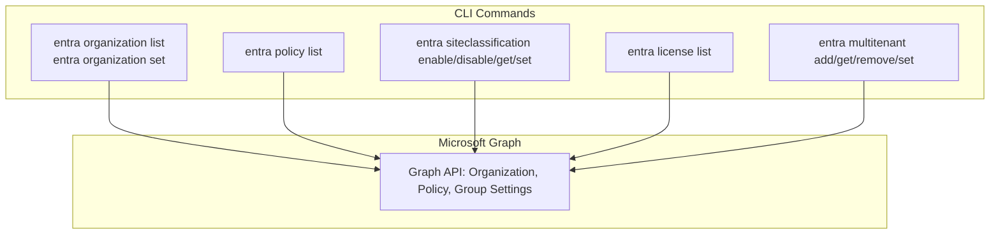
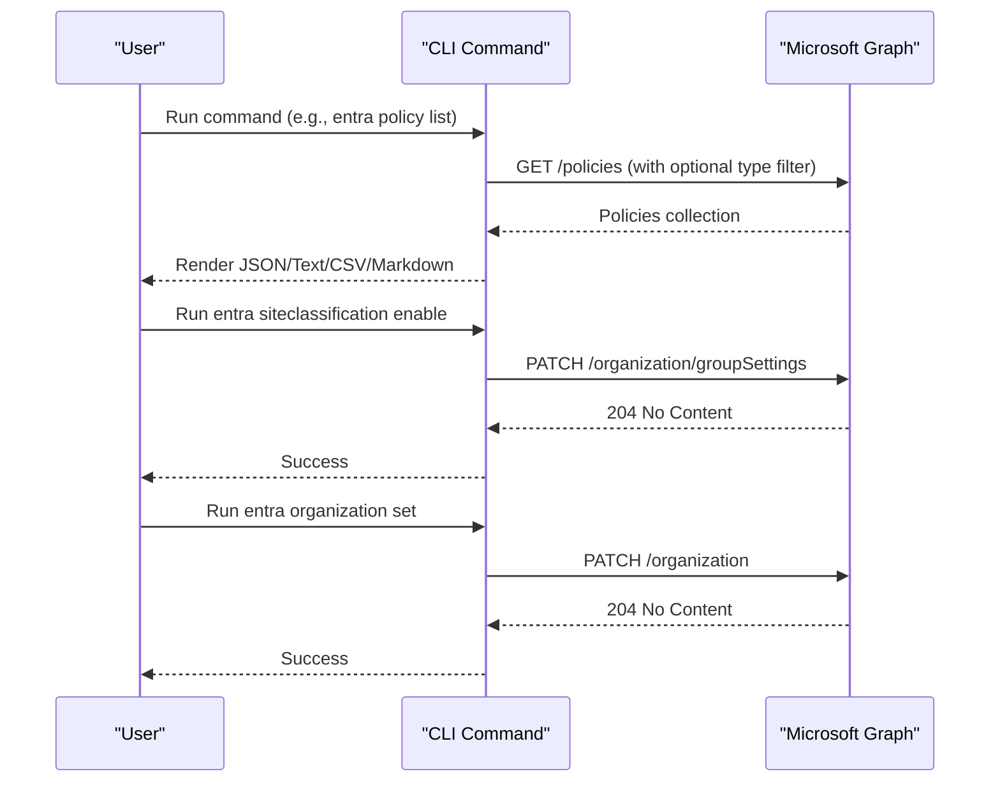
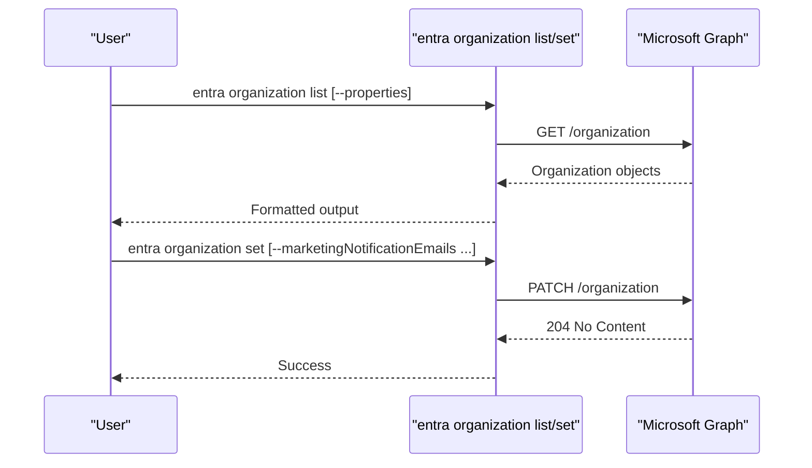
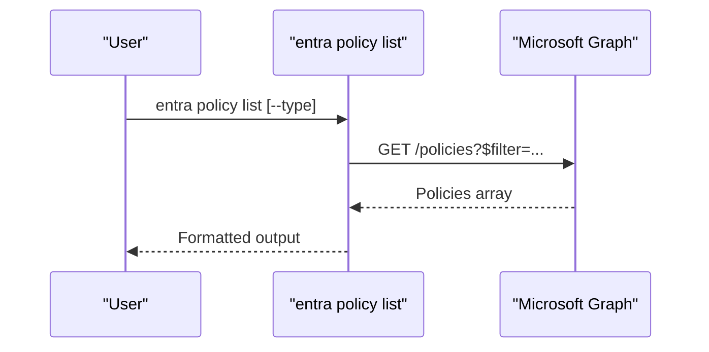
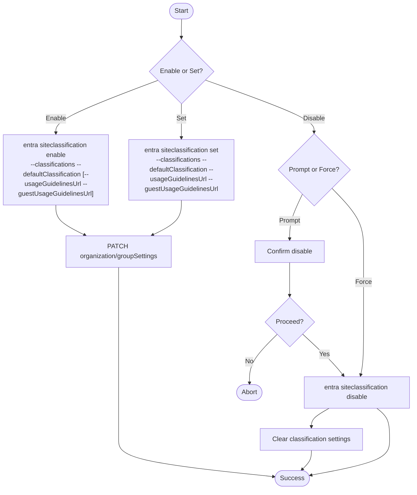
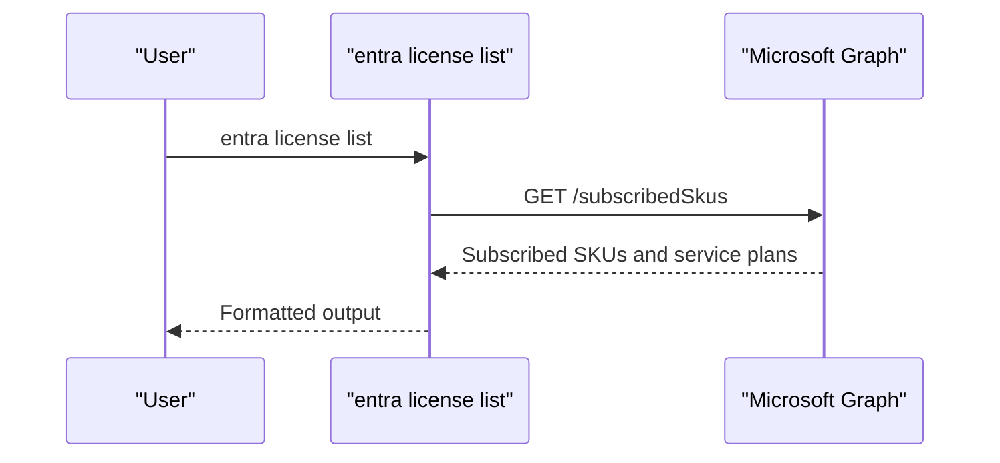
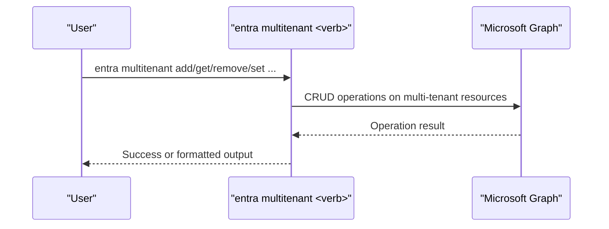
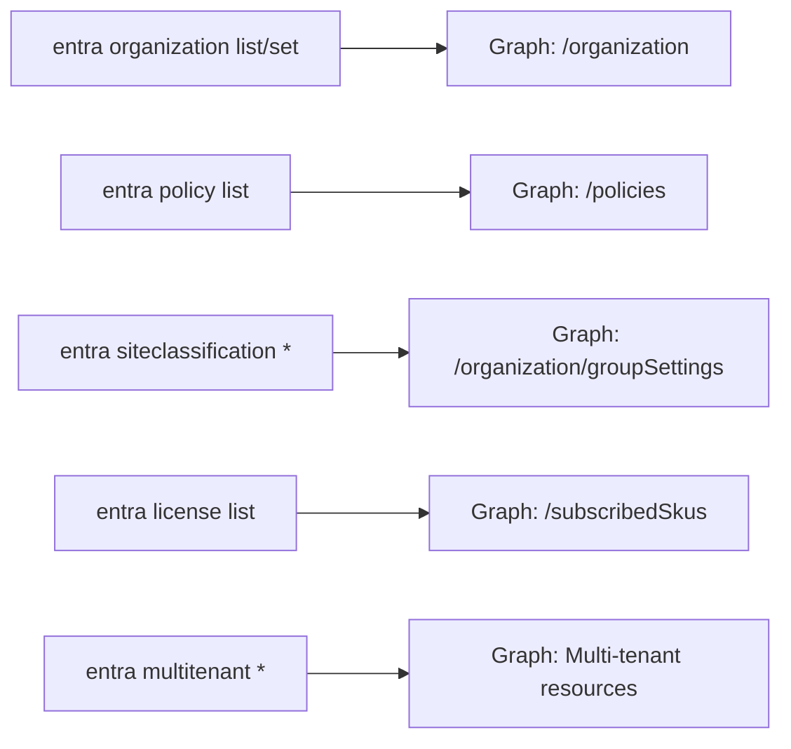

# Organization and Policies

<cite>
**Referenced Files in This Document**
- [organization-list.mdx](file://docs/docs/cmd/entra/organization/organization-list.mdx)
- [organization-set.mdx](file://docs/docs/cmd/entra/organization/organization-set.mdx)
- [policy-list.mdx](file://docs/docs/cmd/entra/policy/policy-list.mdx)
- [siteclassification-enable.mdx](file://docs/docs/cmd/entra/siteclassification/siteclassification-enable.mdx)
- [siteclassification-disable.mdx](file://docs/docs/cmd/entra/siteclassification/siteclassification-disable.mdx)
- [siteclassification-get.mdx](file://docs/docs/cmd/entra/siteclassification/siteclassification-get.mdx)
- [siteclassification-set.mdx](file://docs/docs/cmd/entra/siteclassification/siteclassification-set.mdx)
- [license-list.mdx](file://docs/docs/cmd/entra/license/license-list.mdx)
- [multitenant-add.mdx](file://docs/docs/cmd/entra/multitenant/multitenant-add.mdx)
- [multitenant-get.mdx](file://docs/docs/cmd/entra/multitenant/multitenant-get.mdx)
- [multitenant-remove.mdx](file://docs/docs/cmd/entra/multitenant/multitenant-remove.mdx)
- [multitenant-set.mdx](file://docs/docs/cmd/entra/multitenant/multitenant-set.mdx)
</cite>

## Table of Contents
1. [Introduction](#introduction)
2. [Project Structure](#project-structure)
3. [Core Components](#core-components)
4. [Architecture Overview](#architecture-overview)
5. [Detailed Component Analysis](#detailed-component-analysis)
6. [Dependency Analysis](#dependency-analysis)
7. [Performance Considerations](#performance-considerations)
8. [Troubleshooting Guide](#troubleshooting-guide)
9. [Conclusion](#conclusion)
10. [Appendices](#appendices)

## Introduction
This document explains how to configure and manage Microsoft Entra ID organization settings and policies using the CLI for Microsoft 365. It covers:
- Listing and updating organization-wide properties
- Managing tenant-wide policies across multiple policy types
- Site classification configuration (enable, disable, get, set)
- License inventory and management
- Multi-tenant operations
- Practical automation examples for governance and compliance

## Project Structure
The CLI organizes Entra ID commands under the entra category. Relevant commands for this document include:
- Organization: list, set
- Policy: list
- Site classification: enable, disable, get, set
- License: list
- Multi-tenant: add, get, remove, set

**Diagram sources**
- [organization-list.mdx:1-172](file://docs/docs/cmd/entra/organization/organization-list.mdx#L1-L172)
- [organization-set.mdx:1-84](file://docs/docs/cmd/entra/organization/organization-set.mdx#L1-L84)
- [policy-list.mdx:1-135](file://docs/docs/cmd/entra/policy/policy-list.mdx#L1-L135)
- [siteclassification-enable.mdx:1-58](file://docs/docs/cmd/entra/siteclassification/siteclassification-enable.mdx#L1-L58)
- [siteclassification-disable.mdx:1-43](file://docs/docs/cmd/entra/siteclassification/siteclassification-disable.mdx#L1-L43)
- [siteclassification-get.mdx:1-85](file://docs/docs/cmd/entra/siteclassification/siteclassification-get.mdx#L1-L85)
- [siteclassification-set.mdx:1-65](file://docs/docs/cmd/entra/siteclassification/siteclassification-set.mdx#L1-L65)
- [license-list.mdx:1-105](file://docs/docs/cmd/entra/license/license-list.mdx#L1-L105)
- [multitenant-add.mdx](file://docs/docs/cmd/entra/multitenant/multitenant-add.mdx)
- [multitenant-get.mdx](file://docs/docs/cmd/entra/multitenant/multitenant-get.mdx)
- [multitenant-remove.mdx](file://docs/docs/cmd/entra/multitenant/multitenant-remove.mdx)
- [multitenant-set.mdx](file://docs/docs/cmd/entra/multitenant/multitenant-set.mdx)

**Section sources**
- [organization-list.mdx:1-172](file://docs/docs/cmd/entra/organization/organization-list.mdx#L1-L172)
- [organization-set.mdx:1-84](file://docs/docs/cmd/entra/organization/organization-set.mdx#L1-L84)
- [policy-list.mdx:1-135](file://docs/docs/cmd/entra/policy/policy-list.mdx#L1-L135)
- [siteclassification-enable.mdx:1-58](file://docs/docs/cmd/entra/siteclassification/siteclassification-enable.mdx#L1-L58)
- [siteclassification-disable.mdx:1-43](file://docs/docs/cmd/entra/siteclassification/siteclassification-disable.mdx#L1-L43)
- [siteclassification-get.mdx:1-85](file://docs/docs/cmd/entra/siteclassification/siteclassification-get.mdx#L1-L85)
- [siteclassification-set.mdx:1-65](file://docs/docs/cmd/entra/siteclassification/siteclassification-set.mdx#L1-L65)
- [license-list.mdx:1-105](file://docs/docs/cmd/entra/license/license-list.mdx#L1-L105)
- [multitenant-add.mdx](file://docs/docs/cmd/entra/multitenant/multitenant-add.mdx)
- [multitenant-get.mdx](file://docs/docs/cmd/entra/multitenant/multitenant-get.mdx)
- [multitenant-remove.mdx](file://docs/docs/cmd/entra/multitenant/multitenant-remove.mdx)
- [multitenant-set.mdx](file://docs/docs/cmd/entra/multitenant/multitenant-set.mdx)

## Core Components
- Organization listing and updates: Retrieve and modify organization properties via Microsoft Graph.
- Policy listing: Enumerate tenant-wide policies by type.
- Site classification: Enable/disable classification, set default classification and usage guidelines, and fetch current configuration.
- License listing: View available commercial licenses and service plans.
- Multi-tenant management: Add, get, remove, and set multi-tenant configurations.

**Section sources**
- [organization-list.mdx:1-172](file://docs/docs/cmd/entra/organization/organization-list.mdx#L1-L172)
- [organization-set.mdx:1-84](file://docs/docs/cmd/entra/organization/organization-set.mdx#L1-L84)
- [policy-list.mdx:1-135](file://docs/docs/cmd/entra/policy/policy-list.mdx#L1-L135)
- [siteclassification-enable.mdx:1-58](file://docs/docs/cmd/entra/siteclassification/siteclassification-enable.mdx#L1-L58)
- [siteclassification-disable.mdx:1-43](file://docs/docs/cmd/entra/siteclassification/siteclassification-disable.mdx#L1-L43)
- [siteclassification-get.mdx:1-85](file://docs/docs/cmd/entra/siteclassification/siteclassification-get.mdx#L1-L85)
- [siteclassification-set.mdx:1-65](file://docs/docs/cmd/entra/siteclassification/siteclassification-set.mdx#L1-L65)
- [license-list.mdx:1-105](file://docs/docs/cmd/entra/license/license-list.mdx#L1-L105)
- [multitenant-add.mdx](file://docs/docs/cmd/entra/multitenant/multitenant-add.mdx)
- [multitenant-get.mdx](file://docs/docs/cmd/entra/multitenant/multitenant-get.mdx)
- [multitenant-remove.mdx](file://docs/docs/cmd/entra/multitenant/multitenant-remove.mdx)
- [multitenant-set.mdx](file://docs/docs/cmd/entra/multitenant/multitenant-set.mdx)

## Architecture Overview
The CLI commands communicate with Microsoft Graph to manage Entra ID resources. The following diagram shows how commands map to Graph operations.

**Diagram sources**
- [policy-list.mdx:1-135](file://docs/docs/cmd/entra/policy/policy-list.mdx#L1-L135)
- [siteclassification-enable.mdx:1-58](file://docs/docs/cmd/entra/siteclassification/siteclassification-enable.mdx#L1-L58)
- [organization-set.mdx:1-84](file://docs/docs/cmd/entra/organization/organization-set.mdx#L1-L84)

## Detailed Component Analysis

### Organization Management
- List organization properties with selectable fields and multiple output formats.
- Update organization properties such as notifications and privacy profile.

**Diagram sources**
- [organization-list.mdx:1-172](file://docs/docs/cmd/entra/organization/organization-list.mdx#L1-L172)
- [organization-set.mdx:1-84](file://docs/docs/cmd/entra/organization/organization-set.mdx#L1-L84)

**Section sources**
- [organization-list.mdx:1-172](file://docs/docs/cmd/entra/organization/organization-list.mdx#L1-L172)
- [organization-set.mdx:1-84](file://docs/docs/cmd/entra/organization/organization-set.mdx#L1-L84)

### Policy Management
- List policies with support for filtering by policy type.
- Supported types include authorization, claims mapping, conditional access, cross-tenant access, device registration, feature rollout, home realm discovery, identity security defaults enforcement, permission grant, role management, token issuance, and token lifetime.

**Diagram sources**
- [policy-list.mdx:1-135](file://docs/docs/cmd/entra/policy/policy-list.mdx#L1-L135)

**Section sources**
- [policy-list.mdx:1-135](file://docs/docs/cmd/entra/policy/policy-list.mdx#L1-L135)

### Site Classification
- Enable classification with classifications, default classification, and usage guidelines URLs.
- Disable classification with confirmation options.
- Get current classification configuration.
- Set classification values and URLs.

**Diagram sources**
- [siteclassification-enable.mdx:1-58](file://docs/docs/cmd/entra/siteclassification/siteclassification-enable.mdx#L1-L58)
- [siteclassification-disable.mdx:1-43](file://docs/docs/cmd/entra/siteclassification/siteclassification-disable.mdx#L1-L43)
- [siteclassification-get.mdx:1-85](file://docs/docs/cmd/entra/siteclassification/siteclassification-get.mdx#L1-L85)
- [siteclassification-set.mdx:1-65](file://docs/docs/cmd/entra/siteclassification/siteclassification-set.mdx#L1-L65)

**Section sources**
- [siteclassification-enable.mdx:1-58](file://docs/docs/cmd/entra/siteclassification/siteclassification-enable.mdx#L1-L58)
- [siteclassification-disable.mdx:1-43](file://docs/docs/cmd/entra/siteclassification/siteclassification-disable.mdx#L1-L43)
- [siteclassification-get.mdx:1-85](file://docs/docs/cmd/entra/siteclassification/siteclassification-get.mdx#L1-L85)
- [siteclassification-set.mdx:1-65](file://docs/docs/cmd/entra/siteclassification/siteclassification-set.mdx#L1-L65)

### License Management
- List commercial licenses and associated service plans for the tenant.

**Diagram sources**
- [license-list.mdx:1-105](file://docs/docs/cmd/entra/license/license-list.mdx#L1-L105)

**Section sources**
- [license-list.mdx:1-105](file://docs/docs/cmd/entra/license/license-list.mdx#L1-L105)

### Multi-Tenant Management
- Add, get, remove, and set multi-tenant configurations.

**Diagram sources**
- [multitenant-add.mdx](file://docs/docs/cmd/entra/multitenant/multitenant-add.mdx)
- [multitenant-get.mdx](file://docs/docs/cmd/entra/multitenant/multitenant-get.mdx)
- [multitenant-remove.mdx](file://docs/docs/cmd/entra/multitenant/multitenant-remove.mdx)
- [multitenant-set.mdx](file://docs/docs/cmd/entra/multitenant/multitenant-set.mdx)

**Section sources**
- [multitenant-add.mdx](file://docs/docs/cmd/entra/multitenant/multitenant-add.mdx)
- [multitenant-get.mdx](file://docs/docs/cmd/entra/multitenant/multitenant-get.mdx)
- [multitenant-remove.mdx](file://docs/docs/cmd/entra/multitenant/multitenant-remove.mdx)
- [multitenant-set.mdx](file://docs/docs/cmd/entra/multitenant/multitenant-set.mdx)

## Dependency Analysis
- Commands depend on Microsoft Graph endpoints for organization, policy, group settings, subscribed SKUs, and multi-tenant resources.
- Permissions vary by command; delegated and application permissions are documented per command.

**Diagram sources**
- [organization-list.mdx:1-172](file://docs/docs/cmd/entra/organization/organization-list.mdx#L1-L172)
- [organization-set.mdx:1-84](file://docs/docs/cmd/entra/organization/organization-set.mdx#L1-L84)
- [policy-list.mdx:1-135](file://docs/docs/cmd/entra/policy/policy-list.mdx#L1-L135)
- [siteclassification-enable.mdx:1-58](file://docs/docs/cmd/entra/siteclassification/siteclassification-enable.mdx#L1-L58)
- [siteclassification-disable.mdx:1-43](file://docs/docs/cmd/entra/siteclassification/siteclassification-disable.mdx#L1-L43)
- [siteclassification-get.mdx:1-85](file://docs/docs/cmd/entra/siteclassification/siteclassification-get.mdx#L1-L85)
- [siteclassification-set.mdx:1-65](file://docs/docs/cmd/entra/siteclassification/siteclassification-set.mdx#L1-L65)
- [license-list.mdx:1-105](file://docs/docs/cmd/entra/license/license-list.mdx#L1-L105)
- [multitenant-add.mdx](file://docs/docs/cmd/entra/multitenant/multitenant-add.mdx)
- [multitenant-get.mdx](file://docs/docs/cmd/entra/multitenant/multitenant-get.mdx)
- [multitenant-remove.mdx](file://docs/docs/cmd/entra/multitenant/multitenant-remove.mdx)
- [multitenant-set.mdx](file://docs/docs/cmd/entra/multitenant/multitenant-set.mdx)

**Section sources**
- [organization-list.mdx:1-172](file://docs/docs/cmd/entra/organization/organization-list.mdx#L1-L172)
- [organization-set.mdx:1-84](file://docs/docs/cmd/entra/organization/organization-set.mdx#L1-L84)
- [policy-list.mdx:1-135](file://docs/docs/cmd/entra/policy/policy-list.mdx#L1-L135)
- [siteclassification-enable.mdx:1-58](file://docs/docs/cmd/entra/siteclassification/siteclassification-enable.mdx#L1-L58)
- [siteclassification-disable.mdx:1-43](file://docs/docs/cmd/entra/siteclassification/siteclassification-disable.mdx#L1-L43)
- [siteclassification-get.mdx:1-85](file://docs/docs/cmd/entra/siteclassification/siteclassification-get.mdx#L1-L85)
- [siteclassification-set.mdx:1-65](file://docs/docs/cmd/entra/siteclassification/siteclassification-set.mdx#L1-L65)
- [license-list.mdx:1-105](file://docs/docs/cmd/entra/license/license-list.mdx#L1-L105)
- [multitenant-add.mdx](file://docs/docs/cmd/entra/multitenant/multitenant-add.mdx)
- [multitenant-get.mdx](file://docs/docs/cmd/entra/multitenant/multitenant-get.mdx)
- [multitenant-remove.mdx](file://docs/docs/cmd/entra/multitenant/multitenant-remove.mdx)
- [multitenant-set.mdx](file://docs/docs/cmd/entra/multitenant/multitenant-set.mdx)

## Performance Considerations
- Use the properties option to limit returned fields when listing organization details to reduce payload size.
- Filter policies by type to minimize response volume when enumerating policies.
- Prefer CSV or Text output for machine consumption to reduce parsing overhead.
- Batch operations are not exposed by these commands; chain multiple invocations in scripts for bulk tasks.

## Troubleshooting Guide
- Permission errors: Ensure the signed-in account has the required delegated or application permissions for each command.
- Partial properties: Delegated applications with limited permissions may only return a subset of organization properties.
- Confirmation prompts: Some destructive operations require explicit confirmation; use force options where supported to automate non-interactively.

**Section sources**
- [organization-list.mdx:24-48](file://docs/docs/cmd/entra/organization/organization-list.mdx#L24-L48)
- [organization-set.mdx:45-62](file://docs/docs/cmd/entra/organization/organization-set.mdx#L45-L62)
- [policy-list.mdx:24-41](file://docs/docs/cmd/entra/policy/policy-list.mdx#L24-L41)
- [siteclassification-disable.mdx:13-18](file://docs/docs/cmd/entra/siteclassification/siteclassification-disable.mdx#L13-L18)

## Conclusion
The CLI enables comprehensive management of Microsoft Entra ID organization settings, policies, site classification, licenses, and multi-tenant configurations. By leveraging the documented commands, permissions, and examples, administrators can automate governance and compliance tasks efficiently.

## Appendices
- Practical automation examples
  - Policy automation: List all policies, filter by type, and export to CSV for auditing.
  - Classification governance: Enable classification with default values and usage guidelines, then periodically reconcile settings via set operations.
  - Organizational configuration management: Use organization list to discover properties and organization set to update notifications and privacy profile.
  - License management: Export license inventory monthly and alert on SKU changes or capacity thresholds.
  - Multi-tenant management: Add trusted tenants, retrieve configuration snapshots, and update settings consistently across environments.