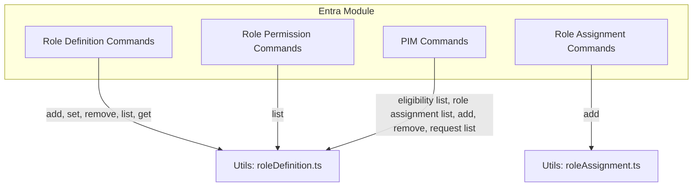
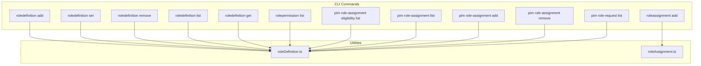
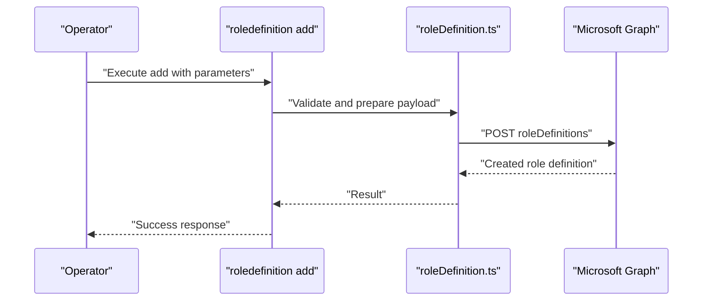
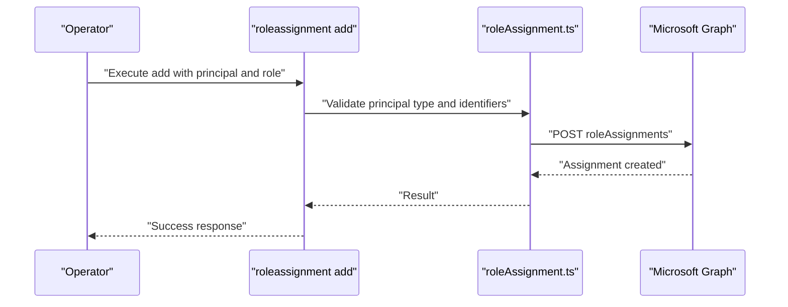
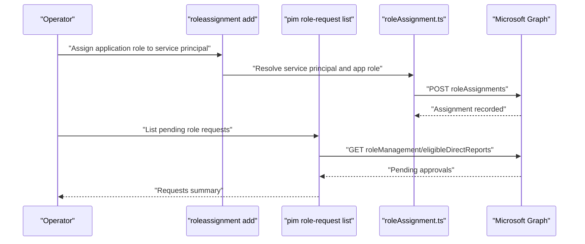
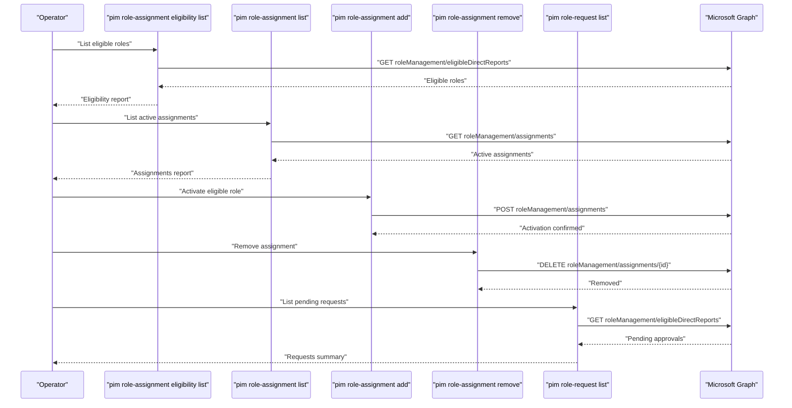
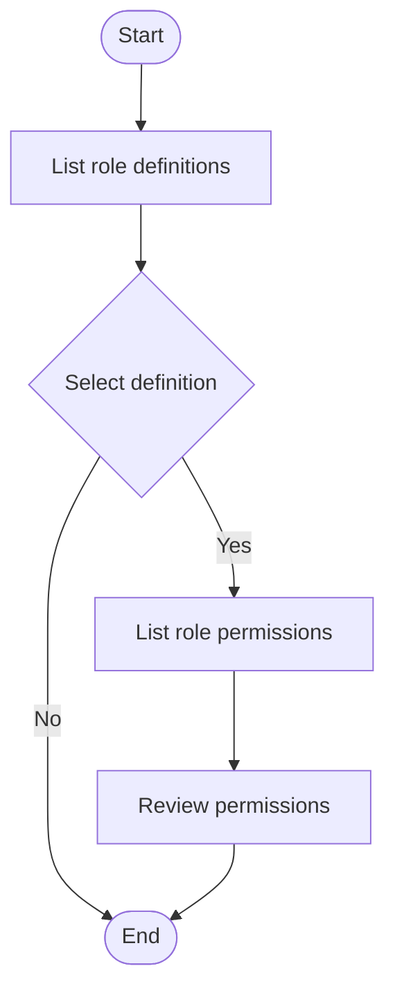
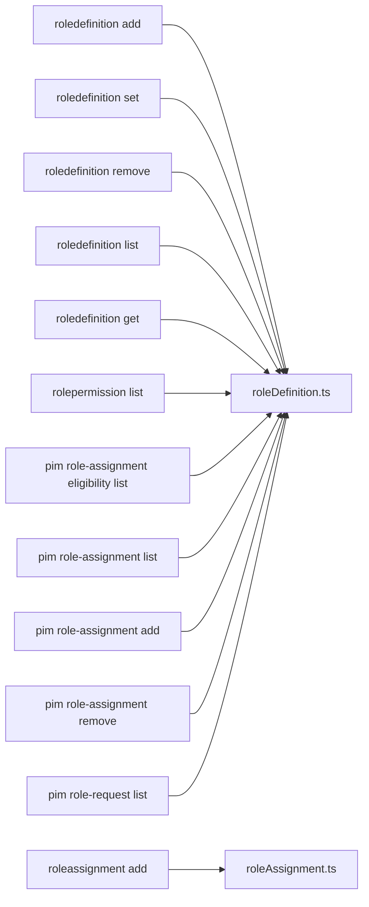

# Role and Access Management

<cite>
**Referenced Files in This Document**
- [roledefinition-add.ts](file://src/m365/entra/commands/roledefinition/roledefinition-add.ts)
- [roledefinition-set.ts](file://src/m365/entra/commands/roledefinition/roledefinition-set.ts)
- [roledefinition-remove.ts](file://src/m365/entra/commands/roledefinition/roledefinition-remove.ts)
- [roledefinition-list.ts](file://src/m365/entra/commands/roledefinition/roledefinition-list.ts)
- [roledefinition-get.ts](file://src/m365/entra/commands/roledefinition/roledefinition-get.ts)
- [roleassignment-add.ts](file://src/m365/entra/commands/roleassignment/roleassignment-add.ts)
- [rolepermission-list.ts](file://src/m365/entra/commands/rolepermission/rolepermission-list.ts)
- [pim-role-assignment-add.ts](file://src/m365/entra/commands/pim/pim-role-assignment-add.ts)
- [pim-role-assignment-eligibility-list.ts](file://src/m365/entra/commands/pim/pim-role-assignment-eligibility-list.ts)
- [pim-role-assignment-list.ts](file://src/m365/entra/commands/pim/pim-role-assignment-list.ts)
- [pim-role-assignment-remove.ts](file://src/m365/entra/commands/pim/pim-role-assignment-remove.ts)
- [pim-role-request-list.ts](file://src/m365/entra/commands/pim/pim-role-request-list.ts)
- [roleDefinition.ts](file://src/utils/roleDefinition.ts)
- [roleAssignment.ts](file://src/utils/roleAssignment.ts)
- [README.md](file://README.md)
</cite>

## Table of Contents
1. [Introduction](#introduction)
2. [Project Structure](#project-structure)
3. [Core Components](#core-components)
4. [Architecture Overview](#architecture-overview)
5. [Detailed Component Analysis](#detailed-component-analysis)
6. [Dependency Analysis](#dependency-analysis)
7. [Performance Considerations](#performance-considerations)
8. [Troubleshooting Guide](#troubleshooting-guide)
9. [Conclusion](#conclusion)
10. [Appendices](#appendices)

## Introduction
This document explains how to manage Microsoft Entra ID roles and access using the CLI for Microsoft 365. It covers role definition lifecycle (create, modify, delete, list, get), role assignments for users, groups, and administrative units, application role assignments, service principal permission requests, and Privileged Identity Management (PIM) operations for role eligibility and activation. It also describes resource namespace management and role permission listing, with practical examples for least-privilege implementation, automation, and compliance reporting.

## Project Structure
The CLI organizes Entra ID role and access management under the entra module with dedicated commands for:
- Role definitions: creation, modification, deletion, listing, and retrieval
- Role assignments: adding assignments for users, groups, and administrative units
- Role permissions: listing permissions associated with role definitions
- PIM: managing role eligibility, activation, and pending requests

**Diagram sources**
- [roledefinition-add.ts](file://src/m365/entra/commands/roledefinition/roledefinition-add.ts)
- [roledefinition-set.ts](file://src/m365/entra/commands/roledefinition/roledefinition-set.ts)
- [roledefinition-remove.ts](file://src/m365/entra/commands/roledefinition/roledefinition-remove.ts)
- [roledefinition-list.ts](file://src/m365/entra/commands/roledefinition/roledefinition-list.ts)
- [roledefinition-get.ts](file://src/m365/entra/commands/roledefinition/roledefinition-get.ts)
- [roleassignment-add.ts](file://src/m365/entra/commands/roleassignment/roleassignment-add.ts)
- [rolepermission-list.ts](file://src/m365/entra/commands/rolepermission/rolepermission-list.ts)
- [pim-role-assignment-eligibility-list.ts](file://src/m365/entra/commands/pim/pim-role-assignment-eligibility-list.ts)
- [pim-role-assignment-list.ts](file://src/m365/entra/commands/pim/pim-role-assignment-list.ts)
- [pim-role-assignment-add.ts](file://src/m365/entra/commands/pim/pim-role-assignment-add.ts)
- [pim-role-assignment-remove.ts](file://src/m365/entra/commands/pim/pim-role-assignment-remove.ts)
- [pim-role-request-list.ts](file://src/m365/entra/commands/pim/pim-role-request-list.ts)
- [roleDefinition.ts](file://src/utils/roleDefinition.ts)
- [roleAssignment.ts](file://src/utils/roleAssignment.ts)

**Section sources**
- [README.md](file://README.md)

## Core Components
- Role Definition Commands: Add, set, remove, list, and get role definitions
- Role Assignment Commands: Add assignments for users, groups, and administrative units
- Role Permission Commands: List permissions linked to role definitions
- PIM Commands: Manage role eligibility, activation, and pending requests

Key implementation files:
- Role definitions: [roledefinition-add.ts](file://src/m365/entra/commands/roledefinition/roledefinition-add.ts), [roledefinition-set.ts](file://src/m365/entra/commands/roledefinition/roledefinition-set.ts), [roledefinition-remove.ts](file://src/m365/entra/commands/roledefinition/roledefinition-remove.ts), [roledefinition-list.ts](file://src/m365/entra/commands/roledefinition/roledefinition-list.ts), [roledefinition-get.ts](file://src/m365/entra/commands/roledefinition/roledefinition-get.ts)
- Role assignments: [roleassignment-add.ts](file://src/m365/entra/commands/roleassignment/roleassignment-add.ts)
- Role permissions: [rolepermission-list.ts](file://src/m365/entra/commands/rolepermission/rolepermission-list.ts)
- PIM: [pim-role-assignment-add.ts](file://src/m365/entra/commands/pim/pim-role-assignment-add.ts), [pim-role-assignment-eligibility-list.ts](file://src/m365/entra/commands/pim/pim-role-assignment-eligibility-list.ts), [pim-role-assignment-list.ts](file://src/m365/entra/commands/pim/pim-role-assignment-list.ts), [pim-role-assignment-remove.ts](file://src/m365/entra/commands/pim/pim-role-assignment-remove.ts), [pim-role-request-list.ts](file://src/m365/entra/commands/pim/pim-role-request-list.ts)

**Section sources**
- [roledefinition-add.ts](file://src/m365/entra/commands/roledefinition/roledefinition-add.ts)
- [roledefinition-set.ts](file://src/m365/entra/commands/roledefinition/roledefinition-set.ts)
- [roledefinition-remove.ts](file://src/m365/entra/commands/roledefinition/roledefinition-remove.ts)
- [roledefinition-list.ts](file://src/m365/entra/commands/roledefinition/roledefinition-list.ts)
- [roledefinition-get.ts](file://src/m365/entra/commands/roledefinition/roledefinition-get.ts)
- [roleassignment-add.ts](file://src/m365/entra/commands/roleassignment/roleassignment-add.ts)
- [rolepermission-list.ts](file://src/m365/entra/commands/rolepermission/rolepermission-list.ts)
- [pim-role-assignment-add.ts](file://src/m365/entra/commands/pim/pim-role-assignment-add.ts)
- [pim-role-assignment-eligibility-list.ts](file://src/m365/entra/commands/pim/pim-role-assignment-eligibility-list.ts)
- [pim-role-assignment-list.ts](file://src/m365/entra/commands/pim/pim-role-assignment-list.ts)
- [pim-role-assignment-remove.ts](file://src/m365/entra/commands/pim/pim-role-assignment-remove.ts)
- [pim-role-request-list.ts](file://src/m365/entra/commands/pim/pim-role-request-list.ts)

## Architecture Overview
The CLI composes commands from modular handlers and delegates data operations to shared utilities. The following diagram shows how commands interact with utilities and the Microsoft Graph APIs they target.

**Diagram sources**
- [roledefinition-add.ts](file://src/m365/entra/commands/roledefinition/roledefinition-add.ts)
- [roledefinition-set.ts](file://src/m365/entra/commands/roledefinition/roledefinition-set.ts)
- [roledefinition-remove.ts](file://src/m365/entra/commands/roledefinition/roledefinition-remove.ts)
- [roledefinition-list.ts](file://src/m365/entra/commands/roledefinition/roledefinition-list.ts)
- [roledefinition-get.ts](file://src/m365/entra/commands/roledefinition/roledefinition-get.ts)
- [roleassignment-add.ts](file://src/m365/entra/commands/roleassignment/roleassignment-add.ts)
- [rolepermission-list.ts](file://src/m365/entra/commands/rolepermission/rolepermission-list.ts)
- [pim-role-assignment-eligibility-list.ts](file://src/m365/entra/commands/pim/pim-role-assignment-eligibility-list.ts)
- [pim-role-assignment-list.ts](file://src/m365/entra/commands/pim/pim-role-assignment-list.ts)
- [pim-role-assignment-add.ts](file://src/m365/entra/commands/pim/pim-role-assignment-add.ts)
- [pim-role-assignment-remove.ts](file://src/m365/entra/commands/pim/pim-role-assignment-remove.ts)
- [pim-role-request-list.ts](file://src/m365/entra/commands/pim/pim-role-request-list.ts)
- [roleDefinition.ts](file://src/utils/roleDefinition.ts)
- [roleAssignment.ts](file://src/utils/roleAssignment.ts)

## Detailed Component Analysis

### Role Definition Operations
Role definitions encapsulate named sets of permissions. The CLI supports:
- Creating a new role definition
- Updating an existing role definition
- Deleting a role definition
- Listing role definitions
- Getting a specific role definition

**Diagram sources**
- [roledefinition-add.ts](file://src/m365/entra/commands/roledefinition/roledefinition-add.ts)
- [roleDefinition.ts](file://src/utils/roleDefinition.ts)

Implementation highlights:
- Validation and payload construction occur in the utility layer before calling Microsoft Graph
- The add command accepts parameters for role name, description, permissions, and assignable scopes
- Listing and getting rely on the same utility to query Microsoft Graph endpoints

Practical example: Create a custom role definition with minimal permissions for a specific resource scope.

**Section sources**
- [roledefinition-add.ts](file://src/m365/entra/commands/roledefinition/roledefinition-add.ts)
- [roledefinition-set.ts](file://src/m365/entra/commands/roledefinition/roledefinition-set.ts)
- [roledefinition-remove.ts](file://src/m365/entra/commands/roledefinition/roledefinition-remove.ts)
- [roledefinition-list.ts](file://src/m365/entra/commands/roledefinition/roledefinition-list.ts)
- [roledefinition-get.ts](file://src/m365/entra/commands/roledefinition/roledefinition-get.ts)
- [roleDefinition.ts](file://src/utils/roleDefinition.ts)

### Role Assignment Operations
Role assignments connect principals (users, groups, administrative units) to role definitions. The CLI supports adding assignments.

**Diagram sources**
- [roleassignment-add.ts](file://src/m365/entra/commands/roleassignment/roleassignment-add.ts)
- [roleAssignment.ts](file://src/utils/roleAssignment.ts)

Supported principals:
- Users
- Groups
- Administrative units

Practical example: Assign a built-in role to a group for a specific administrative unit.

**Section sources**
- [roleassignment-add.ts](file://src/m365/entra/commands/roleassignment/roleassignment-add.ts)
- [roleAssignment.ts](file://src/utils/roleAssignment.ts)

### Application Role Assignments and Service Principal Permission Requests
Application role assignments enable service principals to act on behalf of applications. Service principal permission requests handle consent and approval flows.

**Diagram sources**
- [roleassignment-add.ts](file://src/m365/entra/commands/roleassignment/roleassignment-add.ts)
- [pim-role-request-list.ts](file://src/m365/entra/commands/pim/pim-role-request-list.ts)
- [roleAssignment.ts](file://src/utils/roleAssignment.ts)

Practical example: Request activation of an eligible role for a service principal and track pending approvals.

**Section sources**
- [roleassignment-add.ts](file://src/m365/entra/commands/roleassignment/roleassignment-add.ts)
- [pim-role-request-list.ts](file://src/m365/entra/commands/pim/pim-role-request-list.ts)
- [roleAssignment.ts](file://src/utils/roleAssignment.ts)

### Privileged Identity Management (PIM)
PIM manages on-demand and time-bound access to roles. Operations include eligibility listing, assignment listing, adding eligibility/assignments, removing assignments, and listing role requests.

**Diagram sources**
- [pim-role-assignment-eligibility-list.ts](file://src/m365/entra/commands/pim/pim-role-assignment-eligibility-list.ts)
- [pim-role-assignment-list.ts](file://src/m365/entra/commands/pim/pim-role-assignment-list.ts)
- [pim-role-assignment-add.ts](file://src/m365/entra/commands/pim/pim-role-assignment-add.ts)
- [pim-role-assignment-remove.ts](file://src/m365/entra/commands/pim/pim-role-assignment-remove.ts)
- [pim-role-request-list.ts](file://src/m365/entra/commands/pim/pim-role-request-list.ts)

Practical example: Automate periodic checks of eligible roles and send notifications for overdue activations.

**Section sources**
- [pim-role-assignment-eligibility-list.ts](file://src/m365/entra/commands/pim/pim-role-assignment-eligibility-list.ts)
- [pim-role-assignment-list.ts](file://src/m365/entra/commands/pim/pim-role-assignment-list.ts)
- [pim-role-assignment-add.ts](file://src/m365/entra/commands/pim/pim-role-assignment-add.ts)
- [pim-role-assignment-remove.ts](file://src/m365/entra/commands/pim/pim-role-assignment-remove.ts)
- [pim-role-request-list.ts](file://src/m365/entra/commands/pim/pim-role-request-list.ts)

### Resource Namespace Management and Role Permission Listing
Resource namespaces define the scope of resources protected by role definitions. The CLI allows listing role permissions to understand what actions are covered by a role.

**Diagram sources**
- [roledefinition-list.ts](file://src/m365/entra/commands/roledefinition/roledefinition-list.ts)
- [rolepermission-list.ts](file://src/m365/entra/commands/rolepermission/rolepermission-list.ts)

Practical example: Audit role permissions across the tenant to align with least-privilege policies.

**Section sources**
- [roledefinition-list.ts](file://src/m365/entra/commands/roledefinition/roledefinition-list.ts)
- [rolepermission-list.ts](file://src/m365/entra/commands/rolepermission/rolepermission-list.ts)

## Dependency Analysis
The commands depend on shared utilities for validation and Microsoft Graph interactions. Cohesion is strong within each functional area (role definitions, assignments, PIM), while coupling remains low through utility abstractions.

**Diagram sources**
- [roledefinition-add.ts](file://src/m365/entra/commands/roledefinition/roledefinition-add.ts)
- [roledefinition-set.ts](file://src/m365/entra/commands/roledefinition/roledefinition-set.ts)
- [roledefinition-remove.ts](file://src/m365/entra/commands/roledefinition/roledefinition-remove.ts)
- [roledefinition-list.ts](file://src/m365/entra/commands/roledefinition/roledefinition-list.ts)
- [roledefinition-get.ts](file://src/m365/entra/commands/roledefinition/roledefinition-get.ts)
- [roleassignment-add.ts](file://src/m365/entra/commands/roleassignment/roleassignment-add.ts)
- [rolepermission-list.ts](file://src/m365/entra/commands/rolepermission/rolepermission-list.ts)
- [pim-role-assignment-eligibility-list.ts](file://src/m365/entra/commands/pim/pim-role-assignment-eligibility-list.ts)
- [pim-role-assignment-list.ts](file://src/m365/entra/commands/pim/pim-role-assignment-list.ts)
- [pim-role-assignment-add.ts](file://src/m365/entra/commands/pim/pim-role-assignment-add.ts)
- [pim-role-assignment-remove.ts](file://src/m365/entra/commands/pim/pim-role-assignment-remove.ts)
- [pim-role-request-list.ts](file://src/m365/entra/commands/pim/pim-role-request-list.ts)
- [roleDefinition.ts](file://src/utils/roleDefinition.ts)
- [roleAssignment.ts](file://src/utils/roleAssignment.ts)

**Section sources**
- [roleDefinition.ts](file://src/utils/roleDefinition.ts)
- [roleAssignment.ts](file://src/utils/roleAssignment.ts)

## Performance Considerations
- Batch operations: Prefer listing and filtering via query parameters to reduce round-trips
- Idempotency: Commands should handle repeated executions gracefully
- Pagination: Use paging helpers when listing large collections (role definitions, assignments)
- Validation early: Validate inputs in the command layer to avoid unnecessary API calls

## Troubleshooting Guide
Common issues and resolutions:
- Insufficient permissions: Ensure the authenticated account has sufficient rights to manage roles and assignments
- Invalid identifiers: Verify object IDs for users, groups, administrative units, and applications
- Duplicate assignments: Check existing assignments before creating new ones
- Eligibility vs. assignment: Understand the difference between eligible and active assignments in PIM

Operational tips:
- Use verbose logging to capture API responses
- Validate parameters against expected formats before execution
- Confirm resource scope alignment with role definition assignments

**Section sources**
- [roledefinition-add.ts](file://src/m365/entra/commands/roledefinition/roledefinition-add.ts)
- [roleassignment-add.ts](file://src/m365/entra/commands/roleassignment/roleassignment-add.ts)
- [pim-role-assignment-add.ts](file://src/m365/entra/commands/pim/pim-role-assignment-add.ts)

## Conclusion
The CLI provides a comprehensive toolkit for managing Microsoft Entra ID roles and access. By leveraging role definitions, assignments, permission listings, and PIM capabilities, administrators can implement least-privilege policies, automate routine tasks, and maintain compliance through auditing and reporting.

## Appendices

### Practical Examples Index
- Least-privilege implementation: Create custom role definitions aligned with job functions and assign minimal permissions per scope
- Role management automation: Schedule periodic reviews of eligible roles and active assignments; generate compliance reports
- Compliance reporting: Export role permission lists and assignment matrices for governance audits

[No sources needed since this section provides general guidance]