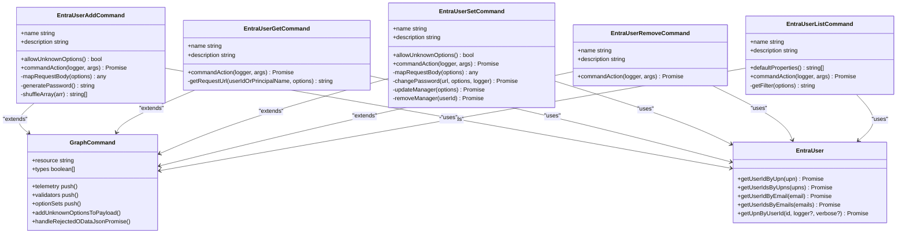
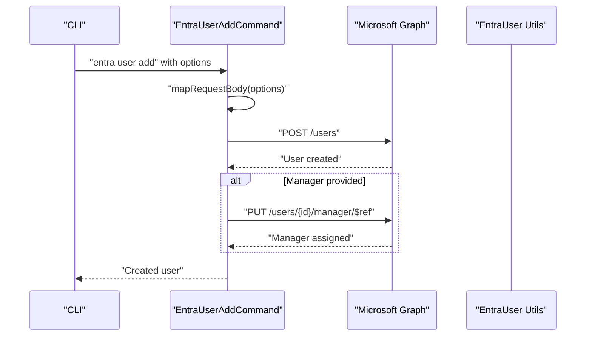
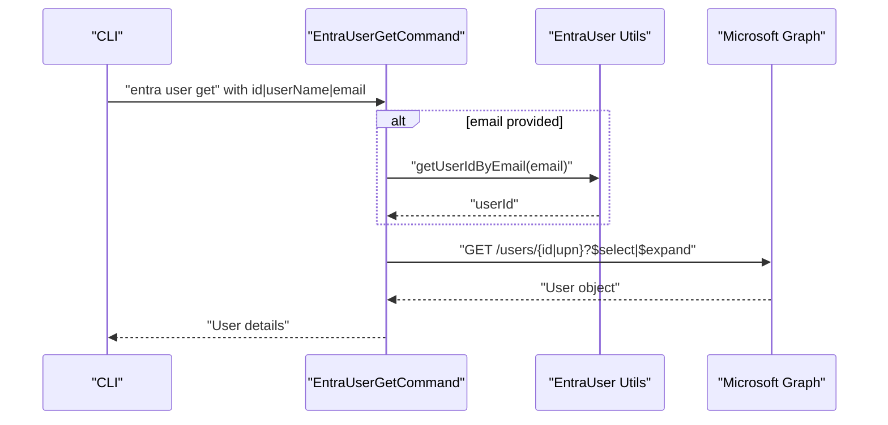
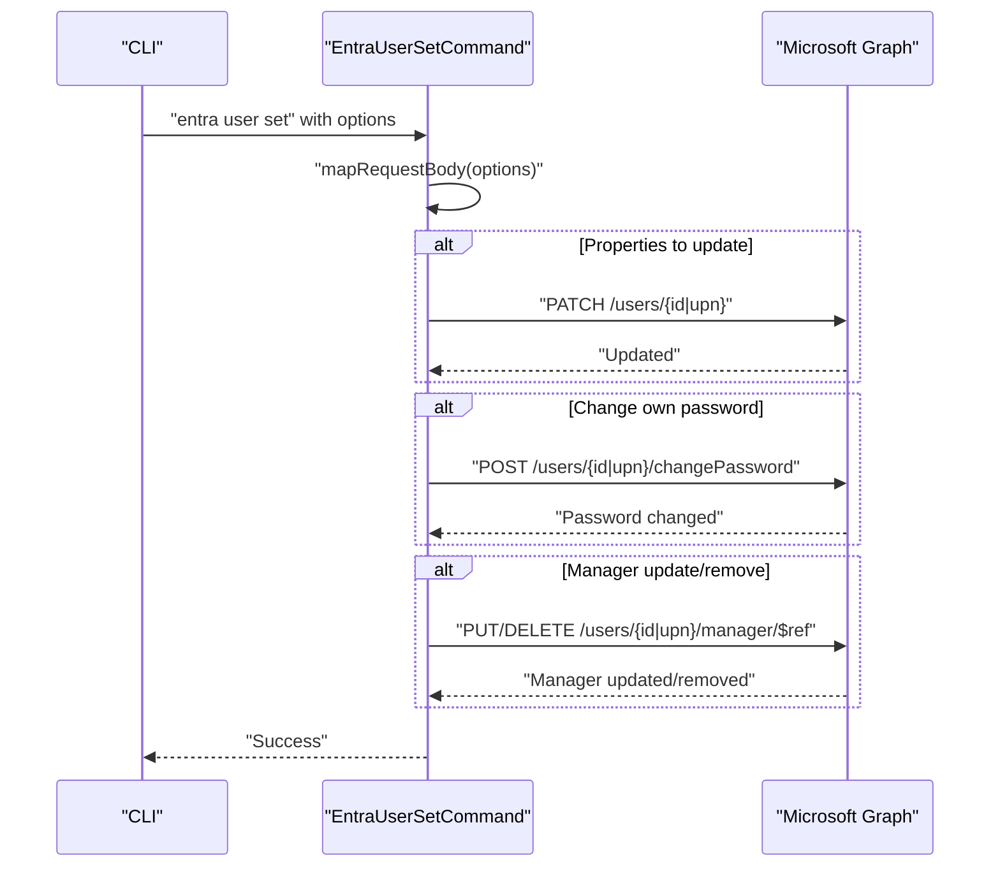
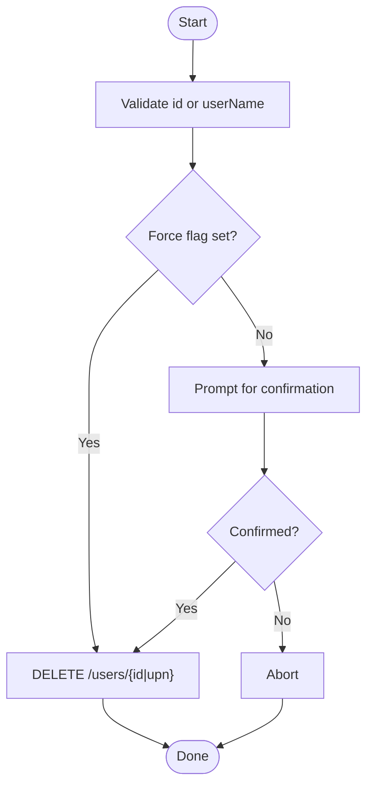
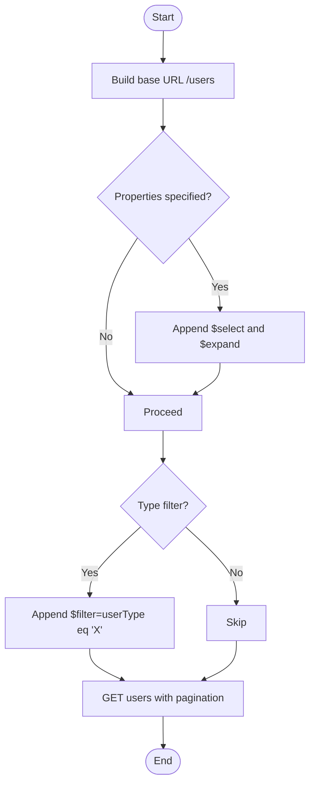
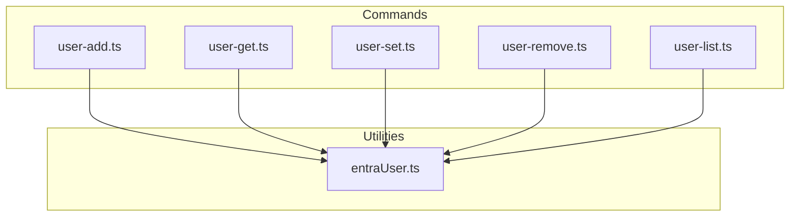

# User Management

<cite>
**Referenced Files in This Document**
- [commands.ts](file://src/m365/entra/commands.ts)
- [entraUser.ts](file://src/utils/entraUser.ts)
- [user-add.ts](file://src/m365/entra/commands/user/user-add.ts)
- [user-get.ts](file://src/m365/entra/commands/user/user-get.ts)
- [user-set.ts](file://src/m365/entra/commands/user/user-set.ts)
- [user-remove.ts](file://src/m365/entra/commands/user/user-remove.ts)
- [user-list.ts](file://src/m365/entra/commands/user/user-list.ts)
- [user-guest-add.ts](file://src/m365/entra/commands/user/user-guest-add.ts)
- [user-license-add.ts](file://src/m365/entra/commands/user/user-license-add.ts)
- [user-license-list.ts](file://src/m365/entra/commands/user/user-license-list.ts)
- [user-license-remove.ts](file://src/m365/entra/commands/user/user-license-remove.ts)
- [user-groupmembership-list.ts](file://src/m365/entra/commands/user/user-groupmembership-list.ts)
- [user-signin-list.ts](file://src/m365/entra/commands/user/user-signin-list.ts)
- [user-session-revoke.ts](file://src/m365/entra/commands/user/user-session-revoke.ts)
- [user-password-validate.ts](file://src/m365/entra/commands/user/user-password-validate.ts)
- [user-hibp.ts](file://src/m365/entra/commands/user/user-hibp.ts)
- [user-recyclebinitem-list.ts](file://src/m365/entra/commands/user/user-recyclebinitem-list.ts)
- [user-recyclebinitem-restore.ts](file://src/m365/entra/commands/user/user-recyclebinitem-restore.ts)
- [user-recyclebinitem-remove.ts](file://src/m365/entra/commands/user/user-recyclebinitem-remove.ts)
- [user-recyclebinitem-clear.ts](file://src/m365/entra/commands/user/user-recyclebinitem-clear.ts)
- [user-registrationdetails-list.ts](file://src/m365/entra/commands/user/user-registrationdetails-list.ts)
</cite>

## Table of Contents
1. [Introduction](#introduction)
2. [Project Structure](#project-structure)
3. [Core Components](#core-components)
4. [Architecture Overview](#architecture-overview)
5. [Detailed Component Analysis](#detailed-component-analysis)
6. [Dependency Analysis](#dependency-analysis)
7. [Performance Considerations](#performance-considerations)
8. [Troubleshooting Guide](#troubleshooting-guide)
9. [Conclusion](#conclusion)
10. [Appendices](#appendices)

## Introduction
This document provides comprehensive guidance for Microsoft Entra ID user management operations in the CLI for Microsoft 365. It covers the user lifecycle: creation, retrieval, updates, deletion, and password operations. It also documents guest user management, license assignment and removal, group membership operations, sign-in history tracking, validation utilities, and security session management. Practical examples illustrate automation, bulk operations, and compliance scenarios. Permissions, common use cases, and integrations with other Entra ID features are included to support secure and efficient administration.

## Project Structure
The user management capabilities are implemented as discrete commands under the Entra ID module. Each command encapsulates a specific operation (e.g., add, get, set, remove, list) and leverages shared utilities for Entra ID operations and Graph integration.

```mermaid
graph TB
subgraph "Entra Commands"
UA["user-add.ts"]
UG["user-get.ts"]
US["user-set.ts"]
UR["user-remove.ts"]
UL["user-list.ts"]
UGA["user-guest-add.ts"]
ULA["user-license-add.ts"]
ULL["user-license-list.ts"]
ULR["user-license-remove.ts"]
UGM["user-groupmembership-list.ts"]
USL["user-signin-list.ts"]
USR["user-session-revoke.ts"]
UPL["user-password-validate.ts"]
UHB["user-hibp.ts"]
URB_L["user-recyclebinitem-list.ts"]
URB_R["user-recyclebinitem-restore.ts"]
URB_D["user-recyclebinitem-remove.ts"]
URB_C["user-recyclebinitem-clear.ts"]
URD["user-registrationdetails-list.ts"]
end
subgraph "Shared Utilities"
EU["entraUser.ts"]
CMDS["commands.ts"]
end
UA --> EU
UG --> EU
US --> EU
UR --> EU
UL --> EU
UA --> CMDS
UG --> CMDS
US --> CMDS
UR --> CMDS
UL --> CMDS
UGA --> CMDS
ULA --> CMDS
ULL --> CMDS
ULR --> CMDS
UGM --> CMDS
USL --> CMDS
USR --> CMDS
UPL --> CMDS
UHB --> CMDS
URB_L --> CMDS
URB_R --> CMDS
URB_D --> CMDS
URB_C --> CMDS
URD --> CMDS
```

**Diagram sources**
- [commands.ts:111-129](file://src/m365/entra/commands.ts#L111-L129)
- [entraUser.ts:1-156](file://src/utils/entraUser.ts#L1-L156)
- [user-add.ts:1-301](file://src/m365/entra/commands/user/user-add.ts#L1-L301)
- [user-get.ts:1-152](file://src/m365/entra/commands/user/user-get.ts#L1-L152)
- [user-set.ts:1-381](file://src/m365/entra/commands/user/user-set.ts#L1-L381)
- [user-remove.ts:1-119](file://src/m365/entra/commands/user/user-remove.ts#L1-L119)
- [user-list.ts:1-141](file://src/m365/entra/commands/user/user-list.ts#L1-L141)

**Section sources**
- [commands.ts:111-129](file://src/m365/entra/commands.ts#L111-L129)

## Core Components
- User lifecycle commands:
  - Add user: creates a new user with profile attributes and optional manager assignment.
  - Get user: retrieves user details by ID, UPN, or email with optional manager expansion.
  - Update user: modifies user properties, resets passwords, enforces next-sign-in policies, and manages manager relationships.
  - Remove user: deletes a user after confirmation or force flag.
  - List users: enumerates users with filtering and property selection.
- Guest user management:
  - Add guest user: invites external users with specified roles and attributes.
- License management:
  - Assign licenses to users.
  - List user licenses.
  - Remove licenses from users.
- Group membership:
  - List groups a user belongs to.
- Sign-in history and sessions:
  - List sign-in logs for a user.
  - Revoke user sessions.
- Validation and hygiene:
  - Validate user passwords against organizational policies.
  - Check user credentials against breach databases.
  - Recycle bin operations for users (list, restore, remove, clear).
  - Registration details listing for MFA and alternative authentication methods.

**Section sources**
- [user-add.ts:37-44](file://src/m365/entra/commands/user/user-add.ts#L37-L44)
- [user-get.ts:23-30](file://src/m365/entra/commands/user/user-get.ts#L23-L30)
- [user-set.ts:38-45](file://src/m365/entra/commands/user/user-set.ts#L38-L45)
- [user-remove.ts:19-27](file://src/m365/entra/commands/user/user-remove.ts#L19-L27)
- [user-list.ts:19-28](file://src/m365/entra/commands/user/user-list.ts#L19-L28)
- [user-guest-add.ts](file://src/m365/entra/commands/user/user-guest-add.ts)
- [user-license-add.ts](file://src/m365/entra/commands/user/user-license-add.ts)
- [user-license-list.ts](file://src/m365/entra/commands/user/user-license-list.ts)
- [user-license-remove.ts](file://src/m365/entra/commands/user/user-license-remove.ts)
- [user-groupmembership-list.ts](file://src/m365/entra/commands/user/user-groupmembership-list.ts)
- [user-signin-list.ts](file://src/m365/entra/commands/user/user-signin-list.ts)
- [user-session-revoke.ts](file://src/m365/entra/commands/user/user-session-revoke.ts)
- [user-password-validate.ts](file://src/m365/entra/commands/user/user-password-validate.ts)
- [user-hibp.ts](file://src/m365/entra/commands/user/user-hibp.ts)
- [user-recyclebinitem-list.ts](file://src/m365/entra/commands/user/user-recyclebinitem-list.ts)
- [user-recyclebinitem-restore.ts](file://src/m365/entra/commands/user/user-recyclebinitem-restore.ts)
- [user-recyclebinitem-remove.ts](file://src/m365/entra/commands/user/user-recyclebinitem-remove.ts)
- [user-recyclebinitem-clear.ts](file://src/m365/entra/commands/user/user-recyclebinitem-clear.ts)
- [user-registrationdetails-list.ts](file://src/m365/entra/commands/user/user-registrationdetails-list.ts)

## Architecture Overview
The user management commands follow a consistent pattern:
- Extend a GraphCommand base class to inherit authentication, resource handling, and error management.
- Define telemetry, options, validators, and option sets.
- Map CLI options to Graph request bodies.
- Perform HTTP operations via a shared request client.
- Utilize shared utilities for Entra ID identifiers (UPN, email, ID resolution).

**Diagram sources**
- [user-add.ts:37-58](file://src/m365/entra/commands/user/user-add.ts#L37-L58)
- [user-get.ts:23-39](file://src/m365/entra/commands/user/user-get.ts#L23-L39)
- [user-set.ts:38-59](file://src/m365/entra/commands/user/user-set.ts#L38-L59)
- [user-remove.ts:19-36](file://src/m365/entra/commands/user/user-remove.ts#L19-L36)
- [user-list.ts:19-45](file://src/m365/entra/commands/user/user-list.ts#L19-L45)
- [entraUser.ts:7-156](file://src/utils/entraUser.ts#L7-L156)

## Detailed Component Analysis

### User Creation (Add)
- Purpose: Create a new user with profile attributes and optional manager assignment.
- Key behaviors:
  - Validates UPN and optional usage location/language constraints.
  - Generates a secure password if not provided.
  - Supports manager assignment by ID or UPN.
- Request mapping:
  - Translates CLI options to a Graph user creation payload.
  - Applies password profile settings for next-sign-in enforcement.
- Telemetry and unknown options:
  - Tracks provided options and forwards unknown options to the payload.

**Diagram sources**
- [user-add.ts:204-241](file://src/m365/entra/commands/user/user-add.ts#L204-L241)
- [user-add.ts:243-267](file://src/m365/entra/commands/user/user-add.ts#L243-L267)
- [user-add.ts:272-298](file://src/m365/entra/commands/user/user-add.ts#L272-L298)

**Section sources**
- [user-add.ts:140-189](file://src/m365/entra/commands/user/user-add.ts#L140-L189)
- [user-add.ts:204-241](file://src/m365/entra/commands/user/user-add.ts#L204-L241)
- [user-add.ts:243-267](file://src/m365/entra/commands/user/user-add.ts#L243-L267)

### User Retrieval (Get)
- Purpose: Fetch user details by ID, UPN, or email.
- Key behaviors:
  - Resolves email to user ID via utility.
  - Supports selecting specific properties and expanding manager details.
  - Encodes special characters in UPNs per OData conventions.

**Diagram sources**
- [user-get.ts:94-122](file://src/m365/entra/commands/user/user-get.ts#L94-L122)
- [user-get.ts:124-148](file://src/m365/entra/commands/user/user-get.ts#L124-L148)
- [entraUser.ts:74-89](file://src/utils/entraUser.ts#L74-L89)

**Section sources**
- [user-get.ts:73-92](file://src/m365/entra/commands/user/user-get.ts#L73-L92)
- [user-get.ts:94-122](file://src/m365/entra/commands/user/user-get.ts#L94-L122)
- [user-get.ts:124-148](file://src/m365/entra/commands/user/user-get.ts#L124-L148)

### User Updates (Set)
- Purpose: Update user properties, reset passwords, enforce next-sign-in policies, and manage manager relationships.
- Key behaviors:
  - Validates option combinations (e.g., password reset requires new password).
  - Supports changing own password only when targeting the authenticated user.
  - Updates manager via reference or removes manager when requested.
- Request mapping:
  - Builds a partial update payload and replaces empty strings with nulls.

**Diagram sources**
- [user-set.ts:246-301](file://src/m365/entra/commands/user/user-set.ts#L246-L301)
- [user-set.ts:337-355](file://src/m365/entra/commands/user/user-set.ts#L337-L355)
- [user-set.ts:357-378](file://src/m365/entra/commands/user/user-set.ts#L357-L378)

**Section sources**
- [user-set.ts:158-232](file://src/m365/entra/commands/user/user-set.ts#L158-L232)
- [user-set.ts:246-301](file://src/m365/entra/commands/user/user-set.ts#L246-L301)
- [user-set.ts:337-355](file://src/m365/entra/commands/user/user-set.ts#L337-L355)
- [user-set.ts:357-378](file://src/m365/entra/commands/user/user-set.ts#L357-L378)

### User Deletion (Remove)
- Purpose: Permanently remove a user with confirmation or force flag.
- Key behaviors:
  - Validates ID or UPN.
  - Prompts for confirmation unless force is specified.

**Diagram sources**
- [user-remove.ts:84-116](file://src/m365/entra/commands/user/user-remove.ts#L84-L116)

**Section sources**
- [user-remove.ts:68-82](file://src/m365/entra/commands/user/user-remove.ts#L68-L82)
- [user-remove.ts:84-116](file://src/m365/entra/commands/user/user-remove.ts#L84-L116)

### User Listing (List)
- Purpose: Enumerate users with optional filtering and property selection.
- Key behaviors:
  - Supports filtering by userType (Member/Guest).
  - Allows selecting and expanding nested properties.
  - Accepts arbitrary filters via unknown options.

**Diagram sources**
- [user-list.ts:84-137](file://src/m365/entra/commands/user/user-list.ts#L84-L137)

**Section sources**
- [user-list.ts:68-78](file://src/m365/entra/commands/user/user-list.ts#L68-L78)
- [user-list.ts:116-137](file://src/m365/entra/commands/user/user-list.ts#L116-L137)

### Guest User Management
- Add guest user:
  - Invites external users with UPN/email and optional role assignments.
  - Integrates with Entra ID invitation APIs via Graph endpoints.

**Section sources**
- [user-guest-add.ts](file://src/m365/entra/commands/user/user-guest-add.ts)

### License Assignment and Removal
- Assign licenses:
  - Adds license SKUs to a user’s account.
- List licenses:
  - Retrieves assigned licenses for a user.
- Remove licenses:
  - Removes specified license SKUs from a user.

**Section sources**
- [user-license-add.ts](file://src/m365/entra/commands/user/user-license-add.ts)
- [user-license-list.ts](file://src/m365/entra/commands/user/user-license-list.ts)
- [user-license-remove.ts](file://src/m365/entra/commands/user/user-license-remove.ts)

### Group Membership Operations
- List groups a user belongs to:
  - Expands group memberships for a user with optional property selection.

**Section sources**
- [user-groupmembership-list.ts](file://src/m365/entra/commands/user/user-groupmembership-list.ts)

### Sign-In History Tracking
- List sign-in logs:
  - Retrieves sign-in activity for a user (requires appropriate permissions).

**Section sources**
- [user-signin-list.ts](file://src/m365/entra/commands/user/user-signin-list.ts)

### Security Session Management
- Revoke user sessions:
  - Revokes sessions for a user to enforce immediate sign-out.

**Section sources**
- [user-session-revoke.ts](file://src/m365/entra/commands/user/user-session-revoke.ts)

### Password Validation and Breach Checks
- Validate user password:
  - Enforces organizational password policies for a user.
- Have I Been Pwned (HIBP):
  - Checks whether a user’s credentials appear in breach datasets.

**Section sources**
- [user-password-validate.ts](file://src/m365/entra/commands/user/user-password-validate.ts)
- [user-hibp.ts](file://src/m365/entra/commands/user/user-hibp.ts)

### Recycle Bin Operations
- List, restore, remove, and clear user items:
  - Manages deleted user items in the recycle bin.

**Section sources**
- [user-recyclebinitem-list.ts](file://src/m365/entra/commands/user/user-recyclebinitem-list.ts)
- [user-recyclebinitem-restore.ts](file://src/m365/entra/commands/user/user-recyclebinitem-restore.ts)
- [user-recyclebinitem-remove.ts](file://src/m365/entra/commands/user/user-recyclebinitem-remove.ts)
- [user-recyclebinitem-clear.ts](file://src/m365/entra/commands/user/user-recyclebinitem-clear.ts)

### Registration Details
- List registration details:
  - Retrieves MFA and alternative authentication method registrations for a user.

**Section sources**
- [user-registrationdetails-list.ts](file://src/m365/entra/commands/user/user-registrationdetails-list.ts)

## Dependency Analysis
- Shared utilities:
  - EntraUser utility resolves user identities by UPN, email, or batch lookup and retrieves UPNs by ID.
- Command dependencies:
  - All user commands depend on the GraphCommand base class and the shared request client.
  - Commands coordinate with Microsoft Graph endpoints for user CRUD, manager operations, sign-in logs, sessions, and recycle bin actions.

**Diagram sources**
- [entraUser.ts:7-156](file://src/utils/entraUser.ts#L7-L156)
- [user-add.ts:37-58](file://src/m365/entra/commands/user/user-add.ts#L37-L58)
- [user-get.ts:23-39](file://src/m365/entra/commands/user/user-get.ts#L23-L39)
- [user-set.ts:38-59](file://src/m365/entra/commands/user/user-set.ts#L38-L59)
- [user-remove.ts:19-36](file://src/m365/entra/commands/user/user-remove.ts#L19-L36)
- [user-list.ts:19-45](file://src/m365/entra/commands/user/user-list.ts#L19-L45)

**Section sources**
- [entraUser.ts:7-156](file://src/utils/entraUser.ts#L7-L156)

## Performance Considerations
- Batch operations:
  - The utility supports batch resolution of user IDs by UPNs and emails to minimize round-trips.
- Pagination:
  - Listing users uses a generic pagination utility to handle large directories efficiently.
- Property selection:
  - Limiting selected properties reduces payload sizes and improves response times.

**Section sources**
- [entraUser.ts:34-68](file://src/utils/entraUser.ts#L34-L68)
- [entraUser.ts:96-130](file://src/utils/entraUser.ts#L96-L130)
- [user-list.ts:108](file://src/m365/entra/commands/user/user-list.ts#L108)

## Troubleshooting Guide
- Validation errors:
  - Incorrect UPN, invalid GUID, or malformed usage location/language values cause validation failures.
- Option conflicts:
  - Resetting a password requires specifying a new password; mixing next-sign-in flags requires resetPassword.
- Identity resolution:
  - Email-based retrieval depends on accurate mail values; ensure uniqueness and correctness.
- Permissions:
  - Certain operations require admin consent and appropriate application permissions in Azure AD.

**Section sources**
- [user-add.ts:140-189](file://src/m365/entra/commands/user/user-add.ts#L140-L189)
- [user-set.ts:158-232](file://src/m365/entra/commands/user/user-set.ts#L158-L232)
- [user-get.ts:73-92](file://src/m365/entra/commands/user/user-get.ts#L73-L92)
- [user-remove.ts:68-82](file://src/m365/entra/commands/user/user-remove.ts#L68-L82)

## Conclusion
The CLI for Microsoft 365 provides a comprehensive set of user management commands aligned with Microsoft Graph. Administrators can automate user provisioning, manage lifecycle events, enforce security policies, and integrate with group and licensing systems. The modular design and shared utilities promote maintainability and scalability across environments.

## Appendices

### Practical Examples

- Provision a new user with a generated password and assign a manager:
  - Use the add command with required profile attributes and manager reference.
  - Example invocation path: [user-add.ts:37-44](file://src/m365/entra/commands/user/user-add.ts#L37-L44)

- Bulk user operations:
  - Use list with filters and properties to identify target users.
  - Iterate updates with the set command to apply changes consistently.
  - Example invocation paths:
    - [user-list.ts:19-28](file://src/m365/entra/commands/user/user-list.ts#L19-L28)
    - [user-set.ts:38-45](file://src/m365/entra/commands/user/user-set.ts#L38-L45)

- Compliance scenarios:
  - List sign-in logs and revoke sessions for risky users.
  - Example invocation paths:
    - [user-signin-list.ts](file://src/m365/entra/commands/user/user-signin-list.ts)
    - [user-session-revoke.ts](file://src/m365/entra/commands/user/user-session-revoke.ts)

- Guest user management:
  - Invite external users and assign roles.
  - Example invocation path: [user-guest-add.ts](file://src/m365/entra/commands/user/user-guest-add.ts)

- License assignment and removal:
  - Assign or remove licenses for users.
  - Example invocation paths:
    - [user-license-add.ts](file://src/m365/entra/commands/user/user-license-add.ts)
    - [user-license-list.ts](file://src/m365/entra/commands/user/user-license-list.ts)
    - [user-license-remove.ts](file://src/m365/entra/commands/user/user-license-remove.ts)

- Group membership operations:
  - List groups a user belongs to.
  - Example invocation path: [user-groupmembership-list.ts](file://src/m365/entra/commands/user/user-groupmembership-list.ts)

- Password validation and breach checks:
  - Validate passwords against policy and check for breaches.
  - Example invocation paths:
    - [user-password-validate.ts](file://src/m365/entra/commands/user/user-password-validate.ts)
    - [user-hibp.ts](file://src/m365/entra/commands/user/user-hibp.ts)

- Recycle bin operations:
  - Manage deleted user items.
  - Example invocation paths:
    - [user-recyclebinitem-list.ts](file://src/m365/entra/commands/user/user-recyclebinitem-list.ts)
    - [user-recyclebinitem-restore.ts](file://src/m365/entra/commands/user/user-recyclebinitem-restore.ts)
    - [user-recyclebinitem-remove.ts](file://src/m365/entra/commands/user/user-recyclebinitem-remove.ts)
    - [user-recyclebinitem-clear.ts](file://src/m365/entra/commands/user/user-recyclebinitem-clear.ts)

- Registration details:
  - Retrieve MFA and alternative authentication registrations.
  - Example invocation path: [user-registrationdetails-list.ts](file://src/m365/entra/commands/user/user-registrationdetails-list.ts)

### Permissions Required
- Administrative roles:
  - Global Administrator, User Administrator, or equivalent delegated permissions.
- Application permissions:
  - Some commands require application-level permissions in Azure AD for advanced operations (e.g., sign-in logs, session revocation).

### Common Use Cases
- Onboarding new employees:
  - Create user accounts, assign licenses, and configure group memberships.
- Offboarding employees:
  - Disable accounts, reset passwords, revoke sessions, and remove group memberships.
- Audit and compliance:
  - Review sign-in history, enforce password policies, and check for compromised credentials.