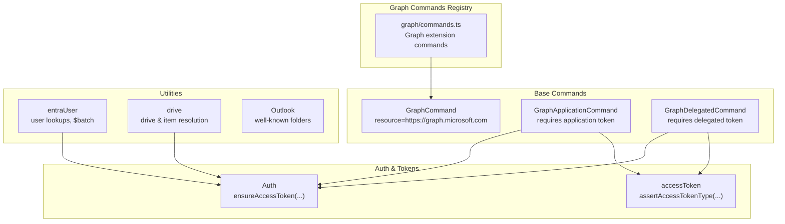
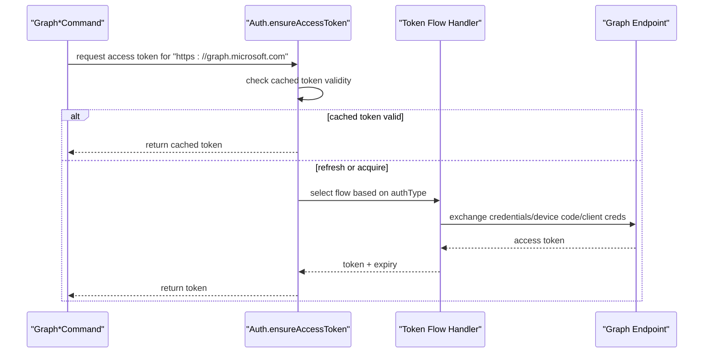
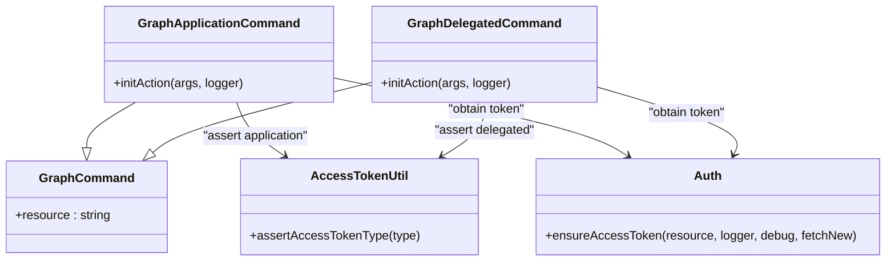
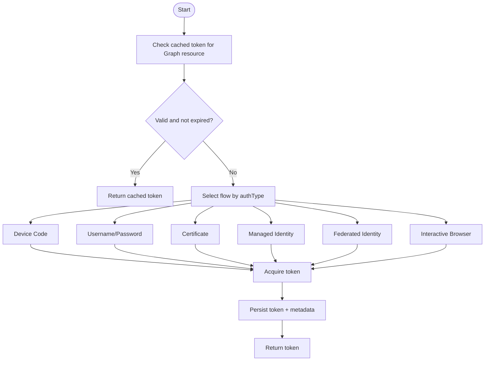
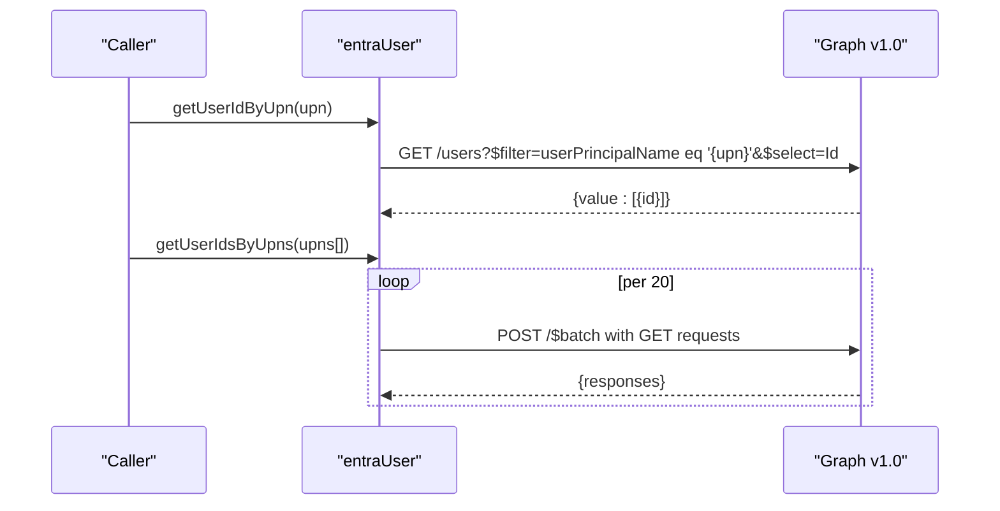
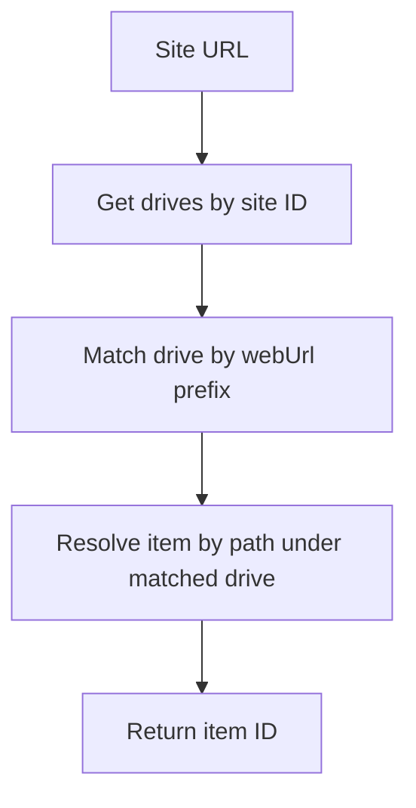
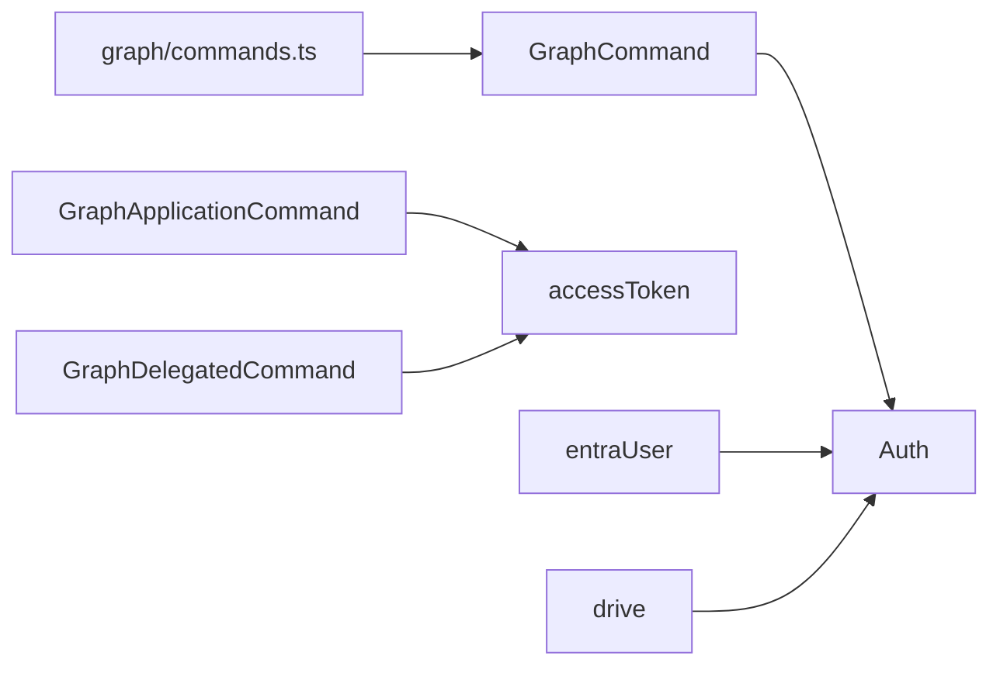

# Microsoft Graph Integration

<cite>
**Referenced Files in This Document**
- [GraphCommand.ts](file://src/m365/base/GraphCommand.ts)
- [GraphApplicationCommand.ts](file://src/m365/base/GraphApplicationCommand.ts)
- [GraphDelegatedCommand.ts](file://src/m365/base/GraphDelegatedCommand.ts)
- [Auth.ts](file://src/Auth.ts)
- [accessToken.ts](file://src/utils/accessToken.ts)
- [drive.ts](file://src/utils/drive.ts)
- [entraUser.ts](file://src/utils/entraUser.ts)
- [Outlook.ts](file://src/m365/outlook/Outlook.ts)
- [commands.ts](file://src/m365/graph/commands.ts)
</cite>

## Table of Contents
1. [Introduction](#introduction)
2. [Project Structure](#project-structure)
3. [Core Components](#core-components)
4. [Architecture Overview](#architecture-overview)
5. [Detailed Component Analysis](#detailed-component-analysis)
6. [Dependency Analysis](#dependency-analysis)
7. [Performance Considerations](#performance-considerations)
8. [Troubleshooting Guide](#troubleshooting-guide)
9. [Conclusion](#conclusion)
10. [Appendices](#appendices)

## Introduction
This document explains how the CLI for Microsoft 365 integrates with Microsoft Graph. It covers the Graph command architecture, authentication modes (application and delegated), and API integration patterns. It also documents Graph API versioning, endpoint usage, request/response handling, and practical operations for user management, groups, calendar, messages, and OneDrive/SharePoint file operations. Guidance is included on choosing between application and delegated authentication, permission requirements, token acquisition, query parameters, response transformations, complex operations like batch requests, and error handling strategies.

## Project Structure
The Graph integration spans several layers:
- Base command abstractions define the Graph resource and enforce authentication mode.
- Authentication and token management handle multiple auth flows and token caching.
- Utility modules encapsulate Graph API calls for specific resources (users, drive items).
- Graph-specific command registry enumerates Graph extension commands.

**Diagram sources**
- [GraphCommand.ts:1-7](file://src/m365/base/GraphCommand.ts#L1-L7)
- [GraphApplicationCommand.ts:1-21](file://src/m365/base/GraphApplicationCommand.ts#L1-L21)
- [GraphDelegatedCommand.ts:1-21](file://src/m365/base/GraphDelegatedCommand.ts#L1-L21)
- [Auth.ts:197-305](file://src/Auth.ts#L197-L305)
- [accessToken.ts:144-158](file://src/utils/accessToken.ts#L144-L158)
- [entraUser.ts:1-156](file://src/utils/entraUser.ts#L1-L156)
- [drive.ts:1-76](file://src/utils/drive.ts#L1-L76)
- [commands.ts:1-20](file://src/m365/graph/commands.ts#L1-L20)

**Section sources**
- [GraphCommand.ts:1-7](file://src/m365/base/GraphCommand.ts#L1-L7)
- [GraphApplicationCommand.ts:1-21](file://src/m365/base/GraphApplicationCommand.ts#L1-L21)
- [GraphDelegatedCommand.ts:1-21](file://src/m365/base/GraphDelegatedCommand.ts#L1-L21)
- [Auth.ts:197-305](file://src/Auth.ts#L197-L305)
- [accessToken.ts:144-158](file://src/utils/accessToken.ts#L144-L158)
- [entraUser.ts:1-156](file://src/utils/entraUser.ts#L1-L156)
- [drive.ts:1-76](file://src/utils/drive.ts#L1-L76)
- [commands.ts:1-20](file://src/m365/graph/commands.ts#L1-L20)

## Core Components
- GraphCommand: Defines the Microsoft Graph resource endpoint used by derived commands.
- GraphApplicationCommand: Enforces application-only authentication mode for commands requiring app-only tokens.
- GraphDelegatedCommand: Enforces delegated authentication mode for commands requiring user-consented permissions.
- Auth: Centralizes token acquisition across multiple flows (device code, username/password, certificate, identity, federated identity, browser).
- accessToken: Validates token type and extracts claims (tenant, user, scopes).
- entraUser: Utilities for resolving user identities via UPN/email and batch lookups.
- drive: Utilities for resolving SharePoint site drives and OneDrive/SharePoint drive items by URL.
- Outlook: Well-known folder names used in Outlook operations.
- graph/commands.ts: Enumerates Graph extension commands (schema extensions, subscriptions, changelog).

**Section sources**
- [GraphCommand.ts:1-7](file://src/m365/base/GraphCommand.ts#L1-L7)
- [GraphApplicationCommand.ts:1-21](file://src/m365/base/GraphApplicationCommand.ts#L1-L21)
- [GraphDelegatedCommand.ts:1-21](file://src/m365/base/GraphDelegatedCommand.ts#L1-L21)
- [Auth.ts:197-305](file://src/Auth.ts#L197-L305)
- [accessToken.ts:144-158](file://src/utils/accessToken.ts#L144-L158)
- [entraUser.ts:1-156](file://src/utils/entraUser.ts#L1-L156)
- [drive.ts:1-76](file://src/utils/drive.ts#L1-L76)
- [Outlook.ts:1-21](file://src/m365/outlook/Outlook.ts#L1-L21)
- [commands.ts:1-20](file://src/m365/graph/commands.ts#L1-L20)

## Architecture Overview
The Graph integration follows a layered pattern:
- Base command classes inherit from a shared GraphCommand and specialize into application or delegated variants.
- Commands initialize by asserting the correct token type and then rely on Auth.ensureAccessToken to obtain or reuse tokens.
- Utilities encapsulate Graph endpoint calls, often using the v1.0 endpoint and $batch for efficiency.
- Response handling uses JSON with metadata disabled for predictable payloads.

**Diagram sources**
- [GraphCommand.ts:4-6](file://src/m365/base/GraphCommand.ts#L4-L6)
- [GraphApplicationCommand.ts:19](file://src/m365/base/GraphApplicationCommand.ts#L19)
- [GraphDelegatedCommand.ts:19](file://src/m365/base/GraphDelegatedCommand.ts#L19)
- [Auth.ts:197-305](file://src/Auth.ts#L197-L305)

## Detailed Component Analysis

### Graph Command Architecture
- GraphCommand sets the default resource to the Microsoft Graph endpoint.
- GraphApplicationCommand enforces application-only tokens.
- GraphDelegatedCommand enforces delegated tokens.

**Diagram sources**
- [GraphCommand.ts:1-7](file://src/m365/base/GraphCommand.ts#L1-L7)
- [GraphApplicationCommand.ts:1-21](file://src/m365/base/GraphApplicationCommand.ts#L1-L21)
- [GraphDelegatedCommand.ts:1-21](file://src/m365/base/GraphDelegatedCommand.ts#L1-L21)
- [Auth.ts:197-305](file://src/Auth.ts#L197-L305)
- [accessToken.ts:144-158](file://src/utils/accessToken.ts#L144-L158)

**Section sources**
- [GraphCommand.ts:1-7](file://src/m365/base/GraphCommand.ts#L1-L7)
- [GraphApplicationCommand.ts:1-21](file://src/m365/base/GraphApplicationCommand.ts#L1-L21)
- [GraphDelegatedCommand.ts:1-21](file://src/m365/base/GraphDelegatedCommand.ts#L1-L21)
- [accessToken.ts:144-158](file://src/utils/accessToken.ts#L144-L158)

### Authentication Modes and Token Acquisition
- Application-only (app-only) tokens are required for GraphApplicationCommand and are validated via accessToken.assertAccessTokenType.
- Delegated tokens are required for GraphDelegatedCommand and similarly validated.
- Auth.ensureAccessToken supports multiple flows and caches tokens keyed by resource. It selects the appropriate acquisition method based on authType and availability of cached accounts.

**Diagram sources**
- [Auth.ts:197-305](file://src/Auth.ts#L197-L305)
- [Auth.ts:244-266](file://src/Auth.ts#L244-L266)
- [Auth.ts:440-452](file://src/Auth.ts#L440-L452)
- [Auth.ts:482-492](file://src/Auth.ts#L482-L492)
- [Auth.ts:494-568](file://src/Auth.ts#L494-L568)
- [Auth.ts:570-703](file://src/Auth.ts#L570-L703)
- [Auth.ts:705-761](file://src/Auth.ts#L705-L761)
- [Auth.ts:402-417](file://src/Auth.ts#L402-L417)

**Section sources**
- [GraphApplicationCommand.ts:19](file://src/m365/base/GraphApplicationCommand.ts#L19)
- [GraphDelegatedCommand.ts:19](file://src/m365/base/GraphDelegatedCommand.ts#L19)
- [Auth.ts:197-305](file://src/Auth.ts#L197-L305)
- [Auth.ts:244-266](file://src/Auth.ts#L244-L266)

### Graph API Versioning and Endpoint Usage
- Base resource is set to the Graph endpoint in GraphCommand.
- Utilities consistently target the v1.0 endpoint for deterministic behavior and compatibility.
- Batch requests are used for efficient user lookups.

Examples of endpoint usage:
- Drive resolution uses v1.0 sites/{id}/drives and drives/{id}/root.
- User lookups use v1.0 users with filters and $select.

**Section sources**
- [GraphCommand.ts:4-6](file://src/m365/base/GraphCommand.ts#L4-L6)
- [drive.ts:20-46](file://src/utils/drive.ts#L20-L46)
- [drive.ts:64-75](file://src/utils/drive.ts#L64-L75)
- [entraUser.ts:14-26](file://src/utils/entraUser.ts#L14-L26)
- [entraUser.ts:39-65](file://src/utils/entraUser.ts#L39-L65)
- [entraUser.ts:76-88](file://src/utils/entraUser.ts#L76-L88)
- [entraUser.ts:101-129](file://src/utils/entraUser.ts#L101-L129)

### Request/Response Handling Patterns
- Requests specify accept headers with metadata disabled for simpler payloads.
- Responses are parsed as JSON; errors are thrown when resources are not found.
- Batch responses include per-request status and body; non-200 statuses trigger errors.

**Section sources**
- [drive.ts:20-26](file://src/utils/drive.ts#L20-L26)
- [drive.ts:64-70](file://src/utils/drive.ts#L64-L70)
- [entraUser.ts:39-56](file://src/utils/entraUser.ts#L39-L56)
- [entraUser.ts:101-118](file://src/utils/entraUser.ts#L101-L118)

### User Management Operations
- Resolve user by UPN or email to obtain IDs.
- Batch lookup users by UPNs or emails using $batch.
- Retrieve UPN by user ID.

**Diagram sources**
- [entraUser.ts:12-27](file://src/utils/entraUser.ts#L12-L27)
- [entraUser.ts:34-68](file://src/utils/entraUser.ts#L34-L68)
- [entraUser.ts:74-89](file://src/utils/entraUser.ts#L74-L89)
- [entraUser.ts:96-129](file://src/utils/entraUser.ts#L96-L129)

**Section sources**
- [entraUser.ts:1-156](file://src/utils/entraUser.ts#L1-L156)

### Drive and File Operations
- Resolve a site drive by URL and then locate a drive item by path.
- Uses v1.0 endpoints and disables OData metadata in accept headers.

**Diagram sources**
- [drive.ts:15-47](file://src/utils/drive.ts#L15-L47)
- [drive.ts:57-75](file://src/utils/drive.ts#L57-L75)

**Section sources**
- [drive.ts:1-76](file://src/utils/drive.ts#L1-L76)

### Calendar and Message Operations
- Outlook well-known folder names are defined for convenience in calendar and mailbox operations.
- These constants help construct folder-aware queries against Exchange Online via Graph.

**Section sources**
- [Outlook.ts:1-21](file://src/m365/outlook/Outlook.ts#L1-L21)

### Graph Extension Commands
- The Graph command namespace includes changelog, directory extension, open extension, schema extension, and subscription commands.
- These commands are organized under the graph prefix and leverage the base GraphCommand infrastructure.

**Section sources**
- [commands.ts:1-20](file://src/m365/graph/commands.ts#L1-L20)

## Dependency Analysis
- Base commands depend on Auth for token acquisition and accessToken for token type assertions.
- Utilities depend on the request module and Auth for Graph endpoint access.
- Graph extension commands depend on the base GraphCommand abstraction.

**Diagram sources**
- [GraphCommand.ts:1-7](file://src/m365/base/GraphCommand.ts#L1-L7)
- [GraphApplicationCommand.ts:1-21](file://src/m365/base/GraphApplicationCommand.ts#L1-L21)
- [GraphDelegatedCommand.ts:1-21](file://src/m365/base/GraphDelegatedCommand.ts#L1-L21)
- [Auth.ts:197-305](file://src/Auth.ts#L197-L305)
- [accessToken.ts:144-158](file://src/utils/accessToken.ts#L144-L158)
- [entraUser.ts:1-156](file://src/utils/entraUser.ts#L1-L156)
- [drive.ts:1-76](file://src/utils/drive.ts#L1-L76)
- [commands.ts:1-20](file://src/m365/graph/commands.ts#L1-L20)

**Section sources**
- [GraphCommand.ts:1-7](file://src/m365/base/GraphCommand.ts#L1-L7)
- [GraphApplicationCommand.ts:1-21](file://src/m365/base/GraphApplicationCommand.ts#L1-L21)
- [GraphDelegatedCommand.ts:1-21](file://src/m365/base/GraphDelegatedCommand.ts#L1-L21)
- [Auth.ts:197-305](file://src/Auth.ts#L197-L305)
- [accessToken.ts:144-158](file://src/utils/accessToken.ts#L144-L158)
- [entraUser.ts:1-156](file://src/utils/entraUser.ts#L1-L156)
- [drive.ts:1-76](file://src/utils/drive.ts#L1-L76)
- [commands.ts:1-20](file://src/m365/graph/commands.ts#L1-L20)

## Performance Considerations
- Prefer batch requests for bulk user lookups to minimize round-trips.
- Reuse cached tokens when possible to avoid unnecessary token exchanges.
- Disable OData metadata in accept headers to reduce payload sizes.
- Use targeted $select clauses to limit response sizes.

[No sources needed since this section provides general guidance]

## Troubleshooting Guide
Common issues and resolutions:
- No access token found: Ensure the connection is active and the correct authType is configured.
- Wrong token type: Application-only vs delegated commands require matching token types; use the appropriate base command class.
- Resource not found: Utilities throw explicit errors when resources (e.g., drive, user) are not found; verify identifiers and permissions.
- Rate limiting: Implement retries with exponential backoff and respect server guidance when present.

**Section sources**
- [accessToken.ts:144-158](file://src/utils/accessToken.ts#L144-L158)
- [drive.ts:42-44](file://src/utils/drive.ts#L42-L44)
- [entraUser.ts:22-24](file://src/utils/entraUser.ts#L22-L24)
- [entraUser.ts:84-86](file://src/utils/entraUser.ts#L84-L86)

## Conclusion
The CLI’s Graph integration centers on robust authentication abstractions and reusable utilities. Application and delegated commands enforce proper token types, while Auth manages multiple acquisition flows and caching. Utilities encapsulate common Graph operations with deterministic v1.0 endpoints and batch capabilities. Following the guidance in this document will help you choose the right authentication mode, implement efficient requests, and handle errors gracefully.

[No sources needed since this section summarizes without analyzing specific files]

## Appendices

### Choosing Between Application and Delegated Authentication
- Use application-only when automating server-side tasks without a signed-in user context.
- Use delegated when acting on behalf of a user and needing consented permissions.
- Validate token type early in command initialization to fail fast with clear errors.

**Section sources**
- [GraphApplicationCommand.ts:19](file://src/m365/base/GraphApplicationCommand.ts#L19)
- [GraphDelegatedCommand.ts:19](file://src/m365/base/GraphDelegatedCommand.ts#L19)
- [accessToken.ts:144-158](file://src/utils/accessToken.ts#L144-L158)