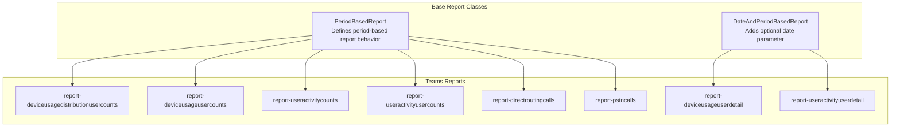
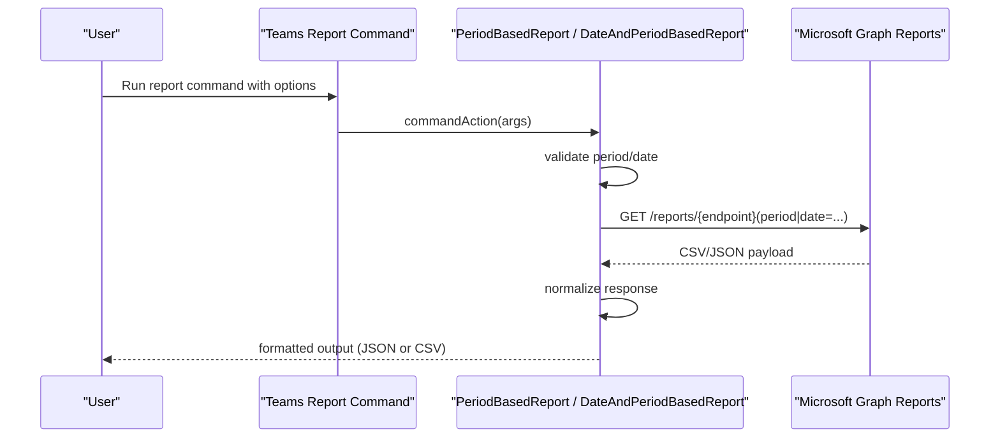
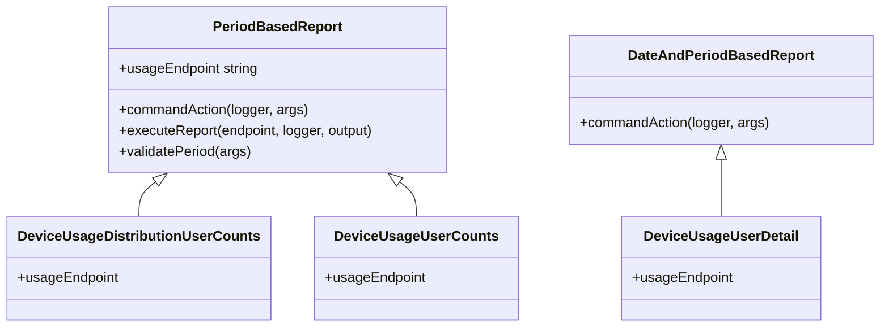
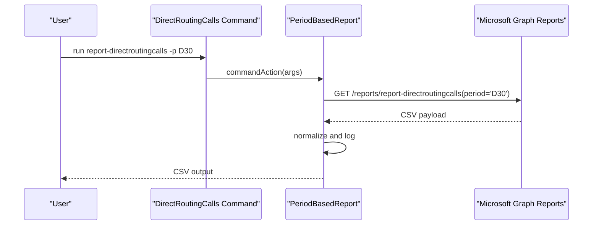
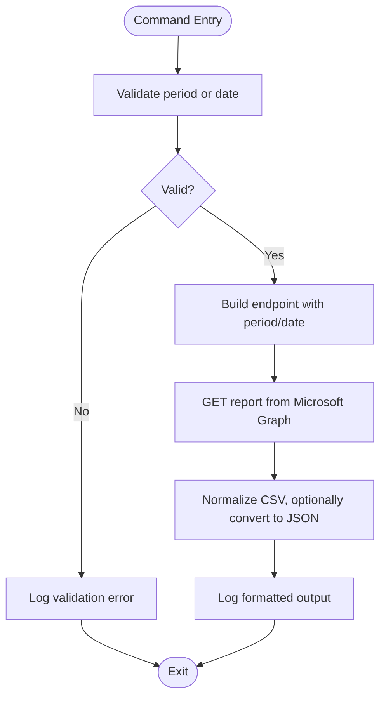
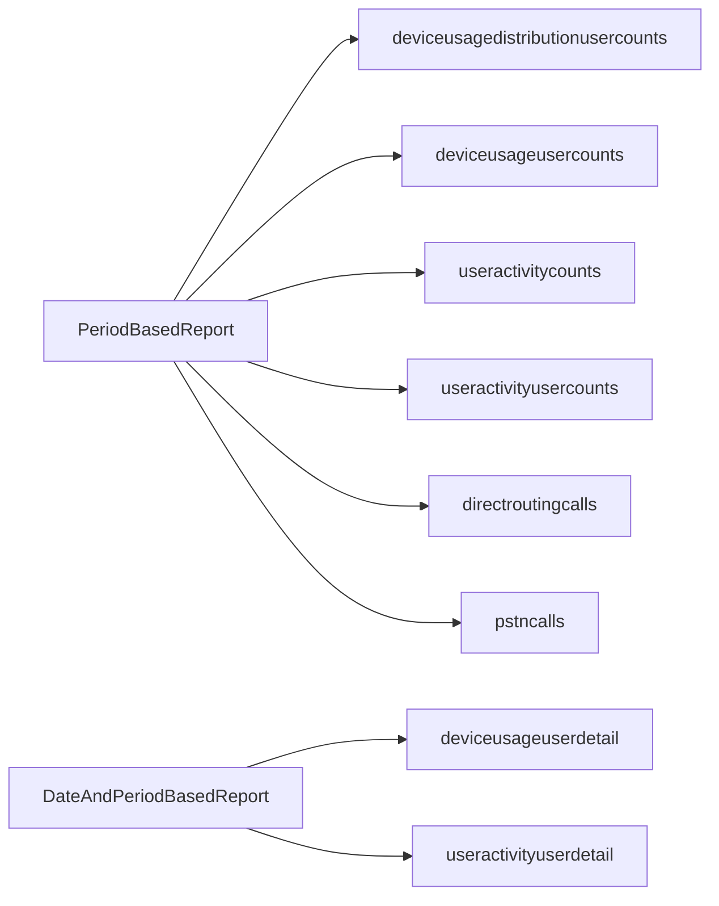

# Analytics and Reporting

<cite>
**Referenced Files in This Document**
- [PeriodBasedReport.ts](file://src/m365/base/PeriodBasedReport.ts)
- [DateAndPeriodBasedReport.ts](file://src/m365/base/DateAndPeriodBasedReport.ts)
- [report-deviceusagedistributionusercounts.ts](file://src/m365/teams/commands/report/report-deviceusagedistributionusercounts.ts)
- [report-deviceusageusercounts.ts](file://src/m365/teams/commands/report/report-deviceusageusercounts.ts)
- [report-deviceusageuserdetail.ts](file://src/m365/teams/commands/report/report-deviceusageuserdetail.ts)
- [report-directroutingcalls.ts](file://src/m365/teams/commands/report/report-directroutingcalls.ts)
- [report-pstncalls.ts](file://src/m365/teams/commands/report/report-pstncalls.ts)
- [report-useractivitycounts.ts](file://src/m365/teams/commands/report/report-useractivitycounts.ts)
- [report-useractivityusercounts.ts](file://src/m365/teams/commands/report/report-useractivityusercounts.ts)
- [report-useractivityuserdetail.ts](file://src/m365/teams/commands/report/report-useractivityuserdetail.ts)
</cite>

## Table of Contents
1. [Introduction](#introduction)
2. [Project Structure](#project-structure)
3. [Core Components](#core-components)
4. [Architecture Overview](#architecture-overview)
5. [Detailed Component Analysis](#detailed-component-analysis)
6. [Dependency Analysis](#dependency-analysis)
7. [Performance Considerations](#performance-considerations)
8. [Troubleshooting Guide](#troubleshooting-guide)
9. [Conclusion](#conclusion)
10. [Appendices](#appendices)

## Introduction
This document explains Microsoft Teams analytics and reporting commands available in the CLI. It focuses on:
- Device usage reports: distribution, daily unique users, and user-detail views
- Telephony metrics: direct routing calls and PSTN calls
- User activity reports: counts, user counts, and user-detail views

It also covers report data formats, aggregation levels, historical data availability, and practical guidance for automated reporting, dashboard integration, scheduling, data retention, and compliance considerations.

## Project Structure
Teams analytics commands follow a consistent pattern:
- Base report classes define shared behavior for fetching and formatting Microsoft Graph usage reports.
- Teams report commands inherit from these base classes and specify their report endpoint identifiers.
- Each command supports JSON or CSV output and validates period/date parameters.

**Diagram sources**
- [PeriodBasedReport.ts:15-47](file://src/m365/base/PeriodBasedReport.ts#L15-L47)
- [DateAndPeriodBasedReport.ts:15-68](file://src/m365/base/DateAndPeriodBasedReport.ts#L15-L68)
- [report-deviceusagedistributionusercounts.ts](file://src/m365/teams/commands/report/report-deviceusagedistributionusercounts.ts)
- [report-deviceusageusercounts.ts](file://src/m365/teams/commands/report/report-deviceusageusercounts.ts)
- [report-deviceusageuserdetail.ts](file://src/m365/teams/commands/report/report-deviceusageuserdetail.ts)
- [report-directroutingcalls.ts](file://src/m365/teams/commands/report/report-directroutingcalls.ts)
- [report-pstncalls.ts](file://src/m365/teams/commands/report/report-pstncalls.ts)
- [report-useractivitycounts.ts](file://src/m365/teams/commands/report/report-useractivitycounts.ts)
- [report-useractivityusercounts.ts](file://src/m365/teams/commands/report/report-useractivityusercounts.ts)
- [report-useractivityuserdetail.ts](file://src/m365/teams/commands/report/report-useractivityuserdetail.ts)

**Section sources**
- [PeriodBasedReport.ts:15-47](file://src/m365/base/PeriodBasedReport.ts#L15-L47)
- [DateAndPeriodBasedReport.ts:15-68](file://src/m365/base/DateAndPeriodBasedReport.ts#L15-L68)

## Core Components
- PeriodBasedReport: Provides a base for period-based reports with support for D7, D30, D90, D180 periods and JSON/CSV output.
- DateAndPeriodBasedReport: Extends the base to optionally accept a specific date instead of a period.
- Teams report commands: Inherit from the above to implement specific report endpoints for device usage, telephony, and user activity.

Key behaviors:
- Parameter validation ensures either period or date is provided (not both).
- Output formatting converts CSV to JSON when requested.
- Endpoint construction follows Microsoft Graph Reports conventions.

**Section sources**
- [PeriodBasedReport.ts:18-47](file://src/m365/base/PeriodBasedReport.ts#L18-L47)
- [DateAndPeriodBasedReport.ts:43-68](file://src/m365/base/DateAndPeriodBasedReport.ts#L43-L68)

## Architecture Overview
The Teams analytics commands share a common execution flow:
- Parse arguments (period vs date).
- Build the Microsoft Graph Reports endpoint URL.
- Execute HTTP GET request.
- Normalize response (remove empty lines, optionally convert CSV to JSON).
- Log output in requested format.

**Diagram sources**
- [PeriodBasedReport.ts:44-79](file://src/m365/base/PeriodBasedReport.ts#L44-L79)
- [DateAndPeriodBasedReport.ts:63-68](file://src/m365/base/DateAndPeriodBasedReport.ts#L63-L68)

## Detailed Component Analysis

### Device Usage Reports
These commands provide insights into device usage patterns for Microsoft Teams.

- report-deviceusagedistributionusercounts
  - Purpose: Unique users by device type distribution.
  - Aggregation level: Device type.
  - Historical data: Supported via period parameter (D7/D30/D90/D180).
  - Output: CSV or JSON.
  - Implementation: Inherits from PeriodBasedReport; sets usageEndpoint to the device usage distribution report.

- report-deviceusageusercounts
  - Purpose: Daily unique users by device type.
  - Aggregation level: Device type per day.
  - Historical data: Supported via period parameter.
  - Output: CSV or JSON.
  - Implementation: Inherits from PeriodBasedReport; sets usageEndpoint to the device usage user counts report.

- report-deviceusageuserdetail
  - Purpose: Per-user device usage details.
  - Aggregation level: Individual user.
  - Historical data: Supported via date parameter (YYYY-MM-DD) or period.
  - Output: CSV or JSON.
  - Implementation: Inherits from DateAndPeriodBasedReport; sets usageEndpoint to the device usage user detail report.

**Diagram sources**
- [PeriodBasedReport.ts:15-47](file://src/m365/base/PeriodBasedReport.ts#L15-L47)
- [DateAndPeriodBasedReport.ts:15-68](file://src/m365/base/DateAndPeriodBasedReport.ts#L15-L68)
- [report-deviceusagedistributionusercounts.ts](file://src/m365/teams/commands/report/report-deviceusagedistributionusercounts.ts)
- [report-deviceusageusercounts.ts](file://src/m365/teams/commands/report/report-deviceusageusercounts.ts)
- [report-deviceusageuserdetail.ts](file://src/m365/teams/commands/report/report-deviceusageuserdetail.ts)

**Section sources**
- [report-deviceusagedistributionusercounts.ts](file://src/m365/teams/commands/report/report-deviceusagedistributionusercounts.ts)
- [report-deviceusageusercounts.ts](file://src/m365/teams/commands/report/report-deviceusageusercounts.ts)
- [report-deviceusageuserdetail.ts](file://src/m365/teams/commands/report/report-deviceusageuserdetail.ts)

### Telephony Metrics Reports
These commands provide call analytics for telephony.

- report-directroutingcalls
  - Purpose: Details about direct routing calls within a given period.
  - Aggregation level: Calls.
  - Historical data: Supported via period parameter.
  - Output: CSV or JSON.
  - Implementation: Inherits from PeriodBasedReport; sets usageEndpoint to the direct routing calls report.

- report-pstncalls
  - Purpose: Details about PSTN calls within a given period.
  - Aggregation level: Calls.
  - Historical data: Supported via period parameter.
  - Output: CSV or JSON.
  - Implementation: Inherits from PeriodBasedReport; sets usageEndpoint to the PSTN calls report.

**Diagram sources**
- [report-directroutingcalls.ts](file://src/m365/teams/commands/report/report-directroutingcalls.ts)
- [PeriodBasedReport.ts:44-47](file://src/m365/base/PeriodBasedReport.ts#L44-L47)

**Section sources**
- [report-directroutingcalls.ts](file://src/m365/teams/commands/report/report-directroutingcalls.ts)
- [report-pstncalls.ts](file://src/m365/teams/commands/report/report-pstncalls.ts)

### User Activity Reports
These commands measure engagement and activity across Microsoft Teams.

- report-useractivitycounts
  - Purpose: Counts of activities by activity type.
  - Aggregation level: Activity type.
  - Historical data: Supported via period parameter.
  - Output: CSV or JSON.
  - Implementation: Inherits from PeriodBasedReport; sets usageEndpoint to the user activity counts report.

- report-useractivityusercounts
  - Purpose: Users by activity type.
  - Aggregation level: Activity type.
  - Historical data: Supported via period parameter.
  - Output: CSV or JSON.
  - Implementation: Inherits from PeriodBasedReport; sets usageEndpoint to the user activity user counts report.

- report-useractivityuserdetail
  - Purpose: Per-user activity details.
  - Aggregation level: Individual user.
  - Historical data: Supported via date parameter or period.
  - Output: CSV or JSON.
  - Implementation: Inherits from DateAndPeriodBasedReport; sets usageEndpoint to the user activity user detail report.

**Diagram sources**
- [DateAndPeriodBasedReport.ts:43-68](file://src/m365/base/DateAndPeriodBasedReport.ts#L43-L68)
- [PeriodBasedReport.ts:44-79](file://src/m365/base/PeriodBasedReport.ts#L44-L79)

**Section sources**
- [report-useractivitycounts.ts](file://src/m365/teams/commands/report/report-useractivitycounts.ts)
- [report-useractivityusercounts.ts](file://src/m365/teams/commands/report/report-useractivityusercounts.ts)
- [report-useractivityuserdetail.ts](file://src/m365/teams/commands/report/report-useractivityuserdetail.ts)

## Dependency Analysis
- All Teams analytics commands depend on base report classes for:
  - Option parsing (period/date)
  - Validation
  - Endpoint construction
  - Request execution and response normalization
- Commands are decoupled from specific report endpoints, enabling easy addition of new reports by setting the usageEndpoint property.

**Diagram sources**
- [PeriodBasedReport.ts:15-47](file://src/m365/base/PeriodBasedReport.ts#L15-L47)
- [DateAndPeriodBasedReport.ts:15-68](file://src/m365/base/DateAndPeriodBasedReport.ts#L15-L68)
- [report-deviceusagedistributionusercounts.ts](file://src/m365/teams/commands/report/report-deviceusagedistributionusercounts.ts)
- [report-deviceusageusercounts.ts](file://src/m365/teams/commands/report/report-deviceusageusercounts.ts)
- [report-deviceusageuserdetail.ts](file://src/m365/teams/commands/report/report-deviceusageuserdetail.ts)
- [report-directroutingcalls.ts](file://src/m365/teams/commands/report/report-directroutingcalls.ts)
- [report-pstncalls.ts](file://src/m365/teams/commands/report/report-pstncalls.ts)
- [report-useractivitycounts.ts](file://src/m365/teams/commands/report/report-useractivitycounts.ts)
- [report-useractivityusercounts.ts](file://src/m365/teams/commands/report/report-useractivityusercounts.ts)
- [report-useractivityuserdetail.ts](file://src/m365/teams/commands/report/report-useractivityuserdetail.ts)

**Section sources**
- [PeriodBasedReport.ts:15-47](file://src/m365/base/PeriodBasedReport.ts#L15-L47)
- [DateAndPeriodBasedReport.ts:15-68](file://src/m365/base/DateAndPeriodBasedReport.ts#L15-L68)

## Performance Considerations
- Output mode selection: Prefer CSV for large datasets to reduce client-side JSON conversion overhead; use JSON when downstream systems require structured objects.
- Period selection: Longer periods (D90, D180) increase payload size; use D7 or D30 for frequent automated runs to limit data volume.
- Pagination: Microsoft Graph Reports APIs may paginate; the base classes handle single-request responses. For very large datasets, consider splitting by date range.
- Network efficiency: Reuse authentication tokens and avoid redundant requests by batching queries where appropriate.

## Troubleshooting Guide
Common issues and resolutions:
- Invalid period value: Ensure the period is one of D7, D30, D90, D180.
- Missing or conflicting parameters: Specify either period or date, not both.
- Date format errors: When using date, follow YYYY-MM-DD format.
- Authentication failures: Verify the account has permissions to access Microsoft Graph Reports.
- Empty lines in CSV: The base classes strip empty lines; if output appears malformed, confirm the selected output format and validate the underlying CSV.

Operational tips:
- Use verbose logging to inspect the constructed endpoint URL.
- Test with a short period (D7) to validate the pipeline before scaling to longer windows.
- Store raw CSV for archival and derive JSON as needed for dashboards.

**Section sources**
- [PeriodBasedReport.ts:104-112](file://src/m365/base/PeriodBasedReport.ts#L104-L112)
- [DateAndPeriodBasedReport.ts:43-61](file://src/m365/base/DateAndPeriodBasedReport.ts#L43-L61)

## Conclusion
The Teams analytics commands leverage a robust base framework to deliver consistent, validated, and formatted report outputs. By understanding the base classes and report-specific endpoints, teams can implement reliable automated reporting, integrate with dashboards, and maintain compliance through careful parameterization and retention practices.

## Appendices

### Report Data Formats and Aggregation Levels
- Device usage distribution (report-deviceusagedistributionusercounts)
  - Format: CSV or JSON
  - Aggregation: Device type
  - Historical: Period-based (D7/D30/D90/D180)

- Device usage user counts (report-deviceusageusercounts)
  - Format: CSV or JSON
  - Aggregation: Device type per day
  - Historical: Period-based

- Device usage user detail (report-deviceusageuserdetail)
  - Format: CSV or JSON
  - Aggregation: Individual user
  - Historical: Date or period

- Direct routing calls (report-directroutingcalls)
  - Format: CSV or JSON
  - Aggregation: Calls
  - Historical: Period-based

- PSTN calls (report-pstncalls)
  - Format: CSV or JSON
  - Aggregation: Calls
  - Historical: Period-based

- User activity counts (report-useractivitycounts)
  - Format: CSV or JSON
  - Aggregation: Activity type
  - Historical: Period-based

- User activity user counts (report-useractivityusercounts)
  - Format: CSV or JSON
  - Aggregation: Activity type
  - Historical: Period-based

- User activity user detail (report-useractivityuserdetail)
  - Format: CSV or JSON
  - Aggregation: Individual user
  - Historical: Date or period

### Practical Examples
- Automated reporting
  - Schedule periodic runs with D7 for near-real-time dashboards.
  - Export to CSV for ingestion into BI tools; convert to JSON for APIs.
- Dashboard integration
  - Use JSON output for direct binding to charts.
  - Use CSV for ETL pipelines and data warehouses.
- Trend analysis
  - Compare D30 vs D7 to observe weekly trends.
  - Combine device usage and user activity to correlate engagement with platform usage.

### Scheduling, Retention, and Compliance
- Scheduling
  - Use cron or task schedulers to run commands at regular intervals.
  - Segment long periods (D90/D180) into weekly/monthly chunks for incremental processing.
- Data retention
  - Align retention policies with organizational requirements; archive raw CSV for compliance.
- Compliance
  - Restrict access to reports containing personal identifiable information (PII).
  - Apply data loss prevention (DLP) policies on stored artifacts.
  - Ensure logs and archives are encrypted at rest and in transit.