# Channel Management

<cite>
**Referenced Files in This Document**
- [channel-add.ts](file://src/m365/teams/commands/channel/channel-add.ts)
- [channel-get.ts](file://src/m365/teams/commands/channel/channel-get.ts)
- [channel-list.ts](file://src/m365/teams/commands/channel/channel-list.ts)
- [channel-remove.ts](file://src/m365/teams/commands/channel/channel-remove.ts)
- [channel-set.ts](file://src/m365/teams/commands/channel/channel-set.ts)
- [channel-member-add.ts](file://src/m365/teams/commands/channel/channel-member-add.ts)
- [channel-member-list.ts](file://src/m365/teams/commands/channel/channel-member-list.ts)
- [channel-member-remove.ts](file://src/m365/teams/commands/channel/channel-member-remove.ts)
- [channel-member-set.ts](file://src/m365/teams/commands/channel/channel-member-set.ts)
- [teams/commands.ts](file://src/m365/teams/commands.ts)
- [teams.ts](file://src/utils/teams.ts)
- [entraGroup.ts](file://src/utils/entraGroup.ts)
- [odata.ts](file://src/utils/odata.ts)
- [formatting.ts](file://src/utils/formatting.ts)
- [validation.ts](file://src/utils/validation.ts)
- [channel-add.mdx](file://docs/docs/cmd/teams/channel/channel-add.mdx)
- [channel-get.mdx](file://docs/docs/cmd/teams/channel/channel-get.mdx)
- [channel-list.mdx](file://docs/docs/cmd/teams/channel/channel-list.mdx)
- [channel-member-add.mdx](file://docs/docs/cmd/teams/channel/channel-member-add.mdx)
- [channel-member-list.mdx](file://docs/docs/cmd/teams/channel/channel-member-list.mdx)
- [channel-member-remove.mdx](file://docs/docs/cmd/teams/channel/channel-member-remove.mdx)
- [channel-member-set.mdx](file://docs/docs/cmd/teams/channel/channel-member-set.mdx)
</cite>

## Table of Contents
1. [Introduction](#introduction)
2. [Project Structure](#project-structure)
3. [Core Components](#core-components)
4. [Architecture Overview](#architecture-overview)
5. [Detailed Component Analysis](#detailed-component-analysis)
6. [Dependency Analysis](#dependency-analysis)
7. [Performance Considerations](#performance-considerations)
8. [Troubleshooting Guide](#troubleshooting-guide)
9. [Conclusion](#conclusion)
10. [Appendices](#appendices)

## Introduction
This document explains Microsoft Teams channel management through the CLI’s channel commands. It covers channel lifecycle operations (create, get, list, update, delete), channel membership management (add, list, update, remove), and operational guidance for automation, permissions, roles, and integration with team membership. Practical examples illustrate provisioning automation, member workflows, and organizational strategies.

## Project Structure
The channel management commands are implemented under the Teams module. Each command encapsulates a single operation and follows a consistent pattern: option parsing, validation, Graph API calls, and standardized output/logging.

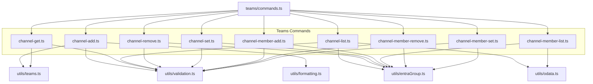

**Diagram sources**
- [teams/commands.ts:1-80](file://src/m365/teams/commands.ts#L1-L80)
- [channel-add.ts:1-152](file://src/m365/teams/commands/channel/channel-add.ts#L1-L152)
- [channel-get.ts:1-123](file://src/m365/teams/commands/channel/channel-get.ts#L1-L123)
- [channel-list.ts:1-121](file://src/m365/teams/commands/channel/channel-list.ts#L1-L121)
- [channel-remove.ts:1-180](file://src/m365/teams/commands/channel/channel-remove.ts#L1-L180)
- [channel-set.ts:1-183](file://src/m365/teams/commands/channel/channel-set.ts#L1-L183)
- [channel-member-add.ts:1-231](file://src/m365/teams/commands/channel/channel-member-add.ts#L1-L231)
- [channel-member-list.ts:1-174](file://src/m365/teams/commands/channel/channel-member-list.ts#L1-L174)
- [channel-member-remove.ts:1-252](file://src/m365/teams/commands/channel/channel-member-remove.ts#L1-L252)
- [channel-member-set.ts:1-236](file://src/m365/teams/commands/channel/channel-member-set.ts#L1-L236)
- [teams.ts](file://src/utils/teams.ts)
- [entraGroup.ts](file://src/utils/entraGroup.ts)
- [odata.ts](file://src/utils/odata.ts)
- [formatting.ts](file://src/utils/formatting.ts)
- [validation.ts](file://src/utils/validation.ts)

**Section sources**
- [teams/commands.ts:1-80](file://src/m365/teams/commands.ts#L1-L80)

## Core Components
- Channel lifecycle commands:
  - Add channel: [channel-add.ts:1-152](file://src/m365/teams/commands/channel/channel-add.ts#L1-L152)
  - Get channel: [channel-get.ts:1-123](file://src/m365/teams/commands/channel/channel-get.ts#L1-L123)
  - List channels: [channel-list.ts:1-121](file://src/m365/teams/commands/channel/channel-list.ts#L1-L121)
  - Update channel: [channel-set.ts:1-183](file://src/m365/teams/commands/channel/channel-set.ts#L1-L183)
  - Remove channel: [channel-remove.ts:1-180](file://src/m365/teams/commands/channel/channel-remove.ts#L1-L180)
- Channel membership commands:
  - Add member(s): [channel-member-add.ts:1-231](file://src/m365/teams/commands/channel/channel-member-add.ts#L1-L231)
  - List members: [channel-member-list.ts:1-174](file://src/m365/teams/commands/channel/channel-member-list.ts#L1-L174)
  - Update member role: [channel-member-set.ts:1-236](file://src/m365/teams/commands/channel/channel-member-set.ts#L1-L236)
  - Remove member: [channel-member-remove.ts:1-252](file://src/m365/teams/commands/channel/channel-member-remove.ts#L1-L252)

Key shared utilities:
- Teams helpers: [teams.ts](file://src/utils/teams.ts)
- Group resolution: [entraGroup.ts](file://src/utils/entraGroup.ts)
- OData pagination: [odata.ts](file://src/utils/odata.ts)
- Formatting and encoding: [formatting.ts](file://src/utils/formatting.ts)
- Validation helpers: [validation.ts](file://src/utils/validation.ts)

**Section sources**
- [channel-add.ts:1-152](file://src/m365/teams/commands/channel/channel-add.ts#L1-L152)
- [channel-get.ts:1-123](file://src/m365/teams/commands/channel/channel-get.ts#L1-L123)
- [channel-list.ts:1-121](file://src/m365/teams/commands/channel/channel-list.ts#L1-L121)
- [channel-remove.ts:1-180](file://src/m365/teams/commands/channel/channel-remove.ts#L1-L180)
- [channel-set.ts:1-183](file://src/m365/teams/commands/channel/channel-set.ts#L1-L183)
- [channel-member-add.ts:1-231](file://src/m365/teams/commands/channel/channel-member-add.ts#L1-L231)
- [channel-member-list.ts:1-174](file://src/m365/teams/commands/channel/channel-member-list.ts#L1-L174)
- [channel-member-remove.ts:1-252](file://src/m365/teams/commands/channel/channel-member-remove.ts#L1-L252)
- [channel-member-set.ts:1-236](file://src/m365/teams/commands/channel/channel-member-set.ts#L1-L236)
- [teams.ts](file://src/utils/teams.ts)
- [entraGroup.ts](file://src/utils/entraGroup.ts)
- [odata.ts](file://src/utils/odata.ts)
- [formatting.ts](file://src/utils/formatting.ts)
- [validation.ts](file://src/utils/validation.ts)

## Architecture Overview
Each command inherits from a base Graph command and performs:
- Option initialization and validation
- Team/channel/team member resolution via utilities
- Graph API requests (GET, POST, PATCH, DELETE)
- Logging and error handling

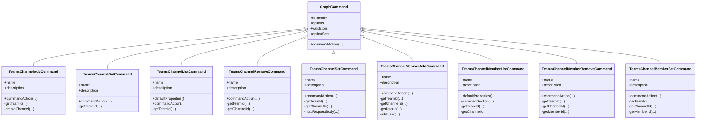

**Diagram sources**
- [channel-add.ts:22-152](file://src/m365/teams/commands/channel/channel-add.ts#L22-L152)
- [channel-get.ts:22-123](file://src/m365/teams/commands/channel/channel-get.ts#L22-L123)
- [channel-list.ts:24-121](file://src/m365/teams/commands/channel/channel-list.ts#L24-L121)
- [channel-remove.ts:28-180](file://src/m365/teams/commands/channel/channel-remove.ts#L28-L180)
- [channel-set.ts:28-183](file://src/m365/teams/commands/channel/channel-set.ts#L28-L183)
- [channel-member-add.ts:30-231](file://src/m365/teams/commands/channel/channel-member-add.ts#L30-L231)
- [channel-member-list.ts:28-174](file://src/m365/teams/commands/channel/channel-member-list.ts#L28-L174)
- [channel-member-remove.ts:36-252](file://src/m365/teams/commands/channel/channel-member-remove.ts#L36-L252)
- [channel-member-set.ts:36-236](file://src/m365/teams/commands/channel/channel-member-set.ts#L36-L236)

## Detailed Component Analysis

### Channel Lifecycle Commands

#### Channel Add
Purpose: Create a channel in a team. Supports standard, private, and shared channel types. Private/shared channels require an initial owner.

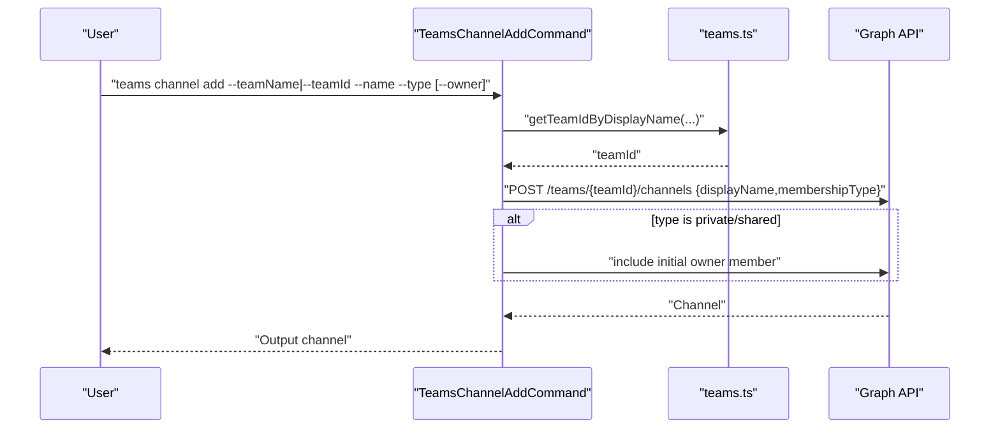

**Diagram sources**
- [channel-add.ts:104-149](file://src/m365/teams/commands/channel/channel-add.ts#L104-L149)
- [teams.ts](file://src/utils/teams.ts)

Key behaviors:
- Validates type and ownership constraints
- Resolves team by ID or display name
- Creates channel with membership type and optional owner

**Section sources**
- [channel-add.ts:1-152](file://src/m365/teams/commands/channel/channel-add.ts#L1-L152)

#### Channel Get
Purpose: Retrieve a specific channel by ID, name, or primary channel.

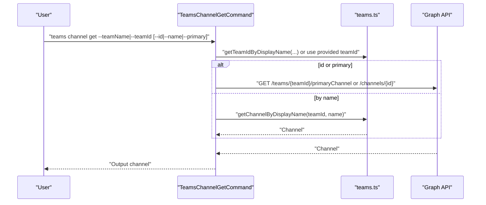

**Diagram sources**
- [channel-get.ts:95-120](file://src/m365/teams/commands/channel/channel-get.ts#L95-L120)
- [teams.ts](file://src/utils/teams.ts)

**Section sources**
- [channel-get.ts:1-123](file://src/m365/teams/commands/channel/channel-get.ts#L1-L123)

#### Channel List
Purpose: Enumerate channels in a team, optionally filtered by membership type.

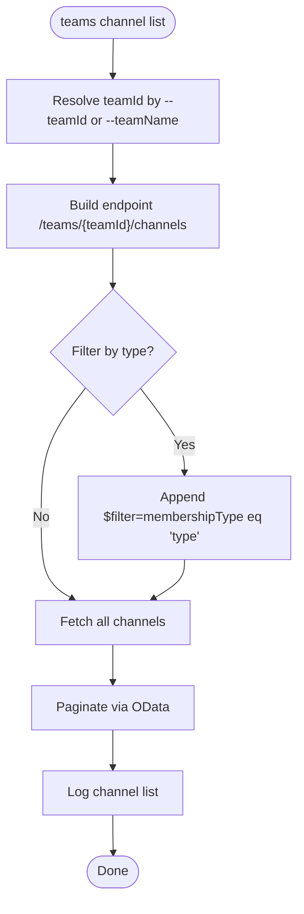

**Diagram sources**
- [channel-list.ts:103-118](file://src/m365/teams/commands/channel/channel-list.ts#L103-L118)
- [odata.ts](file://src/utils/odata.ts)

**Section sources**
- [channel-list.ts:1-121](file://src/m365/teams/commands/channel/channel-list.ts#L1-L121)

#### Channel Set
Purpose: Update channel properties (display name and description). General channel cannot be updated.

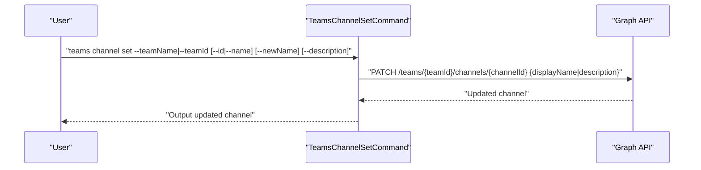

**Diagram sources**
- [channel-set.ts:108-128](file://src/m365/teams/commands/channel/channel-set.ts#L108-L128)

**Section sources**
- [channel-set.ts:1-183](file://src/m365/teams/commands/channel/channel-set.ts#L1-L183)

#### Channel Remove
Purpose: Delete a channel after confirming with the user or using force.

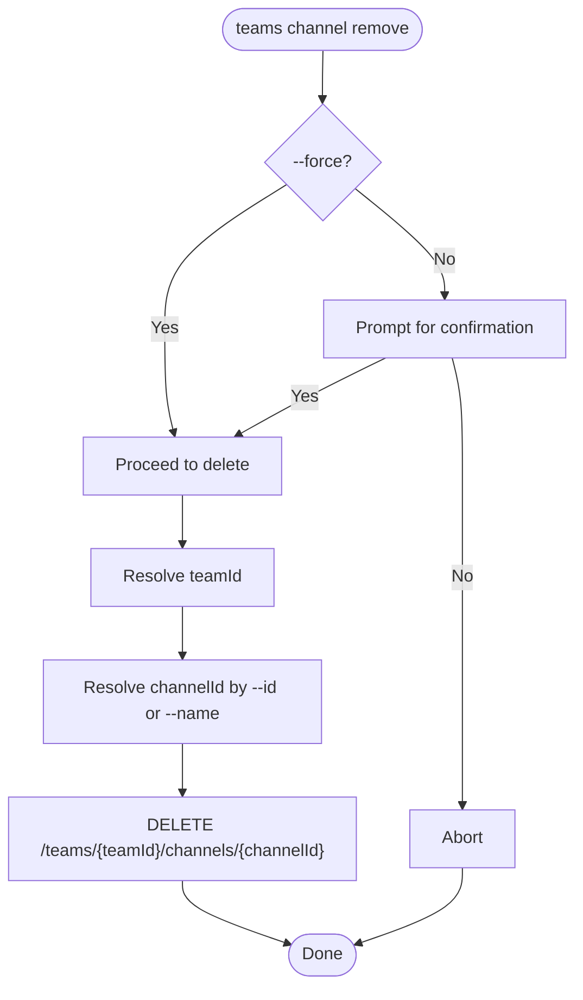

**Diagram sources**
- [channel-remove.ts:103-139](file://src/m365/teams/commands/channel/channel-remove.ts#L103-L139)

**Section sources**
- [channel-remove.ts:1-180](file://src/m365/teams/commands/channel/channel-remove.ts#L1-L180)

### Channel Membership Commands

#### Member Add
Purpose: Add one or more members to a private or shared channel. Optionally promote to owner.

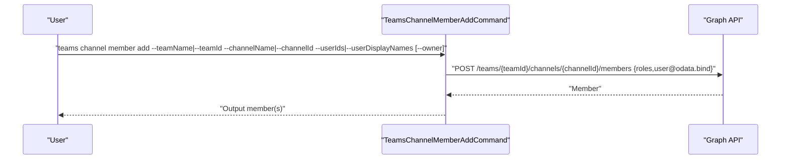

**Diagram sources**
- [channel-member-add.ts:112-130](file://src/m365/teams/commands/channel/channel-member-add.ts#L112-L130)
- [channel-member-add.ts:132-148](file://src/m365/teams/commands/channel/channel-member-add.ts#L132-L148)

Constraints:
- Works only on private channels
- Accepts either user IDs or display names (with resolution)

**Section sources**
- [channel-member-add.ts:1-231](file://src/m365/teams/commands/channel/channel-member-add.ts#L1-L231)

#### Member List
Purpose: List members of a channel, optionally filtered by role.

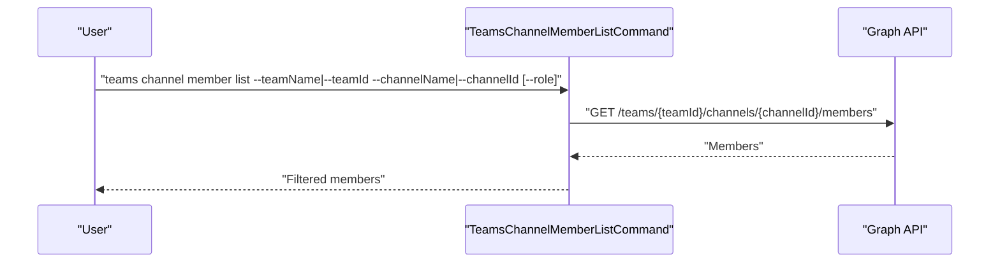

**Diagram sources**
- [channel-member-list.ts:114-135](file://src/m365/teams/commands/channel/channel-member-list.ts#L114-L135)

**Section sources**
- [channel-member-list.ts:1-174](file://src/m365/teams/commands/channel/channel-member-list.ts#L1-L174)

#### Member Set
Purpose: Change a member’s role to owner or member in a private/shared channel.

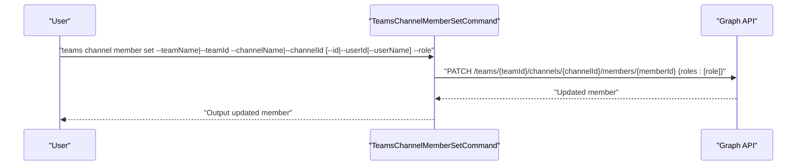

**Diagram sources**
- [channel-member-set.ts:133-157](file://src/m365/teams/commands/channel/channel-member-set.ts#L133-L157)

**Section sources**
- [channel-member-set.ts:1-236](file://src/m365/teams/commands/channel/channel-member-set.ts#L1-L236)

#### Member Remove
Purpose: Remove a member from a private or shared channel.

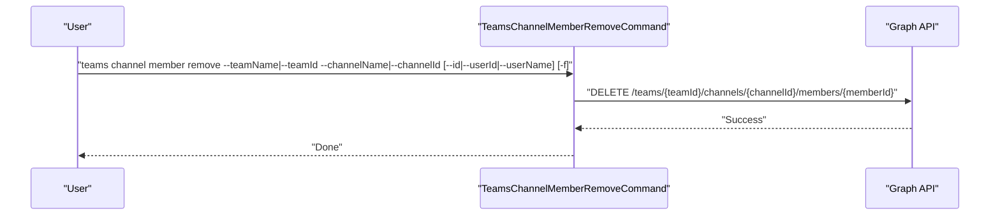

**Diagram sources**
- [channel-member-remove.ts:157-174](file://src/m365/teams/commands/channel/channel-member-remove.ts#L157-L174)

**Section sources**
- [channel-member-remove.ts:1-252](file://src/m365/teams/commands/channel/channel-member-remove.ts#L1-L252)

## Dependency Analysis
- Command-to-utility dependencies:
  - Channel commands depend on teams and entraGroup for team/channel/member resolution
  - odata for paginated listing
  - formatting for URL encoding and result shaping
  - validation for input sanitization
- Cohesion and coupling:
  - Each command focuses on a single responsibility
  - Utilities are reused across commands to minimize duplication
  - No circular dependencies observed among channel commands

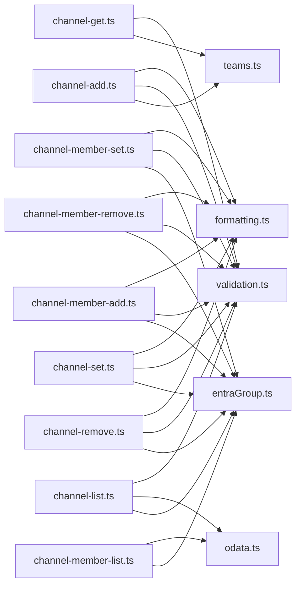

**Diagram sources**
- [channel-add.ts:1-152](file://src/m365/teams/commands/channel/channel-add.ts#L1-L152)
- [channel-get.ts:1-123](file://src/m365/teams/commands/channel/channel-get.ts#L1-L123)
- [channel-list.ts:1-121](file://src/m365/teams/commands/channel/channel-list.ts#L1-L121)
- [channel-remove.ts:1-180](file://src/m365/teams/commands/channel/channel-remove.ts#L1-L180)
- [channel-set.ts:1-183](file://src/m365/teams/commands/channel/channel-set.ts#L1-L183)
- [channel-member-add.ts:1-231](file://src/m365/teams/commands/channel/channel-member-add.ts#L1-L231)
- [channel-member-list.ts:1-174](file://src/m365/teams/commands/channel/channel-member-list.ts#L1-L174)
- [channel-member-remove.ts:1-252](file://src/m365/teams/commands/channel/channel-member-remove.ts#L1-L252)
- [channel-member-set.ts:1-236](file://src/m365/teams/commands/channel/channel-member-set.ts#L1-L236)
- [teams.ts](file://src/utils/teams.ts)
- [entraGroup.ts](file://src/utils/entraGroup.ts)
- [odata.ts](file://src/utils/odata.ts)
- [formatting.ts](file://src/utils/formatting.ts)
- [validation.ts](file://src/utils/validation.ts)

**Section sources**
- [channel-add.ts:1-152](file://src/m365/teams/commands/channel/channel-add.ts#L1-L152)
- [channel-get.ts:1-123](file://src/m365/teams/commands/channel/channel-get.ts#L1-L123)
- [channel-list.ts:1-121](file://src/m365/teams/commands/channel/channel-list.ts#L1-L121)
- [channel-remove.ts:1-180](file://src/m365/teams/commands/channel/channel-remove.ts#L1-L180)
- [channel-set.ts:1-183](file://src/m365/teams/commands/channel/channel-set.ts#L1-L183)
- [channel-member-add.ts:1-231](file://src/m365/teams/commands/channel/channel-member-add.ts#L1-L231)
- [channel-member-list.ts:1-174](file://src/m365/teams/commands/channel/channel-member-list.ts#L1-L174)
- [channel-member-remove.ts:1-252](file://src/m365/teams/commands/channel/channel-member-remove.ts#L1-L252)
- [channel-member-set.ts:1-236](file://src/m365/teams/commands/channel/channel-member-set.ts#L1-L236)

## Performance Considerations
- Batch operations:
  - Member add supports multiple user IDs and dispatches concurrent requests per user
- Pagination:
  - Listing channels uses OData pagination to handle large lists efficiently
- Minimal payload:
  - Update operations only send changed fields
- Encoding:
  - URLs are encoded to avoid query errors in Graph endpoints

[No sources needed since this section provides general guidance]

## Troubleshooting Guide
Common issues and resolutions:
- Invalid identifiers:
  - Team ID must be a valid GUID; channel ID must be a valid Teams channel ID
- Type and ownership constraints:
  - Private/shared channels require an owner during creation
  - Member operations are restricted to private channels
- Existence checks:
  - Channel or member must exist before update/remove
- Confirmation prompts:
  - Removal commands require explicit confirmation unless forced

Operational tips:
- Use verbose logging to see request details
- Prefer filtering by ID for deterministic operations
- When resolving ambiguous user names, the system may prompt for selection

**Section sources**
- [channel-add.ts:76-98](file://src/m365/teams/commands/channel/channel-add.ts#L76-L98)
- [channel-member-add.ts:183-185](file://src/m365/teams/commands/channel/channel-member-add.ts#L183-L185)
- [channel-member-remove.ts:210-212](file://src/m365/teams/commands/channel/channel-member-remove.ts#L210-L212)
- [channel-member-set.ts:193-195](file://src/m365/teams/commands/channel/channel-member-set.ts#L193-L195)

## Conclusion
The channel management commands provide a robust, consistent interface to automate Teams channel provisioning and membership workflows. By leveraging shared utilities and adhering to strict validation and error handling, these commands support scalable administration across organizations.

[No sources needed since this section summarizes without analyzing specific files]

## Appendices

### Practical Examples

- Provisioning automation
  - Create a private channel with an initial owner:
    - [channel-add.mdx](file://docs/docs/cmd/teams/channel/channel-add.mdx)
  - List channels by type to inventory:
    - [channel-list.mdx](file://docs/docs/cmd/teams/channel/channel-list.mdx)

- Member management workflows
  - Add multiple members to a private channel:
    - [channel-member-add.mdx](file://docs/docs/cmd/teams/channel/channel-member-add.mdx)
  - Promote a member to owner:
    - [channel-member-set.mdx](file://docs/docs/cmd/teams/channel/channel-member-set.mdx)
  - Remove a member:
    - [channel-member-remove.mdx](file://docs/docs/cmd/teams/channel/channel-member-remove.mdx)
  - List members by role:
    - [channel-member-list.mdx](file://docs/docs/cmd/teams/channel/channel-member-list.mdx)

- Channel organization strategies
  - Rename or update description for non-General channels:
    - [channel-set.mdx](file://docs/docs/cmd/teams/channel/channel-set.mdx)
  - Remove unused channels:
    - [channel-remove.mdx](file://docs/docs/cmd/teams/channel/channel-remove.mdx)

- Permissions, roles, and access control
  - Private/shared channels require owner during creation:
    - [channel-add.ts:87-93](file://src/m365/teams/commands/channel/channel-add.ts#L87-L93)
  - Member operations apply only to private channels:
    - [channel-member-add.ts:183-185](file://src/m365/teams/commands/channel/channel-member-add.ts#L183-L185)
    - [channel-member-remove.ts:210-212](file://src/m365/teams/commands/channel/channel-member-remove.ts#L210-L212)
    - [channel-member-set.ts:193-195](file://src/m365/teams/commands/channel/channel-member-set.ts#L193-L195)
  - Roles supported for members:
    - Owner and Member (Guest is not settable via this command)

- Integration with team membership and collaboration
  - Team existence verified via group provisioning options:
    - [channel-list.ts:95-98](file://src/m365/teams/commands/channel/channel-list.ts#L95-L98)
    - [channel-remove.ts:146-150](file://src/m365/teams/commands/channel/channel-remove.ts#L146-L150)
    - [channel-set.ts:149-153](file://src/m365/teams/commands/channel/channel-set.ts#L149-L153)
    - [channel-member-add.ts:155-158](file://src/m365/teams/commands/channel/channel-member-add.ts#L155-L158)
    - [channel-member-list.ts:142-147](file://src/m365/teams/commands/channel/channel-member-list.ts#L142-L147)
    - [channel-member-remove.ts:181-187](file://src/m365/teams/commands/channel/channel-member-remove.ts#L181-L187)
    - [channel-member-set.ts:164-169](file://src/m365/teams/commands/channel/channel-member-set.ts#L164-L169)

**Section sources**
- [channel-add.mdx](file://docs/docs/cmd/teams/channel/channel-add.mdx)
- [channel-list.mdx](file://docs/docs/cmd/teams/channel/channel-list.mdx)
- [channel-member-add.mdx](file://docs/docs/cmd/teams/channel/channel-member-add.mdx)
- [channel-member-list.mdx](file://docs/docs/cmd/teams/channel/channel-member-list.mdx)
- [channel-member-remove.mdx](file://docs/docs/cmd/teams/channel/channel-member-remove.mdx)
- [channel-member-set.mdx](file://docs/docs/cmd/teams/channel/channel-member-set.mdx)
- [channel-set.mdx](file://docs/docs/cmd/teams/channel/channel-set.mdx)
- [channel-remove.mdx](file://docs/docs/cmd/teams/channel/channel-remove.mdx)
- [channel-add.ts:87-93](file://src/m365/teams/commands/channel/channel-add.ts#L87-L93)
- [channel-member-add.ts:183-185](file://src/m365/teams/commands/channel/channel-member-add.ts#L183-L185)
- [channel-member-remove.ts:210-212](file://src/m365/teams/commands/channel/channel-member-remove.ts#L210-L212)
- [channel-member-set.ts:193-195](file://src/m365/teams/commands/channel/channel-member-set.ts#L193-L195)
- [channel-list.ts:95-98](file://src/m365/teams/commands/channel/channel-list.ts#L95-L98)
- [channel-remove.ts:146-150](file://src/m365/teams/commands/channel/channel-remove.ts#L146-L150)
- [channel-set.ts:149-153](file://src/m365/teams/commands/channel/channel-set.ts#L149-L153)
- [channel-member-add.ts:155-158](file://src/m365/teams/commands/channel/channel-member-add.ts#L155-L158)
- [channel-member-list.ts:142-147](file://src/m365/teams/commands/channel/channel-member-list.ts#L142-L147)
- [channel-member-remove.ts:181-187](file://src/m365/teams/commands/channel/channel-member-remove.ts#L181-L187)
- [channel-member-set.ts:164-169](file://src/m365/teams/commands/channel/channel-member-set.ts#L164-L169)