# Chat and Message Management

<cite>
**Referenced Files in This Document**
- [commands.ts](file://src/m365/teams/commands.ts)
- [chat-get.mdx](file://docs/docs/cmd/teams/chat/chat-get.mdx)
- [chat-list.mdx](file://docs/docs/cmd/teams/chat/chat-list.mdx)
- [chat-member-add.mdx](file://docs/docs/cmd/teams/chat/chat-member-add.mdx)
- [chat-member-remove.mdx](file://docs/docs/cmd/teams/chat/chat-member-remove.mdx)
- [chat-member-list.mdx](file://docs/docs/cmd/teams/chat/chat-member-list.mdx)
- [chat-message-list.mdx](file://docs/docs/cmd/teams/chat/chat-message-list.mdx)
- [chat-message-send.mdx](file://docs/docs/cmd/teams/chat/chat-message-send.mdx)
- [message-get.mdx](file://docs/docs/cmd/teams/message/message-get.mdx)
- [message-list.mdx](file://docs/docs/cmd/teams/message/message-list.mdx)
- [message-remove.mdx](file://docs/docs/cmd/teams/message/message-remove.mdx)
- [message-reply-list.mdx](file://docs/docs/cmd/teams/message/message-reply-list.mdx)
- [message-restore.mdx](file://docs/docs/cmd/teams/message/message-restore.mdx)
- [message-send.mdx](file://docs/docs/cmd/teams/message/message-send.mdx)
</cite>

## Table of Contents
1. [Introduction](#introduction)
2. [Project Structure](#project-structure)
3. [Core Components](#core-components)
4. [Architecture Overview](#architecture-overview)
5. [Detailed Component Analysis](#detailed-component-analysis)
6. [Dependency Analysis](#dependency-analysis)
7. [Performance Considerations](#performance-considerations)
8. [Troubleshooting Guide](#troubleshooting-guide)
9. [Conclusion](#conclusion)
10. [Appendices](#appendices)

## Introduction
This document explains Microsoft Teams chat and message management capabilities exposed via the CLI. It covers:
- Chat thread operations: listing chats, retrieving a specific chat, and managing chat members
- Member management: adding, removing, and listing members with role and history visibility controls
- Message operations: listing and sending chat messages, and managing channel messages (get, list, send, remove, restore, reply list)
- Permissions, retention, and compliance considerations
- Practical automation scenarios: automated moderation, message archiving, and analytics
- Rich content and reactions in Teams conversations

## Project Structure
The Teams command surface is organized under a dedicated module with constants enumerating available commands. The documentation for each command is provided in MDX files under the Teams documentation tree.

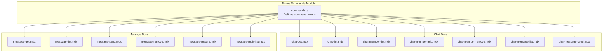

**Diagram sources**
- [commands.ts:1-80](file://src/m365/teams/commands.ts#L1-L80)
- [chat-get.mdx:1-130](file://docs/docs/cmd/teams/chat/chat-get.mdx#L1-L130)
- [chat-list.mdx:1-115](file://docs/docs/cmd/teams/chat/chat-list.mdx#L1-L115)
- [chat-member-list.mdx:1-92](file://docs/docs/cmd/teams/chat/chat-member-list.mdx#L1-L92)
- [chat-member-add.mdx:1-67](file://docs/docs/cmd/teams/chat/chat-member-add.mdx#L1-L67)
- [chat-member-remove.mdx:1-57](file://docs/docs/cmd/teams/chat/chat-member-remove.mdx#L1-L57)
- [chat-message-list.mdx:1-149](file://docs/docs/cmd/teams/chat/chat-message-list.mdx#L1-L149)
- [chat-message-send.mdx:1-86](file://docs/docs/cmd/teams/chat/chat-message-send.mdx#L1-L86)
- [message-get.mdx:1-157](file://docs/docs/cmd/teams/message/message-get.mdx#L1-L157)
- [message-list.mdx:1-147](file://docs/docs/cmd/teams/message/message-list.mdx#L1-L147)
- [message-send.mdx:1-133](file://docs/docs/cmd/teams/message/message-send.mdx#L1-L133)
- [message-remove.mdx:1-65](file://docs/docs/cmd/teams/message/message-remove.mdx#L1-L65)
- [message-restore.mdx:1-63](file://docs/docs/cmd/teams/message/message-restore.mdx#L1-L63)
- [message-reply-list.mdx:1-141](file://docs/docs/cmd/teams/message/message-reply-list.mdx#L1-L141)

**Section sources**
- [commands.ts:1-80](file://src/m365/teams/commands.ts#L1-L80)

## Core Components
- Chat retrieval and listing: Get a chat by id/name/participants; list chats with optional filtering by type and user context
- Chat member management: Add/remove/list members with roles and chat history visibility
- Chat message operations: List chat messages and send chat messages (including creation of new chats)
- Channel message operations: Retrieve, list, send, remove, restore, and list replies to channel messages
- Permissions and constraints: Delegated vs application permissions, ownership constraints for removal/restore, and visibility of chat members/messages

Key command tokens:
- Chat: get, list, member add, member list, member remove, chat message list, chat message send
- Message (channel): get, list, send, remove, restore, reply list

**Section sources**
- [commands.ts:22-47](file://src/m365/teams/commands.ts#L22-L47)
- [chat-get.mdx:15-26](file://docs/docs/cmd/teams/chat/chat-get.mdx#L15-L26)
- [chat-list.mdx:15-26](file://docs/docs/cmd/teams/chat/chat-list.mdx#L15-L26)
- [chat-member-add.mdx:15-33](file://docs/docs/cmd/teams/chat/chat-member-add.mdx#L15-L33)
- [chat-member-remove.mdx:15-30](file://docs/docs/cmd/teams/chat/chat-member-remove.mdx#L15-L30)
- [chat-member-list.mdx:15-20](file://docs/docs/cmd/teams/chat/chat-member-list.mdx#L15-L20)
- [chat-message-list.mdx:15-24](file://docs/docs/cmd/teams/chat/chat-message-list.mdx#L15-L24)
- [chat-message-send.mdx:15-32](file://docs/docs/cmd/teams/chat/chat-message-send.mdx#L15-L32)
- [message-get.mdx:15-26](file://docs/docs/cmd/teams/message/message-get.mdx#L15-L26)
- [message-list.mdx:15-26](file://docs/docs/cmd/teams/message/message-list.mdx#L15-L26)
- [message-send.mdx:15-26](file://docs/docs/cmd/teams/message/message-send.mdx#L15-L26)
- [message-remove.mdx:15-33](file://docs/docs/cmd/teams/message/message-remove.mdx#L15-L33)
- [message-restore.mdx:15-32](file://docs/docs/cmd/teams/message/message-restore.mdx#L15-L32)
- [message-reply-list.mdx:15-26](file://docs/docs/cmd/teams/message/message-reply-list.mdx#L15-L26)

## Architecture Overview
The CLI exposes Teams chat and message operations through documented commands. Each command maps to a specific Microsoft Graph endpoint or Teams resource operation. Permissions differ by operation and authentication mode (delegated vs application). Responses are returned in JSON, text, CSV, or Markdown formats as supported by the command.

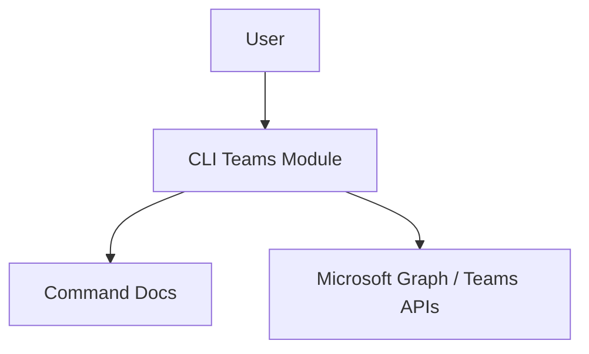

[No sources needed since this diagram shows conceptual workflow, not actual code structure]

## Detailed Component Analysis

### Chat Retrieval and Listing
- teams chat get: Retrieve a chat by id, name, or participants; output excludes members and messages
- teams chat list: List chats for the current or specified user; filter by chat type

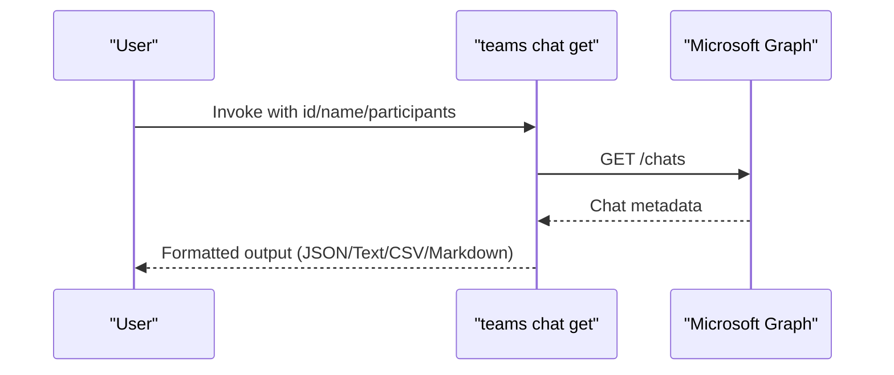

**Diagram sources**
- [chat-get.mdx:9-13](file://docs/docs/cmd/teams/chat/chat-get.mdx#L9-L13)
- [chat-get.mdx:61-129](file://docs/docs/cmd/teams/chat/chat-get.mdx#L61-L129)

**Section sources**
- [chat-get.mdx:9-13](file://docs/docs/cmd/teams/chat/chat-get.mdx#L9-L13)
- [chat-get.mdx:15-26](file://docs/docs/cmd/teams/chat/chat-get.mdx#L15-L26)
- [chat-get.mdx:30-34](file://docs/docs/cmd/teams/chat/chat-get.mdx#L30-L34)
- [chat-get.mdx:35-59](file://docs/docs/cmd/teams/chat/chat-get.mdx#L35-L59)
- [chat-get.mdx:61-129](file://docs/docs/cmd/teams/chat/chat-get.mdx#L61-L129)

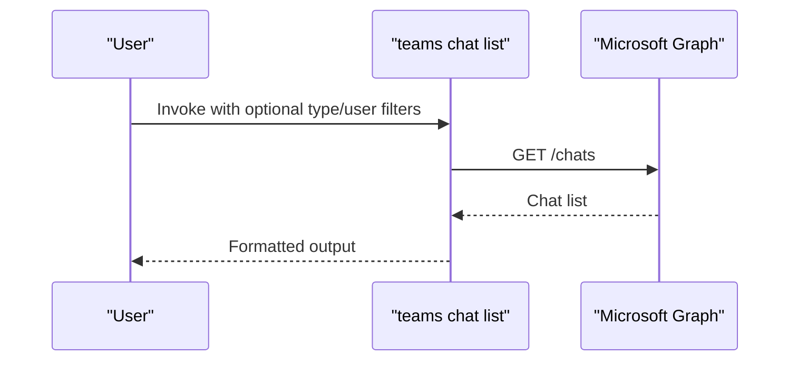

**Diagram sources**
- [chat-list.mdx:9-13](file://docs/docs/cmd/teams/chat/chat-list.mdx#L9-L13)
- [chat-list.mdx:15-26](file://docs/docs/cmd/teams/chat/chat-list.mdx#L15-L26)
- [chat-list.mdx:30-48](file://docs/docs/cmd/teams/chat/chat-list.mdx#L30-L48)

**Section sources**
- [chat-list.mdx:9-13](file://docs/docs/cmd/teams/chat/chat-list.mdx#L9-L13)
- [chat-list.mdx:15-26](file://docs/docs/cmd/teams/chat/chat-list.mdx#L15-L26)
- [chat-list.mdx:30-48](file://docs/docs/cmd/teams/chat/chat-list.mdx#L30-L48)

### Chat Member Management
- teams chat member add: Add a member with role and history visibility options
- teams chat member remove: Remove a member by id, user id, or user name
- teams chat member list: List members and their roles/history visibility

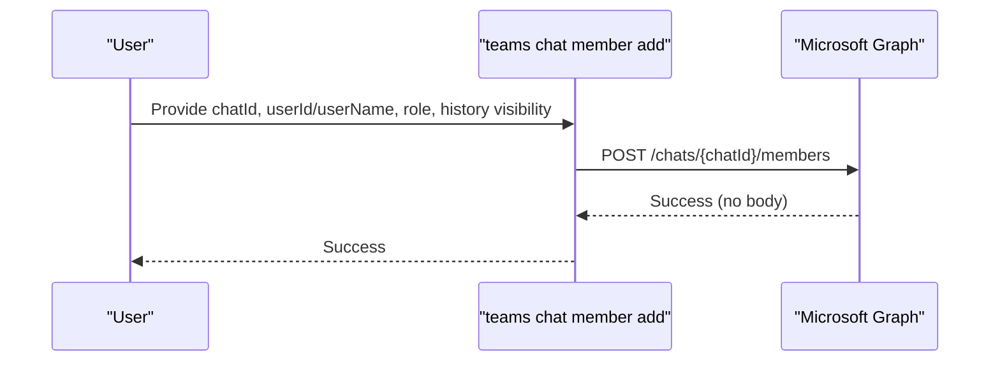

**Diagram sources**
- [chat-member-add.mdx:7-11](file://docs/docs/cmd/teams/chat/chat-member-add.mdx#L7-L11)
- [chat-member-add.mdx:15-33](file://docs/docs/cmd/teams/chat/chat-member-add.mdx#L15-L33)
- [chat-member-add.mdx:37-43](file://docs/docs/cmd/teams/chat/chat-member-add.mdx#L37-L43)
- [chat-member-add.mdx:44-62](file://docs/docs/cmd/teams/chat/chat-member-add.mdx#L44-L62)

**Section sources**
- [chat-member-add.mdx:7-11](file://docs/docs/cmd/teams/chat/chat-member-add.mdx#L7-L11)
- [chat-member-add.mdx:15-33](file://docs/docs/cmd/teams/chat/chat-member-add.mdx#L15-L33)
- [chat-member-add.mdx:37-43](file://docs/docs/cmd/teams/chat/chat-member-add.mdx#L37-L43)

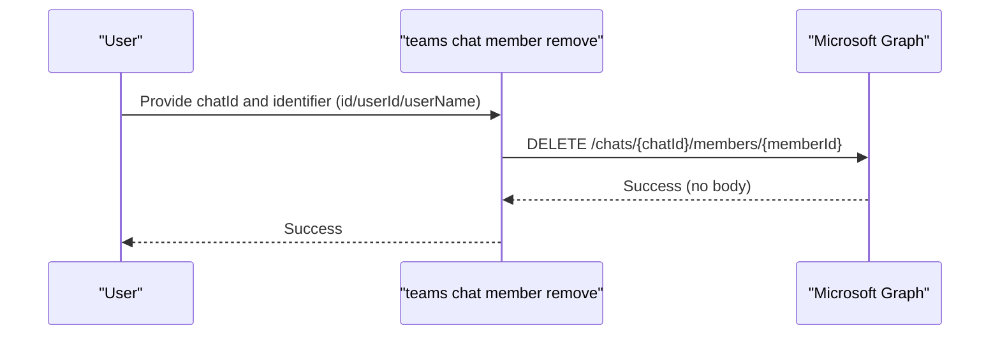

**Diagram sources**
- [chat-member-remove.mdx:7-11](file://docs/docs/cmd/teams/chat/chat-member-remove.mdx#L7-L11)
- [chat-member-remove.mdx:15-30](file://docs/docs/cmd/teams/chat/chat-member-remove.mdx#L15-L30)
- [chat-member-remove.mdx:34-52](file://docs/docs/cmd/teams/chat/chat-member-remove.mdx#L34-L52)

**Section sources**
- [chat-member-remove.mdx:7-11](file://docs/docs/cmd/teams/chat/chat-member-remove.mdx#L7-L11)
- [chat-member-remove.mdx:15-30](file://docs/docs/cmd/teams/chat/chat-member-remove.mdx#L15-L30)
- [chat-member-remove.mdx:34-52](file://docs/docs/cmd/teams/chat/chat-member-remove.mdx#L34-L52)

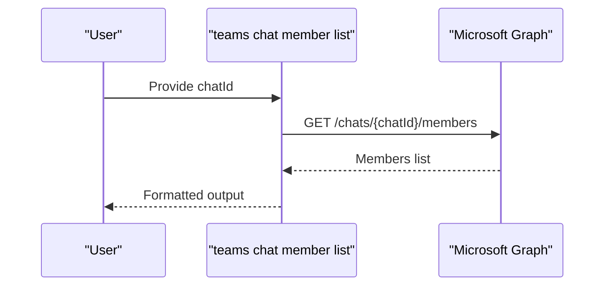

**Diagram sources**
- [chat-member-list.mdx:9-13](file://docs/docs/cmd/teams/chat/chat-member-list.mdx#L9-L13)
- [chat-member-list.mdx:15-20](file://docs/docs/cmd/teams/chat/chat-member-list.mdx#L15-L20)
- [chat-member-list.mdx:24-30](file://docs/docs/cmd/teams/chat/chat-member-list.mdx#L24-L30)

**Section sources**
- [chat-member-list.mdx:9-13](file://docs/docs/cmd/teams/chat/chat-member-list.mdx#L9-L13)
- [chat-member-list.mdx:15-20](file://docs/docs/cmd/teams/chat/chat-member-list.mdx#L15-L20)
- [chat-member-list.mdx:24-30](file://docs/docs/cmd/teams/chat/chat-member-list.mdx#L24-L30)

### Chat Message Operations
- teams chat message list: List messages in a chat with optional end time filter
- teams chat message send: Send a message to a chat by id/name/participants; creates a new chat if none exists

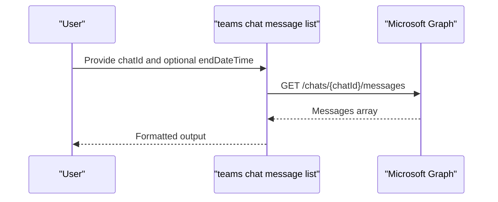

**Diagram sources**
- [chat-message-list.mdx:9-13](file://docs/docs/cmd/teams/chat/chat-message-list.mdx#L9-L13)
- [chat-message-list.mdx:15-24](file://docs/docs/cmd/teams/chat/chat-message-list.mdx#L15-L24)
- [chat-message-list.mdx:46-58](file://docs/docs/cmd/teams/chat/chat-message-list.mdx#L46-L58)

**Section sources**
- [chat-message-list.mdx:9-13](file://docs/docs/cmd/teams/chat/chat-message-list.mdx#L9-L13)
- [chat-message-list.mdx:15-24](file://docs/docs/cmd/teams/chat/chat-message-list.mdx#L15-L24)
- [chat-message-list.mdx:27-44](file://docs/docs/cmd/teams/chat/chat-message-list.mdx#L27-L44)
- [chat-message-list.mdx:46-58](file://docs/docs/cmd/teams/chat/chat-message-list.mdx#L46-L58)

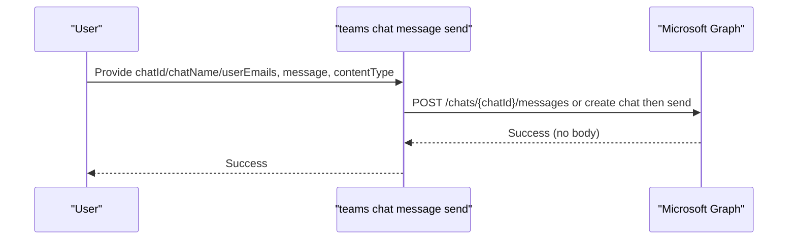

**Diagram sources**
- [chat-message-send.mdx:9-13](file://docs/docs/cmd/teams/chat/chat-message-send.mdx#L9-L13)
- [chat-message-send.mdx:15-32](file://docs/docs/cmd/teams/chat/chat-message-send.mdx#L15-L32)
- [chat-message-send.mdx:36-39](file://docs/docs/cmd/teams/chat/chat-message-send.mdx#L36-L39)
- [chat-message-send.mdx:57-81](file://docs/docs/cmd/teams/chat/chat-message-send.mdx#L57-L81)

**Section sources**
- [chat-message-send.mdx:9-13](file://docs/docs/cmd/teams/chat/chat-message-send.mdx#L9-L13)
- [chat-message-send.mdx:15-32](file://docs/docs/cmd/teams/chat/chat-message-send.mdx#L15-L32)
- [chat-message-send.mdx:36-39](file://docs/docs/cmd/teams/chat/chat-message-send.mdx#L36-L39)
- [chat-message-send.mdx:40-56](file://docs/docs/cmd/teams/chat/chat-message-send.mdx#L40-L56)
- [chat-message-send.mdx:57-81](file://docs/docs/cmd/teams/chat/chat-message-send.mdx#L57-L81)

### Channel Message Operations
- teams message get: Retrieve a specific channel message
- teams message list: List channel messages with optional delta filter
- teams message send: Send a message to a channel
- teams message remove: Remove a message (self-created only, delegated permissions)
- teams message restore: Restore a deleted message (self-created only, delegated permissions)
- teams message reply list: List replies to a specific message

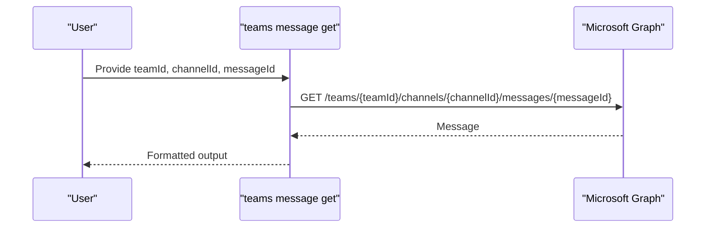

**Diagram sources**
- [message-get.mdx:9-13](file://docs/docs/cmd/teams/message/message-get.mdx#L9-L13)
- [message-get.mdx:15-26](file://docs/docs/cmd/teams/message/message-get.mdx#L15-L26)
- [message-get.mdx:34-40](file://docs/docs/cmd/teams/message/message-get.mdx#L34-L40)

**Section sources**
- [message-get.mdx:9-13](file://docs/docs/cmd/teams/message/message-get.mdx#L9-L13)
- [message-get.mdx:15-26](file://docs/docs/cmd/teams/message/message-get.mdx#L15-L26)
- [message-get.mdx:30-33](file://docs/docs/cmd/teams/message/message-get.mdx#L30-L33)

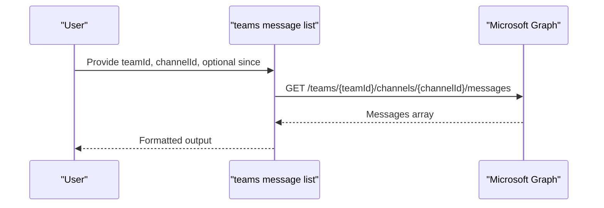

**Diagram sources**
- [message-list.mdx:9-13](file://docs/docs/cmd/teams/message/message-list.mdx#L9-L13)
- [message-list.mdx:15-26](file://docs/docs/cmd/teams/message/message-list.mdx#L15-L26)
- [message-list.mdx:34-46](file://docs/docs/cmd/teams/message/message-list.mdx#L34-L46)

**Section sources**
- [message-list.mdx:9-13](file://docs/docs/cmd/teams/message/message-list.mdx#L9-L13)
- [message-list.mdx:15-26](file://docs/docs/cmd/teams/message/message-list.mdx#L15-L26)
- [message-list.mdx:30-33](file://docs/docs/cmd/teams/message/message-list.mdx#L30-L33)

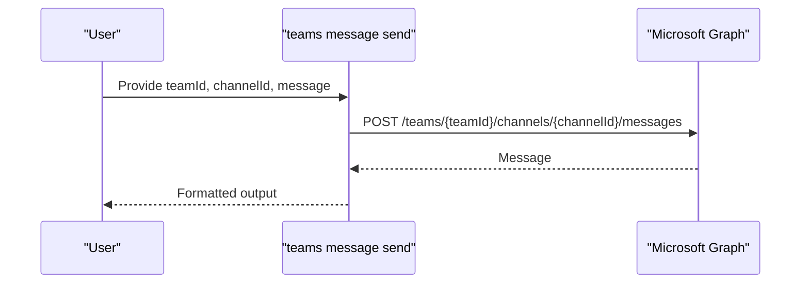

**Diagram sources**
- [message-send.mdx:9-13](file://docs/docs/cmd/teams/message/message-send.mdx#L9-L13)
- [message-send.mdx:15-26](file://docs/docs/cmd/teams/message/message-send.mdx#L15-L26)
- [message-send.mdx:30-33](file://docs/docs/cmd/teams/message/message-send.mdx#L30-L33)

**Section sources**
- [message-send.mdx:9-13](file://docs/docs/cmd/teams/message/message-send.mdx#L9-L13)
- [message-send.mdx:15-26](file://docs/docs/cmd/teams/message/message-send.mdx#L15-L26)
- [message-send.mdx:30-33](file://docs/docs/cmd/teams/message/message-send.mdx#L30-L33)

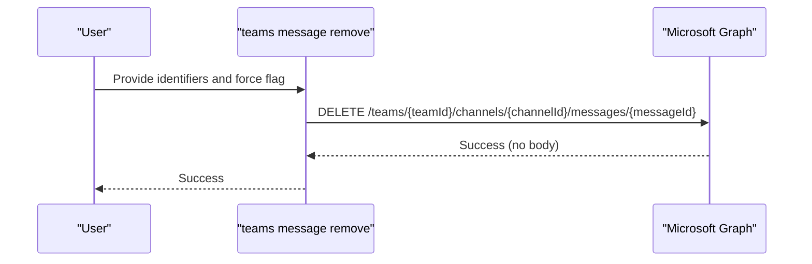

**Diagram sources**
- [message-remove.mdx:9-11](file://docs/docs/cmd/teams/message/message-remove.mdx#L9-L11)
- [message-remove.mdx:15-33](file://docs/docs/cmd/teams/message/message-remove.mdx#L15-L33)
- [message-remove.mdx:37-47](file://docs/docs/cmd/teams/message/message-remove.mdx#L37-L47)

**Section sources**
- [message-remove.mdx:9-11](file://docs/docs/cmd/teams/message/message-remove.mdx#L9-L11)
- [message-remove.mdx:15-33](file://docs/docs/cmd/teams/message/message-remove.mdx#L15-L33)
- [message-remove.mdx:37-47](file://docs/docs/cmd/teams/message/message-remove.mdx#L37-L47)

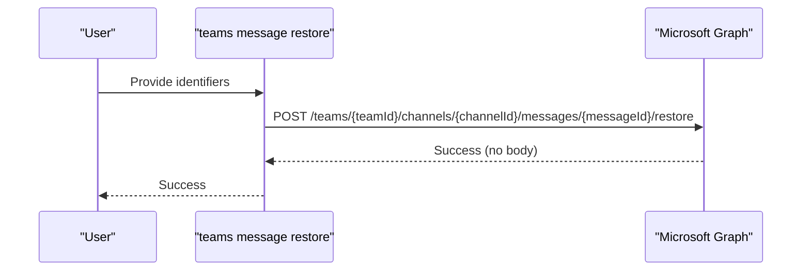

**Diagram sources**
- [message-restore.mdx:9-13](file://docs/docs/cmd/teams/message/message-restore.mdx#L9-L13)
- [message-restore.mdx:15-32](file://docs/docs/cmd/teams/message/message-restore.mdx#L15-L32)
- [message-restore.mdx:36-44](file://docs/docs/cmd/teams/message/message-restore.mdx#L36-L44)

**Section sources**
- [message-restore.mdx:9-13](file://docs/docs/cmd/teams/message/message-restore.mdx#L9-L13)
- [message-restore.mdx:15-32](file://docs/docs/cmd/teams/message/message-restore.mdx#L15-L32)
- [message-restore.mdx:36-44](file://docs/docs/cmd/teams/message/message-restore.mdx#L36-L44)

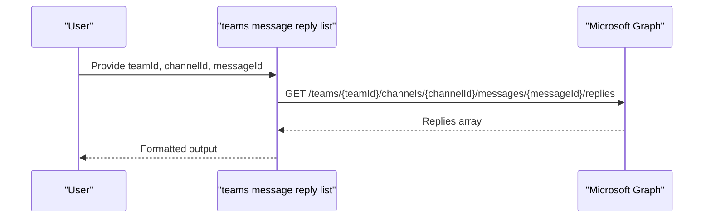

**Diagram sources**
- [message-reply-list.mdx:9-13](file://docs/docs/cmd/teams/message/message-reply-list.mdx#L9-L13)
- [message-reply-list.mdx:15-26](file://docs/docs/cmd/teams/message/message-reply-list.mdx#L15-L26)
- [message-reply-list.mdx:34-40](file://docs/docs/cmd/teams/message/message-reply-list.mdx#L34-L40)

**Section sources**
- [message-reply-list.mdx:9-13](file://docs/docs/cmd/teams/message/message-reply-list.mdx#L9-L13)
- [message-reply-list.mdx:15-26](file://docs/docs/cmd/teams/message/message-reply-list.mdx#L15-L26)
- [message-reply-list.mdx:30-33](file://docs/docs/cmd/teams/message/message-reply-list.mdx#L30-L33)

### Permissions, Retention, and Compliance
- Chat message list requires ChatMessage.Read (delegated) or ChatMessage.Read.All (application)
- Chat message send supports delegated permissions with Chat.Read and ChatMessage.Send; application permissions are not supported
- Channel message remove and restore require delegated permissions and apply only to messages created by the caller
- Channel message list supports delta queries within the last 8 months when using the since parameter

**Section sources**
- [chat-message-list.mdx:27-44](file://docs/docs/cmd/teams/chat/chat-message-list.mdx#L27-L44)
- [chat-message-send.mdx:40-55](file://docs/docs/cmd/teams/chat/chat-message-send.mdx#L40-L55)
- [message-remove.mdx:37-47](file://docs/docs/cmd/teams/message/message-remove.mdx#L37-L47)
- [message-restore.mdx:36-44](file://docs/docs/cmd/teams/message/message-restore.mdx#L36-L44)
- [message-list.mdx:24-26](file://docs/docs/cmd/teams/message/message-list.mdx#L24-L26)

### Rich Content, Reactions, and Threading
- Messages include body content (text/html), attachments, mentions, reactions, and channel identity
- Replies are supported for channel messages; chat message replies are managed via the chat message send operation with appropriate thread targeting
- Reactions and mentions are part of message payloads and can be inspected via list/get operations

**Section sources**
- [chat-message-list.mdx:65-104](file://docs/docs/cmd/teams/chat/chat-message-list.mdx#L65-L104)
- [message-list.mdx:53-95](file://docs/docs/cmd/teams/message/message-list.mdx#L53-L95)
- [message-get.mdx:47-87](file://docs/docs/cmd/teams/message/message-get.mdx#L47-L87)

## Dependency Analysis
The Teams command module centralizes command tokens, while each command’s behavior and constraints are defined in its respective MDX documentation. The CLI orchestrates requests to Microsoft Graph endpoints behind each command.

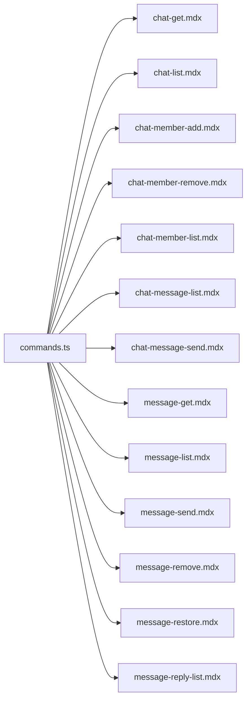

**Diagram sources**
- [commands.ts:1-80](file://src/m365/teams/commands.ts#L1-L80)
- [chat-get.mdx:1-130](file://docs/docs/cmd/teams/chat/chat-get.mdx#L1-L130)
- [chat-list.mdx:1-115](file://docs/docs/cmd/teams/chat/chat-list.mdx#L1-L115)
- [chat-member-add.mdx:1-67](file://docs/docs/cmd/teams/chat/chat-member-add.mdx#L1-L67)
- [chat-member-remove.mdx:1-57](file://docs/docs/cmd/teams/chat/chat-member-remove.mdx#L1-L57)
- [chat-member-list.mdx:1-92](file://docs/docs/cmd/teams/chat/chat-member-list.mdx#L1-L92)
- [chat-message-list.mdx:1-149](file://docs/docs/cmd/teams/chat/chat-message-list.mdx#L1-L149)
- [chat-message-send.mdx:1-86](file://docs/docs/cmd/teams/chat/chat-message-send.mdx#L1-L86)
- [message-get.mdx:1-157](file://docs/docs/cmd/teams/message/message-get.mdx#L1-L157)
- [message-list.mdx:1-147](file://docs/docs/cmd/teams/message/message-list.mdx#L1-L147)
- [message-send.mdx:1-133](file://docs/docs/cmd/teams/message/message-send.mdx#L1-L133)
- [message-remove.mdx:1-65](file://docs/docs/cmd/teams/message/message-remove.mdx#L1-L65)
- [message-restore.mdx:1-63](file://docs/docs/cmd/teams/message/message-restore.mdx#L1-L63)
- [message-reply-list.mdx:1-141](file://docs/docs/cmd/teams/message/message-reply-list.mdx#L1-L141)

**Section sources**
- [commands.ts:1-80](file://src/m365/teams/commands.ts#L1-L80)

## Performance Considerations
- Prefer filtering chat and channel lists using available parameters (type, endDateTime, since) to reduce payload sizes
- Use delta queries for channel message lists when only recent changes are needed
- Batch operations are not exposed; perform iterative calls for bulk tasks
- Output formatting (JSON/Text/CSV/Markdown) affects parsing overhead; choose the most efficient format for downstream processing

[No sources needed since this section provides general guidance]

## Troubleshooting Guide
- Authentication and permissions
  - Chat message list requires ChatMessage.Read (delegated) or ChatMessage.Read.All (application)
  - Chat message send requires Chat.Read and ChatMessage.Send (delegated); application permissions are not supported
  - Channel message remove/restore require delegated permissions and apply only to messages created by the caller
- Ownership constraints
  - Removing or restoring channel messages is restricted to messages authored by the caller
- Finding chats
  - When using participants to locate a chat, the signed-in user is automatically included; avoid redundant inclusion
- Output interpretation
  - Chat retrieval returns metadata excluding members and messages; use chat message list to fetch message content
  - Channel message list supports delta queries within the last 8 months when using the since parameter

**Section sources**
- [chat-message-list.mdx:27-44](file://docs/docs/cmd/teams/chat/chat-message-list.mdx#L27-L44)
- [chat-message-send.mdx:40-55](file://docs/docs/cmd/teams/chat/chat-message-send.mdx#L40-L55)
- [message-remove.mdx:37-47](file://docs/docs/cmd/teams/message/message-remove.mdx#L37-L47)
- [message-restore.mdx:36-44](file://docs/docs/cmd/teams/message/message-restore.mdx#L36-L44)
- [chat-get.mdx:30-34](file://docs/docs/cmd/teams/chat/chat-get.mdx#L30-L34)
- [message-list.mdx:24-26](file://docs/docs/cmd/teams/message/message-list.mdx#L24-L26)

## Conclusion
The CLI provides comprehensive Teams chat and message management capabilities:
- Retrieve and list chats with flexible filters
- Manage chat members with role and history visibility controls
- List and send chat messages, including creation of new chats
- Operate on channel messages: get, list, send, remove, restore, and list replies
- Respect permissions and ownership constraints
- Support rich content and reactions in message payloads

These capabilities enable automation for moderation, archiving, and analytics across Teams conversations.

[No sources needed since this section summarizes without analyzing specific files]

## Appendices
- Practical automation scenarios
  - Automated moderation: Monitor chat message list for keywords and remove offending channel messages using message remove
  - Message archiving: Export channel message lists using since parameter deltas and store results for compliance retention
  - Communication analytics: Aggregate message counts and reaction data from message lists and reply lists to derive engagement metrics

[No sources needed since this section provides general guidance]