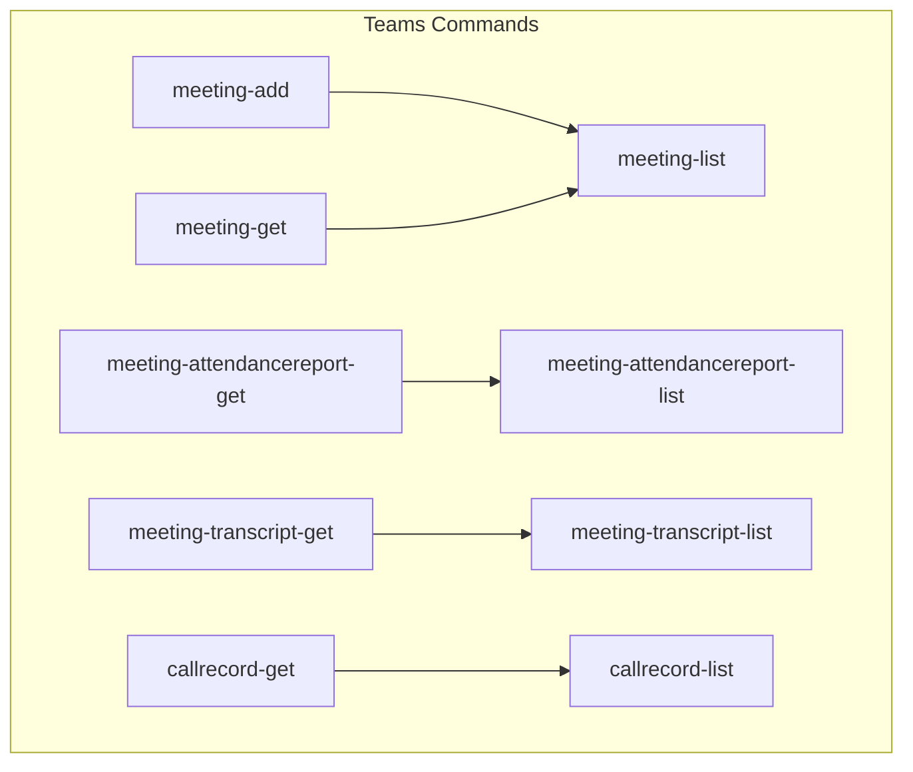
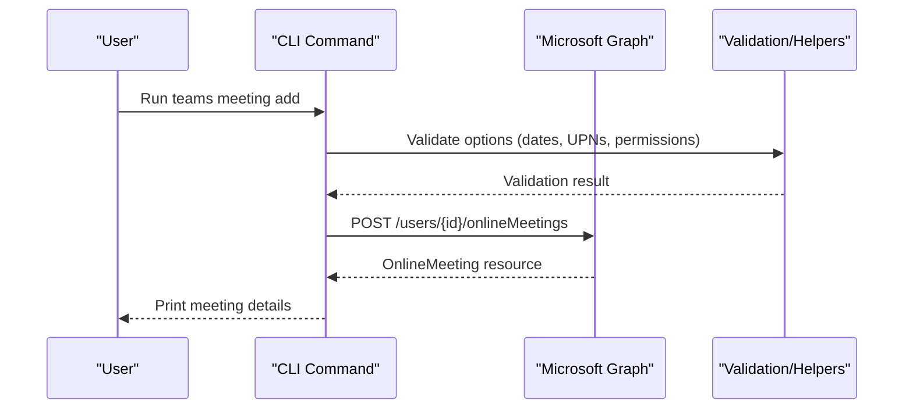
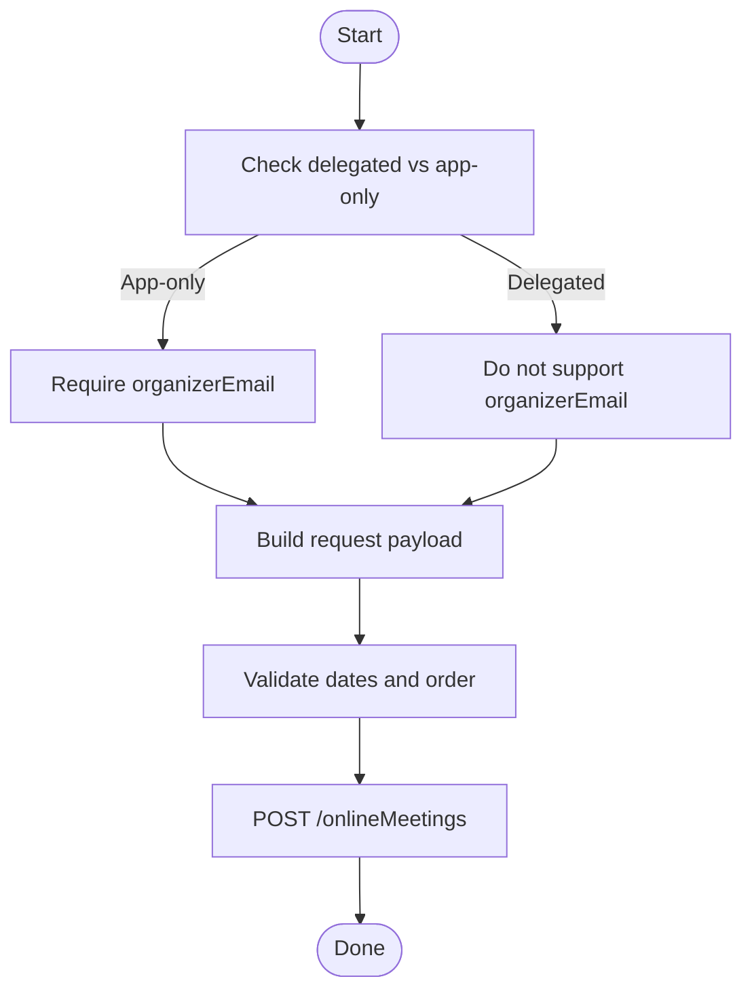
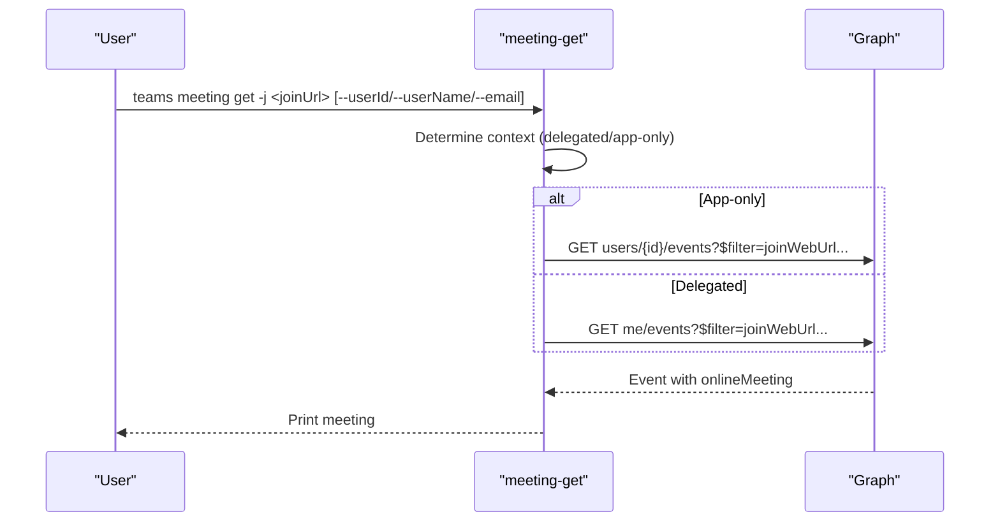
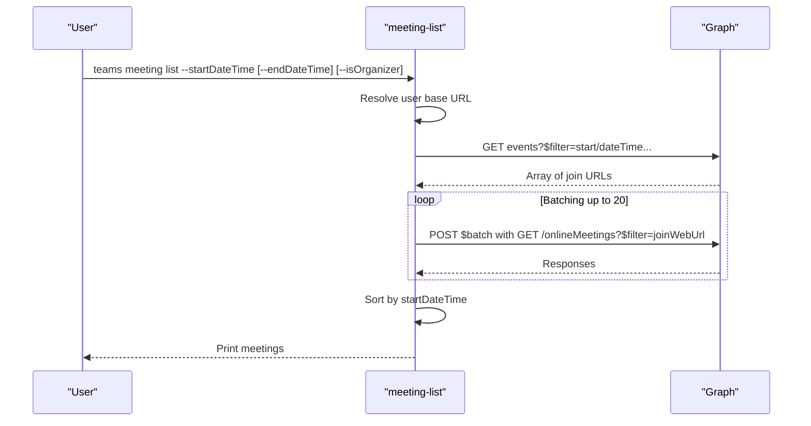
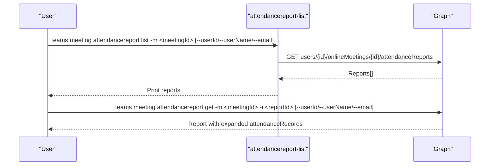
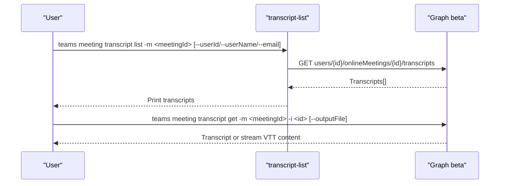
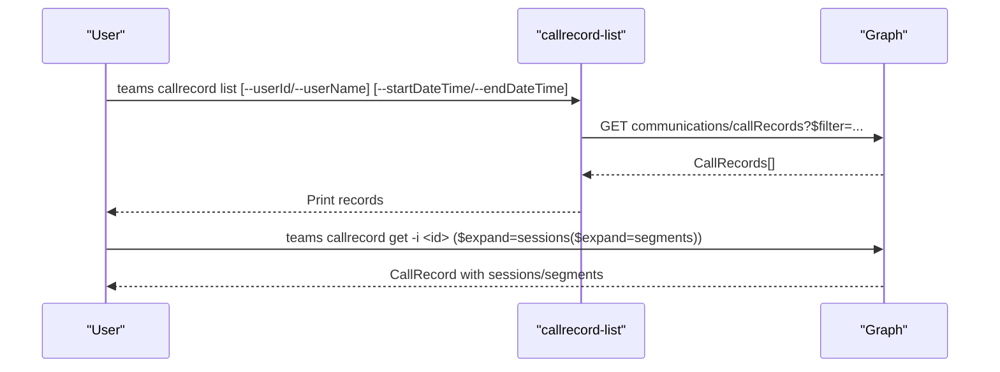
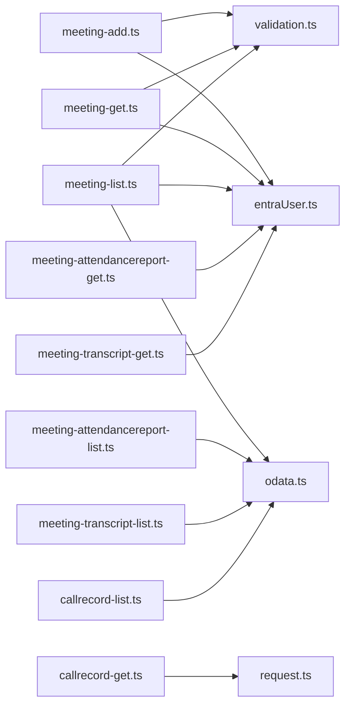

# Meeting and Call Management

<cite>
**Referenced Files in This Document**
- [meeting-add.ts](file://src/m365/teams/commands/meeting/meeting-add.ts)
- [meeting-get.ts](file://src/m365/teams/commands/meeting/meeting-get.ts)
- [meeting-list.ts](file://src/m365/teams/commands/meeting/meeting-list.ts)
- [meeting-attendancereport-get.ts](file://src/m365/teams/commands/meeting/meeting-attendancereport-get.ts)
- [meeting-attendancereport-list.ts](file://src/m365/teams/commands/meeting/meeting-attendancereport-list.ts)
- [meeting-transcript-list.ts](file://src/m365/teams/commands/meeting/meeting-transcript-list.ts)
- [meeting-transcript-get.ts](file://src/m365/teams/commands/meeting/meeting-transcript-get.ts)
- [callrecord-list.ts](file://src/m365/teams/commands/callrecord/callrecord-list.ts)
- [callrecord-get.ts](file://src/m365/teams/commands/callrecord/callrecord-get.ts)
- [MeetingTranscript.ts](file://src/m365/teams/MeetingTranscript.ts)
- [commands.ts](file://src/m365/teams/commands.ts)
- [meeting-add.mdx](file://docs/docs/cmd/teams/meeting/meeting-add.mdx)
</cite>

## Table of Contents
1. [Introduction](#introduction)
2. [Project Structure](#project-structure)
3. [Core Components](#core-components)
4. [Architecture Overview](#architecture-overview)
5. [Detailed Component Analysis](#detailed-component-analysis)
6. [Dependency Analysis](#dependency-analysis)
7. [Performance Considerations](#performance-considerations)
8. [Troubleshooting Guide](#troubleshooting-guide)
9. [Conclusion](#conclusion)
10. [Appendices](#appendices)

## Introduction
This document explains Microsoft Teams meeting and call management commands available in the CLI. It covers:
- Meeting creation and scheduling via meeting-add, meeting-get, and meeting-list
- Attendance reporting via meeting-attendancereport-get and meeting-attendancereport-list
- Transcript management via meeting-transcript-get and meeting-transcript-list
- PSTN and VoIP call tracking via callrecord-list and callrecord-get
- Practical automation examples, analytics, and compliance recording
- Meeting policies, dial-in configurations, and audio/video quality controls
- Integration with Microsoft Bookings and calendar systems

## Project Structure
The Teams command suite resides under the Teams module and is organized by functional area:
- Meeting commands: meeting-add, meeting-get, meeting-list, meeting-attendancereport-*, meeting-transcript-*
- Call record commands: callrecord-list, callrecord-get
- Shared types: MeetingTranscript model
- Command identifiers: teams/commands.ts

**Diagram sources**
- [commands.ts:1-80](file://src/m365/teams/commands.ts#L1-L80)

**Section sources**
- [commands.ts:1-80](file://src/m365/teams/commands.ts#L1-L80)

## Core Components
- Meeting creation (meeting-add): Creates an online meeting with optional start/end times, subject, participants, and automatic recording.
- Meeting retrieval (meeting-get): Fetches a specific meeting by join URL for a user context.
- Meeting listing (meeting-list): Lists online meetings for a user or shared mailbox within a date range, optionally filtered as organizer.
- Attendance reporting (meeting-attendancereport-list/get): Lists and retrieves attendance reports for a meeting, supporting app-only and delegated contexts.
- Transcripts (meeting-transcript-list/get): Lists and downloads meeting transcripts, with optional file output.
- Call records (callrecord-list/get): Lists and expands a specific call record with sessions and segments, constrained to the last 30 days.

**Section sources**
- [meeting-add.ts:25-202](file://src/m365/teams/commands/meeting/meeting-add.ts#L25-L202)
- [meeting-get.ts:24-147](file://src/m365/teams/commands/meeting/meeting-get.ts#L24-L147)
- [meeting-list.ts:27-227](file://src/m365/teams/commands/meeting/meeting-list.ts#L27-L227)
- [meeting-attendancereport-list.ts:24-139](file://src/m365/teams/commands/meeting/meeting-attendancereport-list.ts#L24-L139)
- [meeting-attendancereport-get.ts:24-160](file://src/m365/teams/commands/meeting/meeting-attendancereport-get.ts#L24-L160)
- [meeting-transcript-list.ts:22-145](file://src/m365/teams/commands/meeting/meeting-transcript-list.ts#L22-L145)
- [meeting-transcript-get.ts:27-196](file://src/m365/teams/commands/meeting/meeting-transcript-get.ts#L27-L196)
- [callrecord-list.ts:52-115](file://src/m365/teams/commands/callrecord/callrecord-list.ts#L52-L115)
- [callrecord-get.ts:18-69](file://src/m365/teams/commands/callrecord/callrecord-get.ts#L18-L69)

## Architecture Overview
The Teams commands rely on Microsoft Graph APIs and the CLI’s GraphCommand base class. They implement:
- Permission-aware flows (delegated vs app-only)
- Validation helpers for dates, UPNs, and GUIDs
- Batched requests for efficient retrieval of meeting details
- Optional file streaming for transcript downloads

**Diagram sources**
- [meeting-add.ts:78-135](file://src/m365/teams/commands/meeting/meeting-add.ts#L78-L135)

## Detailed Component Analysis

### Meeting Creation (meeting-add)
Purpose: Create an online meeting with optional scheduling and recording.
Key behaviors:
- Validates ISO date strings and time ordering
- Supports participant UPNs and optional subject
- Automatic recording toggle
- Organizer selection via UPN/email when using app-only permissions
- Fallback to current user when not using app-only

**Diagram sources**
- [meeting-add.ts:117-135](file://src/m365/teams/commands/meeting/meeting-add.ts#L117-L135)

**Section sources**
- [meeting-add.ts:25-202](file://src/m365/teams/commands/meeting/meeting-add.ts#L25-L202)
- [meeting-add.mdx:1-283](file://docs/docs/cmd/teams/meeting/meeting-add.mdx#L1-L283)

### Meeting Retrieval (meeting-get)
Purpose: Retrieve a specific meeting by join URL for a user context.
Key behaviors:
- Delegated mode: restricts to current user
- App-only mode: requires userId, userName, or email to resolve target user
- Filters by joinWebUrl against calendar events

**Diagram sources**
- [meeting-get.ts:80-132](file://src/m365/teams/commands/meeting/meeting-get.ts#L80-L132)

**Section sources**
- [meeting-get.ts:24-147](file://src/m365/teams/commands/meeting/meeting-get.ts#L24-L147)

### Meeting Listing (meeting-list)
Purpose: List online meetings for a user or shared mailbox within a date window.
Key behaviors:
- Resolves user context (userId, userName, email, or current user)
- Queries calendar events for onlineMeeting join URLs
- Uses $batch to fetch meeting details efficiently
- Sorts results by startDateTime

**Diagram sources**
- [meeting-list.ts:115-224](file://src/m365/teams/commands/meeting/meeting-list.ts#L115-L224)

**Section sources**
- [meeting-list.ts:27-227](file://src/m365/teams/commands/meeting/meeting-list.ts#L27-L227)

### Attendance Reporting (meeting-attendancereport-list/get)
Purpose: List and retrieve attendance reports for a meeting.
Key behaviors:
- App-only vs delegated permission handling
- Supports resolving user by id/upn/email
- Expands detailed report with attendance records in get variant

**Diagram sources**
- [meeting-attendancereport-list.ts:84-122](file://src/m365/teams/commands/meeting/meeting-attendancereport-list.ts#L84-L122)
- [meeting-attendancereport-get.ts:108-145](file://src/m365/teams/commands/meeting/meeting-attendancereport-get.ts#L108-L145)

**Section sources**
- [meeting-attendancereport-list.ts:24-139](file://src/m365/teams/commands/meeting/meeting-attendancereport-list.ts#L24-L139)
- [meeting-attendancereport-get.ts:24-160](file://src/m365/teams/commands/meeting/meeting-attendancereport-get.ts#L24-L160)

### Transcript Management (meeting-transcript-list/get)
Purpose: List and download meeting transcripts.
Key behaviors:
- Uses Graph beta endpoint for transcripts
- Supports app-only and delegated modes with appropriate restrictions
- Downloads VTT content to a file when requested

**Diagram sources**
- [meeting-transcript-list.ts:98-142](file://src/m365/teams/commands/meeting/meeting-transcript-list.ts#L98-L142)
- [meeting-transcript-get.ts:110-193](file://src/m365/teams/commands/meeting/meeting-transcript-get.ts#L110-L193)
- [MeetingTranscript.ts:1-7](file://src/m365/teams/MeetingTranscript.ts#L1-L7)

**Section sources**
- [meeting-transcript-list.ts:22-145](file://src/m365/teams/commands/meeting/meeting-transcript-list.ts#L22-L145)
- [meeting-transcript-get.ts:27-196](file://src/m365/teams/commands/meeting/meeting-transcript-get.ts#L27-L196)
- [MeetingTranscript.ts:1-7](file://src/m365/teams/MeetingTranscript.ts#L1-L7)

### Call Records (callrecord-list/get)
Purpose: List and expand call records for PSTN/VoIP calls.
Key behaviors:
- Enforces last-30-days constraint for date filters
- Supports filtering by participant via userId or userName
- Expands sessions and segments in get variant

**Diagram sources**
- [callrecord-list.ts:79-112](file://src/m365/teams/commands/callrecord/callrecord-list.ts#L79-L112)
- [callrecord-get.ts:31-66](file://src/m365/teams/commands/callrecord/callrecord-get.ts#L31-L66)

**Section sources**
- [callrecord-list.ts:52-115](file://src/m365/teams/commands/callrecord/callrecord-list.ts#L52-L115)
- [callrecord-get.ts:18-69](file://src/m365/teams/commands/callrecord/callrecord-get.ts#L18-L69)

## Dependency Analysis
- Permission model: App-only vs delegated determines whether user context options are allowed and how organizer/target user is resolved.
- Validation: Shared validators enforce ISO date formats, UPN arrays, and GUIDs.
- Utilities: Helpers for user resolution, access token checks, and OData batching.
- Graph endpoints: Uses v1.0 for most meeting operations and beta for transcripts.

**Diagram sources**
- [meeting-add.ts:1-202](file://src/m365/teams/commands/meeting/meeting-add.ts#L1-L202)
- [meeting-get.ts:1-147](file://src/m365/teams/commands/meeting/meeting-get.ts#L1-L147)
- [meeting-list.ts:1-227](file://src/m365/teams/commands/meeting/meeting-list.ts#L1-L227)
- [meeting-attendancereport-list.ts:1-139](file://src/m365/teams/commands/meeting/meeting-attendancereport-list.ts#L1-L139)
- [meeting-attendancereport-get.ts:1-160](file://src/m365/teams/commands/meeting/meeting-attendancereport-get.ts#L1-L160)
- [meeting-transcript-list.ts:1-145](file://src/m365/teams/commands/meeting/meeting-transcript-list.ts#L1-L145)
- [meeting-transcript-get.ts:1-196](file://src/m365/teams/commands/meeting/meeting-transcript-get.ts#L1-L196)
- [callrecord-list.ts:1-115](file://src/m365/teams/commands/callrecord/callrecord-list.ts#L1-L115)
- [callrecord-get.ts:1-69](file://src/m365/teams/commands/callrecord/callrecord-get.ts#L1-L69)

**Section sources**
- [meeting-add.ts:1-202](file://src/m365/teams/commands/meeting/meeting-add.ts#L1-L202)
- [meeting-list.ts:1-227](file://src/m365/teams/commands/meeting/meeting-list.ts#L1-L227)
- [meeting-transcript-get.ts:1-196](file://src/m365/teams/commands/meeting/meeting-transcript-get.ts#L1-L196)
- [callrecord-list.ts:1-115](file://src/m365/teams/commands/callrecord/callrecord-list.ts#L1-L115)

## Performance Considerations
- Batched retrieval: meeting-list batches up to 20 join URLs per $batch request to minimize round-trips.
- Efficient filtering: meeting-list filters calendar events server-side by date and optional organizer flag.
- Streaming downloads: meeting-transcript-get streams VTT content to disk when outputFile is specified, avoiding large memory allocations.
- Date windows: callrecord-list enforces a 30-day window to limit payload sizes.

[No sources needed since this section provides general guidance]

## Troubleshooting Guide
Common issues and resolutions:
- Invalid date formats: Ensure ISO date strings for start/end times.
- Time ordering: startTime must precede endTime; both must be in the future.
- Participant UPNs: Provide a comma-separated list of valid UPNs.
- App-only vs delegated: App-only requires organizer/target user options; delegated disallows them.
- Permissions: App-only usage requires OnlineMeetings.ReadWrite.All and proper application access policy assignment.
- Transcript access: Requires appropriate permissions; beta endpoint usage may vary by tenant configuration.

**Section sources**
- [meeting-add.ts:78-115](file://src/m365/teams/commands/meeting/meeting-add.ts#L78-L115)
- [meeting-get.ts:80-91](file://src/m365/teams/commands/meeting/meeting-get.ts#L80-L91)
- [meeting-list.ts:83-113](file://src/m365/teams/commands/meeting/meeting-list.ts#L83-L113)
- [meeting-transcript-get.ts:110-141](file://src/m365/teams/commands/meeting/meeting-transcript-get.ts#L110-L141)
- [callrecord-list.ts:17-44](file://src/m365/teams/commands/callrecord/callrecord-list.ts#L17-L44)

## Conclusion
The Teams command suite provides comprehensive capabilities to automate meeting lifecycle management, attendance analytics, and compliance recording, alongside robust PSTN/VoIP call insights. By leveraging permission-aware flows, validation, and batched operations, administrators can reliably schedule, monitor, and audit Teams meetings and calls at scale.

[No sources needed since this section summarizes without analyzing specific files]

## Appendices

### Practical Automation Examples
- Automated meeting scheduling:
  - Create meetings with specific start/end times and subjects.
  - Assign participants via UPN lists.
  - Enable automatic recording for compliance.
- Attendance analytics:
  - List attendance reports for a meeting and review total participant counts.
  - Expand detailed attendance records for deeper insights.
- Compliance recording:
  - Download meeting transcripts to VTT files for later processing and archiving.
- Call tracking:
  - Filter call records by participant and date window.
  - Expand sessions and segments for detailed diagnostics.

[No sources needed since this section provides general guidance]

### Meeting Policies, Dial-In, and Quality Controls
- Meeting policies and dial-in configurations are managed via Microsoft Graph OnlineMeeting settings returned by commands such as meeting-add and meeting-get. These include passcode requirements, allowed presenters, meeting chat settings, and recording/transcription toggles.
- Audio/video quality management is controlled by tenant-level policies and meeting capabilities surfaced in the meeting resources.

[No sources needed since this section provides general guidance]

### Integration with Microsoft Bookings and Calendar Systems
- Meetings created via meeting-add are standalone online meetings not bound to calendar events; they will not appear on the user’s calendar.
- For calendar-integrated scheduling, use Exchange Online or other calendar integrations outside the scope of these Teams commands.

**Section sources**
- [meeting-add.mdx:39-48](file://docs/docs/cmd/teams/meeting/meeting-add.mdx#L39-L48)