# Microsoft Teams Management

<cite>
**Referenced Files in This Document**
- [commands.ts](file://src/m365/teams/commands.ts)
- [index.spec.ts](file://src/index.spec.ts)
- [package.json](file://package.json)
- [teams.ts](file://src/utils/teams.ts)
</cite>

## Table of Contents
1. [Introduction](#introduction)
2. [Project Structure](#project-structure)
3. [Core Components](#core-components)
4. [Architecture Overview](#architecture-overview)
5. [Detailed Component Analysis](#detailed-component-analysis)
6. [Dependency Analysis](#dependency-analysis)
7. [Performance Considerations](#performance-considerations)
8. [Troubleshooting Guide](#troubleshooting-guide)
9. [Conclusion](#conclusion)
10. [Appendices](#appendices)

## Introduction
This document provides comprehensive guidance for managing Microsoft Teams using the CLI for Microsoft 365. It covers the Teams command suite for team administration, channel management, member operations, app deployment, and communication features. It also explains how the CLI integrates with Microsoft Teams architecture and Microsoft Graph APIs, and outlines real-time communication capabilities such as chat, messages, meetings, and transcripts. Practical automation examples and integration scenarios are included to help administrators streamline Teams administration tasks.

## Project Structure
The Teams command suite is organized under the Teams module in the CLI. The module exposes a centralized registry of command identifiers that map to individual command implementations. These implementations are lazily loaded by the CLI runtime and resolve to files under the m365/teams/commands hierarchy. The Teams utilities module provides shared helpers for working with Teams resources.

Key structural elements:
- Teams command identifiers registry
- Lazy-loading mechanism for Teams commands
- Teams utilities for common operations

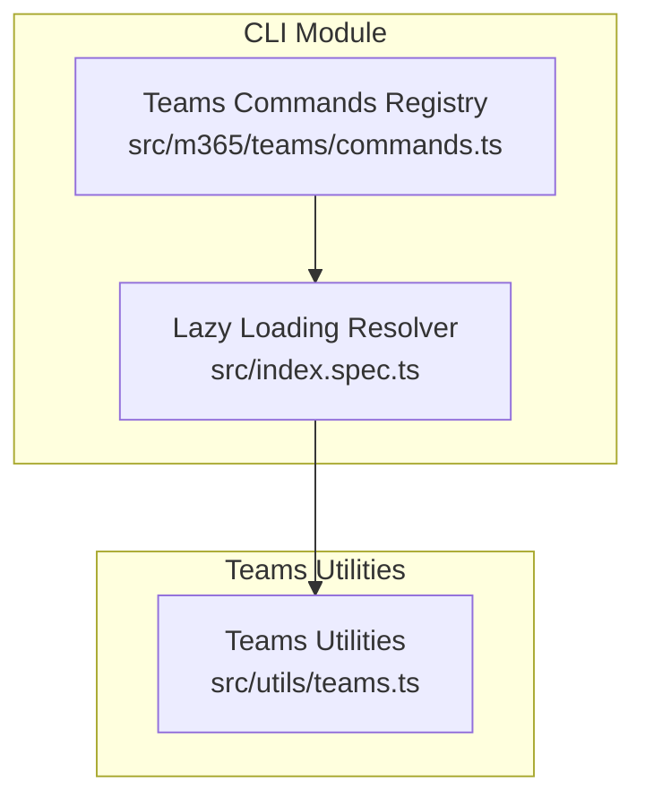

**Diagram sources**
- [commands.ts:1-80](file://src/m365/teams/commands.ts#L1-L80)
- [index.spec.ts:32-134](file://src/index.spec.ts#L32-L134)
- [teams.ts](file://src/utils/teams.ts)

**Section sources**
- [commands.ts:1-80](file://src/m365/teams/commands.ts#L1-L80)
- [index.spec.ts:32-134](file://src/index.spec.ts#L32-L134)
- [package.json:1-337](file://package.json#L1-L337)

## Core Components
The Teams command suite is defined by a registry of command identifiers. Each identifier corresponds to a specific operation such as team management, channel operations, member management, app deployment, chat and message operations, meeting management, messaging and fun settings, and reporting. The CLI resolves these identifiers to command implementations at runtime.

Highlights of the Teams command identifiers:
- Team operations: add, get, list, set, remove, archive, unarchive, clone, app list
- Channel operations: add, get, list, set, remove, member add/remove/set/list
- Tab operations: add, get, list, remove
- Chat operations: get, list, member add/remove/list, message list/send
- Message operations: get, list, remove, reply list, restore
- Meeting operations: add, get, list, attendance report get/list, transcript get/list
- Settings: funsettings, guestsettings, membersettings, messagingsettings
- Reports: device usage, direct routing calls, PSTN calls, user activity
- App operations: install, list, publish, remove, uninstall, update, user app add/list/remove/upgrade
- Call record operations: get, list
- Cache operations: remove
- User operations: add, list, remove, set, user app add/list/remove/upgrade

These identifiers enable consistent command discovery and execution across the CLI.

**Section sources**
- [commands.ts:1-80](file://src/m365/teams/commands.ts#L1-L80)
- [index.spec.ts:32-134](file://src/index.spec.ts#L32-L134)

## Architecture Overview
The Teams command suite integrates with Microsoft Graph APIs to perform operations on Teams resources. The CLI uses a delegated or application-based authentication flow to obtain tokens and issue requests to Microsoft Graph endpoints. The Teams utilities module encapsulates common logic for interacting with Teams resources, while the Teams commands module defines the command surface area.

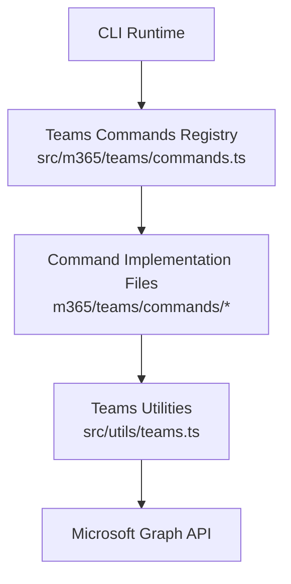

**Diagram sources**
- [commands.ts:1-80](file://src/m365/teams/commands.ts#L1-L80)
- [teams.ts](file://src/utils/teams.ts)

## Detailed Component Analysis

### Team Operations
Team operations enable lifecycle management of Teams groups and teams. Typical operations include creating a team, retrieving details, listing teams, updating properties, removing a team, archiving/unarchiving, and cloning a team. Team app listing allows enumerating apps installed in a team.

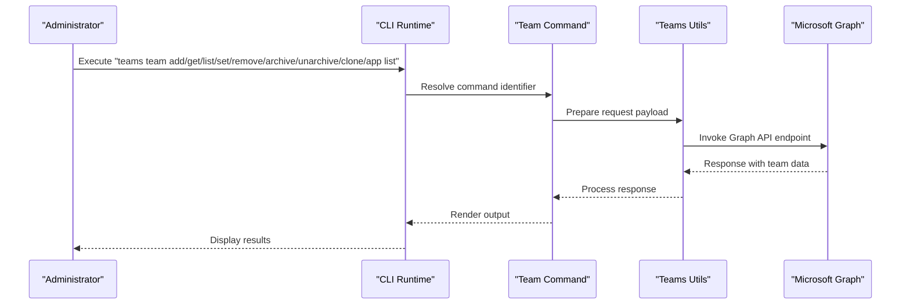

**Diagram sources**
- [commands.ts:62-70](file://src/m365/teams/commands.ts#L62-L70)
- [teams.ts](file://src/utils/teams.ts)

**Section sources**
- [commands.ts:62-70](file://src/m365/teams/commands.ts#L62-L70)

### Channel Operations
Channel operations support managing channels within a team. Operations include adding a channel, retrieving channel details, listing channels, setting channel properties, removing a channel, and managing channel members. Member management includes adding/removing members, listing members, and setting member roles.

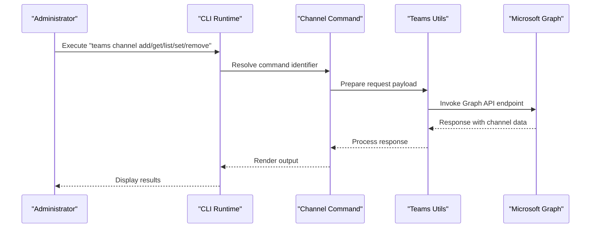

**Diagram sources**
- [commands.ts:13-21](file://src/m365/teams/commands.ts#L13-L21)
- [teams.ts](file://src/utils/teams.ts)

**Section sources**
- [commands.ts:13-21](file://src/m365/teams/commands.ts#L13-L21)

### Tab Setup
Tabs can be added, retrieved, listed, and removed within channels. Tabs integrate applications and content into channels for enhanced collaboration.

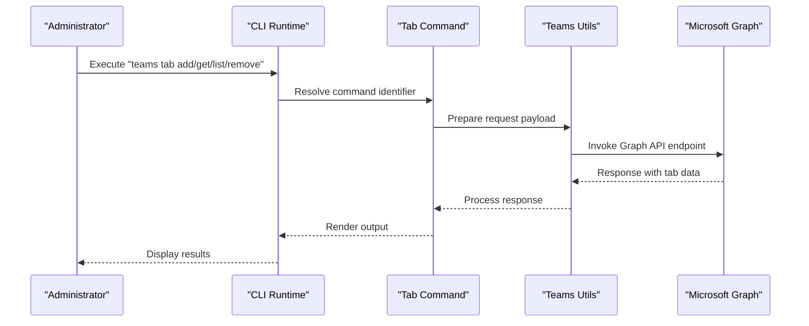

**Diagram sources**
- [commands.ts:58-61](file://src/m365/teams/commands.ts#L58-L61)
- [teams.ts](file://src/utils/teams.ts)

**Section sources**
- [commands.ts:58-61](file://src/m365/teams/commands.ts#L58-L61)

### Member and Owner Management
Member and owner management operations allow adding/removing members and owners, listing members, and setting member roles. These operations are essential for controlling access and collaboration within teams and channels.

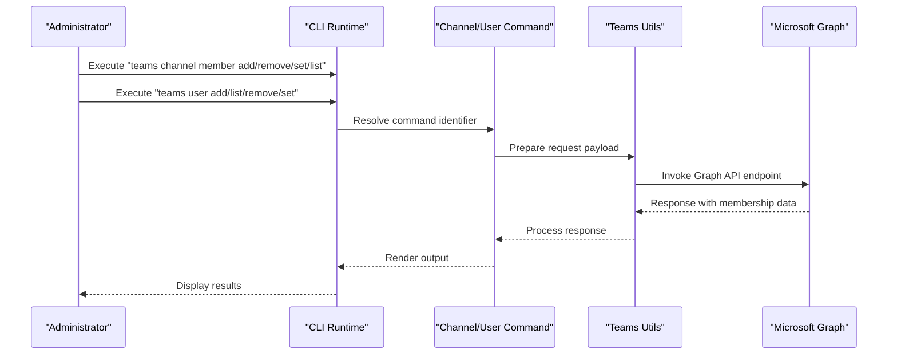

**Diagram sources**
- [commands.ts:16-19](file://src/m365/teams/commands.ts#L16-L19)
- [commands.ts:71-74](file://src/m365/teams/commands.ts#L71-L74)
- [teams.ts](file://src/utils/teams.ts)

**Section sources**
- [commands.ts:16-19](file://src/m365/teams/commands.ts#L16-L19)
- [commands.ts:71-74](file://src/m365/teams/commands.ts#L71-L74)

### App Deployment and Management
App deployment and management operations enable installing, publishing, removing, uninstalling, and updating apps for teams and users. These operations support automating app distribution and lifecycle management.

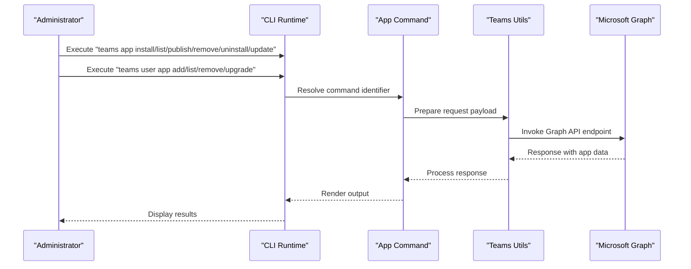

**Diagram sources**
- [commands.ts:4-9](file://src/m365/teams/commands.ts#L4-L9)
- [commands.ts:75-78](file://src/m365/teams/commands.ts#L75-L78)
- [teams.ts](file://src/utils/teams.ts)

**Section sources**
- [commands.ts:4-9](file://src/m365/teams/commands.ts#L4-L9)
- [commands.ts:75-78](file://src/m365/teams/commands.ts#L75-L78)

### Chat and Message Operations
Chat and message operations enable retrieving chats, listing chat members, sending messages, and listing messages. These operations support automating communication workflows and monitoring conversations.

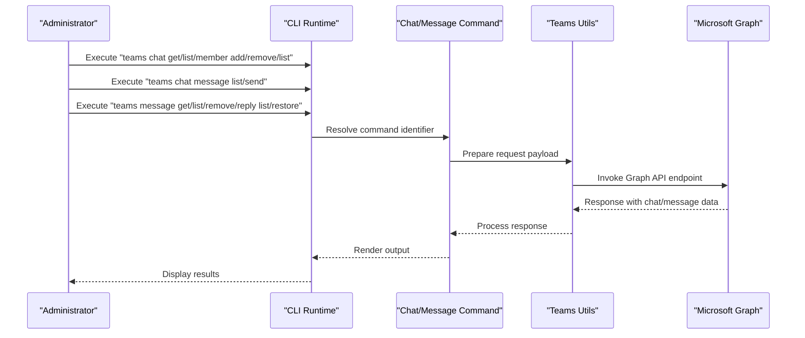

**Diagram sources**
- [commands.ts:22-28](file://src/m365/teams/commands.ts#L22-L28)
- [commands.ts:42-47](file://src/m365/teams/commands.ts#L42-L47)
- [teams.ts](file://src/utils/teams.ts)

**Section sources**
- [commands.ts:22-28](file://src/m365/teams/commands.ts#L22-L28)
- [commands.ts:42-47](file://src/m365/teams/commands.ts#L42-L47)

### Meeting Management and Transcripts
Meeting management operations include adding, retrieving, and listing meetings, as well as retrieving attendance reports and transcripts. These operations support scheduling, compliance, and post-meeting analysis.

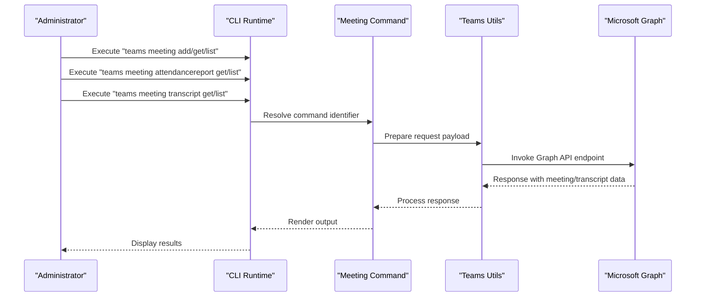

**Diagram sources**
- [commands.ts:33-39](file://src/m365/teams/commands.ts#L33-L39)
- [teams.ts](file://src/utils/teams.ts)

**Section sources**
- [commands.ts:33-39](file://src/m365/teams/commands.ts#L33-L39)

### Messaging Policies, Fun Settings, Guest Settings, and Member Settings
Settings operations allow listing and setting fun settings, guest settings, member settings, and messaging settings. These operations help enforce organizational policies and customize user experiences.

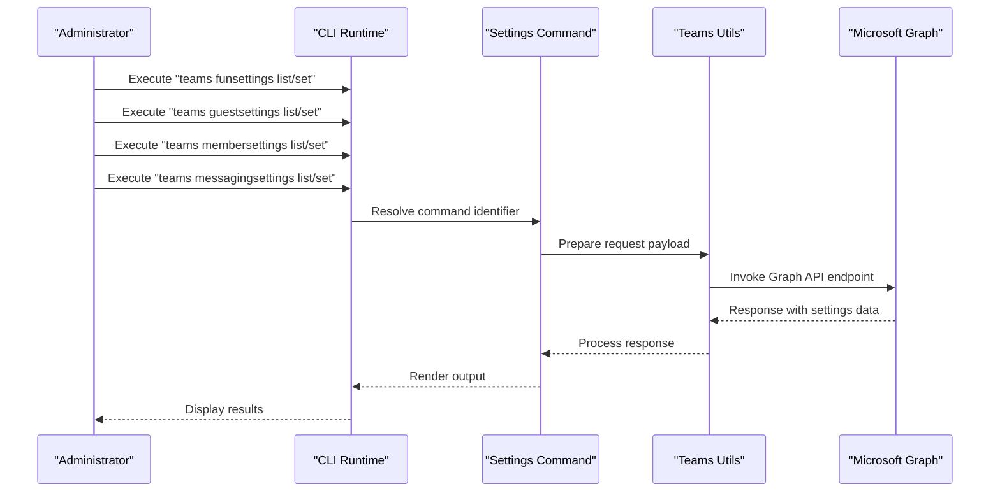

**Diagram sources**
- [commands.ts:29-32](file://src/m365/teams/commands.ts#L29-L32)
- [commands.ts:40-49](file://src/m365/teams/commands.ts#L40-L49)
- [teams.ts](file://src/utils/teams.ts)

**Section sources**
- [commands.ts:29-32](file://src/m365/teams/commands.ts#L29-L32)
- [commands.ts:40-49](file://src/m365/teams/commands.ts#L40-L49)

### Reporting
Reporting operations provide insights into device usage, direct routing calls, PSTN calls, and user activity. These reports support capacity planning, compliance monitoring, and operational analytics.

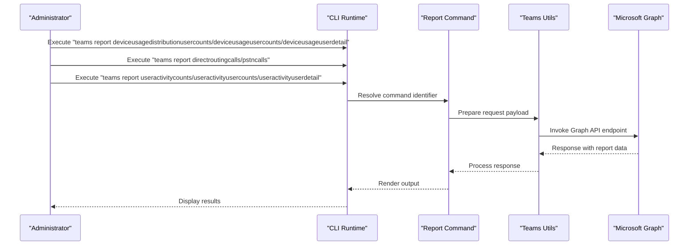

**Diagram sources**
- [commands.ts:50-57](file://src/m365/teams/commands.ts#L50-L57)
- [teams.ts](file://src/utils/teams.ts)

**Section sources**
- [commands.ts:50-57](file://src/m365/teams/commands.ts#L50-L57)

### Call Record Operations
Call record operations enable retrieving call records and listing call records, supporting troubleshooting and compliance workflows.

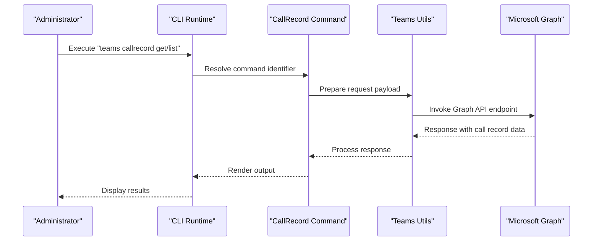

**Diagram sources**
- [commands.ts:11-12](file://src/m365/teams/commands.ts#L11-L12)
- [teams.ts](file://src/utils/teams.ts)

**Section sources**
- [commands.ts:11-12](file://src/m365/teams/commands.ts#L11-L12)

### Cache Operations
Cache operations support removing cached data related to Teams, ensuring clean state during troubleshooting or refresh scenarios.

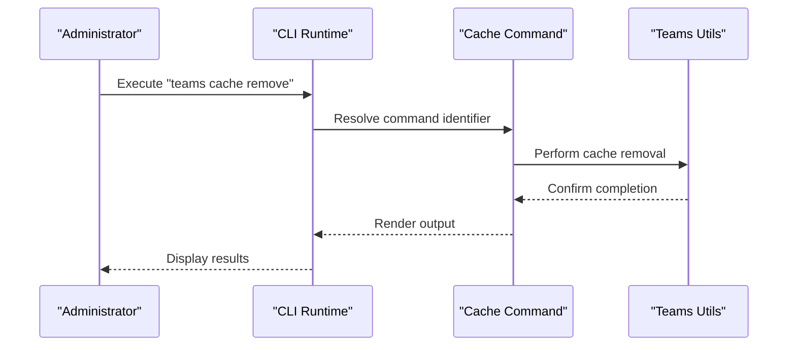

**Diagram sources**
- [commands.ts](file://src/m365/teams/commands.ts#L10)
- [teams.ts](file://src/utils/teams.ts)

**Section sources**
- [commands.ts](file://src/m365/teams/commands.ts#L10)

## Dependency Analysis
The Teams command suite relies on the Teams utilities module for shared logic and integrates with Microsoft Graph APIs for resource operations. The CLI’s lazy-loading mechanism ensures that only requested commands are resolved, reducing startup overhead.

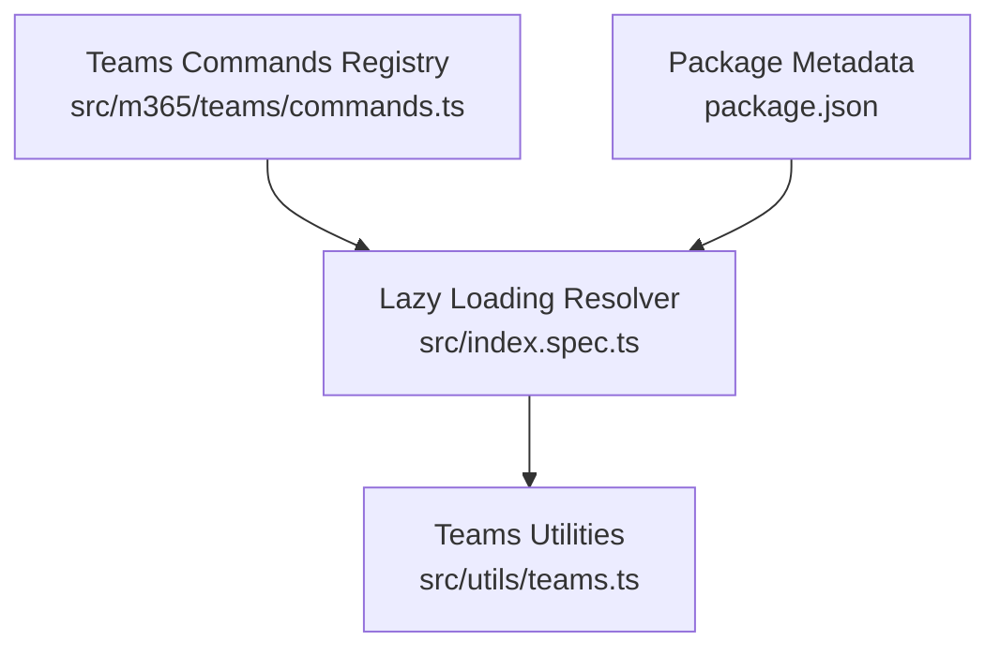

**Diagram sources**
- [commands.ts:1-80](file://src/m365/teams/commands.ts#L1-L80)
- [index.spec.ts:32-134](file://src/index.spec.ts#L32-L134)
- [package.json:1-337](file://package.json#L1-L337)
- [teams.ts](file://src/utils/teams.ts)

**Section sources**
- [commands.ts:1-80](file://src/m365/teams/commands.ts#L1-L80)
- [index.spec.ts:32-134](file://src/index.spec.ts#L32-L134)
- [package.json:1-337](file://package.json#L1-L337)

## Performance Considerations
- Use batch operations where supported to minimize API calls.
- Leverage filtering and pagination options to limit response sizes.
- Cache frequently accessed data locally to reduce repeated queries.
- Prefer listing operations to discover resources before performing targeted operations.

## Troubleshooting Guide
Common issues and resolutions:
- Authentication failures: Ensure proper credentials and scopes are configured for Microsoft Graph.
- Permission errors: Verify that the authenticated identity has sufficient permissions for Teams operations.
- Rate limiting: Implement retry logic with exponential backoff when encountering throttling.
- Network connectivity: Confirm outbound connectivity to Microsoft Graph endpoints.

## Conclusion
The CLI for Microsoft 365 provides a comprehensive Teams command suite enabling administrators to automate team administration, channel management, member operations, app deployment, and communication workflows. By integrating with Microsoft Graph APIs and leveraging the Teams utilities module, the CLI offers a scalable and extensible foundation for Teams management automation.

## Appendices
- Practical automation examples and integration scenarios are available in the CLI documentation and sample scripts.