# Settings and Policies

<cite>
**Referenced Files in This Document**
- [funsettings-list.ts](file://src/m365/teams/commands/funsettings/funsettings-list.ts)
- [funsettings-set.ts](file://src/m365/teams/commands/funsettings/funsettings-set.ts)
- [guestsettings-list.ts](file://src/m365/teams/commands/guestsettings/guestsettings-list.ts)
- [guestsettings-set.ts](file://src/m365/teams/commands/guestsettings/guestsettings-set.ts)
- [membersettings-list.ts](file://src/m365/teams/commands/membersettings/membersettings-list.ts)
- [membersettings-set.ts](file://src/m365/teams/commands/membersettings/membersettings-set.ts)
- [messagingsettings-list.ts](file://src/m365/teams/commands/messagingsettings/messagingsettings-list.ts)
- [messagingsettings-set.ts](file://src/m365/teams/commands/messagingsettings/messagingsettings-set.ts)
- [cache-remove.ts](file://src/m365/teams/commands/cache/cache-remove.ts)
- [cache.ts](file://src/utils/cache.ts)
</cite>

## Table of Contents
1. [Introduction](#introduction)
2. [Project Structure](#project-structure)
3. [Core Components](#core-components)
4. [Architecture Overview](#architecture-overview)
5. [Detailed Component Analysis](#detailed-component-analysis)
6. [Dependency Analysis](#dependency-analysis)
7. [Performance Considerations](#performance-considerations)
8. [Troubleshooting Guide](#troubleshooting-guide)
9. [Conclusion](#conclusion)
10. [Appendices](#appendices)

## Introduction
This document explains Microsoft Teams settings and policy management commands available in the CLI. It focuses on:
- Fun settings for entertainment and social features
- Guest settings for external collaboration policies
- Member settings for member-related policies
- Messaging settings for communication policies
- Cache management for troubleshooting and performance optimization

It also covers policy inheritance, tenant-wide settings, compliance considerations, and practical automation and governance workflows.

## Project Structure
The Teams settings commands are implemented as GraphCommand subclasses under the Teams module. Each setting type has a dedicated pair of commands: a list command to retrieve current settings and a set command to update them. A cache removal command is available for troubleshooting.

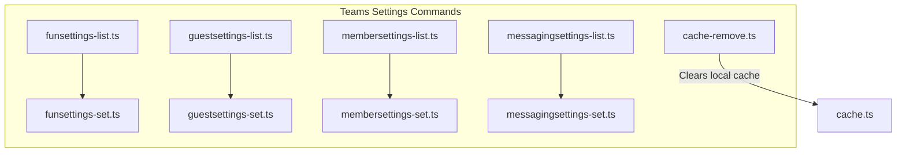

**Diagram sources**
- [funsettings-list.ts:1-75](file://src/m365/teams/commands/funsettings/funsettings-list.ts#L1-L75)
- [funsettings-set.ts:1-138](file://src/m365/teams/commands/funsettings/funsettings-set.ts#L1-L138)
- [guestsettings-list.ts:1-73](file://src/m365/teams/commands/guestsettings/guestsettings-list.ts#L1-L73)
- [guestsettings-set.ts:1-110](file://src/m365/teams/commands/guestsettings/guestsettings-set.ts#L1-L110)
- [membersettings-list.ts:1-73](file://src/m365/teams/commands/membersettings/membersettings-list.ts#L1-L73)
- [membersettings-set.ts:1-128](file://src/m365/teams/commands/membersettings/membersettings-set.ts#L1-L128)
- [messagingsettings-list.ts:1-73](file://src/m365/teams/commands/messagingsettings/messagingsettings-list.ts#L1-L73)
- [messagingsettings-set.ts:1-140](file://src/m365/teams/commands/messagingsettings/messagingsettings-set.ts#L1-L140)
- [cache-remove.ts](file://src/m365/teams/commands/cache/cache-remove.ts)
- [cache.ts](file://src/utils/cache.ts)

**Section sources**
- [funsettings-list.ts:1-75](file://src/m365/teams/commands/funsettings/funsettings-list.ts#L1-L75)
- [guestsettings-list.ts:1-73](file://src/m365/teams/commands/guestsettings/guestsettings-list.ts#L1-L73)
- [membersettings-list.ts:1-73](file://src/m365/teams/commands/membersettings/membersettings-list.ts#L1-L73)
- [messagingsettings-list.ts:1-73](file://src/m365/teams/commands/messagingsettings/messagingsettings-list.ts#L1-L73)
- [cache-remove.ts](file://src/m365/teams/commands/cache/cache-remove.ts)

## Core Components
- Fun settings commands
  - List: Retrieves fun settings for a specified team
  - Set: Updates fun settings for a specified team
- Guest settings commands
  - List: Retrieves guest settings for a specified team
  - Set: Updates guest settings for a specified team
- Member settings commands
  - List: Retrieves member settings for a specified team
  - Set: Updates member settings for a specified team
- Messaging settings commands
  - List: Retrieves messaging settings for a specified team
  - Set: Updates messaging settings for a specified team
- Cache management
  - Remove: Clears local cache to resolve stale data or connectivity issues

Each command:
- Inherits from a shared GraphCommand base class
- Validates the team identifier as a GUID
- Uses Microsoft Graph endpoints to GET or PATCH team settings
- Logs results and handles errors consistently

**Section sources**
- [funsettings-list.ts:1-75](file://src/m365/teams/commands/funsettings/funsettings-list.ts#L1-L75)
- [funsettings-set.ts:1-138](file://src/m365/teams/commands/funsettings/funsettings-set.ts#L1-L138)
- [guestsettings-list.ts:1-73](file://src/m365/teams/commands/guestsettings/guestsettings-list.ts#L1-L73)
- [guestsettings-set.ts:1-110](file://src/m365/teams/commands/guestsettings/guestsettings-set.ts#L1-L110)
- [membersettings-list.ts:1-73](file://src/m365/teams/commands/membersettings/membersettings-list.ts#L1-L73)
- [membersettings-set.ts:1-128](file://src/m365/teams/commands/membersettings/membersettings-set.ts#L1-L128)
- [messagingsettings-list.ts:1-73](file://src/m365/teams/commands/messagingsettings/messagingsettings-list.ts#L1-L73)
- [messagingsettings-set.ts:1-140](file://src/m365/teams/commands/messagingsettings/messagingsettings-set.ts#L1-L140)
- [cache-remove.ts](file://src/m365/teams/commands/cache/cache-remove.ts)

## Architecture Overview
The commands follow a consistent pattern:
- Parse and validate arguments
- Build a Microsoft Graph request (GET or PATCH)
- Send the request and log the response
- Handle errors via a shared rejection handler

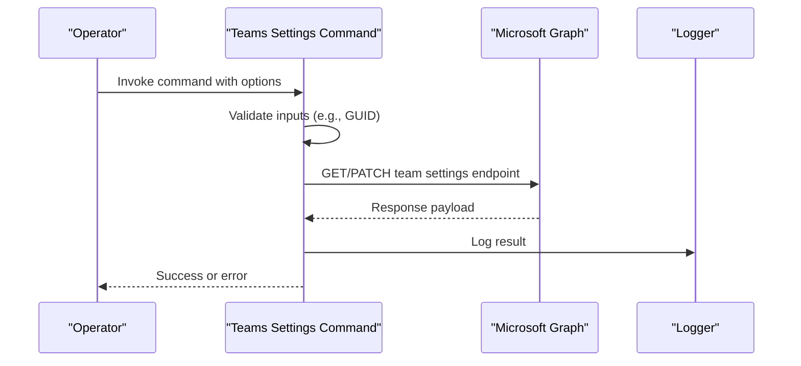

**Diagram sources**
- [funsettings-list.ts:53-72](file://src/m365/teams/commands/funsettings/funsettings-list.ts#L53-L72)
- [funsettings-set.ts:102-135](file://src/m365/teams/commands/funsettings/funsettings-set.ts#L102-L135)
- [guestsettings-list.ts:54-70](file://src/m365/teams/commands/guestsettings/guestsettings-list.ts#L54-L70)
- [guestsettings-set.ts:82-107](file://src/m365/teams/commands/guestsettings/guestsettings-set.ts#L82-L107)
- [membersettings-list.ts:54-70](file://src/m365/teams/commands/membersettings/membersettings-list.ts#L54-L70)
- [membersettings-set.ts:100-125](file://src/m365/teams/commands/membersettings/membersettings-set.ts#L100-L125)
- [messagingsettings-list.ts:54-70](file://src/m365/teams/commands/messagingsettings/messagingsettings-list.ts#L54-L70)
- [messagingsettings-set.ts:112-137](file://src/m365/teams/commands/messagingsettings/messagingsettings-set.ts#L112-L137)

## Detailed Component Analysis

### Fun Settings
- Purpose: Manage entertainment and social features for a team
- List command retrieves fun settings for a given team ID
- Set command updates fun settings, including:
  - Giphy enablement and content rating
  - Stickers and memes enablement
  - Custom memes enablement

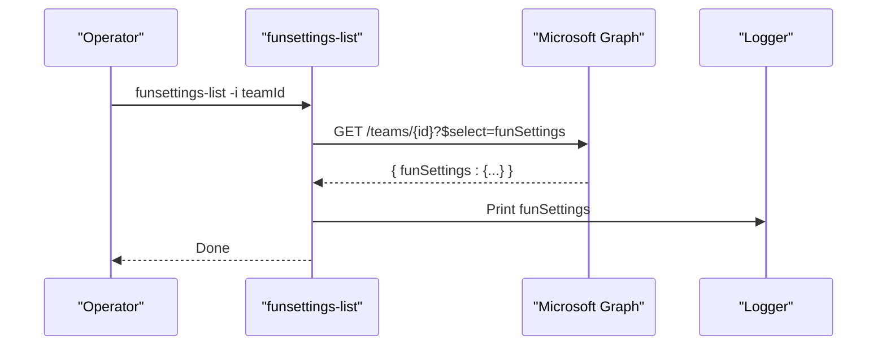

**Diagram sources**
- [funsettings-list.ts:53-72](file://src/m365/teams/commands/funsettings/funsettings-list.ts#L53-L72)

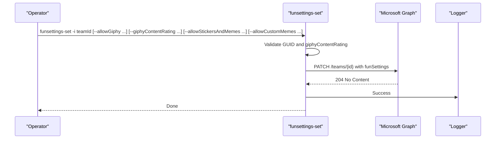

**Diagram sources**
- [funsettings-set.ts:83-135](file://src/m365/teams/commands/funsettings/funsettings-set.ts#L83-L135)

**Section sources**
- [funsettings-list.ts:1-75](file://src/m365/teams/commands/funsettings/funsettings-list.ts#L1-L75)
- [funsettings-set.ts:1-138](file://src/m365/teams/commands/funsettings/funsettings-set.ts#L1-L138)

### Guest Settings
- Purpose: Control external collaborator capabilities in a team
- List command retrieves guest settings for a given team ID
- Set command updates guest settings, including:
  - Allow guests to create/update channels
  - Allow guests to delete channels

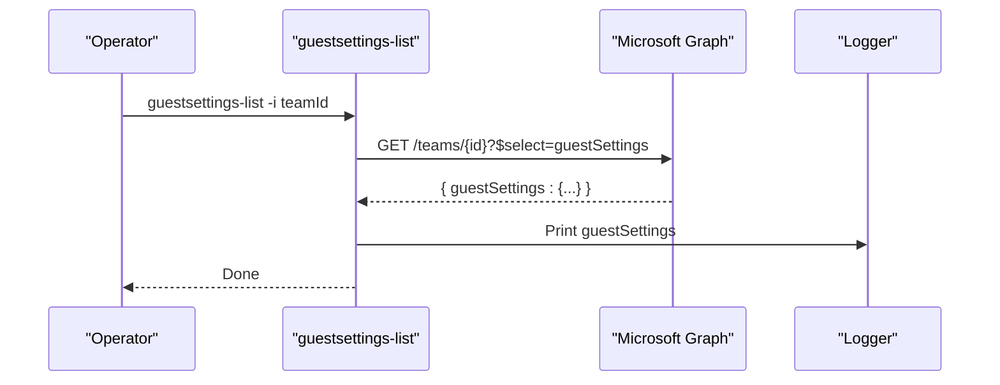

**Diagram sources**
- [guestsettings-list.ts:54-70](file://src/m365/teams/commands/guestsettings/guestsettings-list.ts#L54-L70)

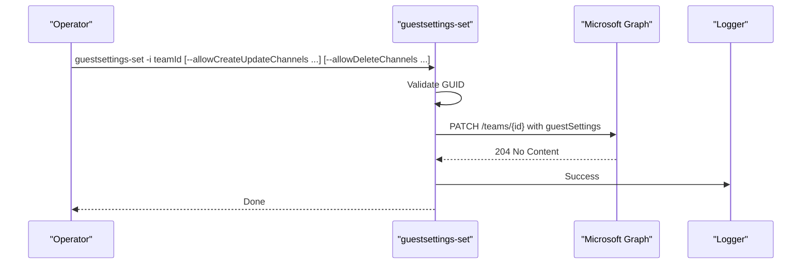

**Diagram sources**
- [guestsettings-set.ts:82-107](file://src/m365/teams/commands/guestsettings/guestsettings-set.ts#L82-L107)

**Section sources**
- [guestsettings-list.ts:1-73](file://src/m365/teams/commands/guestsettings/guestsettings-list.ts#L1-L73)
- [guestsettings-set.ts:1-110](file://src/m365/teams/commands/guestsettings/guestsettings-set.ts#L1-L110)

### Member Settings
- Purpose: Define member capabilities for apps, tabs, connectors, and channels
- List command retrieves member settings for a given team ID
- Set command updates member settings, including:
  - Allow adding/removing apps
  - Allow creating/updating channels
  - Allow creating/updating/removing connectors
  - Allow creating/updating/removing tabs
  - Allow deleting channels

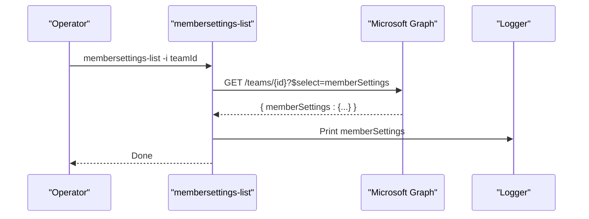

**Diagram sources**
- [membersettings-list.ts:54-70](file://src/m365/teams/commands/membersettings/membersettings-list.ts#L54-L70)

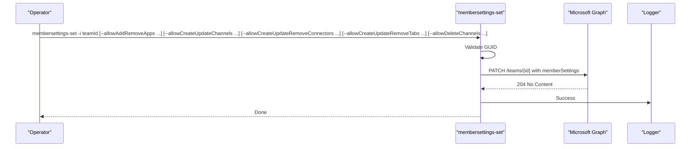

**Diagram sources**
- [membersettings-set.ts:100-125](file://src/m365/teams/commands/membersettings/membersettings-set.ts#L100-L125)

**Section sources**
- [membersettings-list.ts:1-73](file://src/m365/teams/commands/membersettings/membersettings-list.ts#L1-L73)
- [membersettings-set.ts:1-128](file://src/m365/teams/commands/membersettings/membersettings-set.ts#L1-L128)

### Messaging Settings
- Purpose: Control message editing/deleting and mention policies
- List command retrieves messaging settings for a given team ID
- Set command updates messaging settings, including:
  - Allow users to edit messages
  - Allow users to delete messages
  - Allow owners to delete messages
  - Allow team mentions
  - Allow channel mentions

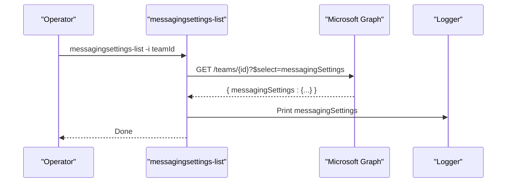

**Diagram sources**
- [messagingsettings-list.ts:54-70](file://src/m365/teams/commands/messagingsettings/messagingsettings-list.ts#L54-L70)

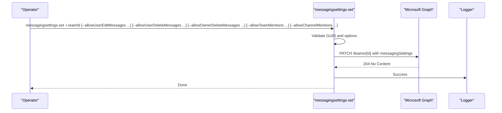

**Diagram sources**
- [messagingsettings-set.ts:112-137](file://src/m365/teams/commands/messagingsettings/messagingsettings-set.ts#L112-L137)

**Section sources**
- [messagingsettings-list.ts:1-73](file://src/m365/teams/commands/messagingsettings/messagingsettings-list.ts#L1-L73)
- [messagingsettings-set.ts:1-140](file://src/m365/teams/commands/messagingsettings/messagingsettings-set.ts#L1-L140)

### Cache Management
- Purpose: Clear local cache to resolve stale data or connectivity issues
- Command: cache-remove
- Underlying utility: cache.ts provides cache operations used by the CLI

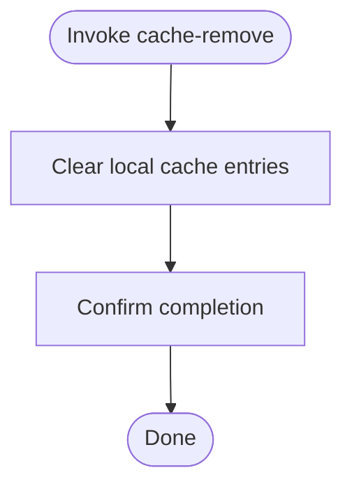

**Diagram sources**
- [cache-remove.ts](file://src/m365/teams/commands/cache/cache-remove.ts)
- [cache.ts](file://src/utils/cache.ts)

**Section sources**
- [cache-remove.ts](file://src/m365/teams/commands/cache/cache-remove.ts)
- [cache.ts](file://src/utils/cache.ts)

## Dependency Analysis
- All settings commands depend on:
  - Shared GraphCommand base class for HTTP transport and logging
  - Validation utilities for GUID and option values
  - Formatting utilities for safe URL encoding
  - Request utilities for HTTP GET/PUT operations
- Commands are cohesive around a single responsibility per setting type and share common error handling via a rejection handler.

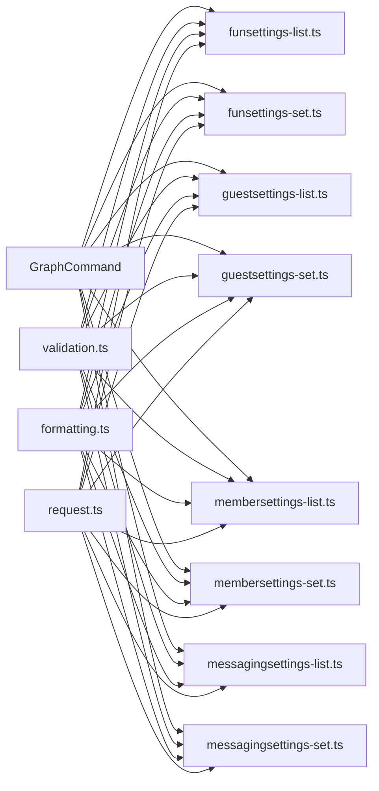

**Diagram sources**
- [funsettings-list.ts:1-75](file://src/m365/teams/commands/funsettings/funsettings-list.ts#L1-L75)
- [funsettings-set.ts:1-138](file://src/m365/teams/commands/funsettings/funsettings-set.ts#L1-L138)
- [guestsettings-list.ts:1-73](file://src/m365/teams/commands/guestsettings/guestsettings-list.ts#L1-L73)
- [guestsettings-set.ts:1-110](file://src/m365/teams/commands/guestsettings/guestsettings-set.ts#L1-L110)
- [membersettings-list.ts:1-73](file://src/m365/teams/commands/membersettings/membersettings-list.ts#L1-L73)
- [membersettings-set.ts:1-128](file://src/m365/teams/commands/membersettings/membersettings-set.ts#L1-L128)
- [messagingsettings-list.ts:1-73](file://src/m365/teams/commands/messagingsettings/messagingsettings-list.ts#L1-L73)
- [messagingsettings-set.ts:1-140](file://src/m365/teams/commands/messagingsettings/messagingsettings-set.ts#L1-L140)

**Section sources**
- [funsettings-list.ts:1-75](file://src/m365/teams/commands/funsettings/funsettings-list.ts#L1-L75)
- [funsettings-set.ts:1-138](file://src/m365/teams/commands/funsettings/funsettings-set.ts#L1-L138)
- [guestsettings-list.ts:1-73](file://src/m365/teams/commands/guestsettings/guestsettings-list.ts#L1-L73)
- [guestsettings-set.ts:1-110](file://src/m365/teams/commands/guestsettings/guestsettings-set.ts#L1-L110)
- [membersettings-list.ts:1-73](file://src/m365/teams/commands/membersettings/membersettings-list.ts#L1-L73)
- [membersettings-set.ts:1-128](file://src/m365/teams/commands/membersettings/membersettings-set.ts#L1-L128)
- [messagingsettings-list.ts:1-73](file://src/m365/teams/commands/messagingsettings/messagingsettings-list.ts#L1-L73)
- [messagingsettings-set.ts:1-140](file://src/m365/teams/commands/messagingsettings/messagingsettings-set.ts#L1-L140)

## Performance Considerations
- Prefer batch operations where possible to minimize repeated requests
- Use caching judiciously; cache-remove can be used to refresh data when stale
- Validate inputs early to avoid unnecessary network calls
- Limit verbose logging in production environments to reduce overhead

[No sources needed since this section provides general guidance]

## Troubleshooting Guide
Common issues and resolutions:
- Invalid team ID
  - Symptom: Validation error indicating the team ID is not a valid GUID
  - Resolution: Provide a valid team ID
- Duplicate boolean options in messaging settings
  - Symptom: Error indicating a duplicate option was specified
  - Resolution: Ensure only one boolean option is provided per command invocation
- Network or permission errors
  - Symptom: Rejected request or insufficient privileges
  - Resolution: Verify permissions and connectivity; retry after resolving access issues

**Section sources**
- [messagingsettings-set.ts:88-109](file://src/m365/teams/commands/messagingsettings/messagingsettings-set.ts#L88-L109)
- [funsettings-set.ts:83-100](file://src/m365/teams/commands/funsettings/funsettings-set.ts#L83-L100)
- [guestsettings-set.ts:70-80](file://src/m365/teams/commands/guestsettings/guestsettings-set.ts#L70-L80)
- [membersettings-set.ts:88-98](file://src/m365/teams/commands/membersettings/membersettings-set.ts#L88-L98)

## Conclusion
The Teams settings commands provide a consistent, validated interface to manage fun, guest, member, and messaging policies for Microsoft Teams teams via Microsoft Graph. Combined with cache management, they support reliable automation and governance workflows while ensuring compliance with tenant-wide policies and organizational standards.

[No sources needed since this section summarizes without analyzing specific files]

## Appendices

### Policy Inheritance and Tenant-Wide Settings
- These commands operate at the team level and update team-scoped settings.
- Tenant-wide policies and admin restrictions may override or constrain team-level settings.
- Always validate effective policies after applying changes.

[No sources needed since this section provides general guidance]

### Compliance Requirements
- Ensure least-privilege usage of settings commands
- Audit changes to sensitive settings (e.g., messaging deletion policies)
- Align settings with organizational and regulatory requirements

[No sources needed since this section provides general guidance]

### Practical Automation and Governance Workflows
- Automated baseline deployment
  - Use list commands to audit current settings
  - Use set commands to enforce baselines across teams
- Change management
  - Track changes with logs and version control
  - Roll back or adjust settings using set commands
- Monitoring and remediation
  - Schedule periodic audits with list commands
  - Trigger cache-remove when encountering stale data

[No sources needed since this section provides general guidance]