# Team Administration

<cite>
**Referenced Files in This Document**
- [commands.ts](file://src/m365/teams/commands.ts)
- [team-add.ts](file://src/m365/teams/commands/team/team-add.ts)
- [team-set.ts](file://src/m365/teams/commands/team/team-set.ts)
- [team-get.ts](file://src/m365/teams/commands/team/team-get.ts)
- [team-list.ts](file://src/m365/teams/commands/team/team-list.ts)
- [team-remove.ts](file://src/m365/teams/commands/team/team-remove.ts)
- [team-archive.ts](file://src/m365/teams/commands/team/team-archive.ts)
- [team-unarchive.ts](file://src/m365/teams/commands/team/team-unarchive.ts)
- [team-clone.ts](file://src/m365/teams/commands/team/team-clone.ts)
- [team-add.mdx](file://docs/docs/cmd/teams/team/team-add.mdx)
- [team-set.mdx](file://docs/docs/cmd/teams/team/team-set.mdx)
- [team-get.mdx](file://docs/docs/cmd/teams/team/team-get.mdx)
</cite>

## Table of Contents
1. [Introduction](#introduction)
2. [Project Structure](#project-structure)
3. [Core Components](#core-components)
4. [Architecture Overview](#architecture-overview)
5. [Detailed Component Analysis](#detailed-component-analysis)
6. [Dependency Analysis](#dependency-analysis)
7. [Performance Considerations](#performance-considerations)
8. [Troubleshooting Guide](#troubleshooting-guide)
9. [Conclusion](#conclusion)
10. [Appendices](#appendices)

## Introduction
This document provides comprehensive guidance for Microsoft Teams team administration using the CLI. It covers team creation, configuration, lifecycle management, listing and filtering, removal, archiving/unarchiving, and cloning. It also explains how team properties and settings are managed via team-add, team-set, and team-get, and how team-clone enables template-based provisioning. Practical examples demonstrate automation scenarios, bulk operations, and integration with Microsoft 365 Groups. Permissions requirements, naming conventions, and best practices are included to support safe and scalable administration.

## Project Structure
The Teams team administration commands are organized under the Teams module. The command identifiers are centrally defined, and individual command handlers implement the logic for each operation.

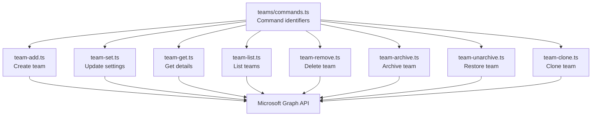

**Diagram sources**
- [commands.ts:62-70](file://src/m365/teams/commands.ts#L62-L70)
- [team-add.ts:240-279](file://src/m365/teams/commands/team/team-add.ts#L240-L279)
- [team-set.ts:119-134](file://src/m365/teams/commands/team/team-set.ts#L119-L134)
- [team-get.ts:77-91](file://src/m365/teams/commands/team/team-get.ts#L77-L91)
- [team-list.ts:122-144](file://src/m365/teams/commands/team/team-list.ts#L122-L144)
- [team-remove.ts:99-107](file://src/m365/teams/commands/team/team-remove.ts#L99-L107)
- [team-archive.ts:104-116](file://src/m365/teams/commands/team/team-archive.ts#L104-L116)
- [team-unarchive.ts:86-95](file://src/m365/teams/commands/team/team-unarchive.ts#L86-L95)
- [team-clone.ts:126-134](file://src/m365/teams/commands/team/team-clone.ts#L126-L134)

**Section sources**
- [commands.ts:1-80](file://src/m365/teams/commands.ts#L1-L80)

## Core Components
- team-add: Creates a new team, supports templates, optional owner/member assignment, and asynchronous provisioning with optional waiting.
- team-set: Updates team properties such as name, description, mail nickname, classification, and visibility.
- team-get: Retrieves detailed information about a team by ID or display name.
- team-list: Lists teams across the tenant with filtering by joined/associated membership and user context.
- team-remove: Deletes a team after confirmation or forced execution.
- team-archive: Archives a team with optional SharePoint site read-only setting.
- team-unarchive: Restores an archived team.
- team-clone: Clones an existing team with configurable parts to clone and optional overrides for description/classification/visibility.

**Section sources**
- [team-add.ts:32-50](file://src/m365/teams/commands/team/team-add.ts#L32-L50)
- [team-set.ts:22-44](file://src/m365/teams/commands/team/team-set.ts#L22-L44)
- [team-get.ts:20-36](file://src/m365/teams/commands/team/team-get.ts#L20-L36)
- [team-list.ts:22-43](file://src/m365/teams/commands/team/team-list.ts#L22-L43)
- [team-remove.ts:26-42](file://src/m365/teams/commands/team/team-remove.ts#L26-L42)
- [team-archive.ts:25-41](file://src/m365/teams/commands/team/team-archive.ts#L25-L41)
- [team-unarchive.ts:24-39](file://src/m365/teams/commands/team/team-unarchive.ts#L24-L39)
- [team-clone.ts:22-38](file://src/m365/teams/commands/team/team-clone.ts#L22-L38)

## Architecture Overview
The team administration commands rely on Microsoft Graph APIs to manage Microsoft Teams teams. They follow a consistent pattern:
- Parse and validate options
- Build request payloads
- Call Graph endpoints
- Handle asynchronous operations (where applicable)
- Log structured output

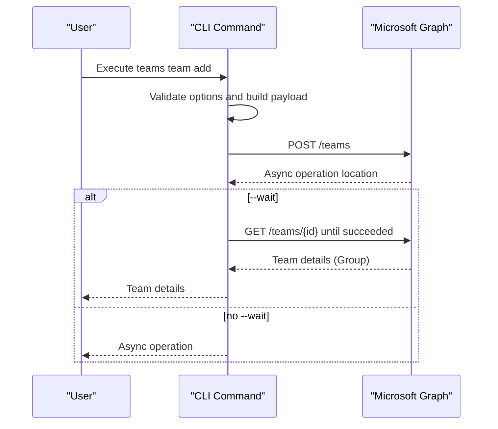

**Diagram sources**
- [team-add.ts:183-279](file://src/m365/teams/commands/team/team-add.ts#L183-L279)
- [team-add.ts:295-313](file://src/m365/teams/commands/team/team-add.ts#L295-L313)

## Detailed Component Analysis

### Team Creation (team-add)
- Purpose: Create a new Microsoft Teams team using a standard template or a custom template payload.
- Key behaviors:
  - Accepts template JSON via file reference or inline JSON.
  - Supports specifying owners and members via UPNs, email addresses, or IDs.
  - Enforces application permissions requirement to specify at least one owner.
  - Handles asynchronous provisioning and optional waiting for completion.
  - Adds members after initial provisioning when requested.
- Important options:
  - name, description, template, wait, ownerUserNames/ownerIds/ownerEmails, memberUserNames/memberIds/memberEmails.

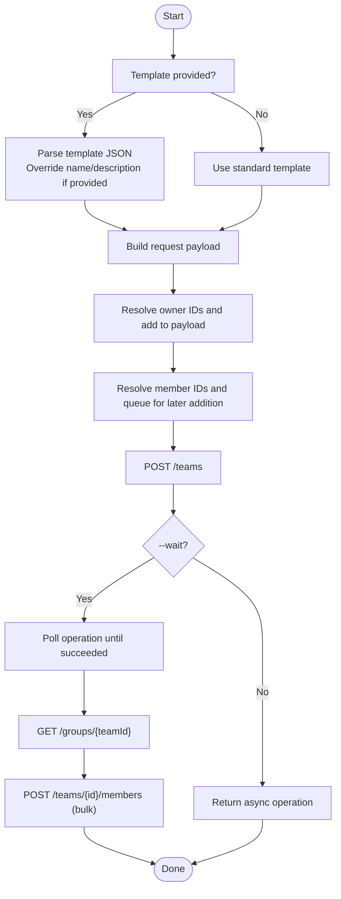

**Diagram sources**
- [team-add.ts:190-279](file://src/m365/teams/commands/team/team-add.ts#L190-L279)
- [team-add.ts:295-330](file://src/m365/teams/commands/team/team-add.ts#L295-L330)

**Section sources**
- [team-add.ts:19-50](file://src/m365/teams/commands/team/team-add.ts#L19-L50)
- [team-add.ts:183-279](file://src/m365/teams/commands/team/team-add.ts#L183-L279)
- [team-add.mdx:15-47](file://docs/docs/cmd/teams/team/team-add.mdx#L15-L47)

### Team Configuration (team-set)
- Purpose: Update team properties such as display name, description, mail nickname, classification, and visibility.
- Key behaviors:
  - Validates GUID for team ID and visibility values.
  - Patches the underlying Microsoft 365 Group resource.

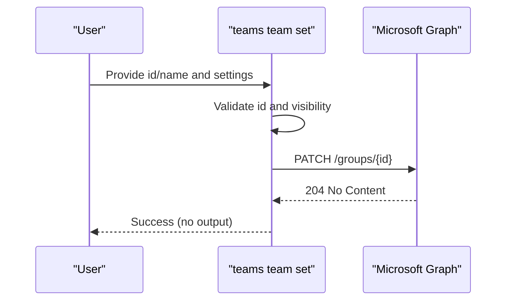

**Diagram sources**
- [team-set.ts:116-134](file://src/m365/teams/commands/team/team-set.ts#L116-L134)

**Section sources**
- [team-set.ts:13-28](file://src/m365/teams/commands/team/team-set.ts#L13-L28)
- [team-set.ts:78-94](file://src/m365/teams/commands/team/team-set.ts#L78-L94)
- [team-set.ts:116-134](file://src/m365/teams/commands/team/team-set.ts#L116-L134)
- [team-set.mdx:13-33](file://docs/docs/cmd/teams/team/team-set.mdx#L13-L33)

### Team Details Retrieval (team-get)
- Purpose: Retrieve detailed information about a team by ID or display name.
- Key behaviors:
  - Accepts id or name (mutually exclusive).
  - Uses Graph endpoint for team details.

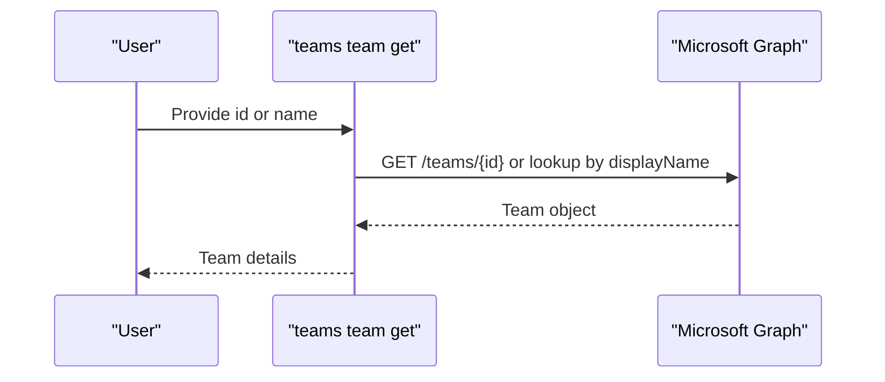

**Diagram sources**
- [team-get.ts:74-96](file://src/m365/teams/commands/team/team-get.ts#L74-L96)

**Section sources**
- [team-get.ts:15-28](file://src/m365/teams/commands/team/team-get.ts#L15-L28)
- [team-get.ts:74-96](file://src/m365/teams/commands/team/team-get.ts#L74-L96)
- [team-get.mdx:15-23](file://docs/docs/cmd/teams/team/team-get.mdx#L15-L23)

### Team Listing and Filtering (team-list)
- Purpose: List teams across the tenant with optional filters for joined or associated teams and user context.
- Key behaviors:
  - Tenant-wide listing via $filter on resourceProvisioningOptions.
  - Batch retrieval of team details to minimize API calls.
  - Sorting by display name.

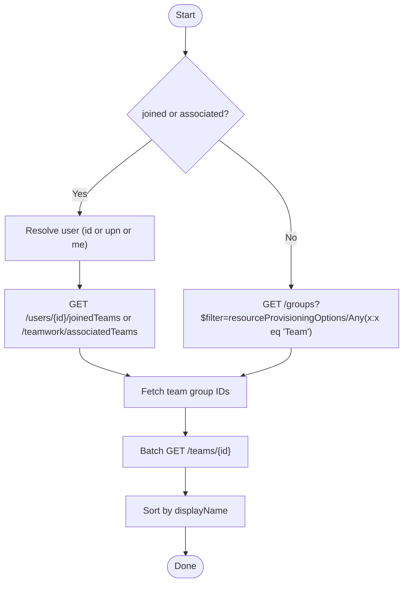

**Diagram sources**
- [team-list.ts:110-148](file://src/m365/teams/commands/team/team-list.ts#L110-L148)
- [team-list.ts:150-194](file://src/m365/teams/commands/team/team-list.ts#L150-L194)

**Section sources**
- [team-list.ts:15-33](file://src/m365/teams/commands/team/team-list.ts#L15-L33)
- [team-list.ts:73-104](file://src/m365/teams/commands/team/team-list.ts#L73-L104)
- [team-list.ts:110-148](file://src/m365/teams/commands/team/team-list.ts#L110-L148)

### Team Removal (team-remove)
- Purpose: Remove a team after confirmation or forced execution.
- Key behaviors:
  - Resolves team ID by ID or display name.
  - Confirms deletion unless forced.
  - Calls DELETE on the Group resource.

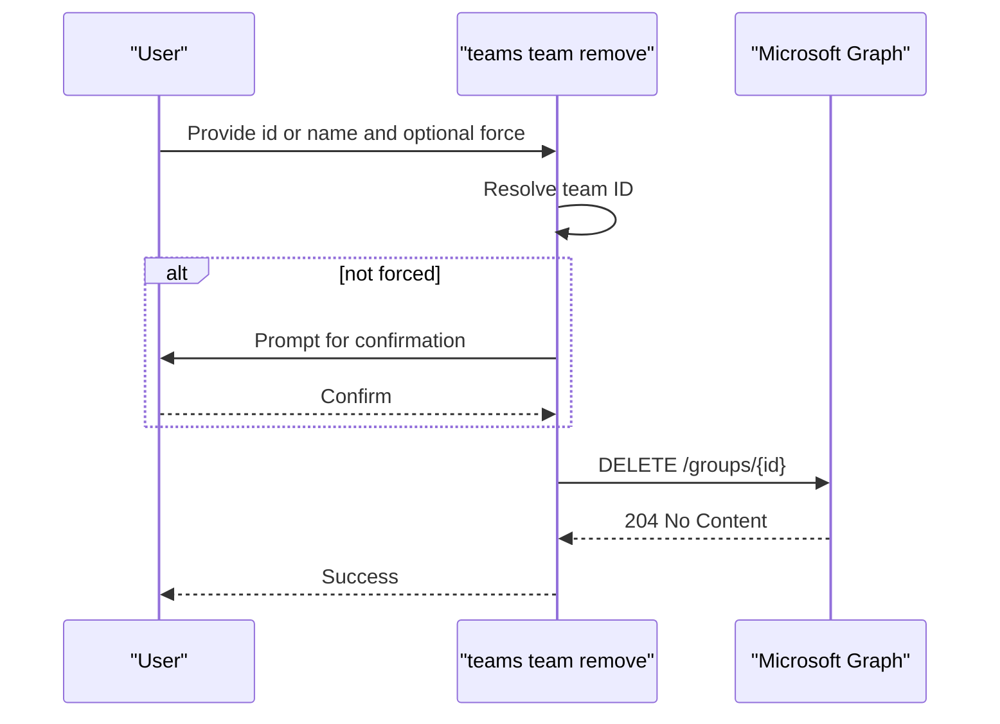

**Diagram sources**
- [team-remove.ts:95-124](file://src/m365/teams/commands/team/team-remove.ts#L95-L124)

**Section sources**
- [team-remove.ts:20-42](file://src/m365/teams/commands/team/team-remove.ts#L20-L42)
- [team-remove.ts:95-124](file://src/m365/teams/commands/team/team-remove.ts#L95-L124)

### Team Archive/Unarchive (team-archive, team-unarchive)
- Purpose: Archive an active team or restore an archived team.
- Key behaviors:
  - Archive supports optional SharePoint site read-only setting for members.
  - Both commands resolve team ID by ID or display name.

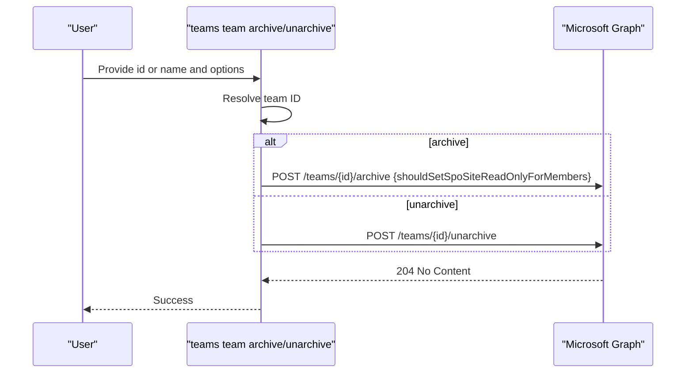

**Diagram sources**
- [team-archive.ts:99-121](file://src/m365/teams/commands/team/team-archive.ts#L99-L121)
- [team-unarchive.ts:81-100](file://src/m365/teams/commands/team/team-unarchive.ts#L81-L100)

**Section sources**
- [team-archive.ts:19-41](file://src/m365/teams/commands/team/team-archive.ts#L19-L41)
- [team-archive.ts:99-121](file://src/m365/teams/commands/team/team-archive.ts#L99-L121)
- [team-unarchive.ts:19-39](file://src/m365/teams/commands/team/team-unarchive.ts#L19-L39)
- [team-unarchive.ts:81-100](file://src/m365/teams/commands/team/team-unarchive.ts#L81-L100)

### Team Cloning (team-clone)
- Purpose: Create a clone of an existing team with configurable parts to clone and optional overrides.
- Key behaviors:
  - Requires team ID and target display name.
  - Supports partsToClone: apps, channels, members, settings, tabs.
  - Generates a mail nickname internally due to API behavior.

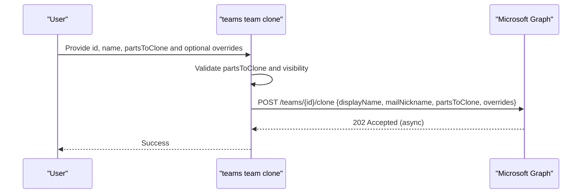

**Diagram sources**
- [team-clone.ts:107-142](file://src/m365/teams/commands/team/team-clone.ts#L107-L142)

**Section sources**
- [team-clone.ts:13-38](file://src/m365/teams/commands/team/team-clone.ts#L13-L38)
- [team-clone.ts:74-105](file://src/m365/teams/commands/team/team-clone.ts#L74-L105)
- [team-clone.ts:107-142](file://src/m365/teams/commands/team/team-clone.ts#L107-L142)

### Conceptual Overview
- Permissions and ownership:
  - Application permissions require specifying at least one owner during creation.
  - Ownership and membership assignment leverage user identifiers (UPN, email, or ID).
- Naming and metadata:
  - Visibility accepts Private or Public.
  - Mail nickname generation is handled internally for cloning due to API constraints.
- Best practices:
  - Use templates for standardized configurations.
  - Prefer batched operations for listing and member additions.
  - Use archive/unarchive for lifecycle transitions and compliance scenarios.

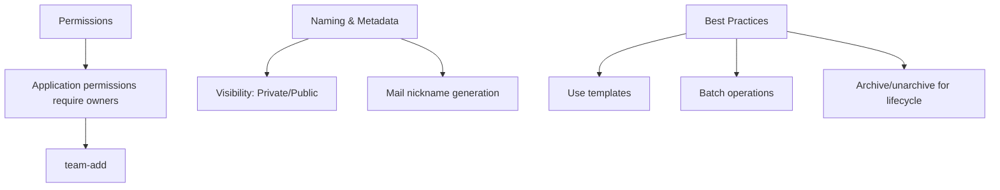

[No sources needed since this diagram shows conceptual workflow, not actual code structure]

[No sources needed since this section doesn't analyze specific source files]

## Dependency Analysis
The Teams team commands depend on shared utilities and Microsoft Graph for operations. The following diagram highlights key dependencies and relationships.

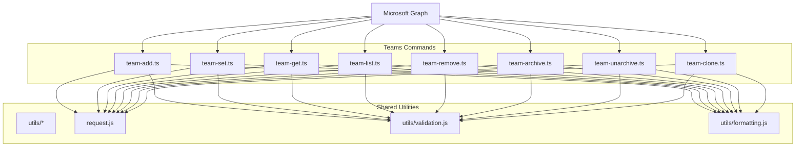

**Diagram sources**
- [team-add.ts:1-14](file://src/m365/teams/commands/team/team-add.ts#L1-L14)
- [team-set.ts:1-7](file://src/m365/teams/commands/team/team-set.ts#L1-L7)
- [team-get.ts:1-9](file://src/m365/teams/commands/team/team-get.ts#L1-L9)
- [team-list.ts:1-9](file://src/m365/teams/commands/team/team-list.ts#L1-L9)
- [team-remove.ts:1-10](file://src/m365/teams/commands/team/team-remove.ts#L1-L10)
- [team-archive.ts:1-9](file://src/m365/teams/commands/team/team-archive.ts#L1-L9)
- [team-unarchive.ts:1-9](file://src/m365/teams/commands/team/team-unarchive.ts#L1-L9)
- [team-clone.ts:1-7](file://src/m365/teams/commands/team/team-clone.ts#L1-L7)

**Section sources**
- [team-add.ts:1-14](file://src/m365/teams/commands/team/team-add.ts#L1-L14)
- [team-set.ts:1-7](file://src/m365/teams/commands/team/team-set.ts#L1-L7)
- [team-get.ts:1-9](file://src/m365/teams/commands/team/team-get.ts#L1-L9)
- [team-list.ts:1-9](file://src/m365/teams/commands/team/team-list.ts#L1-L9)
- [team-remove.ts:1-10](file://src/m365/teams/commands/team/team-remove.ts#L1-L10)
- [team-archive.ts:1-9](file://src/m365/teams/commands/team/team-archive.ts#L1-L9)
- [team-unarchive.ts:1-9](file://src/m365/teams/commands/team/team-unarchive.ts#L1-L9)
- [team-clone.ts:1-7](file://src/m365/teams/commands/team/team-clone.ts#L1-L7)

## Performance Considerations
- Batch operations:
  - team-list uses $batch to fetch team details in chunks, reducing API round trips.
- Asynchronous provisioning:
  - team-add optionally waits for provisioning completion; otherwise returns an async operation for later polling.
- Member addition:
  - Members are added after initial provisioning to avoid blocking the primary creation flow.

[No sources needed since this section provides general guidance]

## Troubleshooting Guide
- Validation errors:
  - GUID validation failures for team IDs.
  - Invalid visibility values (only Private and Public are accepted).
  - Invalid partsToClone values for cloning.
- Ownership requirements:
  - Application permissions require specifying at least one owner during creation.
- Confirmation prompts:
  - team-remove requires confirmation unless forced.
- Asynchronous operations:
  - team-add returns an async operation when not using --wait; poll until status succeeds.

**Section sources**
- [team-set.ts:78-94](file://src/m365/teams/commands/team/team-set.ts#L78-L94)
- [team-clone.ts:74-105](file://src/m365/teams/commands/team/team-clone.ts#L74-L105)
- [team-add.ts:183-188](file://src/m365/teams/commands/team/team-add.ts#L183-L188)
- [team-remove.ts:114-123](file://src/m365/teams/commands/team/team-remove.ts#L114-L123)

## Conclusion
The Teams team administration commands provide a robust foundation for provisioning, managing, and operating Microsoft Teams teams at scale. By leveraging templates, batch operations, and lifecycle transitions (archive/unarchive), administrators can automate common tasks while maintaining control over permissions, naming, and metadata. The documented examples and best practices enable safe and efficient automation across organizations.

## Appendices
- Practical examples and response samples are available in the command documentation pages:
  - [team-add.mdx](file://docs/docs/cmd/teams/team/team-add.mdx)
  - [team-set.mdx](file://docs/docs/cmd/teams/team/team-set.mdx)
  - [team-get.mdx](file://docs/docs/cmd/teams/team/team-get.mdx)

[No sources needed since this section aggregates links without analyzing specific files]