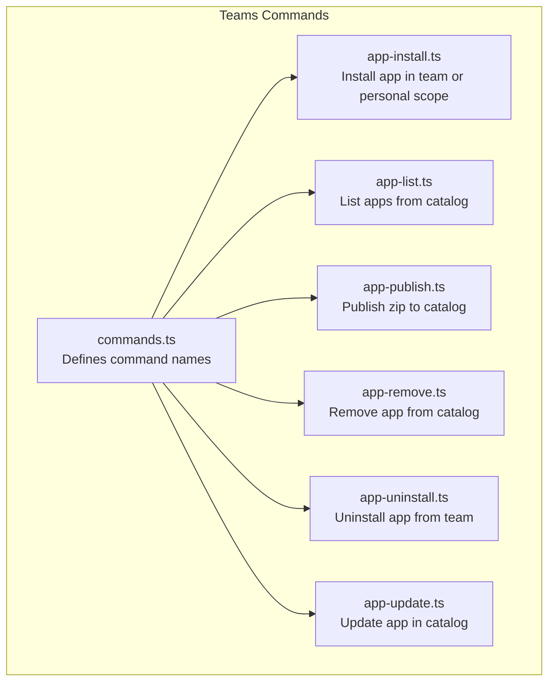
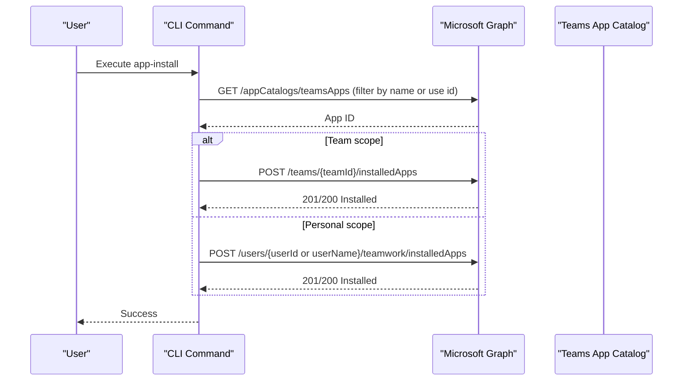
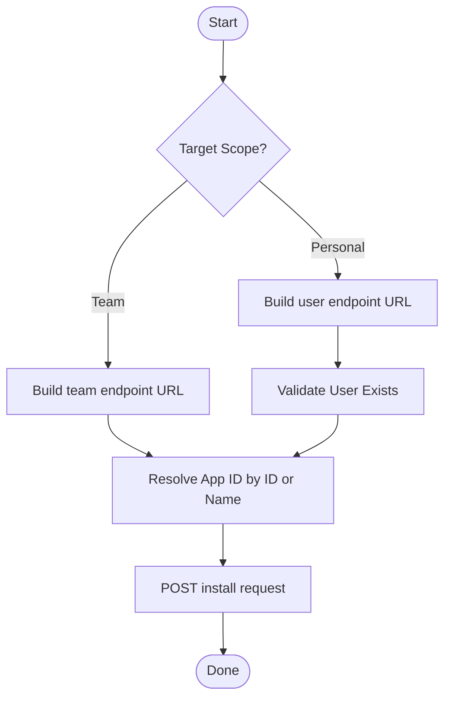
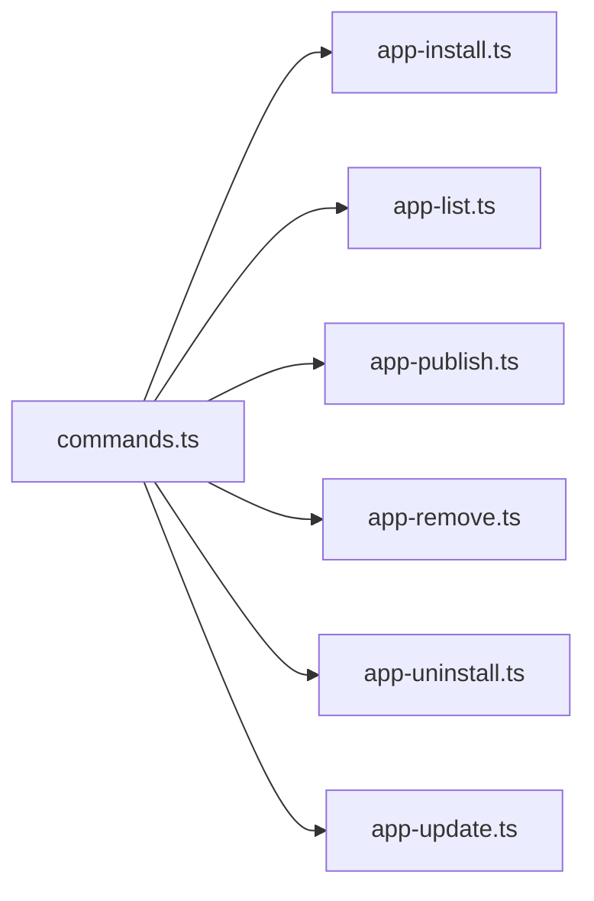

# Teams App Management

<cite>
**Referenced Files in This Document**
- [commands.ts](file://src/m365/teams/commands.ts)
- [app-install.ts](file://src/m365/teams/commands/app/app-install.ts)
- [app-list.ts](file://src/m365/teams/commands/app/app-list.ts)
- [app-publish.ts](file://src/m365/teams/commands/app/app-publish.ts)
- [app-remove.ts](file://src/m365/teams/commands/app/app-remove.ts)
- [app-uninstall.ts](file://src/m365/teams/commands/app/app-uninstall.ts)
- [app-update.ts](file://src/m365/teams/commands/app/app-update.ts)
- [user-app-add.mdx](file://docs/docs/cmd/teams/user/user-app-add.mdx)
- [user-app-list.mdx](file://docs/docs/cmd/teams/user/user-app-list.mdx)
- [user-app-remove.mdx](file://docs/docs/cmd/teams/user/user-app-remove.mdx)
- [user-app-upgrade.mdx](file://docs/docs/cmd/teams/user/user-app-upgrade.mdx)
- [app-install.mdx](file://docs/docs/cmd/teams/app/app-install.mdx)
- [app-uninstall.mdx](file://docs/docs/cmd/teams/app/app-uninstall.mdx)
- [release-notes.mdx](file://docs/docs/about/release-notes.mdx)
</cite>

## Table of Contents
1. [Introduction](#introduction)
2. [Project Structure](#project-structure)
3. [Core Components](#core-components)
4. [Architecture Overview](#architecture-overview)
5. [Detailed Component Analysis](#detailed-component-analysis)
6. [Dependency Analysis](#dependency-analysis)
7. [Performance Considerations](#performance-considerations)
8. [Troubleshooting Guide](#troubleshooting-guide)
9. [Conclusion](#conclusion)
10. [Appendices](#appendices)

## Introduction
This document explains Microsoft Teams app management through the CLI, focusing on:
- Team-scoped app lifecycle: install, list, publish, remove, uninstall, and update
- User-level personal app management: add, list, remove, and upgrade personal apps
- Distribution strategies, permissions, and compliance considerations
- Practical automation examples for app catalog management and user provisioning
- Validation, approval workflows, and tenant-wide policies
- Integration with Microsoft AppSource and custom app development workflows

## Project Structure
Teams app management commands are organized under the Teams module. The command identifiers are centrally defined and implemented as individual command handlers that communicate with the Microsoft Graph Teams endpoint.

**Diagram sources**
- [commands.ts:1-80](file://src/m365/teams/commands.ts#L1-L80)
- [app-install.ts:1-181](file://src/m365/teams/commands/app/app-install.ts#L1-L181)
- [app-list.ts:1-87](file://src/m365/teams/commands/app/app-list.ts#L1-L87)
- [app-publish.ts:1-85](file://src/m365/teams/commands/app/app-publish.ts#L1-L85)
- [app-remove.ts:1-147](file://src/m365/teams/commands/app/app-remove.ts#L1-L147)
- [app-uninstall.ts:1-104](file://src/m365/teams/commands/app/app-uninstall.ts#L1-L104)
- [app-update.ts:1-144](file://src/m365/teams/commands/app/app-update.ts#L1-L144)

**Section sources**
- [commands.ts:1-80](file://src/m365/teams/commands.ts#L1-L80)

## Core Components
- Command identifiers: Centralized in the Teams commands registry.
- Team app lifecycle commands:
  - Install app in a team or user’s personal scope
  - List apps from the catalog with filtering
  - Publish a zip package to the organization catalog
  - Remove an app from the catalog
  - Uninstall an app from a specific team
  - Update an existing app in the catalog
- User app commands:
  - Add personal app for a user
  - List personal apps for a user
  - Remove personal app for a user
  - Upgrade personal app for a user

These commands rely on Microsoft Graph APIs for Teams app catalog and installation operations.

**Section sources**
- [commands.ts:1-80](file://src/m365/teams/commands.ts#L1-L80)
- [app-install.ts:23-39](file://src/m365/teams/commands/app/app-install.ts#L23-L39)
- [app-list.ts:16-37](file://src/m365/teams/commands/app/app-list.ts#L16-L37)
- [app-publish.ts:17-31](file://src/m365/teams/commands/app/app-publish.ts#L17-L31)
- [app-remove.ts:20-36](file://src/m365/teams/commands/app/app-remove.ts#L20-L36)
- [app-uninstall.ts:19-34](file://src/m365/teams/commands/app/app-uninstall.ts#L19-L34)
- [app-update.ts:22-38](file://src/m365/teams/commands/app/app-update.ts#L22-L38)

## Architecture Overview
The Teams app management commands follow a consistent pattern:
- Parse and validate options
- Resolve app identity (by ID or name)
- Call Microsoft Graph endpoints for catalog or installation operations
- Handle errors and telemetry

**Diagram sources**
- [app-install.ts:90-120](file://src/m365/teams/commands/app/app-install.ts#L90-L120)
- [app-install.ts:150-177](file://src/m365/teams/commands/app/app-install.ts#L150-L177)

**Section sources**
- [app-install.ts:90-120](file://src/m365/teams/commands/app/app-install.ts#L90-L120)
- [app-install.ts:150-177](file://src/m365/teams/commands/app/app-install.ts#L150-L177)

## Detailed Component Analysis

### Install App (Team or Personal)
Purpose: Install a Teams app from the catalog into a team or a user’s personal scope.

Key behaviors:
- Accepts either app ID or app name
- Accepts team ID or user identifier (ID or UPN)
- Validates GUIDs and user existence
- Resolves app ID by name if needed
- Posts to appropriate endpoint based on target scope

**Diagram sources**
- [app-install.ts:90-120](file://src/m365/teams/commands/app/app-install.ts#L90-L120)
- [app-install.ts:124-148](file://src/m365/teams/commands/app/app-install.ts#L124-L148)
- [app-install.ts:150-177](file://src/m365/teams/commands/app/app-install.ts#L150-L177)

**Section sources**
- [app-install.ts:15-21](file://src/m365/teams/commands/app/app-install.ts#L15-L21)
- [app-install.ts:63-88](file://src/m365/teams/commands/app/app-install.ts#L63-L88)
- [app-install.ts:90-120](file://src/m365/teams/commands/app/app-install.ts#L90-L120)
- [app-install.ts:124-148](file://src/m365/teams/commands/app/app-install.ts#L124-L148)
- [app-install.ts:150-177](file://src/m365/teams/commands/app/app-install.ts#L150-L177)

### List Apps (Catalog)
Purpose: List apps from the Teams app catalog with optional filtering by distribution method.

Key behaviors:
- Supports filtering by distributionMethod: store, organization, sideloaded
- Uses OData to fetch all items
- Outputs default properties suitable for reporting

**Section sources**
- [app-list.ts:12-14](file://src/m365/teams/commands/app/app-list.ts#L12-L14)
- [app-list.ts:17-67](file://src/m365/teams/commands/app/app-list.ts#L17-L67)
- [app-list.ts:69-84](file://src/m365/teams/commands/app/app-list.ts#L69-L84)

### Publish App (Organization Catalog)
Purpose: Upload a zip package to publish a Teams app to the organization catalog.

Key behaviors:
- Validates file path and ensures it is a file
- Sends HTTP POST with content-type application/zip
- Returns published app metadata

**Section sources**
- [app-publish.ts:13-15](file://src/m365/teams/commands/app/app-publish.ts#L13-L15)
- [app-publish.ts:41-57](file://src/m365/teams/commands/app/app-publish.ts#L41-L57)
- [app-publish.ts:59-82](file://src/m365/teams/commands/app/app-publish.ts#L59-L82)

### Remove App (Organization Catalog)
Purpose: Remove an app from the organization catalog.

Key behaviors:
- Accepts app ID or name
- Confirms deletion unless forced
- Deletes by resolved app ID

**Section sources**
- [app-remove.ts:14-18](file://src/m365/teams/commands/app/app-remove.ts#L14-L18)
- [app-remove.ts:62-72](file://src/m365/teams/commands/app/app-remove.ts#L62-L72)
- [app-remove.ts:78-111](file://src/m365/teams/commands/app/app-remove.ts#L78-L111)
- [app-remove.ts:113-144](file://src/m365/teams/commands/app/app-remove.ts#L113-L144)

### Uninstall App (Team)
Purpose: Uninstall an app from a specific team.

Key behaviors:
- Requires app ID and team ID
- Confirms uninstall unless forced
- Deletes from team’s installed apps

**Section sources**
- [app-uninstall.ts:13-17](file://src/m365/teams/commands/app/app-uninstall.ts#L13-L17)
- [app-uninstall.ts:58-68](file://src/m365/teams/commands/app/app-uninstall.ts#L58-L68)
- [app-uninstall.ts:70-101](file://src/m365/teams/commands/app/app-uninstall.ts#L70-L101)

### Update App (Organization Catalog)
Purpose: Update an existing Teams app in the organization catalog.

Key behaviors:
- Accepts app ID or name and file path
- Validates file path and ensures it is a file
- Puts zip content to update the app

**Section sources**
- [app-update.ts:16-20](file://src/m365/teams/commands/app/app-update.ts#L16-L20)
- [app-update.ts:63-83](file://src/m365/teams/commands/app/app-update.ts#L63-L83)
- [app-update.ts:89-112](file://src/m365/teams/commands/app/app-update.ts#L89-L112)
- [app-update.ts:114-141](file://src/m365/teams/commands/app/app-update.ts#L114-L141)

### User-Level App Management
The CLI supports managing personal apps for users:
- Add personal app for a user
- List personal apps for a user
- Remove personal app for a user
- Upgrade personal app for a user

Documentation references:
- [user-app-add.mdx](file://docs/docs/cmd/teams/user/user-app-add.mdx)
- [user-app-list.mdx](file://docs/docs/cmd/teams/user/user-app-list.mdx)
- [user-app-remove.mdx](file://docs/docs/cmd/teams/user/user-app-remove.mdx)
- [user-app-upgrade.mdx](file://docs/docs/cmd/teams/user/user-app-upgrade.mdx)

Release notes confirm availability and enhancements:
- [release-notes.mdx](file://docs/docs/about/release-notes.mdx)

**Section sources**
- [user-app-add.mdx](file://docs/docs/cmd/teams/user/user-app-add.mdx)
- [user-app-list.mdx](file://docs/docs/cmd/teams/user/user-app-list.mdx)
- [user-app-remove.mdx](file://docs/docs/cmd/teams/user/user-app-remove.mdx)
- [user-app-upgrade.mdx](file://docs/docs/cmd/teams/user/user-app-upgrade.mdx)
- [release-notes.mdx](file://docs/docs/about/release-notes.mdx)

## Dependency Analysis
- Command identifiers are centralized and consumed by command handlers.
- Each command handler extends a shared GraphCommand base, ensuring consistent validation, telemetry, and error handling.
- Commands interact with Microsoft Graph endpoints for:
  - App catalog operations (list, publish, remove, update)
  - Team installation/uninstallation
  - Personal app installation/validation

**Diagram sources**
- [commands.ts:1-80](file://src/m365/teams/commands.ts#L1-L80)
- [app-install.ts:1-10](file://src/m365/teams/commands/app/app-install.ts#L1-L10)
- [app-list.ts:1-6](file://src/m365/teams/commands/app/app-list.ts#L1-L6)
- [app-publish.ts:1-7](file://src/m365/teams/commands/app/app-publish.ts#L1-L7)
- [app-remove.ts:1-8](file://src/m365/teams/commands/app/app-remove.ts#L1-L8)
- [app-uninstall.ts:1-7](file://src/m365/teams/commands/app/app-uninstall.ts#L1-L7)
- [app-update.ts:1-10](file://src/m365/teams/commands/app/app-update.ts#L1-L10)

**Section sources**
- [commands.ts:1-80](file://src/m365/teams/commands.ts#L1-L80)

## Performance Considerations
- Batch operations: Prefer filtering by distributionMethod when listing apps to reduce payload size.
- Minimize repeated lookups: When automating, resolve app IDs once and reuse them across operations.
- Network efficiency: Use file paths directly without unnecessary transformations to avoid I/O overhead during publish/update.
- Concurrency: Avoid concurrent updates to the same app to prevent conflicts.

## Troubleshooting Guide
Common issues and resolutions:
- Invalid GUIDs: Ensure teamId, userId, and app IDs are valid GUIDs.
- App not found: When using name, verify uniqueness; otherwise use ID or handle multiple results resolution.
- User not found: When targeting personal scope with userId, ensure the user exists; the command validates user existence.
- File path errors: Verify the file path points to a zip file and is accessible.
- Force confirmation: Use force flags to bypass interactive prompts in automation scenarios.

**Section sources**
- [app-install.ts:63-88](file://src/m365/teams/commands/app/app-install.ts#L63-L88)
- [app-install.ts:124-148](file://src/m365/teams/commands/app/app-install.ts#L124-L148)
- [app-list.ts:56-67](file://src/m365/teams/commands/app/app-list.ts#L56-L67)
- [app-publish.ts:41-57](file://src/m365/teams/commands/app/app-publish.ts#L41-L57)
- [app-remove.ts:62-72](file://src/m365/teams/commands/app/app-remove.ts#L62-L72)
- [app-uninstall.ts:58-68](file://src/m365/teams/commands/app/app-uninstall.ts#L58-L68)
- [app-update.ts:63-83](file://src/m365/teams/commands/app/app-update.ts#L63-L83)

## Conclusion
The Teams app management commands provide a robust, consistent interface for catalog operations and app lifecycle management across teams and personal scopes. By leveraging centralized command identifiers, shared validation, and Microsoft Graph integrations, administrators can automate deployment, enforce governance, and maintain compliance across their tenant.

## Appendices

### Practical Examples

- Automated app deployment to a team
  - Steps:
    - Publish app package to catalog
    - Install app into target team
  - References:
    - [app-publish.mdx](file://docs/docs/cmd/teams/app/app-publish.mdx)
    - [app-install.mdx](file://docs/docs/cmd/teams/app/app-install.mdx)

- User app provisioning
  - Steps:
    - Add personal app for a user
    - List personal apps for verification
  - References:
    - [user-app-add.mdx](file://docs/docs/cmd/teams/user/user-app-add.mdx)
    - [user-app-list.mdx](file://docs/docs/cmd/teams/user/user-app-list.mdx)

- App catalog management
  - Steps:
    - List apps with distributionMethod filter
    - Update existing app package
    - Remove app from catalog (with force)
  - References:
    - [app-list.mdx](file://docs/docs/cmd/teams/app/app-list.mdx)
    - [app-update.mdx](file://docs/docs/cmd/teams/app/app-update.mdx)
    - [app-remove.mdx](file://docs/docs/cmd/teams/app/app-remove.mdx)

### Permission Requirements and Compliance
- Permissions:
  - Publishing, listing, updating, and removing apps require appropriate Microsoft Graph permissions scoped to the Teams app catalog.
  - Installing/uninstalling apps requires permissions to manage team installations.
- Compliance:
  - Enforce distributionMethod filtering to align with organizational policies.
  - Use force flags judiciously in production environments.
  - Maintain audit logs of catalog changes and installations.

### Validation, Approval Workflows, and Tenant Policies
- Validation:
  - Use ID-based operations for deterministic behavior.
  - Validate user existence before personal app installation.
- Approval workflows:
  - Integrate with CI/CD to gate publish/update actions.
  - Require approvals before removing apps from catalog.
- Tenant-wide policies:
  - Align distributionMethod with tenant policy (store, organization, sideloaded).
  - Restrict publishing to authorized teams or departments.

### Integration with Microsoft AppSource and Custom App Development
- Microsoft AppSource:
  - Use store distributionMethod to discover and manage apps from the store.
- Custom app development:
  - Package apps as zip files and publish/update via CLI.
  - Automate build and publish steps in pipelines.

**Section sources**
- [app-list.ts:17-67](file://src/m365/teams/commands/app/app-list.ts#L17-L67)
- [app-publish.ts:59-82](file://src/m365/teams/commands/app/app-publish.ts#L59-L82)
- [app-update.ts:89-112](file://src/m365/teams/commands/app/app-update.ts#L89-L112)
- [app-remove.ts:78-111](file://src/m365/teams/commands/app/app-remove.ts#L78-L111)
- [app-install.ts:90-120](file://src/m365/teams/commands/app/app-install.ts#L90-L120)
- [app-install.ts:124-148](file://src/m365/teams/commands/app/app-install.ts#L124-L148)