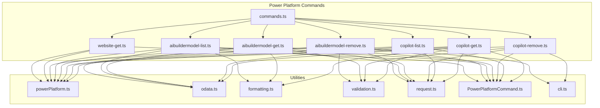
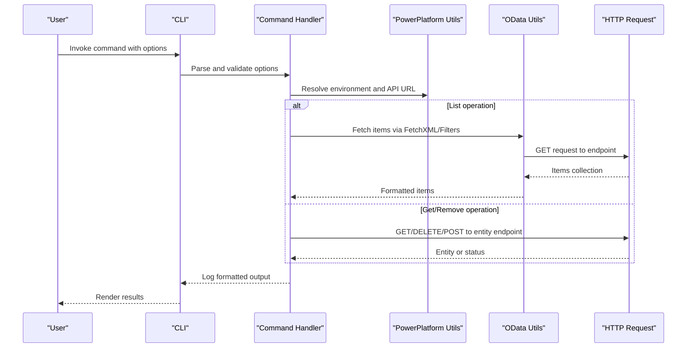
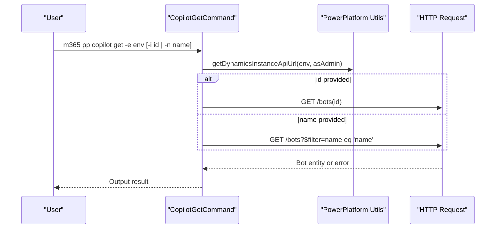
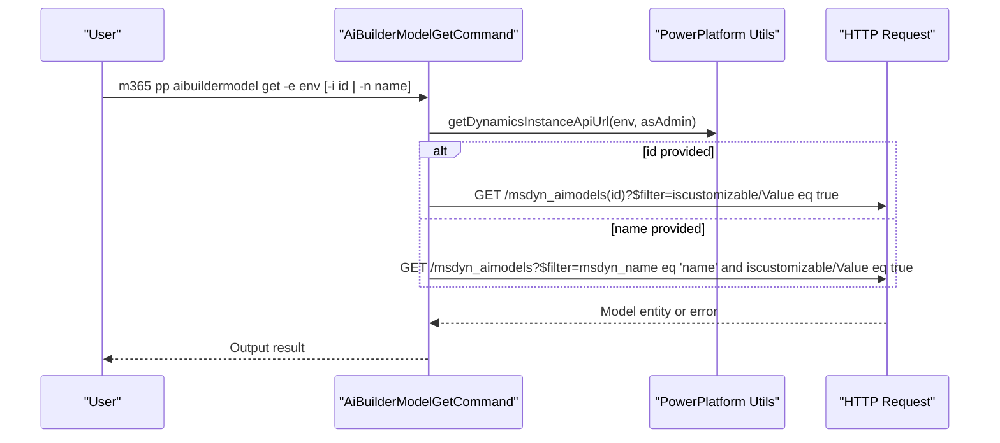
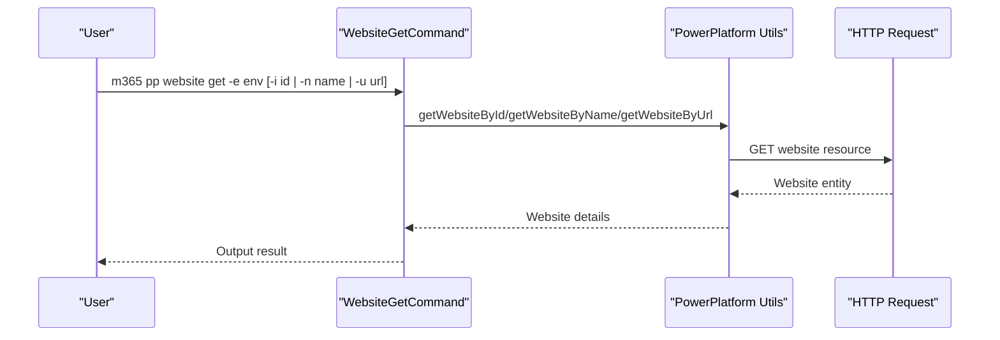
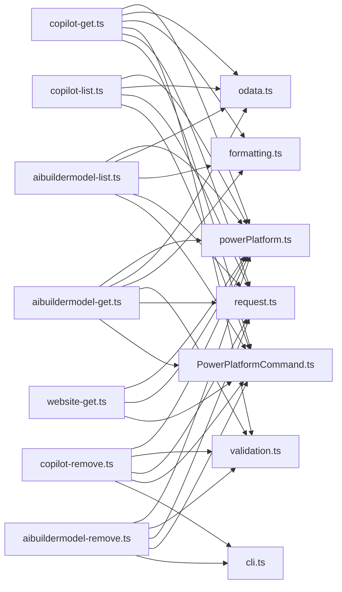

# Copilot & AI Builder

<cite>
**Referenced Files in This Document**
- [README.md](file://README.md)
- [src/m365/pp/commands.ts](file://src/m365/pp/commands.ts)
- [src/m365/pp/commands/copilot/copilot-get.ts](file://src/m365/pp/commands/copilot/copilot-get.ts)
- [src/m365/pp/commands/copilot/copilot-list.ts](file://src/m365/pp/commands/copilot/copilot-list.ts)
- [src/m365/pp/commands/copilot/copilot-remove.ts](file://src/m365/pp/commands/copilot/copilot-remove.ts)
- [src/m365/pp/commands/aibuildermodel/aibuildermodel-get.ts](file://src/m365/pp/commands/aibuildermodel/aibuildermodel-get.ts)
- [src/m365/pp/commands/aibuildermodel/aibuildermodel-list.ts](file://src/m365/pp/commands/aibuildermodel/aibuildermodel-list.ts)
- [src/m365/pp/commands/aibuildermodel/aibuildermodel-remove.ts](file://src/m365/pp/commands/aibuildermodel/aibuildermodel-remove.ts)
- [src/m365/pp/commands/website/website-get.ts](file://src/m365/pp/commands/website/website-get.ts)
- [src/m365/utils/powerPlatform.ts](file://src/m365/utils/powerPlatform.ts)
- [src/m365/utils/odata.ts](file://src/m365/utils/odata.ts)
- [src/m365/utils/formatting.ts](file://src/m365/utils/formatting.ts)
- [src/m365/utils/validation.ts](file://src/m365/utils/validation.ts)
- [src/m365/base/PowerPlatformCommand.ts](file://src/m365/base/PowerPlatformCommand.ts)
- [src/m365/cli/cli.ts](file://src/m365/cli/cli.ts)
- [src/m365/request.ts](file://src/m365/request.ts)
</cite>

## Table of Contents
1. [Introduction](#introduction)
2. [Project Structure](#project-structure)
3. [Core Components](#core-components)
4. [Architecture Overview](#architecture-overview)
5. [Detailed Component Analysis](#detailed-component-analysis)
6. [Dependency Analysis](#dependency-analysis)
7. [Performance Considerations](#performance-considerations)
8. [Troubleshooting Guide](#troubleshooting-guide)
9. [Conclusion](#conclusion)
10. [Appendices](#appendices)

## Introduction
This document provides comprehensive documentation for Copilot and AI Builder capabilities in the CLI for Microsoft 365, focusing on Power Platform integrations. It covers:
- Copilot operations: retrieval, listing, and removal
- AI Builder model management: retrieval, listing, and removal
- Power Pages website operations
- Model lifecycle management and deployment considerations
- Configuration, customization, and integration with Power Platform solutions
- Practical automation examples, governance, monitoring, and compliance guidance

The CLI leverages Power Platform APIs to perform operations against environments, including Dynamics 365 (for Copilot and AI Builder models) and Power Pages (websites).

## Project Structure
The Copilot and AI Builder functionality resides under the Power Platform module. Key areas:
- Command registry enumerating available commands
- Command implementations for Copilot and AI Builder
- Website retrieval command
- Shared utilities for Power Platform integration, validation, formatting, and OData requests

**Diagram sources**
- [src/m365/pp/commands.ts:1-32](file://src/m365/pp/commands.ts#L1-L32)
- [src/m365/pp/commands/copilot/copilot-get.ts:1-132](file://src/m365/pp/commands/copilot/copilot-get.ts#L1-L132)
- [src/m365/pp/commands/copilot/copilot-list.ts:1-114](file://src/m365/pp/commands/copilot/copilot-list.ts#L1-L114)
- [src/m365/pp/commands/copilot/copilot-remove.ts:1-149](file://src/m365/pp/commands/copilot/copilot-remove.ts#L1-L149)
- [src/m365/pp/commands/aibuildermodel/aibuildermodel-get.ts:1-131](file://src/m365/pp/commands/aibuildermodel/aibuildermodel-get.ts#L1-L131)
- [src/m365/pp/commands/aibuildermodel/aibuildermodel-list.ts:1-73](file://src/m365/pp/commands/aibuildermodel/aibuildermodel-list.ts#L1-L73)
- [src/m365/pp/commands/aibuildermodel/aibuildermodel-remove.ts:1-148](file://src/m365/pp/commands/aibuildermodel/aibuildermodel-remove.ts#L1-L148)
- [src/m365/pp/commands/website/website-get.ts:1-71](file://src/m365/pp/commands/website/website-get.ts#L1-L71)
- [src/m365/utils/powerPlatform.ts](file://src/m365/utils/powerPlatform.ts)
- [src/m365/utils/odata.ts](file://src/m365/utils/odata.ts)
- [src/m365/utils/formatting.ts](file://src/m365/utils/formatting.ts)
- [src/m365/utils/validation.ts](file://src/m365/utils/validation.ts)
- [src/m365/base/PowerPlatformCommand.ts](file://src/m365/base/PowerPlatformCommand.ts)
- [src/m365/cli/cli.ts](file://src/m365/cli/cli.ts)
- [src/m365/request.ts](file://src/m365/request.ts)

**Section sources**
- [README.md:68-110](file://README.md#L68-L110)
- [src/m365/pp/commands.ts:1-32](file://src/m365/pp/commands.ts#L1-L32)

## Core Components
- Copilot commands:
  - Get: Retrieve a specific Copilot by ID or name
  - List: Enumerate Copilots in an environment
  - Remove: Delete a Copilot after confirmation or forced deletion
- AI Builder model commands:
  - Get: Retrieve a specific AI Builder model by ID or name
  - List: Enumerate customizable AI Builder models in an environment
  - Remove: Delete an AI Builder model after confirmation or forced deletion
- Website command:
  - Get: Retrieve a Power Pages website by ID, name, or URL

These commands rely on shared utilities for Power Platform API discovery, OData fetching, validation, formatting, and HTTP requests.

**Section sources**
- [src/m365/pp/commands/copilot/copilot-get.ts:22-132](file://src/m365/pp/commands/copilot/copilot-get.ts#L22-L132)
- [src/m365/pp/commands/copilot/copilot-list.ts:17-114](file://src/m365/pp/commands/copilot/copilot-list.ts#L17-L114)
- [src/m365/pp/commands/copilot/copilot-remove.ts:24-149](file://src/m365/pp/commands/copilot/copilot-remove.ts#L24-L149)
- [src/m365/pp/commands/aibuildermodel/aibuildermodel-get.ts:22-131](file://src/m365/pp/commands/aibuildermodel/aibuildermodel-get.ts#L22-L131)
- [src/m365/pp/commands/aibuildermodel/aibuildermodel-list.ts:17-73](file://src/m365/pp/commands/aibuildermodel/aibuildermodel-list.ts#L17-L73)
- [src/m365/pp/commands/aibuildermodel/aibuildermodel-remove.ts:24-148](file://src/m365/pp/commands/aibuildermodel/aibuildermodel-remove.ts#L24-L148)
- [src/m365/pp/commands/website/website-get.ts:26-71](file://src/m365/pp/commands/website/website-get.ts#L26-L71)

## Architecture Overview
The Copilot and AI Builder commands follow a consistent pattern:
- Parse and validate options
- Resolve environment and Dynamics instance URL
- Perform OData or REST requests to Power Platform endpoints
- Format and output results

**Diagram sources**
- [src/m365/pp/commands/copilot/copilot-get.ts:86-132](file://src/m365/pp/commands/copilot/copilot-get.ts#L86-L132)
- [src/m365/pp/commands/copilot/copilot-list.ts:56-114](file://src/m365/pp/commands/copilot/copilot-list.ts#L56-L114)
- [src/m365/pp/commands/copilot/copilot-remove.ts:92-149](file://src/m365/pp/commands/copilot/copilot-remove.ts#L92-L149)
- [src/m365/pp/commands/aibuildermodel/aibuildermodel-get.ts:85-131](file://src/m365/pp/commands/aibuildermodel/aibuildermodel-get.ts#L85-L131)
- [src/m365/pp/commands/aibuildermodel/aibuildermodel-list.ts:56-73](file://src/m365/pp/commands/aibuildermodel/aibuildermodel-list.ts#L56-L73)
- [src/m365/pp/commands/aibuildermodel/aibuildermodel-remove.ts:92-148](file://src/m365/pp/commands/aibuildermodel/aibuildermodel-remove.ts#L92-L148)
- [src/m365/utils/powerPlatform.ts](file://src/m365/utils/powerPlatform.ts)
- [src/m365/utils/odata.ts](file://src/m365/utils/odata.ts)
- [src/m365/request.ts](file://src/m365/request.ts)

## Detailed Component Analysis

### Copilot Management
- Retrieval:
  - Supports lookup by ID (GUID) or name
  - Validates GUID when provided
  - Uses Dynamics API endpoint for bots
  - Handles multiple matches by returning a hash table keyed by ID
- Listing:
  - Returns a curated set of attributes for each bot
  - Uses FetchXML to retrieve bot metadata and related owner/modifier info
- Removal:
  - Requires confirmation unless forced
  - Resolves ID via get if only name is provided
  - Invokes a delete action endpoint for bot removal

**Diagram sources**
- [src/m365/pp/commands/copilot/copilot-get.ts:86-132](file://src/m365/pp/commands/copilot/copilot-get.ts#L86-L132)
- [src/m365/utils/powerPlatform.ts](file://src/m365/utils/powerPlatform.ts)
- [src/m365/request.ts](file://src/m365/request.ts)

**Section sources**
- [src/m365/pp/commands/copilot/copilot-get.ts:22-132](file://src/m365/pp/commands/copilot/copilot-get.ts#L22-L132)
- [src/m365/pp/commands/copilot/copilot-list.ts:17-114](file://src/m365/pp/commands/copilot/copilot-list.ts#L17-L114)
- [src/m365/pp/commands/copilot/copilot-remove.ts:24-149](file://src/m365/pp/commands/copilot/copilot-remove.ts#L24-L149)

### AI Builder Model Management
- Retrieval:
  - Supports lookup by ID (GUID) or name
  - Filters to only show customizable models
  - Handles multiple matches by returning a hash table keyed by model ID
- Listing:
  - Returns a curated set of model attributes
  - Filters to only show customizable models
- Removal:
  - Requires confirmation unless forced
  - Resolves ID via get if only name is provided
  - Deletes the model entity

**Diagram sources**
- [src/m365/pp/commands/aibuildermodel/aibuildermodel-get.ts:85-131](file://src/m365/pp/commands/aibuildermodel/aibuildermodel-get.ts#L85-L131)
- [src/m365/utils/powerPlatform.ts](file://src/m365/utils/powerPlatform.ts)
- [src/m365/request.ts](file://src/m365/request.ts)

**Section sources**
- [src/m365/pp/commands/aibuildermodel/aibuildermodel-get.ts:22-131](file://src/m365/pp/commands/aibuildermodel/aibuildermodel-get.ts#L22-L131)
- [src/m365/pp/commands/aibuildermodel/aibuildermodel-list.ts:17-73](file://src/m365/pp/commands/aibuildermodel/aibuildermodel-list.ts#L17-L73)
- [src/m365/pp/commands/aibuildermodel/aibuildermodel-remove.ts:24-148](file://src/m365/pp/commands/aibuildermodel/aibuildermodel-remove.ts#L24-L148)

### Power Pages Website Operations
- Retrieves website by ID, name, or URL
- Validates URL format when provided
- Delegates to Power Platform utilities to resolve website details

**Diagram sources**
- [src/m365/pp/commands/website/website-get.ts:46-71](file://src/m365/pp/commands/website/website-get.ts#L46-L71)
- [src/m365/utils/powerPlatform.ts](file://src/m365/utils/powerPlatform.ts)
- [src/m365/request.ts](file://src/m365/request.ts)

**Section sources**
- [src/m365/pp/commands/website/website-get.ts:26-71](file://src/m365/pp/commands/website/website-get.ts#L26-L71)

### Model Lifecycle Management and Deployment
- Lifecycle stages visible in the commands:
  - Creation: Not exposed via CLI commands in the current codebase
  - Training: Not exposed via CLI commands in the current codebase
  - Evaluation: Not exposed via CLI commands in the current codebase
  - Deployment: Not exposed via CLI commands in the current codebase
- Current focus: Retrieval, listing, and removal of AI Builder models and Copilot entities
- Recommendations for automation:
  - Use list/get to discover and track models and Copilot instances
  - Use remove with force to automate decommissioning during cleanup workflows
  - Combine with environment and solution management for end-to-end lifecycle orchestration

**Section sources**
- [src/m365/pp/commands/aibuildermodel/aibuildermodel-list.ts:56-73](file://src/m365/pp/commands/aibuildermodel/aibuildermodel-list.ts#L56-L73)
- [src/m365/pp/commands/aibuildermodel/aibuildermodel-remove.ts:92-148](file://src/m365/pp/commands/aibuildermodel/aibuildermodel-remove.ts#L92-L148)
- [src/m365/pp/commands/copilot/copilot-list.ts:56-114](file://src/m365/pp/commands/copilot/copilot-list.ts#L56-L114)
- [src/m365/pp/commands/copilot/copilot-remove.ts:92-149](file://src/m365/pp/commands/copilot/copilot-remove.ts#L92-L149)

### Configuration, Customization, and Integration
- Environment targeting:
  - All commands require an environment name
  - Optional admin mode flag to target admin endpoints
- Integration points:
  - Uses Power Platform utilities to resolve environment and instance URLs
  - Leverages OData for list operations and REST for get/remove operations
  - Applies formatting utilities for consistent output and multiple-results handling

**Section sources**
- [src/m365/pp/commands/copilot/copilot-get.ts:15-84](file://src/m365/pp/commands/copilot/copilot-get.ts#L15-L84)
- [src/m365/pp/commands/aibuildermodel/aibuildermodel-get.ts:15-83](file://src/m365/pp/commands/aibuildermodel/aibuildermodel-get.ts#L15-L83)
- [src/m365/pp/commands/website/website-get.ts:9-44](file://src/m365/pp/commands/website/website-get.ts#L9-L44)
- [src/m365/utils/powerPlatform.ts](file://src/m365/utils/powerPlatform.ts)
- [src/m365/utils/formatting.ts](file://src/m365/utils/formatting.ts)

## Dependency Analysis
- Command-to-utility coupling:
  - Commands depend on PowerPlatform utilities for environment resolution
  - List commands depend on OData utilities for FetchXML-based queries
  - Formatting utilities are used for consistent output and multiple-results handling
  - Validation utilities ensure correct option values (e.g., GUIDs)
  - Request utilities encapsulate HTTP interactions
- Cohesion and separation:
  - Each command encapsulates its own option parsing, validation, and telemetry
  - Shared base class centralizes common Power Platform behaviors
- External dependencies:
  - Power Platform APIs for bot and AI model resources
  - Power Pages APIs for website resources

**Diagram sources**
- [src/m365/pp/commands/copilot/copilot-get.ts:1-132](file://src/m365/pp/commands/copilot/copilot-get.ts#L1-L132)
- [src/m365/pp/commands/copilot/copilot-list.ts:1-114](file://src/m365/pp/commands/copilot/copilot-list.ts#L1-L114)
- [src/m365/pp/commands/copilot/copilot-remove.ts:1-149](file://src/m365/pp/commands/copilot/copilot-remove.ts#L1-L149)
- [src/m365/pp/commands/aibuildermodel/aibuildermodel-get.ts:1-131](file://src/m365/pp/commands/aibuildermodel/aibuildermodel-get.ts#L1-L131)
- [src/m365/pp/commands/aibuildermodel/aibuildermodel-list.ts:1-73](file://src/m365/pp/commands/aibuildermodel/aibuildermodel-list.ts#L1-L73)
- [src/m365/pp/commands/aibuildermodel/aibuildermodel-remove.ts:1-148](file://src/m365/pp/commands/aibuildermodel/aibuildermodel-remove.ts#L1-L148)
- [src/m365/pp/commands/website/website-get.ts:1-71](file://src/m365/pp/commands/website/website-get.ts#L1-L71)
- [src/m365/utils/powerPlatform.ts](file://src/m365/utils/powerPlatform.ts)
- [src/m365/utils/odata.ts](file://src/m365/utils/odata.ts)
- [src/m365/utils/formatting.ts](file://src/m365/utils/formatting.ts)
- [src/m365/utils/validation.ts](file://src/m365/utils/validation.ts)
- [src/m365/base/PowerPlatformCommand.ts](file://src/m365/base/PowerPlatformCommand.ts)
- [src/m365/cli/cli.ts](file://src/m365/cli/cli.ts)
- [src/m365/request.ts](file://src/m365/request.ts)

**Section sources**
- [src/m365/pp/commands.ts:1-32](file://src/m365/pp/commands.ts#L1-L32)

## Performance Considerations
- List operations use FetchXML to minimize payload and improve throughput
- Validation short-circuits invalid inputs early
- Telemetry captures option usage for operational insights
- Recommendation: Prefer filtering and targeted lookups (get by ID/name) to reduce network overhead when managing small sets

[No sources needed since this section provides general guidance]

## Troubleshooting Guide
- Invalid GUID:
  - Validation ensures IDs conform to GUID format; incorrect values cause immediate errors
- Multiple results:
  - Get operations for name-based lookups return a hash keyed by ID when multiple matches are found; use ID-based lookup to disambiguate
- Environment resolution:
  - Ensure the environment name is correct and accessible; admin mode may be required depending on permissions
- Force removal:
  - Removal commands require confirmation unless forced; use force to bypass prompts in automation

**Section sources**
- [src/m365/utils/validation.ts](file://src/m365/utils/validation.ts)
- [src/m365/utils/formatting.ts](file://src/m365/utils/formatting.ts)
- [src/m365/pp/commands/copilot/copilot-get.ts:74-84](file://src/m365/pp/commands/copilot/copilot-get.ts#L74-L84)
- [src/m365/pp/commands/aibuildermodel/aibuildermodel-get.ts:73-83](file://src/m365/pp/commands/aibuildermodel/aibuildermodel-get.ts#L73-L83)
- [src/m365/pp/commands/copilot/copilot-remove.ts:92-107](file://src/m365/pp/commands/copilot/copilot-remove.ts#L92-L107)
- [src/m365/pp/commands/aibuildermodel/aibuildermodel-remove.ts:92-107](file://src/m365/pp/commands/aibuildermodel/aibuildermodel-remove.ts#L92-L107)

## Conclusion
The CLI for Microsoft 365 provides robust, consistent operations for Copilot and AI Builder management within Power Platform environments, along with website retrieval for Power Pages. The commands emphasize reliability through validation, telemetry, and standardized output, enabling administrators and developers to automate routine tasks and integrate with broader lifecycle and governance workflows.

[No sources needed since this section summarizes without analyzing specific files]

## Appendices

### Practical Automation Examples
- Discover and list Copilot instances in an environment:
  - Use the list command to enumerate bots and their metadata
- Retrieve a specific Copilot by name:
  - Use the get command with environment and name; handle multiple results by switching to ID-based lookup
- Decommission a Copilot:
  - Use the remove command with force to automate removal in non-interactive contexts
- Discover and list AI Builder models:
  - Use the list command to enumerate customizable models
- Retrieve a specific AI Builder model by name:
  - Use the get command with environment and name; handle multiple results by switching to ID-based lookup
- Decommission an AI Builder model:
  - Use the remove command with force to automate removal in non-interactive contexts
- Retrieve a Power Pages website:
  - Use the website get command with environment and one of ID, name, or URL

**Section sources**
- [src/m365/pp/commands/copilot/copilot-list.ts:56-114](file://src/m365/pp/commands/copilot/copilot-list.ts#L56-L114)
- [src/m365/pp/commands/copilot/copilot-get.ts:85-132](file://src/m365/pp/commands/copilot/copilot-get.ts#L85-L132)
- [src/m365/pp/commands/copilot/copilot-remove.ts:92-149](file://src/m365/pp/commands/copilot/copilot-remove.ts#L92-L149)
- [src/m365/pp/commands/aibuildermodel/aibuildermodel-list.ts:56-73](file://src/m365/pp/commands/aibuildermodel/aibuildermodel-list.ts#L56-L73)
- [src/m365/pp/commands/aibuildermodel/aibuildermodel-get.ts:85-131](file://src/m365/pp/commands/aibuildermodel/aibuildermodel-get.ts#L85-L131)
- [src/m365/pp/commands/aibuildermodel/aibuildermodel-remove.ts:92-148](file://src/m365/pp/commands/aibuildermodel/aibuildermodel-remove.ts#L92-L148)
- [src/m365/pp/commands/website/website-get.ts:46-71](file://src/m365/pp/commands/website/website-get.ts#L46-L71)

### Governance, Monitoring, and Compliance
- Governance:
  - Use list/get to inventory Copilot and AI Builder assets per environment
  - Apply naming conventions and tagging via environment policies; validate with get operations
- Monitoring:
  - Track changes by periodically listing and diffing outputs
  - Use telemetry properties captured by commands to understand adoption patterns
- Compliance:
  - Restrict removal operations to authorized users; leverage force removal only in controlled automation
  - Ensure environment and admin mode flags align with least-privilege access

[No sources needed since this section provides general guidance]