# Dataverse (Common Data Service)

<cite>
**Referenced Files in This Document**
- [dataverse-table-get.ts](file://src/m365/pp/commands/dataverse/dataverse-table-get.ts)
- [dataverse-table-list.ts](file://src/m365/pp/commands/dataverse/dataverse-table-list.ts)
- [dataverse-table-remove.ts](file://src/m365/pp/commands/dataverse/dataverse-table-remove.ts)
- [dataverse-table-row-list.ts](file://src/m365/pp/commands/dataverse/dataverse-table-row-list.ts)
- [dataverse-table-row-remove.ts](file://src/m365/pp/commands/dataverse/dataverse-table-row-remove.ts)
- [gateway-get.ts](file://src/m365/pp/commands/gateway/gateway-get.ts)
- [gateway-list.ts](file://src/m365/pp/commands/gateway/gateway-list.ts)
- [managementapp-add.ts](file://src/m365/pp/commands/managementapp/managementapp-add.ts)
- [managementapp-list.ts](file://src/m365/pp/commands/managementapp/managementapp-list.ts)
- [PowerPlatformCommand.ts](file://src/m365/base/PowerPlatformCommand.ts)
</cite>

## Table of Contents
1. [Introduction](#introduction)
2. [Project Structure](#project-structure)
3. [Core Components](#core-components)
4. [Architecture Overview](#architecture-overview)
5. [Detailed Component Analysis](#detailed-component-analysis)
6. [Dependency Analysis](#dependency-analysis)
7. [Performance Considerations](#performance-considerations)
8. [Troubleshooting Guide](#troubleshooting-guide)
9. [Conclusion](#conclusion)
10. [Appendices](#appendices)

## Introduction
This document explains Dataverse (Common Data Service) capabilities exposed via the CLI for Microsoft 365. It focuses on:
- Dataverse table operations: listing, retrieving, and removing tables
- Row-level operations: listing and removing records
- Gateway management: listing and retrieving gateway details
- Management app operations: registering and listing Power Platform management applications
- Practical automation examples for administration, data synchronization, and gateway management
- Governance, security roles, and performance optimization guidance for large-scale deployments

## Project Structure
The Dataverse and related Power Platform commands are organized under the Power Platform module. The CLI’s base command class enforces cloud type and delegated access token requirements for Power Platform APIs.

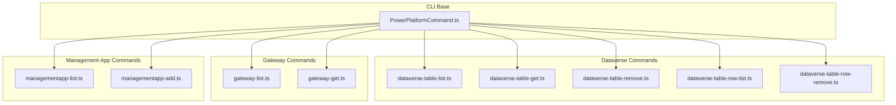

**Diagram sources**
- [PowerPlatformCommand.ts:7-26](file://src/m365/base/PowerPlatformCommand.ts#L7-L26)
- [dataverse-table-list.ts:17-73](file://src/m365/pp/commands/dataverse/dataverse-table-list.ts#L17-L73)
- [dataverse-table-get.ts:19-82](file://src/m365/pp/commands/dataverse/dataverse-table-get.ts#L19-L82)
- [dataverse-table-remove.ts:20-99](file://src/m365/pp/commands/dataverse/dataverse-table-remove.ts#L20-L99)
- [dataverse-table-row-list.ts:20-111](file://src/m365/pp/commands/dataverse/dataverse-table-row-list.ts#L20-L111)
- [dataverse-table-row-remove.ts:23-154](file://src/m365/pp/commands/dataverse/dataverse-table-row-remove.ts#L23-L154)
- [gateway-list.ts:10-51](file://src/m365/pp/commands/gateway/gateway-list.ts#L10-L51)
- [gateway-get.ts:9-62](file://src/m365/pp/commands/gateway/gateway-get.ts#L9-L62)
- [managementapp-list.ts:10-33](file://src/m365/pp/commands/managementapp/managementapp-list.ts#L10-L33)
- [managementapp-add.ts:19-115](file://src/m365/pp/commands/managementapp/managementapp-add.ts#L19-L115)

**Section sources**
- [PowerPlatformCommand.ts:1-27](file://src/m365/base/PowerPlatformCommand.ts#L1-L27)

## Core Components
- Power Platform base command: Enforces public cloud and delegated access token requirements for Power Platform APIs.
- Dataverse table commands: List, get, and remove tables in a target environment.
- Dataverse row commands: List and remove rows from a table using either logical table name or entity set name.
- Gateway commands: List and get details for gateways.
- Management app commands: Register and list Power Platform management applications.

Key behaviors:
- Environment targeting via environment name and optional admin context flag
- OData-based queries and pagination for lists
- Validation of identifiers (GUIDs) and option exclusivity
- Confirmation prompts for destructive actions

**Section sources**
- [PowerPlatformCommand.ts:7-26](file://src/m365/base/PowerPlatformCommand.ts#L7-L26)
- [dataverse-table-list.ts:17-73](file://src/m365/pp/commands/dataverse/dataverse-table-list.ts#L17-L73)
- [dataverse-table-get.ts:19-82](file://src/m365/pp/commands/dataverse/dataverse-table-get.ts#L19-L82)
- [dataverse-table-remove.ts:20-99](file://src/m365/pp/commands/dataverse/dataverse-table-remove.ts#L20-L99)
- [dataverse-table-row-list.ts:20-111](file://src/m365/pp/commands/dataverse/dataverse-table-row-list.ts#L20-L111)
- [dataverse-table-row-remove.ts:23-154](file://src/m365/pp/commands/dataverse/dataverse-table-row-remove.ts#L23-L154)
- [gateway-list.ts:10-51](file://src/m365/pp/commands/gateway/gateway-list.ts#L10-L51)
- [gateway-get.ts:9-62](file://src/m365/pp/commands/gateway/gateway-get.ts#L9-L62)
- [managementapp-list.ts:10-33](file://src/m365/pp/commands/managementapp/managementapp-list.ts#L10-L33)
- [managementapp-add.ts:19-115](file://src/m365/pp/commands/managementapp/managementapp-add.ts#L19-L115)

## Architecture Overview
The CLI composes Power Platform endpoints using a base command abstraction. Requests leverage delegated access tokens and OData utilities for pagination and filtering.

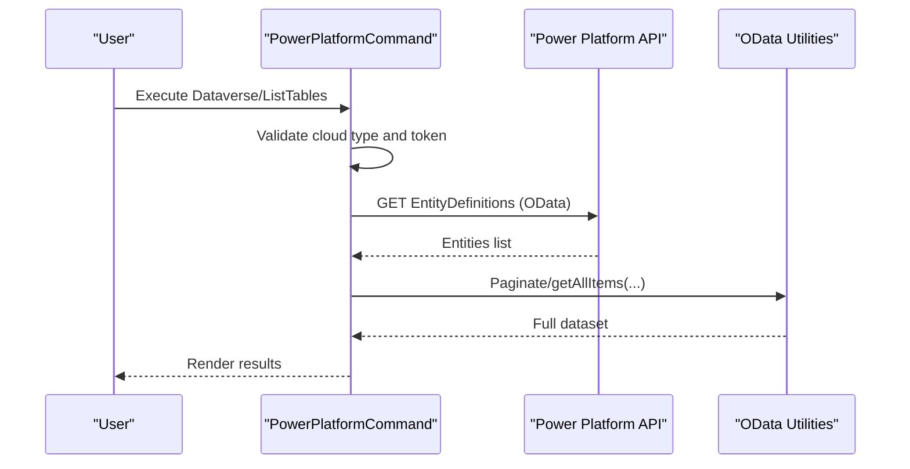

**Diagram sources**
- [PowerPlatformCommand.ts:7-26](file://src/m365/base/PowerPlatformCommand.ts#L7-L26)
- [dataverse-table-list.ts:61-71](file://src/m365/pp/commands/dataverse/dataverse-table-list.ts#L61-L71)

## Detailed Component Analysis

### Dataverse Table Operations
- List tables: Filters out intersect/logical/system entities and applies customization flags.
- Get table: Retrieves metadata for a specific logical name.
- Remove table: Deletes a table after confirmation or force flag.

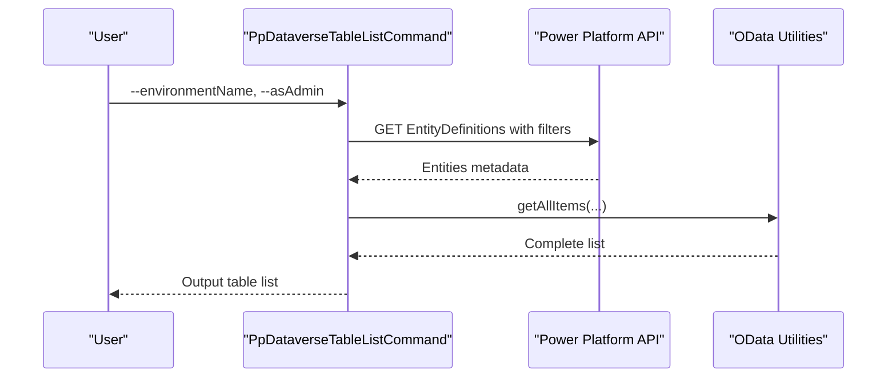

**Diagram sources**
- [dataverse-table-list.ts:56-71](file://src/m365/pp/commands/dataverse/dataverse-table-list.ts#L56-L71)

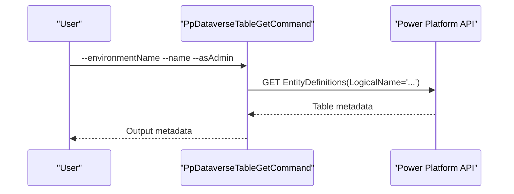

**Diagram sources**
- [dataverse-table-get.ts:57-79](file://src/m365/pp/commands/dataverse/dataverse-table-get.ts#L57-L79)

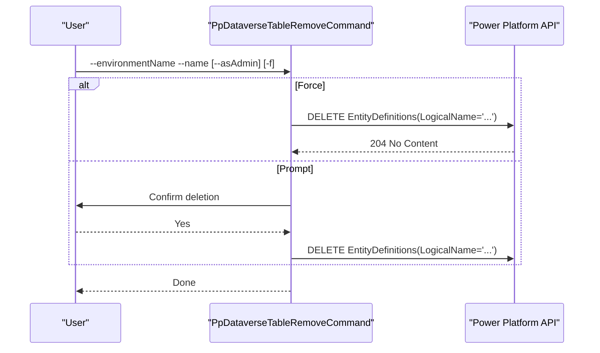

**Diagram sources**
- [dataverse-table-remove.ts:62-96](file://src/m365/pp/commands/dataverse/dataverse-table-remove.ts#L62-L96)

**Section sources**
- [dataverse-table-list.ts:17-73](file://src/m365/pp/commands/dataverse/dataverse-table-list.ts#L17-L73)
- [dataverse-table-get.ts:19-82](file://src/m365/pp/commands/dataverse/dataverse-table-get.ts#L19-L82)
- [dataverse-table-remove.ts:20-99](file://src/m365/pp/commands/dataverse/dataverse-table-remove.ts#L20-L99)

### Dataverse Row Operations
- List rows: Accepts either entity set name or logical table name; resolves entity set if needed; paginates results.
- Remove row: Validates GUID; supports entity set or logical table name; deletes by ID.

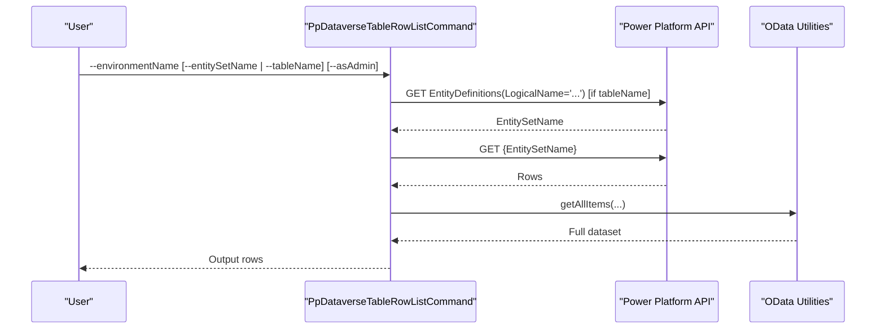

**Diagram sources**
- [dataverse-table-row-list.ts:71-108](file://src/m365/pp/commands/dataverse/dataverse-table-row-list.ts#L71-L108)

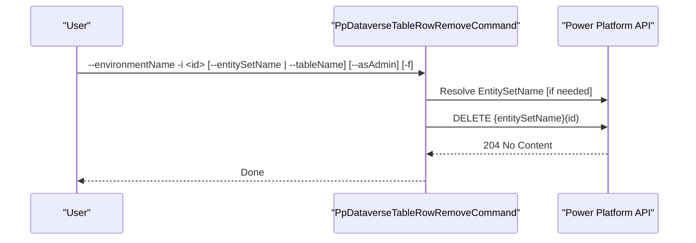

**Diagram sources**
- [dataverse-table-row-remove.ts:94-151](file://src/m365/pp/commands/dataverse/dataverse-table-row-remove.ts#L94-L151)

**Section sources**
- [dataverse-table-row-list.ts:20-111](file://src/m365/pp/commands/dataverse/dataverse-table-row-list.ts#L20-L111)
- [dataverse-table-row-remove.ts:23-154](file://src/m365/pp/commands/dataverse/dataverse-table-row-remove.ts#L23-L154)

### Gateway Management
- List gateways: Returns a list of gateways accessible to the caller.
- Get gateway: Retrieves details for a specific gateway by ID.

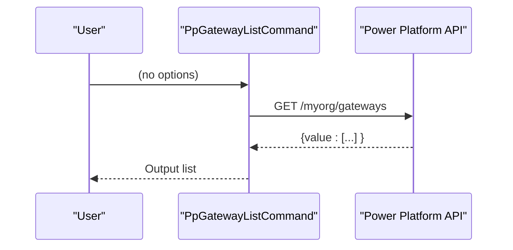

**Diagram sources**
- [gateway-list.ts:27-47](file://src/m365/pp/commands/gateway/gateway-list.ts#L27-L47)

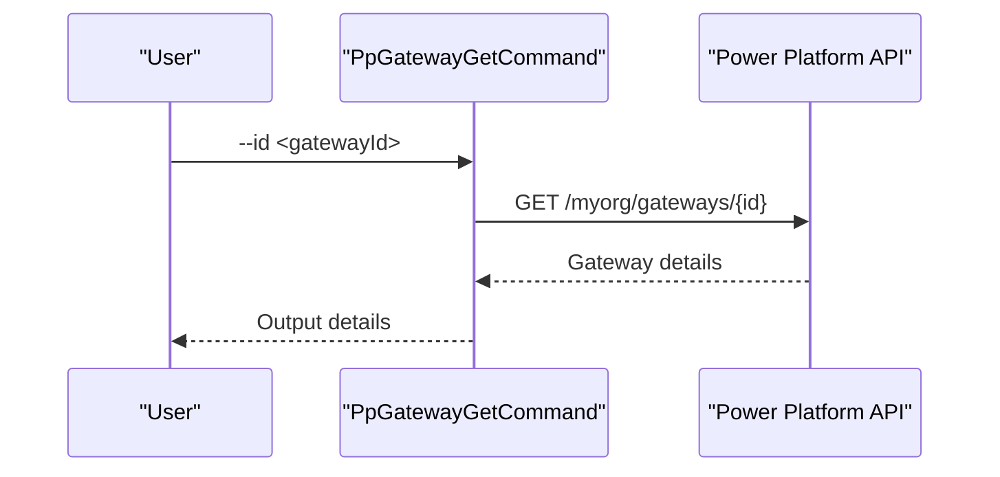

**Diagram sources**
- [gateway-get.ts:39-59](file://src/m365/pp/commands/gateway/gateway-get.ts#L39-L59)

**Section sources**
- [gateway-list.ts:10-51](file://src/m365/pp/commands/gateway/gateway-list.ts#L10-L51)
- [gateway-get.ts:9-62](file://src/m365/pp/commands/gateway/gateway-get.ts#L9-L62)

### Management App Operations
- List management apps: Enumerates registered management applications.
- Add management app: Registers a management application using appId, objectId, or name.

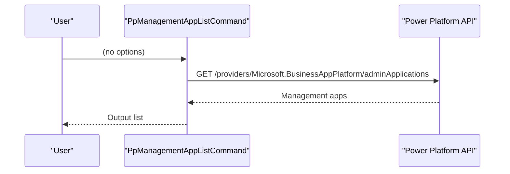

**Diagram sources**
- [managementapp-list.ts:19-29](file://src/m365/pp/commands/managementapp/managementapp-list.ts#L19-L29)

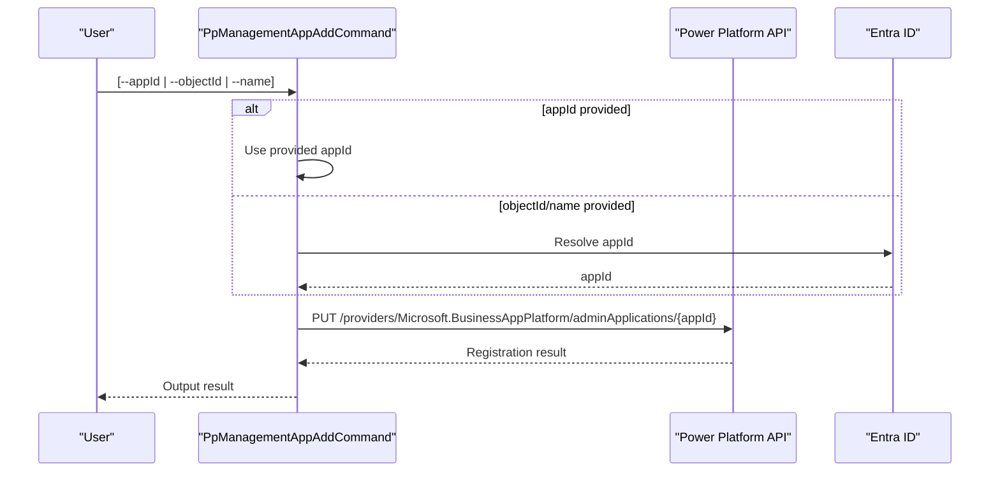

**Diagram sources**
- [managementapp-add.ts:75-112](file://src/m365/pp/commands/managementapp/managementapp-add.ts#L75-L112)

**Section sources**
- [managementapp-list.ts:10-33](file://src/m365/pp/commands/managementapp/managementapp-list.ts#L10-L33)
- [managementapp-add.ts:19-115](file://src/m365/pp/commands/managementapp/managementapp-add.ts#L19-L115)

## Dependency Analysis
- All Power Platform commands inherit from a shared base that validates cloud type and access token type.
- Dataverse commands rely on:
  - Power Platform utilities for environment and instance resolution
  - OData utilities for pagination and filtering
  - Request utilities for HTTP operations
- Gateway and management app commands use the Power BI base class and Power Platform resource endpoints.

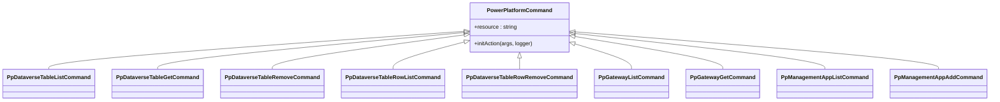

**Diagram sources**
- [PowerPlatformCommand.ts:7-26](file://src/m365/base/PowerPlatformCommand.ts#L7-L26)
- [dataverse-table-list.ts:17-73](file://src/m365/pp/commands/dataverse/dataverse-table-list.ts#L17-L73)
- [dataverse-table-get.ts:19-82](file://src/m365/pp/commands/dataverse/dataverse-table-get.ts#L19-L82)
- [dataverse-table-remove.ts:20-99](file://src/m365/pp/commands/dataverse/dataverse-table-remove.ts#L20-L99)
- [dataverse-table-row-list.ts:20-111](file://src/m365/pp/commands/dataverse/dataverse-table-row-list.ts#L20-L111)
- [dataverse-table-row-remove.ts:23-154](file://src/m365/pp/commands/dataverse/dataverse-table-row-remove.ts#L23-L154)
- [gateway-list.ts:10-51](file://src/m365/pp/commands/gateway/gateway-list.ts#L10-L51)
- [gateway-get.ts:9-62](file://src/m365/pp/commands/gateway/gateway-get.ts#L9-L62)
- [managementapp-list.ts:10-33](file://src/m365/pp/commands/managementapp/managementapp-list.ts#L10-L33)
- [managementapp-add.ts:19-115](file://src/m365/pp/commands/managementapp/managementapp-add.ts#L19-L115)

**Section sources**
- [PowerPlatformCommand.ts:7-26](file://src/m365/base/PowerPlatformCommand.ts#L7-L26)

## Performance Considerations
- Pagination: Use OData utilities to fetch large datasets efficiently.
- Filtering: Apply server-side filters to reduce payload sizes (as seen in table listing).
- Select projections: Limit returned fields to only what is needed.
- Batch operations: For bulk deletions, iterate with caution and consider throttling limits.
- Caching: Reuse resolved entity set names per invocation to avoid redundant lookups.

[No sources needed since this section provides general guidance]

## Troubleshooting Guide
- Authentication errors: Ensure delegated access token is present and cloud type is public.
- Invalid identifiers: Validate GUIDs for row removal and gateway retrieval.
- Option conflicts: Some commands enforce exclusive options (e.g., entity set name vs. table name).
- Confirmation prompts: Destructive operations require explicit confirmation unless forced.

**Section sources**
- [PowerPlatformCommand.ts:15-25](file://src/m365/base/PowerPlatformCommand.ts#L15-L25)
- [dataverse-table-row-remove.ts:76-86](file://src/m365/pp/commands/dataverse/dataverse-table-row-remove.ts#L76-L86)
- [gateway-get.ts:30-37](file://src/m365/pp/commands/gateway/gateway-get.ts#L30-L37)
- [dataverse-table-row-list.ts:65-69](file://src/m365/pp/commands/dataverse/dataverse-table-row-list.ts#L65-L69)

## Conclusion
The CLI provides a robust foundation for Dataverse administration and Power Platform management tasks. By leveraging OData-based queries, validation, and confirmation flows, administrators can automate table and row operations, manage gateways, and register management applications with confidence.

[No sources needed since this section summarizes without analyzing specific files]

## Appendices

### Practical Automation Examples
- Administration automation
  - List all custom, user-modifiable tables in an environment and export the list for auditing.
  - Retrieve a specific table’s metadata to validate schema before applying changes.
  - Remove a test table after verifying dependent records are cleaned up.
- Data synchronization
  - Periodically list rows from a monitored table and compare counts to detect drift.
  - Remove stale rows older than a threshold by combining listing and removal flows.
- Gateway management
  - List gateways to confirm availability and readiness for scheduled maintenance windows.
  - Retrieve a specific gateway to validate credentials and capacity metrics prior to deployment.

[No sources needed since this section provides general guidance]

### Governance, Security Roles, and Performance Optimization
- Governance
  - Enforce option exclusivity and validation to prevent misconfiguration.
  - Use admin context flags judiciously and limit scope to environments requiring elevated permissions.
- Security roles
  - Restrict access to management app registration and gateway retrieval to authorized administrators.
  - Prefer least privilege when assigning delegated permissions for Power Platform operations.
- Performance optimization
  - Apply OData filters and select projections to minimize round trips.
  - Paginate results and process in batches to respect service throttling.
  - Cache resolved entity set names during a single command invocation.

[No sources needed since this section provides general guidance]