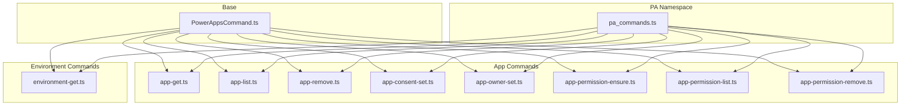
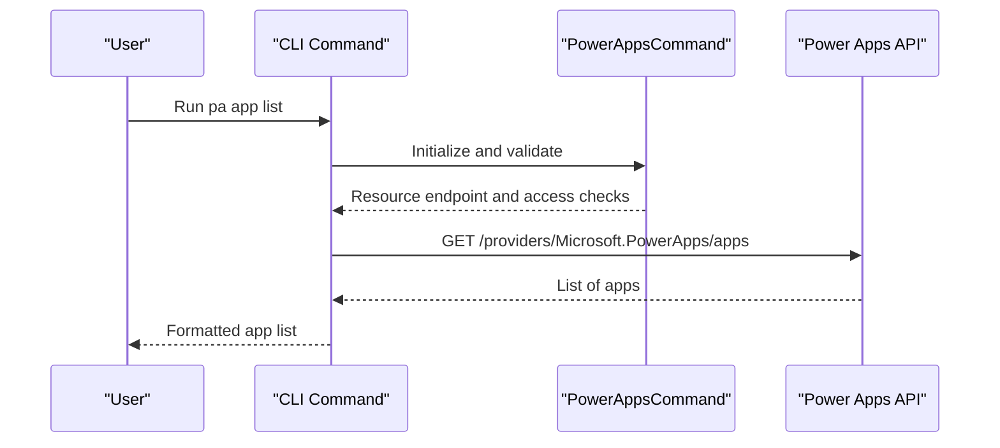
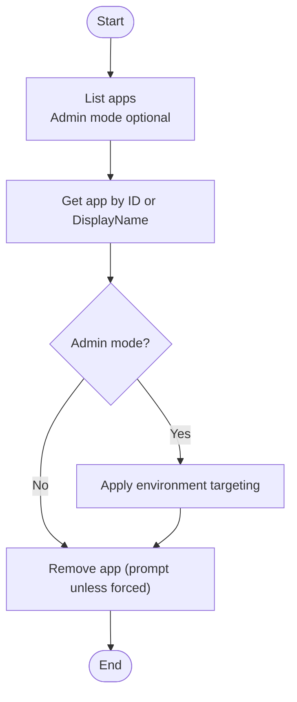
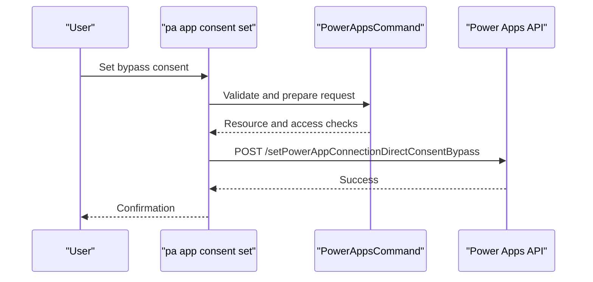
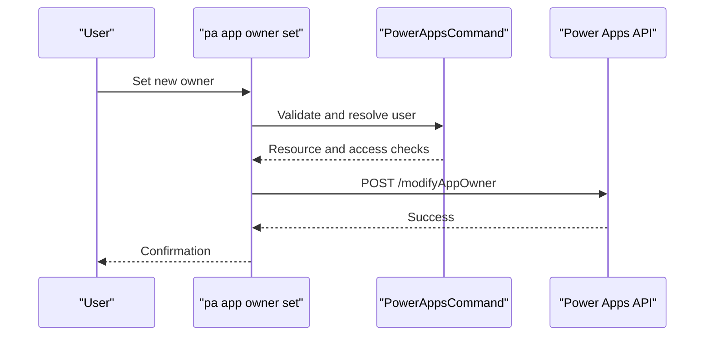
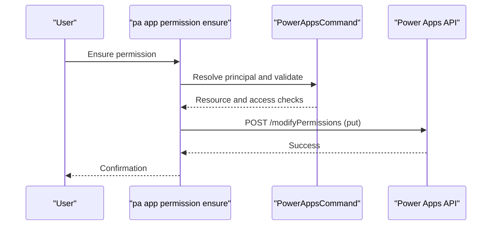
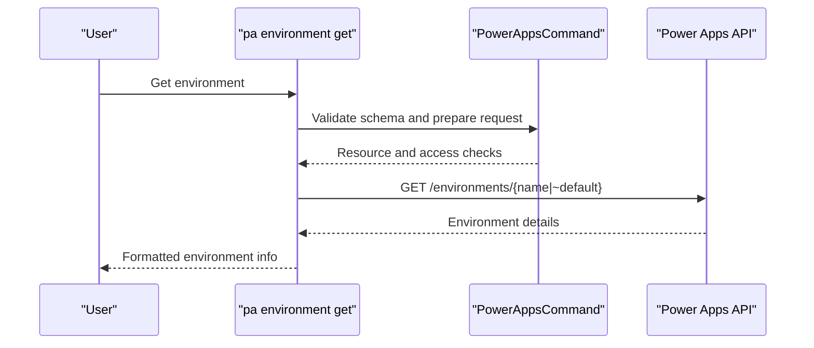
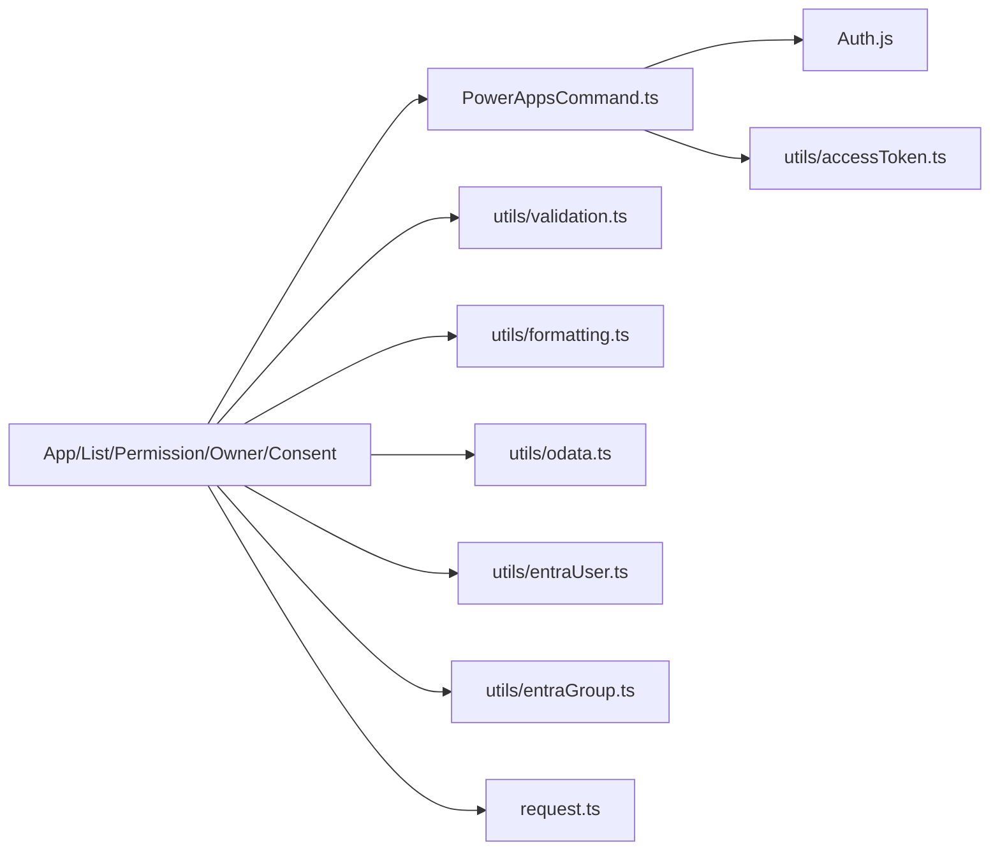

# Power Apps

<cite>
**Referenced Files in This Document**
- [PowerAppsCommand.ts](file://src/m365/base/PowerAppsCommand.ts)
- [pa_commands.ts](file://src/m365/pa/commands.ts)
- [app-get.ts](file://src/m365/pa/commands/app/app-get.ts)
- [app-list.ts](file://src/m365/pa/commands/app/app-list.ts)
- [app-remove.ts](file://src/m365/pa/commands/app/app-remove.ts)
- [app-consent-set.ts](file://src/m365/pa/commands/app/app-consent-set.ts)
- [app-owner-set.ts](file://src/m365/pa/commands/app/app-owner-set.ts)
- [app-permission-ensure.ts](file://src/m365/pa/commands/app/app-permission-ensure.ts)
- [app-permission-list.ts](file://src/m365/pa/commands/app/app-permission-list.ts)
- [app-permission-remove.ts](file://src/m365/pa/commands/app/app-permission-remove.ts)
- [environment-get.ts](file://src/m365/pa/commands/environment/environment-get.ts)
</cite>

## Table of Contents
1. [Introduction](#introduction)
2. [Project Structure](#project-structure)
3. [Core Components](#core-components)
4. [Architecture Overview](#architecture-overview)
5. [Detailed Component Analysis](#detailed-component-analysis)
6. [Dependency Analysis](#dependency-analysis)
7. [Performance Considerations](#performance-considerations)
8. [Troubleshooting Guide](#troubleshooting-guide)
9. [Conclusion](#conclusion)
10. [Appendices](#appendices)

## Introduction
This document provides comprehensive Power Apps documentation for CLI for Microsoft 365. It covers application management (CRUD), consent and permission management, environment operations, and owner operations. It also explains app lifecycle management from creation to removal, including re-consent operations, environment targeting, and permission updates. Practical examples demonstrate automation, bulk operations, and integration with Power Platform solutions. Governance, sharing permissions, and compliance considerations are addressed throughout.

## Project Structure
The Power Apps commands are organized under the Power Automate (pa) namespace. The base class enforces delegated access and public cloud support. Individual commands implement specific capabilities such as listing, retrieving, removing apps, managing consent, owners, and permissions, and environment discovery.

**Diagram sources**
- [PowerAppsCommand.ts:1-25](file://src/m365/base/PowerAppsCommand.ts#L1-L25)
- [pa_commands.ts:1-18](file://src/m365/pa/commands.ts#L1-L18)
- [app-get.ts:1-171](file://src/m365/pa/commands/app/app-get.ts#L1-L171)
- [app-list.ts:1-93](file://src/m365/pa/commands/app/app-list.ts#L1-L93)
- [app-remove.ts:1-133](file://src/m365/pa/commands/app/app-remove.ts#L1-L133)
- [app-consent-set.ts:1-109](file://src/m365/pa/commands/app/app-consent-set.ts#L1-L109)
- [app-owner-set.ts:1-135](file://src/m365/pa/commands/app/app-owner-set.ts#L1-L135)
- [app-permission-ensure.ts:1-216](file://src/m365/pa/commands/app/app-permission-ensure.ts#L1-L216)
- [app-permission-list.ts:1-125](file://src/m365/pa/commands/app/app-permission-list.ts#L1-L125)
- [app-permission-remove.ts:1-197](file://src/m365/pa/commands/app/app-permission-remove.ts#L1-L197)
- [environment-get.ts:1-72](file://src/m365/pa/commands/environment/environment-get.ts#L1-L72)

**Section sources**
- [PowerAppsCommand.ts:1-25](file://src/m365/base/PowerAppsCommand.ts#L1-L25)
- [pa_commands.ts:1-18](file://src/m365/pa/commands.ts#L1-L18)

## Core Components
- Base class for Power Apps commands:
  - Enforces delegated access token type.
  - Restricts to public cloud for now.
  - Provides the Power Apps resource endpoint.
- Command registry:
  - Defines command namespaced under pa for app, connector, and environment operations.

Key responsibilities:
- Access control and cloud enforcement.
- Centralized resource endpoint for Power Apps API.
- Shared validation and telemetry hooks across commands.

**Section sources**
- [PowerAppsCommand.ts:6-24](file://src/m365/base/PowerAppsCommand.ts#L6-L24)
- [pa_commands.ts:3-16](file://src/m365/pa/commands.ts#L3-L16)

## Architecture Overview
The CLI delegates to the Power Apps REST API. Commands construct appropriate endpoints, apply validation, and handle responses. Environment operations target environments, while app operations target specific apps or lists of apps. Permission operations support granular sharing and tenant-wide viewing.

**Diagram sources**
- [PowerAppsCommand.ts:11-24](file://src/m365/base/PowerAppsCommand.ts#L11-L24)
- [app-list.ts:74-89](file://src/m365/pa/commands/app/app-list.ts#L74-L89)

## Detailed Component Analysis

### Application Lifecycle Management
This section covers app CRUD operations and lifecycle stages from creation to removal, including re-consent and environment targeting.

- List apps
  - Supports admin mode and environment targeting.
  - Returns minimal properties by default.
- Get app
  - Retrieves by ID or by display name (fallback via list).
  - Supports admin mode and environment targeting.
- Remove app
  - Requires confirmation unless forced.
  - Supports admin mode and environment targeting.

**Diagram sources**
- [app-list.ts:74-89](file://src/m365/pa/commands/app/app-list.ts#L74-L89)
- [app-get.ts:93-144](file://src/m365/pa/commands/app/app-get.ts#L93-L144)
- [app-remove.ts:86-130](file://src/m365/pa/commands/app/app-remove.ts#L86-L130)

**Section sources**
- [app-list.ts:17-91](file://src/m365/pa/commands/app/app-list.ts#L17-L91)
- [app-get.ts:23-171](file://src/m365/pa/commands/app/app-get.ts#L23-L171)
- [app-remove.ts:22-133](file://src/m365/pa/commands/app/app-remove.ts#L22-L133)

### Consent Management
- Configure bypass consent for a specific app within an environment.
- Supports confirmation prompt unless forced.
- Validates app ID format.

**Diagram sources**
- [app-consent-set.ts:71-106](file://src/m365/pa/commands/app/app-consent-set.ts#L71-L106)
- [PowerAppsCommand.ts:11-24](file://src/m365/base/PowerAppsCommand.ts#L11-L24)

**Section sources**
- [app-consent-set.ts:20-109](file://src/m365/pa/commands/app/app-consent-set.ts#L20-L109)

### Owner Operations
- Set a new owner for a Power Apps app.
- Accepts either user ID or UPN for the new owner.
- Optionally assigns a role to the old owner (CanView or CanEdit).
- Validates identifiers and roles.

**Diagram sources**
- [app-owner-set.ts:99-124](file://src/m365/pa/commands/app/app-owner-set.ts#L99-L124)
- [PowerAppsCommand.ts:11-24](file://src/m365/base/PowerAppsCommand.ts#L11-L24)

**Section sources**
- [app-owner-set.ts:21-135](file://src/m365/pa/commands/app/app-owner-set.ts#L21-L135)

### Permission Management
- List permissions
  - Filter by role name (Owner, CanEdit, CanView).
  - Supports admin mode and environment targeting.
- Ensure permission
  - Assign/update permission for a user, group, or tenant.
  - Supports CanEdit and CanView roles.
  - Optional invitation notification.
- Remove permission
  - Remove permission for a user, group, or tenant.
  - Supports admin mode and environment targeting.

**Diagram sources**
- [app-permission-ensure.ts:149-183](file://src/m365/pa/commands/app/app-permission-ensure.ts#L149-L183)
- [PowerAppsCommand.ts:11-24](file://src/m365/base/PowerAppsCommand.ts#L11-L24)

**Section sources**
- [app-permission-list.ts:20-125](file://src/m365/pa/commands/app/app-permission-list.ts#L20-L125)
- [app-permission-ensure.ts:29-216](file://src/m365/pa/commands/app/app-permission-ensure.ts#L29-L216)
- [app-permission-remove.ts:29-197](file://src/m365/pa/commands/app/app-permission-remove.ts#L29-L197)

### Environment Operations
- Get environment
  - Retrieve environment by name or default.
  - Returns environment metadata such as display name, provisioning state, SKU, region hint, and default flag.

**Diagram sources**
- [environment-get.ts:41-69](file://src/m365/pa/commands/environment/environment-get.ts#L41-L69)
- [PowerAppsCommand.ts:11-24](file://src/m365/base/PowerAppsCommand.ts#L11-L24)

**Section sources**
- [environment-get.ts:21-72](file://src/m365/pa/commands/environment/environment-get.ts#L21-L72)

### Export/Import Workflows
- Connector export
  - Exports connectors associated with Power Apps.
- Connector list
  - Lists connectors available in the environment.
- App export
  - Exports a Power Apps app.

Note: The Power Apps app export command exists in the command registry and is implemented in the codebase. The implementation follows the established pattern of constructing API endpoints, validating inputs, and handling responses.

**Section sources**
- [pa_commands.ts:4-14](file://src/m365/pa/commands.ts#L4-L14)

## Dependency Analysis
- Base class dependencies
  - Authentication and cloud type checks.
  - Access token type enforcement.
- Command dependencies
  - Validation utilities for GUIDs and UPNs.
  - Formatting utilities for query parameters.
  - OData utilities for paginated queries.
  - Ent Identity utilities for resolving users and groups.
  - Request utilities for HTTP operations.
- Cross-cutting concerns
  - Telemetry and option sets for consistent UX.
  - Prompt utilities for destructive actions.

**Diagram sources**
- [PowerAppsCommand.ts:1-25](file://src/m365/base/PowerAppsCommand.ts#L1-L25)
- [app-list.ts:1-93](file://src/m365/pa/commands/app/app-list.ts#L1-L93)
- [app-permission-ensure.ts:1-216](file://src/m365/pa/commands/app/app-permission-ensure.ts#L1-L216)
- [app-owner-set.ts:1-135](file://src/m365/pa/commands/app/app-owner-set.ts#L1-L135)
- [app-consent-set.ts:1-109](file://src/m365/pa/commands/app/app-consent-set.ts#L1-L109)

**Section sources**
- [PowerAppsCommand.ts:1-25](file://src/m365/base/PowerAppsCommand.ts#L1-L25)
- [app-list.ts:1-93](file://src/m365/pa/commands/app/app-list.ts#L1-L93)
- [app-permission-ensure.ts:1-216](file://src/m365/pa/commands/app/app-permission-ensure.ts#L1-L216)
- [app-owner-set.ts:1-135](file://src/m365/pa/commands/app/app-owner-set.ts#L1-L135)
- [app-consent-set.ts:1-109](file://src/m365/pa/commands/app/app-consent-set.ts#L1-L109)

## Performance Considerations
- Prefer admin mode only when necessary to reduce scope.
- Use environment targeting to limit API calls.
- Leverage list operations to batch or filter before targeted operations.
- Avoid repeated resolution of identities (user/group) by passing IDs when possible.

## Troubleshooting Guide
- Authentication errors
  - Ensure delegated access token is used.
  - Verify connection is to the public cloud.
- Validation errors
  - Confirm GUIDs and UPNs meet expected formats.
  - Check that environment targeting options are used consistently.
- Permission errors
  - Verify sufficient privileges to modify permissions or ownership.
  - Confirm principal identifiers (user/group/tenant) are correct.
- Destructive operations
  - Use force flag carefully; confirm prompts are acknowledged.

**Section sources**
- [PowerAppsCommand.ts:11-24](file://src/m365/base/PowerAppsCommand.ts#L11-L24)
- [app-get.ts:69-86](file://src/m365/pa/commands/app/app-get.ts#L69-L86)
- [app-list.ts:58-72](file://src/m365/pa/commands/app/app-list.ts#L58-L72)
- [app-remove.ts:66-84](file://src/m365/pa/commands/app/app-remove.ts#L66-L84)
- [app-permission-ensure.ts:101-139](file://src/m365/pa/commands/app/app-permission-ensure.ts#L101-L139)
- [app-permission-remove.ts:95-125](file://src/m365/pa/commands/app/app-permission-remove.ts#L95-L125)

## Conclusion
CLI for Microsoft 365 provides robust Power Apps management capabilities through a consistent command surface. Administrators can manage apps, consent, owners, and permissions, and operate against specific environments. The documented patterns enable automation, governance, and compliance-aligned workflows.

## Appendices

### Practical Examples and Automation Patterns
- Bulk operations
  - Combine list and loop constructs to iterate over apps and apply permission or consent changes.
- Environment targeting
  - Use environment-specific commands to isolate changes during testing or production migrations.
- Integration with Power Platform solutions
  - Export connectors and apps to support solution packaging and migration.
- Compliance and governance
  - Regularly audit permissions and ownership.
  - Enforce tenant-wide viewing only for CanView to minimize exposure.

[No sources needed since this section provides general guidance]