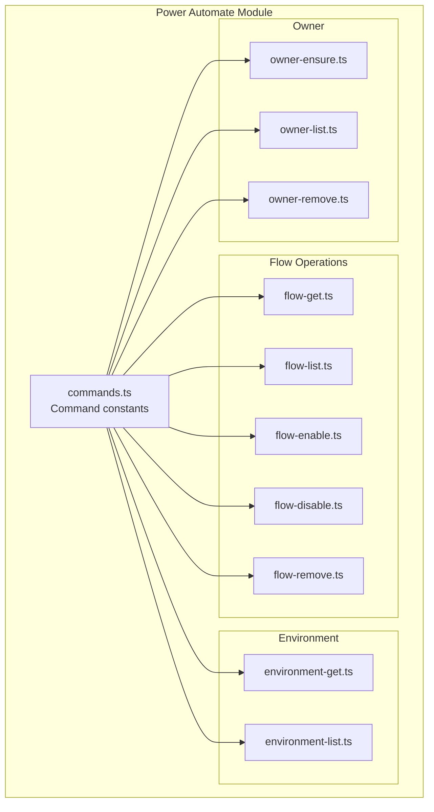
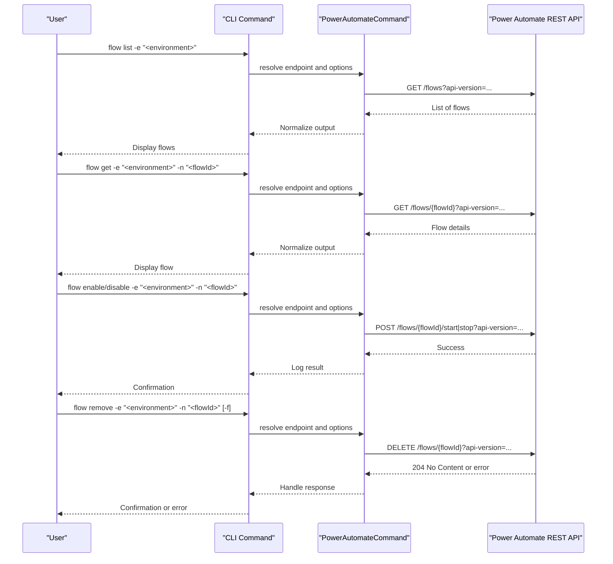
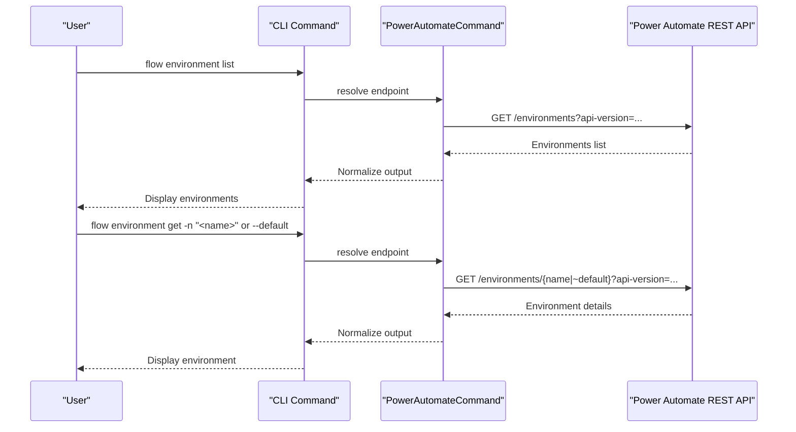
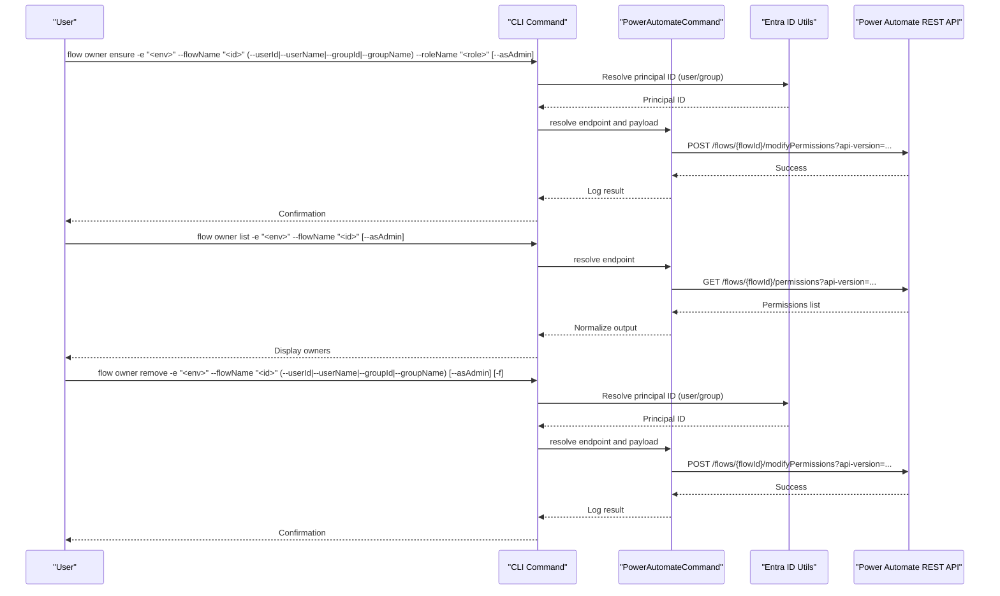
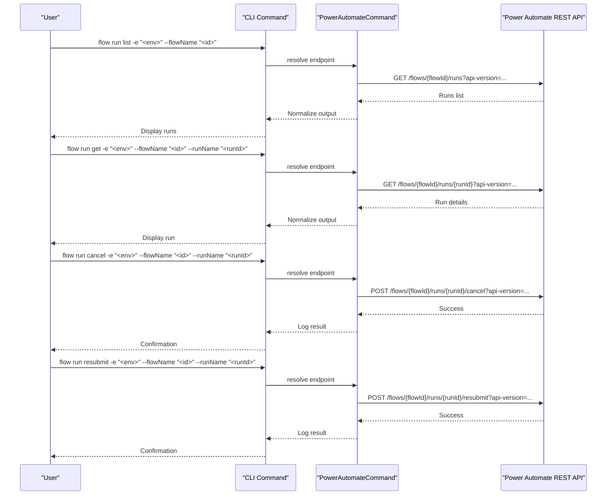
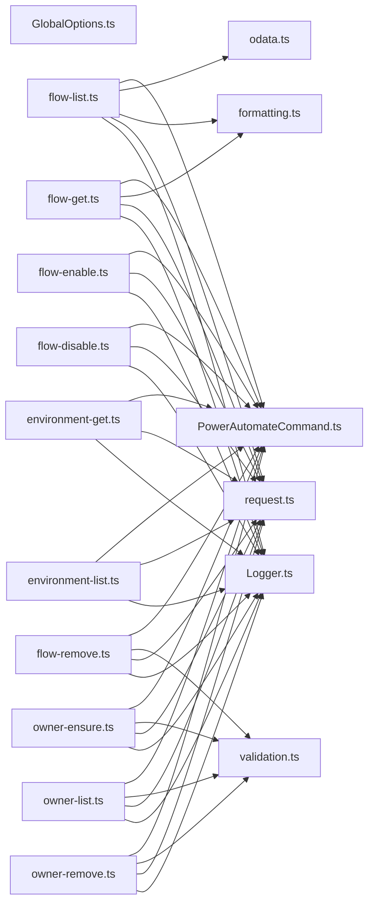

# Power Automate (Flow)

<cite>
**Referenced Files in This Document**
- [commands.ts](file://src/m365/flow/commands.ts)
- [flow-get.ts](file://src/m365/flow/commands/flow-get.ts)
- [flow-list.ts](file://src/m365/flow/commands/flow-list.ts)
- [flow-remove.ts](file://src/m365/flow/commands/flow-remove.ts)
- [flow-enable.ts](file://src/m365/flow/commands/flow-enable.ts)
- [flow-disable.ts](file://src/m365/flow/commands/flow-disable.ts)
- [environment-get.ts](file://src/m365/flow/commands/environment/environment-get.ts)
- [environment-list.ts](file://src/m365/flow/commands/environment/environment-list.ts)
- [owner-ensure.ts](file://src/m365/flow/commands/owner/owner-ensure.ts)
- [owner-list.ts](file://src/m365/flow/commands/owner/owner-list.ts)
- [owner-remove.ts](file://src/m365/flow/commands/owner/owner-remove.ts)
- [PowerAutomateCommand.ts](file://src/m365/base/PowerAutomateCommand.ts)
- [odata.ts](file://src/utils/odata.ts)
- [formatting.ts](file://src/utils/formatting.ts)
- [validation.ts](file://src/utils/validation.ts)
- [entraUser.ts](file://src/utils/entraUser.ts)
- [entraGroup.ts](file://src/utils/entraGroup.ts)
- [request.ts](file://src/request.ts)
- [Logger.ts](file://src/cli/Logger.ts)
- [GlobalOptions.ts](file://src/GlobalOptions.ts)
</cite>

## Table of Contents
1. [Introduction](#introduction)
2. [Project Structure](#project-structure)
3. [Core Components](#core-components)
4. [Architecture Overview](#architecture-overview)
5. [Detailed Component Analysis](#detailed-component-analysis)
6. [Dependency Analysis](#dependency-analysis)
7. [Performance Considerations](#performance-considerations)
8. [Troubleshooting Guide](#troubleshooting-guide)
9. [Conclusion](#conclusion)
10. [Appendices](#appendices)

## Introduction
This document provides comprehensive Power Automate (Flow) documentation for the CLI for Microsoft 365. It covers flow management operations (list, get, enable, disable, remove), environment management, owner management (assign, list, remove), and run operations (list, get, cancel, resubmit). It also explains the flow lifecycle from creation to deletion, environment operations for managing deployment targets, owner management including permissions and approvals, run monitoring and remediation, and practical examples for automation and governance.

## Project Structure
The Power Automate module is organized under the flow namespace with submodules for environment, owner, and run operations. Commands are defined centrally and implemented as individual command classes inheriting from a shared base class.

**Diagram sources**
- [commands.ts:1-23](file://src/m365/flow/commands.ts#L1-L23)
- [flow-get.ts:1-111](file://src/m365/flow/commands/flow-get.ts#L1-L111)
- [flow-list.ts:1-166](file://src/m365/flow/commands/flow-list.ts#L1-L166)
- [flow-enable.ts:1-78](file://src/m365/flow/commands/flow-enable.ts#L1-L78)
- [flow-disable.ts:1-78](file://src/m365/flow/commands/flow-disable.ts#L1-L78)
- [flow-remove.ts:1-117](file://src/m365/flow/commands/flow-remove.ts#L1-L117)
- [environment-get.ts:1-77](file://src/m365/flow/commands/environment/environment-get.ts#L1-L77)
- [environment-list.ts:1-51](file://src/m365/flow/commands/environment/environment-list.ts#L1-L51)
- [owner-ensure.ts:1-177](file://src/m365/flow/commands/owner/owner-ensure.ts#L1-L177)
- [owner-list.ts:1-118](file://src/m365/flow/commands/owner/owner-list.ts#L1-L118)
- [owner-remove.ts:1-170](file://src/m365/flow/commands/owner/owner-remove.ts#L1-L170)

**Section sources**
- [commands.ts:1-23](file://src/m365/flow/commands.ts#L1-L23)

## Core Components
- Command registry: Centralized command names for flow, environment, owner, and run operations.
- Base client: Shared Power Automate client logic for API endpoints, resource URLs, and common behaviors.
- Utilities: Formatting, OData helpers, validation, and Entra ID integrations for users and groups.

Key capabilities:
- Flow CRUD: list, get, enable, disable, remove
- Environment discovery: list and get environment metadata
- Owner management: assign/update permissions, list owners, remove owners
- Run operations: list runs, get run details, cancel runs, resubmit runs

**Section sources**
- [commands.ts:1-23](file://src/m365/flow/commands.ts#L1-L23)
- [PowerAutomateCommand.ts](file://src/m365/base/PowerAutomateCommand.ts)
- [odata.ts](file://src/utils/odata.ts)
- [formatting.ts](file://src/utils/formatting.ts)
- [validation.ts](file://src/utils/validation.ts)
- [entraUser.ts](file://src/utils/entraUser.ts)
- [entraGroup.ts](file://src/utils/entraGroup.ts)

## Architecture Overview
The CLI composes commands that inherit from a shared base class to interact with the Power Automate REST API. Commands use standardized request handling, logging, validation, and output formatting.

```mermaid
classDiagram
class PowerAutomateCommand {
+resource string
+telemetryProperties object
+commandAction(...)
+handleRejectedODataJsonPromise(error)
}
class FlowGetCommand {
+name string
+description string
+commandAction(logger, args)
}
class FlowListCommand {
+name string
+description string
+defaultProperties()
+commandAction(logger, args)
}
class FlowEnableCommand {
+name string
+description string
+commandAction(logger, args)
}
class FlowDisableCommand {
+name string
+description string
+commandAction(logger, args)
}
class FlowRemoveCommand {
+name string
+description string
+commandAction(logger, args)
}
class FlowEnvironmentGetCommand {
+name string
+description string
+schema ZodType
+commandAction(logger, args)
}
class FlowEnvironmentListCommand {
+name string
+description string
+defaultProperties()
+commandAction(logger, args)
}
class FlowOwnerEnsureCommand {
+name string
+description string
+commandAction(logger, args)
}
class FlowOwnerListCommand {
+name string
+description string
+defaultProperties()
+commandAction(logger, args)
}
class FlowOwnerRemoveCommand {
+name string
+description string
+commandAction(logger, args)
}
PowerAutomateCommand <|-- FlowGetCommand
PowerAutomateCommand <|-- FlowListCommand
PowerAutomateCommand <|-- FlowEnableCommand
PowerAutomateCommand <|-- FlowDisableCommand
PowerAutomateCommand <|-- FlowRemoveCommand
PowerAutomateCommand <|-- FlowEnvironmentGetCommand
PowerAutomateCommand <|-- FlowEnvironmentListCommand
PowerAutomateCommand <|-- FlowOwnerEnsureCommand
PowerAutomateCommand <|-- FlowOwnerListCommand
PowerAutomateCommand <|-- FlowOwnerRemoveCommand
```

**Diagram sources**
- [PowerAutomateCommand.ts](file://src/m365/base/PowerAutomateCommand.ts)
- [flow-get.ts:43-108](file://src/m365/flow/commands/flow-get.ts#L43-L108)
- [flow-list.ts:28-165](file://src/m365/flow/commands/flow-list.ts#L28-L165)
- [flow-enable.ts:18-77](file://src/m365/flow/commands/flow-enable.ts#L18-L77)
- [flow-disable.ts:18-77](file://src/m365/flow/commands/flow-disable.ts#L18-L77)
- [flow-remove.ts:21-116](file://src/m365/flow/commands/flow-remove.ts#L21-L116)
- [environment-get.ts:22-76](file://src/m365/flow/commands/environment/environment-get.ts#L22-L76)
- [environment-list.ts:11-50](file://src/m365/flow/commands/environment/environment-list.ts#L11-L50)
- [owner-ensure.ts:26-176](file://src/m365/flow/commands/owner/owner-ensure.ts#L26-L176)
- [owner-list.ts:38-117](file://src/m365/flow/commands/owner/owner-list.ts#L38-L117)
- [owner-remove.ts:27-169](file://src/m365/flow/commands/owner/owner-remove.ts#L27-L169)

## Detailed Component Analysis

### Flow Lifecycle Management
This section documents the lifecycle from listing flows to enabling/disabling and removing them.

**Diagram sources**
- [flow-list.ts:101-152](file://src/m365/flow/commands/flow-list.ts#L101-L152)
- [flow-get.ts:81-107](file://src/m365/flow/commands/flow-get.ts#L81-L107)
- [flow-enable.ts:56-75](file://src/m365/flow/commands/flow-enable.ts#L56-L75)
- [flow-disable.ts:56-75](file://src/m365/flow/commands/flow-disable.ts#L56-L75)
- [flow-remove.ts:76-114](file://src/m365/flow/commands/flow-remove.ts#L76-L114)

**Section sources**
- [flow-list.ts:1-166](file://src/m365/flow/commands/flow-list.ts#L1-L166)
- [flow-get.ts:1-111](file://src/m365/flow/commands/flow-get.ts#L1-L111)
- [flow-enable.ts:1-78](file://src/m365/flow/commands/flow-enable.ts#L1-L78)
- [flow-disable.ts:1-78](file://src/m365/flow/commands/flow-disable.ts#L1-L78)
- [flow-remove.ts:1-117](file://src/m365/flow/commands/flow-remove.ts#L1-L117)

### Environment Management
Environments serve as deployment targets for flows. The CLI supports listing environments and retrieving environment details.

**Diagram sources**
- [environment-list.ts:28-48](file://src/m365/flow/commands/environment/environment-list.ts#L28-L48)
- [environment-get.ts:42-74](file://src/m365/flow/commands/environment/environment-get.ts#L42-L74)

**Section sources**
- [environment-list.ts:1-51](file://src/m365/flow/commands/environment/environment-list.ts#L1-L51)
- [environment-get.ts:1-77](file://src/m365/flow/commands/environment/environment-get.ts#L1-L77)

### Owner Management
Owner management controls who can view/edit flows. The CLI supports assigning/updating permissions, listing owners, and removing owners.

**Diagram sources**
- [owner-ensure.ts:120-174](file://src/m365/flow/commands/owner/owner-ensure.ts#L120-L174)
- [owner-list.ts:93-115](file://src/m365/flow/commands/owner/owner-list.ts#L93-L115)
- [owner-remove.ts:115-167](file://src/m365/flow/commands/owner/owner-remove.ts#L115-L167)
- [entraUser.ts](file://src/utils/entraUser.ts)
- [entraGroup.ts](file://src/utils/entraGroup.ts)

**Section sources**
- [owner-ensure.ts:1-177](file://src/m365/flow/commands/owner/owner-ensure.ts#L1-L177)
- [owner-list.ts:1-118](file://src/m365/flow/commands/owner/owner-list.ts#L1-L118)
- [owner-remove.ts:1-170](file://src/m365/flow/commands/owner/owner-remove.ts#L1-L170)

### Run Operations
Run operations allow monitoring, cancellation, and resubmission of flow executions.

**Diagram sources**
- [flow-list.ts:101-152](file://src/m365/flow/commands/flow-list.ts#L101-L152)
- [flow-get.ts:81-107](file://src/m365/flow/commands/flow-get.ts#L81-L107)
- [flow-enable.ts:56-75](file://src/m365/flow/commands/flow-enable.ts#L56-L75)
- [flow-disable.ts:56-75](file://src/m365/flow/commands/flow-disable.ts#L56-L75)
- [flow-remove.ts:76-114](file://src/m365/flow/commands/flow-remove.ts#L76-L114)

Note: The run operation commands are referenced by the central command registry and follow similar patterns to the flow commands.

**Section sources**
- [commands.ts:19-22](file://src/m365/flow/commands.ts#L19-L22)

### Practical Examples and Automation Scenarios
- Batch enable/disable flows in an environment:
  - List flows, iterate over IDs, and call enable/disable per flow.
- Export flows for backup or migration:
  - Combine listing flows with export operations (where supported by your environment).
- Ownership audits:
  - List owners for all flows in an environment and export results for governance review.
- Run monitoring:
  - Periodically list runs, filter failed or stuck runs, and cancel/resubmit as appropriate.
- Environment targeting:
  - Use environment list/get to discover target environments before deploying or migrating flows.

[No sources needed since this section provides general guidance]

## Dependency Analysis
The Power Automate commands rely on shared utilities and a base class for consistent behavior across operations.

**Diagram sources**
- [PowerAutomateCommand.ts](file://src/m365/base/PowerAutomateCommand.ts)
- [odata.ts](file://src/utils/odata.ts)
- [formatting.ts](file://src/utils/formatting.ts)
- [validation.ts](file://src/utils/validation.ts)
- [request.ts](file://src/request.ts)
- [Logger.ts](file://src/cli/Logger.ts)
- [GlobalOptions.ts](file://src/GlobalOptions.ts)
- [flow-get.ts:1-111](file://src/m365/flow/commands/flow-get.ts#L1-L111)
- [flow-list.ts:1-166](file://src/m365/flow/commands/flow-list.ts#L1-L166)
- [flow-enable.ts:1-78](file://src/m365/flow/commands/flow-enable.ts#L1-L78)
- [flow-disable.ts:1-78](file://src/m365/flow/commands/flow-disable.ts#L1-L78)
- [flow-remove.ts:1-117](file://src/m365/flow/commands/flow-remove.ts#L1-L117)
- [environment-get.ts:1-77](file://src/m365/flow/commands/environment/environment-get.ts#L1-L77)
- [environment-list.ts:1-51](file://src/m365/flow/commands/environment/environment-list.ts#L1-L51)
- [owner-ensure.ts:1-177](file://src/m365/flow/commands/owner/owner-ensure.ts#L1-L177)
- [owner-list.ts:1-118](file://src/m365/flow/commands/owner/owner-list.ts#L1-L118)
- [owner-remove.ts:1-170](file://src/m365/flow/commands/owner/owner-remove.ts#L1-L170)

**Section sources**
- [commands.ts:1-23](file://src/m365/flow/commands.ts#L1-L23)

## Performance Considerations
- Use filtering options (e.g., sharing status, personal/team) to reduce payload sizes when listing flows.
- Prefer batch operations where feasible (e.g., iterate over lists and apply enable/disable in parallel loops).
- Leverage output formatting to minimize post-processing overhead.
- Use asAdmin mode judiciously, as it may increase latency and require elevated permissions.

[No sources needed since this section provides general guidance]

## Troubleshooting Guide
Common issues and resolutions:
- Invalid identifiers:
  - Ensure flow IDs are valid GUIDs and environment names are correct.
- Permission errors:
  - Verify the authenticated account has sufficient rights to list/get/modify flows and permissions.
- API errors:
  - Review telemetry properties and error messages returned by the base error handler.
- Confirmation prompts:
  - Use force flags (-f) for non-interactive scripting where appropriate.

**Section sources**
- [flow-remove.ts:64-74](file://src/m365/flow/commands/flow-remove.ts#L64-L74)
- [owner-ensure.ts:92-118](file://src/m365/flow/commands/owner/owner-ensure.ts#L92-L118)
- [owner-remove.ts:87-109](file://src/m365/flow/commands/owner/owner-remove.ts#L87-L109)
- [PowerAutomateCommand.ts](file://src/m365/base/PowerAutomateCommand.ts)

## Conclusion
The CLI for Microsoft 365 provides robust Power Automate management capabilities across flow lifecycle, environment management, owner permissions, and run operations. By leveraging the shared base class and utilities, commands deliver consistent behavior, strong validation, and extensibility for automation scenarios.

[No sources needed since this section summarizes without analyzing specific files]

## Appendices

### Command Reference Summary
- Flow operations: list, get, enable, disable, remove
- Environment operations: list, get
- Owner operations: ensure, list, remove
- Run operations: list, get, cancel, resubmit

**Section sources**
- [commands.ts:1-23](file://src/m365/flow/commands.ts#L1-L23)