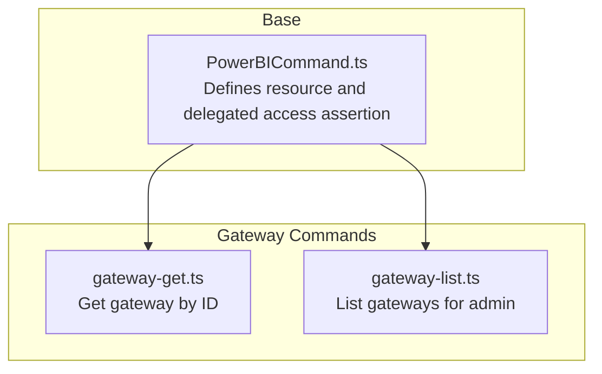
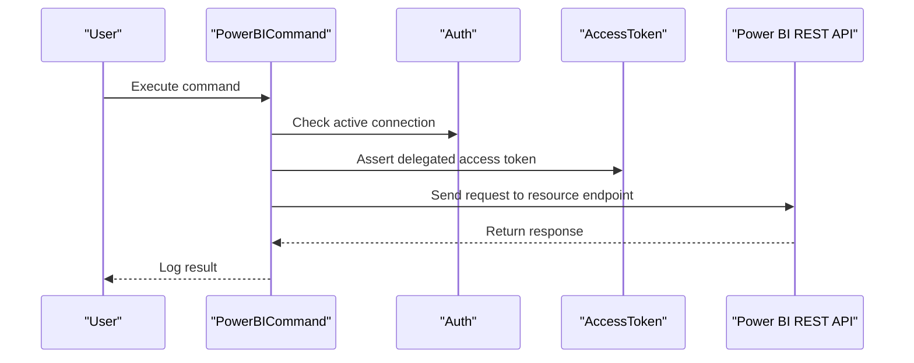
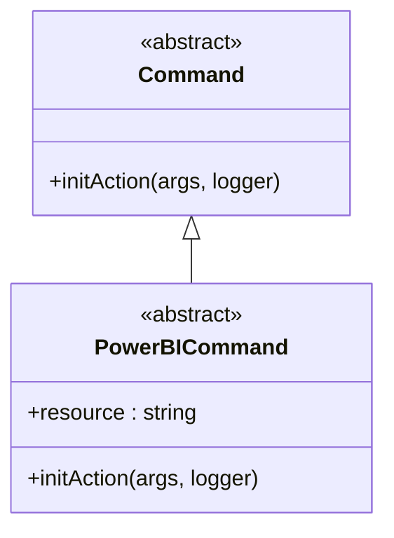
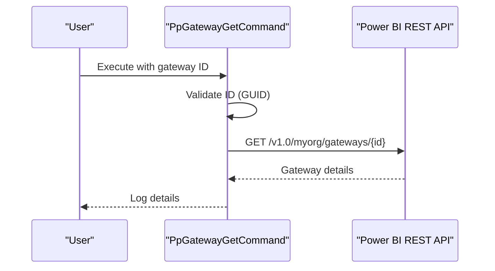
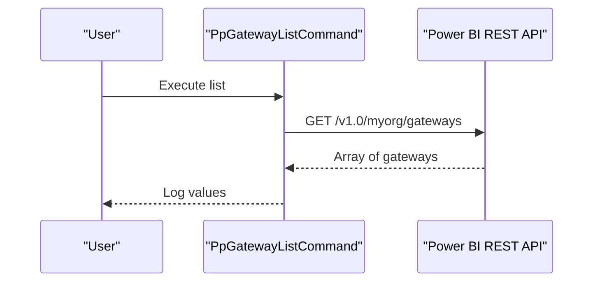
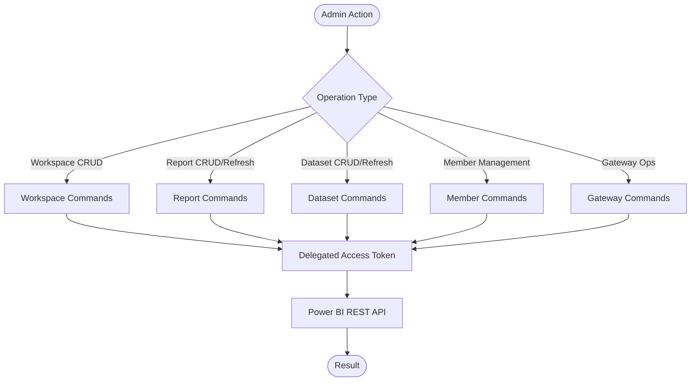
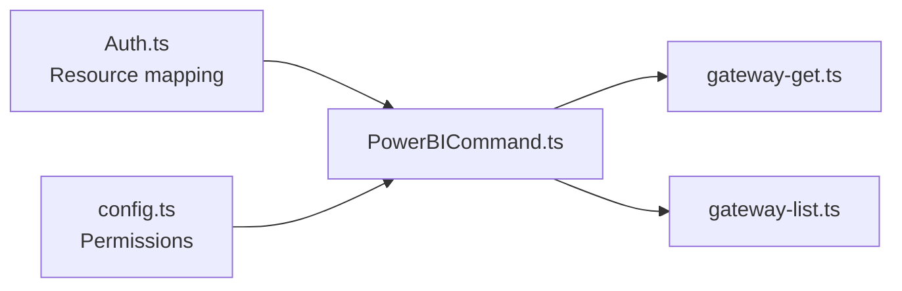

# Power BI

<cite>
**Referenced Files in This Document**
- [PowerBICommand.ts](file://src/m365/base/PowerBICommand.ts)
- [gateway-get.ts](file://src/m365/pp/commands/gateway/gateway-get.ts)
- [gateway-list.ts](file://src/m365/pp/commands/gateway/gateway-list.ts)
- [Auth.ts](file://src/Auth.ts)
- [config.ts](file://src/config.ts)
- [PowerBICommand.spec.ts](file://src/m365/base/PowerBICommand.spec.ts)
- [gateway-get.spec.ts](file://src/m365/pp/commands/gateway/gateway-get.spec.ts)
- [gateway-list.spec.ts](file://src/m365/pp/commands/gateway/gateway-list.spec.ts)
</cite>

## Table of Contents
1. [Introduction](#introduction)
2. [Project Structure](#project-structure)
3. [Core Components](#core-components)
4. [Architecture Overview](#architecture-overview)
5. [Detailed Component Analysis](#detailed-component-analysis)
6. [Dependency Analysis](#dependency-analysis)
7. [Performance Considerations](#performance-considerations)
8. [Troubleshooting Guide](#troubleshooting-guide)
9. [Conclusion](#conclusion)
10. [Appendices](#appendices)

## Introduction
This document provides comprehensive Power BI documentation for CLI for Microsoft 365. It focuses on Power BI workspace management, report operations, dataset management, workspace member operations, and dataset gateway operations. It also includes practical examples for automation, provisioning, and data refresh scheduling, along with governance, security, and compliance guidance for enterprise deployments.

## Project Structure
The CLI implements Power BI support via a dedicated base command class and Power Platform gateway commands. The base class encapsulates common Power BI authentication and resource handling, while gateway commands demonstrate how to interact with Power BI resources using delegated access tokens and the Power BI REST API.

**Diagram sources**
- [PowerBICommand.ts:1-23](file://src/m365/base/PowerBICommand.ts#L1-L23)
- [gateway-get.ts:1-62](file://src/m365/pp/commands/gateway/gateway-get.ts#L1-L62)
- [gateway-list.ts:1-51](file://src/m365/pp/commands/gateway/gateway-list.ts#L1-L51)

**Section sources**
- [PowerBICommand.ts:1-23](file://src/m365/base/PowerBICommand.ts#L1-L23)
- [gateway-get.ts:1-62](file://src/m365/pp/commands/gateway/gateway-get.ts#L1-L62)
- [gateway-list.ts:1-51](file://src/m365/pp/commands/gateway/gateway-list.ts#L1-L51)

## Core Components
- PowerBICommand: Base class that defines the Power BI resource endpoint and enforces delegated access token usage for actions.
- Gateway commands: Concrete commands that extend PowerBICommand to retrieve gateway details and list gateways.

Key responsibilities:
- Resource definition: Centralizes the Power BI resource identifier used by derived commands.
- Access control: Ensures delegated access tokens are used, aligning with Power BI service requirements.
- Gateway operations: Demonstrates how to call Power BI REST endpoints for gateway management.

**Section sources**
- [PowerBICommand.ts:6-22](file://src/m365/base/PowerBICommand.ts#L6-L22)
- [gateway-get.ts:9-62](file://src/m365/pp/commands/gateway/gateway-get.ts#L9-L62)
- [gateway-list.ts:10-51](file://src/m365/pp/commands/gateway/gateway-list.ts#L10-L51)

## Architecture Overview
The Power BI integration follows a layered pattern:
- Base command layer: Provides shared behavior for Power BI operations.
- Command layer: Implements specific operations (e.g., gateway retrieval and listing).
- Authentication and token enforcement: Ensures delegated access tokens are used for Power BI requests.

**Diagram sources**
- [PowerBICommand.ts:11-20](file://src/m365/base/PowerBICommand.ts#L11-L20)
- [Auth.ts:874-877](file://src/Auth.ts#L874-L877)

## Detailed Component Analysis

### PowerBICommand Base Class
The base class centralizes Power BI resource handling and access control:
- Defines the Power BI resource endpoint used by derived commands.
- Enforces delegated access token usage during initialization.
- Inherits common command infrastructure for logging and argument handling.

**Diagram sources**
- [PowerBICommand.ts:5-22](file://src/m365/base/PowerBICommand.ts#L5-L22)

**Section sources**
- [PowerBICommand.ts:6-22](file://src/m365/base/PowerBICommand.ts#L6-L22)
- [PowerBICommand.spec.ts:9-28](file://src/m365/base/PowerBICommand.spec.ts#L9-L28)
- [PowerBICommand.spec.ts:104-104](file://src/m365/base/PowerBICommand.spec.ts#L104-L104)

### Gateway Get Command
Retrieves details for a specific gateway by ID:
- Validates the gateway ID as a GUID.
- Calls the Power BI REST API to fetch gateway metadata.
- Logs the response or handles errors.

**Diagram sources**
- [gateway-get.ts:39-59](file://src/m365/pp/commands/gateway/gateway-get.ts#L39-L59)

**Section sources**
- [gateway-get.ts:9-62](file://src/m365/pp/commands/gateway/gateway-get.ts#L9-L62)
- [gateway-get.spec.ts:121-121](file://src/m365/pp/commands/gateway/gateway-get.spec.ts#L121-L121)

### Gateway List Command
Lists gateways for which the user has administrative rights:
- Constructs a request to the Power BI REST API to list gateways.
- Returns a simplified set of properties by default.
- Handles errors consistently.

**Diagram sources**
- [gateway-list.ts:27-47](file://src/m365/pp/commands/gateway/gateway-list.ts#L27-L47)

**Section sources**
- [gateway-list.ts:10-51](file://src/m365/pp/commands/gateway/gateway-list.ts#L10-L51)
- [gateway-list.spec.ts:1-50](file://src/m365/pp/commands/gateway/gateway-list.spec.ts#L1-L50)

### Conceptual Overview
While the current codebase demonstrates gateway operations, broader Power BI capabilities (workspaces, reports, datasets, and member management) are not implemented in the referenced files. The following conceptual guidance outlines how such features would integrate with the existing architecture.

[No sources needed since this diagram shows conceptual workflow, not actual code structure]

[No sources needed since this section doesn't analyze specific source files]

## Dependency Analysis
- PowerBICommand depends on the base Command class and the authentication subsystem to enforce delegated access tokens.
- Gateway commands depend on PowerBICommand for resource handling and on the request utility for HTTP operations.
- The configuration module includes permissions related to Power BI resources.

**Diagram sources**
- [Auth.ts:874-877](file://src/Auth.ts#L874-L877)
- [config.ts:60-60](file://src/config.ts#L60-L60)
- [PowerBICommand.ts:1-23](file://src/m365/base/PowerBICommand.ts#L1-L23)
- [gateway-get.ts:1-62](file://src/m365/pp/commands/gateway/gateway-get.ts#L1-L62)
- [gateway-list.ts:1-51](file://src/m365/pp/commands/gateway/gateway-list.ts#L1-L51)

**Section sources**
- [Auth.ts:874-877](file://src/Auth.ts#L874-L877)
- [config.ts:60-60](file://src/config.ts#L60-L60)
- [PowerBICommand.ts:1-23](file://src/m365/base/PowerBICommand.ts#L1-L23)
- [gateway-get.ts:1-62](file://src/m365/pp/commands/gateway/gateway-get.ts#L1-L62)
- [gateway-list.ts:1-51](file://src/m365/pp/commands/gateway/gateway-list.ts#L1-L51)

## Performance Considerations
- Minimize repeated network calls by caching gateway lists when appropriate.
- Use filtering and projection in API responses to reduce payload sizes.
- Batch operations where supported by the Power BI REST API to lower latency.

[No sources needed since this section provides general guidance]

## Troubleshooting Guide
Common issues and resolutions:
- Authentication failures: Ensure delegated access tokens are present and valid. The base command enforces delegated access during initialization.
- Invalid gateway IDs: Validate identifiers as GUIDs before issuing requests.
- Permission errors: Confirm that the authenticated user has administrative rights for the requested operation.

**Section sources**
- [PowerBICommand.ts:11-20](file://src/m365/base/PowerBICommand.ts#L11-L20)
- [gateway-get.ts:30-37](file://src/m365/pp/commands/gateway/gateway-get.ts#L30-L37)
- [gateway-get.spec.ts:121-121](file://src/m365/pp/commands/gateway/gateway-get.spec.ts#L121-L121)

## Conclusion
The CLI provides a solid foundation for Power BI operations through a shared base command and gateway commands. For enterprise-grade deployments, extend the base class to implement workspace, report, dataset, and member management commands while adhering to delegated access token requirements and robust error handling.

[No sources needed since this section summarizes without analyzing specific files]

## Appendices
- Practical examples for automation, provisioning, and data refresh scheduling can be built upon the existing gateway commands and base class patterns.
- Governance, security, and compliance should align with organizational policies and the delegated access model enforced by the base command.

[No sources needed since this section provides general guidance]