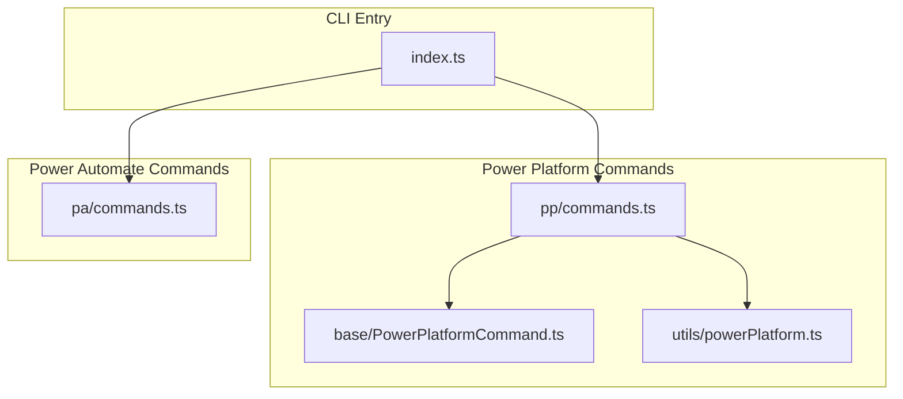
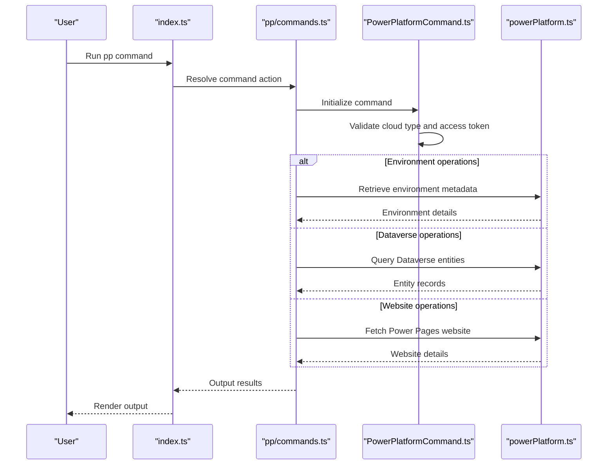
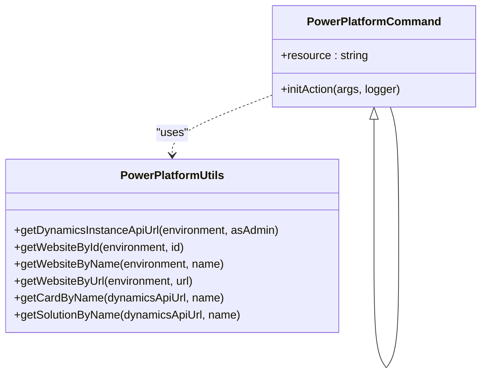
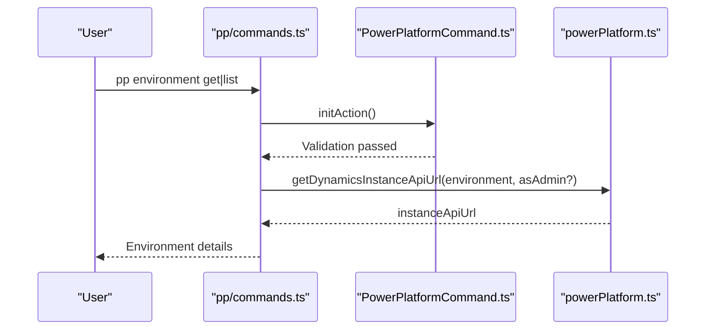
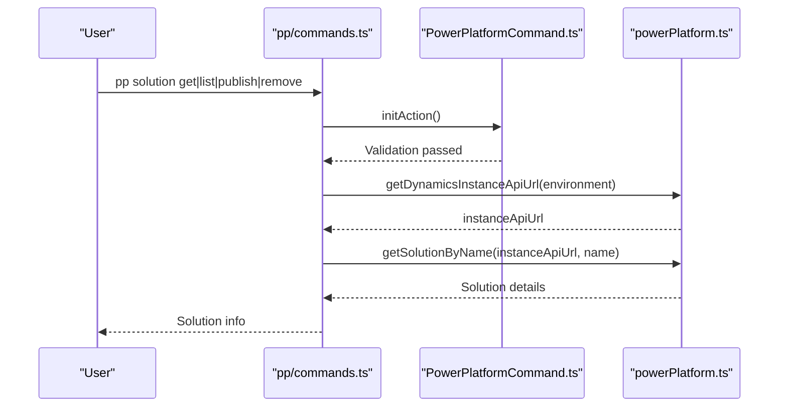
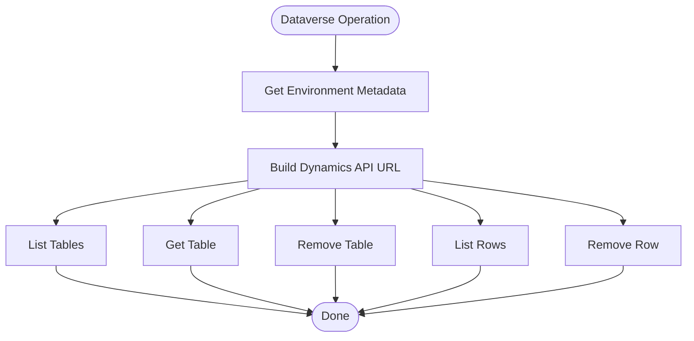
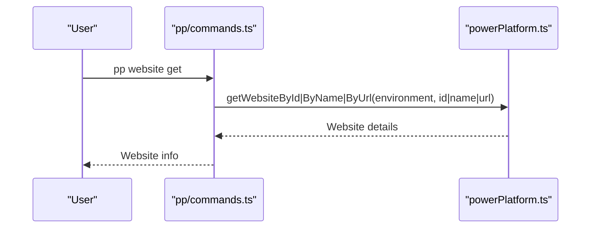
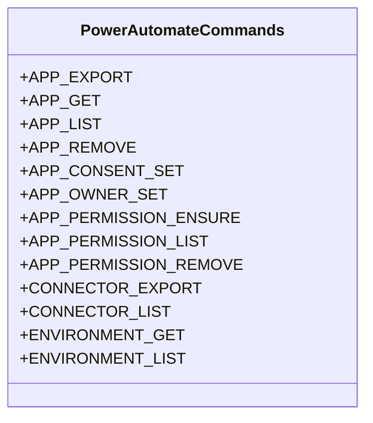
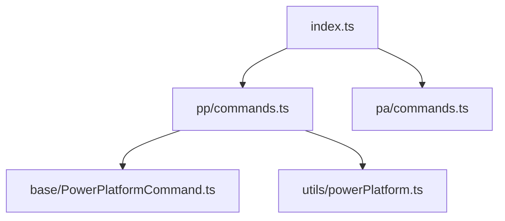

# Power Platform Services

<cite>
**Referenced Files in This Document**
- [commands.ts](file://src/m365/pp/commands.ts)
- [powerPlatform.ts](file://src/utils/powerPlatform.ts)
- [PowerPlatformCommand.ts](file://src/m365/base/PowerPlatformCommand.ts)
- [commands.ts](file://src/m365/pa/commands.ts)
- [index.ts](file://src/index.ts)
</cite>

## Table of Contents
1. [Introduction](#introduction)
2. [Project Structure](#project-structure)
3. [Core Components](#core-components)
4. [Architecture Overview](#architecture-overview)
5. [Detailed Component Analysis](#detailed-component-analysis)
6. [Dependency Analysis](#dependency-analysis)
7. [Performance Considerations](#performance-considerations)
8. [Troubleshooting Guide](#troubleshooting-guide)
9. [Conclusion](#conclusion)
10. [Appendices](#appendices)

## Introduction
This document describes the Power Platform services exposed through the CLI for Microsoft 365. It focuses on the command suite for Power Platform, including Power Automate (Flow), Power Apps, Power BI, and Dataverse operations. It explains how environments are managed, how solutions are handled, and how Power Apps and Power Automate flows integrate with environments and solutions. Practical automation scenarios are included to guide administrators in automating Power Platform tasks.

## Project Structure
The Power Platform command surface is organized under the pp namespace and integrates with shared base command infrastructure and utility helpers. The primary entry points are:
- Power Platform command definitions
- Base Power Platform command class
- Power Platform utilities for environment and Dataverse operations
- Power Automate command definitions
- CLI entry point

**Diagram sources**
- [index.ts:1-22](file://src/index.ts#L1-L22)
- [commands.ts:1-32](file://src/m365/pp/commands.ts#L1-L32)
- [PowerPlatformCommand.ts:1-27](file://src/m365/base/PowerPlatformCommand.ts#L1-L27)
- [powerPlatform.ts:1-170](file://src/utils/powerPlatform.ts#L1-L170)
- [commands.ts:1-18](file://src/m365/pa/commands.ts#L1-L18)

**Section sources**
- [index.ts:1-22](file://src/index.ts#L1-L22)
- [commands.ts:1-32](file://src/m365/pp/commands.ts#L1-L32)
- [PowerPlatformCommand.ts:1-27](file://src/m365/base/PowerPlatformCommand.ts#L1-L27)
- [powerPlatform.ts:1-170](file://src/utils/powerPlatform.ts#L1-L170)
- [commands.ts:1-18](file://src/m365/pa/commands.ts#L1-L18)

## Core Components
- Power Platform command definitions: Defines the available commands under the pp namespace, including environment, solution, Dataverse, gateway, management app, tenant settings, and Power Pages website operations.
- Power Platform base command: Provides shared initialization logic for Power Platform commands, including cloud type validation and delegated access token enforcement.
- Power Platform utilities: Offers helper functions for environment metadata retrieval, Dataverse entity queries, and Power Pages website operations.
- Power Automate command definitions: Defines Power Automate-related commands such as app operations, connector operations, and environment operations.

Key responsibilities:
- Environment operations: List and get environments, resolve Dynamics instance API URLs.
- Solution operations: List, get, publish, remove, and manage publishers for solutions.
- Dataverse operations: List and get tables, list and remove rows.
- Power Pages website operations: List and get websites by id/name/url.
- Power Automate operations: App export/get/list/remove, connector export/list, environment get/list.

**Section sources**
- [commands.ts:1-32](file://src/m365/pp/commands.ts#L1-L32)
- [PowerPlatformCommand.ts:1-27](file://src/m365/base/PowerPlatformCommand.ts#L1-L27)
- [powerPlatform.ts:1-170](file://src/utils/powerPlatform.ts#L1-L170)
- [commands.ts:1-18](file://src/m365/pa/commands.ts#L1-L18)

## Architecture Overview
The Power Platform command suite follows a layered architecture:
- CLI entry resolves and executes commands.
- Command definitions map to command handlers.
- Base command class enforces environment constraints and access tokens.
- Utilities encapsulate Power Platform API interactions and OData queries.

**Diagram sources**
- [index.ts:1-22](file://src/index.ts#L1-L22)
- [commands.ts:1-32](file://src/m365/pp/commands.ts#L1-L32)
- [PowerPlatformCommand.ts:1-27](file://src/m365/base/PowerPlatformCommand.ts#L1-L27)
- [powerPlatform.ts:1-170](file://src/utils/powerPlatform.ts#L1-L170)

## Detailed Component Analysis

### Power Platform Command Suite
The pp command suite exposes operations for environments, solutions, Dataverse, gateways, management apps, tenant settings, and Power Pages websites. These commands enable environment discovery, solution lifecycle management, Dataverse entity operations, and website management.

**Diagram sources**
- [PowerPlatformCommand.ts:1-27](file://src/m365/base/PowerPlatformCommand.ts#L1-L27)
- [powerPlatform.ts:1-170](file://src/utils/powerPlatform.ts#L1-L170)

**Section sources**
- [commands.ts:1-32](file://src/m365/pp/commands.ts#L1-L32)
- [PowerPlatformCommand.ts:1-27](file://src/m365/base/PowerPlatformCommand.ts#L1-L27)
- [powerPlatform.ts:1-170](file://src/utils/powerPlatform.ts#L1-L170)

### Environment Management
Environment operations include listing and retrieving environment details. The environment metadata includes the Dynamics instance API URL, which is essential for subsequent Dataverse operations.

**Diagram sources**
- [PowerPlatformCommand.ts:1-27](file://src/m365/base/PowerPlatformCommand.ts#L1-L27)
- [powerPlatform.ts:37-62](file://src/utils/powerPlatform.ts#L37-L62)

**Section sources**
- [powerPlatform.ts:37-62](file://src/utils/powerPlatform.ts#L37-L62)

### Solution Management
Solution operations include listing, getting, publishing, removing, and managing publishers. The solution name is resolved against the Dynamics instance API URL, and publisher operations are supported.

**Diagram sources**
- [PowerPlatformCommand.ts:1-27](file://src/m365/base/PowerPlatformCommand.ts#L1-L27)
- [powerPlatform.ts:148-169](file://src/utils/powerPlatform.ts#L148-L169)

**Section sources**
- [commands.ts:21-28](file://src/m365/pp/commands.ts#L21-L28)
- [powerPlatform.ts:148-169](file://src/utils/powerPlatform.ts#L148-L169)

### Dataverse Operations
Dataverse operations include listing tables, retrieving a specific table, removing a table, listing rows, and removing rows. These operations rely on the Dynamics instance API URL.

**Diagram sources**
- [commands.ts:10-14](file://src/m365/pp/commands.ts#L10-L14)
- [powerPlatform.ts:37-62](file://src/utils/powerPlatform.ts#L37-L62)

**Section sources**
- [commands.ts:10-14](file://src/m365/pp/commands.ts#L10-L14)
- [powerPlatform.ts:37-62](file://src/utils/powerPlatform.ts#L37-L62)

### Power Pages Website Management
Power Pages website operations include listing websites and retrieving websites by id, name, or URL. These operations target the Power Pages API under the Power Platform resource.

**Diagram sources**
- [commands.ts:31](file://src/m365/pp/commands.ts#L31)
- [powerPlatform.ts:64-109](file://src/utils/powerPlatform.ts#L64-L109)

**Section sources**
- [commands.ts:31](file://src/m365/pp/commands.ts#L31)
- [powerPlatform.ts:64-109](file://src/utils/powerPlatform.ts#L64-L109)

### Power Automate Command Suite
Power Automate commands include app export/get/list/remove, connector export/list, and environment get/list. These complement the Power Platform suite by focusing on Power Automate assets and environments.

**Diagram sources**
- [commands.ts:1-18](file://src/m365/pa/commands.ts#L1-L18)

**Section sources**
- [commands.ts:1-18](file://src/m365/pa/commands.ts#L1-L18)

### Power Apps Integration
Power Apps operations are part of the broader Power Platform ecosystem. While the current repository snapshot primarily exposes Power Platform commands via the pp namespace, Power Apps app management is covered by Power Automate commands (e.g., app export/get/list/remove). For deeper Power Apps integration, consult the Power Apps command suite in the repository.

[No sources needed since this section provides general guidance]

## Dependency Analysis
The Power Platform command suite depends on:
- Shared base command class for environment validation and access token enforcement
- Utility module for Power Platform API interactions and OData queries
- CLI entry point for command resolution and execution

**Diagram sources**
- [index.ts:1-22](file://src/index.ts#L1-L22)
- [commands.ts:1-32](file://src/m365/pp/commands.ts#L1-L32)
- [PowerPlatformCommand.ts:1-27](file://src/m365/base/PowerPlatformCommand.ts#L1-L27)
- [powerPlatform.ts:1-170](file://src/utils/powerPlatform.ts#L1-L170)
- [commands.ts:1-18](file://src/m365/pa/commands.ts#L1-L18)

**Section sources**
- [index.ts:1-22](file://src/index.ts#L1-L22)
- [commands.ts:1-32](file://src/m365/pp/commands.ts#L1-L32)
- [PowerPlatformCommand.ts:1-27](file://src/m365/base/PowerPlatformCommand.ts#L1-L27)
- [powerPlatform.ts:1-170](file://src/utils/powerPlatform.ts#L1-L170)
- [commands.ts:1-18](file://src/m365/pa/commands.ts#L1-L18)

## Performance Considerations
- Environment metadata retrieval: Resolving the Dynamics instance API URL is a single API call per environment operation; cache results when iterating multiple environments.
- Dataverse queries: Use filtering and projection to minimize payload sizes when listing tables or rows.
- Website operations: Prefer exact match lookups (by id) to avoid listing all websites when a specific website is known.

[No sources needed since this section provides general guidance]

## Troubleshooting Guide
Common issues and resolutions:
- Cloud type mismatch: Power Platform commands currently support the public cloud. Attempting to use other clouds will result in an error.
- Access token type: Power Platform commands require delegated access tokens; application-only tokens are not supported.
- Environment retrieval failures: Ensure the environment exists and the account has permissions to read environment metadata.
- Entity lookup failures: When multiple entities match a name, the system requests explicit selection; provide a unique identifier or refine the search.

**Section sources**
- [PowerPlatformCommand.ts:20-25](file://src/m365/base/PowerPlatformCommand.ts#L20-L25)
- [powerPlatform.ts:55-61](file://src/utils/powerPlatform.ts#L55-L61)
- [powerPlatform.ts:87-96](file://src/utils/powerPlatform.ts#L87-L96)
- [powerPlatform.ts:130-139](file://src/utils/powerPlatform.ts#L130-L139)
- [powerPlatform.ts:159-168](file://src/utils/powerPlatform.ts#L159-L168)

## Conclusion
The CLI for Microsoft 365 provides a comprehensive Power Platform command suite enabling environment management, solution lifecycle operations, Dataverse entity management, and Power Pages website operations. The base command class ensures consistent environment validation and access token enforcement, while utilities encapsulate Power Platform API interactions. Together with Power Automate commands, administrators can automate Power Platform administration tasks effectively.

[No sources needed since this section summarizes without analyzing specific files]

## Appendices

### Practical Automation Scenarios
- Export all Power Automate flows from an environment: Use Power Automate commands to list and export flows programmatically.
- Inventory Power Apps across environments: Use Power Automate app commands to list apps and export metadata for reporting.
- Manage Dataverse entities: Use Dataverse commands to list tables, export rows, and remove outdated data.
- Monitor Power Pages websites: Use website commands to list and retrieve website details for compliance and governance.

[No sources needed since this section provides general guidance]