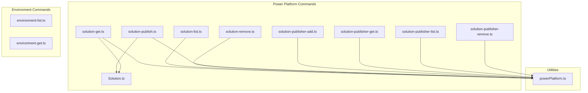
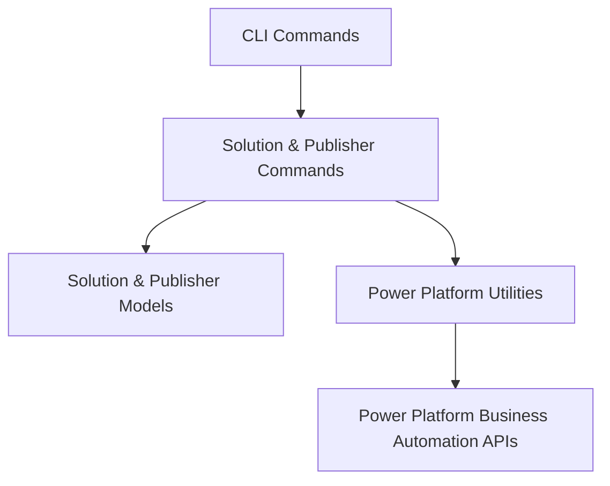
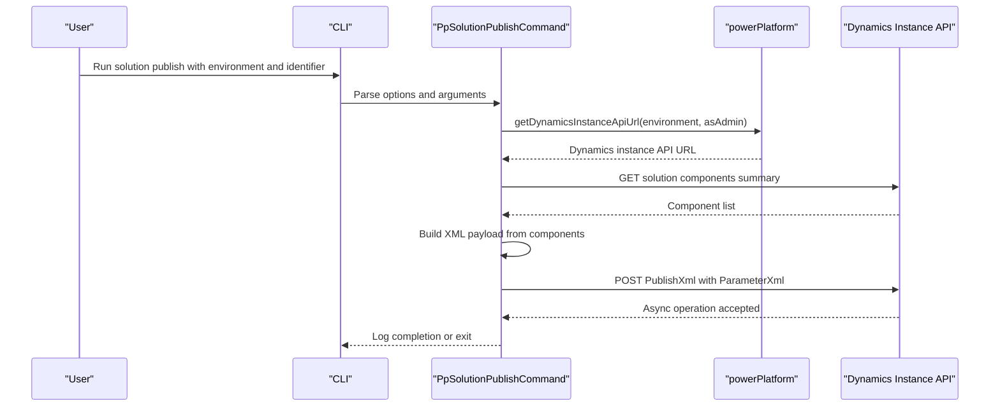
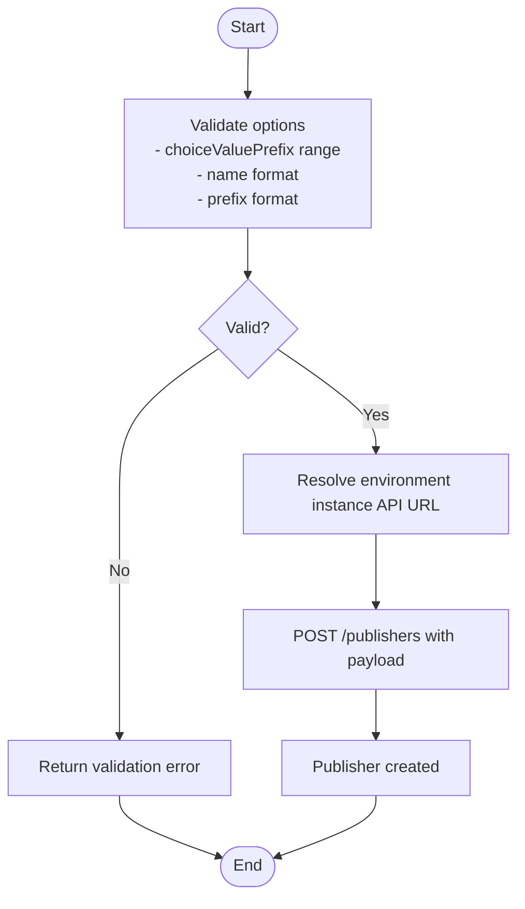
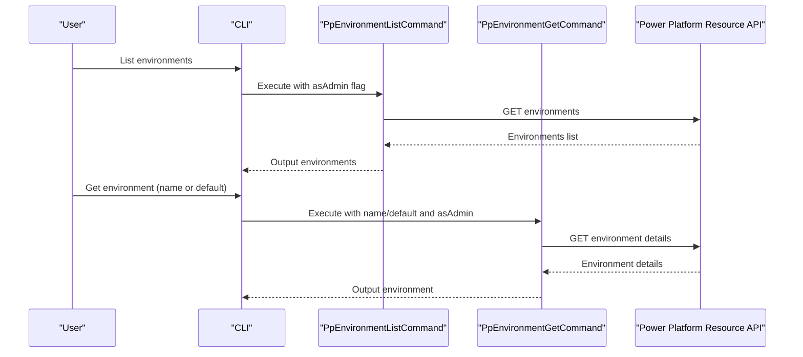
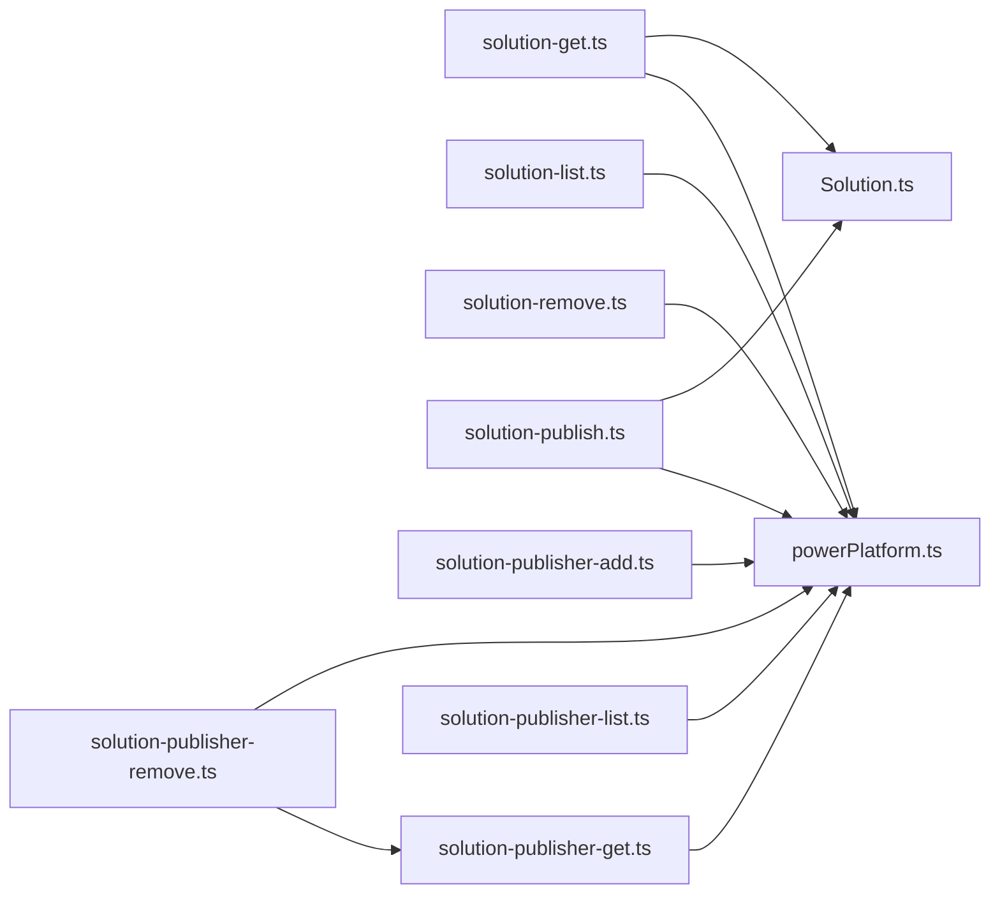

# Solution Management

<cite>
**Referenced Files in This Document**
- [commands.ts](file://src/m365/pp/commands.ts)
- [Solution.ts](file://src/m365/pp/commands/solution/Solution.ts)
- [solution-get.ts](file://src/m365/pp/commands/solution/solution-get.ts)
- [solution-list.ts](file://src/m365/pp/commands/solution/solution-list.ts)
- [solution-publish.ts](file://src/m365/pp/commands/solution/solution-publish.ts)
- [solution-remove.ts](file://src/m365/pp/commands/solution/solution-remove.ts)
- [solution-publisher-add.ts](file://src/m365/pp/commands/solution/solution-publisher-add.ts)
- [solution-publisher-get.ts](file://src/m365/pp/commands/solution/solution-publisher-get.ts)
- [solution-publisher-list.ts](file://src/m365/pp/commands/solution/solution-publisher-list.ts)
- [solution-publisher-remove.ts](file://src/m365/pp/commands/solution/solution-publisher-remove.ts)
- [powerPlatform.ts](file://src/utils/powerPlatform.ts)
- [environment-list.ts](file://src/m365/pp/commands/environment/environment-list.ts)
- [environment-get.ts](file://src/m365/pp/commands/environment/environment-get.ts)
</cite>

## Table of Contents
1. [Introduction](#introduction)
2. [Project Structure](#project-structure)
3. [Core Components](#core-components)
4. [Architecture Overview](#architecture-overview)
5. [Detailed Component Analysis](#detailed-component-analysis)
6. [Dependency Analysis](#dependency-analysis)
7. [Performance Considerations](#performance-considerations)
8. [Troubleshooting Guide](#troubleshooting-guide)
9. [Conclusion](#conclusion)
10. [Appendices](#appendices)

## Introduction
This document provides comprehensive solution management documentation for CLI for Microsoft 365 with a focus on Power Platform solutions. It covers solution CRUD operations (list, get, remove), publishing of solution components, and publisher management (CRUD, versioning, and dependency considerations). It also explains environment operations for solution deployment, environment selection, and solution lifecycle management. Practical examples demonstrate automation scenarios, bulk operations, and environment-specific management. Governance, versioning strategies, and integration with Power Platform development workflows are addressed to support reliable, repeatable administration.

## Project Structure
The solution management capabilities are implemented under the Power Platform module. The primary solution commands are grouped under the solution namespace, while environment commands enable environment discovery and selection. Utility helpers centralize Power Platform API interactions.

**Diagram sources**
- [solution-get.ts:1-130](file://src/m365/pp/commands/solution/solution-get.ts#L1-L130)
- [solution-list.ts:1-88](file://src/m365/pp/commands/solution/solution-list.ts#L1-L88)
- [solution-publish.ts:1-178](file://src/m365/pp/commands/solution/solution-publish.ts#L1-L178)
- [solution-remove.ts:1-137](file://src/m365/pp/commands/solution/solution-remove.ts#L1-L137)
- [solution-publisher-add.ts:1-120](file://src/m365/pp/commands/solution/solution-publisher-add.ts#L1-L120)
- [solution-publisher-get.ts:1-126](file://src/m365/pp/commands/solution/solution-publisher-get.ts#L1-L126)
- [solution-publisher-list.ts:1-87](file://src/m365/pp/commands/solution/solution-publisher-list.ts#L1-L87)
- [solution-publisher-remove.ts:1-148](file://src/m365/pp/commands/solution/solution-publisher-remove.ts#L1-L148)
- [Solution.ts:1-15](file://src/m365/pp/commands/solution/Solution.ts#L1-L15)
- [powerPlatform.ts:1-170](file://src/utils/powerPlatform.ts#L1-L170)
- [environment-list.ts:1-75](file://src/m365/pp/commands/environment/environment-list.ts#L1-L75)
- [environment-get.ts:1-68](file://src/m365/pp/commands/environment/environment-get.ts#L1-L68)

**Section sources**
- [commands.ts:1-32](file://src/m365/pp/commands.ts#L1-L32)
- [powerPlatform.ts:1-170](file://src/utils/powerPlatform.ts#L1-L170)

## Core Components
- Solution model and publisher model define the data structures used across solution commands.
- Environment commands enable listing and retrieving environment metadata to select target environments for solution operations.
- Power Platform utilities encapsulate environment discovery and Dynamics instance API URL retrieval.

Key responsibilities:
- Solution commands: list/get/remove solutions; publish solution components; validate identifiers and handle output formatting.
- Publisher commands: add/get/list/remove publishers; enforce naming and prefix constraints; resolve publisher identifiers.
- Utilities: resolve environment instance API URLs; fetch solution and publisher records by name or ID.

**Section sources**
- [Solution.ts:1-15](file://src/m365/pp/commands/solution/Solution.ts#L1-L15)
- [environment-list.ts:1-75](file://src/m365/pp/commands/environment/environment-list.ts#L1-L75)
- [environment-get.ts:1-68](file://src/m365/pp/commands/environment/environment-get.ts#L1-L68)
- [powerPlatform.ts:37-170](file://src/utils/powerPlatform.ts#L37-L170)

## Architecture Overview
The solution management architecture follows a layered pattern:
- Command layer: Implements CLI commands for solution and publisher operations.
- Model layer: Defines typed interfaces for solution and publisher entities.
- Utility layer: Provides environment and Power Platform API helpers.
- API layer: Interacts with Power Platform Business Automation APIs to retrieve and mutate resources.

[No sources needed since this diagram shows conceptual workflow, not actual code structure]

## Detailed Component Analysis

### Solution Commands
- List solutions: Retrieves visible solutions in an environment, optionally filtered by admin scope. Supports output trimming to a concise set of fields.
- Get solution: Fetches a specific solution by ID or name, expanding publisher details.
- Remove solution: Deletes a solution after confirmation or forced execution.
- Publish solution: Publishes all components of a solution by building an import XML payload and invoking the PublishXml endpoint.

**Diagram sources**
- [solution-publish.ts:95-127](file://src/m365/pp/commands/solution/solution-publish.ts#L95-L127)
- [powerPlatform.ts:38-62](file://src/utils/powerPlatform.ts#L38-L62)

**Section sources**
- [solution-list.ts:58-85](file://src/m365/pp/commands/solution/solution-list.ts#L58-L85)
- [solution-get.ts:85-127](file://src/m365/pp/commands/solution/solution-get.ts#L85-L127)
- [solution-remove.ts:90-134](file://src/m365/pp/commands/solution/solution-remove.ts#L90-L134)
- [solution-publish.ts:95-175](file://src/m365/pp/commands/solution/solution-publish.ts#L95-L175)

### Publisher Commands
- Add publisher: Creates a new publisher with validated naming, display name, prefix, and option value prefix.
- Get publisher: Resolves a publisher by ID or name.
- List publishers: Lists publishers with optional exclusion of Microsoft publishers.
- Remove publisher: Deletes a publisher after confirmation or forced execution.

**Diagram sources**
- [solution-publisher-add.ts:69-117](file://src/m365/pp/commands/solution/solution-publisher-add.ts#L69-L117)

**Section sources**
- [solution-publisher-add.ts:91-117](file://src/m365/pp/commands/solution/solution-publisher-add.ts#L91-L117)
- [solution-publisher-get.ts:84-123](file://src/m365/pp/commands/solution/solution-publisher-get.ts#L84-L123)
- [solution-publisher-list.ts:62-84](file://src/m365/pp/commands/solution/solution-publisher-list.ts#L62-L84)
- [solution-publisher-remove.ts:92-145](file://src/m365/pp/commands/solution/solution-publisher-remove.ts#L92-L145)

### Environment Operations
- List environments: Enumerates Power Platform environments with optional admin scope.
- Get environment: Retrieves environment details by name or default.

**Diagram sources**
- [environment-list.ts:36-71](file://src/m365/pp/commands/environment/environment-list.ts#L36-L71)
- [environment-get.ts:42-65](file://src/m365/pp/commands/environment/environment-get.ts#L42-L65)

**Section sources**
- [environment-list.ts:36-71](file://src/m365/pp/commands/environment/environment-list.ts#L36-L71)
- [environment-get.ts:42-65](file://src/m365/pp/commands/environment/environment-get.ts#L42-L65)

## Dependency Analysis
- Commands depend on shared Power Platform utilities for environment resolution and API interactions.
- Solution commands rely on the Solution and Publisher models for type safety and consistent output.
- Publisher removal depends on publisher get to resolve identifiers.

**Diagram sources**
- [solution-get.ts:1-130](file://src/m365/pp/commands/solution/solution-get.ts#L1-L130)
- [solution-list.ts:1-88](file://src/m365/pp/commands/solution/solution-list.ts#L1-L88)
- [solution-publish.ts:1-178](file://src/m365/pp/commands/solution/solution-publish.ts#L1-L178)
- [solution-remove.ts:1-137](file://src/m365/pp/commands/solution/solution-remove.ts#L1-L137)
- [solution-publisher-add.ts:1-120](file://src/m365/pp/commands/solution/solution-publisher-add.ts#L1-L120)
- [solution-publisher-get.ts:1-126](file://src/m365/pp/commands/solution/solution-publisher-get.ts#L1-L126)
- [solution-publisher-list.ts:1-87](file://src/m365/pp/commands/solution/solution-publisher-list.ts#L1-L87)
- [solution-publisher-remove.ts:1-148](file://src/m365/pp/commands/solution/solution-publisher-remove.ts#L1-L148)
- [Solution.ts:1-15](file://src/m365/pp/commands/solution/Solution.ts#L1-L15)
- [powerPlatform.ts:1-170](file://src/utils/powerPlatform.ts#L1-L170)

**Section sources**
- [commands.ts:21-28](file://src/m365/pp/commands.ts#L21-L28)
- [powerPlatform.ts:37-170](file://src/utils/powerPlatform.ts#L37-L170)

## Performance Considerations
- Use filtering and expansion judiciously to minimize payload sizes (already applied via expand/select clauses).
- Prefer listing with trimmed output for large datasets to reduce console overhead.
- Publishing operations are asynchronous; use the wait option only when necessary to avoid blocking.
- Batch operations should be scripted externally to limit repeated API round-trips.

[No sources needed since this section provides general guidance]

## Troubleshooting Guide
Common issues and resolutions:
- Environment not found: Ensure the environment name is correct and accessible with the current credentials. Use environment listing and get commands to confirm.
- Invalid GUID: Verify solution or publisher identifiers; use name-based lookup when ID is unavailable.
- Permission errors: Use admin scope when appropriate; confirm the account has sufficient rights to modify solutions and publishers.
- Validation failures for publisher creation: Ensure the name matches allowed patterns and the prefix meets length and naming constraints.

**Section sources**
- [solution-get.ts:73-83](file://src/m365/pp/commands/solution/solution-get.ts#L73-L83)
- [solution-remove.ts:78-88](file://src/m365/pp/commands/solution/solution-remove.ts#L78-L88)
- [solution-publisher-add.ts:69-89](file://src/m365/pp/commands/solution/solution-publisher-add.ts#L69-L89)
- [powerPlatform.ts:55-61](file://src/utils/powerPlatform.ts#L55-L61)

## Conclusion
CLI for Microsoft 365 provides robust solution management capabilities for Power Platform environments. Administrators can discover environments, manage solutions (list, get, remove), publish solution components, and maintain publishers with validation and safe deletion. The documented workflows, combined with environment-aware operations and governance-focused validations, enable reliable automation and integration into development and deployment pipelines.

[No sources needed since this section summarizes without analyzing specific files]

## Appendices

### Practical Examples and Automation Scenarios
- Environment selection and discovery:
  - List environments and capture default or named environment IDs for subsequent solution operations.
  - Retrieve environment details to confirm properties before deploying solutions.
- Solution lifecycle management:
  - List solutions in a target environment, filter by name/version, and remove selectively with force when appropriate.
  - Publish all components of a solution to apply changes across dependent artifacts.
- Publisher management:
  - Add publishers with validated naming and prefixes, then verify with get/list commands.
  - Remove publishers only after confirming no solutions depend on them.
- Bulk operations:
  - Iterate over lists of solution names or IDs to perform batch actions (e.g., publish all, remove all).
  - Combine environment listing with solution listing to scope operations per environment.

[No sources needed since this section provides general guidance]