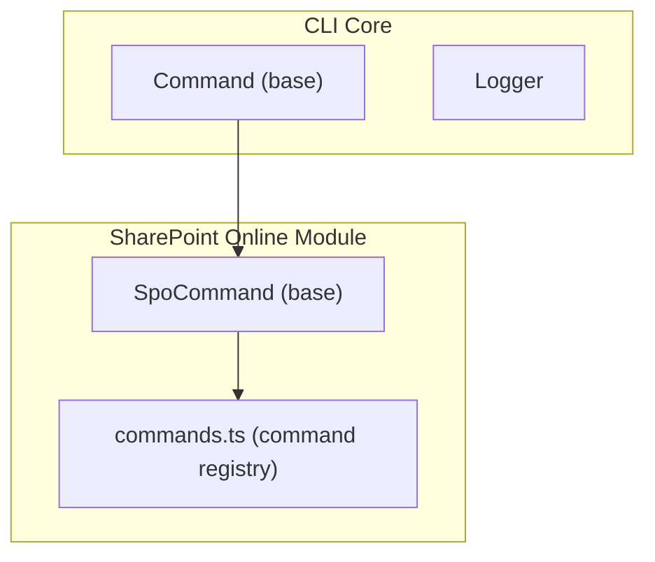
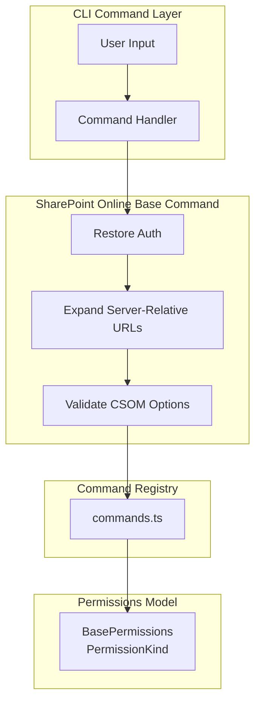
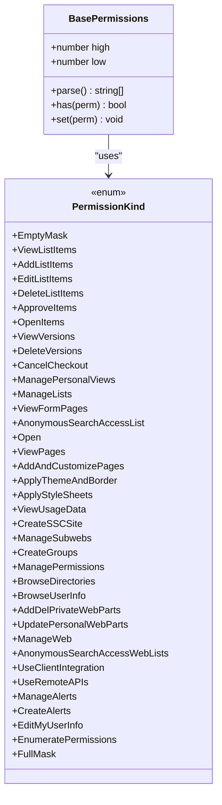
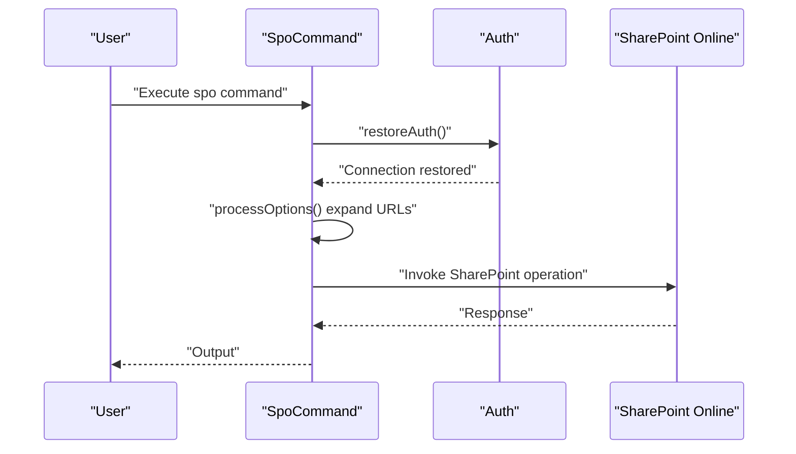
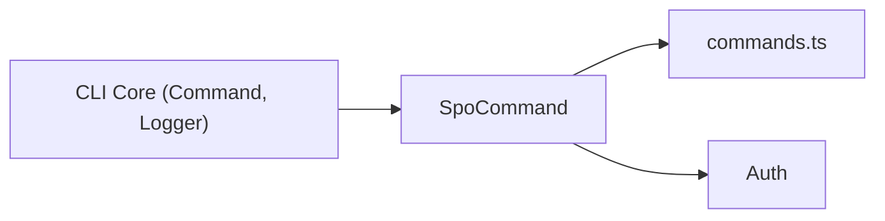

# SharePoint Online Management

<cite>
**Referenced Files in This Document**
- [commands.ts](file://src/m365/spo/commands.ts)
- [SpoCommand.ts](file://src/m365/base/SpoCommand.ts)
- [base-permissions.ts](file://src/m365/spo/base-permissions.ts)
- [README.md](file://README.md)
</cite>

## Table of Contents
1. [Introduction](#introduction)
2. [Project Structure](#project-structure)
3. [Core Components](#core-components)
4. [Architecture Overview](#architecture-overview)
5. [Detailed Component Analysis](#detailed-component-analysis)
6. [Dependency Analysis](#dependency-analysis)
7. [Performance Considerations](#performance-considerations)
8. [Troubleshooting Guide](#troubleshooting-guide)
9. [Conclusion](#conclusion)
10. [Appendices](#appendices)

## Introduction
This document provides comprehensive guidance for managing SharePoint Online using the CLI for Microsoft 365. It explains the SharePoint Online command suite organized under the spo namespace, covering site management, lists and libraries, user and group administration, content management, modern pages, and hub site operations. It also describes how the CLI integrates with SharePoint Online architecture, uses REST/Csom abstractions, and supports batch operations. Practical automation scenarios are included to help administrators streamline routine tasks.

## Project Structure
The SharePoint Online command suite is organized as a cohesive module within the CLI. The primary entry for command names is a centralized registry that enumerates all available commands grouped by functional area (sites, lists, libraries, pages, hub sites, etc.). A base command class provides shared behavior for SharePoint Online commands, including URL expansion for server-relative paths, authentication checks, and CSOM option validation.

**Diagram sources**
- [SpoCommand.ts:107-121](file://src/m365/base/SpoCommand.ts#L107-L121)
- [commands.ts:3-379](file://src/m365/spo/commands.ts#L3-L379)

**Section sources**
- [commands.ts:3-379](file://src/m365/spo/commands.ts#L3-L379)
- [SpoCommand.ts:107-121](file://src/m365/base/SpoCommand.ts#L107-L121)

## Core Components
- Command registry: A single source of truth for all SharePoint Online commands, grouped by functional areas such as site, list, library, page, hub site, and reporting.
- Base command class for SharePoint Online: Provides standardized behavior for SharePoint Online commands, including:
  - Automatic expansion of server-relative URLs to absolute URLs using the configured SharePoint Online URL.
  - Validation that client secret authentication is not used for SharePoint Online commands.
  - CSOM option validation to ensure only supported properties are passed to underlying SharePoint operations.

Key responsibilities:
- URL normalization for SharePoint Online commands.
- Authentication enforcement and error handling.
- Option validation against CSOM definitions.

**Section sources**
- [commands.ts:3-379](file://src/m365/spo/commands.ts#L3-L379)
- [SpoCommand.ts:19-82](file://src/m365/base/SpoCommand.ts#L19-L82)
- [SpoCommand.ts:84-105](file://src/m365/base/SpoCommand.ts#L84-L105)
- [SpoCommand.ts:107-121](file://src/m365/base/SpoCommand.ts#L107-L121)

## Architecture Overview
The SharePoint Online management commands follow a layered architecture:
- CLI Command Layer: Parses user input, validates options, and routes to the appropriate handler.
- SharePoint Online Base Command: Performs authentication restoration, validates credentials, expands URLs, and enforces restrictions.
- SharePoint Online Command Registry: Enumerates all available commands and organizes them by functional domain.
- SharePoint Online Permissions Model: Built-in permission sets and masks used to define roles and control access.

**Diagram sources**
- [SpoCommand.ts:60-82](file://src/m365/base/SpoCommand.ts#L60-L82)
- [SpoCommand.ts:84-105](file://src/m365/base/SpoCommand.ts#L84-L105)
- [commands.ts:3-379](file://src/m365/spo/commands.ts#L3-L379)
- [base-permissions.ts:5-125](file://src/m365/spo/base-permissions.ts#L5-L125)

## Detailed Component Analysis

### Site Management
Functional areas covered:
- Site lifecycle: creation, retrieval, listing, updates, renaming, removal, archiving/unarchiving.
- Site administration: adding/removing site admins, setting access request and sharing permission policies, connecting to hub sites, applying chrome settings.
- Site collections: listing site collections, ensuring presence, and managing app catalogs per site.
- Recycle bin operations: listing, restoring, moving, removing items scoped to a site.

Common tasks:
- Ensure a modern team site exists and configure its settings.
- Connect a site to a hub site and synchronize themes.
- Manage site administrators and sharing policies.

Practical examples (paths):
- [Site add](file://src/m365/spo/site/add.ts)
- [Site get](file://src/m365/spo/site/get.ts)
- [Site list](file://src/m365/spo/site/list.ts)
- [Site set](file://src/m365/spo/site/set.ts)
- [Site admin add/remove/list](file://src/m365/spo/site/admin/*.ts)
- [Site hubsite connect/disconnect](file://src/m365/spo/site/hubsite/*.ts)
- [Site sharingpermission set](file://src/m365/spo/site/sharingpermission/set.ts)
- [Site recyclebinitem list/restore/remove/clear](file://src/m365/spo/site/recyclebinitem/*.ts)

**Section sources**
- [commands.ts:261-295](file://src/m365/spo/commands.ts#L261-L295)

### Subsite Management
- Create subsites, retrieve subsite metadata, list subsites, and remove subsites.
- Configure subsite settings such as title, description, and template.
- Manage subsite administrators and permissions.

Practical examples (paths):
- [Web add](file://src/m365/spo/web/add.ts)
- [Web get](file://src/m365/spo/web/get.ts)
- [Web list](file://src/m365/spo/web/list.ts)
- [Web remove](file://src/m365/spo/web/remove.ts)
- [Web set](file://src/m365/spo/web/set.ts)

**Section sources**
- [commands.ts:364-378](file://src/m365/spo/commands.ts#L364-L378)

### Site Design and Script Deployment
- Create, retrieve, list, update, and remove site designs.
- Manage site scripts associated with designs.
- Track design runs and task status.

Practical examples (paths):
- [SiteDesign add/get/list/set/remove](file://src/m365/spo/sitedesign/*.ts)
- [SiteDesign rights grant/list/revoke](file://src/m365/spo/sitedesign/rights/*.ts)
- [SiteDesign run list/status get](file://src/m365/spo/sitedesign/run/*.ts)
- [SiteScript add/get/list/set/remove](file://src/m365/spo/sitescript/*.ts)

**Section sources**
- [commands.ts:296-314](file://src/m365/spo/commands.ts#L296-L314)
- [commands.ts:305-308](file://src/m365/spo/commands.ts#L305-L308)

### Hub Site Operations
- Register/unregister hub sites, connect/disconnect sites to hubs, grant/revoke rights, and synchronize themes.

Practical examples (paths):
- [HubSite register/unregister/connect/disconnect](file://src/m365/spo/hubsite/*.ts)
- [HubSite rights grant/revoke](file://src/m365/spo/hubsite/rights/*.ts)
- [HubSite set/get/data get](file://src/m365/spo/hubsite/set.ts)
- [Site hubsite connect/disconnect/theme sync](file://src/m365/spo/site/hubsite/*.ts)

**Section sources**
- [commands.ts:128-137](file://src/m365/spo/commands.ts#L128-L137)
- [commands.ts:278-280](file://src/m365/spo/commands.ts#L278-L280)

### List and Library Management
Functional areas covered:
- Lists: add, get, list, update, remove, and set properties.
- Content types: add, get, list, update, remove, and sync with the content type hub.
- Views: add, get, list, update, remove, and manage fields within views.
- Default values: get, list, set, clear, and remove defaults for list fields.
- Webhooks: add, get, list, update, and remove list webhooks.
- Item operations: add, get, list, update, remove, and batch operations.
- Retention labels: ensure, get, and remove retention labels on lists.
- Sensitivity labels: ensure sensitivity labels on lists.
- Role assignments and inheritance: break/reset inheritance and manage role assignments.

Practical examples (paths):
- [List add/get/list/set/remove](file://src/m365/spo/list/*.ts)
- [Content type add/get/list/set/remove/sync](file://src/m365/spo/contenttype/*.ts)
- [Content type hub get](file://src/m365/spo/contenttypehub/get.ts)
- [List view add/get/list/set/remove and field add/remove/set](file://src/m365/spo/list/view/*.ts)
- [List defaultvalue get/list/set/clear/remove](file://src/m365/spo/list/defaultvalue/*.ts)
- [List sitescript get](file://src/m365/spo/list/sitescript/get.ts)
- [List webhook add/get/list/set/remove](file://src/m365/spo/list/webhook/*.ts)
- [List item add/get/list/set/remove and batch add/remove/set](file://src/m365/spo/listitem/*.ts)
- [List retentionlabel ensure/get/remove](file://src/m365/spo/list/retentionlabel/*.ts)
- [List sensitivitylabel ensure](file://src/m365/spo/list/sensitivitylabel/ensure.ts)
- [List roleassignment add/remove and roleinheritance break/reset](file://src/m365/spo/list/roleassignment/*.ts)

**Section sources**
- [commands.ts:141-176](file://src/m365/spo/commands.ts#L141-L176)
- [commands.ts:177-200](file://src/m365/spo/commands.ts#L177-L200)
- [commands.ts:154-163](file://src/m365/spo/commands.ts#L154-L163)
- [commands.ts:157-160](file://src/m365/spo/commands.ts#L157-L160)

### Field Management
- Add, get, list, update, and remove fields.
- Manage field types and properties.

Practical examples (paths):
- [Field add/get/list/set/remove](file://src/m365/spo/field/*.ts)

**Section sources**
- [commands.ts:59-63](file://src/m365/spo/commands.ts#L59-L63)

### File and Folder Operations
Functional areas covered:
- File operations: add, get, list, update, move, copy, rename, remove, checkout/checkin, and version management.
- Sharing links: add, get, list, set, clear, and remove sharing links for files.
- Retention labels: ensure and remove retention labels on files.
- Role assignments and inheritance: break/reset inheritance and manage role assignments for files.
- Folder operations: add, get, list, update, move, copy, remove, and manage sharing links and retention labels.

Practical examples (paths):
- [File add/get/list/set/move/copy/remove/rename](file://src/m365/spo/file/*.ts)
- [File checkout/checkin/undo](file://src/m365/spo/file/checkout/*.ts)
- [File version get/list/add/remove/restore/clear/keep](file://src/m365/spo/file/version/*.ts)
- [File sharinglink add/get/list/set/clear/remove](file://src/m365/spo/file/sharinglink/*.ts)
- [File retentionlabel ensure/remove](file://src/m365/spo/file/retentionlabel/*.ts)
- [File roleassignment add/remove and roleinheritance break/reset](file://src/m365/spo/file/roleassignment/*.ts)
- [Folder add/get/list/set/move/copy/remove](file://src/m365/spo/folder/*.ts)
- [Folder retentionlabel ensure/remove](file://src/m365/spo/folder/retentionlabel/*.ts)
- [Folder sharinglink add/get/list/set/clear/remove](file://src/m365/spo/folder/sharinglink/*.ts)
- [Folder roleassignment add/remove and roleinheritance break/reset](file://src/m365/spo/folder/roleassignment/*.ts)

**Section sources**
- [commands.ts:64-92](file://src/m365/spo/commands.ts#L64-L92)
- [commands.ts:93-111](file://src/m365/spo/commands.ts#L93-L111)

### Modern Page Operations
Functional areas covered:
- Page lifecycle: add, get, list, update, publish, and remove modern pages.
- Web parts: add, list, get, set, and remove client-side web parts.
- Sections and columns: add, get, list, and remove page sections and columns.
- Controls: get, list, and remove page controls.
- Templates: list and remove page templates.
- Header management: set page header.

Practical examples (paths):
- [Page add/get/list/set/publish/remove](file://src/m365/spo/page/*.ts)
- [Page clientsidewebpart add/get/list/set/remove](file://src/m365/spo/page/clientsidewebpart/*.ts)
- [Page section add/get/list/remove](file://src/m365/spo/page/section/*.ts)
- [Page column get/list](file://src/m365/spo/page/column/*.ts)
- [Page control get/list/set/remove](file://src/m365/spo/page/control/*.ts)
- [Page template list/remove](file://src/m365/spo/page/template/*.ts)
- [Page header set](file://src/m365/spo/page/header/set.ts)

**Section sources**
- [commands.ts:212-233](file://src/m365/spo/commands.ts#L212-L233)

### Navigation Configuration
- Add, get, list, update, and remove navigation nodes.

Practical examples (paths):
- [Navigation node add/get/list/set/remove](file://src/m365/spo/navigation/node/*.ts)

**Section sources**
- [commands.ts:201-205](file://src/m365/spo/commands.ts#L201-L205)

### Theme Management
- Apply, get, list, set, and remove themes.

Practical examples (paths):
- [Theme apply/get/list/set/remove](file://src/m365/spo/theme/*.ts)

**Section sources**
- [commands.ts:353-357](file://src/m365/spo/commands.ts#L353-L357)

### User and Group Administration
Functional areas covered:
- Users: ensure, get, list, and remove users.
- Groups: add, get, list, update, and remove groups.
- Group members: add, list, and remove members from groups.
- User profiles: get and set user profile properties.

Practical examples (paths):
- [User ensure/get/list/remove](file://src/m365/spo/user/*.ts)
- [Group add/get/list/set/remove](file://src/m365/spo/group/*.ts)
- [Group member add/list/remove](file://src/m365/spo/group/member/*.ts)
- [User profile get/set](file://src/m365/spo/userprofile/*.ts)

**Section sources**
- [commands.ts:113-121](file://src/m365/spo/commands.ts#L113-L121)
- [commands.ts:358-363](file://src/m365/spo/commands.ts#L358-L363)

### Permission Inheritance, Role Assignments, and Role Definitions
- Break and reset role inheritance for sites, lists, list items, folders, and files.
- Add and remove role assignments.
- Manage role definitions: add, get, list, and remove role definitions.

Practical examples (paths):
- [Site roleassignment add/remove and roleinheritance break/reset](file://src/m365/spo/site/roleassignment/*.ts)
- [List roleassignment add/remove and roleinheritance break/reset](file://src/m365/spo/list/roleassignment/*.ts)
- [List item roleassignment add/remove and roleinheritance break/reset](file://src/m365/spo/listitem/roleassignment/*.ts)
- [Folder roleassignment add/remove and roleinheritance break/reset](file://src/m365/spo/folder/roleassignment/*.ts)
- [File roleassignment add/remove and roleinheritance break/reset](file://src/m365/spo/file/roleassignment/*.ts)
- [Role definition add/get/list/remove](file://src/m365/spo/roledefinition/*.ts)

**Section sources**
- [commands.ts:157-160](file://src/m365/spo/commands.ts#L157-L160)
- [commands.ts:189-199](file://src/m365/spo/commands.ts#L189-L199)
- [commands.ts:102-105](file://src/m365/spo/commands.ts#L102-L105)
- [commands.ts:76-79](file://src/m365/spo/commands.ts#L76-L79)
- [commands.ts:247-250](file://src/m365/spo/commands.ts#L247-L250)

### Batch Operations
- Batch add, remove, and update list items to improve performance when modifying large datasets.

Practical examples (paths):
- [List item batch add/remove/set](file://src/m365/spo/listitem/batch/*.ts)

**Section sources**
- [commands.ts:183-185](file://src/m365/spo/commands.ts#L183-L185)

### SharePoint Online Permissions Model
- BasePermissions class encapsulates permission handling using low/high 32-bit integers.
- PermissionKind enum defines built-in SharePoint Online permissions used to construct roles and control access.

**Diagram sources**
- [base-permissions.ts:5-125](file://src/m365/spo/base-permissions.ts#L5-L125)

**Section sources**
- [base-permissions.ts:5-125](file://src/m365/spo/base-permissions.ts#L5-L125)

### SharePoint Online Architecture Integration and REST API Usage
- The CLI integrates with SharePoint Online via a base command that restores authentication, validates credentials, and expands server-relative URLs to absolute URLs using the configured SharePoint Online URL.
- Commands leverage CSOM option validation to ensure only supported properties are passed to SharePoint operations.
- The command registry centralizes all available commands, enabling consistent discovery and usage across site management, lists/libraries, pages, and hub sites.

**Diagram sources**
- [SpoCommand.ts:60-82](file://src/m365/base/SpoCommand.ts#L60-L82)
- [SpoCommand.ts:107-121](file://src/m365/base/SpoCommand.ts#L107-L121)

**Section sources**
- [SpoCommand.ts:60-82](file://src/m365/base/SpoCommand.ts#L60-L82)
- [SpoCommand.ts:107-121](file://src/m365/base/SpoCommand.ts#L107-L121)

## Dependency Analysis
The SharePoint Online module depends on:
- CLI base command infrastructure for argument parsing and logging.
- Authentication subsystem for secure access to SharePoint Online.
- Centralized command registry for consistent command discovery.

**Diagram sources**
- [SpoCommand.ts:1-122](file://src/m365/base/SpoCommand.ts#L1-L122)
- [commands.ts:3-379](file://src/m365/spo/commands.ts#L3-L379)

**Section sources**
- [SpoCommand.ts:1-122](file://src/m365/base/SpoCommand.ts#L1-L122)
- [commands.ts:3-379](file://src/m365/spo/commands.ts#L3-L379)

## Performance Considerations
- Use batch operations for list items to minimize round trips when updating large datasets.
- Prefer server-relative URLs to avoid redundant URL construction.
- Limit verbose output in automation scripts to reduce processing overhead.
- Use filtering and pagination options where available to reduce payload sizes.

## Troubleshooting Guide
Common issues and resolutions:
- Authentication errors: Ensure you are not using client secret authentication for SharePoint Online commands; switch to certificate or device code authentication.
- URL resolution failures: Verify that server-relative URLs are expanded correctly; confirm the SharePoint Online URL is configured.
- Unknown CSOM options: Review the CSOM option validation messages and adjust options to supported properties.

**Section sources**
- [SpoCommand.ts:115-117](file://src/m365/base/SpoCommand.ts#L115-L117)
- [SpoCommand.ts:74-81](file://src/m365/base/SpoCommand.ts#L74-L81)
- [SpoCommand.ts:91-101](file://src/m365/base/SpoCommand.ts#L91-L101)

## Conclusion
The CLI for Microsoft 365 provides a comprehensive SharePoint Online management toolkit. With a centralized command registry, a robust base command class, and a clear permissions model, administrators can automate site management, lists/libraries, modern pages, hub sites, and user/group operations efficiently. By leveraging batch operations, proper authentication, and validated options, teams can achieve reliable, scalable automation across SharePoint Online environments.

## Appendices
- Command reference overview: The command registry enumerates all available commands across SharePoint Online management domains, enabling quick lookup and consistent usage patterns.

**Section sources**
- [commands.ts:3-379](file://src/m365/spo/commands.ts#L3-L379)