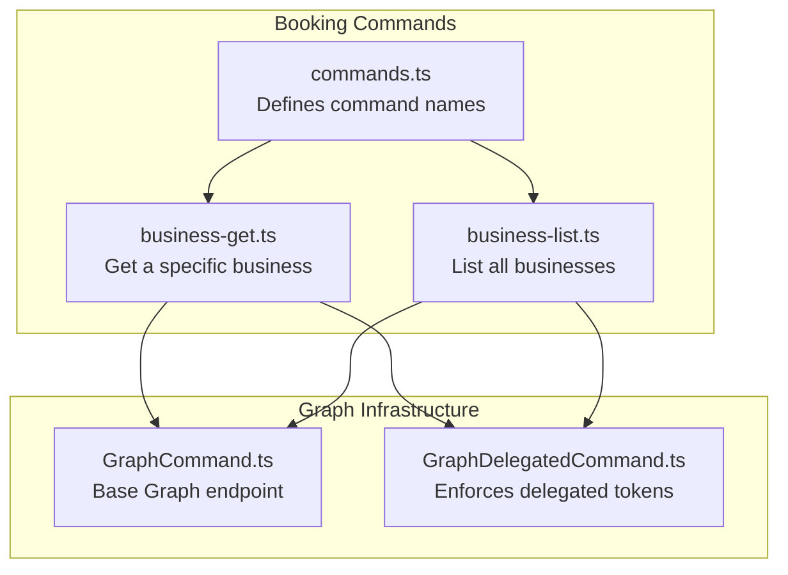
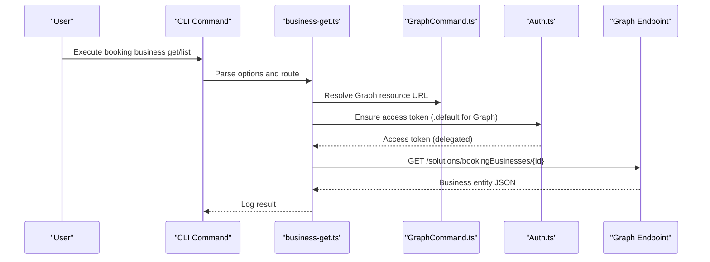
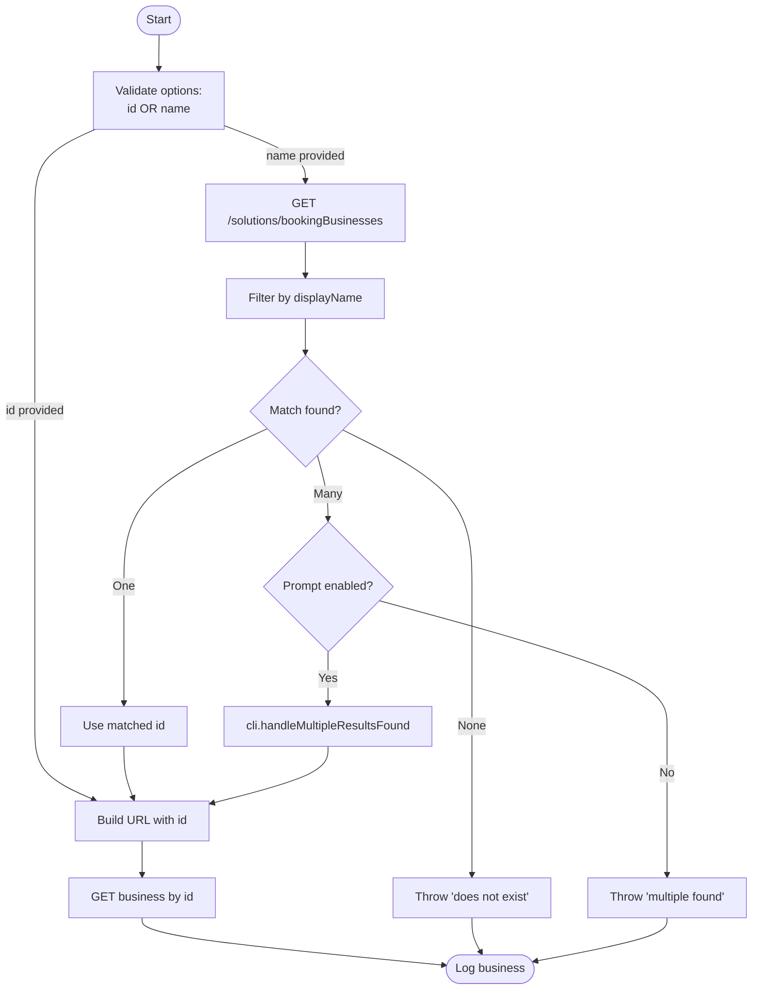
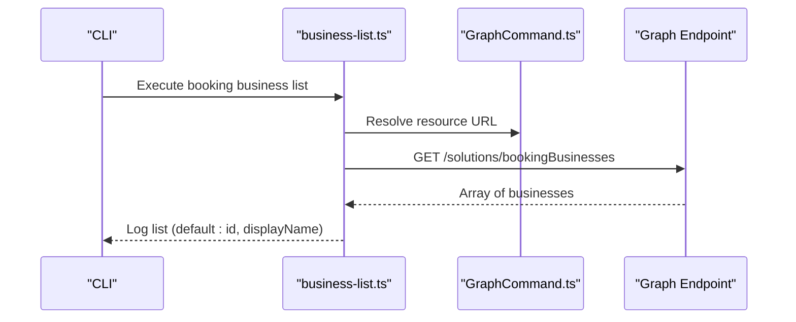
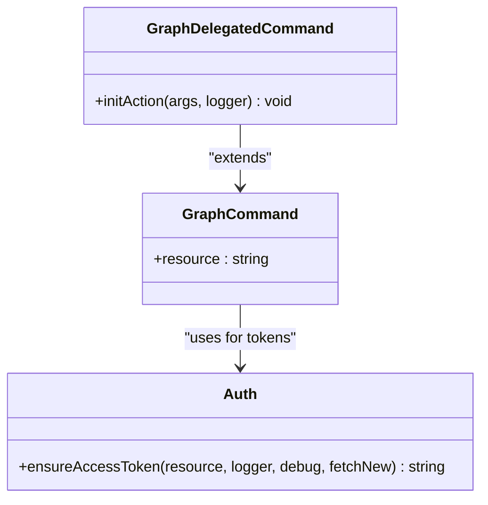
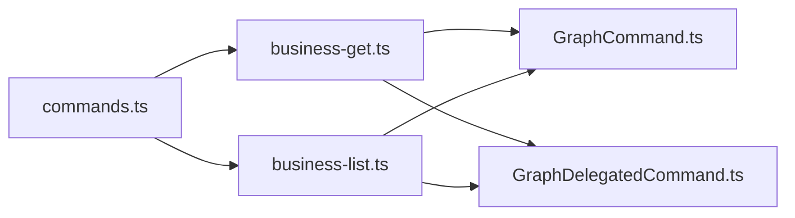

# Microsoft Bookings Management

<cite>
**Referenced Files in This Document**
- [commands.ts](file://src/m365/booking/commands.ts)
- [business-get.ts](file://src/m365/booking/commands/business/business-get.ts)
- [business-list.ts](file://src/m365/booking/commands/business/business-list.ts)
- [GraphCommand.ts](file://src/m365/base/GraphCommand.ts)
- [GraphDelegatedCommand.ts](file://src/m365/base/GraphDelegatedCommand.ts)
- [business-get.spec.ts](file://src/m365/booking/commands/business/business-get.spec.ts)
- [business-list.spec.ts](file://src/m365/booking/commands/business/business-list.spec.ts)
- [authorization-tokens.mdx](file://docs/docs/concepts/authorization-tokens.mdx)
- [communicating-m365.mdx](file://docs/docs/concepts/communicating-m365.mdx)
</cite>

## Table of Contents
1. [Introduction](#introduction)
2. [Project Structure](#project-structure)
3. [Core Components](#core-components)
4. [Architecture Overview](#architecture-overview)
5. [Detailed Component Analysis](#detailed-component-analysis)
6. [Dependency Analysis](#dependency-analysis)
7. [Performance Considerations](#performance-considerations)
8. [Troubleshooting Guide](#troubleshooting-guide)
9. [Conclusion](#conclusion)
10. [Appendices](#appendices)

## Introduction
This document explains how to manage Microsoft Bookings through the CLI for Microsoft 365, focusing on the business management commands. It covers how to retrieve and list Bookings business configurations, and how the CLI integrates with the Microsoft Graph “Bookings” solution endpoint. It also outlines authentication requirements, permission models, and practical usage scenarios. The goal is to help you confidently operate Bookings-related tasks from the command line, interpret results, and troubleshoot common issues.

## Project Structure
The Bookings business commands are organized under the booking module and leverage shared Graph command infrastructure:
- Command identifiers and routing are defined centrally.
- Individual commands implement action logic and validation.
- Shared Graph base classes handle Microsoft Graph endpoint selection and access token enforcement.

**Diagram sources**
- [commands.ts:1-6](file://src/m365/booking/commands.ts#L1-L6)
- [business-get.ts:23-60](file://src/m365/booking/commands/business/business-get.ts#L23-L60)
- [business-list.ts:11-38](file://src/m365/booking/commands/business/business-list.ts#L11-L38)
- [GraphCommand.ts:1-7](file://src/m365/base/GraphCommand.ts#L1-L7)
- [GraphDelegatedCommand.ts:1-21](file://src/m365/base/GraphDelegatedCommand.ts#L1-L21)

**Section sources**
- [commands.ts:1-6](file://src/m365/booking/commands.ts#L1-L6)
- [business-get.ts:23-60](file://src/m365/booking/commands/business/business-get.ts#L23-L60)
- [business-list.ts:11-38](file://src/m365/booking/commands/business/business-list.ts#L11-L38)
- [GraphCommand.ts:1-7](file://src/m365/base/GraphCommand.ts#L1-L7)
- [GraphDelegatedCommand.ts:1-21](file://src/m365/base/GraphDelegatedCommand.ts#L1-L21)

## Core Components
- Command identifiers: centralize command names for business-get and business-list.
- business-get: retrieves a specific Bookings business by id or by name (with resolution logic).
- business-list: enumerates all Bookings businesses in the tenant with default output properties.

Key behaviors:
- Uses Microsoft Graph endpoint for the “Bookings” solution.
- Validates inputs and enforces that either id or name is provided for retrieval.
- Handles multiple matches by name via interactive selection or error.
- Lists minimal properties by default to keep output concise.

**Section sources**
- [commands.ts:1-6](file://src/m365/booking/commands.ts#L1-L6)
- [business-get.ts:11-60](file://src/m365/booking/commands/business/business-get.ts#L11-L60)
- [business-list.ts:9-38](file://src/m365/booking/commands/business/business-list.ts#L9-L38)

## Architecture Overview
The Bookings commands integrate with Microsoft Graph using a shared base class that sets the Graph endpoint. Delegated access token enforcement ensures the commands run in the context of a signed-in user with appropriate permissions.

**Diagram sources**
- [business-get.ts:43-60](file://src/m365/booking/commands/business/business-get.ts#L43-L60)
- [business-list.ts:28-38](file://src/m365/booking/commands/business/business-list.ts#L28-L38)
- [GraphCommand.ts:4-6](file://src/m365/base/GraphCommand.ts#L4-L6)
- [GraphDelegatedCommand.ts:10-20](file://src/m365/base/GraphDelegatedCommand.ts#L10-L20)

## Detailed Component Analysis

### business-get: Retrieve a Bookings Business
Purpose:
- Fetch a specific Bookings business by id or by name.

Inputs and validation:
- Accepts id or name (mutually enforced).
- If only name is provided, resolves to id by querying all businesses and filtering by display name.

Processing logic:
- Builds Graph endpoint URL for the specific business.
- Sets appropriate headers and response type.
- Logs the resulting business object.

Edge cases handled:
- Multiple businesses with the same name trigger interactive selection or error depending on settings.
- No business found by name throws a descriptive error.

**Diagram sources**
- [business-get.ts:36-91](file://src/m365/booking/commands/business/business-get.ts#L36-L91)

**Section sources**
- [business-get.ts:11-91](file://src/m365/booking/commands/business/business-get.ts#L11-L91)
- [business-get.spec.ts:88-214](file://src/m365/booking/commands/business/business-get.spec.ts#L88-L214)

### business-list: List Bookings Businesses
Purpose:
- Enumerate all Bookings businesses in the tenant.

Default output:
- Returns id and displayName by default to keep output concise.

Processing logic:
- Calls a helper to retrieve all items from the endpoint.
- Logs the array of business objects.

**Diagram sources**
- [business-list.ts:28-38](file://src/m365/booking/commands/business/business-list.ts#L28-L38)
- [GraphCommand.ts:4-6](file://src/m365/base/GraphCommand.ts#L4-L6)

**Section sources**
- [business-list.ts:9-38](file://src/m365/booking/commands/business/business-list.ts#L9-L38)
- [business-list.spec.ts:70-118](file://src/m365/booking/commands/business/business-list.spec.ts#L70-L118)

### Authentication and Permission Model
- Graph endpoint: All Bookings commands target the Microsoft Graph endpoint.
- Access token type: Delegated access tokens are required for Bookings operations.
- Permissions: The Microsoft Entra app used by the CLI must have delegated permissions for Microsoft Graph. The CLI automatically requests the appropriate scopes when obtaining tokens.
- Token acquisition: The Auth subsystem manages token lifecycle, supports multiple flows, and stores tokens for reuse.

**Diagram sources**
- [GraphCommand.ts:1-7](file://src/m365/base/GraphCommand.ts#L1-L7)
- [GraphDelegatedCommand.ts:1-21](file://src/m365/base/GraphDelegatedCommand.ts#L1-L21)

**Section sources**
- [GraphCommand.ts:4-6](file://src/m365/base/GraphCommand.ts#L4-L6)
- [GraphDelegatedCommand.ts:10-20](file://src/m365/base/GraphDelegatedCommand.ts#L10-L20)
- [authorization-tokens.mdx:39-53](file://docs/docs/concepts/authorization-tokens.mdx#L39-L53)

## Dependency Analysis
- Command names are centralized and referenced by both business commands.
- Both commands inherit from the Graph base class, ensuring consistent endpoint handling.
- Delegated command enforcement ensures proper token type for Graph operations.
- Tests validate command behavior, including error conditions and output formatting.

**Diagram sources**
- [commands.ts:1-6](file://src/m365/booking/commands.ts#L1-L6)
- [business-get.ts:23-26](file://src/m365/booking/commands/business/business-get.ts#L23-L26)
- [business-list.ts:12-14](file://src/m365/booking/commands/business/business-list.ts#L12-L14)
- [GraphCommand.ts:1-7](file://src/m365/base/GraphCommand.ts#L1-L7)
- [GraphDelegatedCommand.ts:1-21](file://src/m365/base/GraphDelegatedCommand.ts#L1-L21)

**Section sources**
- [commands.ts:1-6](file://src/m365/booking/commands.ts#L1-L6)
- [business-get.ts:23-26](file://src/m365/booking/commands/business/business-get.ts#L23-L26)
- [business-list.ts:12-14](file://src/m365/booking/commands/business/business-list.ts#L12-L14)
- [GraphCommand.ts:1-7](file://src/m365/base/GraphCommand.ts#L1-L7)
- [GraphDelegatedCommand.ts:1-21](file://src/m365/base/GraphDelegatedCommand.ts#L1-L21)

## Performance Considerations
- business-list uses an OData helper to retrieve all items, which may involve multiple requests for large datasets. Consider pagination or filtering in future enhancements if needed.
- business-get performs an initial listing pass when resolving by name, then a single GET by id. This is efficient for typical tenant sizes.
- Network latency and token acquisition overhead are minimized by reusing cached tokens when valid.

## Troubleshooting Guide
Common issues and resolutions:
- Authentication failures
  - Symptom: Cannot obtain an access token or unauthorized responses.
  - Resolution: Ensure you are logged in with delegated permissions for Microsoft Graph. Re-authenticate if necessary and confirm the app registration has the required delegated scopes.
- Missing or invalid business id/name
  - Symptom: Error indicating the business does not exist or multiple matches found.
  - Resolution: Provide a unique id or a distinct display name. If multiple matches exist, enable prompting or specify id to disambiguate.
- API errors during listing or retrieval
  - Symptom: Unexpected error messages from the Graph endpoint.
  - Resolution: Retry after verifying connectivity and permissions. Check debug logs for detailed error context.

**Section sources**
- [business-get.spec.ts:137-214](file://src/m365/booking/commands/business/business-get.spec.ts#L137-L214)
- [business-list.spec.ts:112-118](file://src/m365/booking/commands/business/business-list.spec.ts#L112-L118)
- [authorization-tokens.mdx:39-53](file://docs/docs/concepts/authorization-tokens.mdx#L39-L53)

## Conclusion
The CLI for Microsoft 365 provides straightforward, reliable commands to manage Microsoft Bookings businesses. By leveraging delegated access tokens and the Microsoft Graph endpoint, you can retrieve specific business details or enumerate all businesses in your tenant. Understanding the authentication model and handling edge cases such as ambiguous names ensures smooth operations. Use the provided commands to automate routine Bookings management tasks and integrate them into your workflows.

## Appendices

### Practical Scenarios
- Retrieve a business by id
  - Use the business-get command with the id option to fetch a specific business configuration.
- Retrieve a business by name
  - Use the business-get command with the name option. If multiple matches exist, the CLI will prompt you to select one or raise an error depending on settings.
- List all businesses
  - Use the business-list command to obtain a concise list of all businesses in the tenant.

**Section sources**
- [business-get.ts:43-60](file://src/m365/booking/commands/business/business-get.ts#L43-L60)
- [business-list.ts:28-38](file://src/m365/booking/commands/business/business-list.ts#L28-L38)
- [business-get.spec.ts:107-135](file://src/m365/booking/commands/business/business-get.spec.ts#L107-L135)
- [business-list.spec.ts:84-110](file://src/m365/booking/commands/business/business-list.spec.ts#L84-L110)

### API Integration Notes
- The commands communicate with Microsoft Graph using the solutions/bookingBusinesses endpoint.
- Requests include appropriate headers and response types for JSON payloads.
- The CLI abstracts token management and endpoint resolution through shared base classes.

**Section sources**
- [business-get.ts:46-55](file://src/m365/booking/commands/business/business-get.ts#L46-L55)
- [business-list.ts:29-33](file://src/m365/booking/commands/business/business-list.ts#L29-L33)
- [communicating-m365.mdx:5-10](file://docs/docs/concepts/communicating-m365.mdx#L5-L10)