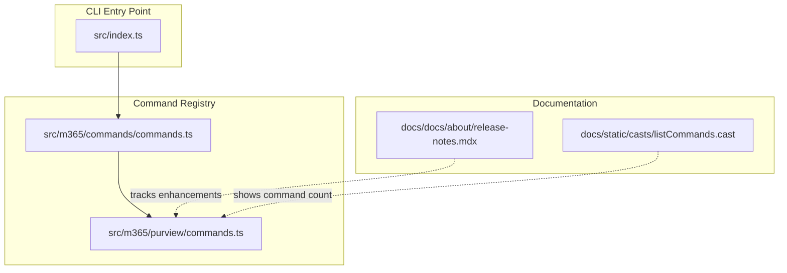
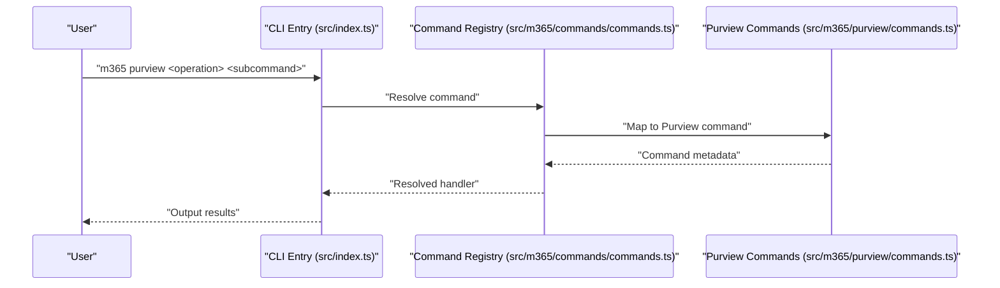
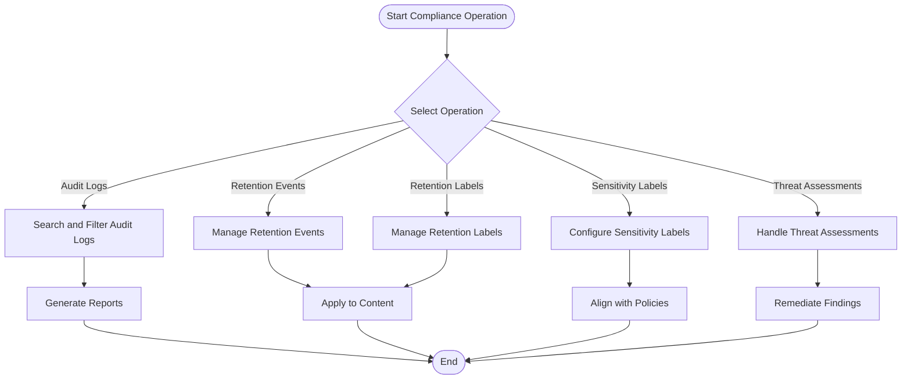
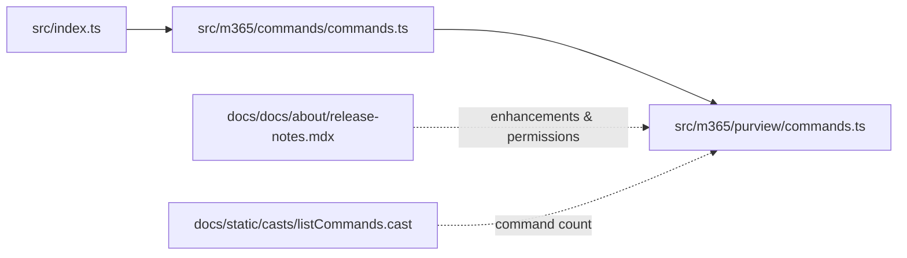

# Microsoft Purview Compliance

<cite>
**Referenced Files in This Document**
- [commands.ts](file://src/m365/purview/commands.ts)
- [commands.ts](file://src/m365/commands/commands.ts)
- [index.ts](file://src/index.ts)
- [README.md](file://README.md)
- [release-notes.mdx](file://docs/docs/about/release-notes.mdx)
- [listCommands.cast](file://docs/static/casts/listCommands.cast)
</cite>

## Table of Contents
1. [Introduction](#introduction)
2. [Project Structure](#project-structure)
3. [Core Components](#core-components)
4. [Architecture Overview](#architecture-overview)
5. [Detailed Component Analysis](#detailed-component-analysis)
6. [Dependency Analysis](#dependency-analysis)
7. [Performance Considerations](#performance-considerations)
8. [Troubleshooting Guide](#troubleshooting-guide)
9. [Conclusion](#conclusion)
10. [Appendices](#appendices)

## Introduction
This document explains Microsoft Purview compliance management through the CLI for Microsoft 365. It covers the complete Purview command suite, including audit log operations, retention event and retention label management, sensitivity label configuration, and threat assessment handling. It also describes Purview’s role in Microsoft 365 compliance, data governance, and security operations, along with authentication requirements, API integration patterns, permission models, practical examples, licensing considerations, and troubleshooting guidance.

## Project Structure
The CLI organizes Purview commands under a dedicated module. The command registry enumerates the available Purview commands, and the CLI entry point executes user requests. The documentation tracks enhancements and permission updates for Purview commands.

**Diagram sources**
- [index.ts:1-22](file://src/index.ts#L1-L22)
- [commands.ts](file://src/m365/commands/commands.ts)
- [commands.ts](file://src/m365/purview/commands.ts)
- [release-notes.mdx](file://docs/docs/about/release-notes.mdx)
- [listCommands.cast](file://docs/static/casts/listCommands.cast#L25)

**Section sources**
- [index.ts:1-22](file://src/index.ts#L1-L22)
- [commands.ts](file://src/m365/commands/commands.ts)
- [commands.ts](file://src/m365/purview/commands.ts)
- [release-notes.mdx](file://docs/docs/about/release-notes.mdx)
- [listCommands.cast](file://docs/static/casts/listCommands.cast#L25)

## Core Components
The Purview command suite includes:
- Audit log operations
- Retention event management
- Retention label administration
- Sensitivity label configuration
- Threat assessment handling

These commands are registered and exposed via the CLI. The documentation records permission requirements and enhancements for these commands.

**Section sources**
- [commands.ts](file://src/m365/purview/commands.ts)
- [release-notes.mdx](file://docs/docs/about/release-notes.mdx)

## Architecture Overview
The CLI routes user commands to the appropriate handler. For Purview, the command registry defines the command names and subcommands. The CLI entry point initializes the runtime and delegates execution.

**Diagram sources**
- [index.ts:1-22](file://src/index.ts#L1-L22)
- [commands.ts](file://src/m365/commands/commands.ts)
- [commands.ts](file://src/m365/purview/commands.ts)

## Detailed Component Analysis

### Audit Log Operations
Purpose: Search and filter tenant audit logs for compliance and security investigations.

Key capabilities:
- List audit log entries with filtering and date range options
- Retrieve detailed audit records for incident response

Common workflows:
- Search audit logs for specific activities within a time window
- Filter by user, operation type, and target objects
- Export results for reporting and evidence collection

Practical example scenario:
- Investigate file access events across SharePoint and OneDrive for a given period and user.

Permissions and integration:
- Requires appropriate Microsoft Purview permissions for audit log access
- Uses Microsoft Purview APIs to query audit data

**Section sources**
- [commands.ts](file://src/m365/purview/commands.ts)
- [release-notes.mdx](file://docs/docs/about/release-notes.mdx)

### Retention Event Management
Purpose: Manage retention events that trigger automated retention label actions.

Key capabilities:
- Add retention events
- Get retention event details
- List retention events
- Remove retention events

Common workflows:
- Define retention events aligned with organizational policies
- Monitor and remove obsolete retention events
- Integrate retention events with retention labels

Practical example scenario:
- Create a retention event for “Contract Expiration” to automatically apply a retention label after a defined period.

Permissions and integration:
- Requires retention management permissions
- Integrates with Microsoft Purview retention label service

**Section sources**
- [commands.ts](file://src/m365/purview/commands.ts)
- [release-notes.mdx](file://docs/docs/about/release-notes.mdx)

### Retention Label Administration
Purpose: Create, configure, and manage retention labels and their assignments.

Key capabilities:
- Add retention labels
- Get retention label details
- List retention labels
- Remove retention labels
- Set retention label properties

Common workflows:
- Create retention labels with legal hold, deletion, and disposition settings
- Assign retention labels to content locations
- Update retention label configurations based on policy changes

Practical example scenario:
- Create a retention label for “Confidential Legal” with a 6-year retention period and legal hold enabled.

Permissions and integration:
- Requires retention management permissions
- Integrates with Microsoft Purview retention label service

**Section sources**
- [commands.ts](file://src/m365/purview/commands.ts)
- [release-notes.mdx](file://docs/docs/about/release-notes.mdx)

### Sensitivity Label Configuration
Purpose: Configure and manage sensitivity labels and their policy settings.

Key capabilities:
- Get sensitivity label details
- List sensitivity labels
- List sensitivity label policy settings

Common workflows:
- Discover available sensitivity labels across the tenant
- Retrieve label policy settings for compliance reporting
- Align sensitivity labels with data classification policies

Practical example scenario:
- List sensitivity labels and their policy settings to validate alignment with corporate data classification standards.

Permissions and integration:
- Requires sensitivity label management permissions
- Integrates with Microsoft Purview sensitivity label service

**Section sources**
- [commands.ts](file://src/m365/purview/commands.ts)
- [release-notes.mdx](file://docs/docs/about/release-notes.mdx)

### Threat Assessment Handling
Purpose: Create and manage threat assessments for suspicious items.

Key capabilities:
- Add threat assessments
- Get threat assessment details
- List threat assessments

Common workflows:
- Initiate threat assessments for suspected malicious items
- Track assessment status and outcomes
- Integrate with security workflows for remediation

Practical example scenario:
- Create a threat assessment for a suspicious email attachment and track its resolution.

Permissions and integration:
- Requires threat assessment permissions
- Integrates with Microsoft Purview threat assessment service

**Section sources**
- [commands.ts](file://src/m365/purview/commands.ts)
- [release-notes.mdx](file://docs/docs/about/release-notes.mdx)

### Conceptual Overview
The Purview command suite supports end-to-end compliance operations:
- Audit log searching and filtering for investigations
- Retention event and label lifecycle management
- Sensitivity label discovery and policy alignment
- Threat assessment workflows for security incidents

[No sources needed since this diagram shows conceptual workflow, not actual code structure]

[No sources needed since this section doesn't analyze specific source files]

## Dependency Analysis
The CLI entry point delegates command execution to the command registry, which maps to Purview commands. The documentation tracks enhancements and permission updates for Purview commands.

**Diagram sources**
- [index.ts:1-22](file://src/index.ts#L1-L22)
- [commands.ts](file://src/m365/commands/commands.ts)
- [commands.ts](file://src/m365/purview/commands.ts)
- [release-notes.mdx](file://docs/docs/about/release-notes.mdx)
- [listCommands.cast](file://docs/static/casts/listCommands.cast#L25)

**Section sources**
- [index.ts:1-22](file://src/index.ts#L1-L22)
- [commands.ts](file://src/m365/commands/commands.ts)
- [commands.ts](file://src/m365/purview/commands.ts)
- [release-notes.mdx](file://docs/docs/about/release-notes.mdx)
- [listCommands.cast](file://docs/static/casts/listCommands.cast#L25)

## Performance Considerations
- Use filtering and date range options to limit result sets when searching audit logs.
- Batch operations where supported to reduce API round trips.
- Leverage output formatting and JMESPath queries to minimize post-processing overhead.

[No sources needed since this section provides general guidance]

## Troubleshooting Guide
Common issues and resolutions:
- Authentication failures: Ensure proper login and token acquisition before running Purview commands.
- Permission errors: Verify that the authenticated identity has the required Purview permissions for the targeted operation.
- Command not found: Confirm the command exists in the Purview command suite and that the CLI version supports the feature.
- Application-only permissions: Some Purview commands require delegated permissions; avoid using application-only permissions for these operations.

**Section sources**
- [release-notes.mdx](file://docs/docs/about/release-notes.mdx)

## Conclusion
The CLI for Microsoft 365 provides a comprehensive Purview command suite enabling organizations to manage compliance, data governance, and security operations effectively. By leveraging audit log searches, retention event and label management, sensitivity label configuration, and threat assessment workflows, administrators can automate and standardize compliance processes. Proper authentication, permissions, and operational practices are essential for reliable and secure use.

[No sources needed since this section summarizes without analyzing specific files]

## Appendices

### Authentication and Permissions
- Supported authentication methods include device code, certificate, client secret, managed identity, federated identity, and username/password.
- Purview commands require appropriate delegated permissions; application-only permissions are not supported for certain operations.

**Section sources**
- [README.md](file://README.md)
- [release-notes.mdx](file://docs/docs/about/release-notes.mdx)

### Licensing and Availability
- Purview capabilities are available depending on tenant licensing and feature availability. Refer to official Microsoft Purview documentation for licensing details.

[No sources needed since this section provides general guidance]