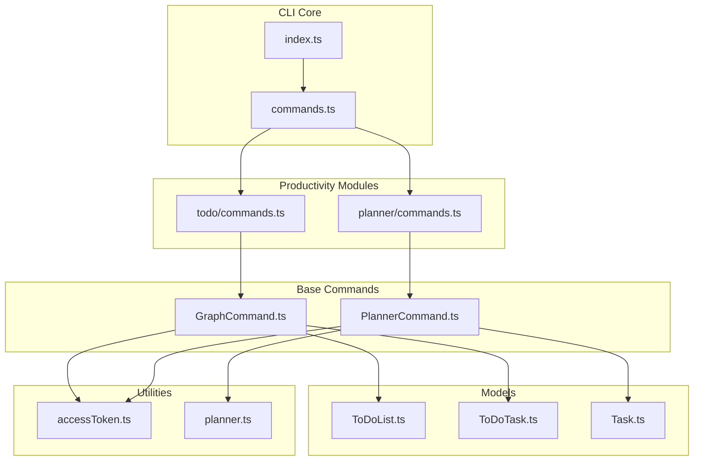
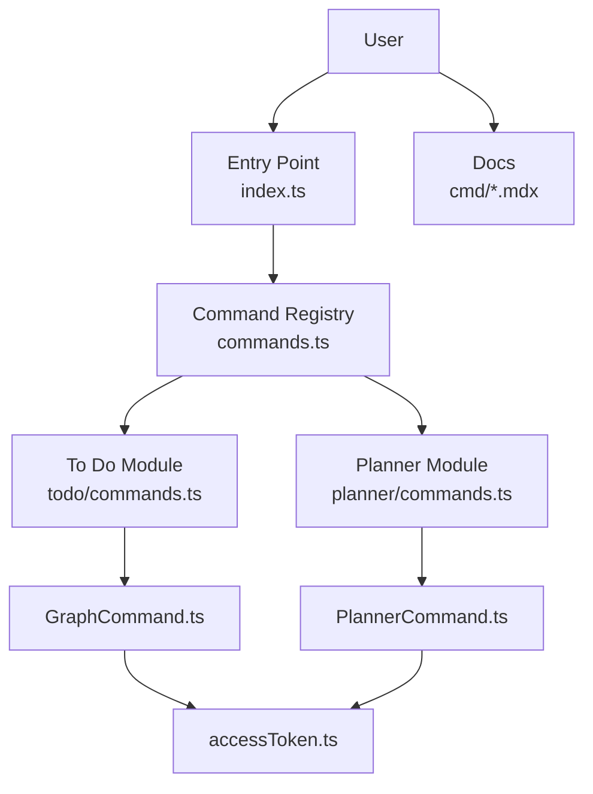
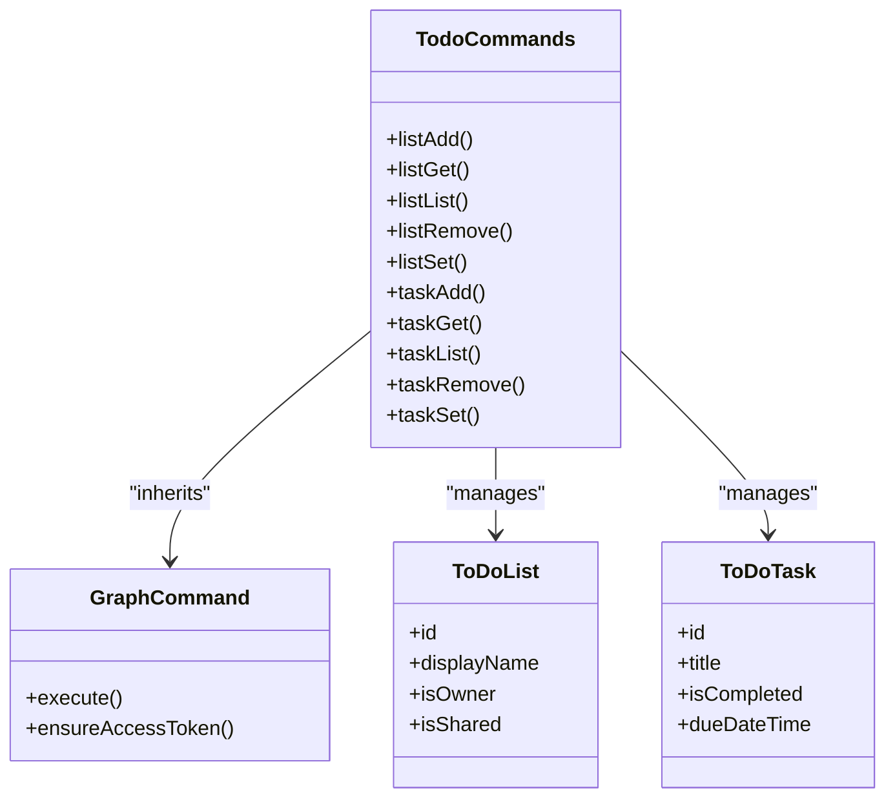
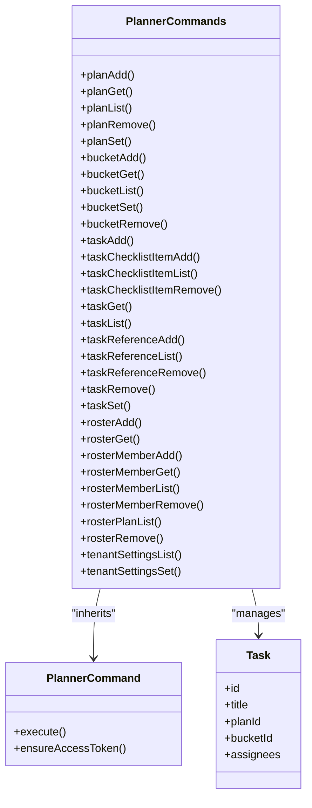
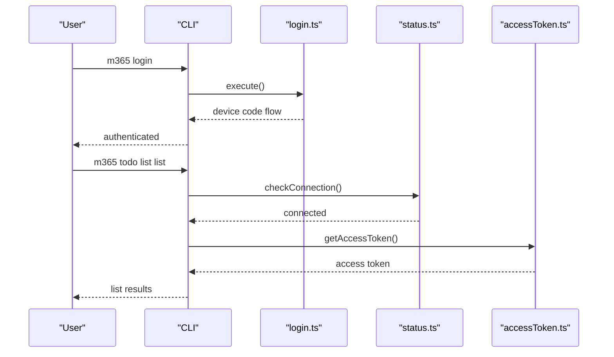
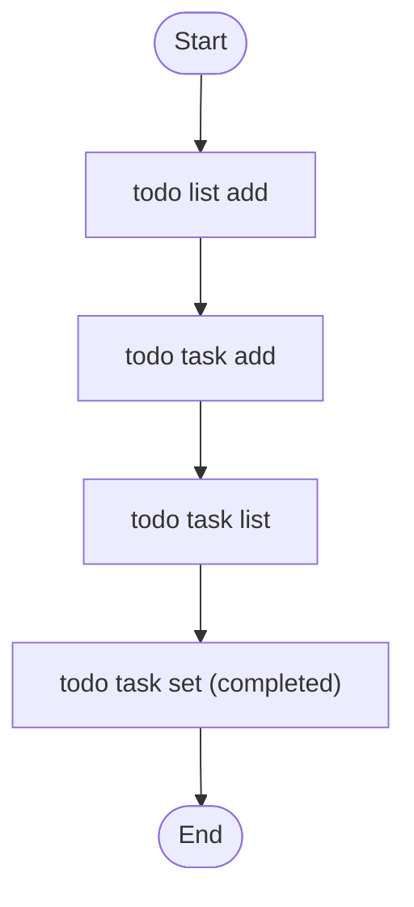
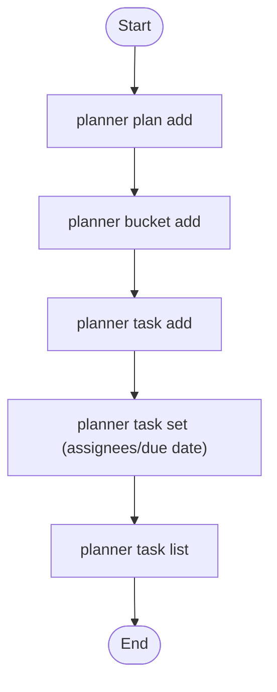
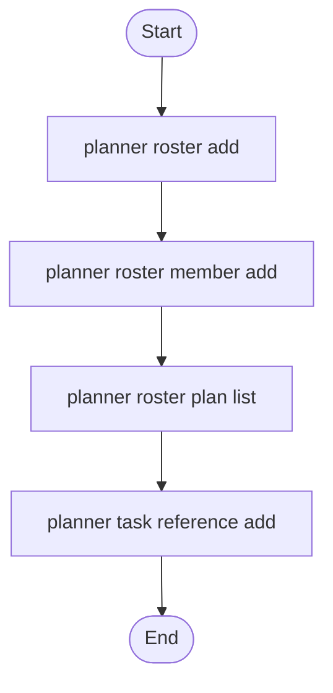
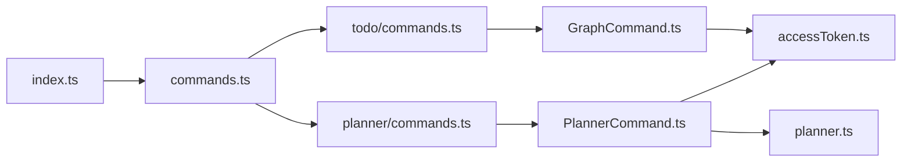

# Microsoft To Do & Planner Management

<cite>
**Referenced Files in This Document**
- [README.md](file://README.md)
- [commands.ts](file://src/m365/todo/commands.ts)
- [commands.ts](file://src/m365/planner/commands.ts)
- [index.ts](file://src/index.ts)
- [login.ts](file://src/m365/commands/login.ts)
- [logout.ts](file://src/m365/commands/logout.ts)
- [request.ts](file://src/m365/commands/request.ts)
- [status.ts](file://src/m365/commands/status.ts)
- [setup.ts](file://src/m365/commands/setup.ts)
- [GraphCommand.ts](file://src/m365/base/GraphCommand.ts)
- [PlannerCommand.ts](file://src/m365/base/PlannerCommand.ts)
- [ToDoList.ts](file://src/m365/todo/ToDoList.ts)
- [ToDoTask.ts](file://src/m365/todo/ToDoTask.ts)
- [Task.ts](file://src/m365/planner/Task.ts)
- [planner.ts](file://src/utils/planner.ts)
- [planner.spec.ts](file://src/utils/planner.spec.ts)
- [accessToken.ts](file://src/utils/accessToken.ts)
- [accessToken.spec.ts](file://src/utils/accessToken.spec.ts)
- [connecting-microsoft-365.mdx](file://docs/docs/user-guide/connecting-microsoft-365.mdx)
- [authorization-tokens.mdx](file://docs/docs/concepts/authorization-tokens.mdx)
- [communicating-m365.mdx](file://docs/docs/concepts/communicating-m365.mdx)
- [login.mdx](file://docs/docs/cmd/login.mdx)
- [logout.mdx](file://docs/docs/cmd/logout.mdx)
- [request.mdx](file://docs/docs/cmd/request.mdx)
- [status.mdx](file://docs/docs/cmd/status.mdx)
- [setup.mdx](file://docs/docs/cmd/setup.mdx)
- [todo-list.mdx](file://docs/docs/cmd/todo/list.mdx)
- [todo-task.mdx](file://docs/docs/cmd/todo/task.mdx)
- [planner-plan.mdx](file://docs/docs/cmd/planner/plan.mdx)
- [planner-bucket.mdx](file://docs/docs/cmd/planner/bucket.mdx)
- [planner-roster.mdx](file://docs/docs/cmd/planner/roster.mdx)
- [planner-task.mdx](file://docs/docs/cmd/planner/task.mdx)
- [planner-tenant.mdx](file://docs/docs/cmd/planner/tenant.mdx)
</cite>

## Table of Contents
1. [Introduction](#introduction)
2. [Project Structure](#project-structure)
3. [Core Components](#core-components)
4. [Architecture Overview](#architecture-overview)
5. [Detailed Component Analysis](#detailed-component-analysis)
6. [Dependency Analysis](#dependency-analysis)
7. [Performance Considerations](#performance-considerations)
8. [Troubleshooting Guide](#troubleshooting-guide)
9. [Conclusion](#conclusion)

## Introduction
This document provides comprehensive guidance for managing Microsoft To Do and Planner through the CLI for Microsoft 365. It covers the integrated task and planning command suite, explaining how these services complement each other for personal and team productivity. The document details To Do task management (lists and tasks) and Planner plan operations (plans, buckets, tasks, rosters, and tenant settings), along with authentication, API integration patterns, permissions, licensing considerations, and practical scenarios.

## Project Structure
The CLI organizes productivity-related commands under dedicated modules:
- To Do module: list and task management commands
- Planner module: plan, bucket, task, roster, and tenant settings commands
- Base classes abstract Microsoft Graph and Planner-specific logic
- Utilities handle authentication tokens and Planner helpers
- Documentation provides user guides and command references

**Diagram sources**
- [index.ts](file://src/index.ts)
- [commands.ts](file://src/m365/todo/commands.ts)
- [commands.ts](file://src/m365/planner/commands.ts)
- [GraphCommand.ts](file://src/m365/base/GraphCommand.ts)
- [PlannerCommand.ts](file://src/m365/base/PlannerCommand.ts)
- [ToDoList.ts](file://src/m365/todo/ToDoList.ts)
- [ToDoTask.ts](file://src/m365/todo/ToDoTask.ts)
- [Task.ts](file://src/m365/planner/Task.ts)
- [accessToken.ts](file://src/utils/accessToken.ts)
- [planner.ts](file://src/utils/planner.ts)

**Section sources**
- [README.md:82-109](file://README.md#L82-L109)
- [commands.ts:1-14](file://src/m365/todo/commands.ts#L1-L14)
- [commands.ts:1-36](file://src/m365/planner/commands.ts#L1-L36)

## Core Components
- To Do command set: list management (add, get, list, remove, set) and task management (add, get, list, remove, set)
- Planner command set: plan management (add, get, list, remove, set), bucket management (add, get, list, set, remove), task management (add, checklistitem add/list/remove, get, list, reference add/list/remove, remove, set), roster management (add, get, member add/get/list/remove, plan list, remove), tenant settings (list, set), and task references
- Base command abstractions: GraphCommand for Microsoft Graph-based operations and PlannerCommand for Planner-specific operations
- Authentication utilities: access token retrieval and caching for Microsoft Graph and Planner APIs
- Data models: To Do list and task entities, and Planner task entity

These components enable unified productivity management via a single CLI, supporting both personal task lists (To Do) and team planning (Planner).

**Section sources**
- [commands.ts:1-14](file://src/m365/todo/commands.ts#L1-L14)
- [commands.ts:1-36](file://src/m365/planner/commands.ts#L1-L36)
- [GraphCommand.ts](file://src/m365/base/GraphCommand.ts)
- [PlannerCommand.ts](file://src/m365/base/PlannerCommand.ts)
- [accessToken.ts](file://src/utils/accessToken.ts)
- [ToDoList.ts](file://src/m365/todo/ToDoList.ts)
- [ToDoTask.ts](file://src/m365/todo/ToDoTask.ts)
- [Task.ts](file://src/m365/planner/Task.ts)

## Architecture Overview
The CLI follows a modular architecture:
- Entry point resolves commands and routes to appropriate handlers
- Base command classes encapsulate authentication and API communication
- Productivity modules define command verbs and nouns (list, task, plan, bucket, roster, tenant)
- Utilities provide shared functionality like access tokens and Planner helpers
- Documentation guides users on usage, authentication, and examples

**Diagram sources**
- [index.ts](file://src/index.ts)
- [commands.ts](file://src/m365/todo/commands.ts)
- [commands.ts](file://src/m365/planner/commands.ts)
- [GraphCommand.ts](file://src/m365/base/GraphCommand.ts)
- [PlannerCommand.ts](file://src/m365/base/PlannerCommand.ts)
- [accessToken.ts](file://src/utils/accessToken.ts)

## Detailed Component Analysis

### To Do Command Suite
The To Do module exposes list and task operations:
- List operations: add, get, list, remove, set
- Task operations: add, get, list, remove, set

These commands integrate with Microsoft Graph to manage user tasks and lists, enabling personal productivity workflows such as organizing daily tasks, marking completion, and maintaining task lists.

**Diagram sources**
- [GraphCommand.ts](file://src/m365/base/GraphCommand.ts)
- [ToDoList.ts](file://src/m365/todo/ToDoList.ts)
- [ToDoTask.ts](file://src/m365/todo/ToDoTask.ts)
- [commands.ts](file://src/m365/todo/commands.ts)

**Section sources**
- [commands.ts:1-14](file://src/m365/todo/commands.ts#L1-L14)
- [ToDoList.ts](file://src/m365/todo/ToDoList.ts)
- [ToDoTask.ts](file://src/m365/todo/ToDoTask.ts)

### Planner Command Suite
The Planner module provides comprehensive plan, bucket, task, roster, and tenant settings operations:
- Plan operations: add, get, list, remove, set
- Bucket operations: add, get, list, set, remove
- Task operations: add, checklistitem add/list/remove, get, list, reference add/list/remove, remove, set
- Roster operations: add, get, member add/get/list/remove, plan list, remove
- Tenant settings: list, set

These commands leverage Planner APIs to support team collaboration, task assignment, and structured planning across teams.

**Diagram sources**
- [PlannerCommand.ts](file://src/m365/base/PlannerCommand.ts)
- [Task.ts](file://src/m365/planner/Task.ts)
- [commands.ts](file://src/m365/planner/commands.ts)

**Section sources**
- [commands.ts:1-36](file://src/m365/planner/commands.ts#L1-L36)
- [Task.ts](file://src/m365/planner/Task.ts)

### Authentication and API Integration
Authentication is handled centrally and consumed by base command classes:
- Login/logout/status/setup commands for connection lifecycle
- Access token utilities for Microsoft Graph and Planner API calls
- Conceptual guides explain authorization tokens and communication patterns

**Diagram sources**
- [login.ts](file://src/m365/commands/login.ts)
- [status.ts](file://src/m365/commands/status.ts)
- [accessToken.ts](file://src/utils/accessToken.ts)

**Section sources**
- [login.ts](file://src/m365/commands/login.ts)
- [logout.ts](file://src/m365/commands/logout.ts)
- [status.ts](file://src/m365/commands/status.ts)
- [setup.ts](file://src/m365/commands/setup.ts)
- [accessToken.ts](file://src/utils/accessToken.ts)
- [authorization-tokens.mdx](file://docs/docs/concepts/authorization-tokens.mdx)
- [communicating-m365.mdx](file://docs/docs/concepts/communicating-m365.mdx)
- [connecting-microsoft-365.mdx](file://docs/docs/user-guide/connecting-microsoft-365.mdx)

### Practical Scenarios

#### Scenario 1: Create a To Do List and Add Tasks
- Use list add to create a new list
- Use task add to add tasks to the list
- Use task list to review tasks
- Use task set to mark tasks as completed

**Diagram sources**
- [commands.ts](file://src/m365/todo/commands.ts)

**Section sources**
- [todo-list.mdx](file://docs/docs/cmd/todo/list.mdx)
- [todo-task.mdx](file://docs/docs/cmd/todo/task.mdx)

#### Scenario 2: Create a Planner Plan and Assign Tasks
- Use plan add to create a plan
- Use bucket add to create buckets (categories)
- Use task add to create tasks within a bucket
- Use task set to assign users and due dates
- Use task list to track progress

**Diagram sources**
- [commands.ts](file://src/m365/planner/commands.ts)

**Section sources**
- [planner-plan.mdx](file://docs/docs/cmd/planner/plan.mdx)
- [planner-bucket.mdx](file://docs/docs/cmd/planner/bucket.mdx)
- [planner-task.mdx](file://docs/docs/cmd/planner/task.mdx)

#### Scenario 3: Manage a Planner Roster and Team Collaboration
- Use roster add to create a roster
- Use roster member add to add team members
- Use roster plan list to view associated plans
- Use task reference add to attach external resources to tasks

**Diagram sources**
- [commands.ts](file://src/m365/planner/commands.ts)

**Section sources**
- [planner-roster.mdx](file://docs/docs/cmd/planner/roster.mdx)
- [planner-task.mdx](file://docs/docs/cmd/planner/task.mdx)

## Dependency Analysis
The CLI composes productivity commands from shared building blocks:
- Base command classes depend on access token utilities
- To Do and Planner modules inherit from base classes
- Utilities provide cross-cutting concerns like token management and Planner helpers
- Documentation references guide users to specific command pages

**Diagram sources**
- [index.ts](file://src/index.ts)
- [commands.ts](file://src/m365/todo/commands.ts)
- [commands.ts](file://src/m365/planner/commands.ts)
- [GraphCommand.ts](file://src/m365/base/GraphCommand.ts)
- [PlannerCommand.ts](file://src/m365/base/PlannerCommand.ts)
- [accessToken.ts](file://src/utils/accessToken.ts)
- [planner.ts](file://src/utils/planner.ts)

**Section sources**
- [index.ts](file://src/index.ts)
- [commands.ts](file://src/m365/todo/commands.ts)
- [commands.ts](file://src/m365/planner/commands.ts)
- [GraphCommand.ts](file://src/m365/base/GraphCommand.ts)
- [PlannerCommand.ts](file://src/m365/base/PlannerCommand.ts)
- [accessToken.ts](file://src/utils/accessToken.ts)
- [planner.ts](file://src/utils/planner.ts)

## Performance Considerations
- Minimize repeated authentication requests by leveraging cached access tokens
- Batch operations where possible to reduce API round trips
- Use filtering and querying to limit result sets for list operations
- Prefer incremental updates (set operations) to avoid unnecessary deletions and recreations

## Troubleshooting Guide
Common issues and resolutions:
- Authentication failures: Verify login status and re-authenticate using the login command
- Permission errors: Confirm required scopes for Microsoft Graph and Planner APIs
- Rate limiting: Implement backoff and retry strategies for frequent operations
- Command-specific errors: Consult command help and documentation pages for usage examples and parameter requirements

**Section sources**
- [login.mdx](file://docs/docs/cmd/login.mdx)
- [logout.mdx](file://docs/docs/cmd/logout.mdx)
- [request.mdx](file://docs/docs/cmd/request.mdx)
- [status.mdx](file://docs/docs/cmd/status.mdx)
- [setup.mdx](file://docs/docs/cmd/setup.mdx)

## Conclusion
The CLI for Microsoft 365 provides a unified, powerful interface for managing personal and team productivity through To Do and Planner. By combining To Do’s personal task management with Planner’s team planning capabilities, users can streamline workflows, improve collaboration, and maintain visibility across individual and team tasks. Proper authentication, understanding of API integration patterns, and adherence to licensing and permission models ensure effective and secure usage.