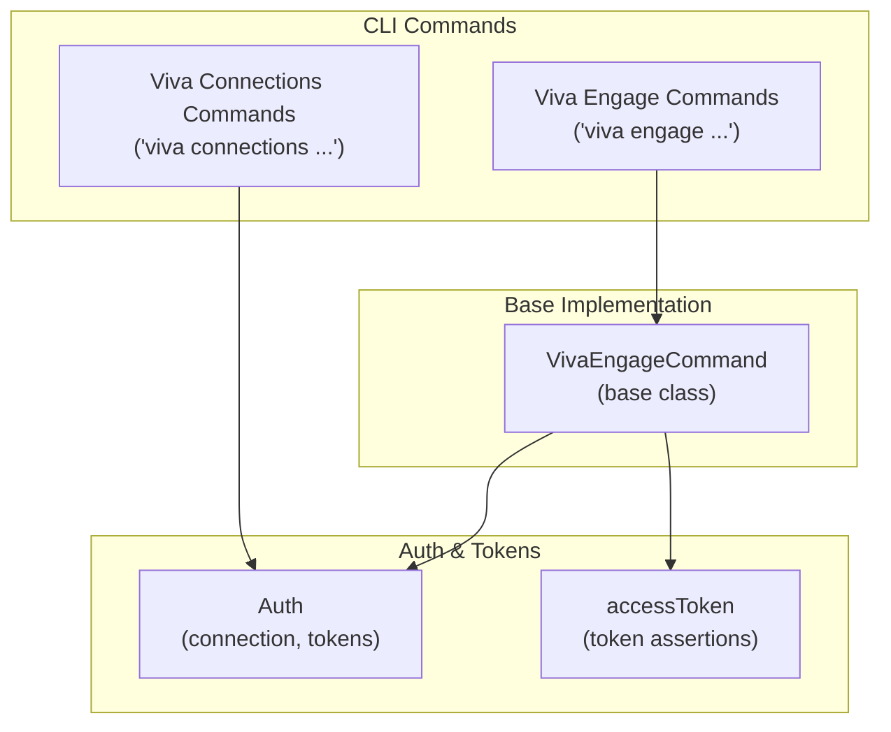
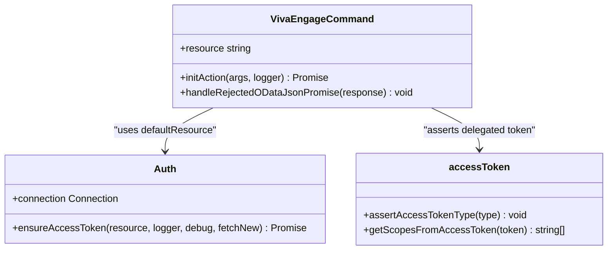
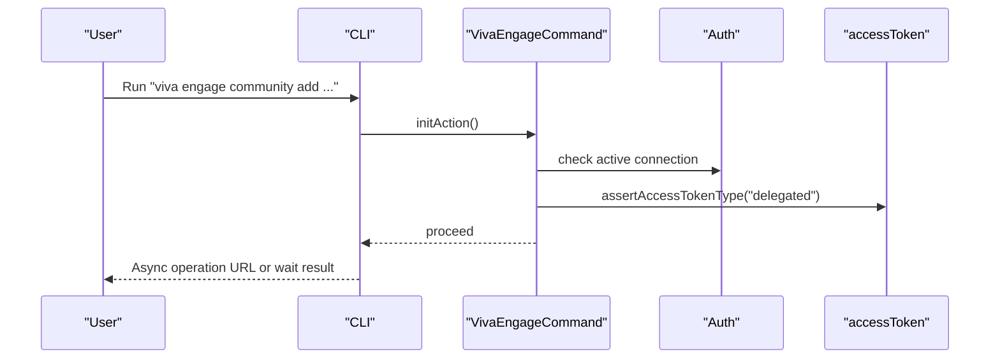
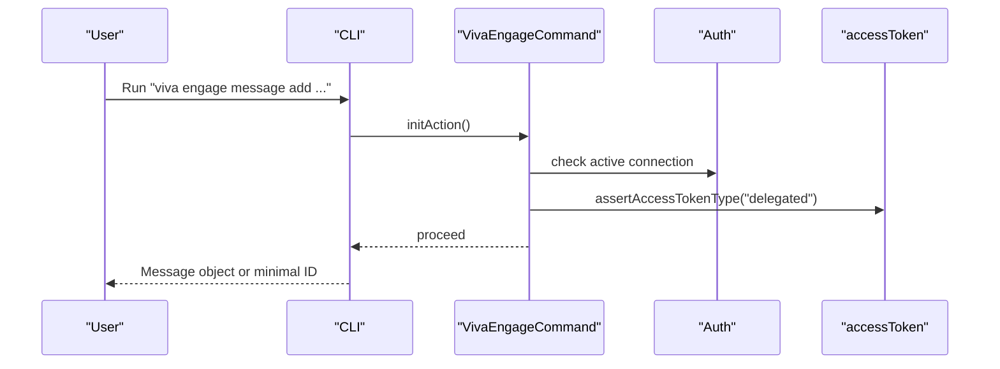
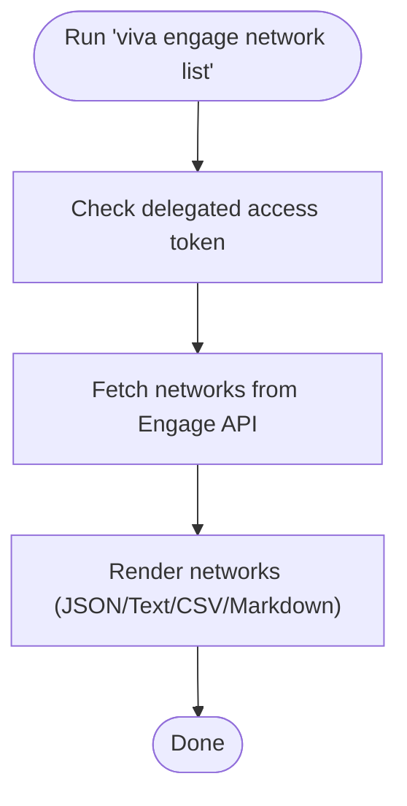
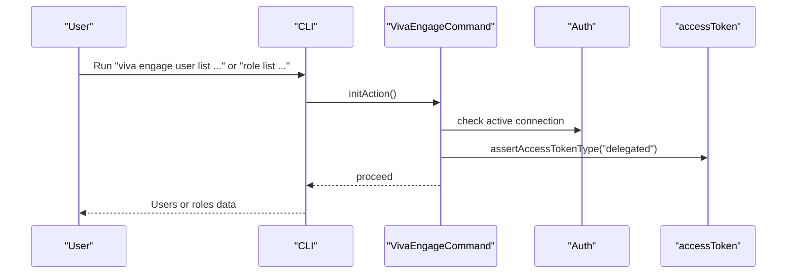
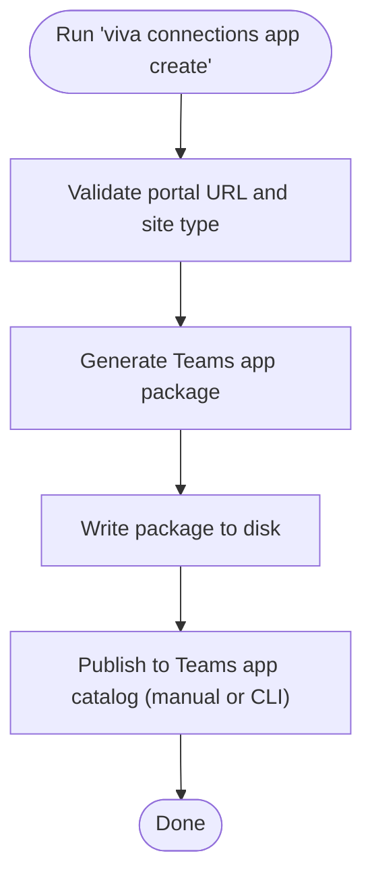
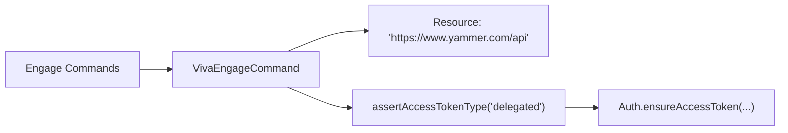

# Microsoft Viva Platform

<cite>
**Referenced Files in This Document**
- [commands.ts](file://src/m365/viva/commands.ts)
- [VivaEngageCommand.ts](file://src/m365/base/VivaEngageCommand.ts)
- [accessToken.ts](file://src/utils/accessToken.ts)
- [Auth.ts](file://src/Auth.ts)
- [engage-community-add.mdx](file://docs/docs/cmd/viva/engage/engage-community-add.mdx)
- [engage-message-add.mdx](file://docs/docs/cmd/viva/engage/engage-message-add.mdx)
- [connections-app-create.mdx](file://docs/docs/cmd/viva/connections/connections-app-create.mdx)
- [engage-network-list.mdx](file://docs/docs/cmd/viva/engage/engage-network-list.mdx)
- [engage-community-list.mdx](file://docs/docs/cmd/viva/engage/engage-community-list.mdx)
- [engage-message-list.mdx](file://docs/docs/cmd/viva/engage/engage-message-list.mdx)
- [engage-user-list.mdx](file://docs/docs/cmd/viva/engage/engage-user-list.mdx)
- [engage-role-list.mdx](file://docs/docs/cmd/viva/engage/engage-role-list.mdx)
</cite>

## Table of Contents
1. [Introduction](#introduction)
2. [Project Structure](#project-structure)
3. [Core Components](#core-components)
4. [Architecture Overview](#architecture-overview)
5. [Detailed Component Analysis](#detailed-component-analysis)
6. [Dependency Analysis](#dependency-analysis)
7. [Performance Considerations](#performance-considerations)
8. [Troubleshooting Guide](#troubleshooting-guide)
9. [Conclusion](#conclusion)
10. [Appendices](#appendices)

## Introduction
This document explains how to manage Microsoft Viva through the CLI for Microsoft 365. It focuses on the Viva Engage and Viva Connections command suites, covering:
- Engage: community lifecycle, message operations, network discovery, user and role queries, and reporting.
- Connections: desktop app packaging for Microsoft Teams.

It also details authentication, permissions, licensing considerations, platform limitations, and practical scenarios for administrators and developers.

## Project Structure
The Viva capabilities are exposed via command names under the viva namespace. Engage commands are grouped under viva engage, and Connections commands under viva connections. The Engage base class enforces delegated access tokens and targets the Yammer API endpoint. Authentication and token utilities are centralized in the auth and utils modules.

**Diagram sources**
- [commands.ts:1-34](file://src/m365/viva/commands.ts#L1-L34)
- [VivaEngageCommand.ts:6-33](file://src/m365/base/VivaEngageCommand.ts#L6-L33)
- [accessToken.ts:144-158](file://src/utils/accessToken.ts#L144-L158)
- [Auth.ts:197-200](file://src/Auth.ts#L197-L200)

**Section sources**
- [commands.ts:1-34](file://src/m365/viva/commands.ts#L1-L34)

## Core Components
- Viva Engage command suite: community management, message operations, network listing, user and role queries, and reports.
- Viva Connections command suite: desktop app packaging for Microsoft Teams.
- Base class for Engage: ensures delegated access tokens and targets the Yammer API resource.
- Authentication and token utilities: token type checks, scopes extraction, and tenant/user claims parsing.

Key command families:
- Engage Communities: add, get, list, remove, set, and user membership management.
- Engage Messages: add, get, list, like, remove.
- Engage Network/User/Roles: list networks, list users, list roles and role members.
- Connections Apps: create desktop app package for Teams.

**Section sources**
- [commands.ts:3-33](file://src/m365/viva/commands.ts#L3-L33)
- [VivaEngageCommand.ts:6-33](file://src/m365/base/VivaEngageCommand.ts#L6-L33)
- [accessToken.ts:144-158](file://src/utils/accessToken.ts#L144-L158)

## Architecture Overview
The Engage commands inherit from a base class that:
- Sets the resource endpoint to the Yammer API.
- Validates that a delegated access token is present.
- Provides standardized error handling for 404 and API error responses.

Authentication is handled centrally, ensuring tokens are available for the default resource and supporting token introspection and type checks.

**Diagram sources**
- [VivaEngageCommand.ts:6-33](file://src/m365/base/VivaEngageCommand.ts#L6-L33)
- [Auth.ts:197-200](file://src/Auth.ts#L197-L200)
- [accessToken.ts:144-158](file://src/utils/accessToken.ts#L144-L158)

## Detailed Component Analysis

### Viva Engage Community Management
Capabilities:
- Create communities with display name, description, privacy, and optional admin principals.
- List and manage communities.
- Manage community users (add/remove/list).

Common operations:
- Create a public or private community and optionally wait for completion.
- List all communities in the tenant.
- Add or remove users as admins or members.

**Diagram sources**
- [engage-community-add.mdx:51-67](file://docs/docs/cmd/viva/engage/engage-community-add.mdx#L51-L67)
- [VivaEngageCommand.ts:11-20](file://src/m365/base/VivaEngageCommand.ts#L11-L20)
- [accessToken.ts:144-158](file://src/utils/accessToken.ts#L144-L158)

Practical examples:
- Create a public community and wait for completion.
- Create a private community with initial owners by Entra ID or UPN.
- List all communities and inspect metadata.

Limitations:
- Creation is supported only in native mode networks.

**Section sources**
- [engage-community-add.mdx:17-35](file://docs/docs/cmd/viva/engage/engage-community-add.mdx#L17-L35)
- [engage-community-add.mdx:47](file://docs/docs/cmd/viva/engage/engage-community-add.mdx#L47)
- [engage-community-list.mdx:19-36](file://docs/docs/cmd/viva/engage/engage-community-list.mdx#L19-L36)

### Viva Engage Message Operations
Capabilities:
- Post network messages as updates or replies.
- Send direct messages to users by ID or email address.
- List messages with filters (older-than, threaded, feed type, group/thread, limit).

**Diagram sources**
- [engage-message-add.mdx:46-80](file://docs/docs/cmd/viva/engage/engage-message-add.mdx#L46-L80)
- [VivaEngageCommand.ts:11-20](file://src/m365/base/VivaEngageCommand.ts#L11-L20)
- [accessToken.ts:144-158](file://src/utils/accessToken.ts#L144-L158)

Practical examples:
- Reply to an existing message.
- Send a private message to one or more users by ID or email.
- Post to a specific group or network.

Notes:
- Requires consent for the Viva Engage API.

**Section sources**
- [engage-message-add.mdx:17-32](file://docs/docs/cmd/viva/engage/engage-message-add.mdx#L17-L32)
- [engage-message-list.mdx:17-35](file://docs/docs/cmd/viva/engage/engage-message-list.mdx#L17-L35)

### Viva Engage Network Administration
Capabilities:
- List networks to which the current user has access, optionally including suspended ones.
- Discover network properties (features, branding, state, and flags).

**Diagram sources**
- [engage-network-list.mdx:34-44](file://docs/docs/cmd/viva/engage/engage-network-list.mdx#L34-L44)

Practical examples:
- List accessible networks.
- Include suspended networks in the output.

**Section sources**
- [engage-network-list.mdx:17-20](file://docs/docs/cmd/viva/engage/engage-network-list.mdx#L17-L20)
- [engage-network-list.mdx:32-44](file://docs/docs/cmd/viva/engage/engage-network-list.mdx#L32-L44)

### Viva Engage Users and Roles
Capabilities:
- List users within a network or group, with filtering and sorting.
- List roles and role members.

**Diagram sources**
- [engage-user-list.mdx:44-68](file://docs/docs/cmd/viva/engage/engage-user-list.mdx#L44-L68)
- [engage-role-list.mdx:46-52](file://docs/docs/cmd/viva/engage/engage-role-list.mdx#L46-L52)
- [VivaEngageCommand.ts:11-20](file://src/m365/base/VivaEngageCommand.ts#L11-L20)
- [accessToken.ts:144-158](file://src/utils/accessToken.ts#L144-L158)

Practical examples:
- List users in a group with limits.
- List roles and role members for administration.

**Section sources**
- [engage-user-list.mdx:17-32](file://docs/docs/cmd/viva/engage/engage-user-list.mdx#L17-L32)
- [engage-role-list.mdx:27-44](file://docs/docs/cmd/viva/engage/engage-role-list.mdx#L27-L44)

### Viva Connections App Deployment
Capability:
- Create a desktop app package for Microsoft Teams pinned to a Communication Site.

**Diagram sources**
- [connections-app-create.mdx:63](file://docs/docs/cmd/viva/connections/connections-app-create.mdx#L63)

Practical examples:
- Create a package for a Communication Site with branding assets and metadata.
- Publish to Teams app catalog after creation.

**Section sources**
- [connections-app-create.mdx:15-51](file://docs/docs/cmd/viva/connections/connections-app-create.mdx#L15-L51)
- [connections-app-create.mdx:55-64](file://docs/docs/cmd/viva/connections/connections-app-create.mdx#L55-L64)

## Dependency Analysis
- Engage commands depend on the VivaEngageCommand base class for initialization and token enforcement.
- The base class asserts delegated access tokens and targets the Yammer API resource.
- Authentication ensures tokens are present for the default resource and supports token introspection utilities.

**Diagram sources**
- [VivaEngageCommand.ts:7-20](file://src/m365/base/VivaEngageCommand.ts#L7-L20)
- [accessToken.ts:144-158](file://src/utils/accessToken.ts#L144-L158)
- [Auth.ts:197-200](file://src/Auth.ts#L197-L200)

**Section sources**
- [VivaEngageCommand.ts:6-33](file://src/m365/base/VivaEngageCommand.ts#L6-L33)
- [accessToken.ts:144-158](file://src/utils/accessToken.ts#L144-L158)
- [Auth.ts:197-200](file://src/Auth.ts#L197-L200)

## Performance Considerations
- Use filtering options (olderThanId, limit, feedType, group/thread) to reduce payload sizes when listing messages.
- Prefer listing users or communities with limits to avoid large responses.
- Batch operations should be designed to respect API rate limits and pagination patterns.

## Troubleshooting Guide
Common issues and resolutions:
- Missing delegated access token: Ensure you are logged in with delegated permissions for Engage operations.
- Consent requirement: Grant the CLI’s Microsoft Entra app permission to the Viva Engage API before running Engage commands.
- Network mode limitation: Community creation is supported only in native mode networks.
- Invalid portal URL: Ensure the portal URL points to a valid Communication Site before creating the Connections app package.
- Token type mismatch: Some commands require delegated tokens; application-only tokens will cause errors.

Operational tips:
- Verify your active connection and default resource before running commands.
- Inspect token scopes and claims using token utilities when diagnosing permission problems.

**Section sources**
- [engage-message-add.mdx:38-42](file://docs/docs/cmd/viva/engage/engage-message-add.mdx#L38-L42)
- [engage-community-add.mdx:41-47](file://docs/docs/cmd/viva/engage/engage-community-add.mdx#L41-L47)
- [connections-app-create.mdx:55-61](file://docs/docs/cmd/viva/connections/connections-app-create.mdx#L55-L61)
- [accessToken.ts:144-158](file://src/utils/accessToken.ts#L144-L158)
- [Auth.ts:197-200](file://src/Auth.ts#L197-L200)

## Conclusion
The CLI for Microsoft 365 provides a comprehensive set of commands to manage Viva Engage communities and messages, discover networks and users, and deploy Viva Connections apps to Microsoft Teams. Administrators should ensure delegated permissions, grant required API consent, and adhere to platform limitations (such as native mode for community creation) to operate effectively.

## Appendices

### Practical Scenarios
- Create a community and wait for completion, then invite initial owners.
- Post an engagement message to a group and track replies.
- List networks to identify which tenants are accessible and their feature flags.
- Generate a Connections app package for a Communication Site and publish to Teams.

**Section sources**
- [engage-community-add.mdx:49-67](file://docs/docs/cmd/viva/engage/engage-community-add.mdx#L49-L67)
- [engage-message-add.mdx:46-80](file://docs/docs/cmd/viva/engage/engage-message-add.mdx#L46-L80)
- [engage-network-list.mdx:32-44](file://docs/docs/cmd/viva/engage/engage-network-list.mdx#L32-L44)
- [connections-app-create.mdx:65-71](file://docs/docs/cmd/viva/connections/connections-app-create.mdx#L65-L71)