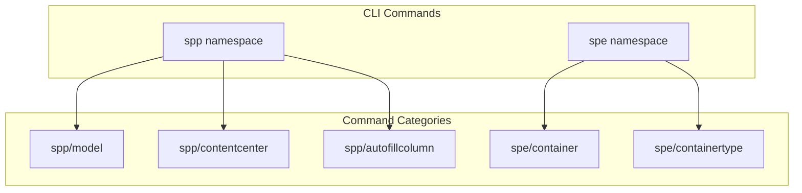
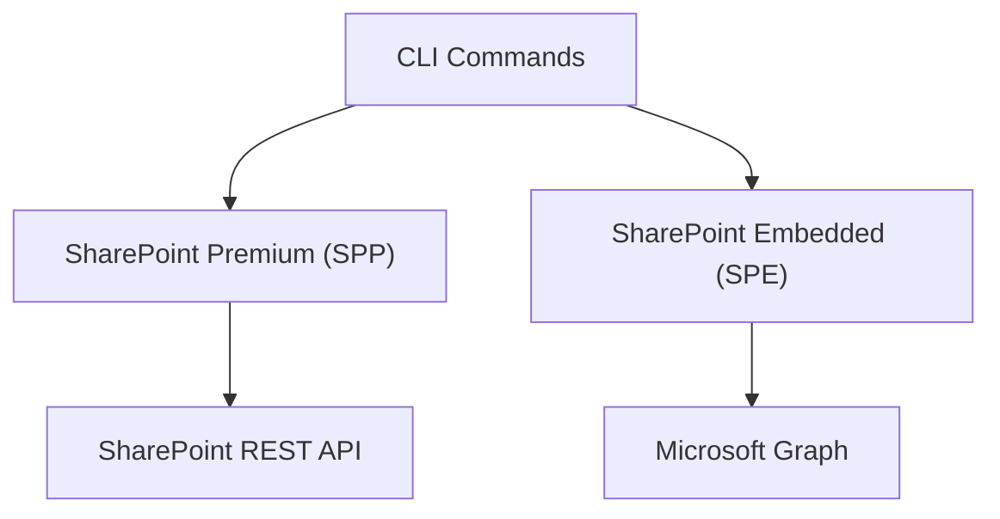
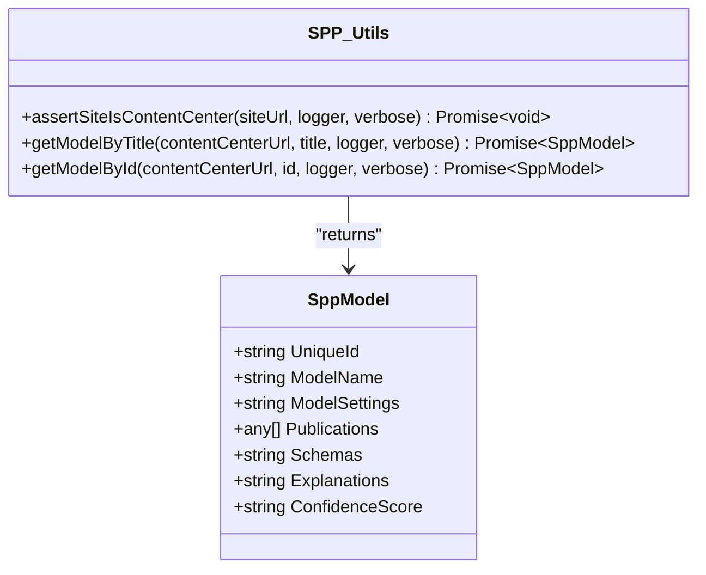
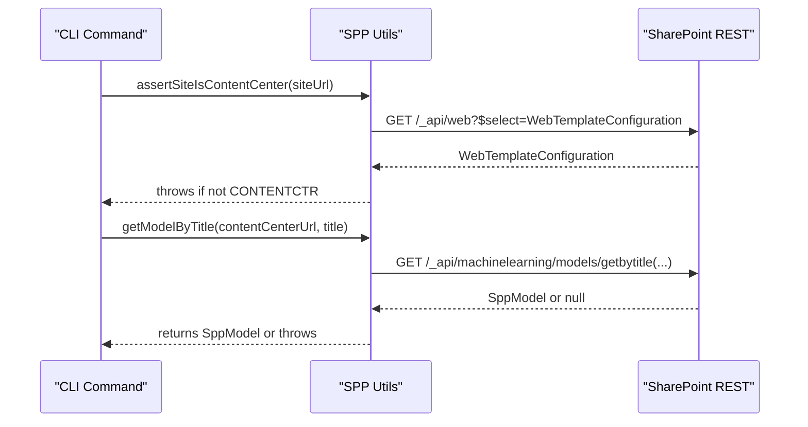
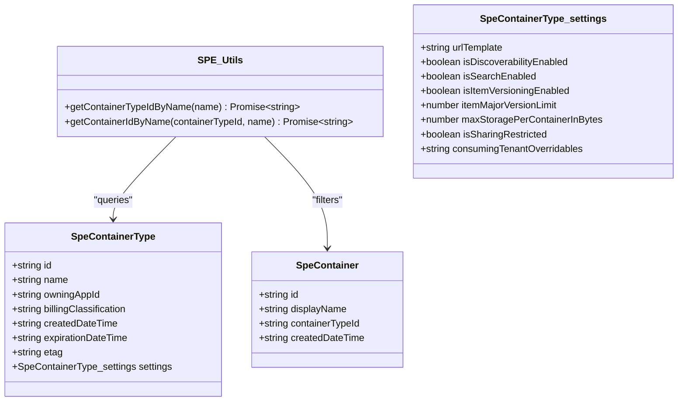
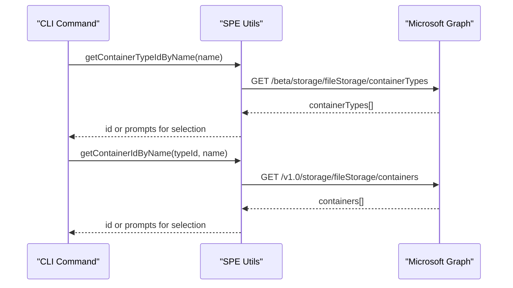
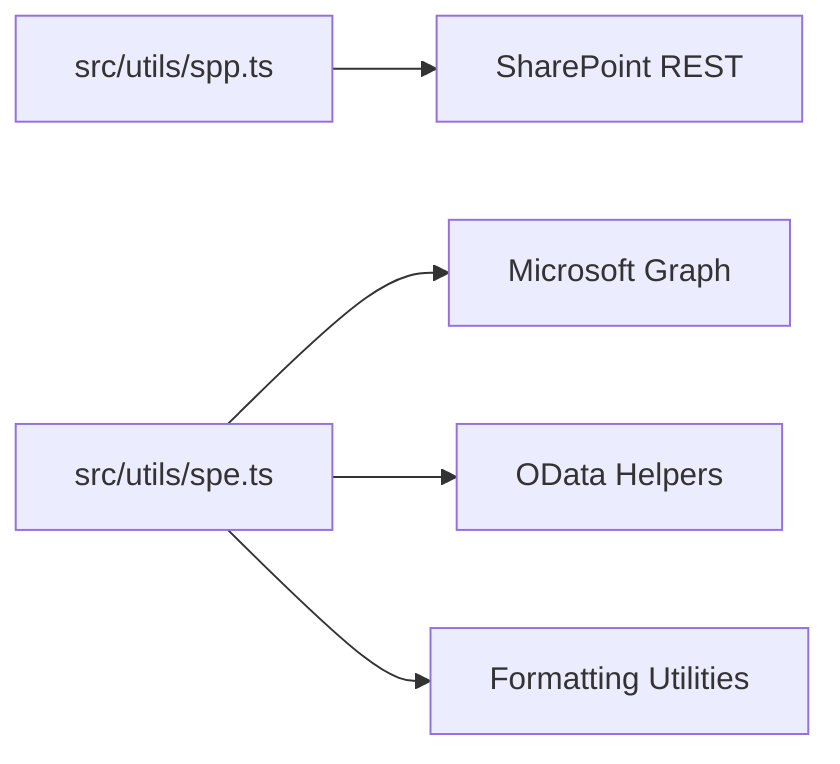

# SharePoint Premium & Advanced Features

<cite>
**Referenced Files in This Document**
- [README.md](file://README.md)
- [sidebars.ts](file://docs/src/config/sidebars.ts)
- [spp.ts](file://src/utils/spp.ts)
- [spe.ts](file://src/utils/spe.ts)
</cite>

## Table of Contents
1. [Introduction](#introduction)
2. [Project Structure](#project-structure)
3. [Core Components](#core-components)
4. [Architecture Overview](#architecture-overview)
5. [Detailed Component Analysis](#detailed-component-analysis)
6. [Dependency Analysis](#dependency-analysis)
7. [Performance Considerations](#performance-considerations)
8. [Troubleshooting Guide](#troubleshooting-guide)
9. [Conclusion](#conclusion)
10. [Appendices](#appendices)

## Introduction
This document explains SharePoint Premium (SPP) and SharePoint Embedded (SPE) capabilities available through the CLI for Microsoft 365. It covers:
- SPE container lifecycle and type management
- Permission and recycle-bin operations for SPE containers
- SPP model operations and content center management
- Authentication and licensing considerations
- Practical examples and troubleshooting guidance

The CLI supports unified login and multiple authentication methods, enabling secure access to SharePoint Premium services.

**Section sources**
- [README.md:68-110](file://README.md#L68-L110)

## Project Structure
The CLI organizes SharePoint Premium and SharePoint Embedded commands under dedicated namespaces:
- SharePoint Premium (spp): model management and content center operations
- SharePoint Embedded (spe): container and container-type management

These are reflected in the documentation sidebar configuration.

**Diagram sources**
- [sidebars.ts:2137-2212](file://docs/src/config/sidebars.ts#L2137-L2212)
- [sidebars.ts:4279-4323](file://docs/src/config/sidebars.ts#L4279-L4323)

**Section sources**
- [sidebars.ts:2137-2212](file://docs/src/config/sidebars.ts#L2137-L2212)
- [sidebars.ts:4279-4323](file://docs/src/config/sidebars.ts#L4279-L4323)

## Core Components
- SharePoint Premium (SPP) utilities:
  - Content center validation
  - Model retrieval by title or unique ID via SharePoint REST
- SharePoint Embedded (SPE) utilities:
  - Container type resolution by name
  - Container resolution by name within a container type
  - Shared dependency on OData helpers and formatting utilities

These utilities encapsulate API interactions and provide reusable helpers for command implementations.

**Section sources**
- [spp.ts:15-103](file://src/utils/spp.ts#L15-L103)
- [spe.ts:34-78](file://src/utils/spe.ts#L34-L78)

## Architecture Overview
The CLI integrates with SharePoint Premium and SharePoint Embedded through:
- SharePoint REST APIs for SPP model and content center operations
- Microsoft Graph for SPE container and container-type operations

**Diagram sources**
- [spp.ts:23-102](file://src/utils/spp.ts#L23-L102)
- [spe.ts:32-77](file://src/utils/spe.ts#L32-L77)

## Detailed Component Analysis

### SharePoint Premium (SPP) Utilities
The SPP utility module provides helpers to:
- Verify a site is a content center
- Retrieve a model by title or unique ID

**Diagram sources**
- [spp.ts:5-13](file://src/utils/spp.ts#L5-L13)
- [spp.ts:15-103](file://src/utils/spp.ts#L15-L103)

Key behaviors:
- Content center validation uses SharePoint REST to check the web template configuration.
- Model retrieval normalizes the model title to include a classifier suffix when missing and performs REST GET requests to fetch model metadata.

**Diagram sources**
- [spp.ts:23-77](file://src/utils/spp.ts#L23-L77)

**Section sources**
- [spp.ts:15-103](file://src/utils/spp.ts#L15-L103)

### SharePoint Embedded (SPE) Utilities
The SPE utility module provides helpers to:
- Resolve a container type ID by name
- Resolve a container ID by name within a given container type

**Diagram sources**
- [spe.ts:5-31](file://src/utils/spe.ts#L5-L31)
- [spe.ts:34-78](file://src/utils/spe.ts#L34-L78)

Behavior highlights:
- Uses Microsoft Graph endpoints to enumerate container types and containers.
- Handles ambiguity by prompting for a single result when multiple matches are found.

**Diagram sources**
- [spe.ts:40-77](file://src/utils/spe.ts#L40-L77)

**Section sources**
- [spe.ts:34-78](file://src/utils/spe.ts#L34-L78)

### Practical Examples

- SharePoint Premium (SPP)
  - List content centers: use the content center list command under the spp namespace.
  - Apply or manage models: use model commands under the spp namespace to list, get, apply, and remove models.
  - Autofill column settings: use the autofillcolumn set command under the spp namespace.

- SharePoint Embedded (SPE)
  - List and manage containers: use container commands under the spe namespace to add, get, list, remove, activate, and manage recycle bin items.
  - Manage container types: use containertype commands under the spe namespace to add, get, list, and remove container types.

These commands are documented in the CLI’s command reference and are organized in the documentation sidebar.

**Section sources**
- [sidebars.ts:2137-2212](file://docs/src/config/sidebars.ts#L2137-L2212)
- [sidebars.ts:4279-4323](file://docs/src/config/sidebars.ts#L4279-L4323)

## Dependency Analysis
- SPP depends on SharePoint REST to validate content centers and retrieve models.
- SPE depends on Microsoft Graph to resolve container types and containers.
- Both modules rely on shared utilities for formatting and OData handling.

**Diagram sources**
- [spp.ts:23-102](file://src/utils/spp.ts#L23-L102)
- [spe.ts:32-77](file://src/utils/spe.ts#L32-L77)

**Section sources**
- [spp.ts:23-102](file://src/utils/spp.ts#L23-L102)
- [spe.ts:32-77](file://src/utils/spe.ts#L32-L77)

## Performance Considerations
- Minimize repeated REST/Graph calls by caching resolved IDs when appropriate.
- Use filtering and selective field retrieval to reduce payload sizes.
- Batch operations where supported by underlying APIs.

## Troubleshooting Guide
Common issues and resolutions:
- Content center validation failures:
  - Ensure the target site uses the content center template; otherwise, the assertion will fail.
- Model not found:
  - Confirm the model title ends with the expected classifier suffix or pass the unique ID.
- Container or container type not found:
  - Verify the name exists and is unique; if multiple matches exist, select the intended one.
- Authentication errors:
  - Use the supported authentication methods and ensure the application registration grants required permissions.

**Section sources**
- [spp.ts:23-41](file://src/utils/spp.ts#L23-L41)
- [spp.ts:50-77](file://src/utils/spp.ts#L50-L77)
- [spe.ts:40-77](file://src/utils/spe.ts#L40-L77)

## Conclusion
The CLI for Microsoft 365 provides robust support for SharePoint Premium and SharePoint Embedded through dedicated namespaces and utilities. SPP utilities enable content center validation and model management via SharePoint REST, while SPE utilities facilitate container and container-type operations using Microsoft Graph. Proper authentication and licensing are essential for accessing these advanced capabilities.

## Appendices

### Authentication and Licensing Notes
- The CLI supports multiple authentication methods suitable for enterprise environments.
- Premium features require appropriate licensing and permissions aligned with SharePoint Premium and SharePoint Embedded offerings.

**Section sources**
- [README.md:100-107](file://README.md#L100-L107)