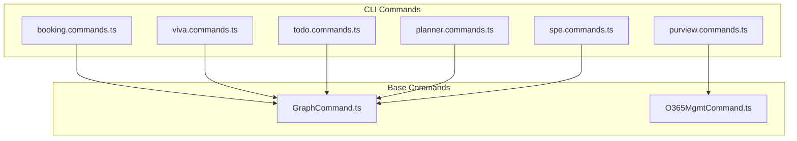
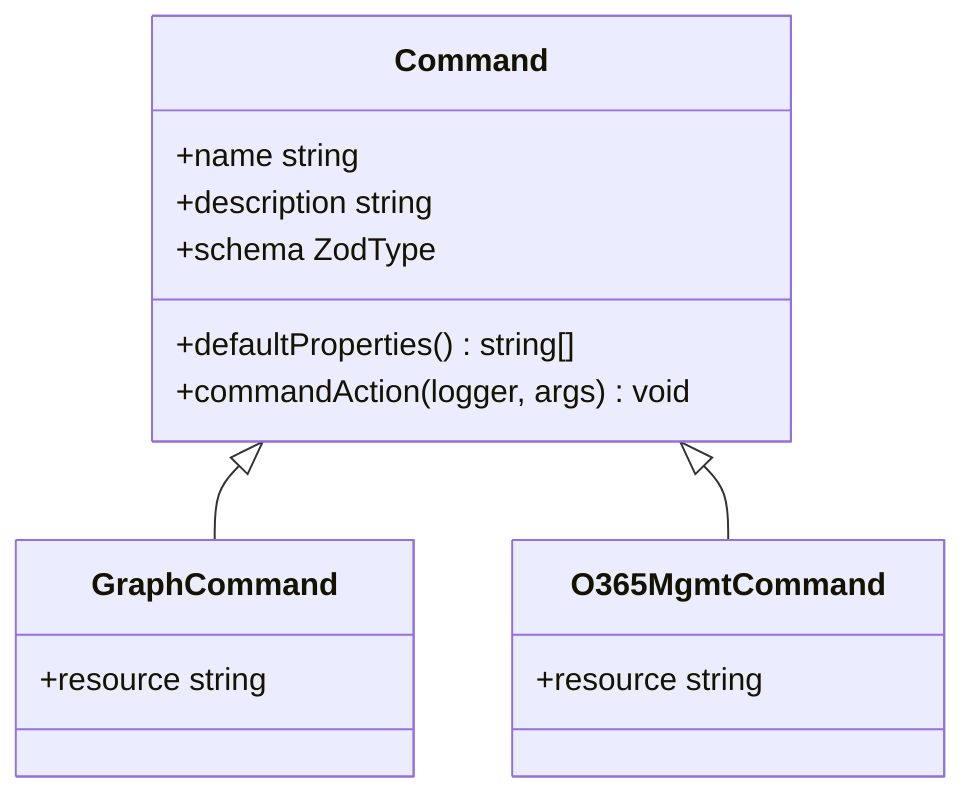
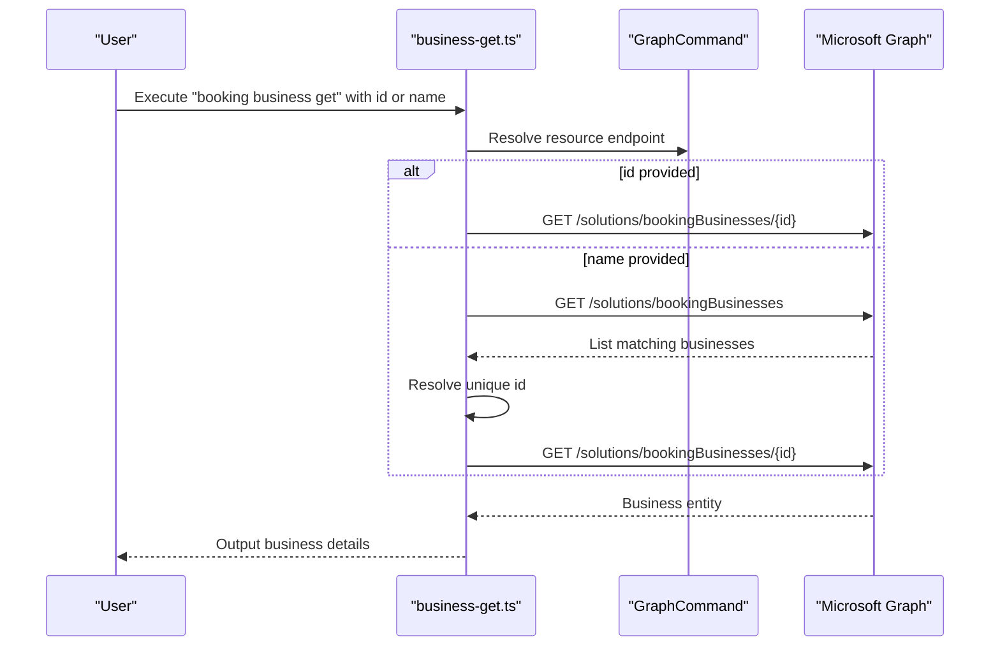
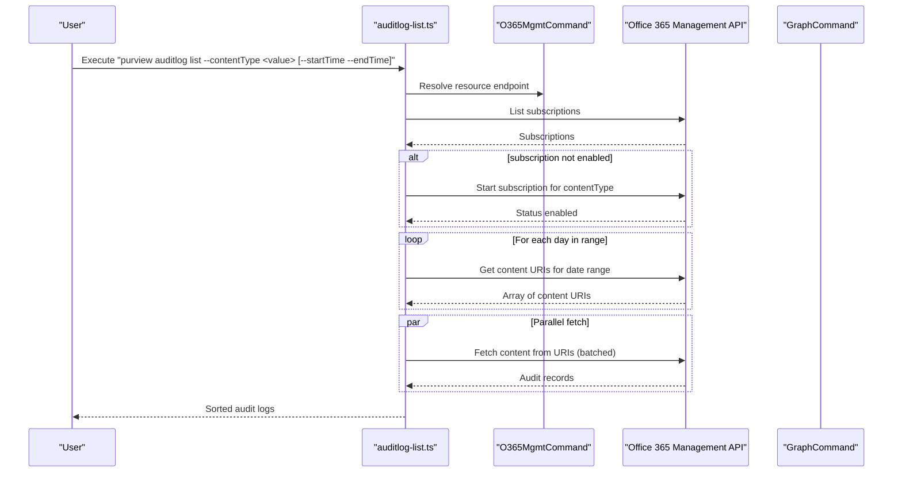
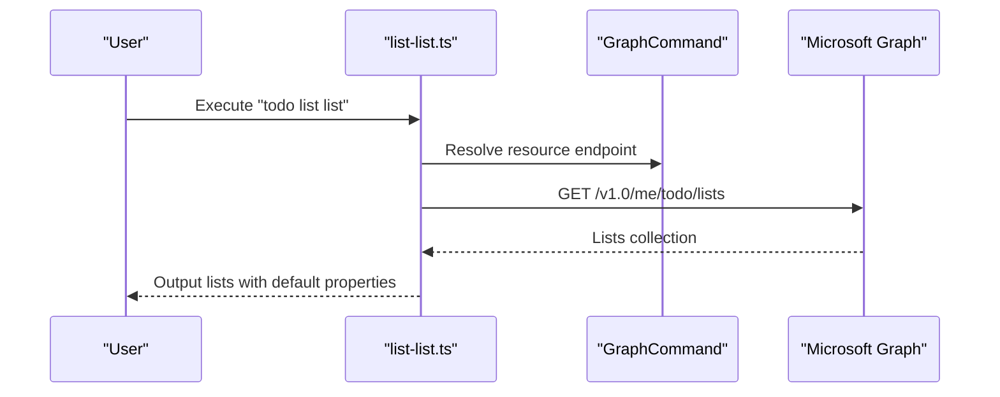
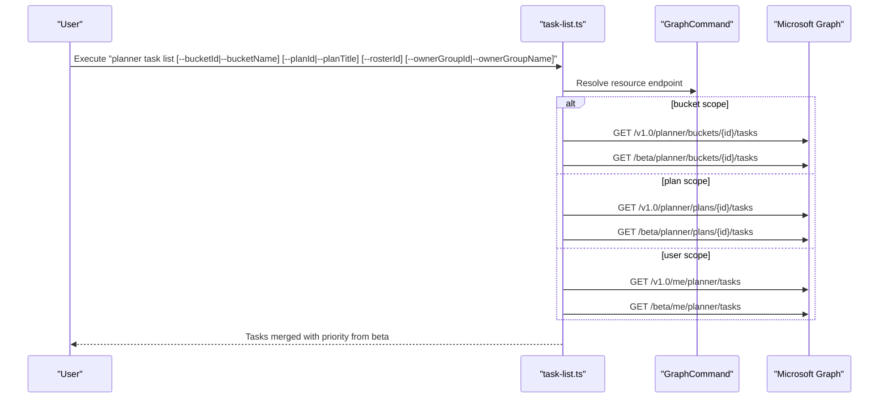
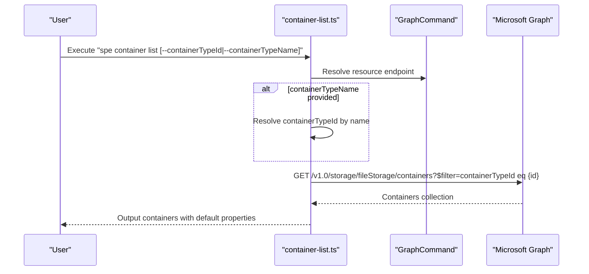
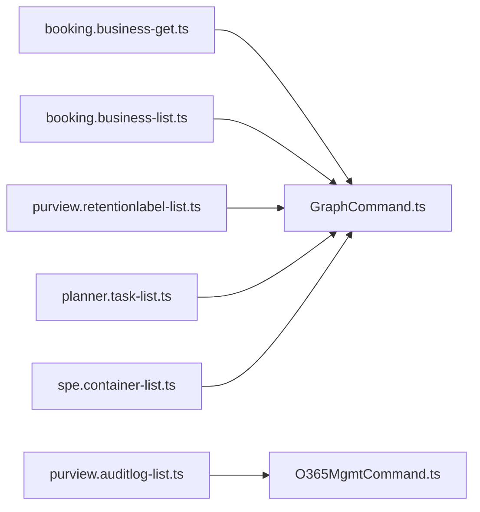

# Specialized Services

<cite>
**Referenced Files in This Document**
- [commands.ts](file://src/m365/booking/commands.ts)
- [business-get.ts](file://src/m365/booking/commands/business/business-get.ts)
- [business-list.ts](file://src/m365/booking/commands/business/business-list.ts)
- [commands.ts](file://src/m365/purview/commands.ts)
- [auditlog-list.ts](file://src/m365/purview/commands/auditlog/auditlog-list.ts)
- [retentionlabel-list.ts](file://src/m365/purview/commands/retentionlabel/retentionlabel-list.ts)
- [commands.ts](file://src/m365/viva/commands.ts)
- [commands.ts](file://src/m365/todo/commands.ts)
- [list-list.ts](file://src/m365/todo/commands/list/list-list.ts)
- [commands.ts](file://src/m365/planner/commands.ts)
- [task-list.ts](file://src/m365/planner/commands/task/task-list.ts)
- [commands.ts](file://src/m365/spe/commands.ts)
- [container-list.ts](file://src/m365/spe/commands/container/container-list.ts)
- [GraphCommand.ts](file://src/m365/base/GraphCommand.ts)
- [O365MgmtCommand.ts](file://src/m365/base/O365MgmtCommand.ts)
</cite>

## Table of Contents
1. [Introduction](#introduction)
2. [Project Structure](#project-structure)
3. [Core Components](#core-components)
4. [Architecture Overview](#architecture-overview)
5. [Detailed Component Analysis](#detailed-component-analysis)
6. [Dependency Analysis](#dependency-analysis)
7. [Performance Considerations](#performance-considerations)
8. [Troubleshooting Guide](#troubleshooting-guide)
9. [Conclusion](#conclusion)

## Introduction
This document describes the specialized services supported by the CLI for Microsoft 365 focused on Bookings, Microsoft Purview (compliance), Microsoft Viva (Connections and Engage), Microsoft To Do, Microsoft Planner, and SharePoint Embedded/Premium (Spe). It explains each service’s unique functionality, API integration patterns, and administrative requirements. It also covers authentication and permission models used by the CLI to integrate with core Microsoft 365 services.

## Project Structure
The CLI organizes specialized services under dedicated namespaces:
- booking: Business retrieval and listing for Microsoft Bookings
- purview: Compliance operations including audit logs, retention labels, sensitivity labels, and threat assessments
- viva: Platform operations for Connections and Engage (including communities, messages, roles, reporting, and user operations)
- todo: To Do list and task management
- planner: Plan, bucket, roster, and task operations
- spe: SharePoint Embedded/Premium container and containertype operations

Each service exposes a commands registry and individual command implementations that inherit from shared base command classes to standardize authentication and HTTP interactions.

**Diagram sources**
- [commands.ts:1-6](file://src/m365/booking/commands.ts#L1-L6)
- [commands.ts:1-25](file://src/m365/purview/commands.ts#L1-L25)
- [commands.ts:1-34](file://src/m365/viva/commands.ts#L1-L34)
- [commands.ts:1-14](file://src/m365/todo/commands.ts#L1-L14)
- [commands.ts:1-36](file://src/m365/planner/commands.ts#L1-L36)
- [commands.ts:1-17](file://src/m365/spe/commands.ts#L1-L17)
- [GraphCommand.ts:1-7](file://src/m365/base/GraphCommand.ts#L1-L7)
- [O365MgmtCommand.ts:1-7](file://src/m365/base/O365MgmtCommand.ts#L1-L7)

**Section sources**
- [commands.ts:1-6](file://src/m365/booking/commands.ts#L1-L6)
- [commands.ts:1-25](file://src/m365/purview/commands.ts#L1-L25)
- [commands.ts:1-34](file://src/m365/viva/commands.ts#L1-L34)
- [commands.ts:1-14](file://src/m365/todo/commands.ts#L1-L14)
- [commands.ts:1-36](file://src/m365/planner/commands.ts#L1-L36)
- [commands.ts:1-17](file://src/m365/spe/commands.ts#L1-L17)
- [GraphCommand.ts:1-7](file://src/m365/base/GraphCommand.ts#L1-L7)
- [O365MgmtCommand.ts:1-7](file://src/m365/base/O365MgmtCommand.ts#L1-L7)

## Core Components
- Bookings
  - business get: Retrieve a specific Microsoft Bookings business by ID or name
  - business list: List all Bookings businesses for the tenant
- Purview
  - auditlog list: List tenant audit logs across content types with time window validation and subscription management
  - retentionlabel list: List retention labels from the security labels endpoint
- Viva
  - connections app create: Create a Viva Connections app
  - engage community add/get/list/remove/set: Manage communities
  - engage community user add/list/remove: Manage community users
  - engage message add/get/list/remove/like set: Manage messages and likes
  - engage network list: List networks
  - engage report activity counts and details: Analytics reports
  - engage role list/member list/remove: Role management
  - engage search: Search within Engage
  - engage user get/list: User operations
- To Do
  - list add/get/list/remove/set: Manage To Do lists
  - task add/get/list/remove/set: Manage tasks
- Planner
  - bucket add/get/list/set/remove: Bucket lifecycle
  - plan add/get/list/remove/set: Plan lifecycle
  - roster add/get/member add/get/list/remove/remove: Roster lifecycle
  - task add/checklistitem add/list/remove/get/list/reference add/list/remove/remove/set: Task lifecycle and references
  - tenant settings list/set: Tenant-level settings
- SharePoint Embedded/Premium (Spe)
  - container activate/add/get/list/remove: Container lifecycle
  - container permission list: List permissions
  - container recyclebinitem list/remove/restore: Recycle bin operations
  - containertype add/get/list/remove: Containertype lifecycle

**Section sources**
- [commands.ts:1-6](file://src/m365/booking/commands.ts#L1-L6)
- [commands.ts:1-25](file://src/m365/purview/commands.ts#L1-L25)
- [commands.ts:1-34](file://src/m365/viva/commands.ts#L1-L34)
- [commands.ts:1-14](file://src/m365/todo/commands.ts#L1-L14)
- [commands.ts:1-36](file://src/m365/planner/commands.ts#L1-L36)
- [commands.ts:1-17](file://src/m365/spe/commands.ts#L1-L17)

## Architecture Overview
The CLI composes commands per service namespace and delegates HTTP interactions to base command classes:
- GraphCommand: Targets Microsoft Graph endpoints for delegated or application permissions
- O365MgmtCommand: Targets Office 365 Management Activity API for compliance audit log ingestion

**Diagram sources**
- [GraphCommand.ts:1-7](file://src/m365/base/GraphCommand.ts#L1-L7)
- [O365MgmtCommand.ts:1-7](file://src/m365/base/O365MgmtCommand.ts#L1-L7)

## Detailed Component Analysis

### Microsoft Bookings
Bookings commands enable discovery and retrieval of Bookings business entities via Microsoft Graph.

**Diagram sources**
- [business-get.ts:43-60](file://src/m365/booking/commands/business/business-get.ts#L43-L60)
- [business-list.ts:28-38](file://src/m365/booking/commands/business/business-list.ts#L28-L38)
- [GraphCommand.ts:4-6](file://src/m365/base/GraphCommand.ts#L4-L6)

Key capabilities:
- Retrieve a specific business by ID or resolve ID from display name
- List all businesses for the tenant with default properties

Operational notes:
- Uses Microsoft Graph Solutions endpoint for Bookings
- Validates mutual exclusivity of id/name selection
- Handles multiple matches by prompting for selection

**Section sources**
- [business-get.ts:1-94](file://src/m365/booking/commands/business/business-get.ts#L1-L94)
- [business-list.ts:1-41](file://src/m365/booking/commands/business/business-list.ts#L1-L41)
- [GraphCommand.ts:1-7](file://src/m365/base/GraphCommand.ts#L1-L7)

### Microsoft Purview (Compliance)
Purview commands focus on compliance operations including audit log retrieval and retention label management.

**Diagram sources**
- [auditlog-list.ts:106-157](file://src/m365/purview/commands/auditlog/auditlog-list.ts#L106-L157)
- [auditlog-list.ts:159-179](file://src/m365/purview/commands/auditlog/auditlog-list.ts#L159-L179)
- [auditlog-list.ts:181-202](file://src/m365/purview/commands/auditlog/auditlog-list.ts#L181-L202)
- [auditlog-list.ts:204-231](file://src/m365/purview/commands/auditlog/auditlog-list.ts#L204-L231)
- [O365MgmtCommand.ts:4-6](file://src/m365/base/O365MgmtCommand.ts#L4-L6)

Additional compliance operations:
- retentionlabel list: Lists retention labels from the security labels endpoint

**Section sources**
- [auditlog-list.ts:1-244](file://src/m365/purview/commands/auditlog/auditlog-list.ts#L1-L244)
- [retentionlabel-list.ts:1-38](file://src/m365/purview/commands/retentionlabel/retentionlabel-list.ts#L1-L38)
- [O365MgmtCommand.ts:1-7](file://src/m365/base/O365MgmtCommand.ts#L1-L7)

### Microsoft Viva (Connections and Engage)
Viva commands support Connections and Engage operations including communities, messages, roles, analytics, and user management.

Highlights:
- Connections app create
- Engage community add/get/list/remove/set and user management
- Engage message add/get/list/remove/like set
- Engage network list, role list/member list/remove, search, and user get/list
- Engage report activity counts and details

Note: The Engage command set is declared in the Viva commands registry. Some subcommands may require additional setup or permissions depending on tenant configuration.

**Section sources**
- [commands.ts:1-34](file://src/m365/viva/commands.ts#L1-L34)

### Microsoft To Do
To Do commands enable list and task management against Microsoft Graph.

**Diagram sources**
- [list-list.ts:20-28](file://src/m365/todo/commands/list/list-list.ts#L20-L28)
- [GraphCommand.ts:4-6](file://src/m365/base/GraphCommand.ts#L4-L6)

**Section sources**
- [list-list.ts:1-31](file://src/m365/todo/commands/list/list-list.ts#L1-L31)
- [commands.ts:1-14](file://src/m365/todo/commands.ts#L1-L14)
- [GraphCommand.ts:1-7](file://src/m365/base/GraphCommand.ts#L1-L7)

### Microsoft Planner
Planner commands support plan, bucket, roster, and task operations, including cross-version merging for task priority.

**Diagram sources**
- [task-list.ts:128-160](file://src/m365/planner/commands/task/task-list.ts#L128-L160)
- [task-list.ts:193-205](file://src/m365/planner/commands/task/task-list.ts#L193-L205)
- [GraphCommand.ts:4-6](file://src/m365/base/GraphCommand.ts#L4-L6)

**Section sources**
- [task-list.ts:1-208](file://src/m365/planner/commands/task/task-list.ts#L1-L208)
- [commands.ts:1-36](file://src/m365/planner/commands.ts#L1-L36)
- [GraphCommand.ts:1-7](file://src/m365/base/GraphCommand.ts#L1-L7)

### SharePoint Embedded/Premium (Spe)
Spe commands manage containers and containertypes within SharePoint Embedded/Premium.

**Diagram sources**
- [container-list.ts:82-95](file://src/m365/spe/commands/container/container-list.ts#L82-L95)
- [GraphCommand.ts:4-6](file://src/m365/base/GraphCommand.ts#L4-L6)

**Section sources**
- [container-list.ts:1-106](file://src/m365/spe/commands/container/container-list.ts#L1-L106)
- [commands.ts:1-17](file://src/m365/spe/commands.ts#L1-L17)
- [GraphCommand.ts:1-7](file://src/m365/base/GraphCommand.ts#L1-L7)

## Dependency Analysis
- Authentication and resource routing
  - GraphCommand targets Microsoft Graph for delegated/application scenarios
  - O365MgmtCommand targets Office 365 Management Activity API for compliance audit log ingestion
- Cross-service dependencies
  - Planner merges task metadata from beta endpoints to enrich task priority
  - Bookings resolves business identifiers from list responses when name is provided
  - Spe resolves container type identifiers by name when not provided

**Diagram sources**
- [business-get.ts:1-94](file://src/m365/booking/commands/business/business-get.ts#L1-L94)
- [business-list.ts:1-41](file://src/m365/booking/commands/business/business-list.ts#L1-L41)
- [auditlog-list.ts:1-244](file://src/m365/purview/commands/auditlog/auditlog-list.ts#L1-L244)
- [retentionlabel-list.ts:1-38](file://src/m365/purview/commands/retentionlabel/retentionlabel-list.ts#L1-L38)
- [task-list.ts:1-208](file://src/m365/planner/commands/task/task-list.ts#L1-L208)
- [container-list.ts:1-106](file://src/m365/spe/commands/container/container-list.ts#L1-L106)
- [GraphCommand.ts:1-7](file://src/m365/base/GraphCommand.ts#L1-L7)
- [O365MgmtCommand.ts:1-7](file://src/m365/base/O365MgmtCommand.ts#L1-L7)

**Section sources**
- [business-get.ts:1-94](file://src/m365/booking/commands/business/business-get.ts#L1-L94)
- [business-list.ts:1-41](file://src/m365/booking/commands/business/business-list.ts#L1-L41)
- [auditlog-list.ts:1-244](file://src/m365/purview/commands/auditlog/auditlog-list.ts#L1-L244)
- [retentionlabel-list.ts:1-38](file://src/m365/purview/commands/retentionlabel/retentionlabel-list.ts#L1-L38)
- [task-list.ts:1-208](file://src/m365/planner/commands/task/task-list.ts#L1-L208)
- [container-list.ts:1-106](file://src/m365/spe/commands/container/container-list.ts#L1-L106)
- [GraphCommand.ts:1-7](file://src/m365/base/GraphCommand.ts#L1-L7)
- [O365MgmtCommand.ts:1-7](file://src/m365/base/O365MgmtCommand.ts#L1-L7)

## Performance Considerations
- Batched retrieval
  - Purview audit log retrieval batches content URI requests and parallelizes content fetching to improve throughput
- Cross-version enrichment
  - Planner merges task data from beta endpoints to augment task priority, reducing subsequent queries
- Pagination and defaults
  - Listing commands use OData pagination helpers and sensible default properties to limit payload sizes

[No sources needed since this section provides general guidance]

## Troubleshooting Guide
Common operational issues and resolutions:
- Bookings business resolution
  - If multiple businesses match a provided name, the CLI prompts for selection; ensure unique display names or specify the ID
- Purview audit log ingestion
  - Ensure the tenant has a valid subscription for the requested content type; the command attempts to enable the subscription if not present
  - Respect time window constraints: start time cannot be more than seven days in the past (with small margin), and end time cannot be in the future
- Planner task scope
  - Use mutually exclusive filters (bucket vs plan vs user) and provide required identifiers (IDs or names) for plan/roster/group resolution
- Spe container filtering
  - Provide either containerTypeId or containerTypeName; if name is provided, the command resolves the ID internally

**Section sources**
- [business-get.ts:36-41](file://src/m365/booking/commands/business/business-get.ts#L36-L41)
- [auditlog-list.ts:67-104](file://src/m365/purview/commands/auditlog/auditlog-list.ts#L67-L104)
- [auditlog-list.ts:159-179](file://src/m365/purview/commands/auditlog/auditlog-list.ts#L159-L179)
- [task-list.ts:89-126](file://src/m365/planner/commands/task/task-list.ts#L89-L126)
- [container-list.ts:62-80](file://src/m365/spe/commands/container/container-list.ts#L62-L80)

## Conclusion
The CLI’s specialized services provide targeted capabilities across Bookings, Purview, Viva, To Do, Planner, and SharePoint Embedded/Premium. Commands leverage standardized base classes for consistent authentication and HTTP interactions, while service-specific logic handles unique API patterns, validation, and enrichment. Administrators can automate business management, compliance auditing, community operations, task orchestration, and embedded storage administration with predictable command surfaces and robust error handling.