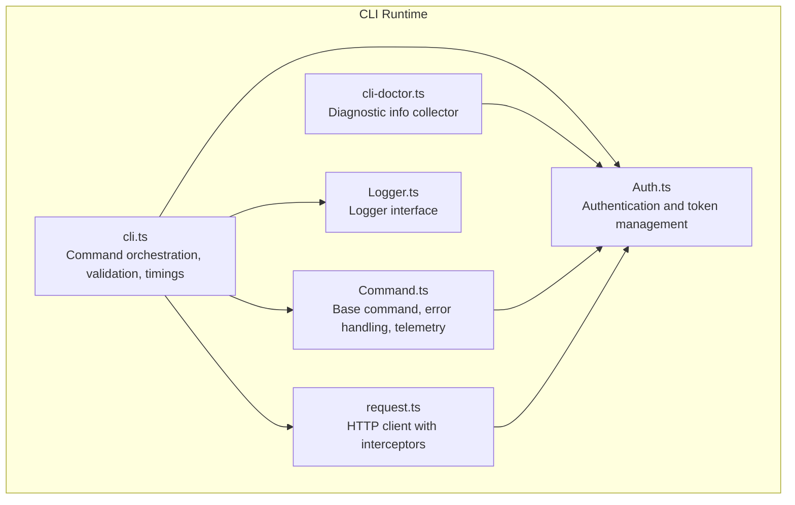
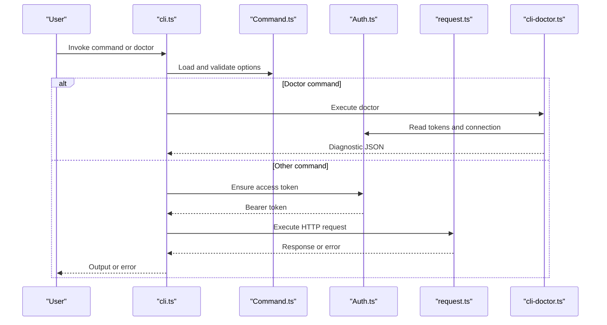
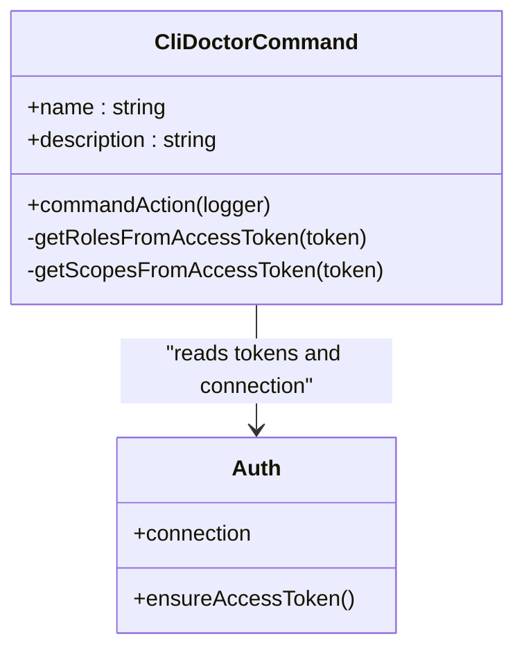
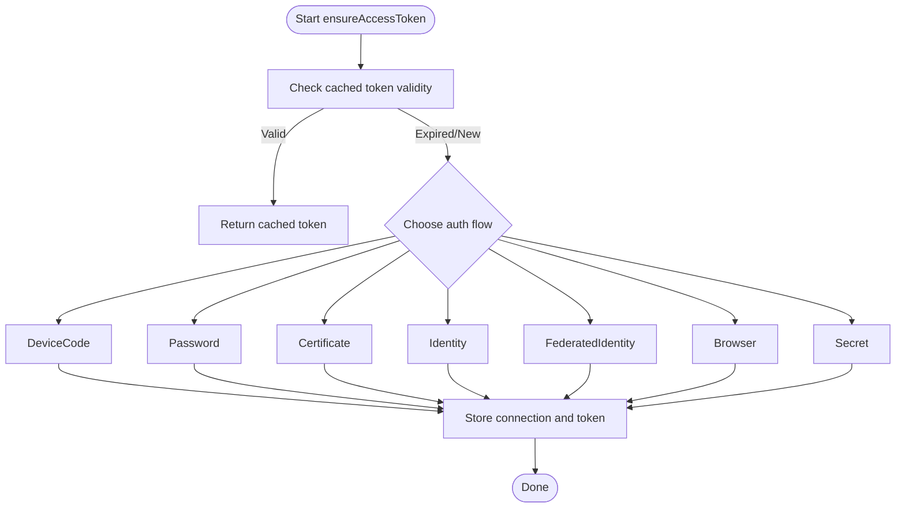
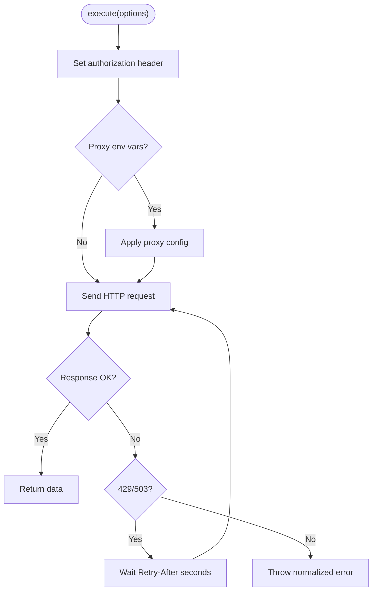
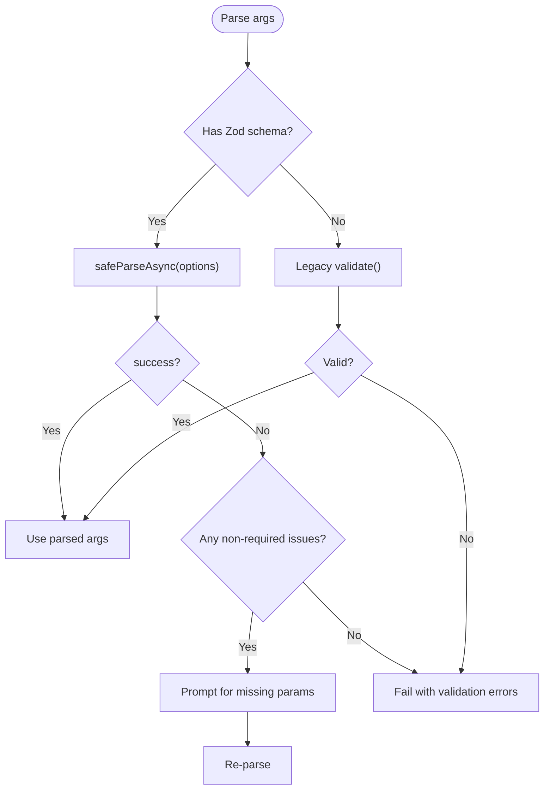
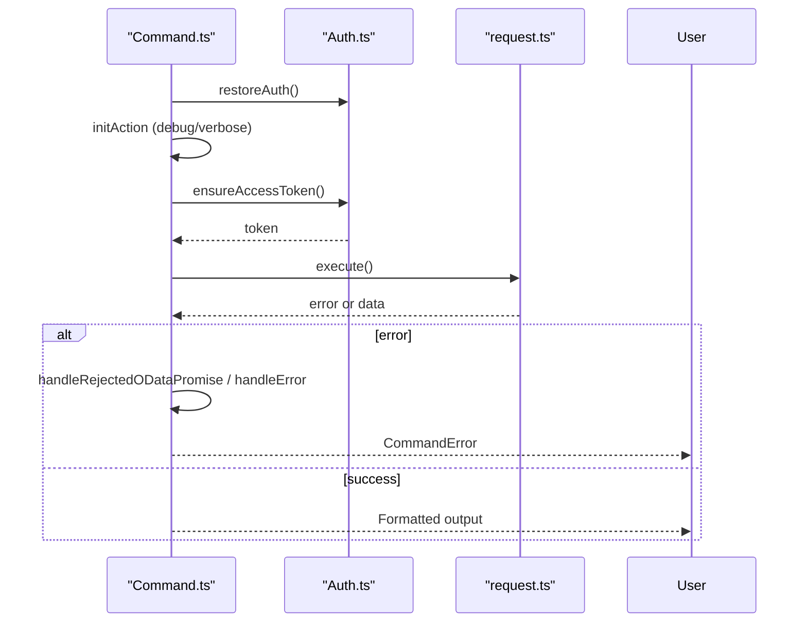
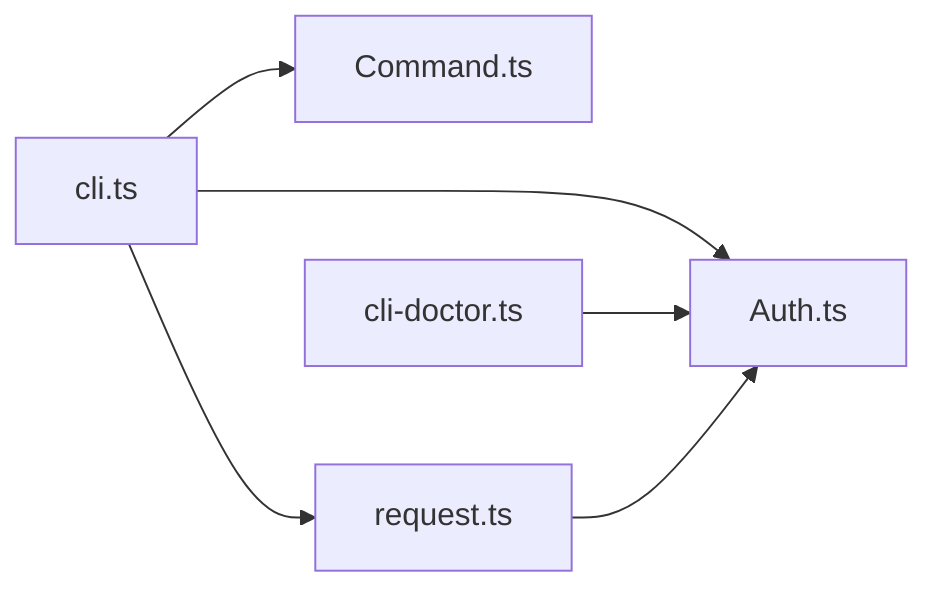

# Troubleshooting & Diagnostics

<cite>
**Referenced Files in This Document**
- [cli.ts](file://src/cli/cli.ts)
- [Logger.ts](file://src/cli/Logger.ts)
- [cli-doctor.ts](file://src/m365/cli/commands/cli-doctor.ts)
- [cli-doctor.mdx](file://docs/docs/cmd/cli/cli-doctor.mdx)
- [Auth.ts](file://src/Auth.ts)
- [Command.ts](file://src/Command.ts)
- [validation.ts](file://src/utils/validation.ts)
- [request.ts](file://src/request.ts)
</cite>

## Table of Contents
1. [Introduction](#introduction)
2. [Project Structure](#project-structure)
3. [Core Components](#core-components)
4. [Architecture Overview](#architecture-overview)
5. [Detailed Component Analysis](#detailed-component-analysis)
6. [Dependency Analysis](#dependency-analysis)
7. [Performance Considerations](#performance-considerations)
8. [Troubleshooting Guide](#troubleshooting-guide)
9. [Conclusion](#conclusion)
10. [Appendices](#appendices)

## Introduction
This document provides comprehensive troubleshooting and diagnostics guidance for CLI for Microsoft 365. It focuses on diagnosing and resolving common issues such as authentication failures, permission errors, connectivity problems, validation errors, response parsing issues, timeouts, rate limiting, and platform-specific concerns. It also explains diagnostic tools (CLI doctor), verbose logging, performance profiling, and practical workflows to analyze logs and escalate issues effectively.

## Project Structure
The CLI orchestrates command execution, argument parsing, validation, authentication, and HTTP requests. Diagnostic capabilities are surfaced via the CLI doctor command, while verbose logging and timing metrics are integrated into the CLI core.

**Diagram sources**
- [cli.ts:89-252](file://src/cli/cli.ts#L89-L252)
- [Logger.ts:1-14](file://src/cli/Logger.ts#L1-L14)
- [request.ts:14-254](file://src/request.ts#L14-L254)
- [Auth.ts:119-305](file://src/Auth.ts#L119-L305)
- [Command.ts:303-327](file://src/Command.ts#L303-L327)
- [cli-doctor.ts:36-68](file://src/m365/cli/commands/cli-doctor.ts#L36-L68)

**Section sources**
- [cli.ts:89-252](file://src/cli/cli.ts#L89-L252)
- [Logger.ts:1-14](file://src/cli/Logger.ts#L1-L14)
- [request.ts:14-254](file://src/request.ts#L14-L254)
- [Auth.ts:119-305](file://src/Auth.ts#L119-L305)
- [Command.ts:303-327](file://src/Command.ts#L303-L327)
- [cli-doctor.ts:36-68](file://src/m365/cli/commands/cli-doctor.ts#L36-L68)

## Core Components
- CLI orchestration and validation: parses arguments, loads commands, validates options, handles prompts, and executes actions. It also collects timing metrics for performance profiling.
- Authentication: manages multiple auth modes (device code, password, certificate, identity, federated identity, browser), token caching, and cloud endpoint routing.
- HTTP client: wraps Axios with interceptors for request/response logging, proxy support, throttling retries, and error normalization.
- Command base: provides standardized error handling, output formatting, telemetry, and validation helpers.
- CLI doctor: gathers environment diagnostics (OS, Node version, CLI version, auth mode, tenant, roles, scopes, config) without exposing sensitive data.

**Section sources**
- [cli.ts:179-233](file://src/cli/cli.ts#L179-L233)
- [Auth.ts:197-305](file://src/Auth.ts#L197-L305)
- [request.ts:155-225](file://src/request.ts#L155-L225)
- [Command.ts:303-483](file://src/Command.ts#L303-L483)
- [cli-doctor.ts:36-68](file://src/m365/cli/commands/cli-doctor.ts#L36-L68)

## Architecture Overview
The CLI integrates authentication, request handling, and command execution. Diagnostics are centralized in the doctor command, which reads auth state and environment configuration.

**Diagram sources**
- [cli.ts:117-252](file://src/cli/cli.ts#L117-L252)
- [Command.ts:303-327](file://src/Command.ts#L303-L327)
- [Auth.ts:197-305](file://src/Auth.ts#L197-L305)
- [request.ts:155-225](file://src/request.ts#L155-L225)
- [cli-doctor.ts:36-68](file://src/m365/cli/commands/cli-doctor.ts#L36-L68)

## Detailed Component Analysis

### CLI Doctor Command
The doctor command collects environment diagnostics (OS, Node version, CLI version, auth mode, tenant, roles, scopes, and CLI config) and prints them in multiple output formats. It reads the current auth connection and access tokens to extract roles and scopes.

**Diagram sources**
- [cli-doctor.ts:27-116](file://src/m365/cli/commands/cli-doctor.ts#L27-L116)
- [Auth.ts:143-150](file://src/Auth.ts#L143-L150)

**Section sources**
- [cli-doctor.ts:36-68](file://src/m365/cli/commands/cli-doctor.ts#L36-L68)
- [cli-doctor.mdx:33-105](file://docs/docs/cmd/cli/cli-doctor.mdx#L33-L105)

### Authentication and Token Management
The Auth module supports multiple auth flows and manages token lifetimes, silent acquisition, and cloud endpoint routing. It logs debug messages during token acquisition and handles environment-specific identities (Azure Functions, Azure VMs, Azure Cloud Shell).

**Diagram sources**
- [Auth.ts:197-305](file://src/Auth.ts#L197-L305)
- [Auth.ts:440-452](file://src/Auth.ts#L440-L452)
- [Auth.ts:570-703](file://src/Auth.ts#L570-L703)

**Section sources**
- [Auth.ts:197-305](file://src/Auth.ts#L197-L305)
- [Auth.ts:440-452](file://src/Auth.ts#L440-L452)
- [Auth.ts:570-703](file://src/Auth.ts#L570-L703)

### HTTP Client and Throttling
The request client adds interceptors for verbose logging, sets bearer tokens, applies proxies from environment variables, and automatically retries on throttling (429/503) with a delay derived from Retry-After.

**Diagram sources**
- [request.ts:155-225](file://src/request.ts#L155-L225)

**Section sources**
- [request.ts:155-225](file://src/request.ts#L155-L225)

### Validation and Parameter Handling
The CLI validates options using Zod schemas or legacy validators. It supports prompting for missing required parameters and coerces boolean values. Validation failures are reported with actionable messages.

**Diagram sources**
- [cli.ts:179-233](file://src/cli/cli.ts#L179-L233)

**Section sources**
- [cli.ts:179-233](file://src/cli/cli.ts#L179-L233)
- [validation.ts:12-24](file://src/utils/validation.ts#L12-L24)

### Error Handling and Output Formatting
Commands standardize error reporting via CommandError and normalize various response formats. The CLI also formats output (JSON, CSV, Markdown, Text) and supports JMESPath queries.

**Diagram sources**
- [Command.ts:303-483](file://src/Command.ts#L303-L483)
- [Auth.ts:197-305](file://src/Auth.ts#L197-L305)
- [request.ts:155-225](file://src/request.ts#L155-L225)

**Section sources**
- [Command.ts:360-471](file://src/Command.ts#L360-L471)
- [cli.ts:602-705](file://src/cli/cli.ts#L602-L705)

## Dependency Analysis
- CLI depends on Command for validation and output formatting, Auth for tokens, and request for HTTP operations.
- Doctor depends on Auth to read current connection and tokens.
- Request depends on Auth for bearer tokens and on environment variables for proxy configuration.

**Diagram sources**
- [cli.ts:89-252](file://src/cli/cli.ts#L89-L252)
- [Command.ts:303-327](file://src/Command.ts#L303-L327)
- [Auth.ts:197-305](file://src/Auth.ts#L197-L305)
- [request.ts:155-225](file://src/request.ts#L155-L225)
- [cli-doctor.ts:36-68](file://src/m365/cli/commands/cli-doctor.ts#L36-L68)

**Section sources**
- [cli.ts:89-252](file://src/cli/cli.ts#L89-L252)
- [Command.ts:303-327](file://src/Command.ts#L303-L327)
- [Auth.ts:197-305](file://src/Auth.ts#L197-L305)
- [request.ts:155-225](file://src/request.ts#L155-L225)
- [cli-doctor.ts:36-68](file://src/m365/cli/commands/cli-doctor.ts#L36-L68)

## Performance Considerations
- Timings: The CLI collects timing metrics for options processing, validation, command execution, total runtime, and API calls. Enable debug mode to print timings.
- Logging overhead: Verbose logging increases I/O; use only when diagnosing issues.
- Network retries: Automatic throttling retry reduces manual intervention under rate limits.
- Output formatting: Complex JMESPath queries and large datasets increase processing time; prefer targeted queries and appropriate output formats.

[No sources needed since this section provides general guidance]

## Troubleshooting Guide

### Authentication Failures
Symptoms
- “Log in to Microsoft 365 first” errors
- Expired or missing access tokens
- Auth flow hangs or fails

Resolution steps
- Run the doctor command to confirm auth mode, tenant, and scopes.
- Re-authenticate using the appropriate flow (device code, password, certificate, identity, federated identity).
- Verify environment variables for cloud type and identity contexts.
- Check proxy and firewall settings if device code flow requires browser access.

**Section sources**
- [Command.ts:313-315](file://src/Command.ts#L313-L315)
- [Auth.ts:197-305](file://src/Auth.ts#L197-L305)
- [cli-doctor.ts:36-68](file://src/m365/cli/commands/cli-doctor.ts#L36-L68)

### Permission Errors
Symptoms
- 403 Forbidden responses
- “It’s not possible to use @meid/@meusername with application permissions”

Resolution steps
- Confirm scopes and roles extracted by the doctor command.
- Adjust CLI configuration or re-authenticate with the correct app registration and granted scopes.
- Replace @me placeholders with explicit identifiers when using application permissions.

**Section sources**
- [Command.ts:518-521](file://src/Command.ts#L518-L521)
- [cli-doctor.ts:70-89](file://src/m365/cli/commands/cli-doctor.ts#L70-L89)

### Connectivity Problems
Symptoms
- DNS resolution failures
- Proxy authentication errors
- Timeout or throttling (429/503)

Resolution steps
- Configure HTTP(S)_PROXY environment variables; the client auto-applies proxy settings.
- Review firewall rules for outbound HTTPS traffic to Microsoft endpoints.
- On throttling, the client retries automatically after the indicated delay; enable debug to observe retry behavior.

**Section sources**
- [request.ts:189-193](file://src/request.ts#L189-L193)
- [request.ts:208-221](file://src/request.ts#L208-L221)

### Validation and Parameter Issues
Symptoms
- “Required option X not specified”
- Boolean coercion errors
- Unknown option errors

Resolution steps
- Use the doctor command to review current CLI configuration and environment.
- Enable verbose mode to see detailed logs and stack traces.
- Fix boolean values to accepted forms; remove unknown options or add them to command definitions.

**Section sources**
- [cli.ts:179-233](file://src/cli/cli.ts#L179-L233)
- [validation.ts:143-145](file://src/utils/validation.ts#L143-L145)

### Response Parsing Issues
Symptoms
- Unexpected JSON shapes
- OData or Graph error messages
- JMESPath query errors

Resolution steps
- Inspect raw request/response logs in debug mode.
- Simplify JMESPath queries or disable filtering to isolate issues.
- Normalize error handling using the command’s built-in helpers.

**Section sources**
- [Command.ts:360-471](file://src/Command.ts#L360-L471)
- [cli.ts:620-635](file://src/cli/cli.ts#L620-L635)

### Performance and Rate Limiting
Symptoms
- Slow command execution
- Frequent throttling

Resolution steps
- Enable debug mode to review timings for options, validation, command, and API calls.
- Reduce concurrent operations and refine queries.
- Respect Retry-After delays; avoid aggressive retries.

**Section sources**
- [cli.ts:254-262](file://src/cli/cli.ts#L254-L262)
- [request.ts:208-221](file://src/request.ts#L208-L221)

### Platform and Shell Compatibility
Symptoms
- Shell-specific quoting issues
- Environment variable not applied

Resolution steps
- Use double quotes around values containing spaces or special characters.
- Verify environment variables are exported in the current shell session.
- Prefer POSIX-compatible shells when scripting.

[No sources needed since this section provides general guidance]

### Escalation and Support
When escalating issues:
- Attach doctor output and debug logs.
- Include OS, Node, CLI, and auth mode details.
- Provide the failing command and a minimal reproducible example.

[No sources needed since this section provides general guidance]

## Conclusion
Use the CLI doctor to quickly gather environment diagnostics, enable debug mode for verbose logging, and leverage built-in validation and error handling to resolve most issues. For persistent problems, collect timings, review request/response logs, and follow escalation guidelines with complete context.

[No sources needed since this section summarizes without analyzing specific files]

## Appendices

### Diagnostic Tools and Commands
- CLI doctor: Collects OS, Node, CLI version, auth mode, tenant, roles, scopes, and CLI config.
- Debug mode: Enables verbose logging and request/response interceptors.
- Timings: Summarizes processing stages for performance profiling.

**Section sources**
- [cli-doctor.mdx:33-105](file://docs/docs/cmd/cli/cli-doctor.mdx#L33-L105)
- [cli.ts:254-262](file://src/cli/cli.ts#L254-L262)
- [request.ts:29-70](file://src/request.ts#L29-L70)